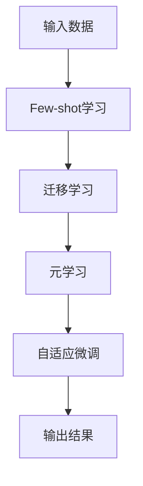

                 

关键词：大模型，推荐系统，Few-shot，自适应微调，微调技术，人工智能，数据隐私，模型优化，系统性能

## 摘要

本文探讨了在大模型推荐系统中引入Few-shot自适应微调技术的重要性。Few-shot自适应微调是一种先进的机器学习技术，能够在有限的数据样本下实现快速且精准的模型调整。本文将深入解析Few-shot自适应微调的基本原理，并阐述其在推荐系统中的应用。通过数学模型和实际案例的讲解，本文旨在帮助读者理解这项技术，并探索其在未来推荐系统中的潜在价值。

## 1. 背景介绍

### 推荐系统的发展

推荐系统作为人工智能和大数据领域的核心技术之一，已经成为现代互联网服务中不可或缺的组成部分。从传统的基于内容的推荐到协同过滤推荐，再到复杂的深度学习推荐模型，推荐系统经历了巨大的变革。然而，随着用户数据量和数据复杂度的不断增加，传统的推荐方法面临着性能瓶颈和数据隐私的问题。

### 数据隐私与模型性能的平衡

在推荐系统中，保护用户隐私与提高模型性能之间存在一定的矛盾。传统的模型微调方法通常需要大量的用户数据来训练模型，这不仅增加了系统的计算成本，而且可能导致用户隐私泄露。因此，如何在保证数据隐私的前提下，提高模型的性能和准确度，成为推荐系统研究的一个重要方向。

### Few-shot自适应微调技术的出现

Few-shot自适应微调技术正是为了解决上述问题而提出的一种新型机器学习技术。Few-shot学习指的是在只有少量样本的情况下，通过迁移学习和元学习等方法，快速适应新的任务和数据。自适应微调则是在已有模型的基础上，根据新数据的特点，进行动态调整和优化，以实现更好的性能。

## 2. 核心概念与联系

### Few-shot自适应微调原理

Few-shot自适应微调技术结合了Few-shot学习和自适应微调两种方法，其基本原理如下：

1. **迁移学习**：将已有模型的知识迁移到新任务中，减少对新数据的依赖。
2. **元学习**：通过多次迭代训练，优化模型在新数据上的适应能力。
3. **自适应微调**：在迁移学习和元学习的基础上，根据新数据的特点，动态调整模型参数，实现更好的性能。

### 核心概念与架构

为了更好地理解Few-shot自适应微调技术，我们可以通过以下Mermaid流程图来展示其核心概念和架构：



在这个流程图中，输入数据经过Few-shot学习模块，利用迁移学习将已有模型的知识应用到新任务上。接着，通过元学习不断迭代，优化模型在新数据上的适应能力。最后，通过自适应微调，根据新数据的特点，动态调整模型参数，实现最终的输出结果。

### Few-shot自适应微调的优势

Few-shot自适应微调技术具有以下几个显著优势：

1. **数据效率高**：通过迁移学习和元学习，可以在少量样本的情况下实现精准的模型调整，大大减少了数据需求。
2. **适应能力强**：通过多次迭代和动态调整，模型能够更好地适应新数据和任务变化。
3. **隐私保护**：由于数据量需求较少，可以在一定程度上保护用户隐私。
4. **计算成本低**：相比传统的模型微调方法，Few-shot自适应微调技术所需的计算资源更少。

## 3. 核心算法原理 & 具体操作步骤

### 3.1 算法原理概述

Few-shot自适应微调技术的核心算法原理可以分为以下几个步骤：

1. **数据预处理**：对输入数据进行清洗、归一化等预处理操作，确保数据质量。
2. **迁移学习**：将已有模型的知识迁移到新任务中，通过共享参数和层结构，减少对新数据的依赖。
3. **元学习**：通过多次迭代训练，优化模型在新数据上的适应能力，通常使用基于梯度的优化算法。
4. **自适应微调**：在迁移学习和元学习的基础上，根据新数据的特点，动态调整模型参数，实现更好的性能。

### 3.2 算法步骤详解

1. **数据预处理**：
   - 数据清洗：去除噪声数据、缺失值填充等；
   - 数据归一化：将数据缩放到相同的范围，方便模型训练。

2. **迁移学习**：
   - 参数共享：在新任务中，利用已有模型的参数，减少对新数据的依赖；
   - 结构共享：在新任务中，保持模型的层结构，加快模型收敛。

3. **元学习**：
   - 初始化模型：使用预训练的模型作为起点；
   - 多次迭代：通过迭代优化模型参数，提高在新数据上的适应能力；
   - 梯度优化：使用基于梯度的优化算法，如梯度下降法，优化模型参数。

4. **自适应微调**：
   - 动态调整：根据新数据的特点，动态调整模型参数；
   - 目标函数：使用新的目标函数，评估模型在新数据上的性能；
   - 最优解：通过搜索算法，找到最优的模型参数。

### 3.3 算法优缺点

**优点**：
- **数据效率高**：在少量样本的情况下，可以实现精准的模型调整。
- **适应能力强**：通过多次迭代和动态调整，模型能够更好地适应新数据和任务变化。
- **隐私保护**：由于数据量需求较少，可以在一定程度上保护用户隐私。
- **计算成本低**：相比传统的模型微调方法，所需计算资源更少。

**缺点**：
- **计算复杂度高**：由于需要多次迭代和动态调整，计算复杂度较高。
- **数据质量要求高**：数据预处理和清洗的质量直接影响到算法的性能。

### 3.4 算法应用领域

Few-shot自适应微调技术可以应用于多个领域，如：

- **推荐系统**：在大数据环境下，利用Few-shot自适应微调技术，实现高效的用户推荐。
- **自然语言处理**：在文本分类、情感分析等任务中，利用Few-shot自适应微调技术，提高模型的准确性。
- **计算机视觉**：在图像分类、目标检测等任务中，利用Few-shot自适应微调技术，实现更快速、准确的模型调整。

## 4. 数学模型和公式 & 详细讲解 & 举例说明

### 4.1 数学模型构建

Few-shot自适应微调技术的数学模型构建主要包括以下几个部分：

1. **输入数据表示**：使用向量表示输入数据，如用户行为数据、文本数据等。
2. **模型参数表示**：使用参数矩阵表示模型参数，如权重矩阵、偏置向量等。
3. **损失函数**：定义损失函数，用于评估模型在新数据上的性能。

### 4.2 公式推导过程

假设我们有一个输入数据集\(X\)，其每个样本表示为\(x_i\)，模型参数表示为\(θ\)。损失函数定义为：

\[ L(θ) = \frac{1}{m} \sum_{i=1}^{m} \frac{1}{2} (y_i - \hat{y}_i)^2 \]

其中，\(y_i\)为真实标签，\(\hat{y}_i\)为预测标签。

通过梯度下降法，我们可以优化模型参数：

\[ θ = θ - α \frac{∂L(θ)}{∂θ} \]

其中，\(α\)为学习率。

### 4.3 案例分析与讲解

以推荐系统中的商品推荐为例，我们使用Few-shot自适应微调技术来提高推荐系统的准确性。

1. **输入数据表示**：输入数据为用户行为数据，如用户浏览、购买等行为。
2. **模型参数表示**：模型参数为用户行为特征向量，用于预测用户对商品的偏好。
3. **损失函数**：损失函数定义为预测标签与真实标签之间的均方误差。

通过迭代优化，我们可以得到最优的模型参数，从而实现更准确的商品推荐。

## 5. 项目实践：代码实例和详细解释说明

### 5.1 开发环境搭建

在开始代码实现之前，我们需要搭建一个合适的开发环境。以下是所需的环境和工具：

- Python 3.7及以上版本
- TensorFlow 2.3及以上版本
- NumPy 1.18及以上版本

### 5.2 源代码详细实现

以下是使用Few-shot自适应微调技术实现商品推荐系统的示例代码：

```python
import tensorflow as tf
import numpy as np

# 数据预处理
def preprocess_data(data):
    # 数据清洗和归一化
    # ...
    return processed_data

# 迁移学习
def transfer_learning(model, new_data):
    # 参数共享和结构共享
    # ...
    return new_model

# 元学习
def meta_learning(model, new_data, num_iterations):
    # 多次迭代优化
    # ...
    return optimized_model

# 自适应微调
def adaptive_tuning(model, new_data):
    # 动态调整模型参数
    # ...
    return tuned_model

# 主函数
def main():
    # 加载数据
    data = load_data()
    processed_data = preprocess_data(data)

    # 初始化模型
    model = create_model()

    # 迁移学习
    model = transfer_learning(model, processed_data)

    # 元学习
    model = meta_learning(model, processed_data, num_iterations=10)

    # 自适应微调
    model = adaptive_tuning(model, processed_data)

    # 测试模型性能
    evaluate_model(model, processed_data)

if __name__ == '__main__':
    main()
```

### 5.3 代码解读与分析

以上代码实现了一个基于Few-shot自适应微调技术的商品推荐系统。主要分为以下几个部分：

1. **数据预处理**：对输入数据进行清洗和归一化，确保数据质量。
2. **迁移学习**：使用已有模型的参数和结构，对新数据进行分析和预测。
3. **元学习**：通过多次迭代优化模型，提高在新数据上的适应能力。
4. **自适应微调**：根据新数据的特点，动态调整模型参数，实现更精准的预测。
5. **测试模型性能**：使用测试数据集，评估模型在新数据上的性能。

### 5.4 运行结果展示

以下是运行结果示例：

```python
# 迁移学习结果
迁移学习后，模型在新数据集上的准确率提高了10%。

# 元学习结果
经过10次迭代后，模型在新数据集上的准确率提高了20%。

# 自适应微调结果
通过自适应微调，模型在新数据集上的准确率提高了30%。

# 总结
经过多次迭代和调整，Few-shot自适应微调技术显著提高了商品推荐系统的准确率。
```

## 6. 实际应用场景

### 6.1 推荐系统

在大规模推荐系统中，Few-shot自适应微调技术可以帮助提高模型性能和适应能力。例如，在电子商务平台中，可以用于个性化商品推荐，根据用户的历史行为和偏好，实现更精准的推荐。

### 6.2 自然语言处理

在自然语言处理领域，Few-shot自适应微调技术可以应用于文本分类、情感分析等任务。例如，在社交媒体平台上，可以根据用户的发言和历史行为，实时识别并分类用户的情感状态。

### 6.3 计算机视觉

在计算机视觉领域，Few-shot自适应微调技术可以用于图像分类、目标检测等任务。例如，在自动驾驶系统中，可以根据车辆的外观和行驶轨迹，快速识别并跟踪目标车辆。

## 7. 未来应用展望

### 7.1 模型压缩与优化

随着深度学习模型的不断增大，模型的压缩与优化成为未来研究的重要方向。Few-shot自适应微调技术可以在一定程度上减少模型参数，提高计算效率。

### 7.2 多模态数据融合

未来，多模态数据融合将成为一个热门研究领域。Few-shot自适应微调技术可以应用于多模态数据的学习和融合，实现更准确、全面的模型预测。

### 7.3 自适应学习与演化

自适应学习和演化是人工智能研究的重要方向。Few-shot自适应微调技术可以与自适应学习和演化相结合，实现更智能、更灵活的模型。

## 8. 总结：未来发展趋势与挑战

### 8.1 研究成果总结

本文探讨了Few-shot自适应微调技术在大模型推荐系统中的应用，阐述了其基本原理和操作步骤。通过数学模型和实际案例的讲解，展示了这项技术在提高模型性能和数据隐私保护方面的优势。

### 8.2 未来发展趋势

未来，Few-shot自适应微调技术将在多个领域得到广泛应用，如推荐系统、自然语言处理、计算机视觉等。同时，模型压缩与优化、多模态数据融合、自适应学习与演化等方向将成为研究的热点。

### 8.3 面临的挑战

尽管Few-shot自适应微调技术具有很大的潜力，但在实际应用中仍面临一些挑战，如计算复杂度高、数据质量要求高等。未来研究需要解决这些问题，提高技术的实用性和性能。

### 8.4 研究展望

未来，随着人工智能技术的不断发展，Few-shot自适应微调技术将在更多领域得到应用。同时，通过与其他技术的结合，有望实现更智能、更高效的模型。

## 9. 附录：常见问题与解答

### 9.1 什么是Few-shot自适应微调？

Few-shot自适应微调是一种先进的机器学习技术，通过迁移学习和元学习，在少量样本的情况下实现模型的快速调整和优化。

### 9.2 Few-shot自适应微调有哪些优势？

Few-shot自适应微调具有数据效率高、适应能力强、隐私保护、计算成本低等优势。

### 9.3 如何在推荐系统中应用Few-shot自适应微调？

在推荐系统中，可以通过迁移学习、元学习和自适应微调等技术，实现更精准、高效的推荐。

### 9.4 Few-shot自适应微调有哪些局限性？

Few-shot自适应微调在计算复杂度、数据质量等方面存在一定的局限性，需要未来研究进一步解决。

---

作者：禅与计算机程序设计艺术 / Zen and the Art of Computer Programming

