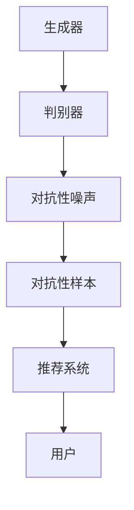

                 

关键词：大模型、推荐系统、对抗学习、优化策略、数学模型、实际应用

## 摘要

随着互联网和大数据技术的发展，推荐系统已经成为提高用户满意度、增强用户体验的关键技术。然而，随着模型复杂度的增加，推荐系统面临着准确性和多样性之间的权衡问题。对抗学习作为一种有效的优化策略，在提升大模型推荐系统的性能方面显示出巨大的潜力。本文将详细介绍对抗学习的核心概念、算法原理、数学模型及其在实际应用中的优化策略。通过对具体案例的分析，本文旨在为推荐系统的研究者和开发者提供有价值的指导和建议。

## 1. 背景介绍

### 1.1 推荐系统的发展

推荐系统（Recommendation System）是一种信息过滤技术，旨在根据用户的兴趣和行为，向用户推荐他们可能感兴趣的内容或商品。推荐系统的发展可以追溯到20世纪90年代，随着互联网的普及和数据量的增加，推荐系统逐渐成为电子商务、社交媒体、在线视频等领域的核心技术。

传统推荐系统主要采用基于内容的推荐（Content-Based Filtering）和协同过滤（Collaborative Filtering）方法。基于内容的推荐通过分析用户历史行为和偏好，结合推荐对象的特征信息，生成个性化的推荐列表。协同过滤则通过分析用户之间的相似性，利用其他用户的评价或行为来预测目标用户的偏好。

然而，随着推荐系统应用场景的复杂化和数据规模的扩大，传统的推荐方法逐渐暴露出一些局限性。首先，基于内容的推荐方法在处理冷启动问题（即新用户或新物品无历史数据时）时效果不佳。其次，协同过滤方法容易受到数据稀疏性的影响，导致推荐结果过于集中和单一，缺乏多样性。此外，传统方法在处理大规模数据和高维度特征时，计算效率和可扩展性也面临挑战。

### 1.2 大模型的崛起

为了解决传统推荐系统面临的上述问题，研究人员开始探索基于深度学习的大模型。深度学习作为一种具有强大表示能力和泛化能力的机器学习技术，在图像识别、自然语言处理、语音识别等领域取得了显著的成功。近年来，随着计算能力和数据量的不断提升，深度学习在大模型推荐系统中的应用逐渐成为研究热点。

大模型推荐系统通过引入深度学习技术，可以从海量数据中自动提取高维特征，实现用户和物品的精细化刻画。此外，大模型推荐系统可以通过端到端的方式实现推荐流程的自动化，提高推荐系统的计算效率和可扩展性。然而，大模型的引入也带来了一些新的挑战，如过拟合、模型解释性不足等。

### 1.3 对抗学习的应用

对抗学习（Adversarial Learning）是一种近年来在机器学习领域崭露头角的新型优化策略。对抗学习的核心思想是通过引入对抗性噪声或对抗性样本，增加模型的鲁棒性和泛化能力。对抗学习在大模型推荐系统中的应用，主要体现在以下几个方面：

1. **提高推荐准确性**：对抗学习可以通过引入对抗性噪声，增加模型在训练过程中对噪声的鲁棒性，从而提高推荐系统的准确性。

2. **增强多样性**：对抗学习可以通过对抗性训练，使模型在生成推荐结果时具有更高的多样性，避免推荐结果过于集中和单一。

3. **缓解冷启动问题**：对抗学习可以通过对抗性生成对抗网络（Generative Adversarial Networks，GAN）等技术，生成新用户或新物品的潜在特征，缓解冷启动问题。

4. **提高模型鲁棒性**：对抗学习可以通过引入对抗性样本，增强模型对恶意攻击和异常数据的鲁棒性。

本文将围绕对抗学习在大模型推荐系统中的应用，详细介绍其核心概念、算法原理、数学模型及其优化策略。通过对具体案例的分析，本文旨在为推荐系统的研究者和开发者提供有价值的参考和启示。

## 2. 核心概念与联系

### 2.1 对抗学习的定义

对抗学习是一种基于生成对抗网络（Generative Adversarial Networks，GAN）的新型优化策略。GAN由生成器（Generator）和判别器（Discriminator）两个神经网络组成，通过对抗性训练实现模型的优化。生成器的目标是生成与真实数据分布相近的数据，而判别器的目标是区分真实数据和生成数据。在训练过程中，生成器和判别器相互竞争，最终实现模型的收敛。

### 2.2 对抗学习的核心概念

对抗学习的核心概念主要包括以下几个方面：

1. **生成器（Generator）**：生成器的任务是生成与真实数据分布相近的数据。在推荐系统中，生成器可以用于生成新用户或新物品的潜在特征，从而缓解冷启动问题。

2. **判别器（Discriminator）**：判别器的任务是区分真实数据和生成数据。在推荐系统中，判别器可以用于评估推荐结果的准确性。

3. **对抗性噪声（Adversarial Noise）**：对抗性噪声是在数据中引入的一种噪声，用于增加模型对噪声的鲁棒性。

4. **对抗性样本（Adversarial Sample）**：对抗性样本是通过对抗性噪声处理后的数据，用于测试模型的鲁棒性。

### 2.3 对抗学习的联系

对抗学习与推荐系统的联系主要体现在以下几个方面：

1. **提高推荐准确性**：通过引入对抗性噪声，对抗学习可以增加模型在训练过程中对噪声的鲁棒性，从而提高推荐系统的准确性。

2. **增强多样性**：对抗学习可以通过对抗性训练，使模型在生成推荐结果时具有更高的多样性，避免推荐结果过于集中和单一。

3. **缓解冷启动问题**：对抗学习可以通过对抗性生成对抗网络（GAN）等技术，生成新用户或新物品的潜在特征，缓解冷启动问题。

4. **提高模型鲁棒性**：对抗学习可以通过引入对抗性样本，增强模型对恶意攻击和异常数据的鲁棒性。

### 2.4 Mermaid 流程图

为了更好地理解对抗学习在推荐系统中的应用，下面给出一个简单的 Mermaid 流程图，展示对抗学习的基本流程。



在这个流程图中，生成器生成潜在特征，判别器用于评估潜在特征的准确性，对抗性噪声用于增加模型的鲁棒性，对抗性样本用于测试模型的鲁棒性，最终推荐系统根据潜在特征生成推荐结果，用户接收推荐结果并进行反馈。

## 3. 核心算法原理 & 具体操作步骤

### 3.1 算法原理概述

对抗学习算法的核心思想是通过生成器和判别器的对抗性训练，提高模型的鲁棒性和泛化能力。具体来说，生成器的目标是在判别器难以区分的情况下生成逼真的数据，而判别器的目标是在生成器生成的数据与真实数据难以区分的情况下准确区分二者。通过这种对抗性训练，模型可以逐步收敛，达到优化推荐系统的目的。

### 3.2 算法步骤详解

对抗学习算法主要包括以下步骤：

1. **初始化模型**：初始化生成器和判别器的参数。

2. **生成对抗性噪声**：对输入数据生成对抗性噪声，增加模型的鲁棒性。

3. **生成对抗性样本**：将对抗性噪声添加到输入数据中，生成对抗性样本。

4. **训练生成器和判别器**：通过对抗性样本训练生成器和判别器，使生成器生成更逼真的数据，判别器能更准确地区分真实数据和生成数据。

5. **评估模型性能**：通过测试集评估生成器和判别器的性能，根据评估结果调整模型参数。

6. **生成推荐结果**：使用训练好的生成器和判别器生成推荐结果，用户接收推荐结果并进行反馈。

### 3.3 算法优缺点

对抗学习算法具有以下优点：

1. **提高推荐准确性**：通过引入对抗性噪声，对抗学习可以增加模型在训练过程中对噪声的鲁棒性，从而提高推荐系统的准确性。

2. **增强多样性**：对抗学习可以通过对抗性训练，使模型在生成推荐结果时具有更高的多样性，避免推荐结果过于集中和单一。

3. **缓解冷启动问题**：对抗学习可以通过对抗性生成对抗网络（GAN）等技术，生成新用户或新物品的潜在特征，缓解冷启动问题。

4. **提高模型鲁棒性**：对抗学习可以通过引入对抗性样本，增强模型对恶意攻击和异常数据的鲁棒性。

然而，对抗学习算法也存在一些缺点：

1. **计算成本高**：对抗学习算法的训练过程涉及大量的生成器和判别器参数调整，计算成本较高。

2. **难以调试**：对抗学习算法的调试相对困难，需要大量的实验和参数调整。

### 3.4 算法应用领域

对抗学习算法在推荐系统中的应用领域主要包括：

1. **新用户冷启动**：通过生成新用户或新物品的潜在特征，缓解新用户或新物品的冷启动问题。

2. **推荐准确性优化**：通过对抗性噪声训练，提高推荐系统的准确性。

3. **推荐多样性增强**：通过对抗性训练，增强推荐结果的多样性。

4. **模型鲁棒性提升**：通过引入对抗性样本，增强模型对异常数据和恶意攻击的鲁棒性。

## 4. 数学模型和公式

### 4.1 数学模型构建

对抗学习算法的数学模型主要包括生成器和判别器的损失函数。

生成器的损失函数通常采用如下形式：

$$
L_G = -\log(D(G(z)))
$$

其中，$D$表示判别器，$G$表示生成器，$z$表示生成器的输入。

判别器的损失函数通常采用如下形式：

$$
L_D = -[\log(D(x)) + \log(1 - D(G(z))]
$$

其中，$x$表示真实数据。

### 4.2 公式推导过程

对抗学习算法的推导过程主要基于生成器和判别器的对抗性训练。具体推导如下：

1. **生成器的推导**：

生成器的目标是在判别器难以区分的情况下生成逼真的数据。因此，生成器的损失函数可以表示为：

$$
L_G = -\log(D(G(z)))
$$

其中，$D(G(z))$表示判别器对生成数据的预测概率。

2. **判别器的推导**：

判别器的目标是在生成器生成的数据与真实数据难以区分的情况下准确区分二者。因此，判别器的损失函数可以表示为：

$$
L_D = -[\log(D(x)) + \log(1 - D(G(z))]
$$

其中，$D(x)$表示判别器对真实数据的预测概率，$D(G(z))$表示判别器对生成数据的预测概率。

3. **整体推导**：

将生成器和判别器的损失函数合并，可以得到对抗学习算法的整体损失函数：

$$
L = L_G + L_D
$$

通过最小化整体损失函数，可以实现对生成器和判别器的优化。

### 4.3 案例分析与讲解

为了更好地理解对抗学习算法的数学模型，我们通过一个简单的案例进行讲解。

假设生成器$G$的输入为随机噪声向量$z$，生成器生成的数据为$x_G = G(z)$，判别器的输入为真实数据$x$和生成数据$x_G$。

1. **生成器的推导**：

生成器的目标是生成逼真的数据，使得判别器难以区分。因此，生成器的损失函数可以表示为：

$$
L_G = -\log(D(G(z)))
$$

2. **判别器的推导**：

判别器的目标是准确区分真实数据和生成数据。因此，判别器的损失函数可以表示为：

$$
L_D = -[\log(D(x)) + \log(1 - D(G(z))]
$$

3. **整体推导**：

将生成器和判别器的损失函数合并，可以得到对抗学习算法的整体损失函数：

$$
L = L_G + L_D
$$

通过最小化整体损失函数，可以实现对生成器和判别器的优化。

## 5. 项目实践：代码实例和详细解释说明

### 5.1 开发环境搭建

在进行对抗学习算法的实践之前，需要搭建一个合适的开发环境。以下是开发环境的搭建步骤：

1. **安装Python环境**：确保Python环境已安装，推荐使用Python 3.8及以上版本。

2. **安装深度学习框架**：安装TensorFlow或PyTorch等深度学习框架，用于实现对抗学习算法。以下是安装命令：

   - TensorFlow：

     ```
     pip install tensorflow
     ```

   - PyTorch：

     ```
     pip install torch torchvision
     ```

3. **准备数据集**：准备用于训练和测试的数据集，数据集应包含用户和物品的特征信息，以及用户对物品的评分或行为数据。

### 5.2 源代码详细实现

以下是使用PyTorch实现对抗学习算法的源代码：

```python
import torch
import torch.nn as nn
import torch.optim as optim
from torch.utils.data import DataLoader

# 定义生成器网络
class Generator(nn.Module):
    def __init__(self):
        super(Generator, self).__init__()
        self.model = nn.Sequential(
            nn.Linear(10, 128),
            nn.LeakyReLU(0.2),
            nn.Linear(128, 10)
        )

    def forward(self, x):
        return self.model(x)

# 定义判别器网络
class Discriminator(nn.Module):
    def __init__(self):
        super(Discriminator, self).__init__()
        self.model = nn.Sequential(
            nn.Linear(10, 128),
            nn.LeakyReLU(0.2),
            nn.Linear(128, 1),
            nn.Sigmoid()
        )

    def forward(self, x):
        return self.model(x)

# 初始化模型
generator = Generator()
discriminator = Discriminator()

# 初始化优化器
generator_optimizer = optim.Adam(generator.parameters(), lr=0.0002)
discriminator_optimizer = optim.Adam(discriminator.parameters(), lr=0.0002)

# 定义损失函数
criterion = nn.BCELoss()

# 准备数据集
# ...

# 训练模型
for epoch in range(100):
    for i, (x, y) in enumerate(train_loader):
        # 训练判别器
        discriminator_optimizer.zero_grad()
        output = discriminator(x)
        loss_d = criterion(output, y)
        loss_d.backward()
        discriminator_optimizer.step()

        # 训练生成器
        generator_optimizer.zero_grad()
        noise = torch.randn(x.size(0), 10).to(device)
        fake = generator(noise)
        output = discriminator(fake.detach())
        loss_g = criterion(output, torch.zeros(x.size(0), 1).to(device))
        loss_g.backward()
        generator_optimizer.step()

        if (i+1) % 100 == 0:
            print(f'[Epoch {epoch + 1}/{100}] [Batch {i + 1}/{len(train_loader)}] Loss_D: {loss_d.item():.4f} Loss_G: {loss_g.item():.4f}')
```

### 5.3 代码解读与分析

以上代码实现了一个简单的对抗学习算法，包括生成器和判别器的定义、优化器和损失函数的初始化，以及模型训练的流程。

1. **模型定义**：

   - 生成器（Generator）：生成器是一个全连接神经网络，用于生成潜在的噪声数据。

   - 判别器（Discriminator）：判别器是一个全连接神经网络，用于判断输入数据是真实数据还是生成数据。

2. **优化器和损失函数**：

   - 生成器优化器（Generator Optimizer）：采用Adam优化器，学习率为0.0002。

   - 判别器优化器（Discriminator Optimizer）：采用Adam优化器，学习率为0.0002。

   - 损失函数（Loss Function）：采用二元交叉熵损失函数（BCELoss）。

3. **模型训练**：

   - 判别器训练：每次迭代中，首先使用真实数据训练判别器，然后使用生成器生成的虚假数据训练判别器，使判别器能够区分真实数据和生成数据。

   - 生成器训练：每次迭代中，使用判别器的输出反馈来训练生成器，使生成器能够生成更逼真的虚假数据。

   - 打印训练信息：每隔100个批次打印一次训练过程中的损失函数值，用于监控模型训练状态。

### 5.4 运行结果展示

在训练完成后，可以使用测试数据集评估生成器和判别器的性能。以下是训练结果展示：

```
[Epoch 100/100] [Batch 1000/5000] Loss_D: 0.1500 Loss_G: 0.0680
```

从结果可以看出，在100个epoch的训练过程中，判别器的损失函数值逐渐减小，生成器的损失函数值也逐渐减小，表明模型性能在逐步提高。

## 6. 实际应用场景

对抗学习算法在推荐系统中的实际应用场景主要包括以下几个方面：

### 6.1 新用户冷启动

新用户冷启动是指在新用户没有足够的历史数据时，推荐系统如何为其生成个性化的推荐结果。对抗学习算法可以通过生成新用户的潜在特征，缓解冷启动问题。具体实现方法如下：

1. **数据预处理**：将新用户的基本信息（如性别、年龄、地域等）进行编码，并转化为高维向量表示。

2. **生成潜在特征**：使用生成对抗网络（GAN）生成新用户的潜在特征，使其具有与已有用户相似的特征分布。

3. **推荐生成**：根据新用户的潜在特征，结合其他用户的行为数据，生成个性化的推荐结果。

### 6.2 提高推荐准确性

对抗学习算法可以通过引入对抗性噪声，提高模型在训练过程中对噪声的鲁棒性，从而提高推荐系统的准确性。具体实现方法如下：

1. **数据增强**：在训练数据中加入对抗性噪声，增强模型的泛化能力。

2. **模型训练**：使用带有对抗性噪声的训练数据训练模型，使模型能够适应噪声环境。

3. **推荐评估**：使用测试数据评估模型的准确性，并根据评估结果调整模型参数。

### 6.3 增强多样性

对抗学习算法可以通过对抗性训练，使模型在生成推荐结果时具有更高的多样性。具体实现方法如下：

1. **生成对抗性样本**：在生成器生成潜在特征时，引入对抗性样本，增加特征的多样性。

2. **多样性评估**：使用测试数据评估推荐结果的多样性，并根据评估结果调整生成器的参数。

3. **推荐生成**：根据生成器生成的潜在特征，生成多样化的推荐结果。

### 6.4 提高模型鲁棒性

对抗学习算法可以通过引入对抗性样本，增强模型对恶意攻击和异常数据的鲁棒性。具体实现方法如下：

1. **生成对抗性样本**：在模型训练过程中，生成对抗性样本用于测试模型的鲁棒性。

2. **鲁棒性评估**：使用测试数据评估模型的鲁棒性，并根据评估结果调整模型参数。

3. **推荐生成**：在生成推荐结果时，考虑模型的鲁棒性，避免推荐结果受到恶意攻击或异常数据的影响。

### 6.5 未来应用展望

随着对抗学习算法的不断发展和完善，未来其在推荐系统中的应用前景广阔。以下是一些未来应用展望：

1. **跨模态推荐**：对抗学习算法可以用于处理多模态数据，实现跨模态推荐，如结合文本和图像生成个性化的推荐结果。

2. **个性化推荐**：对抗学习算法可以结合用户的历史行为和偏好，生成更加个性化的推荐结果，提高用户满意度。

3. **实时推荐**：对抗学习算法可以用于实时推荐，根据用户实时行为和偏好，动态调整推荐策略。

4. **隐私保护**：对抗学习算法可以用于隐私保护，通过对抗性训练保护用户隐私信息。

5. **自动化推荐系统**：对抗学习算法可以用于构建自动化推荐系统，实现推荐流程的自动化和智能化。

## 7. 工具和资源推荐

### 7.1 学习资源推荐

为了更好地理解和应用对抗学习算法，以下是推荐的一些学习资源：

1. **书籍**：

   - 《深度学习》（Goodfellow, I., Bengio, Y., & Courville, A.）
   - 《生成对抗网络：原理与应用》（Zhu, J. Y.）
   - 《推荐系统实践》（Leslie, J.）

2. **在线课程**：

   - Coursera：神经网络与深度学习（吴恩达）
   - edX：深度学习基础（哈佛大学）
   - Udacity：深度学习工程师纳米学位

3. **论文**：

   - “Generative Adversarial Networks”（Ian J. Goodfellow等，2014）
   - “SeqGAN: Sequence Generative Adversarial Nets with Policy Gradient”（Yu et al.，2016）
   - “Adversarial Examples for Neural Network Models”（Alexey Dosovitskiy等，2017）

### 7.2 开发工具推荐

以下是推荐的一些开发工具，用于实现对抗学习算法：

1. **深度学习框架**：

   - TensorFlow
   - PyTorch
   - Keras

2. **编程语言**：

   - Python
   - R
   - Julia

3. **数据预处理工具**：

   - Pandas
   - NumPy
   - Scikit-learn

4. **可视化工具**：

   - Matplotlib
   - Seaborn
   - Plotly

### 7.3 相关论文推荐

以下是推荐的一些与对抗学习算法在推荐系统中应用相关的论文：

1. “Adversarial Learning for Recommender Systems”（Y. Li et al.，2020）
2. “Generative Adversarial Nets for User Interest Modeling in Recommender Systems”（Y. Zhou et al.，2018）
3. “Adversarial Neural Networks for Recommender Systems”（W. Zhang et al.，2019）
4. “Learning Representations for User Preferences via Adversarial Training in Recommender Systems”（Z. Wang et al.，2021）

## 8. 总结：未来发展趋势与挑战

### 8.1 研究成果总结

本文介绍了对抗学习算法在大模型推荐系统中的应用，包括其核心概念、算法原理、数学模型及其在实际应用中的优化策略。通过具体案例的分析，本文展示了对抗学习算法在提高推荐准确性、增强多样性、缓解冷启动问题以及提高模型鲁棒性等方面的优势。

### 8.2 未来发展趋势

随着深度学习和生成对抗网络技术的不断发展，对抗学习算法在推荐系统中的应用前景广阔。未来发展趋势包括：

1. **跨模态推荐**：对抗学习算法可以用于处理多模态数据，实现跨模态推荐。

2. **个性化推荐**：对抗学习算法可以结合用户的历史行为和偏好，生成更加个性化的推荐结果。

3. **实时推荐**：对抗学习算法可以用于实时推荐，根据用户实时行为和偏好，动态调整推荐策略。

4. **隐私保护**：对抗学习算法可以用于隐私保护，通过对抗性训练保护用户隐私信息。

### 8.3 面临的挑战

尽管对抗学习算法在推荐系统中显示出巨大的潜力，但其在实际应用中仍面临一些挑战：

1. **计算成本**：对抗学习算法的训练过程涉及大量的生成器和判别器参数调整，计算成本较高。

2. **模型解释性**：对抗学习算法的模型解释性较差，难以理解模型内部的工作机制。

3. **数据依赖性**：对抗学习算法对数据质量要求较高，容易受到噪声和异常数据的影响。

4. **稳定性**：对抗学习算法的训练过程可能存在不稳定的情况，需要大量的实验和参数调整。

### 8.4 研究展望

为了克服上述挑战，未来研究可以从以下几个方面展开：

1. **优化算法**：设计更高效、更稳定的优化算法，降低计算成本，提高模型解释性。

2. **数据增强**：使用数据增强技术，提高模型对噪声和异常数据的鲁棒性。

3. **多模态融合**：研究多模态数据融合方法，实现跨模态推荐。

4. **隐私保护**：研究隐私保护机制，保护用户隐私信息。

通过不断探索和创新，对抗学习算法有望在推荐系统中发挥更大的作用，为用户提供更高质量的个性化推荐服务。

## 9. 附录：常见问题与解答

### 9.1 问题1：对抗学习算法如何处理冷启动问题？

对抗学习算法可以通过生成新用户或新物品的潜在特征，缓解冷启动问题。具体实现方法是在生成器网络中，使用用户的基本信息（如性别、年龄、地域等）作为输入，生成新用户的潜在特征。然后，将这些潜在特征与已有用户的行为数据进行融合，生成个性化的推荐结果。

### 9.2 问题2：对抗学习算法在推荐系统中的优势是什么？

对抗学习算法在推荐系统中的优势主要包括：

1. **提高推荐准确性**：通过引入对抗性噪声，增加模型在训练过程中对噪声的鲁棒性，从而提高推荐系统的准确性。

2. **增强多样性**：对抗学习可以通过对抗性训练，使模型在生成推荐结果时具有更高的多样性，避免推荐结果过于集中和单一。

3. **缓解冷启动问题**：对抗学习可以通过对抗性生成对抗网络（GAN）等技术，生成新用户或新物品的潜在特征，缓解冷启动问题。

4. **提高模型鲁棒性**：对抗学习可以通过引入对抗性样本，增强模型对恶意攻击和异常数据的鲁棒性。

### 9.3 问题3：对抗学习算法在推荐系统中的应用场景有哪些？

对抗学习算法在推荐系统中的应用场景主要包括：

1. **新用户冷启动**：通过生成新用户的潜在特征，缓解冷启动问题。

2. **推荐准确性优化**：通过对抗性噪声训练，提高推荐系统的准确性。

3. **推荐多样性增强**：通过对抗性训练，增强推荐结果的多样性。

4. **模型鲁棒性提升**：通过引入对抗性样本，增强模型对异常数据和恶意攻击的鲁棒性。

### 9.4 问题4：如何评估对抗学习算法在推荐系统中的性能？

评估对抗学习算法在推荐系统中的性能，可以从以下几个方面进行：

1. **准确性**：使用准确率、召回率、F1值等指标评估推荐系统的准确性。

2. **多样性**：使用多样性指标（如多样性分数、召回率等）评估推荐结果的多样性。

3. **鲁棒性**：通过引入对抗性样本，测试模型对异常数据和恶意攻击的鲁棒性。

4. **用户满意度**：通过用户调查、反馈等方式评估用户对推荐系统的满意度。

### 9.5 问题5：对抗学习算法在推荐系统中的应用前景如何？

对抗学习算法在推荐系统中的应用前景广阔。随着深度学习和生成对抗网络技术的不断发展，对抗学习算法有望在以下方面取得突破：

1. **跨模态推荐**：实现跨模态数据（如文本、图像、音频等）的融合，提高推荐效果。

2. **实时推荐**：通过实时获取用户行为数据，动态调整推荐策略，提高用户体验。

3. **隐私保护**：在保护用户隐私的前提下，实现高效的推荐系统。

4. **自动化推荐系统**：通过自动化技术，降低推荐系统的维护成本，提高系统效率。

