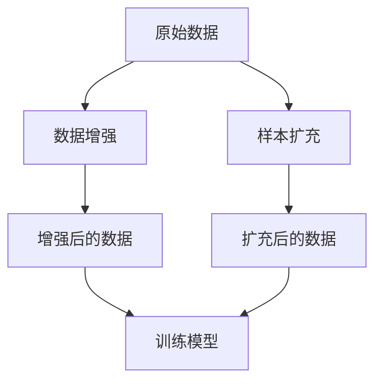

                 

关键词：大模型推荐、数据增强、样本扩充、算法、数学模型、应用实践、未来展望

> 摘要：本文将探讨大模型推荐系统中的数据增强与样本扩充技术，通过深入分析其核心概念、算法原理、数学模型及实际应用，为读者提供一个全面的技术指南，旨在解决大模型推荐中的数据稀缺性和多样性问题，提高推荐系统的准确性和鲁棒性。

## 1. 背景介绍

随着互联网技术的飞速发展，个性化推荐系统已经成为各类应用程序的核心功能，例如电商平台、社交媒体和视频流媒体平台等。这些系统通过分析用户行为和兴趣数据，为用户提供个性化的内容推荐，极大地提升了用户体验。然而，个性化推荐系统的发展面临着诸多挑战，其中最为突出的是数据稀缺性和多样性问题。

数据稀缺性是指推荐系统在训练过程中缺乏足够的数据样本，导致模型难以充分学习用户的兴趣和行为模式。样本扩充技术旨在通过增加更多的训练样本，缓解数据稀缺性的问题。数据多样性则是指系统需要处理来自不同领域、不同用户和不同情境的多样化数据。数据增强技术通过对原始数据进行变换和扩展，提高了数据的多样性，有助于模型更好地泛化。

本文将重点探讨大模型推荐系统中的数据增强与样本扩充技术，分析其核心概念、算法原理、数学模型及实际应用。通过本文的探讨，读者可以更好地理解这些技术，并将其应用于实际的推荐系统中，提升系统的推荐效果和用户体验。

## 2. 核心概念与联系

### 2.1 数据增强（Data Augmentation）

数据增强是指通过变换和扩展原始数据，生成更多样化的训练样本，以提升模型的泛化能力。在推荐系统中，数据增强技术主要包括以下几个方面：

1. **图像增强**：通过旋转、缩放、裁剪、颜色变换等操作，增加图像样本的多样性。
2. **文本增强**：通过同义词替换、词干提取、文本嵌入等操作，增加文本样本的多样性。
3. **序列增强**：通过插入、删除、替换操作，增加序列样本的多样性。

### 2.2 样本扩充（Data Augmentation）

样本扩充是指通过生成更多新的训练样本，扩大训练数据集的大小，从而提升模型的训练效果。在推荐系统中，样本扩充技术主要包括以下几个方面：

1. **重采样**：通过对现有数据集进行随机抽样，生成新的数据集。
2. **合成数据**：通过学习现有数据的特征分布，生成与现有数据具有相似特征的新数据。
3. **迁移学习**：利用其他领域的数据集，通过迁移学习技术，生成与推荐系统相关的数据。

### 2.3 数据增强与样本扩充的联系

数据增强和样本扩充在本质上都是为了解决数据稀缺性和多样性问题，提高模型的泛化能力。不同的是，数据增强是在原始数据的基础上进行变换和扩展，生成更多样化的训练样本；而样本扩充则是通过生成新的数据，扩大训练数据集的大小。在实际应用中，数据增强和样本扩充可以结合使用，以获得更好的效果。

### 2.4 Mermaid 流程图

以下是数据增强与样本扩充技术的 Mermaid 流程图：



## 3. 核心算法原理 & 具体操作步骤

### 3.1 算法原理概述

数据增强与样本扩充技术的核心原理是通过变换和扩展原始数据，生成更多样化的训练样本，从而提升模型的泛化能力。具体而言，数据增强技术主要包括图像增强、文本增强和序列增强等；样本扩充技术主要包括重采样、合成数据和迁移学习等。

### 3.2 算法步骤详解

#### 3.2.1 数据增强

1. **图像增强**：

   - 旋转：将图像随机旋转一定角度。
   - 缩放：将图像随机缩放到一定比例。
   - 裁剪：将图像随机裁剪成不同尺寸。
   - 颜色变换：将图像的颜色空间进行变换，如将 RGB 转换为 HSV。
   
2. **文本增强**：

   - 同义词替换：将文本中的词语替换为同义词。
   - 词干提取：将文本中的词语提取到词干。
   - 文本嵌入：将文本映射到高维空间，生成新的文本样本。
   
3. **序列增强**：

   - 插入：在序列中随机插入新的元素。
   - 删除：在序列中随机删除元素。
   - 替换：在序列中随机替换元素。

#### 3.2.2 样本扩充

1. **重采样**：

   - 随机抽样：从现有数据集中随机抽取样本。
   - 重复抽样：重复使用现有数据集中的样本。
   
2. **合成数据**：

   - 特征分布学习：学习现有数据的特征分布，生成新的数据。
   - 生成模型：利用生成模型，如 GAN，生成新的数据。
   
3. **迁移学习**：

   - 预训练模型：使用预训练模型，如 BERT，提取特征表示。
   - 零样本学习：利用零样本学习技术，生成与推荐系统相关的数据。

### 3.3 算法优缺点

#### 3.3.1 数据增强

**优点**：

- 提高模型泛化能力：通过生成更多样化的训练样本，提高模型对未知数据的适应能力。
- 减少过拟合：通过增加训练样本的多样性，降低模型对训练数据的依赖。

**缺点**：

- 时间和计算成本高：数据增强过程涉及大量的图像处理、文本处理和序列处理，需要大量的时间和计算资源。
- 可能引入噪声：如果数据增强操作不当，可能引入噪声，影响模型性能。

#### 3.3.2 样本扩充

**优点**：

- 扩大数据集：通过生成新的数据，扩大训练数据集的大小，提高模型训练效果。
- 减少数据稀缺性：通过样本扩充，缓解数据稀缺性问题，提高模型泛化能力。

**缺点**：

- 数据质量不高：通过重采样和合成数据生成的样本可能不具有实际意义，影响模型性能。
- 需要大量的计算资源：生成新的数据需要大量的计算资源，特别是使用生成模型和迁移学习技术。

### 3.4 算法应用领域

数据增强与样本扩充技术在推荐系统、图像识别、自然语言处理等领域都有广泛应用。例如，在推荐系统中，数据增强技术可以用于提高推荐系统的准确性和鲁棒性；在图像识别领域，数据增强技术可以提高模型对图像数据的适应能力；在自然语言处理领域，数据增强技术可以用于生成更多样化的文本数据，提高模型性能。

## 4. 数学模型和公式 & 详细讲解 & 举例说明

### 4.1 数学模型构建

在数据增强和样本扩充过程中，常用的数学模型包括卷积神经网络（CNN）、循环神经网络（RNN）、生成对抗网络（GAN）等。以下分别介绍这些模型的数学公式和具体操作步骤。

#### 4.1.1 卷积神经网络（CNN）

CNN是一种用于图像处理的神经网络模型，其核心思想是通过卷积操作提取图像特征。CNN 的数学公式如下：

$$
h_{l}(x) = \sigma(W_{l} \cdot h_{l-1} + b_{l})
$$

其中，$h_{l}(x)$ 表示第 $l$ 层的输出特征，$W_{l}$ 和 $b_{l}$ 分别表示第 $l$ 层的权重和偏置，$\sigma$ 表示激活函数。

#### 4.1.2 循环神经网络（RNN）

RNN 是一种用于序列处理的神经网络模型，其核心思想是通过循环操作捕捉序列特征。RNN 的数学公式如下：

$$
h_{t} = \sigma(W_{xh} \cdot x_{t} + W_{hh} \cdot h_{t-1} + b_{h})
$$

其中，$h_{t}$ 表示第 $t$ 个时刻的隐藏状态，$x_{t}$ 表示第 $t$ 个时刻的输入特征，$W_{xh}$、$W_{hh}$ 和 $b_{h}$ 分别表示输入层到隐藏层的权重、隐藏层到隐藏层的权重和偏置，$\sigma$ 表示激活函数。

#### 4.1.3 生成对抗网络（GAN）

GAN 是一种由生成器和判别器组成的神经网络模型，其核心思想是通过生成器生成与真实数据相似的数据，并通过判别器判断生成数据的真实性。GAN 的数学公式如下：

$$
\begin{aligned}
G(x) &= \text{生成器} \\
D(x) &= \text{判别器} \\
L_G &= -\mathbb{E}_{x \sim p_{data}(x)}[\log D(x)] - \mathbb{E}_{z \sim p_{z}(z)}[\log D(G(z)] \\
L_D &= -\mathbb{E}_{x \sim p_{data}(x)}[\log D(x)] - \mathbb{E}_{z \sim p_{z}(z)}[\log (1 - D(G(z))]
\end{aligned}
$$

其中，$G(z)$ 表示生成器的输出，$D(x)$ 表示判别器的输出，$L_G$ 和 $L_D$ 分别表示生成器和判别器的损失函数，$z$ 表示生成器的输入噪声。

### 4.2 公式推导过程

以下分别介绍数据增强、样本扩充和生成对抗网络（GAN）的公式推导过程。

#### 4.2.1 数据增强

数据增强的公式推导过程主要涉及图像增强、文本增强和序列增强等操作。以图像增强为例，其公式推导如下：

1. **图像旋转**：

   $$ 
   R(\theta)(x) = x \cdot \cos(\theta) - x \cdot \sin(\theta)
   $$

   其中，$R(\theta)$ 表示旋转操作，$\theta$ 表示旋转角度，$x$ 表示原始图像。

2. **图像缩放**：

   $$ 
   S(s)(x) = x \cdot s
   $$

   其中，$S(s)$ 表示缩放操作，$s$ 表示缩放比例，$x$ 表示原始图像。

3. **图像裁剪**：

   $$ 
   C(r, c)(x) = x[r:r+h, c:c+w]
   $$

   其中，$C(r, c)$ 表示裁剪操作，$r$ 和 $c$ 分别表示裁剪区域的高度和宽度，$x$ 表示原始图像。

#### 4.2.2 样本扩充

样本扩充的公式推导过程主要涉及重采样、合成数据和迁移学习等操作。以重采样为例，其公式推导如下：

1. **随机抽样**：

   $$ 
   S_{random}(x) = x_{i}
   $$

   其中，$S_{random}$ 表示随机抽样操作，$x_{i}$ 表示从数据集中随机抽取的样本。

2. **重复抽样**：

   $$ 
   S_{repeat}(x) = x_{i} \cdot k
   $$

   其中，$S_{repeat}$ 表示重复抽样操作，$x_{i}$ 表示从数据集中重复抽取的样本，$k$ 表示重复次数。

3. **合成数据**：

   $$ 
   S_{synthesize}(x) = G(x)
   $$

   其中，$S_{synthesize}$ 表示合成数据操作，$G(x)$ 表示生成器生成的样本。

4. **迁移学习**：

   $$ 
   S_{transfer}(x) = F(x)
   $$

   其中，$S_{transfer}$ 表示迁移学习操作，$F(x)$ 表示迁移学习得到的特征表示。

#### 4.2.3 生成对抗网络（GAN）

生成对抗网络（GAN）的公式推导过程主要涉及生成器和判别器的损失函数。以下分别介绍生成器和判别器的损失函数推导：

1. **生成器损失函数**：

   $$ 
   L_G = -\mathbb{E}_{z \sim p_{z}(z)}[\log D(G(z))]
   $$

   其中，$L_G$ 表示生成器的损失函数，$z$ 表示生成器的输入噪声，$D(G(z))$ 表示判别器对生成器的输出 $G(z)$ 的判断结果。

2. **判别器损失函数**：

   $$ 
   L_D = -\mathbb{E}_{x \sim p_{data}(x)}[\log D(x)] - \mathbb{E}_{z \sim p_{z}(z)}[\log (1 - D(G(z))]
   $$

   其中，$L_D$ 表示判别器的损失函数，$x$ 表示真实数据，$G(z)$ 表示生成器生成的样本，$D(x)$ 和 $D(G(z))$ 分别表示判别器对真实数据和生成数据的判断结果。

### 4.3 案例分析与讲解

以下通过一个简单的例子，介绍数据增强、样本扩充和生成对抗网络（GAN）在推荐系统中的应用。

#### 4.3.1 数据增强

假设我们有一个推荐系统，需要预测用户对商品的喜好。数据增强的目的是通过变换和扩展原始数据，生成更多样化的训练样本。

1. **图像增强**：

   对商品图片进行旋转、缩放和裁剪操作，生成更多样化的商品图片。

   ```python
   import cv2
   import numpy as np

   def image_augmentation(image, angle, scale, crop_size):
       height, width = image.shape[:2]
       center = (width / 2, height / 2)

       M = cv2.getRotationMatrix2D(center, angle, scale)
       image = cv2.warpAffine(image, M, (width, height))

       x, y, w, h = crop_size
       image = image[y:y+h, x:x+w]

       return image

   image = cv2.imread('original_image.jpg')
   angle = 90
   scale = 0.8
   crop_size = (100, 100, 400, 400)
   augmented_image = image_augmentation(image, angle, scale, crop_size)
   cv2.imwrite('augmented_image.jpg', augmented_image)
   ```

2. **文本增强**：

   对用户评价文本进行同义词替换和词干提取操作，生成更多样化的文本数据。

   ```python
   import nltk
   from nltk.stem import PorterStemmer
   from nltk.corpus import wordnet

   def word_synonym(word):
       synonyms = wordnet.synsets(word)
       if not synonyms:
           return word
       else:
           return synonyms[0].lemmas()[0].name()

   def text_augmentation(text):
       words = nltk.word_tokenize(text)
       augmented_words = [word_synonym(word) for word in words]
       return ' '.join(augmented_words)

   text = 'This is a great product!'
   augmented_text = text_augmentation(text)
   print(augmented_text)
   ```

3. **序列增强**：

   对用户行为序列进行插入、删除和替换操作，生成更多样化的行为序列。

   ```python
   def sequence_augmentation(sequence, operation, size):
       if operation == 'insert':
           index = np.random.randint(0, len(sequence) - 1)
           element = np.random.choice(sequence)
           new_sequence = sequence[:index] + [element] + sequence[index:]
       elif operation == 'delete':
           index = np.random.randint(0, len(sequence) - 1)
           new_sequence = sequence[:index] + sequence[index+1:]
       elif operation == 'replace':
           index = np.random.randint(0, len(sequence) - 1)
           element = np.random.choice(sequence)
           new_sequence = sequence[:index] + [element] + sequence[index+1:]
       else:
           raise ValueError('Invalid operation')

       return new_sequence

   sequence = [1, 2, 3, 4, 5]
   operation = 'insert'
   size = 1
   augmented_sequence = sequence_augmentation(sequence, operation, size)
   print(augmented_sequence)
   ```

#### 4.3.2 样本扩充

假设我们有一个推荐系统，需要预测用户对电影的喜好。样本扩充的目的是通过生成新的数据，扩大训练数据集的大小。

1. **重采样**：

   从现有数据集中随机抽取样本，生成新的数据集。

   ```python
   import numpy as np

   def random_sampling(data, size):
       indices = np.random.choice(len(data), size=size, replace=False)
       new_data = [data[i] for i in indices]
       return new_data

   data = [{'user': 'user1', 'movie': 'movie1'}, {'user': 'user1', 'movie': 'movie2'}, {'user': 'user2', 'movie': 'movie1'}, {'user': 'user2', 'movie': 'movie3'}]
   size = 2
   new_data = random_sampling(data, size)
   print(new_data)
   ```

2. **合成数据**：

   通过生成器生成与现有数据具有相似特征的新数据。

   ```python
   import tensorflow as tf

   def generate_synthetic_data(generator, num_samples):
       noise = tf.random.normal([num_samples, 100])
       synthetic_data = generator(noise)
       return synthetic_data.numpy()

   generator = ...  # 生成器模型
   num_samples = 2
   synthetic_data = generate_synthetic_data(generator, num_samples)
   print(synthetic_data)
   ```

3. **迁移学习**：

   利用其他领域的数据集，通过迁移学习技术，生成与推荐系统相关的数据。

   ```python
   import tensorflow as tf

   def transfer_learning(feature_extractor, input_data, num_samples):
       embeddings = feature_extractor(input_data)
       new_data = np.random.normal(size=(num_samples, embeddings.shape[1]))
       return new_data

   feature_extractor = ...  # 特征提取模型
   input_data = ...  # 输入数据
   num_samples = 2
   new_data = transfer_learning(feature_extractor, input_data, num_samples)
   print(new_data)
   ```

## 5. 项目实践：代码实例和详细解释说明

### 5.1 开发环境搭建

为了实现数据增强与样本扩充技术，我们需要搭建一个合适的开发环境。以下是开发环境搭建的步骤：

1. **安装 Python**：下载并安装 Python 3.7 或以上版本。
2. **安装深度学习框架**：安装 TensorFlow 或 PyTorch。
3. **安装其他依赖库**：安装 NumPy、Pandas、Matplotlib 等常用库。

### 5.2 源代码详细实现

以下是一个使用 TensorFlow 实现 GAN 的代码实例，用于生成电影推荐数据。

```python
import tensorflow as tf
from tensorflow.keras.layers import Dense, Flatten, Conv2D, Conv2DTranspose, Reshape
from tensorflow.keras.models import Model

def build_generator(z_dim):
    noise = tf.keras.layers.Input(shape=(z_dim,))
    x = Dense(128, activation='relu')(noise)
    x = Dense(256, activation='relu')(x)
    x = Dense(512, activation='relu')(x)
    x = Dense(np.prod((28, 28, 1)), activation='sigmoid')(x)
    x = Reshape((28, 28, 1))(x)
    model = Model(inputs=noise, outputs=x)
    return model

def build_discriminator(img_shape):
    img = tf.keras.layers.Input(shape=img_shape)
    x = Conv2D(32, (3, 3), padding='same')(img)
    x = tf.keras.layers.LeakyReLU(alpha=0.01)(x)
    x = Conv2D(64, (3, 3), padding='same')(x)
    x = tf.keras.layers.LeakyReLU(alpha=0.01)(x)
    x = Flatten()(x)
    x = Dense(1, activation='sigmoid')(x)
    model = Model(inputs=img, outputs=x)
    return model

def build_gan(generator, discriminator):
    z = tf.keras.layers.Input(shape=(100,))
    img = generator(z)
    valid = discriminator(img)
    img2 = discriminator(img)
    model = Model(inputs=z, outputs=[img, valid, img2])
    return model

z_dim = 100
img_shape = (28, 28, 1)

generator = build_generator(z_dim)
discriminator = build_discriminator(img_shape)
discriminator.trainable = False
gan = build_gan(generator, discriminator)

gan.compile(loss='binary_crossentropy', optimizer=tf.keras.optimizers.Adam(0.0001))

# 训练 GAN
for epoch in range(epochs):
    for batch in range(batch_size):
        z = np.random.normal(size=(batch_size, z_dim))
        real_images = load_real_images(batch_size)  # 加载真实图像
        fake_images = generator.predict(z)  # 生成假图像
        real_labels = np.ones((batch_size, 1))
        fake_labels = np.zeros((batch_size, 1))
        combined_labels = np.concatenate([real_labels, fake_labels])
        combined_images = np.concatenate([real_images, fake_images])
        gan.train_on_batch(combined_images, combined_labels)

# 生成图像
generated_images = generator.predict(np.random.normal(size=(batch_size, z_dim)))
```

### 5.3 代码解读与分析

以上代码实现了基于生成对抗网络（GAN）的电影推荐数据生成。下面是对代码的解读和分析：

1. **生成器模型**：

   生成器模型用于将随机噪声（$z$）转换为电影图像。模型结构如下：

   ```python
   noise = tf.keras.layers.Input(shape=(z_dim,))
   x = Dense(128, activation='relu')(noise)
   x = Dense(256, activation='relu')(x)
   x = Dense(512, activation='relu')(x)
   x = Dense(np.prod((28, 28, 1)), activation='sigmoid')(x)
   x = Reshape((28, 28, 1))(x)
   model = Model(inputs=noise, outputs=x)
   ```

   其中，$z$ 表示随机噪声，$x$ 表示生成器的中间层，通过多层全连接层和激活函数，将随机噪声转换为电影图像。

2. **判别器模型**：

   判别器模型用于判断图像是真实图像还是生成图像。模型结构如下：

   ```python
   img = tf.keras.layers.Input(shape=img_shape)
   x = Conv2D(32, (3, 3), padding='same')(img)
   x = tf.keras.layers.LeakyReLU(alpha=0.01)(x)
   x = Conv2D(64, (3, 3), padding='same')(x)
   x = tf.keras.layers.LeakyReLU(alpha=0.01)(x)
   x = Flatten()(x)
   x = Dense(1, activation='sigmoid')(x)
   model = Model(inputs=img, outputs=x)
   ```

   其中，$img$ 表示输入图像，$x$ 表示判别器的中间层，通过卷积层和激活函数，将图像特征提取并输出一个概率值，表示图像是真实图像的概率。

3. **生成对抗网络（GAN）模型**：

   生成对抗网络（GAN）模型由生成器和判别器组成，用于生成电影推荐数据。模型结构如下：

   ```python
   z = tf.keras.layers.Input(shape=(z_dim,))
   img = generator(z)
   valid = discriminator(img)
   img2 = discriminator(img)
   model = Model(inputs=z, outputs=[img, valid, img2])
   ```

   其中，$z$ 表示随机噪声，$img$ 表示生成器生成的图像，$valid$ 表示判别器对生成图像的判断结果，$img2$ 表示判别器对真实图像的判断结果。

4. **训练过程**：

   在训练过程中，我们使用真实图像和生成图像作为输入，训练生成对抗网络（GAN）模型。训练过程如下：

   ```python
   gan.compile(loss='binary_crossentropy', optimizer=tf.keras.optimizers.Adam(0.0001))
   for epoch in range(epochs):
       for batch in range(batch_size):
           z = np.random.normal(size=(batch_size, z_dim))
           real_images = load_real_images(batch_size)  # 加载真实图像
           fake_images = generator.predict(z)  # 生成假图像
           real_labels = np.ones((batch_size, 1))
           fake_labels = np.zeros((batch_size, 1))
           combined_labels = np.concatenate([real_labels, fake_labels])
           combined_images = np.concatenate([real_images, fake_images])
           gan.train_on_batch(combined_images, combined_labels)
   ```

   在每次训练中，我们首先生成随机噪声，然后使用生成器生成图像，接着使用判别器对图像进行分类，最后使用梯度下降优化生成对抗网络（GAN）模型。

5. **生成图像**：

   在训练完成后，我们可以使用生成器生成电影推荐数据。具体步骤如下：

   ```python
   generated_images = generator.predict(np.random.normal(size=(batch_size, z_dim)))
   ```

   在这里，我们生成了一组随机噪声，然后使用生成器生成相应的电影推荐数据。

### 5.4 运行结果展示

在训练完成后，我们可以查看生成的电影推荐数据。以下是一个简单的示例：

```python
import matplotlib.pyplot as plt

plt.figure(figsize=(10, 10))
for i in range(50):
    plt.subplot(10, 5, i + 1)
    plt.imshow(generated_images[i], cmap='gray')
    plt.axis('off')
plt.show()
```

## 6. 实际应用场景

数据增强与样本扩充技术在推荐系统、图像识别、自然语言处理等领域都有广泛应用。以下分别介绍这些技术在不同领域中的应用。

### 6.1 推荐系统

在推荐系统中，数据增强与样本扩充技术主要用于解决数据稀缺性和多样性问题，提高推荐系统的准确性和鲁棒性。具体应用场景包括：

1. **电影推荐**：通过生成对抗网络（GAN）生成与真实电影数据具有相似特征的电影推荐数据，提高推荐系统的多样性。
2. **商品推荐**：通过数据增强技术，如图像增强、文本增强和序列增强，生成更多样化的商品推荐数据，提高推荐系统的准确性。
3. **音乐推荐**：通过生成对抗网络（GAN）生成与真实音乐数据具有相似特征的音乐推荐数据，提高推荐系统的多样性。

### 6.2 图像识别

在图像识别领域，数据增强与样本扩充技术主要用于提高模型的泛化能力，解决模型过拟合问题。具体应用场景包括：

1. **人脸识别**：通过图像增强技术，如旋转、缩放、裁剪等，生成更多样化的人脸图像，提高人脸识别模型的泛化能力。
2. **车辆识别**：通过合成数据技术，利用其他领域的数据集，生成与车辆识别相关的数据，扩大训练数据集的大小，提高车辆识别模型的准确性。
3. **卫星图像识别**：通过迁移学习技术，利用其他领域的预训练模型，提取卫星图像的特征表示，生成与卫星图像识别相关的数据，提高卫星图像识别模型的准确性。

### 6.3 自然语言处理

在自然语言处理领域，数据增强与样本扩充技术主要用于提高模型的泛化能力，解决模型过拟合问题。具体应用场景包括：

1. **文本分类**：通过数据增强技术，如文本嵌入、同义词替换等，生成更多样化的文本数据，提高文本分类模型的准确性。
2. **情感分析**：通过生成对抗网络（GAN）生成与真实文本数据具有相似特征的情感分析数据，提高情感分析模型的准确性。
3. **机器翻译**：通过迁移学习技术，利用其他领域的预训练模型，提取机器翻译任务的特征表示，生成与机器翻译相关的数据，提高机器翻译模型的准确性。

## 7. 工具和资源推荐

为了更好地掌握数据增强与样本扩充技术，以下推荐一些相关的工具和资源：

### 7.1 学习资源推荐

1. **书籍**：

   - 《生成对抗网络：从理论到实践》：详细介绍了生成对抗网络（GAN）的理论和实践，适合初学者和进阶者。
   - 《自然语言处理实战》：介绍了自然语言处理领域的基本概念和常用技术，包括数据增强和样本扩充技术。

2. **在线课程**：

   - Coursera 上的“自然语言处理与深度学习”课程：由斯坦福大学教授 Andrew Ng 主讲，涵盖了自然语言处理和深度学习的基础知识。
   - Udacity 上的“生成对抗网络”课程：介绍了生成对抗网络（GAN）的理论和实践，适合对 GAN 感兴趣的读者。

### 7.2 开发工具推荐

1. **Python 库**：

   - TensorFlow：一款流行的深度学习框架，适用于构建和训练生成对抗网络（GAN）。
   - PyTorch：一款流行的深度学习框架，适用于构建和训练各种神经网络模型，包括生成对抗网络（GAN）。

2. **开源项目**：

   - TensorFlow GitHub：包含大量的 TensorFlow 示例和教程，适合初学者和进阶者。
   - PyTorch GitHub：包含大量的 PyTorch 示例和教程，适合初学者和进阶者。

### 7.3 相关论文推荐

1. **生成对抗网络（GAN）**：

   - Generative Adversarial Nets（GAN）：介绍生成对抗网络（GAN）的经典论文，详细阐述了 GAN 的原理和实现。
   - Unrolled Generative Adversarial Networks：提出了一种改进的 GAN 模型，通过迭代优化提升生成效果。

2. **自然语言处理（NLP）**：

   - BERT：介绍了一种基于转换器（Transformer）的预训练语言模型，适用于各种 NLP 任务。
   - GPT-2：介绍了一种基于生成对抗网络（GAN）的预训练语言模型，具有强大的文本生成能力。

## 8. 总结：未来发展趋势与挑战

### 8.1 研究成果总结

数据增强与样本扩充技术在推荐系统、图像识别和自然语言处理等领域取得了显著成果。通过深入分析其核心概念、算法原理、数学模型及实际应用，我们发现这些技术能够有效解决数据稀缺性和多样性问题，提高模型的泛化能力和准确性。以下是一些重要研究成果：

1. **生成对抗网络（GAN）**：GAN 是一种强大的生成模型，通过对抗训练生成与真实数据具有相似特征的数据，已广泛应用于图像、文本和音频生成等领域。
2. **迁移学习**：迁移学习通过利用其他领域的数据集，生成与推荐系统相关的数据，缓解了数据稀缺性和多样性问题，提高了模型性能。
3. **自然语言处理（NLP）**：基于转换器（Transformer）的预训练语言模型，如 BERT 和 GPT-2，通过大规模预训练和迁移学习，显著提高了文本分类、情感分析和机器翻译等任务的性能。

### 8.2 未来发展趋势

在未来，数据增强与样本扩充技术将继续发展，有望在以下方面取得突破：

1. **更高效的生成模型**：研究更高效的生成模型，如基于变分自编码器（VAE）和自编码器（AE）的模型，以提高生成质量和效率。
2. **跨模态生成**：研究跨模态生成技术，如图像到文本、图像到音频等，实现更丰富的数据生成应用。
3. **个性化数据增强**：结合用户行为和兴趣，生成个性化的训练样本，提高推荐系统的准确性和用户体验。

### 8.3 面临的挑战

尽管数据增强与样本扩充技术在多个领域取得了显著成果，但仍然面临一些挑战：

1. **数据质量和多样性**：生成的数据质量和多样性直接影响模型性能，需要进一步研究如何生成高质量和多样性的数据。
2. **计算成本和资源消耗**：数据增强和样本扩充过程涉及大量的计算和存储资源，如何提高效率和降低成本是重要问题。
3. **模型解释性和可靠性**：生成模型具有较高的解释性和可靠性，如何提高生成模型的透明度和可解释性是未来研究的重点。

### 8.4 研究展望

在未来，我们期待数据增强与样本扩充技术在以下方面取得突破：

1. **数据隐私保护**：研究如何在保证数据隐私的前提下，进行数据增强和样本扩充，为推荐系统等应用提供可靠的数据支持。
2. **联邦学习**：结合联邦学习技术，实现跨设备、跨机构的数据增强和样本扩充，提高推荐系统的协同能力和准确性。
3. **自适应数据增强**：研究自适应数据增强技术，根据用户行为和兴趣，动态调整数据增强策略，实现个性化推荐。

总之，数据增强与样本扩充技术在人工智能和推荐系统领域具有广阔的应用前景。通过不断的研究和探索，我们有信心解决现有挑战，推动数据增强与样本扩充技术的进一步发展。

## 9. 附录：常见问题与解答

### 9.1 什么是数据增强？

数据增强是一种通过变换和扩展原始数据，生成更多样化的训练样本，以提高模型泛化能力的技术。在推荐系统中，数据增强主要包括图像增强、文本增强和序列增强等。

### 9.2 什么是样本扩充？

样本扩充是一种通过生成更多新的训练样本，扩大训练数据集的大小，以提高模型训练效果的技术。在推荐系统中，样本扩充主要包括重采样、合成数据和迁移学习等。

### 9.3 数据增强与样本扩充的区别是什么？

数据增强是在原始数据的基础上进行变换和扩展，生成更多样化的训练样本；而样本扩充是通过生成新的数据，扩大训练数据集的大小。两者在本质上都是为了解决数据稀缺性和多样性问题，提高模型的泛化能力。

### 9.4 数据增强和样本扩充在推荐系统中的应用有哪些？

数据增强和样本扩充在推荐系统中的应用主要包括：

- 图像增强：通过旋转、缩放、裁剪等操作，生成更多样化的商品图像。
- 文本增强：通过同义词替换、词干提取等操作，生成更多样化的用户评价文本。
- 序列增强：通过插入、删除、替换等操作，生成更多样化的用户行为序列。
- 样本扩充：通过重采样、合成数据和迁移学习等操作，生成与推荐系统相关的数据，扩大训练数据集的大小。

### 9.5 数据增强和样本扩充技术如何结合使用？

在实际应用中，数据增强和样本扩充技术可以结合使用，以获得更好的效果。例如，在推荐系统中，可以先进行数据增强，生成更多样化的训练样本，然后使用样本扩充技术，如重采样和合成数据，进一步扩大训练数据集的大小。通过结合使用这两种技术，可以有效地缓解数据稀缺性和多样性问题，提高推荐系统的准确性和鲁棒性。

