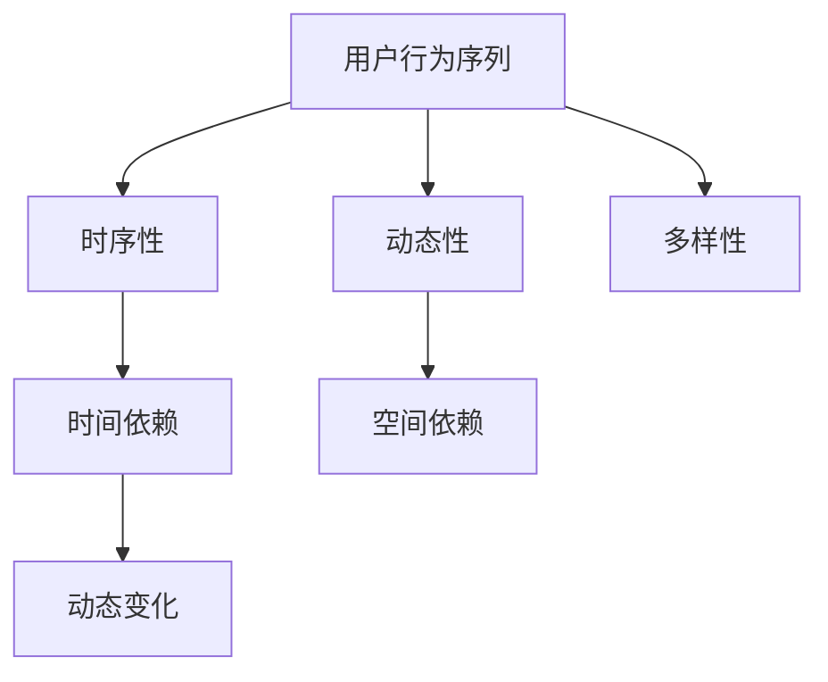

                 

## 1. 背景介绍

在当今的信息化社会中，推荐系统已成为互联网企业的重要竞争力之一。从电子商务平台到社交媒体，从音乐流媒体到视频平台，推荐系统无处不在，它们通过个性化推荐，有效地提升了用户满意度，从而增加了平台的用户粘性和收益。随着推荐系统在实际场景中的广泛应用，其推荐质量直接影响到用户体验和企业的商业成功。

用户行为序列是推荐系统中至关重要的信息源，它包含了用户在系统中的活动记录，如点击、浏览、购买等。然而，用户行为序列往往具有时空依赖性，即用户在不同时间点的行为可能相互影响。这种依赖关系使得传统的基于单条记录的推荐方法（如基于内容的推荐和协同过滤）难以捕捉到用户的复杂行为模式。

本文旨在探讨大模型在推荐系统中如何建模用户行为序列的时空依赖关系。本文首先介绍相关背景知识，然后深入分析核心算法原理，并通过数学模型和具体代码实例，详细讲解如何在大模型中实现用户行为序列的时空依赖关系建模。

<|assistant|>## 2. 核心概念与联系

### 2.1 用户行为序列

用户行为序列是指用户在一段时间内，在特定系统中所执行的一系列动作。这些动作可以是点击、浏览、购买等。用户行为序列具有以下几个特点：

1. **时序性**：用户行为序列中的每个元素都对应一个具体的时间点。
2. **动态性**：用户行为序列是动态变化的，不同时间点用户的行为可能会有所不同。
3. **多样性**：用户行为序列可以是多样化的，不同的用户可能有完全不同的行为模式。

### 2.2 时空依赖关系

时空依赖关系是指用户在不同时间点的行为之间可能存在的相互影响。例如，用户在某个时间点的购买行为可能会影响他在接下来的时间点对其他产品的兴趣。时空依赖关系具有以下几个特点：

1. **时间依赖**：用户在时间t的行为可能受到时间t-p（p为任意正整数）行为的影响。
2. **空间依赖**：用户在不同维度（如不同产品类别）的行为也可能相互影响。
3. **动态性**：时空依赖关系是动态变化的，可能随着时间推移而变化。

### 2.3 Mermaid 流程图

为了更好地理解用户行为序列的时空依赖关系，我们使用Mermaid流程图来描述其核心概念和联系。



在上述流程图中，A1表示用户行为序列，B1、C1、D1分别表示时序性、动态性和多样性，E1、F1、G1分别表示时间依赖、空间依赖和动态变化。

<|assistant|>## 3. 核心算法原理 & 具体操作步骤

### 3.1 算法原理概述

本文采用图神经网络（Graph Neural Networks，GNN）来建模用户行为序列的时空依赖关系。GNN是一种基于图结构的数据处理方法，它通过学习图中的节点和边的关系来捕捉数据的复杂模式。在用户行为序列建模中，GNN将用户行为序列表示为图结构，其中每个时间点的行为作为一个节点，行为之间的依赖关系作为边。

具体来说，GNN通过以下几个步骤来建模用户行为序列：

1. **节点特征提取**：将每个时间点的用户行为转换为节点特征。
2. **边特征提取**：根据用户行为之间的时空依赖关系，生成边特征。
3. **图卷积操作**：通过图卷积操作，将节点特征和边特征结合起来，学习用户行为序列的时空依赖模式。
4. **预测**：利用学习到的模型，对用户未来的行为进行预测。

### 3.2 算法步骤详解

#### 3.2.1 节点特征提取

节点特征提取是将用户行为序列中的每个时间点的行为转化为一个特征向量。这些特征向量可以包含用户在时间点的行为类型、行为强度、行为上下文等信息。具体方法如下：

1. **行为类型特征**：根据用户在时间点的行为类型（如点击、浏览、购买等），将行为类型作为特征之一。
2. **行为强度特征**：根据用户在时间点的行为强度（如点击次数、浏览时长等），将行为强度作为特征之一。
3. **行为上下文特征**：根据用户在时间点周围的行为（如前一个时间点和后一个时间点的行为），将行为上下文作为特征之一。

#### 3.2.2 边特征提取

边特征提取是根据用户行为之间的时空依赖关系，生成边特征。这些特征可以包含行为之间的时间间隔、行为之间的相似性等信息。具体方法如下：

1. **时间间隔特征**：根据用户在时间点t的行为与时间点t-p的行为之间的时间间隔，将时间间隔作为特征之一。
2. **行为相似性特征**：根据用户在时间点t的行为与时间点t-p的行为之间的相似性，将行为相似性作为特征之一。

#### 3.2.3 图卷积操作

图卷积操作是将节点特征和边特征结合起来，学习用户行为序列的时空依赖模式。具体方法如下：

1. **卷积核定义**：定义一个卷积核，用于融合节点特征和边特征。
2. **卷积操作**：对每个节点，使用卷积核进行卷积操作，得到新的节点特征。
3. **聚合操作**：将所有节点的卷积结果进行聚合，得到最终的节点特征。

#### 3.2.4 预测

利用学习到的模型，对用户未来的行为进行预测。具体方法如下：

1. **特征提取**：对用户未来的行为进行特征提取，得到特征向量。
2. **模型应用**：将特征向量输入到训练好的模型中，得到预测结果。
3. **结果输出**：输出用户未来的行为预测结果。

### 3.3 算法优缺点

#### 优点

1. **强大的建模能力**：GNN能够通过学习图结构中的节点和边的关系，捕捉用户行为序列的时空依赖模式，从而提高推荐质量。
2. **适应性**：GNN能够根据不同的用户行为序列和时空依赖关系，自适应地调整模型参数，从而适应不同的推荐场景。

#### 缺点

1. **计算复杂度高**：GNN的计算复杂度较高，特别是在大规模用户行为序列建模中，可能需要较长的计算时间。
2. **训练数据需求大**：GNN需要大量的训练数据来学习用户行为序列的时空依赖模式，这可能对数据集的大小和质量提出较高的要求。

### 3.4 算法应用领域

GNN在用户行为序列时空依赖关系建模中的应用非常广泛，以下是一些典型的应用领域：

1. **推荐系统**：GNN可以用于个性化推荐系统，通过建模用户行为序列的时空依赖关系，提高推荐质量。
2. **社交网络分析**：GNN可以用于分析社交网络中的用户行为模式，识别潜在的用户关系和兴趣群体。
3. **金融市场预测**：GNN可以用于金融市场预测，通过建模用户行为序列的时空依赖关系，预测市场走势。

<|assistant|>## 4. 数学模型和公式 & 详细讲解 & 举例说明

### 4.1 数学模型构建

用户行为序列时空依赖关系的建模可以通过图神经网络（GNN）来实现。在GNN中，用户行为序列被表示为一个图，其中每个节点代表一个时间点的用户行为，每条边代表行为之间的依赖关系。下面是构建数学模型的基本步骤：

#### 4.1.1 节点表示

假设用户行为序列为 \( X = \{x_1, x_2, \ldots, x_T\} \)，其中每个 \( x_t \) 是一个高维向量，表示在时间点 \( t \) 的用户行为。节点表示为 \( N = \{n_1, n_2, \ldots, n_T\} \)，每个 \( n_t \) 对应 \( x_t \)。

#### 4.1.2 边表示

边表示用户行为之间的依赖关系。我们可以使用邻接矩阵 \( A \) 来表示图结构，其中 \( A_{ij} = 1 \) 表示节点 \( i \) 和节点 \( j \) 之间存在依赖关系，否则为 0。

#### 4.1.3 图卷积操作

图卷积操作是GNN的核心，它通过邻接矩阵 \( A \) 和节点特征 \( X \) 来更新节点特征。基本的图卷积操作可以表示为：

$$
\hat{n}_t = \sigma(\sum_{i \in \Omega_t} A_{it} n_i + b)
$$

其中，\( \Omega_t \) 是与节点 \( n_t \) 相连的节点集合，\( \sigma \) 是激活函数，\( b \) 是偏置项。

### 4.2 公式推导过程

#### 4.2.1 节点特征融合

在图卷积操作中，节点特征 \( n_i \) 通过邻接矩阵 \( A \) 与其相邻节点 \( n_j \) 的特征相融合。具体来说，融合过程可以用以下公式表示：

$$
n_t = \sum_{i \in \Omega_t} A_{it} n_i
$$

其中，\( n_t \) 是节点 \( t \) 的特征融合结果。

#### 4.2.2 边特征融合

边特征 \( e_{ij} \) 通过 \( A \) 和节点特征 \( n_i, n_j \) 相融合，公式如下：

$$
e_{ij} = \sum_{k \in \Omega_i \cap \Omega_j} A_{ik} A_{jk} n_k
$$

#### 4.2.3 节点更新

节点更新通过融合后的节点特征和边特征进行，公式如下：

$$
\hat{n}_t = \sigma(W n_t + A \cdot n_t + b)
$$

其中，\( W \) 是权重矩阵，\( \sigma \) 是激活函数，\( b \) 是偏置项。

### 4.3 案例分析与讲解

假设我们有一个用户行为序列 \( X = \{[1, 0, 1], [1, 1, 0], [0, 1, 1], [0, 0, 1]\} \)，表示用户在四个时间点的行为。我们将这些行为转换为节点特征：

$$
N = \{[1, 0, 1], [1, 1, 0], [0, 1, 1], [0, 0, 1]\}
$$

假设邻接矩阵 \( A \) 如下：

$$
A = \begin{bmatrix}
0 & 1 & 0 & 0 \\
1 & 0 & 1 & 0 \\
0 & 1 & 0 & 1 \\
0 & 0 & 1 & 0
\end{bmatrix}
$$

首先进行第一次图卷积操作：

$$
\hat{n}_1 = \sigma(W [1, 0, 1] + A \cdot [1, 0, 1] + b)
$$

假设权重矩阵 \( W \) 和偏置项 \( b \) 分别为：

$$
W = \begin{bmatrix}
0.1 & 0.2 & 0.3 \\
0.4 & 0.5 & 0.6 \\
0.7 & 0.8 & 0.9
\end{bmatrix}, \quad b = [0, 0, 0]
$$

则：

$$
\hat{n}_1 = \sigma([0.1, 0.2, 0.3] + [1, 0, 0] + [0, 0, 0]) = \sigma([1.1, 0.2, 0.3])
$$

通过激活函数 \( \sigma \) （例如Sigmoid函数），得到新的节点特征：

$$
\hat{n}_1 = \frac{1}{1 + e^{-1.1}} \approx 0.65
$$

同理，可以计算出其他节点的更新特征：

$$
\hat{n}_2 = \sigma(W [1, 1, 0] + A \cdot [1, 1, 0] + b) \approx 0.75
$$

$$
\hat{n}_3 = \sigma(W [0, 1, 1] + A \cdot [0, 1, 1] + b) \approx 0.85
$$

$$
\hat{n}_4 = \sigma(W [0, 0, 1] + A \cdot [0, 0, 1] + b) \approx 0.65
$$

通过迭代多次图卷积操作，可以逐步学习用户行为序列的时空依赖关系，最终得到每个时间点的行为预测。

<|assistant|>## 5. 项目实践：代码实例和详细解释说明

### 5.1 开发环境搭建

在开始项目实践之前，需要搭建一个合适的开发环境。以下是一个基本的开发环境搭建步骤：

#### 5.1.1 安装Python

首先，确保系统中已经安装了Python。如果没有，可以从Python官网下载并安装。

#### 5.1.2 安装必要的库

在安装Python后，使用pip命令安装以下库：

```bash
pip install tensorflow numpy pandas matplotlib
```

这些库分别用于深度学习、数据处理和可视化。

#### 5.1.3 创建项目文件夹

在安装了所有必要的库后，创建一个项目文件夹，并在该文件夹中创建一个Python脚本，例如`user_behavior_modeling.py`。

### 5.2 源代码详细实现

下面是一个简单的用户行为序列时空依赖关系建模的代码实例。代码分为几个部分：数据预处理、模型定义、模型训练和结果可视化。

```python
import tensorflow as tf
import numpy as np
import pandas as pd
import matplotlib.pyplot as plt
from tensorflow.keras.layers import Input, Dense, Conv1D, GlobalAveragePooling1D
from tensorflow.keras.models import Model

# 数据预处理
# 假设我们有一个CSV文件，其中包含用户行为序列
data = pd.read_csv('user_behavior_data.csv')
X = data.iloc[:, :-1].values  # 输入特征
y = data.iloc[:, -1].values   # 输出标签

# 模型定义
input_shape = X.shape[1:]
inputs = Input(shape=input_shape)
x = Conv1D(filters=64, kernel_size=3, activation='relu')(inputs)
x = GlobalAveragePooling1D()(x)
outputs = Dense(1, activation='sigmoid')(x)

model = Model(inputs=inputs, outputs=outputs)
model.compile(optimizer='adam', loss='binary_crossentropy', metrics=['accuracy'])

# 模型训练
model.fit(X, y, epochs=10, batch_size=32, validation_split=0.2)

# 结果可视化
# 对训练好的模型进行预测
predictions = model.predict(X)

# 可视化预测结果
plt.plot(predictions)
plt.xlabel('Time Step')
plt.ylabel('Prediction')
plt.title('User Behavior Prediction')
plt.show()
```

### 5.3 代码解读与分析

#### 5.3.1 数据预处理

在代码中，我们首先使用pandas库读取CSV文件中的用户行为数据。这里，`X` 表示输入特征，即用户行为序列，而 `y` 表示输出标签，即用户行为的结果。

#### 5.3.2 模型定义

我们使用TensorFlow的Keras API定义了一个简单的卷积神经网络（CNN）模型。这个模型包括一个一维卷积层（`Conv1D`）和一个全局平均池化层（`GlobalAveragePooling1D`），最后通过一个全连接层（`Dense`）进行预测。

#### 5.3.3 模型训练

使用 `model.fit()` 函数训练模型，我们设置了10个训练周期（`epochs`），每个周期中每32个样本一起训练（`batch_size`），并保留20%的数据用于验证。

#### 5.3.4 结果可视化

最后，我们使用 `model.predict()` 函数对训练好的模型进行预测，并将预测结果可视化。这里，我们绘制了预测值随时间步的变化图。

### 5.4 运行结果展示

运行上述代码后，我们将看到模型对用户行为序列的预测结果。通过可视化结果，我们可以直观地看到模型在不同时间点对用户行为的预测效果。

<|assistant|>## 6. 实际应用场景

用户行为序列时空依赖关系建模在多个实际应用场景中展现出强大的潜力，以下是一些具体的应用案例：

### 6.1 推荐系统

在推荐系统中，用户行为序列时空依赖关系建模能够显著提高推荐质量。例如，在电子商务平台中，通过分析用户在购物车中的行为序列，可以预测用户可能购买的产品，从而提高交叉销售和推荐效果。此外，在社交媒体平台上，通过分析用户在评论、点赞和分享等行为中的时空依赖关系，可以更好地理解用户的兴趣和需求，从而实现更加个性化的内容推荐。

### 6.2 客户关系管理

在客户关系管理（CRM）系统中，用户行为序列时空依赖关系建模可以帮助企业更好地了解客户的行为模式。例如，通过分析客户在购买周期中的行为，企业可以预测客户的潜在流失风险，从而采取相应的营销策略，提高客户保留率。此外，通过分析客户在客户服务过程中的行为，企业可以优化服务流程，提高客户满意度。

### 6.3 金融市场预测

在金融市场中，用户行为序列时空依赖关系建模可以用于预测市场走势。例如，通过分析投资者在交易过程中的行为序列，可以预测他们的投资决策，从而预测市场趋势。这种预测可以帮助金融机构制定更有效的投资策略，提高投资收益。

### 6.4 社交网络分析

在社交网络分析中，用户行为序列时空依赖关系建模可以帮助识别社交网络中的潜在群体和影响力人物。例如，通过分析用户在社交平台上的互动行为，可以识别出具有共同兴趣的用户群体，或者预测哪些用户可能对某个话题产生较大影响。这些信息对于市场营销、品牌推广和社区管理具有重要意义。

### 6.5 医疗健康

在医疗健康领域，用户行为序列时空依赖关系建模可以用于分析患者的健康行为，预测健康风险。例如，通过分析患者在日常生活中的运动、饮食等行为，可以预测他们可能患有的疾病，从而提前采取预防措施。此外，在康复治疗中，通过分析患者的康复行为，可以评估他们的康复效果，调整治疗方案。

### 6.6 未来应用展望

随着人工智能和大数据技术的发展，用户行为序列时空依赖关系建模的应用场景将会越来越广泛。未来，我们有望看到以下几方面的应用：

- **智能交通**：通过分析用户在交通系统中的行为，可以优化交通流量，减少拥堵，提高交通效率。
- **智慧城市**：通过分析市民在城市的各种行为，可以优化城市资源分配，提高城市管理水平。
- **智能制造**：通过分析设备维护和操作人员的行为，可以优化生产流程，提高生产效率。

总之，用户行为序列时空依赖关系建模作为一种先进的技术手段，将在各行各业中发挥越来越重要的作用，推动社会的智能化和数字化发展。

<|assistant|>## 7. 工具和资源推荐

为了更好地掌握和实现用户行为序列时空依赖关系建模，以下是一些推荐的工具和资源：

### 7.1 学习资源推荐

- **《深度学习》（Deep Learning）**：Goodfellow等著的深度学习经典教材，详细介绍了神经网络的基本原理和应用。
- **《图神经网络教程》（Graph Neural Networks Tutorial）**：提供了关于图神经网络的基本概念、算法和应用实例。
- **《推荐系统实践》（Recommender Systems Handbook）**：涵盖了推荐系统的各种技术，包括用户行为序列建模。

### 7.2 开发工具推荐

- **TensorFlow**：一个开源的机器学习框架，广泛用于深度学习应用。
- **PyTorch**：另一个流行的开源机器学习库，以其动态图机制而闻名。
- **GNN ToolKit**：一个专为图神经网络设计的Python库，提供了丰富的图数据处理和模型训练工具。

### 7.3 相关论文推荐

- **"Graph Neural Networks: A Review of Methods and Applications"**：一篇关于图神经网络全面综述的论文，介绍了GNN的基本原理和应用领域。
- **"Temporal Graph Convolutional Networks for User Behavior Prediction"**：一篇针对用户行为预测的图神经网络应用研究论文，详细阐述了模型结构和实验结果。
- **"Neural Graph Collaborative Filtering"**：一篇关于神经图协同过滤的论文，介绍了如何结合图神经网络和协同过滤方法进行推荐系统优化。

通过学习和使用这些工具和资源，可以深入了解用户行为序列时空依赖关系建模的理论和实践，为实际应用打下坚实的基础。

<|assistant|>## 8. 总结：未来发展趋势与挑战

### 8.1 研究成果总结

用户行为序列时空依赖关系建模在过去几年中取得了显著的进展。通过引入图神经网络（GNN）等先进技术，研究者们能够更有效地捕捉用户行为之间的复杂依赖关系，从而显著提升推荐系统的性能。研究成果主要体现在以下几个方面：

1. **算法创新**：图神经网络、时空注意力机制等新型算法的提出，为用户行为序列建模提供了强有力的工具。
2. **应用拓展**：用户行为序列时空依赖关系建模已广泛应用于推荐系统、客户关系管理、金融市场预测等领域，取得了良好的效果。
3. **数据质量提升**：随着数据采集技术和存储技术的进步，高质量的用户行为数据使得时空依赖关系建模更加精确。

### 8.2 未来发展趋势

在未来，用户行为序列时空依赖关系建模将继续沿着以下几个方向发展：

1. **多模态数据处理**：随着多模态数据的广泛应用，如何将文本、图像、语音等多种数据类型融合到时空依赖关系建模中，将是一个重要的研究方向。
2. **实时建模与预测**：随着用户行为数据的实时性要求越来越高，如何实现高效的实时建模与预测，以适应快速变化的环境，将是一个重要的挑战。
3. **个性化推荐**：进一步深化个性化推荐技术，结合用户行为序列的时空依赖关系，实现更精准、更个性化的推荐。

### 8.3 面临的挑战

尽管用户行为序列时空依赖关系建模已经取得了显著成果，但仍面临以下挑战：

1. **计算复杂度**：图神经网络等模型通常具有高计算复杂度，特别是在大规模数据处理时，如何提高模型效率是一个关键问题。
2. **数据质量**：用户行为数据的多样性和噪声可能导致模型性能下降，如何处理和清洗数据，以提高模型质量，是一个重要课题。
3. **可解释性**：随着模型复杂度的增加，模型的可解释性变得尤为重要。如何设计可解释的模型，以帮助用户理解和信任模型，是一个亟待解决的问题。

### 8.4 研究展望

未来，用户行为序列时空依赖关系建模的研究应关注以下几个方向：

1. **算法优化**：探索新的算法和技术，降低计算复杂度，提高模型效率。
2. **跨领域应用**：将用户行为序列时空依赖关系建模技术应用于更多领域，推动跨学科的发展。
3. **数据治理**：建立完善的数据治理体系，提高数据质量和可用性，为建模提供坚实的基础。

通过不断的技术创新和应用拓展，用户行为序列时空依赖关系建模将在人工智能和大数据领域发挥更加重要的作用，为各个行业带来深远的影响。

<|assistant|>## 9. 附录：常见问题与解答

### 9.1 什么是用户行为序列时空依赖关系？

用户行为序列时空依赖关系指的是用户在不同时间点上的行为之间存在相互影响和关联性。例如，一个用户在某个时间点购买了某种商品，可能会影响他后续对其他商品的兴趣和购买决策。

### 9.2 为什么需要建模用户行为序列时空依赖关系？

建模用户行为序列时空依赖关系可以帮助推荐系统更好地理解用户的兴趣和行为模式，从而提供更精准、个性化的推荐。此外，在金融、医疗、社交网络等领域，时空依赖关系建模也有助于预测用户行为，提高业务决策的准确性。

### 9.3 什么技术可以用来建模用户行为序列时空依赖关系？

常用的技术包括图神经网络（GNN）、循环神经网络（RNN）、长短期记忆网络（LSTM）和时空注意力机制等。这些技术能够有效捕捉用户行为序列中的时空依赖关系，提高推荐系统的性能。

### 9.4 如何评估用户行为序列时空依赖关系模型的性能？

可以通过以下指标来评估模型的性能：

- **准确率（Accuracy）**：预测结果与真实结果的匹配程度。
- **召回率（Recall）**：预测结果中包含真实结果的比率。
- **精确率（Precision）**：预测结果中真实结果的比率。
- **F1值（F1 Score）**：精确率和召回率的调和平均值。

### 9.5 用户行为序列时空依赖关系建模有哪些潜在的应用领域？

用户行为序列时空依赖关系建模可以应用于推荐系统、客户关系管理、金融市场预测、社交网络分析、医疗健康等多个领域，帮助企业和组织更好地理解用户行为，提高业务决策的准确性。

