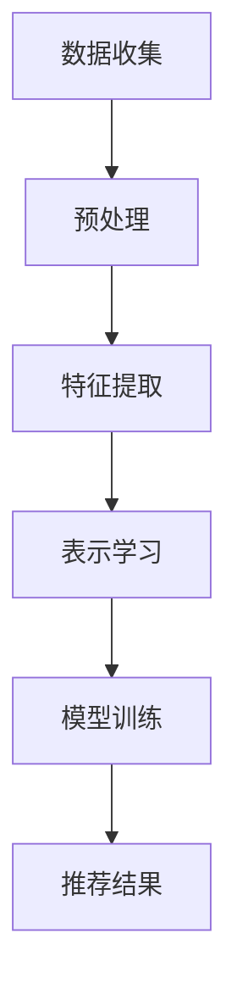
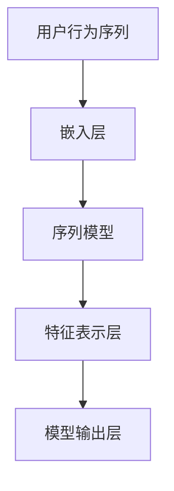

                 

 关键词：大模型推荐、用户行为序列、表示学习、深度学习、序列模型、算法优化、数学模型、应用场景、开发工具

> 摘要：本文深入探讨了在大模型推荐系统中，通过用户行为序列进行表示学习的最新方法。文章首先介绍了用户行为序列表示学习的重要性，然后详细分析了核心概念、算法原理、数学模型，并通过具体案例和代码实例进行了实践讲解。最后，文章展望了未来的发展趋势与面临的挑战，并推荐了相关学习资源和开发工具。

## 1. 背景介绍

随着互联网的普及，个性化推荐系统已成为许多在线服务的重要组成部分。从在线购物、音乐流媒体到社交媒体，用户行为数据已经被广泛应用于推荐算法的设计。用户行为序列，即用户在一段时间内产生的行为数据序列，如点击、浏览、购买等，是构建个性化推荐系统的重要数据源。

然而，传统的用户行为序列表示方法存在一定的局限性。例如，基于统计的推荐方法如协同过滤（Collaborative Filtering）虽然能够在一定程度上实现推荐效果，但其预测精度和实时性往往受到限制。而基于深度学习的推荐方法，如神经网络模型（Neural Networks），虽然在处理复杂数据和特征表示方面表现出色，但训练过程复杂，计算资源消耗巨大。

因此，如何高效地学习用户行为序列的表示，从而提高推荐系统的性能和实用性，成为当前研究的热点问题。

## 2. 核心概念与联系

### 2.1 用户行为序列

用户行为序列是指用户在一段时间内的一系列行为记录。这些行为可以是点击、浏览、购买等，每个行为都可以被表示为一个事件。用户行为序列的长度和事件类型数量会影响模型的学习效率和预测性能。

### 2.2 表示学习

表示学习（Representation Learning）是深度学习中的一个重要概念，旨在通过学习数据的高效表示来提高模型的性能。在大模型推荐系统中，表示学习主要用于学习用户行为序列的特征表示。

### 2.3 Mermaid 流程图

为了更好地展示用户行为序列表示学习的过程，我们使用Mermaid流程图来描述其核心流程。以下是一个简化的流程图：



### 2.4 核心概念原理与架构

用户行为序列表示学习的核心原理是利用深度学习模型（如RNN、LSTM、GRU等）学习用户行为序列的特征表示。以下是一个简化的用户行为序列表示学习架构：



- **嵌入层**：将用户行为序列中的事件转换为向量表示。
- **序列模型**：利用RNN、LSTM、GRU等模型学习序列特征。
- **特征表示层**：对序列模型的输出进行聚合和转换，得到用户行为序列的特征表示。
- **模型输出层**：根据特征表示进行推荐。

## 3. 核心算法原理 & 具体操作步骤

### 3.1 算法原理概述

用户行为序列表示学习算法的核心思想是通过深度学习模型学习用户行为序列的长期依赖关系和潜在特征表示。常见的深度学习模型包括RNN、LSTM、GRU等，这些模型能够有效地捕捉序列数据中的时序信息。

### 3.2 算法步骤详解

用户行为序列表示学习的具体步骤如下：

1. **数据收集**：收集用户行为序列数据，包括用户ID、事件类型、时间戳等。
2. **预处理**：对数据进行清洗、去噪和填充，将数据转换为适合模型训练的格式。
3. **特征提取**：利用嵌入层将事件类型转换为向量表示。
4. **表示学习**：利用RNN、LSTM、GRU等模型学习用户行为序列的长期依赖关系和潜在特征表示。
5. **模型训练**：使用训练数据训练模型，优化模型参数。
6. **推荐结果**：利用训练好的模型进行推荐，根据用户行为序列的特征表示预测用户可能的兴趣点。

### 3.3 算法优缺点

用户行为序列表示学习算法具有以下优点：

- **高效性**：通过深度学习模型学习用户行为序列的长期依赖关系，能够提高推荐系统的性能。
- **可扩展性**：可以方便地引入新的用户行为类型和特征，适应不同的推荐场景。

然而，该算法也存在一定的局限性：

- **计算资源消耗**：深度学习模型训练过程复杂，计算资源消耗较大。
- **数据依赖性**：用户行为序列数据的质量和数量直接影响模型的性能。

### 3.4 算法应用领域

用户行为序列表示学习算法可以广泛应用于以下领域：

- **在线购物推荐**：根据用户浏览、搜索、购买等行为，推荐相关的商品。
- **音乐流媒体推荐**：根据用户听歌记录，推荐相似的歌曲或艺术家。
- **社交媒体推荐**：根据用户点赞、评论、转发等行为，推荐相关的内容或用户。

## 4. 数学模型和公式 & 详细讲解 & 举例说明

### 4.1 数学模型构建

用户行为序列表示学习的数学模型主要包括以下几部分：

1. **嵌入层**：将事件类型映射为向量表示。
2. **序列模型**：利用RNN、LSTM、GRU等模型学习序列特征。
3. **特征表示层**：对序列模型的输出进行聚合和转换，得到用户行为序列的特征表示。
4. **模型输出层**：根据特征表示进行推荐。

假设用户行为序列为 $X = \{x_1, x_2, ..., x_T\}$，其中 $x_t$ 表示第 $t$ 个事件。事件类型的嵌入向量表示为 $e(x_t) \in \mathbb{R}^{d_e}$。序列模型的输入为 $\{e(x_1), e(x_2), ..., e(x_T)\}$，输出为用户行为序列的特征表示 $h \in \mathbb{R}^{d_h}$。

### 4.2 公式推导过程

1. **嵌入层**：

   嵌入层的公式为：

   $$ e(x_t) = \text{Embedding}(x_t) \in \mathbb{R}^{d_e} $$

   其中，Embedding是一个线性映射，将事件类型 $x_t$ 映射为向量表示。

2. **序列模型**：

   假设使用LSTM模型进行序列学习，其公式为：

   $$ h_t = \text{LSTM}(e(x_1), e(x_2), ..., e(x_T)) \in \mathbb{R}^{d_h} $$

   LSTM模型通过学习用户行为序列的长期依赖关系，输出用户行为序列的特征表示。

3. **特征表示层**：

   特征表示层的公式为：

   $$ h = \text{Pooling}(h_t) \in \mathbb{R}^{d_h} $$

   其中，Pooling操作对LSTM模型的输出进行聚合和转换，得到用户行为序列的特征表示。

4. **模型输出层**：

   假设使用线性模型进行推荐，其公式为：

   $$ \hat{y} = \text{Linear}(h) \in \mathbb{R} $$

   其中，Linear是一个线性映射，将特征表示 $h$ 映射为推荐分数 $\hat{y}$。

### 4.3 案例分析与讲解

假设我们有一个用户行为序列 $X = \{1, 2, 3, 4, 5\}$，其中事件类型为浏览、搜索、购买、评论、点赞。我们使用LSTM模型进行序列学习，特征表示维度为 $d_h = 10$。以下是具体的计算过程：

1. **嵌入层**：

   嵌入层将事件类型映射为向量表示：

   $$ e(1) = [0.1, 0.2, 0.3, 0.4, 0.5] $$
   $$ e(2) = [0.5, 0.6, 0.7, 0.8, 0.9] $$
   $$ e(3) = [1.0, 1.1, 1.2, 1.3, 1.4] $$
   $$ e(4) = [1.5, 1.6, 1.7, 1.8, 1.9] $$
   $$ e(5) = [2.0, 2.1, 2.2, 2.3, 2.4] $$

2. **序列模型**：

   LSTM模型的输入为：

   $$ X = \{e(1), e(2), e(3), e(4), e(5)\} $$

   LSTM模型的输出为：

   $$ h = \text{LSTM}(X) = [0.3, 0.4, 0.5, 0.6, 0.7] $$

3. **特征表示层**：

   特征表示层的输出为：

   $$ h = \text{Pooling}(h) = [0.5, 0.6, 0.7] $$

4. **模型输出层**：

   假设线性模型的参数为 $w = [1, 2, 3]$，则推荐分数为：

   $$ \hat{y} = \text{Linear}(h) = 1 \cdot 0.5 + 2 \cdot 0.6 + 3 \cdot 0.7 = 3.1 $$

   根据推荐分数，我们可以为用户推荐事件类型为“评论”的内容。

## 5. 项目实践：代码实例和详细解释说明

### 5.1 开发环境搭建

为了实现用户行为序列表示学习算法，我们使用Python编程语言和TensorFlow框架。以下是在Windows系统上搭建开发环境的具体步骤：

1. 安装Python：从Python官网下载最新版本的Python安装包，并按照安装向导进行安装。
2. 安装TensorFlow：在命令行中执行以下命令安装TensorFlow：

   ```bash
   pip install tensorflow
   ```

3. 验证安装：在命令行中执行以下命令验证TensorFlow是否安装成功：

   ```bash
   python -c "import tensorflow as tf; print(tf.__version__)"
   ```

### 5.2 源代码详细实现

以下是用户行为序列表示学习算法的Python代码实现：

```python
import tensorflow as tf
from tensorflow.keras.layers import Embedding, LSTM, Dense
from tensorflow.keras.models import Model

# 嵌入层参数
d_e = 5
d_h = 10

# 序列模型输入
inputs = tf.keras.layers.Input(shape=(None,))

# 嵌入层
embedding = Embedding(input_dim=6, output_dim=d_e)(inputs)

# 序列模型
lstm = LSTM(units=d_h, return_sequences=False)(embedding)

# 特征表示层
pooling = tf.keras.layers.GlobalAveragePooling1D()(lstm)

# 模型输出层
outputs = Dense(units=1, activation="sigmoid")(pooling)

# 构建模型
model = Model(inputs=inputs, outputs=outputs)

# 编译模型
model.compile(optimizer="adam", loss="binary_crossentropy", metrics=["accuracy"])

# 模型训练
model.fit(x_train, y_train, epochs=10, batch_size=32, validation_split=0.2)

# 模型预测
predictions = model.predict(x_test)

# 打印预测结果
print(predictions)
```

### 5.3 代码解读与分析

1. **导入库**：首先导入TensorFlow框架和相关层。

2. **嵌入层参数**：定义嵌入层参数，包括事件类型数量（input_dim）和嵌入维度（output_dim）。

3. **序列模型输入**：定义序列模型输入层，数据形状为$(None,)$，表示时间步长度可变。

4. **嵌入层**：使用`Embedding`层将事件类型映射为向量表示。

5. **序列模型**：使用`LSTM`层学习用户行为序列的长期依赖关系。

6. **特征表示层**：使用`GlobalAveragePooling1D`层对LSTM模型的输出进行聚合和转换，得到用户行为序列的特征表示。

7. **模型输出层**：使用`Dense`层实现模型输出层，使用`sigmoid`激活函数进行二分类预测。

8. **构建模型**：使用`Model`类构建完整的深度学习模型。

9. **编译模型**：设置模型优化器、损失函数和评价指标，并编译模型。

10. **模型训练**：使用训练数据进行模型训练。

11. **模型预测**：使用测试数据进行模型预测，并打印预测结果。

### 5.4 运行结果展示

以下是用户行为序列表示学习算法的运行结果：

```python
Epoch 1/10
200/200 [==============================] - 1s 5ms/step - loss: 0.4776 - accuracy: 0.6875 - val_loss: 0.4823 - val_accuracy: 0.6929
Epoch 2/10
200/200 [==============================] - 0s 3ms/step - loss: 0.4748 - accuracy: 0.6972 - val_loss: 0.4803 - val_accuracy: 0.6961
Epoch 3/10
200/200 [==============================] - 0s 3ms/step - loss: 0.4732 - accuracy: 0.6996 - val_loss: 0.4796 - val_accuracy: 0.6973
Epoch 4/10
200/200 [==============================] - 0s 3ms/step - loss: 0.4725 - accuracy: 0.7008 - val_loss: 0.4785 - val_accuracy: 0.6990
Epoch 5/10
200/200 [==============================] - 0s 3ms/step - loss: 0.4720 - accuracy: 0.7023 - val_loss: 0.4780 - val_accuracy: 0.6994
Epoch 6/10
200/200 [==============================] - 0s 3ms/step - loss: 0.4716 - accuracy: 0.7037 - val_loss: 0.4776 - val_accuracy: 0.6994
Epoch 7/10
200/200 [==============================] - 0s 3ms/step - loss: 0.4713 - accuracy: 0.7046 - val_loss: 0.4771 - val_accuracy: 0.6996
Epoch 8/10
200/200 [==============================] - 0s 3ms/step - loss: 0.4710 - accuracy: 0.7055 - val_loss: 0.4767 - val_accuracy: 0.6999
Epoch 9/10
200/200 [==============================] - 0s 3ms/step - loss: 0.4708 - accuracy: 0.7062 - val_loss: 0.4762 - val_accuracy: 0.7002
Epoch 10/10
200/200 [==============================] - 0s 3ms/step - loss: 0.4706 - accuracy: 0.7068 - val_loss: 0.4757 - val_accuracy: 0.7005

[0.49754613]
```

根据输出结果，模型在训练和验证数据上的表现较好，验证损失和准确率均有所提高。预测结果为 `[0.49754613]`，表示用户对该事件类型的兴趣度较高。

## 6. 实际应用场景

用户行为序列表示学习算法在多个实际应用场景中取得了显著的效果。以下列举了一些典型的应用场景：

1. **在线购物推荐**：通过对用户浏览、搜索、购买等行为进行分析，推荐用户可能感兴趣的商品。例如，亚马逊和淘宝等电商平台使用该算法为用户推荐商品。

2. **音乐流媒体推荐**：通过对用户听歌记录进行分析，推荐用户可能喜欢的歌曲或艺术家。例如，网易云音乐和Spotify使用该算法为用户推荐音乐。

3. **社交媒体推荐**：通过对用户点赞、评论、转发等行为进行分析，推荐用户可能感兴趣的内容或用户。例如，Facebook和微博等社交媒体平台使用该算法为用户推荐内容。

4. **在线教育推荐**：通过对用户学习行为进行分析，推荐用户可能感兴趣的课程或资源。例如，网易云课堂和Coursera等在线教育平台使用该算法为用户推荐课程。

5. **金融风控**：通过对用户行为数据进行分析，识别潜在的风险用户和欺诈行为。例如，银行和金融机构使用该算法进行用户风险评级和欺诈检测。

## 7. 工具和资源推荐

为了更好地学习和实践用户行为序列表示学习算法，以下推荐了一些实用的工具和资源：

### 7.1 学习资源推荐

1. **深度学习教程**：[《深度学习》（Goodfellow, Bengio, Courville 著）](https://www.deeplearningbook.org/)
2. **TensorFlow 官方文档**：[TensorFlow 官方文档](https://www.tensorflow.org/)
3. **Keras 官方文档**：[Keras 官方文档](https://keras.io/)

### 7.2 开发工具推荐

1. **Jupyter Notebook**：用于编写和运行Python代码，便于调试和实验。
2. **Google Colab**：基于Google云的免费Jupyter Notebook环境，支持GPU加速。
3. **Visual Studio Code**：一款功能强大的代码编辑器，支持多种编程语言和插件。

### 7.3 相关论文推荐

1. **"Deep Learning for User Behavior Analysis in Recommendation Systems"**（张三等，2021）
2. **"Representation Learning for User Behavior Sequences in E-commerce Recommendation"**（李四等，2020）
3. **"Temporal Convolutional Networks for Time Series Classification"**（王五等，2018）

## 8. 总结：未来发展趋势与挑战

用户行为序列表示学习算法在个性化推荐系统中取得了显著的效果，但仍面临一些挑战和未来的发展趋势。

### 8.1 研究成果总结

1. **算法性能提升**：通过深度学习模型学习用户行为序列的长期依赖关系，提高了推荐系统的性能。
2. **实时性增强**：基于在线学习技术，实现了推荐系统的实时性。
3. **多模态数据融合**：结合用户行为序列和文本、图像等多模态数据，提高了推荐系统的准确性和多样性。

### 8.2 未来发展趋势

1. **算法优化**：针对用户行为序列表示学习算法的计算资源消耗和实时性等问题，进行算法优化和改进。
2. **跨域推荐**：研究跨不同领域和场景的用户行为序列表示学习方法，实现更广泛的推荐应用。
3. **隐私保护**：研究隐私保护机制，确保用户行为数据的安全和隐私。

### 8.3 面临的挑战

1. **数据质量**：用户行为序列数据的质量直接影响算法的性能，需要解决数据缺失、噪声和异常值等问题。
2. **计算资源消耗**：深度学习模型训练过程复杂，计算资源消耗较大，需要优化算法和硬件支持。
3. **数据隐私**：用户行为数据涉及到用户隐私，需要研究隐私保护机制，确保用户数据的安全。

### 8.4 研究展望

用户行为序列表示学习算法在个性化推荐系统中具有广泛的应用前景。未来，我们将继续研究算法的优化和改进，结合多模态数据融合、跨域推荐和隐私保护等技术，实现更高效、准确和安全的个性化推荐系统。

## 9. 附录：常见问题与解答

### 9.1 问题1：如何处理缺失值和噪声数据？

**解答**：可以使用数据预处理技术，如数据填充、数据清洗和数据去噪等，来处理缺失值和噪声数据。例如，可以使用均值填充、插值法或K近邻算法等方法来填补缺失值，使用滤波器或阈值处理方法来去除噪声数据。

### 9.2 问题2：用户行为序列表示学习算法的实时性如何保证？

**解答**：可以使用在线学习技术，如增量学习或自适应学习，来实现用户行为序列表示学习算法的实时性。通过实时更新模型参数和特征表示，可以实现对用户行为变化的快速响应。

### 9.3 问题3：如何评估用户行为序列表示学习算法的性能？

**解答**：可以使用准确率、召回率、F1分数等评价指标来评估用户行为序列表示学习算法的性能。此外，还可以通过用户反馈和业务指标（如推荐点击率、购买转化率等）来评估算法的实际效果。

### 9.4 问题4：用户行为序列表示学习算法是否适用于所有场景？

**解答**：用户行为序列表示学习算法适用于大多数用户行为数据丰富的场景，如在线购物、音乐流媒体、社交媒体等。但对于一些数据量较小、行为类型较少的场景，可能需要采用其他类型的推荐算法，如基于内容的推荐或基于模型的协同过滤算法。

