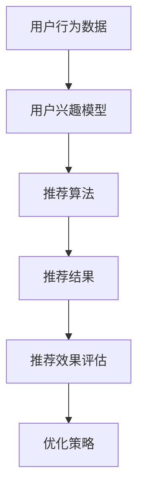

                 

关键词：大模型推荐、效果评估、影响因素、优化策略、算法原理、数学模型、项目实践、应用场景

摘要：本文主要探讨大模型推荐系统中影响推荐效果的关键因素，包括算法设计、数据质量、用户行为分析等方面。通过深入分析，本文提出了相应的优化策略，并基于实际项目实践，展示了优化策略的有效性。此外，文章还展望了未来发展趋势与面临的挑战。

## 1. 背景介绍

随着互联网的快速发展，信息过载成为了一个普遍问题。为了帮助用户在海量信息中找到他们感兴趣的内容，推荐系统应运而生。推荐系统通过对用户历史行为、兴趣偏好等数据的分析，为用户个性化地推荐相关内容。近年来，随着深度学习技术的进步，大模型推荐系统得到了广泛应用。

大模型推荐系统通常包括以下几个关键组件：数据采集、用户行为分析、推荐算法、结果评估等。其中，推荐算法的设计与优化是影响推荐效果的核心因素。

然而，在实际应用中，大模型推荐系统面临着诸多挑战。一方面，推荐算法的优化需要考虑到数据质量、用户行为多样性等因素；另一方面，推荐效果的评价与优化也需要更加科学的方法。本文将围绕这些问题，探讨大模型推荐效果的影响因素与优化策略。

## 2. 核心概念与联系

为了深入理解大模型推荐系统的架构，我们首先介绍几个核心概念：

### 2.1. 用户兴趣模型

用户兴趣模型是推荐系统的基础。它通过分析用户的历史行为、兴趣偏好等信息，构建出一个反映用户当前兴趣的模型。用户兴趣模型的准确性直接影响到推荐结果的准确性。

### 2.2. 物品（内容）模型

物品模型则是用来表示推荐系统中的各种内容，如新闻、商品、音乐等。物品模型包含了物品的特征信息，如文本、图像、标签等。这些特征信息用于推荐算法的计算。

### 2.3. 推荐算法

推荐算法是推荐系统的核心，负责根据用户兴趣模型和物品模型，生成推荐结果。常见的推荐算法包括基于协同过滤、基于内容的推荐、混合推荐等。

### 2.4. 推荐效果评估

推荐效果评估是评价推荐系统性能的重要手段。常用的评估指标包括准确率、召回率、F1值等。通过评估，我们可以了解到推荐系统的优缺点，进而进行优化。

为了更好地理解这些核心概念之间的关系，我们可以使用Mermaid流程图进行描述：

在上述流程图中，用户行为数据是构建用户兴趣模型的基础，用户兴趣模型是推荐算法的输入，推荐算法生成推荐结果，并通过推荐效果评估进行优化。

## 3. 核心算法原理 & 具体操作步骤

### 3.1 算法原理概述

在大模型推荐系统中，推荐算法的设计与优化至关重要。本文主要介绍基于深度学习的推荐算法，并详细阐述其原理与操作步骤。

### 3.2 算法步骤详解

#### 步骤1：数据预处理

首先，对用户行为数据进行预处理，包括数据清洗、去重、缺失值填充等。然后，将预处理后的数据分为训练集、验证集和测试集。

#### 步骤2：构建用户兴趣模型

利用用户行为数据，通过深度学习模型（如神经网络）构建用户兴趣模型。用户兴趣模型可以捕获用户的长期和短期兴趣变化。

#### 步骤3：构建物品模型

对推荐系统中的物品（内容）进行特征提取，构建物品模型。物品模型可以包含文本、图像、标签等多种特征。

#### 步骤4：推荐算法训练

将用户兴趣模型和物品模型输入到推荐算法中，进行模型训练。常见的推荐算法包括基于协同过滤、基于内容的推荐、混合推荐等。

#### 步骤5：推荐结果生成

利用训练好的推荐算法，为每个用户生成个性化推荐列表。推荐结果可以通过排序、筛选等操作进行优化。

#### 步骤6：推荐效果评估

使用评估指标（如准确率、召回率、F1值等）对推荐结果进行评估。根据评估结果，调整推荐算法参数，进行优化。

### 3.3 算法优缺点

#### 优点：

1. **高效性**：基于深度学习的推荐算法可以处理大规模用户行为数据和物品特征，具有较高的计算效率。
2. **灵活性**：深度学习模型可以自适应地调整用户兴趣模型和物品模型，适应不同的应用场景。
3. **多样性**：基于深度学习的推荐算法可以生成多样性的推荐结果，提高用户满意度。

#### 缺点：

1. **数据依赖性**：推荐算法的性能依赖于用户行为数据和物品特征数据的丰富性，数据质量对推荐效果有较大影响。
2. **训练时间**：深度学习模型的训练时间较长，需要较大计算资源。

### 3.4 算法应用领域

基于深度学习的推荐算法广泛应用于电子商务、社交媒体、在线教育、新闻推荐等领域。在实际应用中，可以根据具体业务场景，灵活调整算法参数和模型结构，提高推荐效果。

## 4. 数学模型和公式 & 详细讲解 & 举例说明

在大模型推荐系统中，数学模型和公式是构建推荐算法的基础。本文将介绍常用的数学模型和公式，并详细讲解其推导过程和实际应用。

### 4.1 数学模型构建

#### 4.1.1 用户兴趣模型

用户兴趣模型可以通过矩阵分解（Matrix Factorization，MF）方法构建。假设用户行为数据表示为用户-物品评分矩阵$R \in \mathbb{R}^{m \times n}$，其中$m$表示用户数量，$n$表示物品数量。我们可以通过以下矩阵分解方法：

$$
R = U \odot V^T
$$

其中，$U \in \mathbb{R}^{m \times k}$和$V \in \mathbb{R}^{n \times k}$分别是用户和物品的潜因

