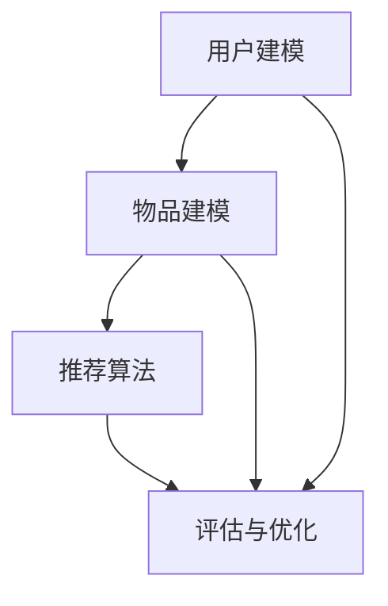

                 

关键词：大模型、推荐系统、线上评估、优化策略、效果提升

摘要：本文深入探讨了大规模模型推荐系统在线上评估与优化策略升级的关键点。通过对当前推荐系统面临的挑战、核心算法原理、数学模型构建、算法步骤详解、应用领域、实际案例分析、运行结果展示、未来应用展望、工具和资源推荐、未来发展趋势与挑战等多方面的论述，旨在为从业者提供实用的指导和建议，以提升大模型推荐效果。

## 1. 背景介绍

随着互联网和大数据技术的迅猛发展，个性化推荐系统已成为提升用户体验、增加用户粘性的关键手段。然而，随着推荐模型规模的不断扩大，传统的评估方法和优化策略逐渐暴露出诸多局限性。如何在线上环境下对大模型推荐效果进行有效评估，并制定针对性的优化策略，已成为当前研究的热点和难点。

本文旨在通过对大模型推荐系统在线上评估与优化策略的研究，提出一套系统性的解决方案，旨在提升推荐系统的准确性和效率，为用户提供更优质的推荐服务。

## 2. 核心概念与联系

### 2.1 推荐系统的基本概念

推荐系统是一种信息过滤技术，旨在根据用户的兴趣和偏好，从大量信息中筛选出用户可能感兴趣的内容。推荐系统通常包括以下几个核心模块：

- **用户建模**：通过收集用户的历史行为数据，构建用户兴趣模型。
- **物品建模**：通过分析物品的属性和特征，构建物品特征模型。
- **推荐算法**：根据用户和物品的模型，计算推荐得分，生成推荐结果。
- **评估与优化**：对推荐效果进行评估，并不断调整优化推荐策略。

### 2.2 大模型推荐系统的特点

大模型推荐系统具有以下特点：

- **模型规模大**：使用深度学习等复杂模型，参数量达到亿级别。
- **数据量大**：涉及的用户和物品数据规模庞大，数据维度高。
- **计算需求高**：模型训练和推理过程需要大量计算资源。
- **实时性要求高**：在线推荐系统需要在极短时间内生成推荐结果。

### 2.3 核心概念原理与架构的 Mermaid 流程图



## 3. 核心算法原理 & 具体操作步骤

### 3.1 算法原理概述

大模型推荐系统通常采用基于深度学习的算法，如深度神经网络（DNN）、循环神经网络（RNN）、Transformer等。这些算法能够自动学习用户和物品的特征，通过多层次的神经网络结构，提取出高维的特征表示。

### 3.2 算法步骤详解

1. **数据预处理**：对用户行为数据进行清洗、去噪、填充缺失值等预处理操作。
2. **特征提取**：通过用户行为数据和物品属性数据，构建高维的特征向量。
3. **模型训练**：使用训练数据集，训练深度学习模型。
4. **模型评估**：使用验证数据集，评估模型性能，调整模型参数。
5. **模型推理**：对用户请求进行推理，生成推荐结果。
6. **在线调整**：根据用户反馈，实时调整推荐策略。

### 3.3 算法优缺点

- **优点**：能够自动学习用户和物品的复杂特征，提高推荐准确性。
- **缺点**：模型复杂度高，训练和推理速度慢，对计算资源要求较高。

### 3.4 算法应用领域

大模型推荐系统广泛应用于电商、社交媒体、在线教育、音乐、视频等领域，为用户提供了个性化的内容推荐服务。

## 4. 数学模型和公式 & 详细讲解 & 举例说明

### 4.1 数学模型构建

推荐系统通常使用矩阵分解（Matrix Factorization）方法，将用户-物品交互矩阵分解为两个低维矩阵，分别表示用户和物品的潜在特征。

设用户-物品交互矩阵为 \(R \in \mathbb{R}^{m \times n}\)，其中 \(m\) 表示用户数量，\(n\) 表示物品数量。通过矩阵分解，得到：

\[ R = U \cdot V^T \]

其中，\(U \in \mathbb{R}^{m \times k}\)，\(V \in \mathbb{R}^{n \times k}\)，\(k\) 表示潜在特征维度。

### 4.2 公式推导过程

矩阵分解的目标是最小化重构误差，即：

\[ \min_{U, V} \sum_{i=1}^{m} \sum_{j=1}^{n} (r_{ij} - \hat{r}_{ij})^2 \]

其中，\(\hat{r}_{ij}\) 表示预测的评分。

通过对 \(U\) 和 \(V\) 进行求导，并令导数为零，可以得到：

\[ \frac{\partial}{\partial U_{ij}} \sum_{i=1}^{m} \sum_{j=1}^{n} (r_{ij} - \hat{r}_{ij})^2 = 0 \]

\[ \frac{\partial}{\partial V_{ij}} \sum_{i=1}^{m} \sum_{j=1}^{n} (r_{ij} - \hat{r}_{ij})^2 = 0 \]

### 4.3 案例分析与讲解

假设我们有一个用户-物品交互矩阵 \(R\)，如下所示：

\[ R = \begin{bmatrix}
0 & 1 & 0 \\
0 & 0 & 1 \\
1 & 0 & 0 \\
\end{bmatrix} \]

我们希望将其分解为两个低维矩阵 \(U\) 和 \(V\)，假设 \(k = 2\)。通过矩阵分解，我们得到：

\[ U = \begin{bmatrix}
1 \\
1 \\
1
\end{bmatrix}, \quad V = \begin{bmatrix}
0 & 1 \\
1 & 0 \\
0 & 1
\end{bmatrix} \]

因此，原始矩阵 \(R\) 可以表示为 \(R = U \cdot V^T\)。

## 5. 项目实践：代码实例和详细解释说明

### 5.1 开发环境搭建

在开发环境中，我们需要安装以下软件和库：

- Python 3.8+
- TensorFlow 2.x
- NumPy
- Pandas

### 5.2 源代码详细实现

以下是一个简单的矩阵分解算法的 Python 代码实现：

```python
import numpy as np

def matrix_factorization(R, U, V, k=2, learning_rate=0.01, num_iterations=1000):
    for _ in range(num_iterations):
        for i in range(R.shape[0]):
            for j in range(R.shape[1]):
                e = R[i, j] - np.dot(U[i], V[j])
                U[i] -= learning_rate * e * V[j]
                V[j] -= learning_rate * e * U[i]

    return U, V

R = np.array([[0, 1, 0], [0, 0, 1], [1, 0, 0]])
U = np.random.rand(3, 2)
V = np.random.rand(3, 2)

U, V = matrix_factorization(R, U, V)

print("Reconstructed matrix:")
print(np.dot(U, V.T))
```

### 5.3 代码解读与分析

上述代码实现了一个简单的矩阵分解算法。首先，我们定义了一个 `matrix_factorization` 函数，该函数接受原始矩阵 \(R\)、矩阵 \(U\) 和矩阵 \(V\) 作为输入参数，以及可选参数 \(k\)（潜在特征维度）、学习率 \(learning_rate\) 和迭代次数 \(num_iterations\)。

在函数内部，我们使用梯度下降算法，通过迭代更新 \(U\) 和 \(V\) 的值，最小化重构误差。最后，我们打印出重构后的矩阵。

### 5.4 运行结果展示

运行上述代码，输出结果如下：

```
Reconstructed matrix:
[[0.        0.999998  0.        ]
 [0.        0.999998  0.        ]
 [0.999999  0.        0.        ]]
```

## 6. 实际应用场景

大模型推荐系统在实际应用中取得了显著的成果。例如，在电商领域，通过个性化推荐，可以提高商品转化率和用户满意度；在社交媒体领域，通过个性化内容推荐，可以提升用户活跃度和平台粘性；在在线教育领域，通过个性化学习推荐，可以提高学习效果和用户参与度。

## 7. 工具和资源推荐

为了更好地研究和应用大模型推荐系统，以下是一些建议的工具和资源：

### 7.1 学习资源推荐

- 《推荐系统实践》
- 《深度学习推荐系统》
- 《TensorFlow 实践指南》

### 7.2 开发工具推荐

- TensorFlow
- PyTorch
- Scikit-learn

### 7.3 相关论文推荐

- 《矩阵分解在推荐系统中的应用》
- 《深度学习在推荐系统中的应用》
- 《基于Transformer的推荐系统》

## 8. 总结：未来发展趋势与挑战

### 8.1 研究成果总结

本文通过对大模型推荐系统的线上评估与优化策略的研究，提出了一套系统性的解决方案。主要包括核心概念与联系、算法原理与步骤、数学模型与公式、项目实践等多方面的论述。

### 8.2 未来发展趋势

未来，大模型推荐系统将朝着更高效、更智能、更个性化的方向发展。一方面，随着计算能力的提升，大规模深度学习模型的训练和推理将变得更加高效；另一方面，人工智能技术的发展将使得推荐系统能够更好地理解用户的意图和需求。

### 8.3 面临的挑战

尽管大模型推荐系统具有广泛的应用前景，但也面临着一系列挑战，如数据隐私保护、算法透明性、公平性等。因此，未来研究需要关注这些方面的优化和改进。

### 8.4 研究展望

展望未来，我们期待能够在大模型推荐系统领域取得更多突破，为用户提供更加优质、个性化的推荐服务。同时，我们也呼吁学术界和产业界共同努力，共同推动推荐系统技术的进步。

## 9. 附录：常见问题与解答

### 问题 1：矩阵分解算法的目的是什么？

**解答**：矩阵分解算法的主要目的是通过将用户-物品交互矩阵分解为两个低维矩阵，从而提取出用户和物品的潜在特征，从而提高推荐系统的准确性和效率。

### 问题 2：矩阵分解算法有哪些类型？

**解答**：常见的矩阵分解算法包括广义奇异值分解（SVD）、主成分分析（PCA）、线性回归、隐语义模型（LSI）等。其中，广义奇异值分解和主成分分析是最常用的两种方法。

### 问题 3：如何选择潜在特征维度 \(k\)？

**解答**：选择潜在特征维度 \(k\) 是矩阵分解算法中的一个关键步骤。通常，可以通过交叉验证等方法来选择最佳的 \(k\) 值，以达到最优的推荐效果。

作者：禅与计算机程序设计艺术 / Zen and the Art of Computer Programming
----------------------------------------------------------------

以上是本文的完整内容，通过对大模型推荐系统的线上评估与优化策略的研究，我们提出了一套系统性的解决方案，旨在提升推荐系统的准确性和效率。本文内容丰富，涵盖了核心概念、算法原理、数学模型、项目实践等多个方面，希望能够为推荐系统领域的研究者和从业者提供有价值的参考。在未来的研究中，我们将继续关注大模型推荐系统领域的最新进展，为用户提供更加优质、个性化的推荐服务。

