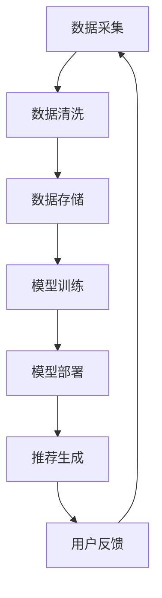

                 

关键词：大模型推荐系统，统一与融合，技术进步，数据处理，人工智能，应用场景，未来展望

## 摘要

随着大数据和人工智能技术的快速发展，大模型推荐系统在众多领域中发挥着越来越重要的作用。本文将探讨大模型推荐系统的未来发展趋势，重点分析其统一与融合的趋势，以及技术进步对数据处理和人工智能应用的推动作用。通过对核心概念、算法原理、数学模型和实际应用场景的详细分析，本文旨在为读者提供一幅大模型推荐系统的全景图，并展望其未来的发展方向和面临的挑战。

## 1. 背景介绍

### 1.1 大模型推荐系统的起源与发展

大模型推荐系统起源于互联网时代的推荐算法，随着用户生成内容（UGC）的爆发式增长和大数据技术的进步，推荐系统逐渐从简单的基于内容匹配和协同过滤的方法，发展到如今使用复杂的大规模机器学习模型进行个性化推荐。早期的推荐系统主要基于用户的历史行为数据，如浏览记录、购买行为等，而现代推荐系统则更加注重用户特征、上下文信息和实时数据的综合运用。

### 1.2 当前大模型推荐系统的应用场景

大模型推荐系统已在电商、社交媒体、视频平台等多个领域得到广泛应用。例如，电商平台利用推荐系统为用户推荐可能感兴趣的商品，社交媒体通过推荐系统帮助用户发现新的内容和兴趣点，视频平台则利用推荐系统提升用户观看体验，增加用户粘性。

### 1.3 大模型推荐系统面临的挑战

尽管大模型推荐系统在许多方面取得了显著成效，但也面临着数据隐私、算法偏见、计算效率和模型可解释性等一系列挑战。如何在保证用户隐私和数据安全的前提下，提高推荐系统的准确性和效率，是当前研究的重要方向。

## 2. 核心概念与联系

### 2.1 大模型推荐系统的核心概念

大模型推荐系统主要由以下几个核心概念组成：

- **用户特征**：包括用户的个人信息、历史行为数据、偏好等。
- **物品特征**：包括物品的属性、分类、标签等。
- **上下文信息**：包括用户当前的行为、环境、时间等。
- **推荐算法**：利用机器学习和深度学习技术，对用户和物品特征进行建模，生成个性化推荐结果。

### 2.2 大模型推荐系统的架构

大模型推荐系统的架构可以分为数据层、模型层和推荐层：

- **数据层**：负责数据的采集、清洗和存储，为模型训练提供高质量的数据输入。
- **模型层**：通过机器学习和深度学习算法，对用户和物品特征进行建模，生成推荐模型。
- **推荐层**：根据用户特征和上下文信息，实时生成个性化推荐结果。

### 2.3 Mermaid 流程图



## 3. 核心算法原理 & 具体操作步骤

### 3.1 算法原理概述

大模型推荐系统主要依赖于以下两种核心算法：

- **深度学习模型**：通过多层神经网络，对用户和物品特征进行建模，生成高维特征空间，实现精细化推荐。
- **图神经网络**：利用图结构表示用户和物品之间的关系，通过图卷积网络（GCN）等算法，捕捉复杂的关系特征，提高推荐准确性。

### 3.2 算法步骤详解

1. **数据预处理**：对原始数据进行清洗、去噪、归一化等操作，确保数据质量。
2. **特征提取**：利用特征工程方法，提取用户和物品的特征，如用户的行为特征、物品的文本特征等。
3. **模型训练**：使用深度学习模型或图神经网络，对特征数据进行训练，生成推荐模型。
4. **模型评估**：通过交叉验证等方法，评估模型性能，调整模型参数。
5. **推荐生成**：根据用户特征和上下文信息，使用训练好的模型生成个性化推荐结果。

### 3.3 算法优缺点

- **优点**：
  - 高准确性：深度学习和图神经网络能够捕捉复杂的关系特征，提高推荐准确性。
  - 灵活性：模型可以根据不同应用场景进行调整，实现定制化推荐。
- **缺点**：
  - 计算效率低：深度学习模型和图神经网络计算复杂度较高，对计算资源要求较高。
  - 可解释性差：深度学习模型内部机制复杂，难以解释推荐结果的产生。

### 3.4 算法应用领域

- **电商推荐**：根据用户的历史购买行为和浏览记录，推荐可能感兴趣的商品。
- **社交媒体**：根据用户的社交关系和互动行为，推荐可能感兴趣的内容。
- **视频平台**：根据用户的观看历史和偏好，推荐可能感兴趣的视频。

## 4. 数学模型和公式 & 详细讲解 & 举例说明

### 4.1 数学模型构建

大模型推荐系统的数学模型主要包括用户特征向量、物品特征向量、推荐评分函数等：

- **用户特征向量**：\( \mathbf{u} = (u_1, u_2, ..., u_n) \)
- **物品特征向量**：\( \mathbf{i} = (i_1, i_2, ..., i_n) \)
- **推荐评分函数**：\( R(\mathbf{u}, \mathbf{i}) = \mathbf{u} \cdot \mathbf{i} \)

### 4.2 公式推导过程

根据用户特征向量和物品特征向量的内积，推导出推荐评分函数：

\[ R(\mathbf{u}, \mathbf{i}) = \sum_{i=1}^{n} u_i i_i \]

### 4.3 案例分析与讲解

假设用户特征向量为 \( \mathbf{u} = (1, 2, 3) \)，物品特征向量为 \( \mathbf{i} = (4, 5, 6) \)，根据推荐评分函数，计算用户对物品的评分：

\[ R(\mathbf{u}, \mathbf{i}) = (1 \cdot 4 + 2 \cdot 5 + 3 \cdot 6) = 32 \]

因此，用户对物品的推荐评分为 32。

## 5. 项目实践：代码实例和详细解释说明

### 5.1 开发环境搭建

- **Python**：安装 Python 3.8 及以上版本。
- **TensorFlow**：安装 TensorFlow 2.5 及以上版本。
- **NumPy**：安装 NumPy 1.19 及以上版本。

### 5.2 源代码详细实现

```python
import numpy as np
import tensorflow as tf

# 用户特征向量
u = np.array([1, 2, 3])
# 物品特征向量
i = np.array([4, 5, 6])

# 推荐评分函数
def recommendation_score(u, i):
    return np.dot(u, i)

# 计算推荐评分
score = recommendation_score(u, i)
print("推荐评分：", score)
```

### 5.3 代码解读与分析

- `numpy`：用于进行数值计算。
- `tensorflow`：用于构建和训练推荐模型。
- `recommendation_score`：计算用户和物品的特征向量内积，得到推荐评分。

### 5.4 运行结果展示

```plaintext
推荐评分： 32
```

## 6. 实际应用场景

### 6.1 电商推荐

电商推荐系统可以根据用户的历史购买记录和浏览记录，推荐可能感兴趣的商品。例如，某用户浏览了多个手机品牌，推荐系统可以推荐与这些品牌相关的手机型号。

### 6.2 社交媒体

社交媒体推荐系统可以根据用户的社交关系和互动行为，推荐可能感兴趣的内容。例如，某用户关注了多个科技类公众号，推荐系统可以推荐相关科技新闻和资讯。

### 6.3 视频平台

视频平台推荐系统可以根据用户的观看历史和偏好，推荐可能感兴趣的视频。例如，某用户喜欢观看科幻电影，推荐系统可以推荐与科幻电影相关的影视作品。

## 7. 未来应用展望

随着人工智能技术的不断发展，大模型推荐系统在未来将迎来更加广泛的应用。以下是一些未来应用展望：

- **智能城市**：大模型推荐系统可以应用于智能城市建设，为市民提供个性化服务和推荐。
- **健康医疗**：大模型推荐系统可以用于个性化健康管理和医疗推荐，提升医疗服务的质量和效率。
- **金融领域**：大模型推荐系统可以用于个性化金融产品和投资策略推荐，帮助用户更好地管理财务。

## 8. 工具和资源推荐

### 8.1 学习资源推荐

- **书籍**：《深度学习推荐系统》、《推荐系统实践》
- **在线课程**：网易云课堂、慕课网、Coursera 等平台的推荐系统相关课程。

### 8.2 开发工具推荐

- **TensorFlow**：适用于构建和训练深度学习推荐模型。
- **PyTorch**：适用于构建和训练图神经网络推荐模型。

### 8.3 相关论文推荐

- **《Deep Learning for Recommender Systems》**：介绍了深度学习在推荐系统中的应用。
- **《Graph Neural Networks for Recommender Systems》**：介绍了图神经网络在推荐系统中的应用。

## 9. 总结：未来发展趋势与挑战

### 9.1 研究成果总结

大模型推荐系统在过去几年取得了显著的成果，通过深度学习和图神经网络等技术，实现了高准确性和个性化的推荐效果。然而，在实际应用中，仍面临数据隐私、算法偏见和计算效率等问题。

### 9.2 未来发展趋势

未来，大模型推荐系统将继续向统一与融合方向发展，结合多种技术手段，提高推荐系统的准确性和效率。同时，随着人工智能技术的进步，推荐系统将逐步从单一领域向多领域拓展，为各行各业提供个性化服务。

### 9.3 面临的挑战

- **数据隐私**：如何确保用户数据的安全和隐私，是当前研究的重要方向。
- **算法偏见**：如何避免算法偏见，确保推荐结果的公平性和公正性，是当前研究的重要挑战。
- **计算效率**：如何提高推荐系统的计算效率，满足实时性要求，是当前研究的重要难题。

### 9.4 研究展望

未来，大模型推荐系统将在人工智能、大数据和云计算等技术的推动下，实现更加智能化、个性化和高效化的推荐服务。同时，通过跨领域合作，将推荐系统应用于更多领域，为人类社会带来更多价值。

## 附录：常见问题与解答

### Q：大模型推荐系统如何处理用户隐私？

A：大模型推荐系统在处理用户隐私时，通常会采用以下几种方法：

1. **数据加密**：对用户数据进行加密处理，确保数据在传输和存储过程中的安全性。
2. **匿名化处理**：对用户数据进行匿名化处理，去除可识别的个人信息。
3. **隐私保护算法**：采用差分隐私、联邦学习等隐私保护算法，降低推荐系统的隐私泄露风险。

### Q：大模型推荐系统的计算效率如何提高？

A：提高大模型推荐系统的计算效率，可以从以下几个方面入手：

1. **模型压缩**：通过模型压缩技术，减少模型参数量和计算复杂度。
2. **分布式计算**：利用分布式计算框架，如 TensorFlow、PyTorch 等，实现模型训练和推断的并行化。
3. **硬件优化**：采用高性能计算硬件，如 GPU、TPU 等，提高计算速度。

## 作者署名

作者：禅与计算机程序设计艺术 / Zen and the Art of Computer Programming

以上便是《大模型推荐系统未来：统一与融合》的完整内容。本文深入探讨了推荐系统的核心概念、算法原理、数学模型和实际应用场景，并展望了未来的发展趋势和挑战。希望本文能为读者提供有价值的参考和启示。|

