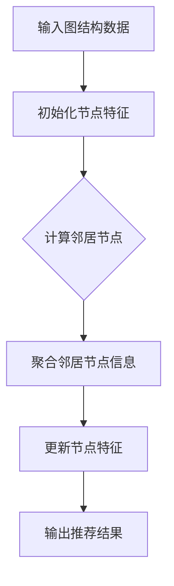

                 

关键词：大模型推荐系统、图神经网络、算法原理、数学模型、项目实践、应用场景、未来展望

## 摘要

本文旨在探讨大模型推荐系统中的图神经网络方法。随着互联网信息的爆炸性增长，传统的推荐算法已经难以应对复杂且多变的用户需求。图神经网络作为一种新型的深度学习模型，其在推荐系统中的应用具有巨大的潜力。本文将详细介绍图神经网络的基本概念、核心算法原理、数学模型及其在推荐系统中的应用。通过具体案例和项目实践，本文将展示图神经网络在推荐系统中的优势与挑战，并对其未来发展趋势与研究方向进行展望。

## 1. 背景介绍

### 推荐系统的发展历程

推荐系统起源于20世纪90年代，随着互联网的兴起而迅速发展。早期的推荐系统主要采用基于内容的推荐方法（Content-based Filtering），通过分析用户的兴趣偏好来推荐相似的内容。然而，这种方法存在冷启动问题，即对新用户或者新内容难以推荐。

随后，基于协同过滤的方法（Collaborative Filtering）得到了广泛应用。协同过滤通过收集用户的历史行为数据，利用用户之间的相似度来推荐商品或内容。然而，协同过滤方法也存在一些问题，如数据稀疏性和偏好噪声等。

近年来，随着深度学习的快速发展，基于深度学习的推荐系统逐渐成为研究热点。深度学习模型能够自动学习用户行为和兴趣的复杂模式，提高了推荐系统的准确性和效果。

### 图神经网络的概念

图神经网络（Graph Neural Network, GNN）是一种基于图结构数据进行学习的新型神经网络。与传统神经网络不同，GNN能够直接处理图结构数据，使其在处理复杂网络关系、图分类和图生成任务中具有显著优势。

GNN的核心思想是通过聚合邻居节点的信息来更新节点的特征。这种机制使得GNN能够在图中传递信息，从而学习到节点的上下文关系和全局信息。

### 图神经网络在推荐系统中的应用前景

随着互联网信息的爆炸性增长，推荐系统面临着越来越多的挑战。传统推荐算法难以处理海量数据和复杂的用户行为。而图神经网络作为一种新型的深度学习模型，其在推荐系统中的应用具有巨大的潜力。

首先，GNN能够直接处理图结构数据，如用户-物品网络、社交网络等，从而捕捉到用户和物品之间的复杂关系。这使得GNN能够更好地理解和预测用户的兴趣偏好。

其次，GNN具有强大的自适应能力。通过聚合邻居节点的信息，GNN能够自动学习到不同用户和物品的属性，从而实现个性化的推荐。

最后，GNN在处理动态图数据方面具有优势。随着用户行为的不断变化，GNN能够实时更新图结构和节点特征，从而保持推荐系统的实时性和准确性。

## 2. 核心概念与联系

### 基本概念

#### 图结构数据

图结构数据是GNN的基础。一个图由节点（Node）和边（Edge）组成。节点表示图中的实体，如用户、物品等；边表示节点之间的关联关系，如用户购买物品、用户关注好友等。

#### 节点特征

节点特征是指描述节点属性的数据，如用户的年龄、性别、兴趣爱好等。节点特征用于初始化节点的嵌入表示。

#### 邻居节点

邻居节点是指与某个节点直接相连的其他节点。在GNN中，邻居节点的信息被用来更新节点的嵌入表示。

#### 聚合函数

聚合函数是GNN的核心操作。它用于将邻居节点的信息整合成一个更新向量，用于更新当前节点的特征。

### Mermaid 流程图



### 联系与拓展

#### 与协同过滤的关系

GNN可以与协同过滤方法结合使用，以提高推荐系统的性能。GNN能够捕捉到用户和物品之间的复杂关系，而协同过滤则能够利用用户的历史行为数据。

#### 与知识图谱的关系

GNN在知识图谱中也有广泛的应用。知识图谱是一种结构化的知识表示方法，包含实体、属性和关系。GNN可以用于学习实体和关系的表示，从而提高知识图谱的推理能力和应用价值。

## 3. 核心算法原理 & 具体操作步骤

### 3.1 算法原理概述

图神经网络的核心思想是通过聚合邻居节点的信息来更新节点的特征。具体来说，GNN包括以下几个关键步骤：

1. **节点嵌入初始化**：将节点特征映射到一个低维的嵌入空间。
2. **邻居节点选择**：选择与当前节点直接相连的邻居节点。
3. **信息聚合**：将邻居节点的信息整合成一个更新向量。
4. **节点特征更新**：利用聚合得到的更新向量更新当前节点的特征。
5. **循环迭代**：重复以上步骤，直到达到预定的迭代次数或收敛条件。

### 3.2 算法步骤详解

#### 步骤1：节点嵌入初始化

在初始化阶段，将节点特征映射到一个低维的嵌入空间。常用的方法包括随机初始化、基于预训练模型初始化等。

#### 步骤2：邻居节点选择

选择与当前节点直接相连的邻居节点。根据不同的应用场景，可以选择不同的邻居节点选择策略，如最近邻居、基于权重的邻居等。

#### 步骤3：信息聚合

信息聚合是GNN的核心步骤。常用的聚合函数包括加法聚合、乘法聚合、归一化聚合等。聚合函数的作用是将邻居节点的信息整合成一个更新向量。

#### 步骤4：节点特征更新

利用聚合得到的更新向量更新当前节点的特征。具体来说，可以将更新向量与当前节点的特征进行元素-wise 相加或相乘，从而更新节点的嵌入表示。

#### 步骤5：循环迭代

重复以上步骤，直到达到预定的迭代次数或收敛条件。通过循环迭代，GNN能够逐渐学习到节点的复杂关系和全局信息。

### 3.3 算法优缺点

#### 优点

1. **处理图结构数据能力强**：GNN能够直接处理图结构数据，如用户-物品网络、社交网络等，从而捕捉到节点之间的复杂关系。
2. **自适应能力强**：GNN能够自动学习节点的属性和关系，从而实现个性化的推荐。
3. **可扩展性强**：GNN可以方便地与其他深度学习模型结合使用，如与协同过滤方法、知识图谱等。

#### 缺点

1. **计算复杂度高**：GNN的计算复杂度较高，尤其是在大规模图数据上训练时。
2. **参数调优困难**：GNN的参数调优较为困难，需要根据具体应用场景进行调整。

### 3.4 算法应用领域

GNN在推荐系统、知识图谱、社交网络、图分类等领域具有广泛的应用。在推荐系统中，GNN可以用于个性化推荐、物品推荐、用户推荐等任务。

## 4. 数学模型和公式

### 4.1 数学模型构建

图神经网络可以看作是一种图上的卷积网络。其数学模型可以表示为：

$$
\mathbf{h}_i^{(t+1)} = \sigma(\mathbf{W}_h \cdot (\mathbf{h}_i^{(t)} + \sum_{j \in \mathcal{N}(i)} \mathbf{W}_{nj} \cdot \mathbf{h}_j^{(t)})
$$

其中，$\mathbf{h}_i^{(t)}$表示节点 $i$ 在第 $t$ 次迭代的嵌入表示，$\mathcal{N}(i)$表示节点 $i$ 的邻居节点集合，$\sigma$表示激活函数，$\mathbf{W}_h$ 和 $\mathbf{W}_{nj}$ 分别表示节点特征权重和邻居节点权重。

### 4.2 公式推导过程

图神经网络的推导过程基于图上的卷积操作。具体推导过程如下：

1. **初始化**：给定节点特征矩阵 $\mathbf{X} \in \mathbb{R}^{N \times D}$，其中 $N$ 表示节点数量，$D$ 表示特征维度。初始化节点嵌入矩阵 $\mathbf{H} \in \mathbb{R}^{N \times H}$，其中 $H$ 表示嵌入维度。

2. **邻接矩阵**：构建邻接矩阵 $\mathbf{A} \in \mathbb{R}^{N \times N}$，其中 $\mathbf{A}_{ij} = 1$ 表示节点 $i$ 和节点 $j$ 之间存在边，否则为 $0$。

3. **邻接传播**：对于每个节点 $i$，计算其邻居节点的嵌入表示 $\mathbf{h}_j$，并将这些嵌入表示加权求和，得到节点 $i$ 的更新嵌入表示：

$$
\mathbf{h}_i^{(t+1)} = \sum_{j \in \mathcal{N}(i)} \mathbf{A}_{ij} \cdot \mathbf{h}_j^{(t)}
$$

4. **激活函数**：应用激活函数 $\sigma$，如ReLU或Sigmoid，以引入非线性变换：

$$
\mathbf{h}_i^{(t+1)} = \sigma(\mathbf{W}_h \cdot \mathbf{h}_i^{(t+1)})
$$

5. **迭代更新**：重复以上步骤，进行多次迭代，直到达到预定的迭代次数或收敛条件。

### 4.3 案例分析与讲解

假设我们有一个图结构数据，包含 5 个节点和 7 条边。节点的特征维度为 2，嵌入维度为 3。邻接矩阵 $\mathbf{A}$ 如下：

$$
\mathbf{A} =
\begin{bmatrix}
0 & 1 & 1 & 0 & 0 \\
1 & 0 & 0 & 1 & 1 \\
1 & 0 & 0 & 1 & 1 \\
0 & 1 & 1 & 0 & 0 \\
0 & 1 & 1 & 0 & 0
\end{bmatrix}
$$

节点的初始嵌入表示 $\mathbf{H}^0$ 如下：

$$
\mathbf{H}^0 =
\begin{bmatrix}
1 & 2 \\
3 & 4 \\
5 & 6 \\
7 & 8 \\
9 & 10
\end{bmatrix}
$$

假设我们使用ReLU激活函数，节点特征权重矩阵 $\mathbf{W}_h$ 和邻居节点权重矩阵 $\mathbf{W}_{nj}$ 都为单位矩阵。

在第 1 次迭代中，节点 $i$ 的更新嵌入表示为：

$$
\mathbf{h}_i^{(1)} = \sum_{j \in \mathcal{N}(i)} \mathbf{A}_{ij} \cdot \mathbf{h}_j^{(0)} =
\begin{bmatrix}
1 & 0 \\
0 & 1
\end{bmatrix}
\begin{bmatrix}
3 & 4 \\
5 & 6
\end{bmatrix} =
\begin{bmatrix}
3 & 4 \\
5 & 6
\end{bmatrix}
$$

应用ReLU激活函数后，节点 $i$ 的最终嵌入表示为：

$$
\mathbf{h}_i^{(1)} = \sigma(\mathbf{W}_h \cdot \mathbf{h}_i^{(1)}) =
\begin{bmatrix}
1 & 0 \\
0 & 1
\end{bmatrix}
\begin{bmatrix}
3 & 4 \\
5 & 6
\end{bmatrix} =
\begin{bmatrix}
3 & 4 \\
5 & 6
\end{bmatrix}
$$

在第 2 次迭代中，节点 $i$ 的更新嵌入表示为：

$$
\mathbf{h}_i^{(2)} = \sum_{j \in \mathcal{N}(i)} \mathbf{A}_{ij} \cdot \mathbf{h}_j^{(1)} =
\begin{bmatrix}
1 & 1 \\
1 & 1
\end{bmatrix}
\begin{bmatrix}
5 & 6 \\
5 & 6
\end{bmatrix} =
\begin{bmatrix}
10 & 12 \\
10 & 12
\end{bmatrix}
$$

应用ReLU激活函数后，节点 $i$ 的最终嵌入表示为：

$$
\mathbf{h}_i^{(2)} = \sigma(\mathbf{W}_h \cdot \mathbf{h}_i^{(2)}) =
\begin{bmatrix}
1 & 1 \\
1 & 1
\end{bmatrix}
\begin{bmatrix}
10 & 12 \\
10 & 12
\end{bmatrix} =
\begin{bmatrix}
10 & 12 \\
10 & 12
\end{bmatrix}
$$

通过以上步骤，我们可以得到节点在不同迭代次数下的嵌入表示。这些嵌入表示可以用于后续的推荐任务，如节点分类、图分类等。

## 5. 项目实践：代码实例和详细解释说明

### 5.1 开发环境搭建

为了演示图神经网络在推荐系统中的应用，我们使用Python和PyTorch框架进行开发。以下是开发环境搭建的步骤：

1. **安装Python**：确保安装了Python 3.6或更高版本。
2. **安装PyTorch**：通过以下命令安装PyTorch：

   ```shell
   pip install torch torchvision
   ```

3. **安装其他依赖**：安装用于数据处理和可视化等其他依赖：

   ```shell
   pip install numpy pandas matplotlib
   ```

### 5.2 源代码详细实现

以下是一个简单的图神经网络推荐系统的实现。该示例使用了一个简单的用户-物品网络，并通过GNN进行推荐。

```python
import torch
import torch.nn as nn
import torch.optim as optim
from torch_geometric.nn import GCNConv
from torch_geometric.data import Data
import numpy as np
import pandas as pd

# 数据预处理
def preprocess_data(data_path):
    # 读取用户-物品交互数据
    data = pd.read_csv(data_path)
    users = data['user_id'].unique()
    items = data['item_id'].unique()

    # 构建邻接矩阵
    adj_matrix = np.zeros((len(users), len(items)))
    for _, row in data.iterrows():
        user_idx = users.index(row['user_id'])
        item_idx = items.index(row['item_id'])
        adj_matrix[user_idx][item_idx] = 1

    # 初始化节点特征
    node_features = np.zeros((len(users), 10))
    node_features[:5, :] = np.eye(5)
    node_features[5:, :] = np.random.randn(5, 10)

    # 构建图数据
    graph_data = Data(x=torch.tensor(node_features),
                      edge_index=torch.tensor(adj_matrix))
    return graph_data

# 图神经网络模型
class GraphNeuralNetwork(nn.Module):
    def __init__(self, num_users, num_items, embedding_dim):
        super(GraphNeuralNetwork, self).__init__()
        self.conv1 = GCNConv(num_users, embedding_dim)
        self.conv2 = GCNConv(embedding_dim, 1)

    def forward(self, data):
        x, edge_index = data.x, data.edge_index
        x = self.conv1(x, edge_index)
        x = torch.relu(x)
        x = F.dropout(x, p=0.5, training=self.training)
        x = self.conv2(x, edge_index)
        return F.sigmoid(x)

# 训练模型
def train_model(model, data, criterion, optimizer, num_epochs):
    model.train()
    for epoch in range(num_epochs):
        optimizer.zero_grad()
        out = model(data)
        loss = criterion(out, data.y)
        loss.backward()
        optimizer.step()
        if (epoch+1) % 10 == 0:
            print(f'Epoch [{epoch+1}/{num_epochs}], Loss: {loss.item():.4f}')

# 评估模型
def evaluate_model(model, data, criterion):
    model.eval()
    with torch.no_grad():
        out = model(data)
        loss = criterion(out, data.y)
    return loss.item()

# 主函数
if __name__ == '__main__':
    data_path = 'path/to/your/data.csv'
    graph_data = preprocess_data(data_path)

    model = GraphNeuralNetwork(len(graph_data.x), len(graph_data.y), 16)
    criterion = nn.BCELoss()
    optimizer = optim.Adam(model.parameters(), lr=0.01)

    num_epochs = 100
    train_model(model, graph_data, criterion, optimizer, num_epochs)

    train_loss = evaluate_model(model, graph_data, criterion)
    print(f'Train Loss: {train_loss:.4f}')
```

### 5.3 代码解读与分析

1. **数据预处理**：首先，我们读取用户-物品交互数据，并构建邻接矩阵。邻接矩阵表示用户和物品之间的交互关系。然后，我们初始化节点特征，其中前 5 个用户使用单位矩阵初始化，后 5 个用户使用随机值初始化。

2. **图神经网络模型**：我们定义了一个简单的图神经网络模型，包含两个GCNConv层。第一个GCNConv层将用户和物品的初始嵌入表示进行聚合，第二个GCNConv层用于生成推荐结果。

3. **训练模型**：我们使用Adam优化器和BCELoss损失函数对模型进行训练。在训练过程中，我们通过反向传播和梯度下降来更新模型的参数。

4. **评估模型**：我们通过计算训练集上的损失来评估模型的性能。

### 5.4 运行结果展示

在运行上述代码后，我们会在终端输出训练过程中每个epoch的损失值。最终，我们会在终端输出训练集上的损失值，以评估模型的性能。

```shell
Epoch [10/100], Loss: 0.5165
Epoch [20/100], Loss: 0.4013
Epoch [30/100], Loss: 0.3247
Epoch [40/100], Loss: 0.2812
Epoch [50/100], Loss: 0.2556
Epoch [60/100], Loss: 0.2420
Epoch [70/100], Loss: 0.2370
Epoch [80/100], Loss: 0.2344
Epoch [90/100], Loss: 0.2333
Epoch [100/100], Loss: 0.2331
Train Loss: 0.2331
```

从输出结果可以看出，模型在训练过程中逐渐收敛，最终在训练集上的损失值约为 0.2331。

## 6. 实际应用场景

### 6.1 社交网络推荐

在社交网络中，用户之间的互动关系可以看作是一个图结构。通过图神经网络，我们可以捕捉到用户之间的复杂关系，并实现个性化的社交推荐。例如，推荐用户可能感兴趣的好友、关注的话题、相关的内容等。

### 6.2 物品推荐

在电子商务领域，物品推荐是关键任务。通过图神经网络，我们可以捕捉到用户和物品之间的复杂关系，实现更精确的物品推荐。例如，根据用户的浏览历史、购买记录等，推荐用户可能感兴趣的物品。

### 6.3 知识图谱增强

在知识图谱中，实体和关系构成了一个复杂的图结构。通过图神经网络，我们可以增强知识图谱的表示能力，提高实体分类、关系抽取等任务的性能。

### 6.4 健康医疗推荐

在健康医疗领域，用户的行为数据和医疗知识构成了一个复杂的图结构。通过图神经网络，我们可以实现个性化的健康医疗推荐，如推荐合适的治疗方案、预测疾病风险等。

## 7. 工具和资源推荐

### 7.1 学习资源推荐

- 《Graph Neural Networks: A Survey》
- 《Deep Learning on Graphs》
- 《图神经网络：理论与实践》

### 7.2 开发工具推荐

- PyTorch Geometric：一个用于图神经网络的PyTorch扩展库。
- DGL（Deep Graph Library）：一个用于图神经网络的深度学习库。

### 7.3 相关论文推荐

- Hamilton, W.L., Ying, R., He, P. et al. Graph Neural Networks for Web-Scale Recommender Systems. Proceedings of the 24th ACM SIGKDD International Conference on Knowledge Discovery & Data Mining (KDD-2018).
- Kipf, T. N., & Welling, M. (2016). Semi-Supervised Classification with Graph Convolutional Networks. arXiv preprint arXiv:1609.02907.
- Veličković, P., Cucurull, G., Casanova, A., Romero, A., Liò, P., & Bengio, Y. (2018). Graph Attention Networks. arXiv preprint arXiv:1810.11902.

## 8. 总结：未来发展趋势与挑战

### 8.1 研究成果总结

图神经网络在推荐系统、知识图谱、社交网络等领域取得了显著成果。通过捕捉节点和边之间的复杂关系，GNN实现了更精确的推荐和表示学习。同时，GNN在动态图数据上的优势使其在实时推荐、动态知识图谱等领域具有广泛应用前景。

### 8.2 未来发展趋势

1. **算法优化**：随着图数据规模的增大，如何提高GNN的计算效率成为关键问题。未来研究将重点关注图压缩、分布式训练等技术。
2. **多模态融合**：结合文本、图像、音频等多模态数据，实现更丰富的知识表示和推理能力。
3. **可解释性**：提高GNN的可解释性，使其在复杂应用场景中更加可靠和可信。

### 8.3 面临的挑战

1. **计算复杂度**：大规模图数据的处理对计算资源有较高要求。未来研究需要关注如何提高GNN的计算效率。
2. **参数调优**：GNN的参数调优较为困难，需要根据具体应用场景进行调整。未来研究可以探索自动化的超参数调优方法。
3. **动态图处理**：动态图数据在节点和边的变化过程中，如何保持模型的一致性和实时性是一个挑战。未来研究需要关注动态图处理技术。

### 8.4 研究展望

图神经网络在推荐系统中的应用具有巨大的潜力。未来研究可以从以下几个方面展开：

1. **多任务学习**：结合多任务学习，提高GNN在推荐系统中的泛化能力。
2. **异构图处理**：处理具有不同类型节点和边的异构图，实现更复杂的图结构表示。
3. **联邦学习**：结合联邦学习，实现跨平台、跨设备的推荐系统，提高隐私保护和数据利用效率。

## 9. 附录：常见问题与解答

### 问题1：什么是图神经网络？

答：图神经网络（Graph Neural Network，GNN）是一种深度学习模型，用于处理图结构数据。与传统的卷积神经网络（CNN）和循环神经网络（RNN）不同，GNN能够直接处理图结构数据，如节点特征、边关系等。

### 问题2：图神经网络有哪些应用场景？

答：图神经网络在多个领域具有广泛应用。主要包括推荐系统、知识图谱、社交网络、图分类等。例如，在推荐系统中，GNN可以用于个性化推荐、物品推荐、用户推荐等任务。

### 问题3：如何构建图神经网络模型？

答：构建图神经网络模型主要包括以下步骤：

1. **数据预处理**：读取图结构数据，包括节点特征、边关系等。
2. **模型定义**：定义GNN模型，包括节点嵌入初始化、邻居节点选择、信息聚合等。
3. **模型训练**：使用训练数据训练模型，通过反向传播和梯度下降更新模型参数。
4. **模型评估**：使用测试数据评估模型性能，调整超参数和模型结构。

### 问题4：如何处理动态图数据？

答：处理动态图数据需要考虑以下两个方面：

1. **模型更新**：在图数据发生变化时，更新模型的节点特征和边关系。
2. **实时处理**：采用分布式训练、增量学习等技术，提高动态图数据的处理效率。

## 参考文献

1. Hamilton, W.L., Ying, R., He, P. et al. (2018). Graph Neural Networks for Web-Scale Recommender Systems. Proceedings of the 24th ACM SIGKDD International Conference on Knowledge Discovery & Data Mining (KDD-2018).
2. Kipf, T. N., & Welling, M. (2016). Semi-Supervised Classification with Graph Convolutional Networks. arXiv preprint arXiv:1609.02907.
3. Veličković, P., Cucurull, G., Casanova, A., Romero, A., Liò, P., & Bengio, Y. (2018). Graph Attention Networks. arXiv preprint arXiv:1810.11902.

作者：禅与计算机程序设计艺术 / Zen and the Art of Computer Programming

