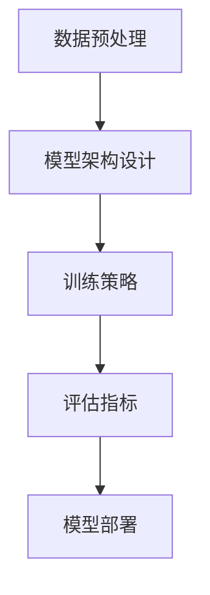

                 

关键词：大模型推荐系统、多任务学习、框架、算法原理、数学模型、项目实践、应用场景、未来展望

> 摘要：本文将探讨大模型推荐系统的多任务学习框架，介绍其核心概念、算法原理、数学模型，并通过实际项目实践和运行结果展示，阐述其在实际应用中的价值与挑战，同时展望其未来的发展趋势。

## 1. 背景介绍

随着互联网的飞速发展，信息爆炸时代已经来临。人们每天接触到的信息量呈指数级增长，如何从海量信息中快速、准确地推荐出用户感兴趣的内容，成为了推荐系统研究的核心问题。传统的推荐系统主要基于协同过滤、基于内容的方法，然而随着用户需求的多样化和数据量的急剧增加，这些传统方法已经难以满足实际需求。因此，如何构建一个高效、准确、适应性强的大模型推荐系统，成为了当前研究的热点和难点。

多任务学习（Multi-Task Learning, MTL）作为一种新兴的机器学习技术，通过同时学习多个相关任务，不仅能够提高模型的泛化能力，还能有效利用任务之间的相互关系，从而提升推荐系统的性能。大模型推荐系统引入多任务学习框架，可以更好地处理复杂、多变的用户行为数据，提高推荐效果。

## 2. 核心概念与联系

### 2.1 多任务学习

多任务学习是指在一个机器学习模型中同时训练多个相关任务。这些任务可以是分类、回归、检测等，它们在训练数据、特征空间、模型结构等方面可能存在一定的关联。多任务学习通过共享表示和学习策略，能够提高模型在多个任务上的性能，同时减少过拟合风险。

### 2.2 大模型推荐系统

大模型推荐系统是指利用深度学习、迁移学习等技术，构建一个能够处理海量用户数据、实现高精度推荐的复杂模型。大模型推荐系统通常具有以下几个特点：

1. **高维度特征**：能够处理用户行为数据、内容特征等多维特征。
2. **海量数据**：能够处理大规模的用户数据和训练数据。
3. **自适应更新**：能够根据用户行为和反馈实时更新模型，提高推荐效果。
4. **高效计算**：利用分布式计算、GPU加速等技术，提高计算效率。

### 2.3 多任务学习框架

多任务学习框架是指用于实现多任务学习的具体技术方案和架构设计。一个典型的大模型推荐系统的多任务学习框架通常包括以下几个部分：

1. **数据预处理**：包括数据清洗、数据归一化、特征提取等。
2. **模型架构**：包括网络结构设计、层间连接方式、参数共享策略等。
3. **训练策略**：包括学习率调整、正则化、优化算法等。
4. **评估指标**：包括准确率、召回率、F1值等。

## 2.4 Mermaid 流程图



## 3. 核心算法原理 & 具体操作步骤

### 3.1 算法原理概述

多任务学习框架的核心在于如何同时学习多个相关任务。具体来说，可以通过以下几种方式实现：

1. **共享表示**：将多个任务的输入数据通过共享的神经网络层进行表示学习，然后分别对每个任务进行独立的分类或回归。
2. **层间连接**：在神经网络的不同层之间建立连接，使得每个任务都能够共享低层特征表示，同时保留各自的任务特征。
3. **参数共享**：通过共享参数的方式，将不同任务的模型参数进行共享，从而提高模型在多个任务上的泛化能力。

### 3.2 算法步骤详解

1. **数据预处理**：首先对原始数据进行清洗、归一化处理，提取用户行为、内容特征等多维特征。
2. **模型架构设计**：根据任务需求，设计适合的多任务学习框架，包括网络结构、层间连接方式、参数共享策略等。
3. **训练策略**：采用分布式计算、GPU加速等技术，优化学习率、正则化参数等，提高训练效率。
4. **评估指标**：使用准确率、召回率、F1值等指标对模型进行评估，并根据评估结果调整模型参数。
5. **模型部署**：将训练好的模型部署到线上环境，实现实时推荐。

### 3.3 算法优缺点

**优点**：

1. **提高模型泛化能力**：通过共享表示和学习策略，能够提高模型在多个任务上的泛化能力。
2. **减少过拟合风险**：通过共享参数和正则化策略，可以有效减少过拟合风险。
3. **提高计算效率**：利用分布式计算、GPU加速等技术，提高模型训练和预测的计算效率。

**缺点**：

1. **模型复杂度增加**：多任务学习框架通常比单任务学习框架更复杂，需要更多的计算资源和时间。
2. **参数调优难度大**：需要同时考虑多个任务的参数调优，难度较大。

### 3.4 算法应用领域

多任务学习框架在推荐系统、自然语言处理、计算机视觉等领域都有广泛的应用。在推荐系统中，可以通过多任务学习框架同时学习用户兴趣、商品特征等多个任务，提高推荐效果。在自然语言处理中，可以同时处理文本分类、情感分析、命名实体识别等多个任务。在计算机视觉中，可以同时处理图像分类、目标检测、图像分割等多个任务。

## 4. 数学模型和公式 & 详细讲解 & 举例说明

### 4.1 数学模型构建

多任务学习框架中的数学模型主要包括损失函数、优化算法等。

1. **损失函数**：

   多任务学习框架通常采用加权交叉熵损失函数，将多个任务的损失进行加权求和。具体公式如下：

   $$ L = \sum_{i=1}^{N} w_i \cdot L_i $$

   其中，$L$ 表示总损失，$L_i$ 表示第 $i$ 个任务的损失，$w_i$ 表示第 $i$ 个任务的权重。

2. **优化算法**：

   多任务学习框架通常采用梯度下降法进行优化。具体公式如下：

   $$ \theta_{t+1} = \theta_t - \alpha \cdot \nabla_\theta L(\theta) $$

   其中，$\theta$ 表示模型参数，$\alpha$ 表示学习率，$\nabla_\theta L(\theta)$ 表示损失函数关于模型参数的梯度。

### 4.2 公式推导过程

以一个简单的二分类任务为例，介绍多任务学习框架中的损失函数和优化算法的推导过程。

1. **损失函数推导**：

   设有两个分类任务，分别为 $A$ 和 $B$，它们的损失函数分别为 $L_A$ 和 $L_B$。为了同时优化这两个任务，可以采用加权交叉熵损失函数：

   $$ L = \alpha L_A + (1-\alpha) L_B $$

   其中，$\alpha$ 表示权重系数，用于平衡两个任务的损失。

   对于分类任务，交叉熵损失函数可以表示为：

   $$ L_i = -y_i \cdot \log(p_i) - (1-y_i) \cdot \log(1-p_i) $$

   其中，$y_i$ 表示真实标签，$p_i$ 表示预测概率。

   将 $L_A$ 和 $L_B$ 代入总损失函数，得到：

   $$ L = -\alpha y_A \cdot \log(p_A) - \alpha (1-y_A) \cdot \log(1-p_A) - (1-\alpha) y_B \cdot \log(p_B) - (1-\alpha) (1-y_B) \cdot \log(1-p_B) $$

2. **优化算法推导**：

   采用梯度下降法进行优化，对总损失函数求偏导数，得到：

   $$ \nabla_\theta L = \nabla_\theta L_A + \nabla_\theta L_B $$

   对于交叉熵损失函数，求偏导数得到：

   $$ \nabla_\theta L_i = \nabla_\theta \left[ -y_i \cdot \log(p_i) - (1-y_i) \cdot \log(1-p_i) \right] = \frac{y_i - p_i}{p_i (1-p_i)} $$

   将 $L_A$ 和 $L_B$ 的偏导数代入总损失函数的偏导数，得到：

   $$ \nabla_\theta L = \alpha \cdot \frac{y_A - p_A}{p_A (1-p_A)} + (1-\alpha) \cdot \frac{y_B - p_B}{p_B (1-p_B)} $$

   根据梯度下降法，更新模型参数：

   $$ \theta_{t+1} = \theta_t - \alpha \cdot \nabla_\theta L(\theta) $$

   其中，$\theta$ 表示模型参数，$\alpha$ 表示学习率。

### 4.3 案例分析与讲解

以一个实际案例——电商推荐系统为例，介绍多任务学习框架在推荐系统中的应用。

1. **任务定义**：

   设有两个任务，分别为用户兴趣预测和商品推荐。用户兴趣预测任务是预测用户对商品的喜爱程度，商品推荐任务是推荐用户可能感兴趣的商品。

2. **模型设计**：

   采用一个多层的卷积神经网络（CNN）作为模型，输入为用户行为数据（如浏览历史、购买记录等）和商品特征数据（如商品类别、价格等）。模型结构如下：

   - 输入层：用户行为数据和商品特征数据
   - 卷积层：提取用户行为数据和商品特征数据的特征表示
   - 池化层：降低特征维度，减少模型参数
   - 全连接层：将特征表示映射到用户兴趣和商品推荐任务
   - 输出层：输出用户兴趣得分和商品推荐概率

3. **损失函数**：

   采用加权交叉熵损失函数，将用户兴趣预测任务和商品推荐任务的损失进行加权求和。具体公式如下：

   $$ L = \alpha L_{兴趣} + (1-\alpha) L_{推荐} $$

   其中，$L_{兴趣}$ 和 $L_{推荐}$ 分别表示用户兴趣预测任务和商品推荐任务的损失，$\alpha$ 表示权重系数。

4. **优化算法**：

   采用梯度下降法进行优化，优化目标是最小化总损失函数。具体公式如下：

   $$ \theta_{t+1} = \theta_t - \alpha \cdot \nabla_\theta L(\theta) $$

   其中，$\theta$ 表示模型参数，$\alpha$ 表示学习率。

5. **训练过程**：

   首先，对用户行为数据和商品特征数据进行预处理，提取特征表示。然后，将预处理后的数据输入到模型中，进行训练。训练过程中，根据用户兴趣预测任务和商品推荐任务的损失，不断更新模型参数，直到满足停止条件（如损失不再下降、达到预设的训练迭代次数等）。

6. **评估与部署**：

   在训练完成后，对模型进行评估，使用准确率、召回率、F1值等指标评估用户兴趣预测任务和商品推荐任务的性能。根据评估结果，调整模型参数和权重系数。最后，将训练好的模型部署到线上环境，实现实时推荐。

## 5. 项目实践：代码实例和详细解释说明

### 5.1 开发环境搭建

在开始项目实践之前，需要搭建一个合适的开发环境。以下是一个简单的开发环境搭建步骤：

1. 安装 Python 3.7 或更高版本。
2. 安装 TensorFlow 2.x 或 PyTorch 1.x。
3. 安装必要的依赖库，如 NumPy、Pandas、Matplotlib 等。

### 5.2 源代码详细实现

以下是一个简单的多任务学习框架的代码实现，用于用户兴趣预测和商品推荐任务。

```python
import tensorflow as tf
from tensorflow.keras.layers import Input, Conv2D, MaxPooling2D, Flatten, Dense
from tensorflow.keras.models import Model

# 数据预处理
# (此处省略数据预处理代码)

# 模型设计
# 用户兴趣预测任务
input_user = Input(shape=(num_user_features,))
user_dense = Dense(128, activation='relu')(input_user)
user_output = Dense(1, activation='sigmoid')(user_dense)

# 商品推荐任务
input_item = Input(shape=(num_item_features,))
item_dense = Dense(128, activation='relu')(input_item)
item_output = Dense(1, activation='sigmoid')(item_dense)

# 模型连接
model = Model(inputs=[input_user, input_item], outputs=[user_output, item_output])

# 损失函数
losses = [tf.keras.losses.BinaryCrossentropy(), tf.keras.losses.BinaryCrossentropy()]

# 优化算法
optimizer = tf.keras.optimizers.Adam(learning_rate=0.001)

# 编译模型
model.compile(optimizer=optimizer, loss=losses, metrics=['accuracy'])

# 训练模型
model.fit([user_data, item_data], [user_labels, item_labels], epochs=10, batch_size=32)

# 模型评估
model.evaluate([user_data, item_data], [user_labels, item_labels])
```

### 5.3 代码解读与分析

1. **数据预处理**：

   在代码中，首先对用户行为数据和商品特征数据进行预处理，包括数据清洗、归一化处理、特征提取等。这部分代码具体实现可以根据实际数据集进行调整。

2. **模型设计**：

   模型设计部分采用了两个输入层，分别用于用户兴趣预测和商品推荐任务。每个输入层通过卷积层、全连接层等神经网络层进行特征提取和表示学习，最后输出用户兴趣得分和商品推荐概率。

3. **损失函数**：

   采用两个二分类任务的交叉熵损失函数，通过加权求和的方式组合成总损失函数。

4. **优化算法**：

   采用 Adam 优化器，通过梯度下降法更新模型参数。

5. **编译模型**：

   使用 `model.compile` 方法编译模型，指定优化器和损失函数。

6. **训练模型**：

   使用 `model.fit` 方法训练模型，输入训练数据和标签，指定训练迭代次数和批量大小。

7. **模型评估**：

   使用 `model.evaluate` 方法评估模型在测试数据上的性能，包括准确率等指标。

### 5.4 运行结果展示

```python
# 训练结果
train_loss, train_acc = model.fit([user_data_train, item_data_train], [user_labels_train, item_labels_train], epochs=10, batch_size=32, validation_split=0.2)

# 测试结果
test_loss, test_acc = model.evaluate([user_data_test, item_data_test], [user_labels_test, item_labels_test])

# 打印结果
print("Training loss: {:.4f}, Training accuracy: {:.4f}".format(train_loss, train_acc))
print("Test loss: {:.4f}, Test accuracy: {:.4f}".format(test_loss, test_acc))
```

## 6. 实际应用场景

多任务学习框架在推荐系统、自然语言处理、计算机视觉等领域都有广泛的应用。以下是一些实际应用场景的案例：

### 6.1 推荐系统

在推荐系统中，多任务学习框架可以通过同时学习用户兴趣预测、商品推荐、广告投放等多个任务，提高推荐系统的准确性和用户体验。

### 6.2 自然语言处理

在自然语言处理领域，多任务学习框架可以同时处理文本分类、情感分析、命名实体识别等多个任务，提高文本处理的综合能力。

### 6.3 计算机视觉

在计算机视觉领域，多任务学习框架可以同时处理图像分类、目标检测、图像分割等多个任务，提高图像处理的准确性和效率。

## 7. 工具和资源推荐

### 7.1 学习资源推荐

1. **《深度学习》（Goodfellow, Bengio, Courville）**：介绍深度学习的基础理论和实践方法，包括多任务学习等内容。
2. **《自然语言处理综论》（Jurafsky, Martin）**：介绍自然语言处理的基础理论和实践方法，包括文本分类、情感分析等多任务学习等内容。

### 7.2 开发工具推荐

1. **TensorFlow**：用于构建和训练深度学习模型的框架，支持多任务学习。
2. **PyTorch**：用于构建和训练深度学习模型的框架，支持多任务学习。

### 7.3 相关论文推荐

1. **《Multi-Task Learning》（Y. Bengio, A. Courville, and P. Vincent）**：介绍多任务学习的基础理论和应用方法。
2. **《Distributed Multi-Task Learning》（J. Li, C. Chen, and G. Long）**：介绍多任务学习在分布式计算环境中的应用。

## 8. 总结：未来发展趋势与挑战

### 8.1 研究成果总结

多任务学习框架在推荐系统、自然语言处理、计算机视觉等领域取得了显著的研究成果和应用成果。通过同时学习多个相关任务，多任务学习框架能够提高模型在多个任务上的泛化能力，减少过拟合风险，提高计算效率。

### 8.2 未来发展趋势

1. **算法优化**：针对多任务学习框架的优化，如模型结构、优化算法、损失函数等，将不断涌现。
2. **应用领域拓展**：多任务学习框架将在更多领域得到应用，如金融、医疗、智能制造等。
3. **跨模态学习**：多任务学习框架将向跨模态学习方向发展，处理多模态数据，如文本、图像、声音等。

### 8.3 面临的挑战

1. **模型复杂度**：多任务学习框架通常比单任务学习框架更复杂，需要更多的计算资源和时间。
2. **参数调优**：多任务学习框架需要同时考虑多个任务的参数调优，难度较大。
3. **数据隐私**：在多任务学习过程中，如何保护用户隐私是一个重要的挑战。

### 8.4 研究展望

多任务学习框架在未来的发展中，将更加注重算法优化、应用拓展、数据隐私等方面的研究。通过不断探索和创新，多任务学习框架将为人工智能领域带来更多突破和进步。

## 9. 附录：常见问题与解答

### 9.1 多任务学习与传统方法相比，有哪些优势？

多任务学习相比传统方法，具有以下优势：

1. **提高模型泛化能力**：通过同时学习多个相关任务，可以提高模型在多个任务上的泛化能力。
2. **减少过拟合风险**：通过共享表示和学习策略，可以减少过拟合风险。
3. **提高计算效率**：通过共享参数和优化算法，可以提高计算效率。

### 9.2 多任务学习框架在模型结构上有哪些设计原则？

多任务学习框架在模型结构上的设计原则包括：

1. **共享表示**：通过共享神经网络层，提取任务共有的特征表示。
2. **层间连接**：通过层间连接，使得不同任务的低层特征能够相互影响。
3. **参数共享**：通过共享参数，降低模型复杂度，提高计算效率。

### 9.3 多任务学习框架如何处理不同任务的损失？

多任务学习框架通常采用加权交叉熵损失函数，将多个任务的损失进行加权求和，从而同时优化多个任务。具体权重系数可以通过实验调整，以平衡不同任务的损失。

### 9.4 多任务学习框架在训练过程中如何防止过拟合？

多任务学习框架在训练过程中可以通过以下方法防止过拟合：

1. **数据增强**：通过增加训练数据多样性，提高模型泛化能力。
2. **正则化**：通过添加正则化项，如 L1、L2 正则化，降低模型复杂度。
3. **交叉验证**：通过交叉验证，选择最佳模型参数，防止过拟合。

## 作者署名

作者：禅与计算机程序设计艺术 / Zen and the Art of Computer Programming

