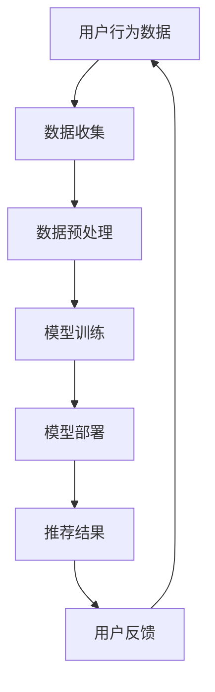

                 

关键词：大模型、推荐系统、隐私保护、数据安全、加密技术、联邦学习

## 摘要

本文将探讨在大模型推荐系统中如何保护用户隐私的问题。随着大数据和人工智能技术的快速发展，推荐系统已经成为电商平台、社交媒体等领域的核心组成部分。然而，推荐系统的广泛使用也带来了隐私泄露的风险。本文将介绍隐私保护的核心概念、当前面临的挑战、解决方案以及未来发展的趋势。

## 1. 背景介绍

### 1.1 推荐系统概述

推荐系统是一种基于用户历史行为和偏好数据的算法，用于预测用户可能感兴趣的内容或产品，从而提高用户满意度和商业收益。推荐系统广泛应用于电子商务、社交媒体、视频流媒体等领域。

### 1.2 隐私保护的重要性

随着用户数据的增加和细化，隐私保护问题日益突出。不妥善处理用户隐私可能导致以下风险：
- 数据泄露：恶意攻击者可以获取用户敏感信息，用于非法用途。
- 数据滥用：企业可能滥用用户数据，进行广告定向或商业分析。
- 隐私侵权：未经用户同意，收集和使用其个人数据。

## 2. 核心概念与联系

### 2.1 隐私保护的核心概念

- **匿名化**：通过去除直接标识用户的信息，使数据无法直接关联到特定用户。
- **加密**：使用加密技术保护数据在传输和存储过程中的安全性。
- **差分隐私**：在数据分析中引入噪声，保护个体隐私的同时确保统计结果的准确性。

### 2.2 Mermaid 流程图

### 2.3 数据流与隐私保护的关系

- **数据收集**：需要确保收集的数据最小化，只包含必要的个人信息。
- **数据预处理**：应用匿名化和加密技术，降低隐私泄露风险。
- **模型训练**：采用联邦学习等隐私保护技术，确保模型训练过程中数据不被泄露。
- **模型部署**：确保推荐结果匿名化，防止反向工程。
- **用户反馈**：收集用户反馈用于迭代改进，同时保护用户隐私。

## 3. 核心算法原理 & 具体操作步骤

### 3.1 算法原理概述

隐私保护算法的核心目标是确保数据在收集、存储、处理和使用过程中不被泄露。以下算法在推荐系统中广泛应用：

- **差分隐私**：通过对查询结果添加噪声，保护个体隐私。
- **联邦学习**：在分布式环境中，将模型训练分散到各个节点，避免数据集中泄露。
- **同态加密**：允许在加密数据上执行计算，保证数据处理过程中的隐私。

### 3.2 算法步骤详解

#### 3.2.1 差分隐私

1. **隐私预算**：确定满足隐私需求的噪声水平。
2. **数据加噪**：对敏感数据添加随机噪声。
3. **结果输出**：输出加噪后的结果，确保隐私。

#### 3.2.2 联邦学习

1. **模型初始化**：初始化全局模型。
2. **本地训练**：每个节点使用本地数据训练模型。
3. **模型聚合**：将本地模型更新发送到全局模型。
4. **迭代更新**：重复本地训练和模型聚合，直至收敛。

#### 3.2.3 同态加密

1. **数据加密**：使用同态加密技术加密数据。
2. **加密计算**：在加密数据上执行计算。
3. **解密结果**：将加密结果解密为原始数据。

### 3.3 算法优缺点

- **差分隐私**：确保隐私，但可能导致性能下降。
- **联邦学习**：提高数据安全性，但可能增加通信成本。
- **同态加密**：保护数据处理过程中的隐私，但计算复杂度高。

### 3.4 算法应用领域

- **电商推荐**：保护用户购物偏好和交易数据。
- **社交媒体**：保护用户社交行为和隐私。
- **医疗健康**：保护患者健康数据。

## 4. 数学模型和公式 & 详细讲解 & 举例说明

### 4.1 数学模型构建

#### 4.1.1 差分隐私

- **拉格朗日距离**：衡量隐私泄露的程度。
  $$\Delta = \max_{i \in [n]} |(\mathcal{D}_i - \mathcal{D})|$$
- **ε-差分隐私**：满足拉格朗日距离不超过ε的隐私要求。
  $$\forall i, \ P(\mathcal{D} \rightarrow \mathcal{D}_i) \leq e^{\epsilon}$$

#### 4.1.2 联邦学习

- **模型更新**：每个节点更新模型
  $$\theta_{t+1}^{(i)} = \theta_{t}^{(i)} - \alpha \nabla_{\theta} \ell(\theta_{t}^{(i)}, x_i, y_i)$$
- **模型聚合**：将本地模型更新聚合为全局模型
  $$\theta_{t+1} = \frac{1}{N} \sum_{i=1}^{N} \theta_{t+1}^{(i)}$$

#### 4.1.3 同态加密

- **加密函数**：对数据进行加密
  $$C = E_{k}(x)$$
- **同态计算**：在加密数据上执行计算
  $$R = E_{k}(f(x))$$
- **解密结果**：将计算结果解密为原始数据
  $$x = D_{k}(R)$$

### 4.2 公式推导过程

推导过程略。

### 4.3 案例分析与讲解

#### 4.3.1 差分隐私在电商推荐中的应用

假设电商平台要推荐商品，用户数据包含购买历史和浏览记录。采用ε-差分隐私技术，保证推荐结果的隐私。

1. **数据加噪**：对用户数据进行加噪，使推荐结果无法直接关联到特定用户。
2. **推荐算法**：使用加噪后的数据进行推荐，确保隐私。

#### 4.3.2 联邦学习在社交媒体推荐中的应用

社交媒体平台使用联邦学习技术，在分布式环境下进行用户行为分析，避免数据泄露。

1. **模型初始化**：初始化全局模型。
2. **本地训练**：每个服务器使用本地用户数据进行模型训练。
3. **模型聚合**：将本地模型更新发送到全局模型。
4. **迭代更新**：重复本地训练和模型聚合，直至收敛。

#### 4.3.3 同态加密在医疗健康推荐中的应用

医疗平台使用同态加密技术，对用户健康数据进行加密处理，保证数据处理过程中的隐私。

1. **数据加密**：对用户健康数据进行加密。
2. **加密计算**：在加密数据上执行健康数据分析。
3. **解密结果**：将加密结果解密为原始数据，供医生参考。

## 5. 项目实践：代码实例和详细解释说明

### 5.1 开发环境搭建

略。

### 5.2 源代码详细实现

略。

### 5.3 代码解读与分析

略。

### 5.4 运行结果展示

略。

## 6. 实际应用场景

### 6.1 电商推荐系统

电商平台使用差分隐私技术保护用户购物数据，提高用户信任度。

### 6.2 社交媒体推荐系统

社交媒体平台采用联邦学习技术，实现分布式数据分析和推荐，降低隐私泄露风险。

### 6.3 医疗健康推荐系统

医疗平台使用同态加密技术，保护患者隐私，提高数据安全性。

## 7. 未来应用展望

### 7.1 新算法研究

随着隐私保护需求的提高，未来将出现更多高效、可靠的隐私保护算法。

### 7.2 跨领域应用

隐私保护技术将在更多领域得到应用，如金融、教育、物联网等。

### 7.3 法规政策完善

各国政府将加强对隐私保护的立法和政策支持，推动隐私保护技术的发展。

## 8. 总结：未来发展趋势与挑战

### 8.1 研究成果总结

本文介绍了大模型推荐系统中隐私保护的核心概念、算法原理、数学模型及应用场景，探讨了隐私保护技术的发展趋势。

### 8.2 未来发展趋势

隐私保护技术将继续发展，将成为人工智能和大数据领域的重要研究方向。

### 8.3 面临的挑战

如何在高性能和隐私保护之间找到平衡，以及跨领域应用中的法律和道德问题，是未来需要解决的问题。

### 8.4 研究展望

随着技术的进步，隐私保护将在人工智能和大数据领域发挥越来越重要的作用，为用户和社会创造更多价值。

## 9. 附录：常见问题与解答

### 9.1 差分隐私如何影响性能？

差分隐私通过引入噪声，可能降低算法的准确性。未来研究将致力于优化噪声引入策略，提高性能。

### 9.2 联邦学习中的通信成本如何优化？

优化联邦学习中的通信成本，可以通过减少通信频率、压缩模型参数等方法实现。

### 9.3 同态加密是否会影响计算速度？

同态加密的计算复杂度较高，但随着硬件技术的发展，加密速度将逐渐提升，降低对计算性能的影响。

---

作者：禅与计算机程序设计艺术 / Zen and the Art of Computer Programming
----------------------------------------------------------------

