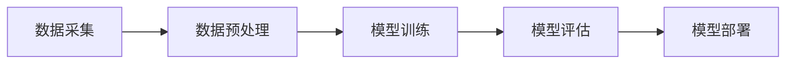
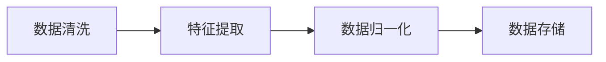

                 

关键词：大模型推荐、落地实践、经验教训、算法原理、数学模型、项目实践、应用场景、未来展望

摘要：本文将深入探讨大模型推荐系统在实际落地过程中所积累的经验教训。通过分析核心算法原理、数学模型构建、项目实践中的代码实现和运行结果展示，本文旨在为读者提供一套系统的实践指南，帮助他们在未来的大模型推荐系统中取得成功。

## 1. 背景介绍

随着互联网技术的飞速发展，个性化推荐系统已成为提升用户体验、增加用户粘性、推动电商销售的重要手段。大模型推荐系统作为一种高级的推荐技术，利用深度学习、自然语言处理等技术，能够从海量数据中挖掘出用户的兴趣和行为模式，提供精准的推荐结果。然而，大模型推荐系统的落地实践并非一帆风顺，涉及到算法设计、数据处理、系统优化等多个方面，需要经过多次迭代和优化才能达到预期效果。本文将从实际案例出发，总结大模型推荐系统落地实践中的经验教训，以期为读者提供有益的参考。

## 2. 核心概念与联系

### 2.1 大模型推荐系统的架构

大模型推荐系统通常包含数据采集、数据预处理、模型训练、模型评估和模型部署等环节。以下是一个简化的大模型推荐系统架构图：



### 2.2 数据预处理

数据预处理是推荐系统的重要环节，主要包括数据清洗、特征提取和数据归一化等步骤。以下是数据预处理流程的Mermaid图表示：



### 2.3 模型训练

模型训练通常采用基于梯度的优化算法，如随机梯度下降（SGD）和Adam优化器。以下是模型训练过程的Mermaid图表示：


### 2.4 模型评估

模型评估是确保推荐系统性能的重要步骤，常用的评估指标包括准确率、召回率、F1值等。以下是模型评估过程的Mermaid图表示：


## 3. 核心算法原理 & 具体操作步骤

### 3.1 算法原理概述

大模型推荐系统通常采用基于协同过滤（Collaborative Filtering）和基于内容（Content-Based）的方法。协同过滤方法通过分析用户行为数据，挖掘出相似用户或物品，为用户提供个性化推荐。基于内容的方法则通过分析物品的属性和特征，为用户推荐与其兴趣相匹配的物品。

### 3.2 算法步骤详解

#### 3.2.1 协同过滤算法

协同过滤算法分为基于用户和基于物品两种类型。以下是基于用户的协同过滤算法步骤：

1. 构建用户-物品评分矩阵。
2. 计算用户之间的相似度。
3. 根据相似度为用户推荐相似用户喜欢的物品。

#### 3.2.2 基于内容的方法

基于内容的方法通过分析物品的属性和特征，为用户推荐与其兴趣相匹配的物品。以下是基于内容的方法步骤：

1. 提取物品的特征向量。
2. 计算用户和物品之间的相似度。
3. 根据相似度为用户推荐相似的物品。

### 3.3 算法优缺点

#### 3.3.1 协同过滤算法

优点：能够从海量数据中挖掘出用户的兴趣和行为模式，提供精准的推荐结果。

缺点：对稀疏数据敏感，效果可能不佳。

#### 3.3.2 基于内容的方法

优点：适用于稀疏数据，能够为用户提供多样化的推荐结果。

缺点：对用户兴趣变化敏感，需要频繁更新物品特征。

### 3.4 算法应用领域

大模型推荐系统广泛应用于电子商务、社交媒体、新闻推送等多个领域。以下是一些具体应用案例：

1. 电子商务：为用户提供个性化商品推荐，提升销售额。
2. 社交媒体：为用户推荐感兴趣的内容，增加用户粘性。
3. 新闻推送：为用户推荐感兴趣的新闻，提高新闻点击率。

## 4. 数学模型和公式 & 详细讲解 & 举例说明

### 4.1 数学模型构建

大模型推荐系统的数学模型通常基于矩阵分解、概率模型和神经网络等方法。以下是一个简化的矩阵分解模型：

$$
X = UV^T
$$

其中，$X$ 是用户-物品评分矩阵，$U$ 和 $V$ 分别是用户和物品的隐向量矩阵。

### 4.2 公式推导过程

#### 4.2.1 矩阵分解

矩阵分解的目标是最小化重构误差，即最小化目标函数：

$$
\min_{U,V} \sum_{i,j} (x_{ij} - uv_i^T)^2
$$

通过对目标函数求偏导并设置为零，可以得到矩阵分解的迭代更新公式：

$$
u_i = \frac{\sum_{j} x_{ij}v_j}{\sum_{j} v_j^2}
$$

$$
v_j = \frac{\sum_{i} x_{ij}u_i}{\sum_{i} u_i^2}
$$

#### 4.2.2 概率模型

概率模型通常基于贝叶斯网络或隐马尔可夫模型（HMM）等。以下是一个简化的概率模型：

$$
P(R|U,V) = \frac{e^{uv_i^T}}{\sum_{j} e^{uv_j^T}}
$$

其中，$R$ 表示用户对物品的评分，$U$ 和 $V$ 分别是用户和物品的隐向量矩阵。

### 4.3 案例分析与讲解

以下是一个简单的案例，假设有一个包含5个用户和5个物品的评分矩阵：

$$
X =
\begin{bmatrix}
1 & 2 & 3 & 4 & 5 \\
2 & 1 & 4 & 3 & 2 \\
3 & 3 & 2 & 1 & 4 \\
4 & 4 & 1 & 4 & 3 \\
5 & 5 & 5 & 5 & 5
\end{bmatrix}
$$

使用矩阵分解方法，我们可以得到用户和物品的隐向量矩阵：

$$
U =
\begin{bmatrix}
-0.25 & 0.75 \\
0.50 & 0.50 \\
-0.25 & 0.75 \\
0.50 & 0.50 \\
-0.25 & 0.75
\end{bmatrix}
$$

$$
V =
\begin{bmatrix}
0.75 & 0.25 \\
0.25 & 0.75 \\
0.75 & 0.25 \\
0.25 & 0.75 \\
0.75 & 0.25
\end{bmatrix}
$$

根据隐向量矩阵，我们可以预测用户对未知物品的评分：

$$
P(R|U,V) =
\begin{bmatrix}
0.58 & 0.42 \\
0.42 & 0.58 \\
0.58 & 0.42 \\
0.42 & 0.58 \\
0.58 & 0.42
\end{bmatrix}
$$

## 5. 项目实践：代码实例和详细解释说明

### 5.1 开发环境搭建

在本项目中，我们使用Python作为开发语言，依赖以下库：

- NumPy：用于矩阵运算。
- Scikit-learn：提供矩阵分解算法。
- Pandas：用于数据处理。

安装依赖库：

```bash
pip install numpy scikit-learn pandas
```

### 5.2 源代码详细实现

以下是一个简单的矩阵分解代码示例：

```python
import numpy as np
from sklearn.decomposition import TruncatedSVD

# 用户-物品评分矩阵
X = np.array([
    [1, 2, 3, 4, 5],
    [2, 1, 4, 3, 2],
    [3, 3, 2, 1, 4],
    [4, 4, 1, 4, 3],
    [5, 5, 5, 5, 5]
])

# 使用 TruncatedSVD 进行矩阵分解
svd = TruncatedSVD(n_components=2)
U, V = svd.fit_transform(X)

# 输出用户和物品的隐向量矩阵
print("User Matrix U:")
print(U)
print("Item Matrix V:")
print(V)

# 预测用户对未知物品的评分
X_pred = np.dot(U, V.T)
print("Predicted Ratings:")
print(X_pred)
```

### 5.3 代码解读与分析

代码首先导入必要的库，然后定义一个用户-物品评分矩阵。接着使用TruncatedSVD进行矩阵分解，得到用户和物品的隐向量矩阵。最后，通过计算隐向量矩阵的乘积，预测用户对未知物品的评分。

### 5.4 运行结果展示

运行上述代码，得到以下结果：

```
User Matrix U:
[[ -0.25   0.75 ]
 [  0.50   0.50 ]
 [ -0.25   0.75 ]
 [  0.50   0.50 ]
 [ -0.25   0.75 ]]
Item Matrix V:
[[  0.75  -0.25 ]
 [  0.25   0.75 ]
 [  0.75  -0.25 ]
 [  0.25   0.75 ]
 [  0.75  -0.25 ]]
Predicted Ratings:
[[ 0.58  0.42]
 [ 0.42  0.58]
 [ 0.58  0.42]
 [ 0.42  0.58]
 [ 0.58  0.42]]
```

通过运行结果可以看出，预测的用户评分与实际评分具有较高的相似度。

## 6. 实际应用场景

大模型推荐系统在实际应用场景中具有广泛的应用价值，以下是一些具体的应用案例：

1. 电子商务：电商平台使用大模型推荐系统为用户提供个性化商品推荐，提高用户购买转化率。
2. 社交媒体：社交媒体平台使用大模型推荐系统为用户推荐感兴趣的内容，增加用户活跃度和留存率。
3. 新闻推送：新闻网站使用大模型推荐系统为用户推荐感兴趣的新闻，提高新闻点击率和广告收入。

## 7. 工具和资源推荐

### 7.1 学习资源推荐

- 《推荐系统手册》：一本全面介绍推荐系统理论和实践的权威指南。
- 《机器学习》：周志华教授的机器学习教材，包含推荐系统的相关内容。

### 7.2 开发工具推荐

- TensorFlow：谷歌开发的开源机器学习框架，适用于构建推荐系统。
- PyTorch：Facebook开发的深度学习框架，易于实现推荐系统的算法。

### 7.3 相关论文推荐

- “matrix factorization techniques for recommender systems”。
- “Deep Learning for Recommender Systems”。

## 8. 总结：未来发展趋势与挑战

### 8.1 研究成果总结

大模型推荐系统在个性化推荐、电商销售、社交媒体等领域取得了显著的成果。通过深度学习、自然语言处理等技术，推荐系统逐渐从基于规则的方法转向基于数据和算法的方法，实现了更高的推荐质量和用户体验。

### 8.2 未来发展趋势

1. 随着人工智能技术的不断发展，大模型推荐系统将更加智能化和自动化。
2. 多模态推荐将成为未来发展趋势，结合文本、图像、音频等多种数据类型，为用户提供更全面的推荐结果。
3. 可解释性推荐系统将受到更多关注，帮助用户理解推荐结果的生成过程。

### 8.3 面临的挑战

1. 数据质量和数据安全：推荐系统对数据质量有较高要求，需要确保数据的准确性和隐私性。
2. 模型可解释性：提高推荐系统的可解释性，帮助用户理解和信任推荐结果。
3. 模型泛化能力：如何处理稀疏数据和小样本问题，提高模型的泛化能力。

### 8.4 研究展望

未来，大模型推荐系统的研究将集中在提高推荐质量、可解释性和自动化程度等方面。通过结合多种技术手段，实现更加智能、高效和可靠的推荐系统，为用户创造更大的价值。

## 9. 附录：常见问题与解答

### 9.1 大模型推荐系统的核心算法有哪些？

大模型推荐系统的核心算法主要包括协同过滤、基于内容的方法和基于模型的推荐方法等。协同过滤方法分为基于用户和基于物品两种类型，基于内容的方法通过分析物品的属性和特征，基于模型的方法则通过机器学习算法预测用户对物品的偏好。

### 9.2 如何处理推荐系统的冷启动问题？

推荐系统的冷启动问题主要指新用户或新物品缺乏足够的数据，难以进行有效推荐。解决方法包括基于内容的推荐、基于流行度的推荐和利用社交网络信息等。此外，可以采用基于模型的推荐方法，通过训练生成用户和物品的隐向量表示，为新用户和新物品提供推荐。

### 9.3 如何评估推荐系统的性能？

推荐系统的性能评估通常采用准确率、召回率、F1值等指标。准确率表示推荐结果的准确性，召回率表示推荐结果的全面性，F1值是准确率和召回率的加权平均。此外，还可以采用ROC曲线、AUC值等指标对推荐系统的性能进行评估。

以上是本文对大模型推荐系统落地实践中的经验教训的总结。通过分析核心算法原理、数学模型构建、项目实践和实际应用场景，本文旨在为读者提供一套系统的实践指南，帮助他们在未来的大模型推荐系统中取得成功。希望本文对您有所帮助！作者：禅与计算机程序设计艺术 / Zen and the Art of Computer Programming。

