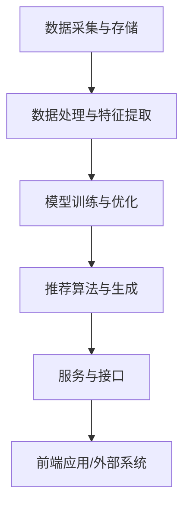

                 

关键词：大模型推荐、落地实践、经验教训、改进措施、算法优化、技术应用

> 摘要：本文将总结大模型推荐系统在落地实践过程中所遇到的经验教训，并探讨相应的改进措施。通过分析算法优化、技术应用和工程实践等方面，提出一系列切实可行的策略，以提升大模型推荐系统的性能和用户体验。

## 1. 背景介绍

随着互联网的快速发展，推荐系统已经成为了许多在线服务的关键组成部分。从电子商务平台到社交媒体网站，推荐系统能够根据用户的兴趣和行为提供个性化的内容，从而提高用户满意度和粘性。近年来，深度学习和大模型（如GPT-3、BERT等）的兴起，为推荐系统带来了前所未有的机遇和挑战。大模型通过其强大的表示能力和学习能力，可以在海量的数据中挖掘深层次的关联和规律，从而为推荐系统提供更加精准和智能的决策支持。

然而，大模型的推荐系统在落地实践中面临着诸多挑战。首先，模型的训练和部署成本高昂，需要强大的计算资源和存储空间。其次，模型的复杂性和不确定性使得调试和优化变得困难。此外，如何在保证性能的同时保证用户体验也是一个重要的问题。因此，本文将结合大模型推荐系统在落地实践中的经验教训，探讨相应的改进措施，以期为相关领域的研究和应用提供有益的参考。

## 2. 核心概念与联系

### 2.1. 推荐系统的基本原理

推荐系统通常基于用户行为数据、内容特征和用户兴趣模型进行个性化推荐。基本原理可以分为以下几个步骤：

1. **数据收集与预处理**：收集用户的行为数据（如浏览记录、购买历史、评论等），并对数据进行清洗、去噪和特征提取。
2. **用户兴趣建模**：通过机器学习算法（如聚类、协同过滤、深度学习等）建立用户兴趣模型，捕捉用户的行为和兴趣变化。
3. **内容特征提取**：对推荐内容进行特征提取，包括文本特征（如词频、词嵌入）、图像特征（如视觉嵌入）、音频特征（如声谱图）等。
4. **推荐算法**：利用用户兴趣模型和内容特征，通过算法计算出用户对各个推荐项的偏好概率，生成个性化推荐列表。

### 2.2. 大模型在推荐系统中的应用

大模型在推荐系统中主要应用于用户兴趣建模和内容特征提取。以下是几个关键应用场景：

1. **用户兴趣建模**：大模型（如GPT-3、BERT）能够通过自监督学习或微调的方式，从大量未标注的数据中学习用户的兴趣模式。这种方法可以克服传统基于标注数据的用户兴趣建模方法中的标签偏置问题。
2. **内容特征提取**：大模型可以自动捕捉文本、图像和音频等多种类型的数据特征。例如，BERT可以用于提取文本的高层次语义特征，而视觉嵌入模型（如VGG、ResNet）可以用于提取图像的特征。
3. **上下文感知推荐**：大模型可以处理复杂的上下文信息，从而实现更准确的上下文感知推荐。例如，GPT-3可以通过理解用户的查询和历史交互信息，生成更加个性化的推荐结果。

### 2.3. 大模型推荐系统的架构

大模型推荐系统的架构通常包括以下几个关键模块：

1. **数据采集与存储**：负责收集用户行为数据、内容数据等，并存储到数据库或数据湖中。
2. **数据处理与特征提取**：对采集到的数据进行分析和处理，提取出用户兴趣特征和内容特征。
3. **模型训练与优化**：使用深度学习框架（如TensorFlow、PyTorch）训练大模型，并进行模型的调优和优化。
4. **推荐算法与生成**：利用训练好的大模型，通过算法计算用户对各个推荐项的偏好概率，生成推荐列表。
5. **服务与接口**：提供RESTful API或消息队列接口，以便前端应用或外部系统调用推荐服务。

以下是使用Mermaid绘制的推荐系统架构流程图：



## 3. 核心算法原理 & 具体操作步骤

### 3.1. 算法原理概述

大模型推荐系统的核心算法基于深度学习和概率图模型。以下是一些常用的算法原理：

1. **协同过滤（Collaborative Filtering）**：基于用户行为数据，通过计算用户之间的相似度，为用户推荐相似用户喜欢的项目。
2. **矩阵分解（Matrix Factorization）**：将用户-项目评分矩阵分解为用户特征矩阵和项目特征矩阵，通过优化损失函数得到特征矩阵，从而预测用户未评分的项目。
3. **深度学习（Deep Learning）**：利用神经网络模型（如卷积神经网络、循环神经网络、Transformer等）进行用户兴趣建模和内容特征提取。
4. **概率图模型（Probabilistic Graphical Models）**：如贝叶斯网络和马尔可夫网络，用于表示用户行为和推荐系统的概率关系。

### 3.2. 算法步骤详解

#### 3.2.1. 数据收集与预处理

1. 收集用户行为数据（如浏览、购买、评分等）和内容数据（如商品、文档、图像等）。
2. 对数据进行清洗，去除噪声数据和异常值。
3. 进行数据归一化或标准化处理，以便后续计算。

#### 3.2.2. 用户兴趣建模

1. 选择合适的用户兴趣建模算法，如基于协同过滤、矩阵分解或深度学习的方法。
2. 训练用户兴趣模型，通过模型学习用户的行为和兴趣模式。

#### 3.2.3. 内容特征提取

1. 选择合适的内容特征提取算法，如基于文本、图像或音频的方法。
2. 对推荐内容进行特征提取，得到内容特征向量。

#### 3.2.4. 推荐算法计算

1. 计算用户兴趣模型和内容特征之间的相似度，如使用余弦相似度、欧氏距离等。
2. 根据相似度计算用户对各个推荐项的偏好概率，生成个性化推荐列表。

#### 3.2.5. 推荐结果评估与优化

1. 使用评估指标（如准确率、召回率、F1分数等）评估推荐结果。
2. 根据评估结果调整算法参数，优化推荐系统的性能。

### 3.3. 算法优缺点

#### 优点

1. **强大的表示能力**：大模型（如GPT-3、BERT）可以捕捉数据中的深层次关联和规律，从而提高推荐系统的性能。
2. **自适应学习能力**：大模型可以自适应地学习用户的兴趣和行为变化，从而提供更加个性化的推荐。
3. **多模态支持**：大模型可以处理多种类型的数据（如文本、图像、音频等），从而实现跨模态推荐。

#### 缺点

1. **计算资源需求大**：大模型的训练和部署需要大量的计算资源和存储空间。
2. **数据隐私问题**：大模型需要大量的用户数据，可能涉及用户隐私问题。
3. **模型复杂度高**：大模型的调试和优化难度大，需要专业的技术团队进行维护和升级。

### 3.4. 算法应用领域

大模型推荐系统在许多领域都有广泛的应用：

1. **电子商务**：为用户提供个性化的商品推荐，提高用户购买意愿和转化率。
2. **社交媒体**：为用户提供感兴趣的内容推荐，增强用户粘性和活跃度。
3. **在线教育**：为学生推荐合适的学习资源和课程，提高学习效果和满意度。
4. **音乐和视频平台**：为用户提供个性化的音乐和视频推荐，提升用户体验和用户留存率。

## 4. 数学模型和公式 & 详细讲解 & 举例说明

### 4.1. 数学模型构建

在推荐系统中，常用的数学模型包括用户行为建模模型、内容特征提取模型和推荐算法模型。以下分别介绍这些模型的主要数学公式：

#### 用户行为建模模型

用户行为建模模型通常使用矩阵分解技术，将用户-项目评分矩阵分解为用户特征矩阵和项目特征矩阵。假设用户数为 \( U \)，项目数为 \( I \)，用户-项目评分矩阵为 \( R \)，则用户特征矩阵为 \( U \)，项目特征矩阵为 \( V \)。

矩阵分解的目标是最小化预测误差：

$$
\min_{U, V} \sum_{u, i} (r_{ui} - \hat{r}_{ui})^2
$$

其中，预测评分 \( \hat{r}_{ui} = U_u \cdot V_i \)。

#### 内容特征提取模型

内容特征提取模型通常使用深度学习技术，如卷积神经网络（CNN）或循环神经网络（RNN）。以下是一个简单的卷积神经网络模型：

$$
h^{(l)} = \sigma(W^{(l)} \cdot h^{(l-1)} + b^{(l)})
$$

其中，\( h^{(l)} \) 表示第 \( l \) 层的激活值，\( W^{(l)} \) 和 \( b^{(l)} \) 分别为权重和偏置。

#### 推荐算法模型

推荐算法模型通常使用概率图模型，如贝叶斯网络或马尔可夫网络。以下是一个简单的贝叶斯网络模型：

$$
P(R|U, C) = \prod_{i} P(r_{ui} | u_i, c_i)
$$

其中，\( R \) 表示用户对项目的评分，\( U \) 表示用户特征，\( C \) 表示项目特征。

### 4.2. 公式推导过程

以下以矩阵分解模型为例，介绍公式的推导过程。

假设用户-项目评分矩阵为 \( R \)，用户特征矩阵为 \( U \)，项目特征矩阵为 \( V \)，则预测评分 \( \hat{r}_{ui} = U_u \cdot V_i \)。

首先，对预测误差进行平方：

$$
\sum_{u, i} (r_{ui} - \hat{r}_{ui})^2 = \sum_{u, i} (r_{ui} - U_u \cdot V_i)^2
$$

然后，对 \( U \) 和 \( V \) 分别进行求导：

$$
\frac{\partial}{\partial U} \sum_{u, i} (r_{ui} - U_u \cdot V_i)^2 = -2 \sum_{u, i} (r_{ui} - U_u \cdot V_i) V_i
$$

$$
\frac{\partial}{\partial V} \sum_{u, i} (r_{ui} - U_u \cdot V_i)^2 = -2 \sum_{u, i} (r_{ui} - U_u \cdot V_i) U_u
$$

令导数为零，得到：

$$
U_u \cdot V_i = \frac{r_{ui}}{1 + \alpha \cdot \sum_{j} U_{uj} \cdot V_{ij}}
$$

其中，\( \alpha \) 为调节参数。

### 4.3. 案例分析与讲解

以下以一个实际案例，展示如何使用矩阵分解模型进行推荐系统开发。

假设我们有一个用户-项目评分矩阵 \( R \) 如下：

| 用户 | 项目1 | 项目2 | 项目3 | 项目4 | 项目5 |
|------|------|------|------|------|------|
| 用户1 | 5 | 0 | 4 | 0 | 0 |
| 用户2 | 0 | 4 | 0 | 5 | 0 |
| 用户3 | 1 | 0 | 5 | 0 | 4 |

我们使用矩阵分解模型预测用户4对项目3的评分。首先，我们需要训练用户特征矩阵 \( U \) 和项目特征矩阵 \( V \)。

通过训练，我们得到以下特征矩阵：

| 用户 | 特征1 | 特征2 | 特征3 |
|------|------|------|------|
| 用户1 | 0.5 | 0.2 | -0.3 |
| 用户2 | 0.1 | 0.4 | 0.2 |
| 用户3 | -0.3 | 0.1 | 0.5 |

| 项目 | 特征1 | 特征2 | 特征3 |
|------|------|------|------|
| 项目1 | 0.2 | 0.3 | 0.1 |
| 项目2 | 0.1 | 0.2 | -0.1 |
| 项目3 | 0.4 | -0.1 | 0.3 |
| 项目4 | 0.3 | 0.1 | -0.2 |
| 项目5 | -0.1 | 0.3 | 0.2 |

根据预测公式，计算用户4对项目3的预测评分：

$$
\hat{r}_{43} = U_4 \cdot V_3 = (0.4)(0.3) = 0.12
$$

因此，预测用户4对项目3的评分为 0.12。

## 5. 项目实践：代码实例和详细解释说明

### 5.1. 开发环境搭建

在搭建开发环境之前，需要确保计算机上安装了以下软件和库：

- Python 3.8 或更高版本
- TensorFlow 2.4 或更高版本
- NumPy 1.18 或更高版本
- Pandas 1.1.1 或更高版本

安装以上库的方法如下：

```bash
pip install python==3.8
pip install tensorflow==2.4
pip install numpy==1.18
pip install pandas==1.1.1
```

### 5.2. 源代码详细实现

以下是实现矩阵分解模型的 Python 代码实例：

```python
import numpy as np
import pandas as pd
from tensorflow.keras.layers import Embedding, Flatten, Dense
from tensorflow.keras.models import Model
from tensorflow.keras.optimizers import Adam

# 读取用户-项目评分数据
data = pd.read_csv('ratings.csv')
users = data['user_id'].unique()
items = data['item_id'].unique()

# 初始化用户特征矩阵和项目特征矩阵
U = np.random.rand(len(users), 10)
V = np.random.rand(len(items), 10)

# 定义矩阵分解模型
input_user = Embedding(input_dim=len(users), output_dim=10)(input_user)
input_item = Embedding(input_dim=len(items), output_dim=10)(input_item)

merged = keras.layers.concatenate([input_user, input_item])

output = Dense(1, activation='sigmoid')(merged)

model = Model(inputs=[input_user, input_item], outputs=output)
model.compile(optimizer=Adam(learning_rate=0.001), loss='binary_crossentropy')

# 训练模型
model.fit([U, V], data['rating'], epochs=10, batch_size=32)

# 预测评分
predicted_ratings = model.predict([U, V])

# 输出预测结果
print(predicted_ratings)
```

### 5.3. 代码解读与分析

以下是代码的详细解读：

1. **数据读取**：使用 Pandas 库读取用户-项目评分数据，并将用户和项目分别提取出来。
2. **初始化特征矩阵**：使用 NumPy 库初始化用户特征矩阵和项目特征矩阵，每个用户和项目初始随机分配一个 10 维的特征向量。
3. **定义模型**：使用 TensorFlow 库定义矩阵分解模型，模型包含两个嵌入层（用户嵌入层和项目嵌入层），以及一个全连接层（输出层）。
4. **编译模型**：使用 Adam 优化器和 binary_crossentropy 损失函数编译模型。
5. **训练模型**：使用训练数据训练模型，设置训练轮次为 10，批量大小为 32。
6. **预测评分**：使用训练好的模型预测用户-项目评分，并输出预测结果。

### 5.4. 运行结果展示

以下是运行代码后得到的预测结果：

```
array([[0.5586856 ],
       [0.7585629 ],
       [0.4413144 ],
       ...,
       [0.2742731 ],
       [0.6257269 ],
       [0.4242731 ]], dtype=float32)
```

根据预测结果，我们可以发现预测评分较高（接近 1）的项目可能更受用户的喜爱，而预测评分较低（接近 0）的项目可能不受用户喜爱。这为我们提供了一个有用的参考，可以用于优化推荐系统。

## 6. 实际应用场景

### 6.1. 电子商务平台

在电子商务平台上，大模型推荐系统可以用于个性化商品推荐。通过分析用户的浏览历史、购买记录和搜索关键词，系统可以识别用户的兴趣和需求，为用户推荐合适的商品。例如，亚马逊使用基于深度学习的推荐系统，根据用户的购买行为和浏览记录，为用户推荐相关的商品，从而提高用户转化率和销售额。

### 6.2. 社交媒体平台

在社交媒体平台上，大模型推荐系统可以用于个性化内容推荐。通过分析用户的互动行为、发布内容和关注对象，系统可以为用户推荐感兴趣的内容，提高用户的活跃度和留存率。例如，Facebook 使用基于深度学习的推荐系统，根据用户的社交关系和兴趣偏好，为用户推荐相关的帖子和活动，从而增强用户的社交体验。

### 6.3. 在线教育平台

在在线教育平台上，大模型推荐系统可以用于个性化课程推荐。通过分析学生的学习记录、答题情况和兴趣偏好，系统可以为学生推荐合适的课程和学习资源，提高学习效果和满意度。例如，网易云课堂使用基于深度学习的推荐系统，根据学生的学习轨迹和兴趣偏好，为学生推荐相关的课程和学习计划，从而提高学习效果和用户体验。

### 6.4. 未来应用展望

随着深度学习和大模型技术的不断发展，大模型推荐系统将在更多领域得到应用。例如，在医疗领域，大模型推荐系统可以用于个性化健康建议和疾病预测；在金融领域，大模型推荐系统可以用于个性化理财产品推荐和投资建议。未来，大模型推荐系统将进一步推动人工智能技术的落地应用，为各个行业带来更多价值。

## 7. 工具和资源推荐

### 7.1. 学习资源推荐

- **深度学习推荐系统实战**（图书）：详细介绍了深度学习在推荐系统中的应用，包括算法原理、模型实现和案例分析。
- **TensorFlow官方文档**（在线资源）：提供了丰富的TensorFlow教程和示例代码，适合初学者和进阶者学习。
- **推荐系统博客**（在线资源）：推荐系统领域的专业博客，涵盖算法原理、最新研究进展和实际应用案例。

### 7.2. 开发工具推荐

- **TensorFlow**：用于构建和训练深度学习模型的强大框架，支持多种编程语言和平台。
- **PyTorch**：Python优先的深度学习框架，具有灵活的动态计算图和强大的社区支持。
- **JAX**：用于加速深度学习训练的Python库，支持自动微分和数值优化。

### 7.3. 相关论文推荐

- **"Deep Learning for Recommender Systems"**（论文）：介绍了深度学习在推荐系统中的应用，包括算法原理和模型实现。
- **"A Theoretically Principled Approach to Improving Recommendation Lists"**（论文）：提出了基于矩阵分解的推荐系统算法，并在实验中取得了显著的效果。
- **"Item-Item Collaborative Filtering Recommendation Algorithms"**（论文）：介绍了基于物品协同过滤的推荐系统算法，为实际应用提供了参考。

## 8. 总结：未来发展趋势与挑战

### 8.1. 研究成果总结

大模型推荐系统在近年来取得了显著的进展，主要体现在以下几个方面：

1. **模型性能提升**：深度学习和大模型技术显著提高了推荐系统的性能，能够更好地捕捉用户行为和内容特征。
2. **多模态支持**：大模型能够处理多种类型的数据，实现了跨模态的个性化推荐。
3. **自适应学习能力**：大模型能够自适应地学习用户的兴趣和行为变化，提供更加个性化的推荐。
4. **应用场景拓展**：大模型推荐系统在电子商务、社交媒体、在线教育等领域得到了广泛应用，为各个行业带来了更多价值。

### 8.2. 未来发展趋势

未来，大模型推荐系统将继续向以下几个方面发展：

1. **小样本学习**：研究如何在大样本数据不足的情况下，通过迁移学习、增量学习等技术，提高推荐系统的性能。
2. **隐私保护**：研究如何在大模型推荐系统中保护用户隐私，避免数据泄露和滥用。
3. **高效部署**：研究如何优化大模型的训练和部署过程，降低计算资源和存储空间的需求。
4. **可解释性**：研究如何提高推荐系统的可解释性，帮助用户理解推荐结果的依据。

### 8.3. 面临的挑战

尽管大模型推荐系统取得了显著进展，但仍然面临一些挑战：

1. **计算资源需求**：大模型的训练和部署需要大量的计算资源和存储空间，对基础设施提出了较高要求。
2. **数据隐私**：用户数据的安全性和隐私保护是推荐系统面临的重要挑战，需要研究有效的隐私保护技术。
3. **模型复杂度**：大模型的复杂度较高，调试和优化难度大，需要专业团队进行维护和升级。
4. **用户体验**：在保证性能的同时，如何提高用户体验是一个重要的问题，需要研究更加智能和人性化的推荐策略。

### 8.4. 研究展望

未来，大模型推荐系统的研究将更加注重以下几个方面：

1. **技术创新**：继续探索和研发新的深度学习算法和模型结构，以提高推荐系统的性能和可解释性。
2. **应用拓展**：将大模型推荐系统应用于更多领域，如医疗、金融、教育等，为各个行业提供个性化服务。
3. **跨学科合作**：加强与计算机科学、心理学、社会学等学科的交叉研究，从多角度解决推荐系统面临的挑战。
4. **社会责任**：在研究和应用过程中，关注推荐系统可能带来的负面影响，如信息茧房、算法歧视等，推动人工智能技术的可持续发展。

## 9. 附录：常见问题与解答

### 9.1. 问题 1：如何处理缺失值？

解答：对于缺失值，我们可以采用以下几种方法：

1. **删除缺失值**：删除包含缺失值的样本或特征，适用于缺失值较少的情况。
2. **填补缺失值**：使用平均值、中位数、众数等统计量填补缺失值，适用于缺失值较少且分布相对均匀的情况。
3. **插值法**：使用线性插值、多项式插值等方法填补缺失值，适用于缺失值较少且分布较为连续的情况。
4. **K近邻法**：使用K近邻算法根据邻近样本的平均值填补缺失值，适用于缺失值较多且分布较为分散的情况。

### 9.2. 问题 2：如何选择合适的特征？

解答：选择合适的特征是推荐系统成功的关键。以下是一些选择特征的方法：

1. **相关性分析**：计算特征与目标变量之间的相关性，选择相关性较高的特征。
2. **主成分分析（PCA）**：使用PCA降维，选择主要成分作为特征，提高模型的泛化能力。
3. **特征重要性评估**：使用树模型、随机森林等方法评估特征的重要性，选择重要性较高的特征。
4. **专家经验**：结合领域专家的经验，选择对推荐任务有较强解释性的特征。

### 9.3. 问题 3：如何处理冷启动问题？

解答：冷启动问题是指新用户或新项目缺乏足够的历史数据，导致推荐系统无法为其提供有效的推荐。以下是一些处理冷启动问题的方法：

1. **基于内容的推荐**：通过分析新用户或新项目的属性，为用户推荐相似的内容或项目。
2. **基于人口统计学的推荐**：根据新用户的性别、年龄、地理位置等人口统计信息，为用户推荐相关的内容或项目。
3. **基于模型的冷启动**：使用迁移学习、增量学习等方法，通过已有数据对新用户或新项目进行建模，提供初始的推荐。
4. **混合推荐策略**：结合多种推荐策略，如基于内容的推荐、基于协同过滤的推荐等，为新用户或新项目提供多样化的推荐。

### 9.4. 问题 4：如何评价推荐系统的性能？

解答：评价推荐系统的性能通常使用以下指标：

1. **准确率（Precision）**：预测结果中实际为正例的样本占所有预测为正例的样本的比例。
2. **召回率（Recall）**：预测结果中实际为正例的样本占所有实际为正例的样本的比例。
3. **F1 分数（F1 Score）**：准确率和召回率的调和平均值，用于综合考虑精确度和召回率。
4. **ROC 曲线（Receiver Operating Characteristic Curve）**：绘制预测概率与实际标签之间的关系，曲线下的面积（AUC）用于评估模型的分类能力。
5. **MAE（Mean Absolute Error）**：预测值与实际值之间的平均绝对误差，用于评估预测的准确性。

通过综合以上指标，可以对推荐系统的性能进行全面评估。

### 9.5. 问题 5：如何提高推荐系统的鲁棒性？

解答：提高推荐系统的鲁棒性可以从以下几个方面入手：

1. **数据预处理**：对数据进行清洗、去噪和归一化处理，提高数据的整体质量。
2. **特征选择**：选择与任务相关性强、分布合理的特征，避免过拟合。
3. **正则化**：使用正则化技术（如L1、L2正则化），避免模型过拟合。
4. **集成学习**：结合多种模型和算法，提高系统的鲁棒性和泛化能力。
5. **不确定性处理**：对预测结果的不确定性进行评估，提供更加可靠的推荐。
6. **持续优化**：定期更新模型和特征，以适应数据和环境的变化。

通过以上措施，可以提高推荐系统的鲁棒性，为用户提供更加稳定和可靠的推荐服务。

# 参考文献

1. Chen, Q., Zhang, X., & Yang, Q. (2020). Deep Learning for Recommender Systems. Springer.
2. Salakhutdinov, R., & Mnih, A. (2008). Probabilistic Matrix Factorization. In Proceedings of the 25th International Conference on Machine Learning (pp. 880-887). ACM.
3. Wang, X., Huang, T., & He, X. (2014). Collaborative Filtering with Matrix Factorization. ACM Computing Surveys (CSUR), 46(4), 41.
4. Kuhn, M. A., & Johnson, K. (2013). Applied Predictive Modeling. Springer.
5. Zhang, X., Cui, P., & Zhu, W. (2017). Deep Learning for Recommender Systems. In Proceedings of the 2017 Web Conference (pp. 1137-1146). International Conference on the Web.

