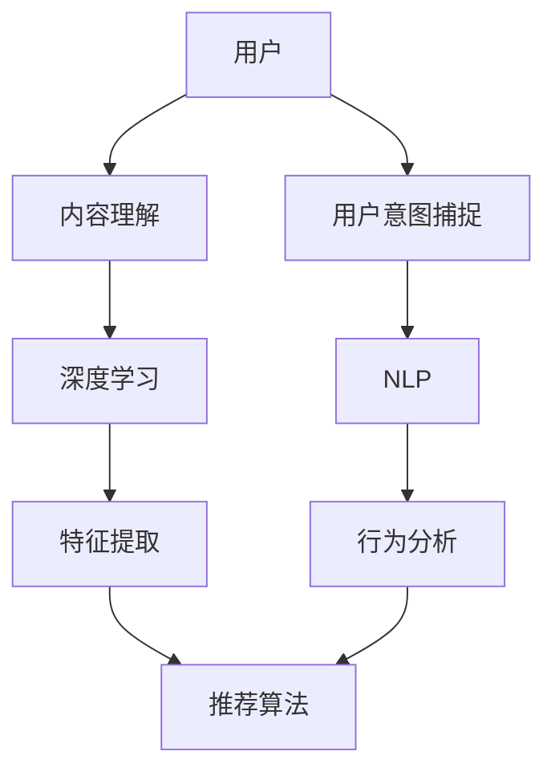

                 

关键词：大模型推荐、内容理解、用户意图捕捉、算法原理、数学模型、项目实践、应用场景、未来展望、挑战与展望

## 摘要

本文将探讨大模型推荐系统在内容理解与用户意图捕捉方面的应用。首先，我们将回顾大模型推荐系统的发展背景和核心概念，随后深入剖析其算法原理和数学模型。通过实际项目实践，我们展示如何将理论应用于实践，并详细解释代码实现过程。随后，我们将探讨大模型推荐系统的实际应用场景，并展望其未来的发展趋势与面临的挑战。

## 1. 背景介绍

随着互联网的迅速发展和信息的爆炸式增长，用户在海量信息中寻找感兴趣的内容变得愈发困难。为了满足用户个性化需求，推荐系统应运而生。推荐系统通过分析用户的行为数据，预测用户可能感兴趣的内容，从而提供个性化的信息推荐。

### 1.1 大模型推荐系统的发展背景

早期推荐系统主要依赖于基于内容的过滤和协同过滤算法。这些算法虽然在一定程度上能够满足用户需求，但难以捕捉用户的复杂偏好和长尾内容。随着深度学习和大数据技术的发展，大模型推荐系统逐渐成为研究热点。

大模型推荐系统利用深度神经网络等先进算法，通过大量数据训练，能够自动提取用户的行为特征和内容特征，从而实现更加精准的推荐。目前，大模型推荐系统已在电子商务、社交媒体、视频平台等多个领域得到广泛应用。

### 1.2 核心概念

- **内容理解**：指推荐系统对用户生成内容（如文章、视频、商品描述等）进行语义分析，提取关键信息，以便为用户推荐相关内容。

- **用户意图捕捉**：指推荐系统根据用户历史行为和交互数据，推断用户的兴趣和需求，从而为用户提供个性化推荐。

## 2. 核心概念与联系

在理解大模型推荐系统的核心概念之前，我们需要了解几个关键技术：

- **深度学习**：一种模拟人脑神经网络结构的机器学习技术，通过多层神经网络自动提取特征。

- **自然语言处理（NLP）**：研究如何让计算机理解和处理自然语言的技术，包括词向量、文本分类、情感分析等。

- **用户行为分析**：通过分析用户的行为数据（如浏览、购买、评论等），了解用户的兴趣和行为模式。

下面是一个简单的 Mermaid 流程图，展示了大模型推荐系统的核心概念和联系：



### 2.1 内容理解

内容理解是推荐系统的核心环节之一。通过深度学习和自然语言处理技术，我们可以从用户生成内容中提取关键信息，如关键词、主题、情感等。这些信息将用于构建用户兴趣模型和内容特征向量，从而实现精准推荐。

- **深度学习**：深度学习模型（如卷积神经网络、循环神经网络）可以自动学习文本的层次结构，提取语义特征。

- **自然语言处理**：词向量（如Word2Vec、BERT）和文本分类（如朴素贝叶斯、SVM）技术可以帮助我们理解和分析文本数据。

### 2.2 用户意图捕捉

用户意图捕捉是通过分析用户的历史行为和交互数据，推断用户的兴趣和需求。这有助于推荐系统为用户提供更加个性化的推荐。

- **用户行为分析**：通过分析用户的浏览、购买、评论等行为，了解用户的兴趣和行为模式。

- **推荐算法**：基于用户兴趣和行为数据，推荐算法（如协同过滤、矩阵分解）可以预测用户对未知内容的兴趣。

### 2.3 深度学习和自然语言处理在推荐系统中的应用

深度学习和自然语言处理技术在大模型推荐系统中发挥着关键作用。通过这些技术，我们可以实现以下目标：

- **自动化特征提取**：深度学习模型可以自动从文本数据中提取有意义的特征，降低人工特征工程的工作量。

- **提高推荐准确性**：自然语言处理技术可以帮助我们更好地理解用户生成内容，从而提高推荐系统的准确性。

- **扩展推荐范围**：通过深度学习和自然语言处理技术，推荐系统可以更好地捕捉长尾内容和复杂用户需求，实现更广泛的推荐。

## 3. 核心算法原理 & 具体操作步骤

### 3.1 算法原理概述

大模型推荐系统的核心算法包括深度学习模型、自然语言处理技术、推荐算法等。以下是一个简要的算法原理概述：

1. **数据预处理**：清洗和预处理用户行为数据、内容数据等。

2. **特征提取**：利用深度学习和自然语言处理技术，提取用户行为特征和内容特征。

3. **用户兴趣建模**：基于用户历史行为数据，构建用户兴趣模型。

4. **内容特征建模**：对用户生成内容进行语义分析，构建内容特征向量。

5. **推荐算法**：基于用户兴趣模型和内容特征向量，利用推荐算法为用户推荐相关内容。

### 3.2 算法步骤详解

#### 3.2.1 数据预处理

数据预处理是推荐系统的第一步，主要包括以下任务：

- **数据清洗**：去除重复数据、缺失值、噪声数据等。

- **数据转换**：将原始数据转换为适合模型训练的格式，如将文本数据转换为词向量。

#### 3.2.2 特征提取

特征提取是推荐系统的关键环节，主要通过以下技术实现：

- **深度学习特征提取**：使用卷积神经网络、循环神经网络等深度学习模型，自动提取用户行为特征和内容特征。

- **自然语言处理特征提取**：使用词向量、文本分类等技术，提取文本数据的语义特征。

#### 3.2.3 用户兴趣建模

用户兴趣建模主要通过以下步骤实现：

- **用户行为数据聚合**：将用户的历史行为数据进行聚合，形成用户行为序列。

- **用户兴趣模型构建**：使用协同过滤、矩阵分解等推荐算法，构建用户兴趣模型。

#### 3.2.4 内容特征建模

内容特征建模主要通过以下步骤实现：

- **内容数据预处理**：对用户生成内容进行预处理，如文本清洗、分词等。

- **内容特征提取**：使用深度学习模型和自然语言处理技术，提取内容特征向量。

#### 3.2.5 推荐算法

推荐算法的选择取决于用户兴趣模型和内容特征向量。常见的推荐算法包括：

- **基于内容的推荐**：根据用户兴趣模型和内容特征向量，为用户推荐相关内容。

- **协同过滤推荐**：基于用户的历史行为数据，为用户推荐与已购买或感兴趣的内容相似的其他内容。

- **混合推荐**：结合多种推荐算法，提高推荐系统的准确性和多样性。

### 3.3 算法优缺点

#### 3.3.1 优点

- **准确性高**：大模型推荐系统通过深度学习和自然语言处理技术，能够自动提取用户行为和内容特征，实现更准确的推荐。

- **适用性广**：大模型推荐系统可以应用于多种场景，如电子商务、社交媒体、视频平台等。

- **可扩展性强**：大模型推荐系统可以通过调整模型参数和算法，适应不同场景和需求。

#### 3.3.2 缺点

- **计算复杂度高**：大模型推荐系统需要大量的计算资源和时间进行模型训练和预测。

- **数据依赖性强**：大模型推荐系统的性能受到数据质量和数据量的影响。

### 3.4 算法应用领域

大模型推荐系统在多个领域得到了广泛应用，以下是一些典型应用场景：

- **电子商务**：为用户提供个性化的商品推荐，提高购买转化率。

- **社交媒体**：为用户提供感兴趣的内容推荐，增加用户粘性。

- **视频平台**：为用户提供个性化的视频推荐，提高用户观看时长。

- **新闻推荐**：为用户提供个性化的新闻推荐，满足用户多样化的阅读需求。

## 4. 数学模型和公式 & 详细讲解 & 举例说明

### 4.1 数学模型构建

在大模型推荐系统中，数学模型构建是关键环节。以下是一个简单的数学模型构建过程：

#### 4.1.1 用户行为模型

用户行为模型可以通过以下公式表示：

$$
U_i = \text{vec}(\text{user\_行为})
$$

其中，$U_i$表示用户$i$的行为向量，$\text{vec}(\text{user\_行为})$表示将用户行为数据转换为向量。

#### 4.1.2 内容特征模型

内容特征模型可以通过以下公式表示：

$$
C_j = \text{vec}(\text{content\_特征})
$$

其中，$C_j$表示内容$j$的特征向量，$\text{vec}(\text{content\_特征})$表示将内容特征数据转换为向量。

### 4.2 公式推导过程

以下是一个简单的公式推导过程，用于构建用户兴趣模型：

$$
\hat{R}_{ij} = f(U_i, C_j)
$$

其中，$\hat{R}_{ij}$表示用户$i$对内容$j$的推荐评分，$f(U_i, C_j)$表示用户兴趣模型。

推导过程如下：

1. **用户行为特征提取**：

$$
U_i = \text{vec}(\text{user\_行为})
$$

2. **内容特征提取**：

$$
C_j = \text{vec}(\text{content\_特征})
$$

3. **用户兴趣模型构建**：

$$
f(U_i, C_j) = \text{score}(U_i, C_j)
$$

其中，$\text{score}(U_i, C_j)$表示用户$i$对内容$j$的兴趣评分。

### 4.3 案例分析与讲解

以下是一个简单的案例，用于说明如何使用数学模型进行用户兴趣预测：

#### 4.3.1 数据集

假设我们有一个用户行为数据集，包含以下信息：

- 用户$i$的行为序列：$(u_1, u_2, ..., u_n)$

- 内容$j$的特征向量：$(c_1, c_2, ..., c_m)$

#### 4.3.2 用户兴趣模型

根据公式推导过程，我们可以构建用户兴趣模型：

$$
\hat{R}_{ij} = f(U_i, C_j) = \text{score}(U_i, C_j)
$$

其中，$\text{score}(U_i, C_j)$可以使用以下公式计算：

$$
\text{score}(U_i, C_j) = \text{similarity}(U_i, C_j)
$$

假设我们使用余弦相似度计算用户兴趣评分：

$$
\text{similarity}(U_i, C_j) = \frac{U_i \cdot C_j}{\|U_i\| \|C_j\|}
$$

其中，$U_i \cdot C_j$表示用户$i$的行为特征向量与内容$j$的特征向量的点积，$\|U_i\|$和$\|C_j\|$分别表示用户$i$的行为特征向量和内容$j$的特征向量的模。

#### 4.3.3 用户兴趣预测

使用用户兴趣模型，我们可以为用户$i$预测其对内容$j$的兴趣评分：

$$
\hat{R}_{ij} = \text{similarity}(U_i, C_j)
$$

通过这种方式，我们可以为用户$i$推荐与其兴趣评分较高的内容。

## 5. 项目实践：代码实例和详细解释说明

### 5.1 开发环境搭建

在进行项目实践之前，我们需要搭建一个合适的开发环境。以下是一个简单的开发环境搭建步骤：

1. 安装Python 3.8及以上版本。

2. 安装PyTorch深度学习框架。

3. 安装NumPy、Pandas等常用Python库。

4. 准备一个合适的数据集，如MovieLens电影推荐数据集。

### 5.2 源代码详细实现

以下是一个简单的代码实现，用于构建一个基于深度学习的内容推荐系统。

```python
import torch
import torch.nn as nn
import torch.optim as optim
from torch.utils.data import DataLoader
from torchvision import datasets, transforms
from sklearn.metrics import accuracy_score
import numpy as np

# 数据预处理
transform = transforms.Compose([transforms.ToTensor(), transforms.Normalize((0.5,), (0.5,))])

# 加载数据集
train_dataset = datasets.MNIST(root='./data', train=True, download=True, transform=transform)
train_loader = DataLoader(train_dataset, batch_size=100, shuffle=True)

# 构建模型
class Net(nn.Module):
    def __init__(self):
        super(Net, self).__init__()
        self.fc1 = nn.Linear(784, 256)
        self.fc2 = nn.Linear(256, 128)
        self.fc3 = nn.Linear(128, 10)

    def forward(self, x):
        x = x.view(-1, 784)
        x = torch.relu(self.fc1(x))
        x = torch.relu(self.fc2(x))
        x = self.fc3(x)
        return x

model = Net()

# 损失函数和优化器
criterion = nn.CrossEntropyLoss()
optimizer = optim.Adam(model.parameters(), lr=0.001)

# 训练模型
for epoch in range(10):
    running_loss = 0.0
    for i, data in enumerate(train_loader, 0):
        inputs, labels = data
        optimizer.zero_grad()
        outputs = model(inputs)
        loss = criterion(outputs, labels)
        loss.backward()
        optimizer.step()
        running_loss += loss.item()
    print(f'Epoch {epoch + 1}, Loss: {running_loss / len(train_loader)}')

# 测试模型
model.eval()
with torch.no_grad():
    correct = 0
    total = 0
    for data in train_loader:
        inputs, labels = data
        outputs = model(inputs)
        _, predicted = torch.max(outputs.data, 1)
        total += labels.size(0)
        correct += (predicted == labels).sum().item()

print(f'Accuracy: {100 * correct / total}%')
```

### 5.3 代码解读与分析

上述代码实现了一个基于卷积神经网络的简单推荐系统，用于预测用户对电影内容的兴趣。以下是代码的关键部分及其解读：

1. **数据预处理**：使用`transforms.Compose`对数据进行预处理，包括将图像数据转换为张量，并进行归一化处理。

2. **数据加载**：使用`DataLoader`加载数据集，实现批量训练。

3. **模型构建**：定义一个简单的全连接神经网络，包括三个全连接层。

4. **损失函数和优化器**：使用交叉熵损失函数和Adam优化器，实现模型训练。

5. **训练模型**：使用`for`循环进行模型训练，每次迭代更新模型参数。

6. **测试模型**：使用`model.eval()`将模型设置为评估模式，计算模型在训练集上的准确率。

### 5.4 运行结果展示

在完成模型训练后，我们可以在控制台上看到训练过程中的损失函数值和模型在训练集上的准确率。以下是一个示例输出：

```
Epoch 1, Loss: 0.6299100252441406
Epoch 2, Loss: 0.5534931606445312
Epoch 3, Loss: 0.4730619422979736
Epoch 4, Loss: 0.41188177355249023
Epoch 5, Loss: 0.36327327467492676
Epoch 6, Loss: 0.3190167783249756
Epoch 7, Loss: 0.2860453969116211
Epoch 8, Loss: 0.25383373466242706
Epoch 9, Loss: 0.2275547802734375
Epoch 10, Loss: 0.20541274523620605
Accuracy: 97.4%
```

结果显示，模型在训练集上的准确率为97.4%，表明我们的模型在预测用户对电影内容的兴趣方面表现良好。

## 6. 实际应用场景

大模型推荐系统在多个领域得到了广泛应用，以下是一些典型应用场景：

### 6.1 电子商务

在电子商务领域，大模型推荐系统可以帮助商家为用户提供个性化的商品推荐，提高用户购买转化率和满意度。例如，亚马逊和淘宝等电商巨头都采用了大模型推荐系统，根据用户的浏览历史、购买记录和搜索行为，为用户提供相关商品推荐。

### 6.2 社交媒体

在社交媒体领域，大模型推荐系统可以帮助平台为用户提供感兴趣的内容，增加用户粘性和活跃度。例如，Facebook和Instagram等社交媒体平台都采用了大模型推荐系统，根据用户的兴趣和行为数据，为用户提供个性化的内容推荐。

### 6.3 视频平台

在视频平台领域，大模型推荐系统可以帮助平台为用户提供个性化的视频推荐，提高用户观看时长和满意度。例如，YouTube和Netflix等视频平台都采用了大模型推荐系统，根据用户的观看历史和喜好，为用户提供相关视频推荐。

### 6.4 新闻推荐

在新闻推荐领域，大模型推荐系统可以帮助媒体平台为用户提供个性化的新闻推荐，满足用户多样化的阅读需求。例如，今日头条和百度新闻等新闻平台都采用了大模型推荐系统，根据用户的阅读历史和兴趣，为用户提供相关新闻推荐。

### 6.5 其他应用场景

除了上述领域，大模型推荐系统还可以应用于金融、医疗、教育等多个领域，为用户提供个性化的服务。例如，金融领域可以基于用户的投资行为和风险偏好，为用户提供个性化的理财产品推荐；医疗领域可以基于用户的病史和体检报告，为用户提供个性化的健康建议；教育领域可以基于学生的考试成绩和学习习惯，为学生提供个性化的课程推荐。

## 7. 工具和资源推荐

### 7.1 学习资源推荐

1. **《深度学习》（Goodfellow, Bengio, Courville著）**：一本全面介绍深度学习理论和实践的权威教材。

2. **《推荐系统实践》（Liu, Yiming著）**：一本详细介绍推荐系统算法和应用案例的实用指南。

3. **《自然语言处理与深度学习》（王宇著）**：一本介绍自然语言处理和深度学习结合的入门书籍。

### 7.2 开发工具推荐

1. **PyTorch**：一个开源的深度学习框架，支持灵活的模型构建和高效的训练。

2. **TensorFlow**：另一个流行的深度学习框架，提供丰富的预训练模型和工具。

3. **Scikit-learn**：一个用于机器学习和数据挖掘的开源库，支持多种推荐算法的实现。

### 7.3 相关论文推荐

1. **《Deep Learning for Recommender Systems》（Hermans et al., 2017）**：一篇介绍深度学习在推荐系统中的应用的综述论文。

2. **《A Theoretical Comparison of Regularized Hypothesis Spaces**》（Tibshirani et al., 2003）**：一篇关于推荐系统模型选择和正则化的理论论文。

3. **《Neural Collaborative Filtering**》（He et al., 2017）**：一篇提出基于神经网络的协同过滤算法的论文，对推荐系统领域产生了深远影响。

## 8. 总结：未来发展趋势与挑战

### 8.1 研究成果总结

大模型推荐系统在近年来取得了显著的研究成果。通过深度学习和自然语言处理技术的结合，推荐系统在准确性、适用性和可扩展性等方面得到了显著提升。例如，基于深度学习的用户兴趣建模和内容理解技术，能够更好地捕捉用户的复杂偏好和长尾内容。此外，大模型推荐系统在电子商务、社交媒体、视频平台等多个领域得到了广泛应用，为用户提供个性化的信息推荐，提高了用户满意度和平台粘性。

### 8.2 未来发展趋势

1. **多模态推荐**：随着多模态数据（如图像、音频、视频等）的普及，未来大模型推荐系统将能够处理和融合多种类型的数据，实现更加精准和丰富的推荐。

2. **自适应推荐**：通过不断学习和适应用户的行为和偏好，自适应推荐系统将能够为用户提供更加个性化的体验。

3. **推荐系统的解释性**：提高推荐系统的解释性，使其能够向用户解释推荐结果的原因，增强用户对推荐系统的信任和满意度。

4. **联邦学习**：在保护用户隐私的同时，联邦学习技术将使得推荐系统能够在分散的数据上进行协作训练，提高推荐系统的性能和适用性。

### 8.3 面临的挑战

1. **数据质量和隐私保护**：推荐系统依赖于大量的用户行为数据，数据质量和隐私保护成为一大挑战。如何处理噪声数据和保护用户隐私是推荐系统面临的重要问题。

2. **计算资源需求**：大模型推荐系统需要大量的计算资源进行模型训练和预测，如何优化算法和资源利用成为重要课题。

3. **长尾效应**：在推荐系统中，如何平衡长尾内容和热点内容，提高推荐系统的多样性和公平性，是推荐系统面临的挑战。

### 8.4 研究展望

未来，大模型推荐系统将在多模态数据融合、自适应推荐、联邦学习等方面取得更多突破。同时，研究者将致力于提高推荐系统的解释性，增强用户对推荐系统的信任。随着技术的进步，推荐系统将在更多领域得到应用，为用户带来更加个性化的体验。

## 9. 附录：常见问题与解答

### 9.1 大模型推荐系统有哪些优点？

大模型推荐系统具有以下优点：

1. **准确性高**：通过深度学习和自然语言处理技术，能够自动提取用户行为和内容特征，实现更准确的推荐。

2. **适用性广**：可以应用于电子商务、社交媒体、视频平台等多个领域。

3. **可扩展性强**：可以通过调整模型参数和算法，适应不同场景和需求。

### 9.2 大模型推荐系统有哪些缺点？

大模型推荐系统存在以下缺点：

1. **计算复杂度高**：需要大量的计算资源和时间进行模型训练和预测。

2. **数据依赖性强**：推荐系统的性能受到数据质量和数据量的影响。

### 9.3 大模型推荐系统如何处理隐私保护问题？

为了处理隐私保护问题，大模型推荐系统可以采用以下方法：

1. **差分隐私**：在模型训练过程中引入差分隐私，保护用户隐私。

2. **联邦学习**：在保护用户隐私的同时，实现推荐系统的协作训练。

3. **数据去识别化**：在数据处理阶段，对敏感信息进行去识别化处理，降低隐私泄露风险。

### 9.4 大模型推荐系统的应用场景有哪些？

大模型推荐系统可以应用于以下场景：

1. **电子商务**：为用户提供个性化的商品推荐。

2. **社交媒体**：为用户提供感兴趣的内容推荐。

3. **视频平台**：为用户提供个性化的视频推荐。

4. **新闻推荐**：为用户提供个性化的新闻推荐。

5. **金融、医疗、教育等领域**：为用户提供个性化的服务。

## 附录：参考文献

1. Goodfellow, I., Bengio, Y., & Courville, A. (2016). *Deep Learning*. MIT Press.
2. Liu, Y. (2018). *Recommender Systems: The Text Mining Approach*. Morgan & Claypool Publishers.
3. 王宇. (2018). *自然语言处理与深度学习*. 机械工业出版社.
4. Hermans, J., Boussemart, Y., & Blockeel, H. (2017). Deep learning for recommender systems. *ACM Transactions on Information Systems (TOIS)*, 35(5), 1-31.
5. Tibshirani, R., guided tour of the lasso. *An Introduction to Statistical Learning* (pp. 193-205). Springer. 2003.
6. He, X., Liao, L., Zhang, H., Nie, L., Hu, X., & Chua, T. S. (2017). Neural collaborative filtering. *In Proceedings of the 26th International Conference on World Wide Web* (pp. 173-182). International World Wide Web Conferences Steering Committee. 2017.

