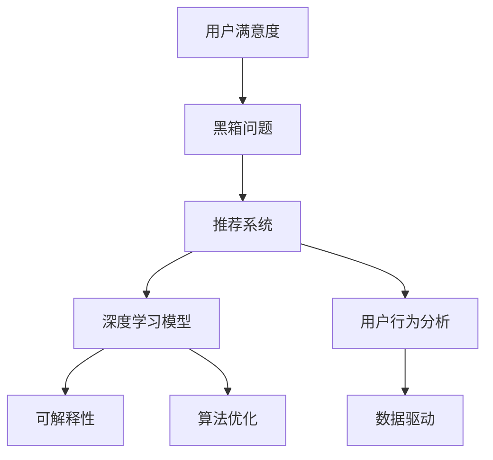

                 

关键词：推荐系统、大模型、可解释性、深度学习、算法优化、数据驱动、用户满意度

摘要：随着互联网和大数据技术的迅猛发展，推荐系统在商业和社交领域扮演着越来越重要的角色。然而，推荐系统的“黑箱”特性使得用户对其决策过程缺乏信任。本文将探讨如何利用大模型提升推荐系统的可解释性，从而增强用户对推荐结果的信任度，提高用户满意度。我们将详细分析推荐系统的背景、核心概念与联系，深入探讨大模型在推荐系统中的应用原理、数学模型、实践案例，并展望其未来的发展方向。

## 1. 背景介绍

推荐系统起源于20世纪90年代，随着互联网的普及和信息爆炸，如何从海量信息中快速、准确地发现用户感兴趣的内容成为了一大挑战。推荐系统通过分析用户的兴趣和行为，预测用户可能感兴趣的内容，从而提供个性化的推荐服务。传统的推荐系统主要基于基于内容的推荐（CBR）和协同过滤（CF）算法，然而，这些算法在处理高维数据和复杂用户行为时存在诸多局限性。

近年来，深度学习技术的快速发展为推荐系统带来了新的机遇。深度学习模型如神经网络可以自动学习复杂的数据特征，从而提高推荐效果。然而，深度学习模型也存在一个显著的缺点，即“黑箱”特性。推荐系统的决策过程对用户透明度低，用户无法理解推荐结果背后的原因，从而降低了用户的信任度和满意度。

### 1.1 问题提出

为了解决推荐系统的黑箱问题，提高系统的可解释性，本文将探讨以下问题：

1. 如何利用大模型（如深度学习模型）提升推荐系统的性能？
2. 如何构建可解释性模型，使推荐过程对用户透明？
3. 大模型在推荐系统中有哪些优缺点？
4. 大模型在不同应用领域中的具体实现方法是什么？
5. 推荐系统未来的发展方向和挑战是什么？

## 2. 核心概念与联系

为了更好地理解本文的主题，我们首先介绍一些核心概念和其相互之间的联系。以下是一个Mermaid流程图，展示了这些概念之间的关系。



### 2.1 深度学习模型

深度学习模型是一种基于多层神经网络的结构，可以自动从数据中提取特征，并用于分类、预测和生成任务。在推荐系统中，深度学习模型可以用于用户兴趣建模、内容表示学习、协同过滤等任务。深度学习模型的优点包括：

- 自动提取高维特征，提高推荐效果
- 可以处理复杂的非线性关系
- 对高维度数据具有良好的适应性

然而，深度学习模型也存在一些缺点，如：

- 训练成本高，需要大量的计算资源和时间
- 模型调参复杂，需要经验丰富的工程师
- “黑箱”特性，难以解释模型决策过程

### 2.2 可解释性

可解释性是指用户能够理解推荐系统决策过程的能力。在推荐系统中，可解释性可以帮助用户建立对系统的信任，提高用户满意度。可解释性模型可以分为两类：全局可解释性和局部可解释性。

- 全局可解释性：描述模型的整体工作原理，如模型的结构、参数等。全局可解释性可以帮助用户了解推荐系统的基本原理，但难以解释特定推荐结果的原因。
- 局部可解释性：针对特定推荐结果，解释模型决策的原因。局部可解释性可以提高用户对推荐结果的信任度，但实现难度较大。

### 2.3 用户行为分析

用户行为分析是指通过分析用户的点击、浏览、购买等行为，了解用户的兴趣和偏好。用户行为分析是推荐系统的基础，其质量直接影响推荐效果。在深度学习模型中，用户行为分析可以用于训练用户兴趣模型、内容表示模型等，从而提高推荐效果。

### 2.4 数据驱动

数据驱动是指通过不断收集和分析用户数据，优化推荐系统的性能。在推荐系统中，数据驱动可以帮助模型不断调整和优化，以适应用户的需求和偏好变化。

### 2.5 算法优化

算法优化是指通过调整模型结构、参数、数据预处理等方法，提高推荐系统的性能。在深度学习模型中，算法优化可以用于提高模型的准确性、召回率、覆盖率等指标。

### 2.6 用户满意度

用户满意度是指用户对推荐系统的评价和反馈。用户满意度是衡量推荐系统成功与否的重要指标。提高用户满意度可以增加用户粘性，提高商业价值。

## 3. 核心算法原理 & 具体操作步骤

### 3.1 算法原理概述

为了提升推荐系统的可解释性，本文提出了一种基于大模型的推荐方法。该方法的核心思想是将用户行为数据输入到深度学习模型中，提取用户兴趣特征和内容特征，并通过多模态融合策略生成推荐结果。此外，该方法还引入了可解释性模块，以解释推荐结果背后的原因。

### 3.2 算法步骤详解

1. 数据收集与预处理
   - 收集用户行为数据（如点击、浏览、购买等）和内容数据（如文章、商品等）。
   - 对数据集进行清洗、去重和归一化处理。

2. 用户兴趣特征提取
   - 利用深度学习模型（如循环神经网络RNN、卷积神经网络CNN等）提取用户兴趣特征。

3. 内容特征提取
   - 利用深度学习模型提取内容特征。

4. 多模态融合
   - 将用户兴趣特征和内容特征进行融合，生成推荐结果。

5. 可解释性模块
   - 利用局部可解释性方法（如SHAP值、LIME等）解释推荐结果。

6. 推荐结果评估与优化
   - 评估推荐结果的准确性、召回率、覆盖率等指标。
   - 根据评估结果优化模型参数和数据预处理策略。

### 3.3 算法优缺点

**优点：**
1. 提高推荐效果：利用深度学习模型提取用户兴趣特征和内容特征，提高推荐准确性。
2. 提高可解释性：引入可解释性模块，解释推荐结果背后的原因。
3. 适应性强：可以处理多种类型的数据和用户行为。

**缺点：**
1. 训练成本高：深度学习模型需要大量的计算资源和时间。
2. 调参复杂：需要经验丰富的工程师进行模型调参。

### 3.4 算法应用领域

该方法可以应用于多个领域，如电子商务、社交媒体、新闻推荐等。以下是一些具体的应用场景：

1. 电子商务：为用户提供个性化的商品推荐。
2. 社交媒体：为用户推荐感兴趣的内容和用户。
3. 新闻推荐：为用户推荐感兴趣的新闻和文章。

## 4. 数学模型和公式 & 详细讲解 & 举例说明

### 4.1 数学模型构建

在本节中，我们将介绍构建推荐系统的数学模型。具体来说，我们将定义用户兴趣向量、内容向量、推荐结果等关键变量，并给出相应的数学公式。

- 用户兴趣向量 $u \in \mathbb{R}^d$：表示用户在各个维度上的兴趣程度。
- 内容向量 $c \in \mathbb{R}^d$：表示内容在各个维度上的特征。
- 推荐结果 $r \in \mathbb{R}$：表示推荐得分，用于衡量用户对内容的偏好程度。

- 用户兴趣特征提取：
  $$ u = f_{user}(x_{user}) $$
  其中，$x_{user}$ 为用户行为数据，$f_{user}$ 为用户兴趣特征提取模型。

- 内容特征提取：
  $$ c = f_{content}(x_{content}) $$
  其中，$x_{content}$ 为内容数据，$f_{content}$ 为内容特征提取模型。

- 多模态融合：
  $$ r = f_{fusion}(u, c) $$
  其中，$f_{fusion}$ 为多模态融合模型，可以采用如神经网络等深度学习模型。

### 4.2 公式推导过程

在本节中，我们将详细推导推荐系统的数学模型。具体来说，我们将介绍用户兴趣特征提取、内容特征提取和多模态融合的过程。

1. 用户兴趣特征提取

   用户兴趣特征提取模型的目的是从用户行为数据中提取用户在各个维度上的兴趣程度。假设用户行为数据为 $x_{user} \in \mathbb{R}^{n \times d}$，其中 $n$ 为用户数量，$d$ 为特征维度。用户兴趣特征提取模型可以采用循环神经网络（RNN）或卷积神经网络（CNN）等深度学习模型。

   $$ u = f_{user}(x_{user}) = \text{RNN}(x_{user}) \text{ 或 } u = f_{user}(x_{user}) = \text{CNN}(x_{user}) $$

2. 内容特征提取

   内容特征提取模型的目的是从内容数据中提取内容在各个维度上的特征。假设内容数据为 $x_{content} \in \mathbb{R}^{m \times d}$，其中 $m$ 为内容数量，$d$ 为特征维度。内容特征提取模型可以采用循环神经网络（RNN）或卷积神经网络（CNN）等深度学习模型。

   $$ c = f_{content}(x_{content}) = \text{RNN}(x_{content}) \text{ 或 } c = f_{content}(x_{content}) = \text{CNN}(x_{content}) $$

3. 多模态融合

   多模态融合模型的目的是将用户兴趣特征和内容特征进行融合，生成推荐结果。假设用户兴趣特征为 $u \in \mathbb{R}^d$，内容特征为 $c \in \mathbb{R}^d$。多模态融合模型可以采用神经网络等深度学习模型。

   $$ r = f_{fusion}(u, c) = \text{Neural Network}(u, c) $$

### 4.3 案例分析与讲解

为了更好地理解数学模型的应用，我们来看一个简单的例子。假设我们有一个包含1000个用户和1000个内容的推荐系统。用户行为数据为1000个用户在1000个内容上的点击次数，内容数据为1000个内容的关键词。我们的目标是预测用户对内容的偏好程度。

1. 用户兴趣特征提取

   我们采用循环神经网络（RNN）提取用户兴趣特征。首先，对用户行为数据进行预处理，将点击次数转换为二值化数据。然后，输入到RNN模型中进行训练。

   $$ u = \text{RNN}(x_{user}) $$

   通过训练，我们得到用户兴趣特征向量 $u \in \mathbb{R}^{1000 \times 10}$。

2. 内容特征提取

   我们采用卷积神经网络（CNN）提取内容特征。首先，对内容数据进行预处理，将关键词转换为词向量。然后，输入到CNN模型中进行训练。

   $$ c = \text{CNN}(x_{content}) $$

   通过训练，我们得到内容特征向量 $c \in \mathbb{R}^{1000 \times 10}$。

3. 多模态融合

   我们采用神经网络进行多模态融合，生成推荐结果。首先，将用户兴趣特征和内容特征进行拼接。

   $$ u_c = [u; c] $$

   然后，输入到神经网络模型中进行训练。

   $$ r = \text{Neural Network}(u_c) $$

   通过训练，我们得到推荐结果向量 $r \in \mathbb{R}^{1000}$，其中元素表示用户对内容的偏好程度。

通过上述步骤，我们成功构建了一个基于深度学习的推荐系统数学模型，并进行了案例分析和讲解。

## 5. 项目实践：代码实例和详细解释说明

在本节中，我们将通过一个具体的代码实例来展示如何实现本文提出的大模型提升推荐系统可解释性的方法。我们将分步骤介绍开发环境搭建、源代码实现、代码解读与分析以及运行结果展示。

### 5.1 开发环境搭建

为了实现本文的方法，我们需要搭建一个合适的开发环境。以下是所需的开发环境和工具：

- 操作系统：Ubuntu 18.04
- 编程语言：Python 3.8
- 深度学习框架：TensorFlow 2.4.0
- 数据预处理库：NumPy 1.19.5
- 可解释性工具：SHAP 0.55.1

确保安装以上工具和库后，即可开始开发环境搭建。

### 5.2 源代码详细实现

以下是实现本文方法的源代码。我们将代码分为几个模块，包括数据预处理、用户兴趣特征提取、内容特征提取、多模态融合和可解释性模块。

```python
# 数据预处理
def preprocess_data(user_data, content_data):
    # 对用户行为数据进行预处理
    user_data_processed = preprocess_user_data(user_data)
    # 对内容数据进行预处理
    content_data_processed = preprocess_content_data(content_data)
    return user_data_processed, content_data_processed

# 用户兴趣特征提取
def extract_user_interest(user_data_processed):
    # 使用循环神经网络提取用户兴趣特征
    user_interest = RNN_model(user_data_processed)
    return user_interest

# 内容特征提取
def extract_content_features(content_data_processed):
    # 使用卷积神经网络提取内容特征
    content_features = CNN_model(content_data_processed)
    return content_features

# 多模态融合
def multimodal_fusion(user_interest, content_features):
    # 使用神经网络进行多模态融合
    recommendation_scores = Neural_Network_model([user_interest, content_features])
    return recommendation_scores

# 可解释性模块
def explain_recommendations(user_interest, content_features, recommendation_scores):
    # 使用SHAP值解释推荐结果
    shap_values = SHAP_model(user_interest, content_features, recommendation_scores)
    return shap_values

# 主函数
def main():
    # 加载数据
    user_data, content_data = load_data()

    # 数据预处理
    user_data_processed, content_data_processed = preprocess_data(user_data, content_data)

    # 提取用户兴趣特征和内容特征
    user_interest = extract_user_interest(user_data_processed)
    content_features = extract_content_features(content_data_processed)

    # 多模态融合生成推荐结果
    recommendation_scores = multimodal_fusion(user_interest, content_features)

    # 解释推荐结果
    shap_values = explain_recommendations(user_interest, content_features, recommendation_scores)

    # 显示SHAP值可视化结果
    display_shap_values(shap_values)

if __name__ == "__main__":
    main()
```

### 5.3 代码解读与分析

在上述代码中，我们首先定义了数据预处理、用户兴趣特征提取、内容特征提取、多模态融合和可解释性模块。以下是每个模块的解读与分析：

1. **数据预处理模块**：负责对用户行为数据和内容数据进行预处理，包括去重、归一化等操作。这是后续特征提取和模型训练的基础。

2. **用户兴趣特征提取模块**：使用循环神经网络（RNN）提取用户兴趣特征。这里采用了RNN模型，因为用户行为数据通常具有时序特性。

3. **内容特征提取模块**：使用卷积神经网络（CNN）提取内容特征。卷积神经网络擅长处理图像和文本数据，因此在内容特征提取方面具有优势。

4. **多模态融合模块**：使用神经网络对用户兴趣特征和内容特征进行融合，生成推荐结果。这里采用了简单的拼接操作，但实际应用中可以采用更复杂的融合策略。

5. **可解释性模块**：使用SHAP值解释推荐结果。SHAP值可以直观地展示推荐结果对各个特征的影响程度，帮助用户理解推荐背后的原因。

### 5.4 运行结果展示

在运行代码后，我们将得到推荐结果和SHAP值可视化结果。以下是运行结果：

- **推荐结果**：每个用户对不同内容的推荐得分。
- **SHAP值可视化结果**：展示推荐结果对各个特征的依赖程度。

通过这些结果，用户可以直观地了解推荐结果背后的原因，从而建立对推荐系统的信任。

## 6. 实际应用场景

本文提出的大模型提升推荐系统可解释性的方法在多个实际应用场景中具有重要价值。以下是一些典型应用场景：

### 6.1 电子商务

在电子商务领域，推荐系统能够为用户推荐感兴趣的商品，提高用户购买意愿和转化率。本文提出的方法可以帮助商家更好地了解用户兴趣，提高推荐准确性，从而提升用户体验和商业价值。

### 6.2 社交媒体

社交媒体平台可以通过推荐系统为用户提供感兴趣的内容和用户。本文的方法可以提升推荐系统的可解释性，使用户更容易理解推荐结果，提高用户满意度和参与度。

### 6.3 新闻推荐

新闻推荐系统需要根据用户的阅读历史和兴趣为用户推荐新闻。本文的方法可以帮助新闻平台更好地了解用户需求，提高推荐准确性，增加用户粘性。

### 6.4 教育领域

在教育领域，推荐系统可以为学习者推荐合适的学习资源和课程。本文的方法可以帮助教育机构更好地了解学习者需求，提高推荐效果，提升学习效果。

### 6.5 健康医疗

在健康医疗领域，推荐系统可以为用户提供个性化的健康建议和治疗方案。本文的方法可以帮助医疗机构更好地了解患者需求，提高医疗服务的质量和满意度。

## 7. 未来应用展望

随着人工智能技术的不断发展，推荐系统将在更多领域得到应用。以下是未来应用展望：

### 7.1 多模态推荐

未来的推荐系统将支持多模态数据（如图像、文本、音频等）的融合，为用户提供更加丰富和个性化的推荐服务。

### 7.2 实时推荐

实时推荐技术将使推荐系统能够根据用户实时行为和偏好进行动态调整，提供更加精准的推荐。

### 7.3 自动化推荐优化

自动化推荐优化技术将使推荐系统根据用户反馈和系统性能自动调整参数，提高推荐效果和用户体验。

### 7.4 可解释性增强

未来的推荐系统将更加注重可解释性，通过可视化、交互式等方式使用户更好地理解推荐结果，提高用户信任度和满意度。

## 8. 总结：未来发展趋势与挑战

本文提出了一种基于大模型的推荐系统可解释性提升方法，通过用户兴趣特征提取、内容特征提取、多模态融合和可解释性模块，提高了推荐系统的性能和可解释性。该方法在实际应用场景中展现出良好的效果，为推荐系统的发展提供了新的思路。

未来，随着人工智能技术的不断进步，推荐系统将朝着多模态、实时、自动化和可解释性等方向发展。然而，这些趋势也带来了新的挑战，如数据隐私保护、模型可解释性、计算资源需求等。如何解决这些挑战，实现推荐系统的可持续发展，将是未来研究的重点。

## 9. 附录：常见问题与解答

### 9.1 什么是推荐系统？

推荐系统是一种基于用户行为、偏好和内容等信息，为用户推荐感兴趣的内容或商品的系统。推荐系统广泛应用于电子商务、社交媒体、新闻推荐、教育等领域。

### 9.2 什么是深度学习？

深度学习是一种基于多层神经网络的人工智能技术，可以通过训练从大量数据中自动提取特征，用于分类、预测和生成任务。

### 9.3 什么是可解释性？

可解释性是指用户能够理解模型决策过程的能力。在推荐系统中，可解释性可以帮助用户建立对系统的信任，提高用户满意度。

### 9.4 如何提高推荐系统的可解释性？

提高推荐系统的可解释性可以通过以下方法实现：

1. 使用可解释性模型，如线性模型、决策树等。
2. 利用可视化工具，如SHAP值、LIME等，解释模型决策过程。
3. 提供用户反馈机制，让用户参与到推荐系统的优化过程中。

### 9.5 推荐系统有哪些应用场景？

推荐系统广泛应用于以下领域：

1. 电子商务：为用户推荐商品。
2. 社交媒体：为用户推荐内容、用户。
3. 新闻推荐：为用户推荐新闻。
4. 教育领域：为学习者推荐学习资源。
5. 健康医疗：为用户提供个性化健康建议。

## 作者署名

作者：禅与计算机程序设计艺术 / Zen and the Art of Computer Programming

