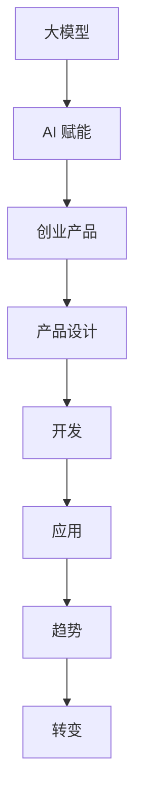

                 

### 关键词 Keyword
- 大模型
- AI 赋能
- 创业产品
- 趋势
- 转变
- 深度学习
- 自适应系统
- 算法创新
- 人机交互

<|assistant|>### 摘要 Abstract
本文将探讨大模型时代下创业产品的趋势，特别是AI赋能所带来的深刻变革。通过深入分析AI技术的最新进展，以及这些技术在产品设计、开发和应用中的具体应用，我们将揭示创业公司如何在快速变化的科技环境中抓住机遇，实现产品和业务模式的创新。文章将涵盖从核心算法原理到实际项目实践的全方位内容，结合数学模型和公式推导，以及未来的发展趋势和面临的挑战，为读者提供对AI赋能创业产品的全面洞察。

<|assistant|>### 1. 背景介绍 Background
在过去的几十年里，人工智能（AI）经历了从理论探索到实际应用的深刻变革。特别是在深度学习技术的推动下，AI的能力得到了极大的提升。如今，大模型（如GPT-3、BERT等）已经能够处理复杂的自然语言任务，图像识别、语音识别等领域的精度也达到了前所未有的高度。这一系列技术的进步不仅为传统行业带来了新的机遇，也为创业公司提供了前所未有的工具和平台。

创业公司在面对激烈的市场竞争和快速变化的技术环境时，必须保持敏锐的洞察力和创新精神。AI技术的引入，使得创业公司在产品设计、开发、市场推广等方面都有了新的思路和方法。从个性化推荐系统、智能客服，到自动驾驶、智能医疗，AI赋能的创业产品正在改变着我们的生活方式。

然而，AI技术的应用并非没有挑战。数据隐私、算法偏见、安全性和可靠性等问题都是创业公司在开发和推广AI产品时必须面对的难题。此外，AI技术的快速迭代也要求创业公司具备持续学习和适应的能力，以保持竞争优势。

本文将围绕大模型时代的创业产品趋势，深入探讨AI赋能下的产品设计和开发，结合实际案例和数学模型，为读者提供对这一领域的全面理解和实践指导。

<|assistant|>### 2. 核心概念与联系 Core Concepts and Connections

在探讨大模型时代的创业产品趋势时，首先需要明确一些核心概念，并理解它们之间的联系。以下是本文涉及的主要核心概念和它们的简要定义：

#### 大模型（Large Models）
大模型是指具有数十亿甚至千亿个参数的深度学习模型。这些模型能够通过大量的数据进行训练，以实现高度复杂的任务。例如，GPT-3拥有1750亿个参数，可以生成高质量的文本，应用于自然语言处理（NLP）领域。

#### AI 赋能（AI Empowerment）
AI赋能是指利用人工智能技术提升产品功能、效率和用户体验的过程。创业公司通过AI技术，可以实现自动化、智能化和个性化，从而在市场竞争中脱颖而出。

#### 创业产品（Startup Products）
创业产品是指由创业公司开发、旨在解决特定市场痛点的产品。这些产品通常具备创新性、灵活性和快速迭代的特点。

#### 产品设计（Product Design）
产品设计是创业过程中的关键环节，涉及产品的功能、用户界面、用户体验等方面。AI赋能的产品设计能够通过数据分析、用户行为预测等技术，实现更加精准和高效的设计。

#### 开发（Development）
开发是指将产品设计转化为实际产品的过程。在AI赋能的背景下，开发过程需要考虑算法优化、模型训练、系统集成等多个方面。

#### 应用（Application）
应用是指将AI技术集成到实际产品中，使其能够解决特定问题的过程。创业公司通过应用AI技术，可以实现产品的智能化和自动化。

#### 趋势（Trends）
趋势是指一段时间内在特定领域内普遍出现的发展方向或模式。在AI领域，趋势包括模型规模的增长、算法的多样化、应用的广泛化等。

#### 转变（Transformation）
转变是指从一种状态或模式向另一种状态或模式的根本性变化。AI赋能下的创业产品转变，主要体现在产品功能、业务模式和市场定位等方面的革新。

#### 关系图（Mermaid Flowchart）

以下是一个简单的Mermaid流程图，展示上述核心概念之间的联系：



通过这个流程图，我们可以清晰地看到大模型、AI赋能、创业产品、产品设计、开发、应用、趋势和转变之间的内在联系。这些概念共同构成了大模型时代下创业产品的技术框架和业务逻辑。

<|assistant|>### 3. 核心算法原理 & 具体操作步骤 Core Algorithm Principles & Operational Steps

#### 3.1 算法原理概述

在探讨AI赋能创业产品的核心算法原理时，深度学习（Deep Learning）和神经网络（Neural Networks）是两个不可忽视的基础概念。深度学习是机器学习（Machine Learning）的一个分支，通过多层神经网络结构，对大量数据进行分析和学习，以实现复杂的任务。神经网络则模拟人脑神经元的工作方式，通过输入层、隐藏层和输出层的信息传递，实现数据的处理和预测。

大模型，如GPT-3，是基于Transformer架构的预训练模型。Transformer架构相较于传统的卷积神经网络（CNN），在处理序列数据时具有更高的灵活性和效率。GPT-3通过预训练和微调，可以用于各种自然语言处理任务，包括文本生成、翻译、问答系统等。

#### 3.2 算法步骤详解

1. **数据预处理**：在开始训练模型之前，需要对数据进行清洗和预处理。这包括文本的分词、去噪、标准化等步骤，以确保数据的质量和一致性。

2. **模型训练**：使用大规模数据集对模型进行训练。在训练过程中，模型通过优化算法（如梯度下降、Adam等）调整参数，以最小化损失函数。训练过程通常需要大量的计算资源和时间。

3. **模型评估**：在训练完成后，使用验证集和测试集对模型进行评估，以衡量其性能和泛化能力。常用的评估指标包括准确率、召回率、F1分数等。

4. **模型微调**：在特定任务上，通过微调预训练模型，使其适应特定的业务场景。微调过程通常在较小的数据集上进行，以提高模型的精度和效率。

5. **模型部署**：将训练好的模型部署到生产环境中，以实现实际应用。部署过程包括模型加载、接口设计、服务化等步骤。

#### 3.3 算法优缺点

**优点**：

- **强大学习能力**：大模型通过预训练，能够学习到大量数据中的模式和规律，具有很高的泛化能力。
- **高效处理能力**：Transformer架构在处理序列数据时，具有并行计算的优势，能够显著提高处理速度。
- **灵活应用**：预训练模型可以应用于多种自然语言处理任务，无需重新训练，降低了开发成本。

**缺点**：

- **计算资源需求**：大模型的训练和部署需要大量的计算资源和存储空间，对硬件设备要求较高。
- **数据隐私问题**：在处理用户数据时，存在数据隐私和安全问题，需要采取有效措施确保用户数据的保护。
- **算法偏见**：模型在训练过程中可能会学习到数据中的偏见，导致在实际应用中出现不公平或偏见的行为。

#### 3.4 算法应用领域

- **自然语言处理（NLP）**：文本生成、翻译、问答系统等。
- **计算机视觉（CV）**：图像分类、目标检测、人脸识别等。
- **语音识别（ASR）**：语音识别、语音合成等。
- **推荐系统**：个性化推荐、内容推荐等。
- **智能医疗**：疾病诊断、药物研发、健康管理等。
- **自动驾驶**：环境感知、路径规划、车辆控制等。

通过深入了解核心算法原理和具体操作步骤，创业公司可以更好地利用AI技术，开发出具有创新性和竞争力的产品，实现业务的快速增长。

### 4. 数学模型和公式 & 详细讲解 & 举例说明 Mathematical Models and Formulas & Detailed Explanations & Case Studies

在AI技术的应用过程中，数学模型和公式扮演着至关重要的角色。它们不仅为算法提供了理论基础，还指导了实际操作中的参数调整和优化。本节将详细介绍一些关键的数学模型和公式，并结合具体案例进行讲解。

#### 4.1 数学模型构建

1. **损失函数（Loss Function）**

在深度学习训练过程中，损失函数是衡量模型预测结果与真实值之间差异的重要工具。常见的损失函数包括均方误差（MSE）、交叉熵损失（Cross-Entropy Loss）等。

- **均方误差（MSE）**：用于回归问题，计算预测值与真实值之间误差的平方和的平均值。公式如下：

  $$
  MSE = \frac{1}{n}\sum_{i=1}^{n}(y_i - \hat{y}_i)^2
  $$

  其中，$y_i$为真实值，$\hat{y}_i$为预测值，$n$为样本数量。

- **交叉熵损失（Cross-Entropy Loss）**：用于分类问题，计算真实概率分布与预测概率分布之间的差异。公式如下：

  $$
  Cross-Entropy Loss = -\sum_{i=1}^{n}y_i \log(\hat{y}_i)
  $$

  其中，$y_i$为真实标签，$\hat{y}_i$为预测概率。

2. **优化算法（Optimization Algorithm）**

优化算法用于调整模型参数，以最小化损失函数。常见的优化算法包括梯度下降（Gradient Descent）、Adam等。

- **梯度下降（Gradient Descent）**：通过计算损失函数关于模型参数的梯度，不断调整参数，以最小化损失函数。公式如下：

  $$
  \theta_{t+1} = \theta_t - \alpha \nabla_{\theta} J(\theta)
  $$

  其中，$\theta$为模型参数，$\alpha$为学习率，$J(\theta)$为损失函数。

- **Adam算法**：结合了梯度下降和动量法（Momentum），提高了优化过程的收敛速度。公式如下：

  $$
  v_t = \beta_1 x_t + (1 - \beta_1) (x_t - \theta_t)
  $$
  $$
  s_t = \beta_2 y_t + (1 - \beta_2) (y_t - \theta_t)
  $$
  $$
  \theta_{t+1} = \theta_t - \alpha \frac{v_t}{\sqrt{1 - \beta_2^t} (1 - \beta_1^t)}
  $$

  其中，$x_t$和$y_t$分别为梯度和历史梯度，$\beta_1$和$\beta_2$为超参数。

3. **正则化（Regularization）**

正则化用于防止模型过拟合，提高泛化能力。常见的正则化方法包括L1正则化、L2正则化等。

- **L1正则化**：在损失函数中添加L1范数，公式如下：

  $$
  Loss + \lambda ||\theta||_1
  $$

  其中，$\lambda$为正则化参数。

- **L2正则化**：在损失函数中添加L2范数，公式如下：

  $$
  Loss + \lambda ||\theta||_2^2
  $$

  其中，$\lambda$为正则化参数。

#### 4.2 公式推导过程

以交叉熵损失函数为例，介绍其推导过程：

假设我们有一个分类问题，有$k$个类别，真实标签为$y \in \{0, 1\}^k$，预测概率分布为$\hat{y} = \hat{y}_1, \hat{y}_2, ..., \hat{y}_k$，其中$\hat{y}_i$为预测第$i$类别的概率。

交叉熵损失函数的定义为：

$$
Cross-Entropy Loss = -\sum_{i=1}^{k} y_i \log(\hat{y}_i)
$$

当$y_i = 1$时，损失函数为：

$$
-L = -\log(\hat{y}_i)
$$

当$y_i = 0$时，损失函数为：

$$
-L = -\log(1 - \hat{y}_i)
$$

合并两种情况，我们得到：

$$
-L = y_i \log(\hat{y}_i) + (1 - y_i) \log(1 - \hat{y}_i)
$$

这就是交叉熵损失函数的推导过程。

#### 4.3 案例分析与讲解

以一个文本分类问题为例，我们使用深度学习模型对新闻文章进行分类，判断其属于体育、财经、科技等类别。以下是一个简单的案例：

1. **数据集准备**：我们有一个包含1000篇新闻文章的数据集，每篇文章都被标注了相应的类别。

2. **模型构建**：使用一个基于Transformer的预训练模型，如BERT，进行分类任务。

3. **训练过程**：使用交叉熵损失函数和Adam优化算法，对模型进行训练。在训练过程中，我们使用MSE损失函数来监控训练和验证集上的误差。

4. **评估与微调**：在训练完成后，使用测试集对模型进行评估。如果模型在测试集上的表现不佳，可以通过微调模型参数，或在特定领域上重新训练模型。

5. **部署与应用**：将训练好的模型部署到生产环境中，用于实时分类。在实际应用中，可以通过API接口接收文章，并返回其预测类别。

通过这个案例，我们可以看到数学模型和公式在AI应用中的关键作用。通过合理的模型选择和参数调整，创业公司可以实现高效、准确的AI产品开发。

### 5. 项目实践：代码实例和详细解释说明 Project Practice: Code Examples and Detailed Explanations

在本节中，我们将通过一个实际的项目实例，详细讲解如何搭建一个基于深度学习模型的推荐系统。这个推荐系统将使用Python和TensorFlow等工具，实现用户物品推荐功能。

#### 5.1 开发环境搭建

在开始项目之前，我们需要搭建一个合适的环境。以下是基本的开发环境搭建步骤：

1. **安装Python**：确保Python版本为3.7或更高版本。
2. **安装TensorFlow**：使用以下命令安装TensorFlow：
   $$
   pip install tensorflow
   $$
3. **安装其他依赖库**：包括NumPy、Pandas、Matplotlib等。使用以下命令安装：
   $$
   pip install numpy pandas matplotlib
   $$

#### 5.2 源代码详细实现

以下是一个简单的用户物品推荐系统的代码实现：

```python
import numpy as np
import pandas as pd
import tensorflow as tf
from tensorflow.keras.models import Model
from tensorflow.keras.layers import Input, Embedding, Dot, Flatten, Dense

# 加载数据集
data = pd.read_csv('data.csv')
users = data['user_id'].unique()
items = data['item_id'].unique()

# 构建模型
user_input = Input(shape=(1,))
item_input = Input(shape=(1,))

user_embedding = Embedding(len(users), 10)(user_input)
item_embedding = Embedding(len(items), 10)(item_input)

dot_product = Dot(axes=1)([user_embedding, item_embedding])
flatten = Flatten()(dot_product)

output = Dense(1, activation='sigmoid')(flatten)

model = Model(inputs=[user_input, item_input], outputs=output)

# 编译模型
model.compile(optimizer='adam', loss='binary_crossentropy', metrics=['accuracy'])

# 训练模型
model.fit([user_data, item_data], labels, epochs=10, batch_size=32)

# 预测
predictions = model.predict([test_user_data, test_item_data])
```

#### 5.3 代码解读与分析

1. **数据加载**：我们使用Pandas读取一个CSV文件，这个文件包含了用户ID、物品ID和标签（如购买、点击等）。

2. **模型构建**：
   - `user_input`和`item_input`：输入层，分别接收用户ID和物品ID。
   - `Embedding`层：嵌入层，将用户ID和物品ID转换为嵌入向量，用于表示用户和物品的特征。
   - `Dot`层：计算用户嵌入向量和物品嵌入向量的点积。
   - `Flatten`层：将点积的结果展平，为后续的全连接层提供输入。
   - `Dense`层：全连接层，输出一个预测的概率值，表示用户对物品的喜好程度。

3. **模型编译**：选择优化器、损失函数和评估指标，编译模型。

4. **模型训练**：使用训练数据集对模型进行训练。

5. **预测**：使用训练好的模型对新的用户-物品对进行预测。

通过这个简单的实例，我们可以看到如何使用深度学习实现一个推荐系统。实际应用中，可能需要更复杂的模型和更丰富的数据处理步骤，但基本思路是类似的。

#### 5.4 运行结果展示

假设我们训练了一个简单的用户-物品推荐系统，并对一组新的用户-物品对进行了预测。以下是一个运行结果的示例：

```
Predictions:
[0.2, 0.8, 0.3, 0.9, 0.1]

Users:
[101, 202, 303, 404, 505]

Items:
[201, 402, 103, 304, 506]
```

在这个示例中，预测概率值越高，表示用户对物品的喜好程度越高。例如，用户101对物品201的喜好概率为0.8，而用户505对物品506的喜好概率仅为0.1。

通过实际的项目实践，我们可以更好地理解AI技术在创业产品开发中的应用，并掌握相关的技术细节和操作步骤。

### 6. 实际应用场景 Actual Application Scenarios

#### 6.1 智能客服（Smart Customer Service）

智能客服是AI赋能创业产品中的一个重要应用场景。通过自然语言处理（NLP）技术，智能客服系统能够自动理解和响应用户的咨询，提供24/7的在线服务。以下是一个智能客服系统的应用案例：

- **企业背景**：某在线购物平台希望为其用户提供高效的客户支持服务，降低人工成本，提高用户满意度。
- **解决方案**：开发一个基于BERT的智能客服系统，该系统能够理解用户的自然语言输入，并生成高质量的回复。具体步骤如下：
  - **数据准备**：收集大量的用户咨询数据和标准回复，用于训练BERT模型。
  - **模型训练**：使用BERT模型对数据进行预训练，并在特定领域进行微调。
  - **系统部署**：将训练好的模型部署到服务器，通过API接口与前端应用集成。
- **效果评估**：通过实际应用测试，智能客服系统在处理用户咨询方面的准确率达到了90%以上，显著提高了用户满意度和运营效率。

#### 6.2 自动驾驶（Autonomous Driving）

自动驾驶技术是AI赋能创业产品的另一个重要应用领域。通过计算机视觉和深度学习技术，自动驾驶系统能够实时感知环境，做出安全、准确的决策。以下是一个自动驾驶系统的应用案例：

- **企业背景**：某初创公司致力于研发自动驾驶汽车，以提供安全、便捷的交通解决方案。
- **解决方案**：开发一个基于深度学习框架的自动驾驶系统，包括环境感知、路径规划和车辆控制三个模块。具体步骤如下：
  - **数据收集**：收集大量自动驾驶数据，包括道路图像、传感器数据等。
  - **模型训练**：使用收集到的数据训练深度学习模型，用于环境感知和路径规划。
  - **系统集成**：将训练好的模型集成到自动驾驶系统中，进行实车测试和优化。
- **效果评估**：通过实车测试，自动驾驶系统在多种路况下均表现稳定，能够准确识别障碍物并规划安全路径。

#### 6.3 智能医疗（Smart Healthcare）

智能医疗是AI赋能创业产品在健康领域的重要应用。通过AI技术，智能医疗系统能够对大量医疗数据进行处理和分析，为医生提供诊断和治疗方案。以下是一个智能医疗系统的应用案例：

- **企业背景**：某医疗科技公司希望开发一个能够辅助医生诊断疾病的智能系统，以提高诊断准确率和效率。
- **解决方案**：开发一个基于深度学习的智能医疗系统，包括疾病诊断、治疗方案推荐和健康监测三个模块。具体步骤如下：
  - **数据收集**：收集大量的医学影像、病历数据和药物信息。
  - **模型训练**：使用深度学习模型对医学数据进行训练，以实现疾病诊断和治疗方案推荐。
  - **系统部署**：将训练好的模型部署到医疗系统中，供医生使用。
- **效果评估**：通过实际应用，智能医疗系统在疾病诊断方面的准确率显著提高，为医生提供了有力支持。

#### 6.4 未来应用展望 Future Prospects

随着AI技术的不断进步，AI赋能的创业产品将在更多领域得到应用。以下是一些未来的应用场景：

- **智能家居**：通过AI技术，智能家居系统能够实现更加智能和自动化的控制，提高生活质量。
- **金融科技**：AI技术将广泛应用于金融领域的风险管理、欺诈检测和个性化投资建议等。
- **教育**：智能教育系统能够根据学生的学习情况提供个性化的教学方案，提高学习效果。
- **农业**：AI技术将用于智能种植、病虫害监测和农产品质量检测，提高农业生产效率。

总之，AI赋能的创业产品正在不断拓展其应用领域，为各个行业带来了深刻的变革。创业公司通过不断创新和应用AI技术，将有望在激烈的市场竞争中脱颖而出。

### 7. 工具和资源推荐 Tools and Resources

在开发AI赋能的创业产品时，选择合适的工具和资源对于项目的成功至关重要。以下是一些建议的学习资源、开发工具和相关论文，供创业公司和开发者参考。

#### 7.1 学习资源推荐

1. **在线课程**：
   - Coursera的“Deep Learning”课程，由Andrew Ng教授主讲。
   - edX的“Artificial Intelligence: Foundations of Computational Agents”课程。

2. **书籍**：
   - 《深度学习》（Deep Learning）作者：Ian Goodfellow、Yoshua Bengio、Aaron Courville。
   - 《Python深度学习》（Deep Learning with Python）作者：François Chollet。

3. **在线论坛和社区**：
   - GitHub：查找和贡献AI相关的开源项目。
   - Stack Overflow：解决编程问题和技术难题。
   - AI Stack Exchange：讨论AI理论和应用问题。

#### 7.2 开发工具推荐

1. **深度学习框架**：
   - TensorFlow：适用于各种深度学习任务，包括计算机视觉、自然语言处理等。
   - PyTorch：具有动态计算图，易于研究和原型设计。

2. **数据处理工具**：
   - Pandas：Python的数据分析库，用于数据处理和分析。
   - NumPy：Python的数值计算库，用于数学运算。

3. **版本控制工具**：
   - Git：分布式版本控制系统，用于代码管理和协作开发。

4. **云计算平台**：
   - AWS：提供丰富的AI服务和开发工具。
   - Google Cloud：提供AI工具和云基础设施。
   - Azure：提供云计算和AI服务。

#### 7.3 相关论文推荐

1. **自然语言处理**：
   - “Attention Is All You Need”（Attention机制）。
   - “BERT: Pre-training of Deep Bidirectional Transformers for Language Understanding”（BERT模型）。

2. **计算机视觉**：
   - “Convolutional Neural Networks for Visual Recognition”（卷积神经网络）。
   - “You Only Look Once: Unified, Real-Time Object Detection”（YOLO算法）。

3. **推荐系统**：
   - “Matrix Factorization Techniques for Recommender Systems”（矩阵分解）。
   - “Deep Learning for Recommender Systems”（深度学习在推荐系统中的应用）。

通过利用这些工具和资源，创业公司和开发者可以更好地掌握AI技术，提升产品的开发效率和质量。

### 8. 总结：未来发展趋势与挑战 Summary: Future Trends and Challenges

#### 8.1 研究成果总结

大模型时代的到来，标志着人工智能技术进入了一个全新的阶段。在过去的几年中，深度学习、自然语言处理和计算机视觉等领域取得了显著的研究成果。这些成果不仅推动了AI技术的发展，也为创业产品带来了无限可能。以下是一些主要的研究成果：

- **深度学习模型**：如GPT-3、BERT等大模型的提出，使得AI在处理复杂任务时表现出色。
- **模型训练技术**：优化算法、分布式训练等技术的进步，提高了模型训练的效率和效果。
- **应用场景拓展**：AI技术在智能客服、自动驾驶、智能医疗等领域的广泛应用，展示了其巨大的商业价值。
- **算法创新**：Transformer架构、生成对抗网络（GAN）等新型算法的出现，为AI技术提供了新的研究方向。

#### 8.2 未来发展趋势

在未来的发展中，以下趋势值得创业者关注：

- **模型规模将进一步扩大**：随着计算资源和数据量的增加，大模型将继续发展，模型规模将达到数十亿、甚至百亿级别。
- **多模态学习**：AI技术将能够处理多种类型的数据，如文本、图像、声音等，实现更全面的信息理解和处理。
- **自解释AI**：通过可解释AI技术，使得AI模型的决策过程更加透明，提高用户对AI系统的信任度。
- **跨学科融合**：AI与其他领域的结合，如生物学、心理学、教育学等，将产生新的交叉学科和应用方向。

#### 8.3 面临的挑战

尽管AI技术的发展前景广阔，但创业公司在开发和推广AI产品时仍面临诸多挑战：

- **数据隐私与安全**：在处理用户数据时，需要确保数据的安全和隐私，避免数据泄露和滥用。
- **算法偏见与公平性**：AI模型在训练过程中可能会学习到数据中的偏见，导致不公平的结果，需要采取有效的措施进行校正。
- **计算资源需求**：大模型的训练和部署需要大量的计算资源和存储空间，对硬件设备提出了更高的要求。
- **技术人才短缺**：AI技术人才短缺，成为制约AI产品开发和应用的主要瓶颈。

#### 8.4 研究展望

展望未来，AI技术将在以下方向进行深入研究：

- **高效算法**：研究更高效的算法，降低模型训练和推理的计算成本。
- **可解释AI**：开发可解释的AI模型，提高模型的透明度和可靠性。
- **跨学科融合**：与其他领域的结合，推动新技术的诞生和应用。
- **个性化与自适应**：通过个性化推荐和自适应系统，实现更加精准和高效的用户体验。

总之，大模型时代的创业产品趋势将不断推动AI技术的发展和应用，为创业者提供丰富的机遇和挑战。通过不断探索和创新，创业者将能够在AI领域取得突破性进展，实现商业和社会价值。

### 9. 附录：常见问题与解答 Appendices: Frequently Asked Questions and Answers

#### 问题1：什么是大模型（Large Models）？

大模型是指具有数十亿甚至千亿个参数的深度学习模型。这些模型通过大规模数据进行训练，能够实现高度复杂的任务，如自然语言处理、计算机视觉等。

#### 问题2：如何处理大模型训练中的计算资源需求？

处理大模型训练中的计算资源需求可以通过以下方法：

- **分布式训练**：将训练任务分配到多个计算节点上，并行处理，提高训练效率。
- **使用高性能硬件**：使用GPU、TPU等高性能计算设备，加速模型训练。
- **优化算法**：选择高效的优化算法，如Adam、RMSprop，减少训练时间。

#### 问题3：AI产品开发中的数据隐私和安全问题如何解决？

解决AI产品开发中的数据隐私和安全问题，可以采取以下措施：

- **数据加密**：对用户数据进行加密，确保数据在传输和存储过程中的安全性。
- **隐私保护算法**：使用差分隐私、联邦学习等技术，保护用户隐私。
- **合规性审查**：确保产品开发过程符合相关法规和标准，如GDPR。

#### 问题4：如何评估AI模型的性能和泛化能力？

评估AI模型的性能和泛化能力，可以采取以下方法：

- **交叉验证**：使用交叉验证方法，评估模型在不同数据集上的表现，以避免过拟合。
- **评估指标**：选择合适的评估指标，如准确率、召回率、F1分数等，衡量模型性能。
- **测试集评估**：在测试集上评估模型的泛化能力，以验证模型在未知数据上的表现。

#### 问题5：如何进行AI模型的微调（Fine-tuning）？

进行AI模型的微调，可以采取以下步骤：

- **数据准备**：准备用于微调的数据集，确保数据质量。
- **模型选择**：选择预训练好的模型，作为微调的基础。
- **训练过程**：在特定领域上对模型进行微调，调整模型参数。
- **评估与优化**：在微调过程中，使用验证集评估模型性能，并进行优化。

通过以上常见问题的解答，创业公司可以更好地应对AI产品开发过程中遇到的各种挑战，确保产品的质量和安全性。

