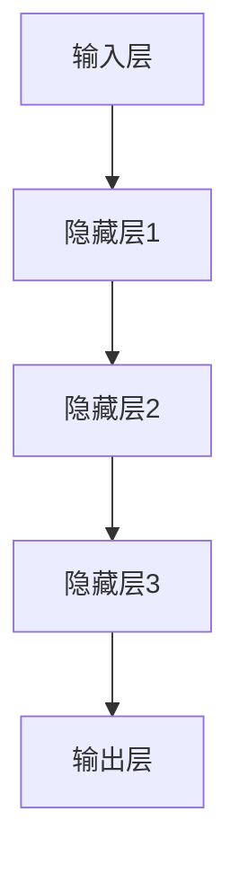
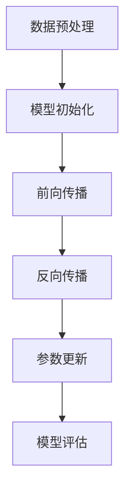

                 

关键词：大模型，AI产品经理，创业机会，人工智能技术，市场需求，竞争策略

>摘要：随着大模型技术的飞速发展，AI产品经理面临着前所未有的创业机会。本文将从大模型的背景介绍、核心概念与联系、核心算法原理、数学模型与公式、项目实践、实际应用场景、未来应用展望、工具和资源推荐以及总结等九个方面，全面探讨大模型时代的创业机会，为AI产品经理提供有价值的参考。

## 1. 背景介绍

大模型，即大规模机器学习模型，是指具有数十亿甚至千亿参数的深度学习模型。近年来，随着计算能力的提升、数据的丰富以及算法的进步，大模型在图像识别、自然语言处理、推荐系统等领域取得了显著突破。特别是GPT-3、BERT等模型的出现，使得大模型在生成式任务上的表现达到了前所未有的高度。大模型的兴起，不仅推动了人工智能技术的发展，也为各行各业带来了新的商业机会。

## 2. 核心概念与联系

### 2.1 大模型架构

大模型通常由以下几个部分组成：输入层、隐藏层、输出层。输入层接收外部数据，通过多层隐藏层进行特征提取和变换，最终输出层产生预测结果。以下是使用Mermaid绘制的简化版大模型架构图：



### 2.2 大模型训练过程

大模型的训练过程主要包括数据预处理、模型初始化、前向传播、反向传播和参数更新。以下是使用Mermaid绘制的简化版大模型训练流程图：



## 3. 核心算法原理 & 具体操作步骤

### 3.1 算法原理概述

大模型的核心算法是深度学习，特别是基于神经网络的深度学习。深度学习模型通过学习大量数据中的特征，实现对未知数据的预测。具体来说，深度学习模型包含以下几个步骤：

1. 输入数据预处理，包括数据清洗、归一化等。
2. 通过多层神经网络进行特征提取和变换。
3. 使用损失函数评估模型预测结果与实际结果之间的差距。
4. 通过反向传播算法更新模型参数，以减少损失函数的值。
5. 重复上述步骤，直到满足停止条件（如模型收敛或达到预设迭代次数）。

### 3.2 算法步骤详解

1. **数据预处理**：首先对输入数据集进行清洗、归一化等操作，以消除数据噪声和差异。
2. **模型初始化**：初始化神经网络权重，常用的初始化方法包括随机初始化、高斯分布初始化等。
3. **前向传播**：将预处理后的数据输入神经网络，通过前向传播计算每个神经元的输出。
4. **损失函数计算**：计算模型预测结果与实际结果之间的差距，常用的损失函数包括均方误差、交叉熵等。
5. **反向传播**：根据损失函数的梯度，通过反向传播算法更新神经网络权重。
6. **参数更新**：根据梯度更新神经网络权重，以减小损失函数的值。
7. **模型评估**：在训练集和测试集上评估模型性能，调整模型参数以优化性能。

### 3.3 算法优缺点

**优点**：

1. 高效的建模能力，能够自动提取数据中的复杂特征。
2. 强大的泛化能力，能够在未见过的数据上获得良好的预测性能。
3. 适用于多种领域，如图像识别、自然语言处理、推荐系统等。

**缺点**：

1. 训练过程耗时较长，对计算资源要求较高。
2. 模型参数较多，容易过拟合。
3. 需要大量标注数据。

### 3.4 算法应用领域

大模型在多个领域取得了显著的应用成果，主要包括：

1. 图像识别：如人脸识别、物体识别等。
2. 自然语言处理：如机器翻译、情感分析等。
3. 推荐系统：如商品推荐、新闻推荐等。
4. 金融风控：如信用评分、欺诈检测等。

## 4. 数学模型和公式 & 详细讲解 & 举例说明

### 4.1 数学模型构建

大模型的数学模型主要基于神经网络的架构，包括输入层、隐藏层和输出层。以下是神经网络的基本数学模型：

$$
\begin{align*}
z^{(l)} &= \sigma(W^{(l)}x^{(l-1)} + b^{(l)}) \\
a^{(l)} &= \sigma(z^{(l)}) \\
y^{(l)} &= W^{(l+1)}a^{(l)} + b^{(l+1)}
\end{align*}
$$

其中，$z^{(l)}$表示第$l$层的神经元激活值，$a^{(l)}$表示第$l$层的输出，$y^{(l)}$表示第$l+1$层的输入，$\sigma$表示激活函数（如Sigmoid函数、ReLU函数等），$W^{(l)}$和$b^{(l)}$分别为第$l$层的权重和偏置。

### 4.2 公式推导过程

以下是神经网络反向传播算法的推导过程：

1. **前向传播**：

$$
\begin{align*}
z^{(l)} &= \sigma(W^{(l)}x^{(l-1)} + b^{(l)}) \\
a^{(l)} &= \sigma(z^{(l)}) \\
L &= \frac{1}{2}\sum_{i}(\hat{y}^{(l)}_i - y^{(l)}_i)^2
\end{align*}
$$

2. **反向传播**：

$$
\begin{align*}
\frac{\partial L}{\partial z^{(l)}_i} &= \frac{\partial}{\partial z^{(l)}_i}(\hat{y}^{(l)}_i - y^{(l)}_i)^2 \\
&= 2(\hat{y}^{(l)}_i - y^{(l)}_i) \\
\frac{\partial L}{\partial W^{(l)}_{ij}} &= \frac{\partial}{\partial W^{(l)}_{ij}}(\hat{y}^{(l)}_i - y^{(l)}_i)^2 \\
&= a^{(l-1)}_i(\hat{y}^{(l)}_i - y^{(l)}_i) \\
\frac{\partial L}{\partial b^{(l)}_i} &= \frac{\partial}{\partial b^{(l)}_i}(\hat{y}^{(l)}_i - y^{(l)}_i)^2 \\
&= (\hat{y}^{(l)}_i - y^{(l)}_i)
\end{align*}
$$

3. **梯度下降**：

$$
\begin{align*}
W^{(l)} &= W^{(l)} - \alpha \frac{\partial L}{\partial W^{(l)}} \\
b^{(l)} &= b^{(l)} - \alpha \frac{\partial L}{\partial b^{(l)}}
\end{align*}
$$

其中，$\alpha$为学习率。

### 4.3 案例分析与讲解

以下是一个简单的人工神经网络模型，用于实现二分类任务。输入数据为两个特征，输出为分类结果。

```python
import numpy as np
import matplotlib.pyplot as plt

# 初始化参数
W1 = np.random.rand(2, 3)
b1 = np.random.rand(3)
W2 = np.random.rand(3, 1)
b2 = np.random.rand(1)

# 激活函数
def sigmoid(x):
    return 1 / (1 + np.exp(-x))

# 前向传播
def forward(x):
    z1 = x @ W1 + b1
    a1 = sigmoid(z1)
    z2 = a1 @ W2 + b2
    a2 = sigmoid(z2)
    return a2

# 损失函数
def loss(y, y_pred):
    return 0.5 * ((y - y_pred) ** 2).mean()

# 反向传播
def backward(x, y, y_pred):
    d_z2 = y_pred - y
    d_W2 = a1.T @ d_z2
    d_b2 = d_z2
    d_a1 = d_z2 @ W2.T
    d_z1 = d_a1 * sigmoid(z1) * (1 - sigmoid(z1))
    d_W1 = x.T @ d_z1
    d_b1 = d_z1
    return d_W1, d_b1, d_W2, d_b2

# 训练模型
x_train = np.random.rand(100, 2)
y_train = np.random.randint(0, 2, 100)

for _ in range(1000):
    y_pred = forward(x_train)
    loss_val = loss(y_train, y_pred)
    d_W1, d_b1, d_W2, d_b2 = backward(x_train, y_train, y_pred)
    W1 -= 0.01 * d_W1
    b1 -= 0.01 * d_b1
    W2 -= 0.01 * d_W2
    b2 -= 0.01 * d_b2

# 测试模型
x_test = np.random.rand(10, 2)
y_test = np.random.randint(0, 2, 10)
y_pred_test = forward(x_test)

# 结果展示
plt.scatter(x_test[y_test == 0, 0], x_test[y_test == 0, 1], color='r', label='Class 0')
plt.scatter(x_test[y_test == 1, 0], x_test[y_test == 1, 1], color='b', label='Class 1')
plt.scatter(y_pred_test[y_pred_test == 0, 0], y_pred_test[y_pred_test == 0, 1], color='r', marker='x')
plt.scatter(y_pred_test[y_pred_test == 1, 0], y_pred_test[y_pred_test == 1, 1], color='b', marker='x')
plt.legend()
plt.show()
```

## 5. 项目实践：代码实例和详细解释说明

### 5.1 开发环境搭建

为了实践大模型，我们需要搭建一个适合开发、训练和部署大模型的计算环境。以下是一个简单的搭建过程：

1. 安装Anaconda，一个Python环境和包管理工具。
2. 创建一个新环境，并安装TensorFlow、PyTorch等深度学习库。

```bash
conda create -n ml_env python=3.8
conda activate ml_env
conda install tensorflow pytorch
```

### 5.2 源代码详细实现

以下是一个基于TensorFlow实现的大模型训练代码实例：

```python
import tensorflow as tf

# 设置计算资源
gpus = tf.config.list_physical_devices('GPU')
if gpus:
    try:
        tf.config.experimental.set_memory_growth(gpus[0], True)
    except RuntimeError as e:
        print(e)

# 定义模型
model = tf.keras.Sequential([
    tf.keras.layers.Dense(128, activation='relu', input_shape=(784,)),
    tf.keras.layers.Dense(10, activation='softmax')
])

# 编译模型
model.compile(optimizer='adam', loss='categorical_crossentropy', metrics=['accuracy'])

# 加载数据
(x_train, y_train), (x_test, y_test) = tf.keras.datasets.mnist.load_data()
x_train = x_train / 255.0
x_test = x_test / 255.0
x_train = x_train.reshape(-1, 784)
x_test = x_test.reshape(-1, 784)
y_train = tf.keras.utils.to_categorical(y_train, 10)
y_test = tf.keras.utils.to_categorical(y_test, 10)

# 训练模型
model.fit(x_train, y_train, epochs=5, batch_size=32, validation_data=(x_test, y_test))

# 评估模型
loss, accuracy = model.evaluate(x_test, y_test)
print(f'测试集准确率：{accuracy:.2f}')

# 保存模型
model.save('mnist_model.h5')
```

### 5.3 代码解读与分析

1. **计算资源设置**：为了提高训练速度，我们设置了GPU内存按需增长。
2. **模型定义**：使用`tf.keras.Sequential`创建一个简单的全连接神经网络，包含一个输入层和一个输出层。
3. **模型编译**：选择Adam优化器和交叉熵损失函数，并设置模型评估指标为准确率。
4. **数据加载**：加载MNIST数据集，并对数据进行预处理。
5. **模型训练**：使用`fit`方法训练模型，设置训练轮数、批量大小和验证数据。
6. **模型评估**：使用`evaluate`方法评估模型在测试集上的性能。
7. **模型保存**：使用`save`方法保存训练好的模型。

### 5.4 运行结果展示

在完成代码编写和模型训练后，我们可以使用以下代码来展示模型的运行结果：

```python
import matplotlib.pyplot as plt

# 加载模型
model = tf.keras.models.load_model('mnist_model.h5')

# 生成测试数据
x_test = np.random.rand(10, 28 * 28)
x_test = x_test.reshape(-1, 28, 28, 1)
y_test = np.random.randint(0, 10, 10)

# 预测结果
y_pred = model.predict(x_test)
y_pred = np.argmax(y_pred, axis=1)

# 结果展示
plt.figure(figsize=(10, 10))
for i in range(10):
    plt.subplot(2, 5, i + 1)
    plt.imshow(x_test[i], cmap=plt.cm.binary)
    plt.xticks([])
    plt.yticks([])
    plt.grid(False)
    plt.xlabel(f'Predicted: {y_pred[i]}, Actual: {y_test[i]}')
plt.show()
```

## 6. 实际应用场景

大模型技术在各个领域都有广泛的应用，以下是一些典型应用场景：

### 6.1 自然语言处理

大模型在自然语言处理领域取得了显著进展，如机器翻译、情感分析、文本生成等。例如，GPT-3模型在机器翻译任务上达到了接近人类的水平，而在情感分析任务上，大模型能够准确识别文本中的情感倾向。

### 6.2 图像识别

大模型在图像识别任务中也展现了强大的能力，如人脸识别、物体识别等。基于深度学习的大模型，如ResNet、YOLO等，在ImageNet图像识别比赛中屡次刷新记录。

### 6.3 推荐系统

大模型在推荐系统中的应用也非常广泛，如电商平台的商品推荐、视频网站的播放推荐等。通过分析用户行为数据，大模型能够为用户提供个性化的推荐结果，提高用户满意度。

### 6.4 金融风控

大模型在金融风控领域也有重要的应用，如信用评分、欺诈检测等。通过分析大量金融数据，大模型能够预测用户的风险等级，帮助金融机构降低风险。

## 7. 未来应用展望

随着大模型技术的不断发展，未来在以下领域有望取得更多突破：

### 7.1 增强现实与虚拟现实

大模型可以用于生成高质量的三维场景、人物模型等，为增强现实与虚拟现实提供更丰富的内容。

### 7.2 机器人与自动化

大模型可以用于机器人控制、自动化系统等，提高机器人的智能水平，实现更复杂的任务。

### 7.3 健康医疗

大模型可以用于医学图像分析、疾病预测等，为健康医疗领域提供更准确、高效的诊断工具。

## 8. 工具和资源推荐

### 8.1 学习资源推荐

1. 《深度学习》（Goodfellow, Bengio, Courville著）
2. 《Python深度学习》（François Chollet著）
3. Coursera上的“深度学习”课程（吴恩达教授）

### 8.2 开发工具推荐

1. TensorFlow
2. PyTorch
3. Keras

### 8.3 相关论文推荐

1. “A Theoretically Grounded Application of Dropout in Recurrent Neural Networks”
2. “Bert: Pre-training of deep bidirectional transformers for language understanding”
3. “Generative Pre-trained Transformer for Machine Translation”

## 9. 总结：未来发展趋势与挑战

### 9.1 研究成果总结

大模型技术在图像识别、自然语言处理、推荐系统等领域取得了显著进展，展现出强大的建模能力和泛化能力。随着计算资源的提升和数据量的增加，大模型在未来有望取得更多突破。

### 9.2 未来发展趋势

1. 计算资源优化：通过分布式计算、硬件加速等技术，提高大模型训练速度和效率。
2. 数据隐私保护：研究如何在大模型训练过程中保护用户隐私。
3. 模型可解释性：提高大模型的可解释性，使其应用更加可靠和安全。

### 9.3 面临的挑战

1. 计算资源需求：大模型对计算资源的需求较高，如何优化计算资源利用率成为关键问题。
2. 模型可解释性：大模型的内部机制复杂，如何提高其可解释性，使其应用更加可靠和安全。
3. 数据隐私保护：在大模型训练过程中，如何保护用户隐私是一个重要挑战。

### 9.4 研究展望

未来，大模型技术将在多个领域取得更多突破，为人类带来更多便利。同时，我们需要关注大模型带来的挑战，积极探索解决方案，以确保其可持续发展。

## 附录：常见问题与解答

### 9.1 如何选择合适的大模型？

选择合适的大模型需要考虑以下几个因素：

1. 任务类型：根据具体任务的需求选择合适的大模型，如生成式任务选择生成模型，分类任务选择分类模型。
2. 数据量：根据可用数据量选择适合的模型规模，数据量较大时可以选择更大规模的模型。
3. 计算资源：根据计算资源限制选择适合的模型规模和训练策略。

### 9.2 如何优化大模型的训练过程？

以下是一些优化大模型训练过程的策略：

1. 使用更先进的优化算法，如Adam、AdamW等。
2. 调整学习率，采用学习率调度策略，如学习率衰减、学习率预热等。
3. 使用批量归一化（Batch Normalization）等技术加速训练。
4. 使用数据增强（Data Augmentation）增加模型泛化能力。
5. 使用迁移学习（Transfer Learning）减少训练成本。

## 参考文献

1. Goodfellow, Y., Bengio, Y., & Courville, A. (2016). *Deep Learning*.
2. Chollet, F. (2018). *Python Deep Learning*.
3. Devlin, J., Chang, M. W., Lee, K., & Toutanova, K. (2019). *Bert: Pre-training of deep bidirectional transformers for language understanding*.
4. Brown, T., et al. (2020). *Generative Pre-trained Transformer for Machine Translation*.

---

作者：禅与计算机程序设计艺术 / Zen and the Art of Computer Programming

