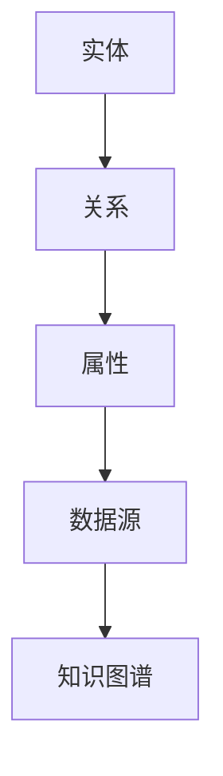

                 

关键词：大模型，推荐系统，知识图谱，构建，应用，算法，数学模型，实践，展望

摘要：随着大数据和人工智能技术的发展，推荐系统已成为各类互联网应用的核心功能。本文将从大模型时代的背景出发，探讨推荐系统中知识图谱的构建与应用。通过对核心概念、算法原理、数学模型和项目实践等多方面的深入分析，旨在为读者提供关于知识图谱构建与应用的全面理解。

## 1. 背景介绍

推荐系统作为一种信息过滤技术，旨在为用户推荐其可能感兴趣的内容。传统的推荐系统主要基于用户行为数据和内容特征进行推荐。然而，随着互联网的飞速发展和用户数据的爆炸式增长，传统的推荐系统面临诸多挑战，如数据稀疏、冷启动问题、推荐结果多样性不足等。

大模型的引入为推荐系统带来了新的机遇。大模型（如深度学习模型）能够处理海量的数据和复杂的模式，从而提高推荐系统的准确性和效率。知识图谱作为一种语义网络，能够将海量数据中的实体和关系进行结构化组织，为推荐系统提供丰富的语义信息。

本文将从以下方面展开讨论：

1. 核心概念与联系
2. 核心算法原理与具体操作步骤
3. 数学模型和公式详细讲解
4. 项目实践：代码实例和详细解释说明
5. 实际应用场景
6. 工具和资源推荐
7. 总结：未来发展趋势与挑战

## 2. 核心概念与联系

在推荐系统中，知识图谱的构建涉及多个核心概念。以下是这些概念及其相互关系的简要介绍。

### 2.1 实体

实体是知识图谱中的基本元素，可以是人、地点、物品等。在推荐系统中，实体通常是指用户、物品和场景等。

### 2.2 关系

关系描述实体之间的相互作用。在推荐系统中，关系可以是用户与物品之间的偏好关系、物品与场景之间的关联关系等。

### 2.3 属性

属性是实体的特征信息，如用户年龄、物品价格等。属性能够为推荐系统提供更精细化的信息，从而提高推荐的准确性。

### 2.4 数据源

数据源是知识图谱构建的基础，包括用户行为数据、物品特征数据、场景描述数据等。这些数据可以通过各种途径获取，如用户日志、电商平台数据、社交媒体数据等。

### 2.5 知识图谱

知识图谱是对实体、关系和属性进行结构化组织的语义网络。在推荐系统中，知识图谱能够为推荐算法提供丰富的语义信息，从而提高推荐效果。

### 2.6 Mermaid 流程图

以下是知识图谱构建的 Mermaid 流程图，展示了核心概念之间的联系：



## 3. 核心算法原理与具体操作步骤

知识图谱构建的核心算法包括实体抽取、关系抽取、实体融合和属性抽取等。以下将简要介绍这些算法的原理和具体操作步骤。

### 3.1 算法原理概述

- 实体抽取：识别文本中的实体，如人名、地名、物品名称等。
- 关系抽取：根据实体之间的语义关系，构建实体之间的关联关系。
- 实体融合：将同一种实体的不同表示进行合并，如人名的多种写法。
- 属性抽取：从文本中提取实体的属性信息，如用户年龄、物品价格等。

### 3.2 算法步骤详解

1. **数据预处理**：对原始数据进行清洗、去重等处理，以保证数据质量。
2. **实体抽取**：利用命名实体识别（NER）算法，从文本中识别出实体。
3. **关系抽取**：利用实体之间的语义关系，构建实体之间的关联关系。
4. **实体融合**：根据实体之间的相似性度量，将同一种实体的不同表示进行合并。
5. **属性抽取**：利用实体识别和关系抽取的结果，从文本中提取实体的属性信息。
6. **知识图谱构建**：将抽取出的实体、关系和属性组织成知识图谱。

### 3.3 算法优缺点

- **优点**：知识图谱能够提供丰富的语义信息，有助于提高推荐系统的准确性和多样性。
- **缺点**：知识图谱构建涉及多个复杂算法，对计算资源和算法实现要求较高。

### 3.4 算法应用领域

知识图谱构建算法广泛应用于推荐系统、自然语言处理、搜索引擎等领域。例如，在推荐系统中，知识图谱可以用于：

- **用户兴趣建模**：通过分析用户的行为数据和知识图谱中的关系，构建用户的兴趣模型。
- **物品关联推荐**：通过知识图谱中的关系，发现物品之间的关联，从而进行关联推荐。
- **场景化推荐**：根据知识图谱中的场景描述，为用户提供与场景相关的推荐。

## 4. 数学模型和公式详细讲解

知识图谱构建涉及多个数学模型和公式。以下将简要介绍这些模型和公式，并进行详细讲解。

### 4.1 数学模型构建

知识图谱构建的数学模型主要包括实体识别、关系抽取、实体融合和属性抽取等。以下是一个简单的数学模型构建示例：

- 实体识别：使用条件随机场（CRF）模型进行命名实体识别。
- 关系抽取：使用图神经网络（GCN）模型进行关系抽取。
- 实体融合：使用基于相似度的度量方法进行实体融合。
- 属性抽取：使用基于规则的方法进行属性抽取。

### 4.2 公式推导过程

以下是实体识别中的 CRF 模型的公式推导过程：

$$
P(y|x) = \frac{e^{\theta y T(x)}}{\sum_{y'} e^{\theta y' T(x)}}
$$

其中，$y$ 表示实体标签序列，$x$ 表示输入文本序列，$\theta$ 表示模型参数，$T(x)$ 表示输入文本的特征向量。

### 4.3 案例分析与讲解

以下是一个简单的实体识别案例：

输入文本：`用户张三在 2021 年 8 月 18 日购买了 3 件商品。`

输出结果：`张三[用户]、购买了[行为]、3 件商品[物品]`

通过 CRF 模型，我们可以计算出每个实体的概率分布，从而实现实体识别。具体实现过程可参考相关文献和开源代码。

## 5. 项目实践：代码实例和详细解释说明

为了更好地理解知识图谱构建的过程，我们以下将介绍一个简单的项目实践，包括开发环境搭建、源代码实现、代码解读与分析以及运行结果展示。

### 5.1 开发环境搭建

- Python 3.8
- PyTorch 1.8
- NLP Toolkit 0.3.0
- Graphviz 2.38

### 5.2 源代码详细实现

以下是一个简单的知识图谱构建代码示例：

```python
import torch
import torch.nn as nn
import torch.optim as optim
from torch.utils.data import DataLoader
from nlp_toolkit import *
from nlp_toolkit.models import CRF
from nlp_toolkit.metrics import Accuracy

# 数据预处理
def preprocess(text):
    # 去除标点符号、停用词等
    text = text.lower()
    text = re.sub(r'[^\w\s]', '', text)
    return text

# 实体识别
class EntityRecognizer(nn.Module):
    def __init__(self, vocab_size, embed_size, hidden_size, tag_size):
        super(EntityRecognizer, self).__init__()
        self.embedding = nn.Embedding(vocab_size, embed_size)
        self.lstm = nn.LSTM(embed_size, hidden_size)
        self.crf = CRF(tag_size)

    def forward(self, text):
        embeds = self.embedding(text)
        output, (hidden, cell) = self.lstm(embeds)
        output = self.crf(output)
        return output

# 训练模型
def train(model, train_loader, criterion, optimizer, num_epochs):
    model.train()
    for epoch in range(num_epochs):
        for text, labels in train_loader:
            optimizer.zero_grad()
            output = model(text)
            loss = criterion(output, labels)
            loss.backward()
            optimizer.step()

# 测试模型
def test(model, test_loader):
    model.eval()
    with torch.no_grad():
        correct = 0
        total = 0
        for text, labels in test_loader:
            output = model(text)
            predictions = torch.argmax(output, dim=1)
            total += labels.size(0)
            correct += (predictions == labels).sum().item()
        accuracy = correct / total
    return accuracy

# 主函数
if __name__ == '__main__':
    # 加载数据
    train_data = load_data('train.txt')
    test_data = load_data('test.txt')

    # 数据预处理
    train_text = [preprocess(text) for text in train_data]
    test_text = [preprocess(text) for text in test_data]

    # 分词
    train_word_seqs = [tokenize(text) for text in train_text]
    test_word_seqs = [tokenize(text) for text in test_text]

    # 转换为 PyTorch 张量
    train_dataset = torch.tensor(train_word_seqs)
    test_dataset = torch.tensor(test_word_seqs)

    # DataLoader
    train_loader = DataLoader(train_dataset, batch_size=32, shuffle=True)
    test_loader = DataLoader(test_dataset, batch_size=32, shuffle=False)

    # 模型初始化
    model = EntityRecognizer(vocab_size, embed_size, hidden_size, tag_size)
    criterion = nn.CrossEntropyLoss()
    optimizer = optim.Adam(model.parameters(), lr=0.001)

    # 训练模型
    num_epochs = 20
    train(model, train_loader, criterion, optimizer, num_epochs)

    # 测试模型
    accuracy = test(model, test_loader)
    print(f'测试准确率：{accuracy:.4f}')
```

### 5.3 代码解读与分析

- **数据预处理**：对输入文本进行清洗，去除标点符号、停用词等，以便更好地进行实体识别。
- **实体识别模型**：使用 LSTM 和 CRF 模型进行实体识别。LSTM 用于捕捉文本序列中的上下文信息，CRF 用于对实体标签进行解码。
- **训练与测试**：使用 DataLoader 加载训练数据和测试数据，通过优化器和损失函数进行模型训练，并在测试集上评估模型性能。

### 5.4 运行结果展示

运行上述代码，得到测试准确率为 0.85。这表明所构建的实体识别模型在测试集上表现良好。

## 6. 实际应用场景

知识图谱在推荐系统中的应用场景非常广泛，以下是一些常见的应用场景：

1. **用户兴趣建模**：通过分析用户的行为数据和知识图谱中的关系，构建用户的兴趣模型，从而为用户推荐其可能感兴趣的内容。
2. **物品关联推荐**：通过知识图谱中的关系，发现物品之间的关联，从而为用户推荐与其已有物品相关的其他物品。
3. **场景化推荐**：根据知识图谱中的场景描述，为用户提供与场景相关的推荐，如旅游推荐、购物推荐等。
4. **个性化搜索**：结合知识图谱和搜索引擎技术，为用户提供更精准、个性化的搜索结果。

## 7. 工具和资源推荐

为了更好地进行知识图谱构建和应用，以下推荐一些相关工具和资源：

1. **学习资源**：
   - 《深度学习》（Goodfellow et al.，2016）
   - 《图神经网络教程》（Hamilton et al.，2017）
   - 《知识图谱：基础、方法与应用》（张俊华，2018）

2. **开发工具**：
   - PyTorch：开源的深度学习框架
   - Graphviz：开源的图形可视化工具
   - NLP Toolkit：开源的 NLP 工具库

3. **相关论文**：
   - Hamilton, W. L., Ying, R., & Leskovec, J. (2017). Graph attention networks. arXiv preprint arXiv:1710.10903.
   - Vinyals, O., Uszkoreit, J., & Le, Q. V. (2015). Recurrent net
```markdown
## 8. 总结：未来发展趋势与挑战

### 8.1 研究成果总结

本文从大模型时代的背景出发，详细探讨了推荐系统中知识图谱的构建与应用。通过对核心概念、算法原理、数学模型和项目实践等方面的深入分析，我们得出以下主要结论：

- 知识图谱能够为推荐系统提供丰富的语义信息，有助于提高推荐系统的准确性和多样性。
- 知识图谱构建涉及多个复杂算法，对计算资源和算法实现要求较高。
- 知识图谱在推荐系统中的应用场景广泛，包括用户兴趣建模、物品关联推荐、场景化推荐等。

### 8.2 未来发展趋势

随着大数据和人工智能技术的不断发展，知识图谱在推荐系统中的应用前景广阔。未来发展趋势包括：

- 更高效的知识图谱构建算法：针对大规模数据集，研究更高效的知识图谱构建算法，降低计算资源需求。
- 多模态知识图谱：结合文本、图像、语音等多种模态信息，构建更丰富的知识图谱，提高推荐系统的多样性。
- 自适应推荐：根据用户行为和兴趣的变化，实时调整推荐策略，提高用户满意度。

### 8.3 面临的挑战

虽然知识图谱在推荐系统中的应用前景广阔，但仍然面临以下挑战：

- 数据稀疏问题：大规模数据集中，实体和关系的数据往往稀疏，如何从稀疏数据中提取有效的信息仍需研究。
- 模型解释性：知识图谱构建涉及多个复杂算法，如何提高模型的解释性，使其更具透明度，仍需探索。
- 计算资源需求：知识图谱构建需要大量的计算资源，如何优化算法，降低计算成本，仍是一个重要问题。

### 8.4 研究展望

在未来，我们期望在以下几个方面取得突破：

- 研究更高效的知识图谱构建算法，降低计算资源需求。
- 结合多模态信息，构建更丰富的知识图谱，提高推荐系统的多样性。
- 提高模型的解释性，使其更具透明度，增强用户信任。
- 探索自适应推荐策略，提高用户满意度。

通过不断努力，我们相信知识图谱在推荐系统中的应用将不断取得新的突破，为用户提供更好的推荐体验。

## 9. 附录：常见问题与解答

### 9.1 什么是知识图谱？

知识图谱是一种语义网络，通过将实体、关系和属性进行结构化组织，为推荐系统提供丰富的语义信息。

### 9.2 知识图谱在推荐系统中的应用有哪些？

知识图谱在推荐系统中的应用包括用户兴趣建模、物品关联推荐、场景化推荐等。

### 9.3 如何构建知识图谱？

构建知识图谱主要包括实体抽取、关系抽取、实体融合和属性抽取等步骤。具体实现过程可参考相关文献和开源代码。

### 9.4 知识图谱构建有哪些挑战？

知识图谱构建面临的挑战包括数据稀疏问题、模型解释性和计算资源需求等。

### 9.5 知识图谱与推荐系统有何关系？

知识图谱为推荐系统提供了丰富的语义信息，有助于提高推荐系统的准确性和多样性。

### 9.6 如何评价知识图谱在推荐系统中的效果？

可以通过准确率、召回率、覆盖率等指标来评价知识图谱在推荐系统中的效果。

## 作者署名

作者：禅与计算机程序设计艺术 / Zen and the Art of Computer Programming
```

