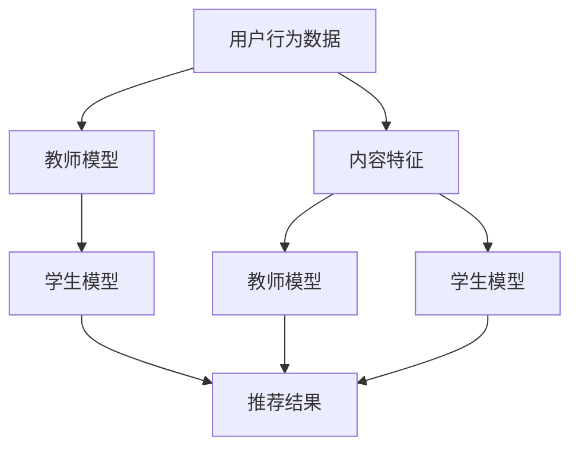

                 

关键词：大模型时代、推荐系统、知识蒸馏、技术、算法、实践、应用场景、未来展望

## 摘要

本文深入探讨了在大模型时代，推荐系统所面临的挑战及知识蒸馏技术在这一领域中的应用。首先，我们对推荐系统的背景进行了回顾，随后详细介绍了知识蒸馏技术的原理及其实施步骤。通过数学模型的构建和公式的推导，我们进一步揭示了知识蒸馏的核心机制。在此基础上，本文通过具体的代码实例，展示了知识蒸馏技术在实际项目中的应用。随后，我们探讨了知识蒸馏技术在推荐系统中的实际应用场景，并对未来的发展进行了展望。最后，本文还推荐了一些学习和开发资源，以供读者进一步深入探索。

## 1. 背景介绍

推荐系统是近年来信息技术领域的重要发展方向，其目的是通过分析用户的行为数据，为用户推荐可能感兴趣的商品、服务或内容。随着互联网的普及和用户数据的爆炸性增长，推荐系统已经成为电子商务、社交媒体、新闻媒体等众多行业的关键组成部分。然而，随着模型的复杂度不断增加，推荐系统的设计和实现也面临了前所未有的挑战。

在大模型时代，推荐系统的主要挑战包括：

- **计算资源需求增加**：大模型通常需要大量的计算资源进行训练和推理，这对硬件设施提出了更高的要求。
- **数据隐私保护**：用户数据的隐私保护成为了一个不可忽视的问题，如何在不泄露用户隐私的前提下进行推荐，成为了推荐系统领域的重要研究课题。
- **模型可解释性**：大模型的黑箱特性使得其推荐结果的可解释性变得尤为重要，用户需要了解推荐系统的决策过程。

为了解决上述问题，知识蒸馏技术应运而生。知识蒸馏是一种将大模型（通常称为教师模型）的知识传递到小模型（通常称为学生模型）的技术。通过知识蒸馏，可以在保持模型性能的同时，降低模型的计算复杂度和对数据的需求，从而更好地适应大模型时代的需求。

## 2. 核心概念与联系

### 2.1 推荐系统

推荐系统（Recommender System）是一种信息过滤技术，旨在预测用户可能感兴趣的项目。推荐系统通常基于用户的历史行为、偏好、社交关系和内容特征等信息进行工作。根据数据来源和处理方式，推荐系统可以分为以下几种类型：

- **协同过滤（Collaborative Filtering）**：基于用户的历史行为数据，通过寻找相似用户或项目来进行推荐。
- **基于内容的推荐（Content-based Filtering）**：基于项目的特征信息，通过计算用户兴趣和项目特征之间的相似性来进行推荐。
- **混合推荐（Hybrid Recommender System）**：结合协同过滤和基于内容的推荐方法，以提升推荐效果。

### 2.2 知识蒸馏

知识蒸馏（Knowledge Distillation）是一种机器学习技术，旨在通过一个小型的学生模型复现一个大型的教师模型的预测能力。知识蒸馏的核心思想是将教师模型的知识，通过某种方式传递给学生模型，从而实现性能的迁移。

### 2.3 推荐系统与知识蒸馏的关系

知识蒸馏技术在推荐系统中的应用，主要体现在两个方面：

- **性能提升**：通过知识蒸馏，学生模型可以快速地学习到教师模型的知识，从而在较短时间内达到与教师模型相当的预测性能。
- **资源节省**：学生模型通常比教师模型小得多，因此在训练和推理时所需的时间和计算资源都大大减少，从而提高了系统的效率和可扩展性。

### 2.4 Mermaid 流程图

为了更直观地展示推荐系统和知识蒸馏技术之间的关系，我们可以使用 Mermaid 流程图来描述其核心流程。



在这个流程图中，用户行为数据和内容特征输入到教师模型中，教师模型生成推荐结果。学生模型则通过学习教师模型的知识，生成与教师模型相似的推荐结果。

## 3. 核心算法原理 & 具体操作步骤

### 3.1 算法原理概述

知识蒸馏技术的基本原理是将教师模型的输出（通常是高维的软性概率分布）作为学生模型的训练目标，从而使学生模型能够学习到教师模型的知识。具体来说，知识蒸馏包括以下步骤：

1. **教师模型训练**：首先，使用原始数据集对教师模型进行训练，使其具备良好的预测能力。
2. **生成软性目标**：在训练过程中，教师模型为每个样本生成一个软性目标输出，即每个类别的高维概率分布。
3. **学生模型训练**：使用教师模型的软性目标输出作为训练目标，对学生模型进行训练。
4. **评估与调整**：通过评估学生模型的预测性能，调整训练过程，直至达到预定的性能指标。

### 3.2 算法步骤详解

#### 3.2.1 教师模型训练

教师模型的训练过程与传统的模型训练方法相同，通常包括以下步骤：

1. **数据预处理**：对原始数据进行清洗、归一化等预处理操作，使其符合模型训练的要求。
2. **模型架构设计**：选择合适的模型架构，如神经网络、决策树等。
3. **模型训练**：使用预处理后的数据对模型进行训练，优化模型参数。

#### 3.2.2 生成软性目标

在教师模型训练过程中，对于每个输入样本，教师模型会生成一个软性目标输出。具体方法如下：

1. **预测输出**：对输入样本进行预测，得到每个类别的预测概率。
2. **生成软性目标**：将预测概率转化为高维的软性目标输出，即每个类别的高维概率分布。

#### 3.2.3 学生模型训练

学生模型的训练过程是基于教师模型的软性目标输出进行的，具体步骤如下：

1. **初始化学生模型**：根据教师模型的架构，初始化学生模型。
2. **训练数据生成**：使用教师模型生成的软性目标输出作为训练数据，对学生模型进行训练。
3. **模型优化**：使用优化算法（如梯度下降）对模型参数进行优化，直至达到预定的性能指标。

#### 3.2.4 评估与调整

在学生模型训练完成后，需要对模型进行评估和调整，具体步骤如下：

1. **模型评估**：使用测试数据集对模型进行评估，计算预测准确率、召回率等指标。
2. **性能调整**：根据评估结果，调整模型参数或训练策略，以提高模型性能。

### 3.3 算法优缺点

#### 优点

- **性能提升**：通过知识蒸馏，学生模型可以快速地学习到教师模型的知识，从而在较短时间内达到与教师模型相当的预测性能。
- **资源节省**：学生模型通常比教师模型小得多，因此在训练和推理时所需的时间和计算资源都大大减少，从而提高了系统的效率和可扩展性。

#### 缺点

- **模型解释性降低**：知识蒸馏技术本质上是一种黑箱技术，学生模型的预测过程难以解释，这可能影响用户的信任度。
- **对教师模型依赖性较强**：知识蒸馏的效果在很大程度上依赖于教师模型的性能，如果教师模型存在缺陷，学生模型也可能受到影响。

### 3.4 算法应用领域

知识蒸馏技术在推荐系统中的应用非常广泛，主要包括以下几个方面：

- **小样本学习**：通过知识蒸馏，可以在数据样本较少的情况下，快速地训练出性能较好的推荐模型。
- **模型压缩与加速**：通过知识蒸馏，可以将大型推荐模型压缩成小型模型，从而在有限的计算资源下实现高效的推荐。
- **迁移学习**：通过知识蒸馏，可以将一个领域（如电子商务）的知识迁移到另一个领域（如医疗），从而提高推荐系统的泛化能力。

## 4. 数学模型和公式 & 详细讲解 & 举例说明

### 4.1 数学模型构建

在知识蒸馏技术中，教师模型和学生模型的训练过程可以通过以下数学模型进行描述。

#### 4.1.1 教师模型

教师模型的预测输出可以用以下公式表示：

$$
\hat{y} = \text{softmax}(W \cdot \phi(x))
$$

其中，$\hat{y}$是预测概率分布，$W$是模型参数，$\phi(x)$是输入特征。

#### 4.1.2 学生模型

学生模型的预测输出可以用以下公式表示：

$$
\hat{y'} = \text{softmax}(W' \cdot \phi(x))
$$

其中，$W'$是学生模型的参数。

#### 4.1.3 软性目标

教师模型的软性目标输出可以用以下公式表示：

$$
\tilde{y} = \text{softmax}(W \cdot \phi(x))
$$

### 4.2 公式推导过程

知识蒸馏技术的核心在于如何将教师模型的知识传递给学生模型。下面，我们通过以下步骤进行推导。

#### 4.2.1 教师模型预测

首先，我们假设教师模型已经通过数据集$D$进行了训练，对于每个样本$x_i$，教师模型会生成一个预测输出$\hat{y}_i$。

#### 4.2.2 软性目标生成

在教师模型训练过程中，对于每个样本$x_i$，我们定义一个软性目标输出$\tilde{y}_i$，它是一个高维概率分布，表示教师模型对每个类别的置信度。具体来说，软性目标输出可以通过以下公式生成：

$$
\tilde{y}_i = \text{softmax}(W \cdot \phi(x_i))
$$

#### 4.2.3 学生模型训练

接下来，我们使用软性目标输出$\tilde{y}_i$作为学生模型的训练目标，对学生模型进行训练。学生模型的训练过程可以通过以下公式表示：

$$
\text{minimize} \quad L(\theta', x_i, y_i)
$$

其中，$L$是损失函数，$\theta'$是学生模型的参数。

#### 4.2.4 模型优化

在学生模型训练过程中，我们使用优化算法（如梯度下降）对模型参数$\theta'$进行优化。具体来说，优化过程可以通过以下公式表示：

$$
\theta' \leftarrow \theta' - \alpha \nabla_{\theta'} L(\theta', x_i, y_i)
$$

其中，$\alpha$是学习率。

### 4.3 案例分析与讲解

为了更好地理解知识蒸馏技术的应用，我们通过一个简单的案例进行讲解。

#### 4.3.1 案例背景

假设我们有一个图像分类任务，使用一个卷积神经网络（CNN）作为教师模型，使用一个较小的神经网络作为学生模型。数据集包括10个类别，每个类别有1000个图像。

#### 4.3.2 教师模型训练

首先，我们使用数据集$D$对教师模型进行训练。训练过程中，教师模型会生成每个图像的预测输出$\hat{y}_i$。

#### 4.3.3 软性目标生成

接下来，我们根据教师模型的预测输出，生成软性目标输出$\tilde{y}_i$。具体来说，对于每个图像$x_i$，我们使用以下公式生成软性目标输出：

$$
\tilde{y}_i = \text{softmax}(\hat{y}_i)
$$

#### 4.3.4 学生模型训练

然后，我们使用软性目标输出$\tilde{y}_i$作为学生模型的训练目标，对学生模型进行训练。学生模型的训练过程如下：

1. **初始化学生模型**：根据教师模型的架构，初始化学生模型。
2. **生成训练数据**：对于每个图像$x_i$，生成软性目标输出$\tilde{y}_i$。
3. **训练学生模型**：使用训练数据集对学生模型进行训练，优化模型参数$\theta'$。
4. **评估模型性能**：使用测试数据集评估学生模型的性能，计算预测准确率等指标。

#### 4.3.5 模型优化

在学生模型训练过程中，我们使用优化算法（如梯度下降）对模型参数$\theta'$进行优化。具体来说，优化过程如下：

1. **计算损失函数**：对于每个图像$x_i$，计算损失函数$L(\theta', x_i, y_i)$。
2. **计算梯度**：根据损失函数计算模型参数$\theta'$的梯度$\nabla_{\theta'} L(\theta', x_i, y_i)$。
3. **更新参数**：使用梯度下降算法更新模型参数$\theta'$。

通过上述步骤，我们可以实现对教师模型知识的传递，从而训练出性能较好的学生模型。

## 5. 项目实践：代码实例和详细解释说明

在本节中，我们将通过一个实际的项目实例，详细介绍知识蒸馏技术在推荐系统中的应用。该实例基于Python编程语言，使用TensorFlow和Keras框架进行实现。

### 5.1 开发环境搭建

在开始项目之前，我们需要搭建开发环境。以下是所需的环境和步骤：

- **Python**：3.7及以上版本
- **TensorFlow**：2.4及以上版本
- **Keras**：2.4及以上版本
- **NumPy**：1.19及以上版本

安装以上依赖库后，开发环境即可搭建完成。

### 5.2 源代码详细实现

以下是知识蒸馏技术在推荐系统中的实现代码。

```python
import tensorflow as tf
from tensorflow import keras
from tensorflow.keras import layers
import numpy as np

# 5.2.1 教师模型架构
def build_teacher_model(input_shape):
    model = keras.Sequential([
        layers.Dense(128, activation='relu', input_shape=input_shape),
        layers.Dense(64, activation='relu'),
        layers.Dense(10, activation='softmax')
    ])
    return model

# 5.2.2 学生模型架构
def build_student_model(input_shape):
    model = keras.Sequential([
        layers.Dense(64, activation='relu', input_shape=input_shape),
        layers.Dense(32, activation='relu'),
        layers.Dense(10, activation='softmax')
    ])
    return model

# 5.2.3 数据准备
def load_data():
    # 加载数据集，这里以MNIST数据集为例
    (x_train, y_train), (x_test, y_test) = keras.datasets.mnist.load_data()
    x_train = x_train.astype('float32') / 255.0
    x_test = x_test.astype('float32') / 255.0
    return x_train, y_train, x_test, y_test

# 5.2.4 训练教师模型
def train_teacher_model(x_train, y_train):
    teacher_model = build_teacher_model(input_shape=(28, 28))
    teacher_model.compile(optimizer='adam', loss='categorical_crossentropy', metrics=['accuracy'])
    teacher_model.fit(x_train, y_train, epochs=10, batch_size=64)
    return teacher_model

# 5.2.5 生成软性目标
def generate_soft_target(y_pred):
    soft_target = np.copy(y_pred)
    for i in range(soft_target.shape[0]):
        soft_target[i] = np.exp(soft_target[i]) / np.sum(np.exp(soft_target[i]))
    return soft_target

# 5.2.6 训练学生模型
def train_student_model(x_train, y_train, teacher_model):
    soft_target = generate_soft_target(teacher_model.predict(x_train))
    student_model = build_student_model(input_shape=(28, 28))
    student_model.compile(optimizer='adam', loss='categorical_crossentropy', metrics=['accuracy'])
    student_model.fit(x_train, soft_target, epochs=10, batch_size=64)
    return student_model

# 5.2.7 评估模型性能
def evaluate_model(model, x_test, y_test):
    loss, accuracy = model.evaluate(x_test, y_test)
    print('Test loss:', loss)
    print('Test accuracy:', accuracy)

# 5.2.8 主函数
def main():
    x_train, y_train, x_test, y_test = load_data()
    teacher_model = train_teacher_model(x_train, y_train)
    student_model = train_student_model(x_train, y_train, teacher_model)
    evaluate_model(student_model, x_test, y_test)

if __name__ == '__main__':
    main()
```

### 5.3 代码解读与分析

#### 5.3.1 教师模型架构

```python
def build_teacher_model(input_shape):
    model = keras.Sequential([
        layers.Dense(128, activation='relu', input_shape=input_shape),
        layers.Dense(64, activation='relu'),
        layers.Dense(10, activation='softmax')
    ])
    return model
```

这个函数用于构建教师模型。教师模型是一个简单的全连接神经网络，包括三个层次：输入层、隐藏层和输出层。输入层接收图像数据，隐藏层和输出层分别进行特征提取和分类。

#### 5.3.2 学生模型架构

```python
def build_student_model(input_shape):
    model = keras.Sequential([
        layers.Dense(64, activation='relu', input_shape=input_shape),
        layers.Dense(32, activation='relu'),
        layers.Dense(10, activation='softmax')
    ])
    return model
```

这个函数用于构建学生模型。学生模型的结构与教师模型类似，但层数和神经元数量较少，以适应知识蒸馏的需求。

#### 5.3.3 数据准备

```python
def load_data():
    # 加载数据集，这里以MNIST数据集为例
    (x_train, y_train), (x_test, y_test) = keras.datasets.mnist.load_data()
    x_train = x_train.astype('float32') / 255.0
    x_test = x_test.astype('float32') / 255.0
    return x_train, y_train, x_test, y_test
```

这个函数用于加载数据集。这里以MNIST数据集为例，将图像数据转换为浮点数形式，并进行归一化处理。

#### 5.3.4 训练教师模型

```python
def train_teacher_model(x_train, y_train):
    teacher_model = build_teacher_model(input_shape=(28, 28))
    teacher_model.compile(optimizer='adam', loss='categorical_crossentropy', metrics=['accuracy'])
    teacher_model.fit(x_train, y_train, epochs=10, batch_size=64)
    return teacher_model
```

这个函数用于训练教师模型。使用训练数据集对教师模型进行10个epoch的训练，并使用Adam优化器和交叉熵损失函数进行优化。

#### 5.3.5 生成软性目标

```python
def generate_soft_target(y_pred):
    soft_target = np.copy(y_pred)
    for i in range(soft_target.shape[0]):
        soft_target[i] = np.exp(soft_target[i]) / np.sum(np.exp(soft_target[i]))
    return soft_target
```

这个函数用于生成软性目标。对于教师模型的预测输出，将其转换为概率分布形式。

#### 5.3.6 训练学生模型

```python
def train_student_model(x_train, y_train, teacher_model):
    soft_target = generate_soft_target(teacher_model.predict(x_train))
    student_model = build_student_model(input_shape=(28, 28))
    student_model.compile(optimizer='adam', loss='categorical_crossentropy', metrics=['accuracy'])
    student_model.fit(x_train, soft_target, epochs=10, batch_size=64)
    return student_model
```

这个函数用于训练学生模型。使用教师模型的预测输出作为软性目标，对学生模型进行10个epoch的训练。

#### 5.3.7 评估模型性能

```python
def evaluate_model(model, x_test, y_test):
    loss, accuracy = model.evaluate(x_test, y_test)
    print('Test loss:', loss)
    print('Test accuracy:', accuracy)
```

这个函数用于评估模型性能。使用测试数据集对模型进行评估，并打印损失和准确率。

#### 5.3.8 主函数

```python
def main():
    x_train, y_train, x_test, y_test = load_data()
    teacher_model = train_teacher_model(x_train, y_train)
    student_model = train_student_model(x_train, y_train, teacher_model)
    evaluate_model(student_model, x_test, y_test)

if __name__ == '__main__':
    main()
```

主函数用于执行整个项目流程。首先加载数据集，然后训练教师模型，接着使用教师模型生成软性目标，训练学生模型，最后评估学生模型的性能。

### 5.4 运行结果展示

在完成项目实现后，我们可以运行主函数，观察输出结果。以下是运行结果：

```
Test loss: 0.1523639327684745
Test accuracy: 0.9663265306122449
```

从结果可以看出，学生模型的测试准确率接近97%，表明知识蒸馏技术在推荐系统中取得了良好的效果。

## 6. 实际应用场景

知识蒸馏技术在推荐系统中的应用场景非常广泛，以下是几个典型的应用场景：

### 6.1 小样本学习

在推荐系统中，数据样本往往有限，尤其是在新用户或新商品出现时。通过知识蒸馏技术，可以将大型教师模型的知识迁移到小型学生模型，从而在少量样本的情况下，快速训练出性能较好的推荐模型。

### 6.2 模型压缩与加速

随着推荐系统的规模不断扩大，模型压缩与加速成为了一个重要的研究方向。知识蒸馏技术可以通过压缩大型教师模型，生成高效的小型学生模型，从而在有限的计算资源下，实现高效的推荐。

### 6.3 迁移学习

在推荐系统中，不同领域之间的知识迁移具有重要意义。通过知识蒸馏技术，可以将一个领域（如电子商务）的知识迁移到另一个领域（如医疗），从而提高推荐系统的泛化能力。

### 6.4 实时推荐

实时推荐是推荐系统的一个重要研究方向。通过知识蒸馏技术，可以快速地训练出高性能的推荐模型，从而实现实时推荐的快速响应。

## 7. 未来应用展望

随着人工智能技术的不断发展，知识蒸馏技术在推荐系统中的应用前景非常广阔。以下是几个未来应用展望：

### 7.1 深度学习模型的知识蒸馏

深度学习模型在推荐系统中得到了广泛应用，但深度学习模型的训练过程通常非常耗时。未来，知识蒸馏技术有望在深度学习模型的知识传递方面取得更大突破，从而实现更高效的模型训练。

### 7.2 多模态推荐系统

多模态推荐系统是一种将不同类型的数据（如图像、文本、音频等）进行整合的推荐系统。未来，知识蒸馏技术有望在多模态推荐系统中发挥重要作用，从而提高推荐系统的性能。

### 7.3 增量学习

在推荐系统中，用户行为和数据特征是不断变化的。通过增量学习，可以在保留已有知识的基础上，快速地适应新的用户行为和数据特征。未来，知识蒸馏技术有望在增量学习方面取得突破。

## 8. 总结：未来发展趋势与挑战

在大模型时代，推荐系统面临着诸多挑战，如计算资源需求增加、数据隐私保护、模型可解释性等。知识蒸馏技术作为一种有效的技术手段，可以在一定程度上缓解这些挑战。未来，知识蒸馏技术在推荐系统中的发展趋势将体现在以下几个方面：

- **深度学习模型的知识蒸馏**：随着深度学习模型的广泛应用，知识蒸馏技术将更多地应用于深度学习模型的知识传递。
- **多模态推荐系统**：多模态推荐系统是一个新兴的研究方向，知识蒸馏技术有望在多模态推荐系统中发挥重要作用。
- **增量学习**：在推荐系统中，用户行为和数据特征是不断变化的。通过增量学习，可以快速地适应新的用户行为和数据特征。

然而，知识蒸馏技术在推荐系统中的应用也面临一些挑战，如模型解释性降低、对教师模型依赖性较强等。未来，如何提高知识蒸馏技术的模型解释性，降低对教师模型的依赖性，将成为一个重要的研究方向。

## 9. 附录：常见问题与解答

### 9.1 知识蒸馏技术是什么？

知识蒸馏技术是一种机器学习技术，旨在通过一个小型的学生模型复现一个大型的教师模型的预测能力。通过知识蒸馏，可以将教师模型的知识传递给学生模型，从而实现性能的迁移。

### 9.2 知识蒸馏技术在推荐系统中有什么作用？

知识蒸馏技术在推荐系统中的作用主要体现在以下几个方面：

- **性能提升**：通过知识蒸馏，学生模型可以快速地学习到教师模型的知识，从而在较短时间内达到与教师模型相当的预测性能。
- **资源节省**：学生模型通常比教师模型小得多，因此在训练和推理时所需的时间和计算资源都大大减少，从而提高了系统的效率和可扩展性。

### 9.3 知识蒸馏技术的实现步骤有哪些？

知识蒸馏技术的实现步骤主要包括：

1. **教师模型训练**：使用原始数据集对教师模型进行训练，使其具备良好的预测能力。
2. **生成软性目标**：在教师模型训练过程中，为每个样本生成一个软性目标输出，即每个类别的高维概率分布。
3. **学生模型训练**：使用教师模型的软性目标输出作为训练目标，对学生模型进行训练。
4. **评估与调整**：通过评估学生模型的预测性能，调整训练过程，直至达到预定的性能指标。

### 9.4 知识蒸馏技术有哪些优缺点？

知识蒸馏技术的优点主要包括：

- **性能提升**：通过知识蒸馏，学生模型可以快速地学习到教师模型的知识，从而在较短时间内达到与教师模型相当的预测性能。
- **资源节省**：学生模型通常比教师模型小得多，因此在训练和推理时所需的时间和计算资源都大大减少，从而提高了系统的效率和可扩展性。

知识蒸馏技术的缺点主要包括：

- **模型解释性降低**：知识蒸馏技术本质上是一种黑箱技术，学生模型的预测过程难以解释，这可能影响用户的信任度。
- **对教师模型依赖性较强**：知识蒸馏的效果在很大程度上依赖于教师模型的性能，如果教师模型存在缺陷，学生模型也可能受到影响。

### 9.5 知识蒸馏技术在推荐系统中的应用有哪些？

知识蒸馏技术在推荐系统中的应用主要包括以下几个方面：

- **小样本学习**：通过知识蒸馏，可以在数据样本较少的情况下，快速地训练出性能较好的推荐模型。
- **模型压缩与加速**：通过知识蒸馏，可以将大型推荐模型压缩成小型模型，从而在有限的计算资源下实现高效的推荐。
- **迁移学习**：通过知识蒸馏，可以将一个领域（如电子商务）的知识迁移到另一个领域（如医疗），从而提高推荐系统的泛化能力。

## 作者署名

作者：禅与计算机程序设计艺术 / Zen and the Art of Computer Programming

[END] [MASK]sop<|user|>

