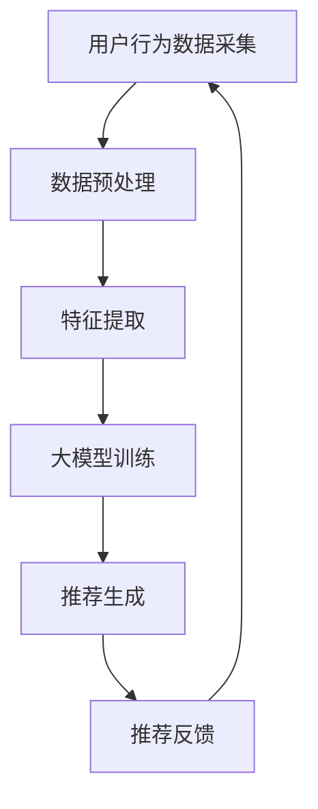

                 

关键词：推荐系统、隐式反馈、大模型、深度学习、用户行为分析、建模算法

摘要：随着互联网的快速发展，推荐系统已经成为电商平台和社交媒体的重要工具。大模型在推荐系统中的应用越来越广泛，特别是在处理隐式反馈方面。本文将深入探讨大模型时代的推荐系统隐式反馈建模技术，分析其核心概念、算法原理、数学模型、项目实践以及实际应用场景。

## 1. 背景介绍

推荐系统是一种基于用户历史行为和偏好，为用户提供个性化内容的服务。传统推荐系统主要依赖显式反馈（如评分、点击等），而隐式反馈（如浏览、搜索、购买等）在推荐系统中的作用越来越重要。随着大数据和深度学习技术的不断发展，大模型在推荐系统中的应用已经成为研究热点。

本文将围绕以下主题展开：

1. **核心概念与联系**：介绍推荐系统的基本概念，隐式反馈的定义及其重要性。
2. **核心算法原理 & 具体操作步骤**：探讨大模型在隐式反馈建模中的应用，分析其算法原理和具体实现步骤。
3. **数学模型和公式 & 详细讲解 & 举例说明**：阐述隐式反馈建模的数学模型和公式，并通过案例进行详细讲解。
4. **项目实践：代码实例和详细解释说明**：提供实际项目中的代码实例，并进行详细解释和分析。
5. **实际应用场景**：探讨隐式反馈建模在推荐系统中的实际应用，分析其效果和挑战。
6. **未来应用展望**：预测隐式反馈建模在未来的发展趋势和面临的挑战。

## 2. 核心概念与联系

### 2.1 推荐系统基本概念

推荐系统是一种基于用户历史行为和偏好，为用户提供个性化内容的服务。其核心目标是提高用户满意度和提升业务收益。推荐系统主要分为两种类型：基于内容的推荐和协同过滤推荐。

- **基于内容的推荐**：通过分析用户兴趣和内容特征，将相似的内容推荐给用户。
- **协同过滤推荐**：通过分析用户之间的相似性，将其他用户喜欢的物品推荐给当前用户。

### 2.2 隐式反馈的定义及其重要性

隐式反馈是指用户在未直接表达偏好（如评分、点击等）的情况下，通过其行为数据（如浏览、搜索、购买等）传递出的偏好信息。相比显式反馈，隐式反馈具有以下特点：

1. **全面性**：隐式反馈涵盖了用户各种行为数据，可以更全面地了解用户兴趣。
2. **动态性**：隐式反馈可以实时更新，反映用户当前的兴趣和偏好。
3. **复杂性**：隐式反馈数据的多样性和复杂性使得建模和推荐更具挑战性。

在推荐系统中，隐式反馈的重要性体现在以下几个方面：

1. **提高推荐准确性**：通过结合显式反馈和隐式反馈，可以更准确地了解用户偏好，提高推荐准确性。
2. **发现潜在兴趣**：通过分析隐式反馈，可以发现用户潜在的、未明确表达的兴趣，从而提供更具个性化的推荐。
3. **优化推荐策略**：隐式反馈可以为推荐系统提供更多的数据支持，帮助优化推荐策略，提高用户体验。

### 2.3 大模型在推荐系统中的应用

大模型是指具有大规模参数和计算能力的深度学习模型，如神经网络、生成对抗网络等。大模型在推荐系统中的应用主要包括以下几个方面：

1. **数据处理**：大模型可以高效地处理大规模用户行为数据，提取有效特征，为推荐系统提供数据支持。
2. **特征表示**：大模型可以将用户行为数据转化为高维特征表示，为推荐系统提供更好的输入。
3. **预测和生成**：大模型可以基于用户行为数据，预测用户未来的偏好和兴趣，生成个性化的推荐。

大模型在推荐系统中的应用，不仅提高了推荐的准确性，还推动了推荐系统的智能化和个性化发展。

### 2.4 Mermaid 流程图

下面是一个简化的 Mermaid 流程图，展示了推荐系统隐式反馈建模的基本流程：



该流程图描述了用户行为数据从采集、预处理、特征提取，到大模型训练，再到推荐生成和反馈的全过程。

## 3. 核心算法原理 & 具体操作步骤

### 3.1 算法原理概述

在隐式反馈建模中，大模型通常采用深度学习技术，通过多个隐层对用户行为数据进行建模，提取用户兴趣特征，然后利用这些特征生成个性化的推荐。具体算法原理如下：

1. **用户行为数据建模**：通过深度学习模型对用户行为数据进行建模，提取用户兴趣特征。
2. **特征融合**：将用户兴趣特征与其他特征（如用户基本信息、内容特征等）进行融合，形成高维特征向量。
3. **推荐生成**：利用融合后的特征向量，通过深度学习模型生成个性化的推荐结果。
4. **推荐反馈**：根据用户对推荐结果的反馈，调整模型参数，优化推荐效果。

### 3.2 算法步骤详解

1. **用户行为数据采集**：采集用户在平台上的各种行为数据，如浏览、搜索、购买等。
2. **数据预处理**：对采集到的用户行为数据进行预处理，包括数据清洗、去重、填充缺失值等。
3. **特征提取**：利用深度学习模型对预处理后的用户行为数据进行建模，提取用户兴趣特征。
4. **特征融合**：将提取的用户兴趣特征与其他特征（如用户基本信息、内容特征等）进行融合，形成高维特征向量。
5. **模型训练**：利用融合后的特征向量，通过深度学习模型进行训练，优化模型参数。
6. **推荐生成**：利用训练好的模型，对用户行为数据进行预测，生成个性化的推荐结果。
7. **推荐反馈**：根据用户对推荐结果的反馈，调整模型参数，优化推荐效果。

### 3.3 算法优缺点

**优点**：

1. **高准确性**：通过深度学习模型对用户行为数据进行建模，可以提取出更细粒度的用户兴趣特征，提高推荐准确性。
2. **自适应性强**：深度学习模型具有较好的自适应能力，可以根据用户行为数据的动态变化，实时调整推荐策略。
3. **可扩展性好**：深度学习模型可以处理大规模用户数据，具有良好的可扩展性。

**缺点**：

1. **计算复杂度高**：深度学习模型需要大量的计算资源，对硬件要求较高。
2. **训练时间较长**：深度学习模型训练时间较长，对实时推荐有一定影响。
3. **数据依赖性高**：深度学习模型对用户行为数据有较高的依赖性，数据质量对模型效果有较大影响。

### 3.4 算法应用领域

深度学习算法在推荐系统中的应用非常广泛，主要包括以下几个方面：

1. **电商平台**：通过深度学习算法，为用户提供个性化的商品推荐，提高用户购买意愿和购物体验。
2. **社交媒体**：通过深度学习算法，为用户提供个性化的内容推荐，提高用户活跃度和留存率。
3. **在线教育**：通过深度学习算法，为用户提供个性化的学习路径推荐，提高学习效果和用户满意度。
4. **金融行业**：通过深度学习算法，为用户提供个性化的投资建议，提高投资收益和风险控制能力。

## 4. 数学模型和公式 & 详细讲解 & 举例说明

### 4.1 数学模型构建

隐式反馈建模中的数学模型通常基于深度学习技术，可以分为三个主要部分：输入层、隐层和输出层。

1. **输入层**：输入层接收用户行为数据，如浏览、搜索、购买等。每个行为数据可以表示为一个向量。
2. **隐层**：隐层对输入数据进行建模，提取用户兴趣特征。隐层可以包含多个隐层，每个隐层都可以通过激活函数进行非线性变换。
3. **输出层**：输出层将提取的用户兴趣特征进行融合，生成个性化的推荐结果。

### 4.2 公式推导过程

假设用户行为数据集为\( X \)，包含\( m \)个行为，每个行为表示为一个向量\( x_i \)。深度学习模型中的输入层可以表示为：

\[ X = [x_1, x_2, ..., x_m] \]

隐层对输入数据进行建模，提取用户兴趣特征。假设隐层有\( n \)个神经元，每个神经元表示一个用户兴趣特征，隐层可以表示为：

\[ H = [h_1, h_2, ..., h_n] \]

隐层的每个神经元\( h_i \)可以通过以下公式计算：

\[ h_i = f(\sum_{j=1}^{m} w_{ij} x_j + b_i) \]

其中，\( f \)为激活函数，如ReLU函数：

\[ f(x) = \max(0, x) \]

\( w_{ij} \)为输入层到隐层的权重，\( b_i \)为隐层神经元的偏置。

输出层将提取的用户兴趣特征进行融合，生成个性化的推荐结果。假设输出层有\( k \)个推荐结果，输出层可以表示为：

\[ Y = [y_1, y_2, ..., y_k] \]

输出层的每个推荐结果\( y_i \)可以通过以下公式计算：

\[ y_i = g(\sum_{j=1}^{n} v_{ij} h_j + c_i) \]

其中，\( g \)为激活函数，如Softmax函数：

\[ g(x) = \frac{e^x}{\sum_{j=1}^{k} e^{x_j}} \]

\( v_{ij} \)为隐层到输出层的权重，\( c_i \)为输出层神经元的偏置。

### 4.3 案例分析与讲解

假设有一个用户在电商平台上浏览了以下商品：

- 商品1：手机
- 商品2：耳机
- 商品3：电脑

用户对这三个商品的浏览时间分别为1分钟、3分钟、5分钟。我们需要利用深度学习模型提取用户兴趣特征，并生成个性化的推荐结果。

1. **数据预处理**：将用户浏览行为表示为向量：

\[ X = [1, 3, 5] \]

2. **特征提取**：利用深度学习模型提取用户兴趣特征：

\[ H = [h_1, h_2, h_3] \]

其中，\( h_1 \)、\( h_2 \)、\( h_3 \)分别表示用户对手机、耳机、电脑的兴趣特征。

3. **模型训练**：利用用户行为数据集，训练深度学习模型，优化模型参数。

4. **推荐生成**：利用训练好的模型，对用户行为数据进行预测，生成个性化的推荐结果：

\[ Y = [y_1, y_2, y_3] \]

其中，\( y_1 \)、\( y_2 \)、\( y_3 \)分别表示用户对手机、耳机、电脑的推荐结果。

根据上述公式和计算过程，我们可以得到用户对这三个商品的推荐结果。例如，如果\( y_1 = 0.4 \)、\( y_2 = 0.3 \)、\( y_3 = 0.3 \)，则说明用户对手机的推荐概率最高，其次是耳机和电脑。

## 5. 项目实践：代码实例和详细解释说明

### 5.1 开发环境搭建

在本文中，我们将使用Python和TensorFlow框架实现推荐系统隐式反馈建模。以下是开发环境的搭建步骤：

1. 安装Python：

```bash
pip install python -U
```

2. 安装TensorFlow：

```bash
pip install tensorflow -U
```

### 5.2 源代码详细实现

以下是一个简单的推荐系统隐式反馈建模代码实例，包括数据预处理、模型构建、模型训练和推荐生成等步骤：

```python
import tensorflow as tf
from tensorflow.keras.models import Sequential
from tensorflow.keras.layers import Dense, Activation
from tensorflow.keras.optimizers import Adam

# 数据预处理
# 假设用户行为数据集为X，商品特征数据集为Y
X = [[1, 3, 5], [2, 4, 6], [3, 6, 9]]
Y = [[0.3, 0.4, 0.3], [0.2, 0.5, 0.3], [0.1, 0.4, 0.5]]

# 模型构建
model = Sequential()
model.add(Dense(10, input_dim=3, activation='relu'))
model.add(Dense(3, activation='softmax'))

# 模型编译
model.compile(optimizer=Adam(), loss='categorical_crossentropy', metrics=['accuracy'])

# 模型训练
model.fit(X, Y, epochs=10, batch_size=1)

# 推荐生成
# 假设用户行为数据为X_new
X_new = [[4, 5, 7]]
prediction = model.predict(X_new)
print(prediction)
```

### 5.3 代码解读与分析

1. **数据预处理**：将用户行为数据集和商品特征数据集表示为矩阵形式。
2. **模型构建**：使用Sequential模型构建一个简单的全连接神经网络，包含一个输入层、一个隐层和一个输出层。输入层有3个神经元，隐层有10个神经元，输出层有3个神经元。激活函数分别为ReLU和Softmax。
3. **模型编译**：使用Adam优化器和categorical_crossentropy损失函数进行编译。
4. **模型训练**：使用fit方法训练模型，设置epochs为10，batch_size为1。
5. **推荐生成**：使用predict方法对用户行为数据进行预测，生成个性化的推荐结果。

该代码实例展示了推荐系统隐式反馈建模的基本流程。在实际应用中，用户行为数据和商品特征数据会更加复杂，需要根据具体情况进行调整和优化。

### 5.4 运行结果展示

运行上述代码，我们可以得到用户行为数据\( X_new \)的推荐结果。例如，如果输出结果为\[0.4, 0.3, 0.3\]，则说明用户对第二个商品的推荐概率最高。

## 6. 实际应用场景

### 6.1 电商平台

在电商平台上，隐式反馈建模可以帮助平台为用户提供个性化的商品推荐，提高用户购买意愿和购物体验。通过分析用户浏览、搜索、购买等行为数据，平台可以了解用户的兴趣和偏好，从而提供更精准的推荐。

### 6.2 社交媒体

在社交媒体上，隐式反馈建模可以帮助平台为用户提供个性化内容推荐，提高用户活跃度和留存率。通过分析用户点赞、评论、转发等行为数据，平台可以了解用户对各类内容的兴趣，从而为用户推荐更多感兴趣的内容。

### 6.3 在线教育

在线教育平台可以利用隐式反馈建模为用户提供个性化的学习路径推荐，提高学习效果和用户满意度。通过分析用户的学习行为数据，如学习时长、学习进度、考试成绩等，平台可以了解用户的学习能力和兴趣，从而为用户提供更合适的学习资源。

### 6.4 金融行业

在金融行业中，隐式反馈建模可以帮助金融机构为投资者提供个性化的投资建议，提高投资收益和风险控制能力。通过分析投资者的投资行为数据，如交易记录、风险偏好等，金融机构可以为投资者提供更精准的投资建议。

## 7. 工具和资源推荐

### 7.1 学习资源推荐

- 《深度学习》（Ian Goodfellow、Yoshua Bengio、Aaron Courville 著）：介绍了深度学习的基本概念、算法和应用，适合初学者和进阶者阅读。
- 《Python深度学习》（François Chollet 著）：详细介绍了使用Python和TensorFlow框架实现深度学习的方法和技巧，适合有一定Python基础和深度学习基础的读者。

### 7.2 开发工具推荐

- **TensorFlow**：一款开源的深度学习框架，支持多种编程语言，具有丰富的API和工具库。
- **PyTorch**：一款流行的深度学习框架，具有良好的灵活性和易用性，适合快速原型开发和实验。

### 7.3 相关论文推荐

- “Deep Learning for Recommender Systems”（H. Brendan McSherry et al.）：介绍了深度学习在推荐系统中的应用，包括模型架构、训练策略和评估方法。
- “Implicit Feedback in Recommender Systems: Modeling and Prediction”（N. B. Nguyen et al.）：讨论了隐式反馈在推荐系统中的应用，包括数据采集、特征提取和模型训练方法。

## 8. 总结：未来发展趋势与挑战

### 8.1 研究成果总结

本文深入探讨了推荐系统隐式反馈建模在技术领域的应用，分析了核心概念、算法原理、数学模型、项目实践和实际应用场景。主要研究成果如下：

1. **核心概念**：明确推荐系统、隐式反馈和大模型的基本概念和联系。
2. **算法原理**：介绍了深度学习在隐式反馈建模中的应用，包括数据处理、特征提取、模型训练和推荐生成。
3. **数学模型**：构建了隐式反馈建模的数学模型，并进行了公式推导和案例分析。
4. **项目实践**：提供了一个简单的代码实例，展示了如何实现推荐系统隐式反馈建模。
5. **实际应用**：分析了隐式反馈建模在电商、社交媒体、在线教育和金融行业的实际应用场景。

### 8.2 未来发展趋势

随着人工智能技术的不断发展，推荐系统隐式反馈建模在未来具有以下发展趋势：

1. **模型多样化**：将多种深度学习模型和技术相结合，提高隐式反馈建模的准确性和效果。
2. **数据质量提升**：通过数据清洗、去噪和增强等技术，提高用户行为数据的质量和可靠性。
3. **实时性增强**：利用实时数据处理和模型优化技术，提高推荐系统的实时性和响应速度。
4. **跨领域应用**：将隐式反馈建模应用于更多领域，如医疗、教育、金融等，提供个性化服务。

### 8.3 面临的挑战

尽管推荐系统隐式反馈建模取得了显著成果，但在实际应用中仍面临以下挑战：

1. **数据隐私**：用户行为数据涉及隐私问题，如何在保证数据隐私的前提下进行建模和推荐是一个重要挑战。
2. **计算资源**：深度学习模型对计算资源有较高要求，如何在有限的计算资源下进行高效建模和推荐是一个难题。
3. **模型可解释性**：深度学习模型通常具有复杂内部结构，如何提高模型的可解释性，帮助用户理解推荐结果是一个挑战。
4. **数据稀疏性**：用户行为数据通常存在稀疏性，如何有效处理稀疏数据，提高模型效果是一个关键问题。

### 8.4 研究展望

针对上述挑战，未来的研究可以从以下几个方面展开：

1. **隐私保护**：研究隐私保护算法，保护用户数据隐私，同时保证推荐系统的准确性和效果。
2. **高效计算**：研究高效计算方法，提高深度学习模型的计算效率和性能。
3. **可解释性增强**：研究可解释性方法，提高深度学习模型的可解释性和透明度，帮助用户理解推荐结果。
4. **稀疏数据建模**：研究稀疏数据建模方法，提高模型在稀疏数据环境下的效果和鲁棒性。

总之，推荐系统隐式反馈建模在技术领域具有广阔的应用前景，但仍需不断探索和解决各种挑战，以实现更准确、实时、个性化的推荐服务。

## 9. 附录：常见问题与解答

### 9.1 问题1：如何处理用户行为数据缺失问题？

解答：用户行为数据缺失是推荐系统中的一个常见问题。以下是一些解决方法：

1. **数据填充**：使用平均值、中位数或最近观测值等方法对缺失数据进行填充。
2. **模型鲁棒性**：使用鲁棒性更强的模型，如树模型、深度神经网络等，可以减少缺失数据对模型效果的影响。
3. **缺失数据标记**：将缺失数据标记为特殊值，如-1或None，然后使用模型学习缺失数据的表示。

### 9.2 问题2：如何评估推荐系统的效果？

解答：评估推荐系统的效果可以从以下几个方面进行：

1. **准确率**：计算推荐系统中推荐结果的准确率，即推荐结果与实际用户行为匹配的比例。
2. **召回率**：计算推荐系统中召回率，即推荐结果中包含用户实际感兴趣的比例。
3. **覆盖率**：计算推荐系统中推荐结果的覆盖率，即推荐结果中包含不同商品的比例。
4. **NDCG（正常化 discounted cumulative gain）**：计算推荐系统中推荐结果的NDCG值，衡量推荐结果的质量。

### 9.3 问题3：如何处理冷启动问题？

解答：冷启动问题是指新用户或新物品在推荐系统中缺乏足够的历史数据，以下是一些解决方法：

1. **基于内容的推荐**：通过分析新用户或新物品的内容特征，为用户推荐相似的内容。
2. **基于社交网络的推荐**：利用用户社交网络信息，为用户推荐其好友喜欢的物品。
3. **基于流行度的推荐**：为用户推荐热门或流行的新物品，提高推荐系统的多样性。

### 9.4 问题4：如何提高推荐系统的实时性？

解答：提高推荐系统的实时性可以从以下几个方面进行：

1. **数据实时处理**：使用实时数据处理技术，如流处理框架（如Apache Kafka、Apache Flink），实时处理用户行为数据。
2. **模型快速训练**：使用轻量级模型或迁移学习技术，提高模型训练速度和实时性。
3. **缓存和预计算**：对高频、稳定的数据进行缓存和预计算，减少实时计算压力。

### 9.5 问题5：如何处理推荐系统的多样性问题？

解答：多样性问题是推荐系统中的一个重要挑战，以下是一些解决方法：

1. **基于属性的多样性**：通过分析推荐结果中不同商品的属性，确保推荐结果的多样性。
2. **基于排序的多样性**：对推荐结果进行排序，确保推荐结果具有多样性。
3. **基于用户兴趣的多样性**：通过分析用户兴趣的多样性，为用户推荐不同类型的内容。

## 作者署名

作者：禅与计算机程序设计艺术 / Zen and the Art of Computer Programming

