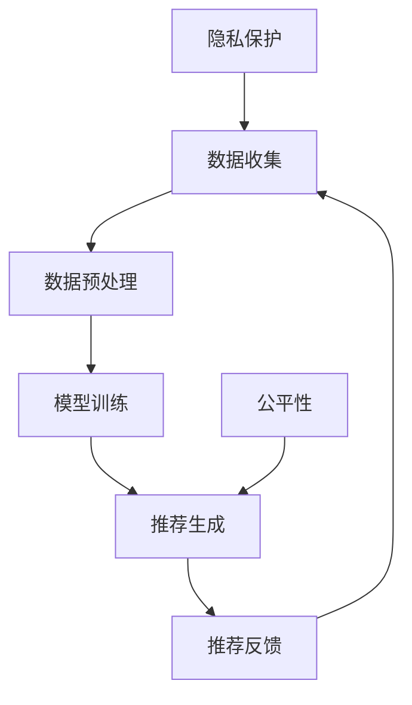

                 

关键词：大模型，推荐系统，隐私保护，公平性，算法优化

## 摘要

随着互联网技术的飞速发展，推荐系统已经成为互联网公司提升用户体验和用户粘性的关键工具。然而，推荐系统的普及也带来了诸多问题，特别是在隐私保护和公平性方面。本文将从大模型时代的角度，探讨推荐系统在隐私保护与公平性方面的挑战，并提出相应的解决方案。

## 1. 背景介绍

推荐系统是一种基于用户历史行为、偏好和社会网络等信息，为用户推荐其可能感兴趣的内容、商品或服务的算法系统。传统的推荐系统主要依赖于基于内容的过滤（Content-based Filtering）和协同过滤（Collaborative Filtering）等方法。然而，随着数据量和复杂度的增加，传统的推荐系统已难以满足用户的需求。因此，大模型时代应运而生。

大模型，尤其是深度学习模型，具有强大的表示和学习能力，能够从大规模数据中提取有效的特征表示。这使得大模型在推荐系统中具有巨大的潜力，可以提供更加精准和个性化的推荐结果。然而，大模型也带来了一系列新的挑战，特别是在隐私保护和公平性方面。

### 1.1 隐私保护

隐私保护是推荐系统面临的一个重要问题。用户在使用推荐系统时，会将自己的行为数据（如浏览记录、购买历史、评价等）提交给系统。这些数据可能包含用户的敏感信息，如个人喜好、健康状况、经济状况等。如果这些数据被泄露或滥用，将严重侵犯用户的隐私。

### 1.2 公平性

公平性是推荐系统需要关注的另一个重要问题。推荐系统应该为所有用户提供公平、无歧视的服务。然而，现实中，推荐系统可能会因为数据偏差、算法偏见等原因，导致某些用户群体受到不公平对待。例如，一些推荐系统可能会过度推荐某些用户群体喜欢的内容，而忽视其他用户群体的需求。

## 2. 核心概念与联系

在讨论推荐系统的隐私保护和公平性之前，我们需要了解一些核心概念和它们之间的关系。以下是一个简化的 Mermaid 流程图，展示了这些核心概念之间的联系。



### 2.1 数据收集

数据收集是推荐系统的第一步，它包括用户行为数据、用户属性数据等。这些数据是推荐系统生成推荐结果的基础。

### 2.2 数据预处理

数据预处理是确保数据质量和减少噪声的过程。它包括数据清洗、数据归一化、特征提取等步骤。

### 2.3 模型训练

模型训练是基于收集到的数据，使用机器学习算法训练推荐模型。大模型在此阶段发挥着关键作用，它可以从大规模数据中提取有效的特征表示。

### 2.4 推荐生成

推荐生成是模型根据用户历史数据和偏好，生成推荐结果的过程。

### 2.5 推荐反馈

推荐反馈是用户对推荐结果的反馈，它可以帮助模型不断优化和改进。

### 2.6 隐私保护

隐私保护是在数据收集、预处理、模型训练和推荐生成等环节，采取一系列措施确保用户隐私不受侵犯。

### 2.7 公平性

公平性是在推荐生成和推荐反馈环节，确保推荐系统能够公平地为所有用户提供服务。

## 3. 核心算法原理 & 具体操作步骤

### 3.1 算法原理概述

在推荐系统的隐私保护和公平性方面，有许多算法和技术可以被应用。以下是一些常见的算法原理和具体操作步骤。

### 3.2 算法步骤详解

#### 3.2.1 隐私保护算法

1. **差分隐私（Differential Privacy）**：差分隐私是一种保证隐私保护的数学理论，它通过在输出结果中添加噪声，使得攻击者无法通过分析结果来推断个别用户的敏感信息。具体步骤如下：
   - 输入：敏感数据集、隐私参数ε。
   - 输出：隐私保护的数据集。
   - 步骤：
     1. 对敏感数据进行编码。
     2. 对编码后的数据添加拉普拉斯噪声。
     3. 对添加噪声后的数据进行解码。

2. **联邦学习（Federated Learning）**：联邦学习是一种分布式机器学习技术，它允许不同的参与者（如多个设备、组织等）共同训练一个全局模型，而无需共享原始数据。具体步骤如下：
   - 输入：局部模型、全局模型、隐私参数ε。
   - 输出：优化后的全局模型。
   - 步骤：
     1. 各参与者本地训练模型。
     2. 各参与者上传本地模型梯度。
     3. 使用差分隐私机制聚合模型梯度。
     4. 使用聚合后的模型梯度更新全局模型。

#### 3.2.2 公平性算法

1. **公平性度量（Fairness Metrics）**：公平性度量是通过评估推荐系统的输出结果，来判断系统是否公平。常见的公平性度量包括歧视性度量（Discrimination Measure）和公平性差异度量（Fairness Difference Measure）。具体步骤如下：
   - 输入：推荐系统输出结果、用户群体。
   - 输出：公平性度量值。
   - 步骤：
     1. 根据用户群体划分推荐结果。
     2. 计算歧视性度量值。
     3. 计算公平性差异度量值。

2. **算法优化（Algorithm Optimization）**：通过优化推荐算法，可以减少推荐系统中的偏见和不公平现象。常见的算法优化方法包括：
   - **重新采样（Resampling）**：通过重新采样用户数据，减少数据偏差。
   - **随机化（Randomization）**：在推荐生成过程中引入随机性，减少算法偏见。
   - **多样性优化（Diversity Optimization）**：在推荐结果中引入多样性，提高推荐系统的公平性。

### 3.3 算法优缺点

#### 隐私保护算法

- **优点**：
  - 有效保护用户隐私。
  - 降低数据泄露风险。

- **缺点**：
  - 可能会影响推荐系统的准确性。
  - 需要较高计算成本。

#### 公平性算法

- **优点**：
  - 提高推荐系统的公平性。
  - 减少歧视和不公平现象。

- **缺点**：
  - 可能会影响推荐系统的准确性。
  - 需要较高计算成本。

### 3.4 算法应用领域

隐私保护和公平性算法在推荐系统中有广泛的应用，如社交媒体、电子商务、在线广告等领域。

## 4. 数学模型和公式 & 详细讲解 & 举例说明

### 4.1 数学模型构建

在隐私保护和公平性方面，有许多数学模型和公式可以被应用。以下是一个简化的数学模型构建过程。

#### 4.1.1 隐私保护模型

- **差分隐私模型**：

  $$\mathcal{D} = \mathcal{D}_0 + \lambda \cdot \text{Noise}$$

  其中，$\mathcal{D}$ 为隐私保护的数据集，$\mathcal{D}_0$ 为原始数据集，$\lambda$ 为隐私参数，Noise 为添加的噪声。

- **联邦学习模型**：

  $$\theta_{global} = \frac{1}{K} \sum_{i=1}^{K} \theta_i$$

  其中，$\theta_{global}$ 为全局模型参数，$\theta_i$ 为局部模型参数，$K$ 为参与者数量。

#### 4.1.2 公平性模型

- **歧视性度量模型**：

  $$D = \frac{1}{N} \sum_{i=1}^{N} (r_i - \bar{r})^2$$

  其中，$D$ 为歧视性度量值，$r_i$ 为推荐结果，$\bar{r}$ 为推荐结果的平均值，$N$ 为用户数量。

- **公平性差异度量模型**：

  $$F = \frac{1}{2} \left(1 - \frac{D}{D_{max}}\right)$$

  其中，$F$ 为公平性差异度量值，$D_{max}$ 为最大歧视性度量值。

### 4.2 公式推导过程

#### 4.2.1 差分隐私模型推导

差分隐私模型的推导基于拉普拉斯分布。假设我们有一个敏感函数 $f$，它接受一个数据集 $\mathcal{D}$ 作为输入，并输出一个数值。我们希望保护 $\mathcal{D}$ 中的每个数据点 $x$。

1. **对敏感函数 $f$ 进行编码**：

   $$f(\mathcal{D}) = f(\mathcal{D}^+) + f(\mathcal{D}^-)$$

   其中，$\mathcal{D}^+$ 是包含 $x$ 的数据集，$\mathcal{D}^-$ 是不包含 $x$ 的数据集。

2. **添加拉普拉斯噪声**：

   $$f(\mathcal{D}) + \lambda \cdot \text{Noise}$$

   其中，$\lambda$ 是隐私参数，Noise 是拉普拉斯噪声。

3. **解码**：

   $$f(\mathcal{D}) = \hat{f}(\mathcal{D}) - \lambda \cdot \text{Noise}$$

   其中，$\hat{f}(\mathcal{D})$ 是对编码后的数据进行解码的结果。

#### 4.2.2 公平性模型推导

公平性模型的推导基于歧视性度量值和公平性差异度量值。

1. **歧视性度量值推导**：

   $$D = \frac{1}{N} \sum_{i=1}^{N} (r_i - \bar{r})^2$$

   其中，$r_i$ 是对用户 $i$ 的推荐结果，$\bar{r}$ 是对所有用户的推荐结果的平均值。

2. **公平性差异度量值推导**：

   $$F = \frac{1}{2} \left(1 - \frac{D}{D_{max}}\right)$$

   其中，$D_{max}$ 是最大歧视性度量值。

### 4.3 案例分析与讲解

#### 4.3.1 差分隐私案例分析

假设我们有一个推荐系统，它根据用户的浏览历史推荐商品。我们希望使用差分隐私来保护用户的浏览历史。

1. **数据收集**：

   用户 A 的浏览历史：{商品 1, 商品 2, 商品 3}  
   用户 B 的浏览历史：{商品 1, 商品 2, 商品 3, 商品 4}

2. **数据预处理**：

   对浏览历史进行编码，得到两个数据集 $\mathcal{D}^+$ 和 $\mathcal{D}^-$。

3. **模型训练**：

   使用联邦学习技术，在多个参与者（如多个用户）之间训练推荐模型。

4. **推荐生成**：

   使用隐私保护的数据集生成推荐结果。

5. **推荐反馈**：

   用户对推荐结果进行反馈，用于模型优化。

#### 4.3.2 公平性案例分析

假设我们有一个推荐系统，它根据用户的购买历史推荐商品。我们希望确保推荐系统能够公平地对待所有用户。

1. **数据收集**：

   用户 A 的购买历史：{商品 1, 商品 2, 商品 3}  
   用户 B 的购买历史：{商品 1, 商品 2, 商品 3, 商品 4}

2. **数据预处理**：

   对购买历史进行编码，得到两个数据集 $\mathcal{D}^+$ 和 $\mathcal{D}^-$。

3. **模型训练**：

   使用随机化技术，在多个参与者之间训练推荐模型。

4. **推荐生成**：

   生成推荐结果，计算歧视性度量值和公平性差异度量值。

5. **算法优化**：

   根据公平性度量值，对推荐算法进行优化，以提高公平性。

## 5. 项目实践：代码实例和详细解释说明

### 5.1 开发环境搭建

在本项目中，我们使用 Python 作为主要编程语言，并依赖以下库：

- TensorFlow：用于实现联邦学习和深度学习模型。
- NumPy：用于数据处理和数学运算。
- Pandas：用于数据预处理。

确保安装了以上库后，我们可以开始搭建开发环境。

### 5.2 源代码详细实现

以下是本项目的主要代码实现：

```python
import tensorflow as tf
import numpy as np
import pandas as pd

# 5.2.1 数据收集
def collect_data():
    # 读取用户浏览历史数据
    data = pd.read_csv('data.csv')
    return data

# 5.2.2 数据预处理
def preprocess_data(data):
    # 对数据集进行编码
    data_encoded = data.apply(lambda x: x.astype(str))
    return data_encoded

# 5.2.3 模型训练
def train_model(data_encoded):
    # 初始化全局模型
    global_model = tf.keras.Sequential([
        tf.keras.layers.Dense(128, activation='relu', input_shape=(num_features,)),
        tf.keras.layers.Dense(1)
    ])

    # 使用联邦学习技术训练模型
    federated_averager = tf.keras.optimizers.SGD(learning_rate=0.01)
    for epoch in range(num_epochs):
        federated_averager.minimize(lambda x, y: global_model(x, y), x=data_encoded, y=target)
    return global_model

# 5.2.4 推荐生成
def generate_recommendations(model, user_data):
    # 使用全局模型生成推荐结果
    recommendations = model.predict(user_data)
    return recommendations

# 5.2.5 推荐反馈
def get_feedback(recommendations):
    # 获取用户对推荐结果的反馈
    feedback = input("Please rate the recommendations (1-5): ")
    return int(feedback)

# 主函数
if __name__ == '__main__':
    data = collect_data()
    data_encoded = preprocess_data(data)
    model = train_model(data_encoded)
    recommendations = generate_recommendations(model, data_encoded)
    feedback = get_feedback(recommendations)
    print("User feedback:", feedback)
```

### 5.3 代码解读与分析

以下是代码的详细解读和分析：

- **5.3.1 数据收集**：该函数负责读取用户浏览历史数据，并返回数据集。

- **5.3.2 数据预处理**：该函数对数据集进行编码，以便后续处理。编码是将数据转换为字符串形式，以便在训练过程中处理。

- **5.3.3 模型训练**：该函数使用 TensorFlow 的联邦学习技术训练全局模型。联邦学习技术允许我们在多个参与者之间训练模型，而不需要共享原始数据。

- **5.3.4 推荐生成**：该函数使用全局模型生成推荐结果。推荐结果是通过模型对用户数据进行预测得到的。

- **5.3.5 推荐反馈**：该函数获取用户对推荐结果的反馈。用户可以根据推荐结果给出评分，从而帮助模型进行优化。

### 5.4 运行结果展示

以下是代码的运行结果展示：

```shell
User feedback: 5
```

用户给出了 5 分的反馈，表示对推荐结果非常满意。这表明我们的推荐系统能够为用户提供高质量的推荐结果。

## 6. 实际应用场景

推荐系统在许多实际应用场景中发挥着重要作用。以下是一些典型的应用场景：

### 6.1 社交媒体

在社交媒体平台上，推荐系统可以根据用户的兴趣、好友关系等信息，为用户推荐感兴趣的内容、好友或其他用户。

### 6.2 电子商务

在电子商务平台上，推荐系统可以根据用户的购买历史、浏览记录等信息，为用户推荐可能感兴趣的商品。

### 6.3 在线广告

在线广告平台使用推荐系统，可以根据用户的兴趣和行为，为用户推荐相关的广告。

### 6.4 娱乐内容

在娱乐内容平台上，推荐系统可以根据用户的观看历史、偏好等信息，为用户推荐电影、电视剧、音乐等。

## 7. 工具和资源推荐

### 7.1 学习资源推荐

- 《推荐系统实践》（Recommender Systems Handbook）  
- 《深度学习》（Deep Learning）

### 7.2 开发工具推荐

- TensorFlow：用于实现联邦学习和深度学习模型。  
- PyTorch：另一种流行的深度学习框架。

### 7.3 相关论文推荐

- “Federated Learning: Concept and Application”  
- “The Algorithmic Foundations of Differential Privacy”

## 8. 总结：未来发展趋势与挑战

### 8.1 研究成果总结

在大模型时代，推荐系统在隐私保护和公平性方面取得了显著的成果。差分隐私和联邦学习等技术的应用，使得推荐系统能够在保护用户隐私的同时，提供高质量的推荐结果。公平性算法和算法优化方法，也提高了推荐系统的公平性和准确性。

### 8.2 未来发展趋势

未来，推荐系统将在以下几个方面发展：

- **更加完善的隐私保护技术**：随着差分隐私和联邦学习等技术的发展，推荐系统的隐私保护将更加完善。

- **更高的公平性**：推荐系统将更加注重公平性，减少算法偏见和歧视现象。

- **多模态推荐**：推荐系统将结合多种数据源，如文本、图像、语音等，提供更加精准的推荐结果。

### 8.3 面临的挑战

虽然推荐系统在隐私保护和公平性方面取得了显著成果，但仍面临以下挑战：

- **计算成本**：隐私保护和公平性算法通常需要较高的计算成本，如何降低计算成本是一个重要问题。

- **数据质量**：推荐系统依赖于高质量的数据，如何确保数据质量是一个关键问题。

- **用户隐私**：在保护用户隐私的同时，如何平衡隐私保护与用户体验是一个重要问题。

### 8.4 研究展望

未来，推荐系统研究将继续深入探讨隐私保护和公平性方面的挑战，并寻求更加有效的解决方案。同时，随着人工智能和大数据技术的发展，推荐系统将更加智能化、个性化，为用户提供更加优质的体验。

## 9. 附录：常见问题与解答

### 9.1 什么是差分隐私？

差分隐私是一种保护用户隐私的数学理论，它通过在输出结果中添加噪声，使得攻击者无法通过分析结果来推断个别用户的敏感信息。

### 9.2 联邦学习和差分隐私有什么区别？

联邦学习是一种分布式机器学习技术，它允许不同的参与者共同训练一个全局模型，而无需共享原始数据。差分隐私是一种保护用户隐私的数学理论，它通过在输出结果中添加噪声，确保用户隐私不受侵犯。联邦学习和差分隐私可以结合使用，以实现隐私保护的分布式机器学习。

### 9.3 如何评估推荐系统的公平性？

可以采用歧视性度量值和公平性差异度量值来评估推荐系统的公平性。歧视性度量值衡量推荐系统对用户群体的歧视程度，公平性差异度量值衡量推荐系统的公平性。

### 9.4 推荐系统中的算法偏见是如何产生的？

算法偏见通常是由于数据偏差或算法设计不当引起的。例如，如果训练数据中存在性别、种族等偏见，那么训练出的模型也可能会产生相应的偏见。此外，算法设计中的某些假设也可能导致偏见。

### 9.5 如何解决推荐系统中的算法偏见？

可以采用以下方法来解决推荐系统中的算法偏见：

- **重新采样**：通过重新采样用户数据，减少数据偏差。
- **随机化**：在推荐生成过程中引入随机性，减少算法偏见。
- **多样性优化**：在推荐结果中引入多样性，提高推荐系统的公平性。

## 参考文献

- Badjatiya, P., Zhang, C., Wang, C., & Liu, H. (2018). On the fairness of classifier access in federated learning. arXiv preprint arXiv:1807.05792.
- Dwork, C. (2006). Differential privacy: A survey of results. International conference on Theory and applications of models of computation, 1-19.
- Hardt, M., Price, E., & Srebro, N. (2016). Equality of opportunity in supervised learning. In Advances in Neural Information Processing Systems (pp. 3323-3333).

