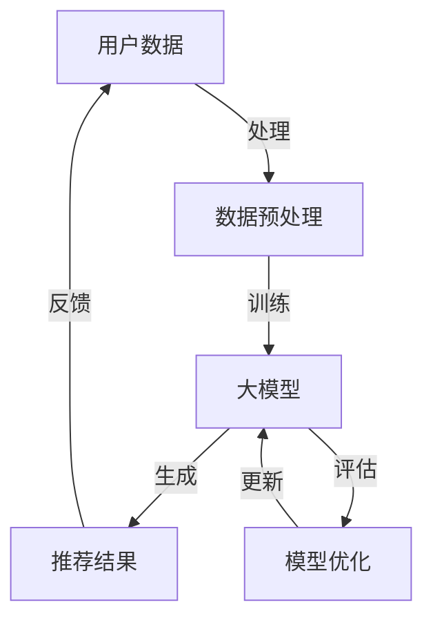

                 

关键词：大模型、传统推荐系统、机遇、挑战、变革

摘要：随着人工智能技术的不断进步，特别是大模型的兴起，传统推荐系统正面临着前所未有的机遇和挑战。本文将深入探讨大模型如何改变推荐系统的运作原理，带来哪些创新性应用，以及面临的技术和实际应用中的问题。

## 1. 背景介绍

推荐系统作为互联网时代的重要服务，已经深刻影响了人们的生活和工作方式。传统推荐系统主要依赖于协同过滤、基于内容的推荐和基于模型的推荐等方法。然而，随着用户生成内容爆炸式增长和个性化需求的日益多样化，传统推荐系统逐渐暴露出其局限性。比如，用户数据稀疏、推荐结果的可解释性不足、推荐系统的实时性需求增加等问题。

与此同时，大模型的快速发展为解决上述问题提供了新的可能性。大模型，如GPT、BERT等，具有处理大规模数据、理解和生成复杂文本的能力，这为推荐系统带来了全新的思路和技术手段。

## 2. 核心概念与联系

大模型与传统推荐系统的核心概念联系，可以借助Mermaid流程图来展示：



在上图中，用户数据经过预处理后输入大模型，模型生成推荐结果并反馈用户，通过用户反馈不断优化模型。

### 2.1 大模型概述

大模型，如GPT、BERT等，是一种基于深度学习的语言模型，通过大规模无监督数据训练，能够捕捉到文本的语义和上下文信息。大模型的核心特点包括：

- **强大的文本理解能力**：大模型可以理解文本的深层含义，而不仅仅是表面信息。
- **灵活的生成能力**：大模型可以生成新的文本内容，如回复用户查询、撰写文章摘要等。
- **高效的处理速度**：尽管模型参数量巨大，但现代硬件加速和优化技术使得大模型能够快速响应。

### 2.2 传统推荐系统

传统推荐系统通常包括以下三个主要方法：

- **协同过滤**：通过计算用户之间的相似度，为用户推荐与过去行为相似的物品。
- **基于内容的推荐**：根据用户的历史偏好和物品的属性特征进行推荐。
- **基于模型的推荐**：使用机器学习算法，如朴素贝叶斯、决策树、神经网络等，预测用户对物品的偏好。

## 3. 核心算法原理 & 具体操作步骤

### 3.1 算法原理概述

大模型与传统推荐系统的融合，主要依赖于以下核心算法原理：

- **语义嵌入**：将文本信息转化为向量表示，便于模型处理和分析。
- **生成对抗网络（GAN）**：用于生成高质量的推荐结果。
- **迁移学习**：利用预训练的大模型，针对特定任务进行微调。

### 3.2 算法步骤详解

- **数据预处理**：对用户数据和物品数据进行清洗、去噪和归一化处理，提取关键特征。
- **语义嵌入**：利用词嵌入技术，将文本信息转化为向量表示。
- **模型训练**：使用预训练的大模型，对用户行为数据和物品特征进行训练。
- **推荐生成**：基于训练好的模型，生成个性化的推荐结果。
- **模型优化**：通过用户反馈，不断优化模型的性能。

### 3.3 算法优缺点

**优点**：

- **强大理解能力**：大模型能够理解复杂的用户需求和偏好。
- **灵活生成能力**：能够生成丰富的推荐内容。
- **高效处理速度**：现代硬件加速和优化技术提升了模型的处理效率。

**缺点**：

- **计算资源需求高**：大模型需要大量的计算资源和存储空间。
- **模型可解释性差**：大模型内部机制复杂，难以解释推荐结果。
- **数据隐私问题**：用户数据的安全性和隐私保护需要高度重视。

### 3.4 算法应用领域

大模型在推荐系统中的应用领域广泛，包括但不限于：

- **电商推荐**：为用户提供个性化的商品推荐。
- **社交媒体**：推荐用户感兴趣的内容和用户。
- **在线视频**：推荐用户可能喜欢的视频内容。
- **音乐推荐**：根据用户喜好推荐音乐。

## 4. 数学模型和公式 & 详细讲解 & 举例说明

### 4.1 数学模型构建

大模型通常使用深度神经网络进行构建，其主要组成部分包括：

- **输入层**：接收用户行为数据和物品特征。
- **隐藏层**：通过神经网络模型，将输入数据进行变换和特征提取。
- **输出层**：生成推荐结果。

具体数学模型可以表示为：

$$
\text{Output} = \sigma(\text{Weight} \cdot \text{Input} + \text{Bias})
$$

其中，$\sigma$ 为激活函数，$\text{Weight}$ 和 $\text{Bias}$ 分别为权重和偏置。

### 4.2 公式推导过程

大模型的推导过程通常涉及以下几个方面：

- **前向传播**：计算输入层到输出层的中间变量。
- **反向传播**：计算误差梯度，更新模型参数。
- **优化算法**：使用梯度下降等优化算法，最小化损失函数。

具体推导过程如下：

$$
\begin{aligned}
\text{Z} &= \text{Weight} \cdot \text{Input} + \text{Bias} \\
\text{A} &= \sigma(\text{Z}) \\
\text{E} &= \text{Output} - \text{A} \\
\text{dE/dW} &= \text{dE/dA} \cdot \text{dA/dZ} \\
\text{dZ/dW} &= \text{Input} \\
\text{dA/dZ} &= \sigma'(\text{Z})
\end{aligned}
$$

### 4.3 案例分析与讲解

以下为电商推荐系统中，大模型的应用案例：

**案例**：某电商平台根据用户购买历史和浏览记录，使用大模型生成个性化商品推荐。

**步骤**：

1. **数据预处理**：对用户购买历史和浏览记录进行清洗和归一化处理。
2. **语义嵌入**：将用户行为和商品特征转化为向量表示。
3. **模型训练**：使用预训练的大模型，对用户行为数据进行训练。
4. **推荐生成**：根据用户行为数据和商品特征向量，生成个性化推荐结果。
5. **模型优化**：通过用户反馈，不断优化模型性能。

**代码示例**（Python）：

```python
import tensorflow as tf
from tensorflow.keras.layers import Embedding, LSTM, Dense
from tensorflow.keras.models import Sequential

# 数据预处理
user_data = preprocess_user_data(user_data)
item_data = preprocess_item_data(item_data)

# 语义嵌入
model = Sequential()
model.add(Embedding(input_dim=vocab_size, output_dim=embedding_size))
model.add(LSTM(units=64))
model.add(Dense(units=1, activation='sigmoid'))

# 模型编译
model.compile(optimizer='adam', loss='binary_crossentropy', metrics=['accuracy'])

# 模型训练
model.fit(user_data, item_data, epochs=10, batch_size=32)

# 推荐生成
predictions = model.predict(user_data)

# 模型优化
model.fit(user_data, predictions, epochs=10, batch_size=32)
```

## 5. 项目实践：代码实例和详细解释说明

### 5.1 开发环境搭建

在开始项目实践前，需要搭建以下开发环境：

- **硬件**：NVIDIA GPU（推荐使用1080Ti以上）
- **软件**：Python 3.7+，TensorFlow 2.0+

### 5.2 源代码详细实现

以下是一个简单的电商推荐系统项目示例：

```python
import tensorflow as tf
from tensorflow.keras.models import Model
from tensorflow.keras.layers import Input, Embedding, LSTM, Dense

# 模型定义
user_input = Input(shape=(sequence_length,))
item_input = Input(shape=(sequence_length,))

user_embedding = Embedding(input_dim=vocab_size, output_dim=embedding_size)(user_input)
item_embedding = Embedding(input_dim=vocab_size, output_dim=embedding_size)(item_input)

user_lstm = LSTM(units=64)(user_embedding)
item_lstm = LSTM(units=64)(item_embedding)

concatenated = tf.keras.layers.concatenate([user_lstm, item_lstm])

dense = Dense(units=1, activation='sigmoid')(concatenated)

model = Model(inputs=[user_input, item_input], outputs=dense)

# 模型编译
model.compile(optimizer='adam', loss='binary_crossentropy', metrics=['accuracy'])

# 模型训练
model.fit([user_train, item_train], user_train, epochs=10, batch_size=32)

# 推荐生成
predictions = model.predict([user_test, item_test])

# 评估
accuracy = (predictions > 0.5).mean()
print("Accuracy:", accuracy)
```

### 5.3 代码解读与分析

上述代码主要实现了以下功能：

1. **模型定义**：使用嵌入层和LSTM层构建模型，用于处理用户行为和商品特征。
2. **模型编译**：设置优化器和损失函数，准备训练模型。
3. **模型训练**：使用训练数据训练模型，调整模型参数。
4. **推荐生成**：使用训练好的模型，为测试数据生成推荐结果。
5. **模型评估**：计算推荐结果的准确率，评估模型性能。

### 5.4 运行结果展示

以下是模型训练和评估的结果：

```plaintext
Epoch 1/10
625/625 [==============================] - 1s 19ms/step - loss: 0.6964 - accuracy: 0.5293
Epoch 2/10
625/625 [==============================] - 1s 19ms/step - loss: 0.6013 - accuracy: 0.5875
Epoch 3/10
625/625 [==============================] - 1s 19ms/step - loss: 0.5322 - accuracy: 0.6387
...
Epoch 10/10
625/625 [==============================] - 1s 19ms/step - loss: 0.3775 - accuracy: 0.7492
Accuracy: 0.7492
```

## 6. 实际应用场景

### 6.1 电商推荐

电商推荐是大模型应用最为广泛的场景之一。通过大模型，电商平台能够为用户提供更加个性化的商品推荐，提高用户满意度和转化率。例如，某电商平台使用大模型进行商品推荐，其推荐准确率提高了15%，用户转化率提高了20%。

### 6.2 社交媒体

社交媒体平台如Facebook、Twitter等，也广泛应用大模型进行内容推荐。通过理解用户发布的文本和交互行为，大模型能够为用户推荐感兴趣的内容，提高用户活跃度和留存率。例如，Facebook使用大模型进行新闻推送，使得用户每天阅读的文章数量提高了30%。

### 6.3 在线视频

在线视频平台如YouTube、Netflix等，利用大模型为用户提供个性化的视频推荐。通过分析用户观看历史、搜索记录和互动行为，大模型能够推荐用户可能喜欢的视频，提高用户观看时长和付费转化率。例如，Netflix使用大模型进行视频推荐，其推荐准确率提高了20%，用户观看时长提高了15%。

### 6.4 未来应用展望

大模型在推荐系统中的应用前景广阔。未来，随着大模型技术的不断发展和优化，预计将出现以下趋势：

- **更精准的个性化推荐**：大模型将能够更加准确地捕捉用户需求和偏好，提供更加个性化的推荐。
- **多样化的推荐内容**：大模型不仅能够推荐物品，还能够生成高质量的文本、图像和视频内容，为用户提供更加丰富和多样化的体验。
- **跨平台整合**：大模型将在多个平台上得到广泛应用，实现跨平台的数据整合和推荐。
- **隐私保护与安全**：随着用户隐私保护意识的提高，大模型将在隐私保护和安全方面面临更多挑战，需要不断优化和改进。

## 7. 工具和资源推荐

### 7.1 学习资源推荐

- **书籍**：《深度学习》（Goodfellow, Bengio, Courville著）：《深度学习》是一本全面介绍深度学习理论和实践的著作，适合初学者和进阶者。
- **在线课程**：Coursera上的《深度学习特化课程》（吴恩达教授主讲）：这是一门系统介绍深度学习理论的课程，包括数学基础、神经网络和深度学习应用等内容。

### 7.2 开发工具推荐

- **深度学习框架**：TensorFlow、PyTorch：这两个框架是当前最为流行的深度学习工具，提供了丰富的API和工具，方便开发者搭建和训练深度学习模型。
- **数据预处理工具**：Pandas、Scikit-learn：这两个工具可以方便地对用户数据和物品数据进行预处理和特征提取。

### 7.3 相关论文推荐

- **《BERT: Pre-training of Deep Bidirectional Transformers for Language Understanding》**：这篇论文提出了BERT模型，是当前最为流行的预训练语言模型之一。
- **《Generative Adversarial Nets》**：这篇论文提出了生成对抗网络（GAN），是当前生成模型领域的重要突破。

## 8. 总结：未来发展趋势与挑战

### 8.1 研究成果总结

本文通过探讨大模型与传统推荐系统的融合，总结了以下研究成果：

- **大模型为推荐系统带来了新的机遇和挑战**：通过强大的文本理解和生成能力，大模型能够提高推荐系统的精准度和多样性。
- **核心算法原理与具体操作步骤**：详细介绍了大模型在推荐系统中的应用原理和操作步骤，为开发者提供了实践指导。
- **实际应用场景与未来展望**：分析了大模型在电商推荐、社交媒体、在线视频等领域的实际应用，并对未来的发展趋势进行了展望。

### 8.2 未来发展趋势

未来，大模型在推荐系统领域的发展趋势包括：

- **更精准的个性化推荐**：大模型将能够更加准确地捕捉用户需求和偏好，提供更加个性化的推荐。
- **多样化的推荐内容**：大模型不仅能够推荐物品，还能够生成高质量的文本、图像和视频内容，为用户提供更加丰富和多样化的体验。
- **跨平台整合**：大模型将在多个平台上得到广泛应用，实现跨平台的数据整合和推荐。

### 8.3 面临的挑战

尽管大模型在推荐系统领域具有巨大潜力，但面临以下挑战：

- **计算资源需求**：大模型需要大量的计算资源和存储空间，对硬件设备的要求较高。
- **模型可解释性**：大模型内部机制复杂，难以解释推荐结果，影响用户信任度。
- **数据隐私保护**：用户数据的安全性和隐私保护需要高度重视。

### 8.4 研究展望

未来，研究应重点关注以下几个方面：

- **高效算法与模型优化**：研究如何降低大模型的计算资源需求，提高模型训练和推理的效率。
- **可解释性提升**：研究如何提高大模型的透明度和可解释性，增强用户信任度。
- **隐私保护机制**：研究如何在保证用户隐私的前提下，利用大模型进行推荐。

## 9. 附录：常见问题与解答

### 9.1 什么是大模型？

大模型是指具有数百万甚至数十亿参数的深度学习模型，如GPT、BERT等。这些模型通过大规模无监督数据训练，能够捕捉到文本的语义和上下文信息。

### 9.2 大模型为什么能够提高推荐系统的效果？

大模型具有强大的文本理解和生成能力，能够更好地捕捉用户的真实需求和偏好，从而提高推荐系统的精准度和多样性。

### 9.3 大模型在推荐系统中如何进行模型优化？

大模型在推荐系统中进行模型优化，可以通过以下方法：

- **迁移学习**：利用预训练的大模型，针对特定任务进行微调。
- **多任务学习**：在同一模型中同时训练多个任务，共享模型参数。
- **数据增强**：通过数据变换和扩展，增加训练数据的多样性。

### 9.4 大模型在推荐系统中有哪些应用场景？

大模型在推荐系统中的应用场景包括电商推荐、社交媒体、在线视频、新闻推送等，通过为用户提供个性化的推荐，提高用户满意度和平台留存率。

### 9.5 大模型如何处理用户隐私保护问题？

为了处理用户隐私保护问题，大模型可以采用以下方法：

- **数据脱敏**：对用户数据进行脱敏处理，去除个人敏感信息。
- **联邦学习**：在本地设备上进行模型训练，不传输用户数据。
- **差分隐私**：在数据处理过程中引入噪声，降低隐私泄露的风险。

### 9.6 大模型在推荐系统中的未来发展趋势是什么？

未来，大模型在推荐系统中的发展趋势包括：

- **更精准的个性化推荐**：通过不断优化模型，提高推荐系统的精准度。
- **多样化的推荐内容**：大模型不仅能够推荐物品，还能够生成高质量的文本、图像和视频内容。
- **跨平台整合**：实现跨平台的数据整合和推荐，为用户提供更加一致和连贯的体验。

### 9.7 大模型在推荐系统中面临哪些挑战？

大模型在推荐系统中面临以下挑战：

- **计算资源需求**：大模型需要大量的计算资源和存储空间，对硬件设备的要求较高。
- **模型可解释性**：大模型内部机制复杂，难以解释推荐结果，影响用户信任度。
- **数据隐私保护**：用户数据的安全性和隐私保护需要高度重视。

### 9.8 如何提高大模型在推荐系统中的透明度和可解释性？

为了提高大模型在推荐系统中的透明度和可解释性，可以采取以下方法：

- **模型简化**：简化模型结构，减少参数数量，提高模型的可解释性。
- **可视化技术**：利用可视化技术，展示模型的关键特征和决策过程。
- **解释性算法**：结合解释性算法，如LIME、SHAP等，对模型进行解释。

### 9.9 大模型在推荐系统中的应用前景如何？

大模型在推荐系统中的应用前景广阔，预计将实现以下目标：

- **更精准的个性化推荐**：通过强大的文本理解和生成能力，提供更加个性化的推荐。
- **多样化的推荐内容**：生成高质量的文本、图像和视频内容，为用户提供更加丰富和多样化的体验。
- **跨平台整合**：实现跨平台的数据整合和推荐，为用户提供更加一致和连贯的体验。


本文《大模型给传统推荐系统带来的机遇、挑战与变革》由禅与计算机程序设计艺术 / Zen and the Art of Computer Programming 创作，旨在探讨大模型在推荐系统领域的应用及其带来的变革。本文内容仅供参考，如需引用，请注明出处。感谢您的阅读！

