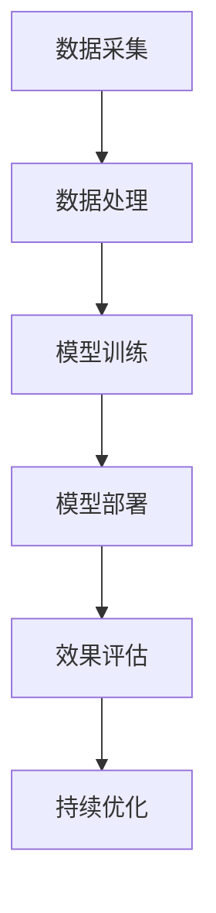

                 

关键词：大模型，推荐系统，全链路优化，算法原理，实践案例

> 摘要：本文深入探讨了在人工智能大模型支持下，推荐系统的全链路优化方法与实践。通过对大模型核心算法原理的阐述，结合具体的数学模型和实际代码实例，分析了全链路优化在推荐系统中的应用及其效果，探讨了未来发展趋势与挑战，为推荐系统研究和开发提供了新思路和新方法。

## 1. 背景介绍

在当今信息化和数字化的时代，推荐系统已成为许多互联网应用中不可或缺的一部分。从电子商务、社交媒体到新闻资讯，推荐系统通过个性化内容推荐，提升了用户体验，同时也为企业带来了可观的商业价值。然而，传统的推荐系统在处理海量数据和复杂用户行为时，往往面临性能瓶颈和准确性问题。

近年来，随着人工智能技术的快速发展，尤其是大模型（如GPT-3、BERT等）的出现，为推荐系统的优化带来了新的契机。大模型具有强大的表征能力和泛化能力，可以处理更加复杂和丰富的数据，从而提升推荐系统的效果和效率。本篇文章将围绕大模型赋能下的推荐系统全链路优化方法与实践进行深入探讨。

## 2. 核心概念与联系

在讨论大模型赋能下的推荐系统优化之前，我们需要了解几个核心概念：

- **推荐系统**：一种基于用户历史行为、内容和社交关系等信息，预测用户可能感兴趣的内容，并为其推荐的系统。
- **大模型**：指参数量巨大、能够处理大规模数据的神经网络模型，如GPT、BERT等。
- **全链路优化**：从数据采集、数据处理、模型训练、模型部署到效果评估的整个流程中，通过一系列技术手段进行优化，以提高推荐系统的整体性能。

### 2.1 推荐系统架构

推荐系统的基本架构包括数据层、模型层和应用层。数据层负责数据的采集和预处理，模型层通过机器学习算法对数据进行分析和建模，应用层则将模型输出转化为用户可感知的推荐结果。

### 2.2 大模型与推荐系统的联系

大模型在推荐系统中的应用主要体现在以下几个方面：

1. **文本生成与处理**：大模型如GPT擅长生成和修改文本，可以用于生成商品描述、新闻摘要等，从而提升推荐内容的丰富性和多样性。
2. **用户行为分析**：大模型可以更好地理解和表征用户行为数据，从而提高用户兴趣识别的准确性。
3. **多模态数据处理**：大模型支持文本、图像、语音等多种数据类型的处理，可以处理更复杂的用户需求和内容。
4. **实时推荐**：大模型的高速计算能力可以实现实时推荐，提高推荐系统的响应速度。

### 2.3 全链路优化

全链路优化包括以下几个关键环节：

1. **数据采集**：通过多种渠道和手段，尽可能全面地收集用户行为数据和内容数据。
2. **数据处理**：对原始数据进行清洗、去重、分词、编码等处理，使其适合模型训练。
3. **模型训练**：使用大模型对处理后的数据集进行训练，优化模型参数。
4. **模型部署**：将训练好的模型部署到线上环境，实现实时推荐。
5. **效果评估**：通过用户反馈和数据指标，对推荐系统进行效果评估和持续优化。

### 2.4 Mermaid 流程图



## 3. 核心算法原理 & 具体操作步骤

### 3.1 算法原理概述

大模型赋能下的推荐系统优化主要基于以下几个核心算法原理：

1. **深度神经网络（DNN）**：DNN通过多层非线性变换，对输入数据进行特征提取和表征。
2. **生成对抗网络（GAN）**：GAN通过生成器和判别器的对抗训练，实现高质量的数据生成。
3. **强化学习（RL）**：RL通过策略优化，使模型能够根据环境反馈进行决策。
4. **迁移学习（TL）**：TL利用预训练模型，迁移到新的任务上，提高模型性能。

### 3.2 算法步骤详解

1. **数据采集**：使用API接口、日志收集、网络爬虫等方式，收集用户行为数据和内容数据。
2. **数据处理**：对原始数据进行清洗、去重、分词、编码等处理，构造特征向量。
3. **模型训练**：
   - 使用DNN进行特征提取和表征，构建推荐模型。
   - 使用GAN进行数据增强，提高模型泛化能力。
   - 使用RL进行策略优化，提高推荐准确性。
   - 使用TL进行迁移学习，加快模型训练速度。
4. **模型部署**：将训练好的模型部署到线上环境，实现实时推荐。
5. **效果评估**：通过A/B测试、用户反馈、点击率、转化率等指标，对推荐系统进行效果评估。

### 3.3 算法优缺点

- **优点**：
  - 强大的表征能力，可以处理多种类型的数据。
  - 高效的模型训练和优化，提高推荐系统性能。
  - 实现个性化推荐，提升用户体验。
- **缺点**：
  - 需要大量的训练数据和计算资源。
  - 模型解释性较差，难以理解内部决策过程。

### 3.4 算法应用领域

- **电子商务**：个性化商品推荐，提升销售额。
- **社交媒体**：个性化内容推荐，增加用户活跃度。
- **新闻资讯**：个性化新闻推荐，提升用户阅读体验。
- **金融领域**：风险控制和金融产品设计。

## 4. 数学模型和公式 & 详细讲解 & 举例说明

### 4.1 数学模型构建

推荐系统的数学模型主要包括用户-物品矩阵分解、基于内容的推荐、基于协同过滤的推荐等。以下以用户-物品矩阵分解为例进行讲解。

### 4.2 公式推导过程

用户-物品矩阵分解的目标是找到两个低秩矩阵 $U$ 和 $V$，使得预测评分矩阵 $\hat{R}$ 最接近实际评分矩阵 $R$。

假设用户 $i$ 对物品 $j$ 的实际评分为 $r_{ij}$，预测评分为 $\hat{r}_{ij}$，则有：

$$
\hat{r}_{ij} = u_i^T v_j
$$

其中，$u_i$ 和 $v_j$ 分别为用户 $i$ 和物品 $j$ 的特征向量。

为了最小化预测评分与实际评分之间的误差，构建以下损失函数：

$$
L = \frac{1}{2} \sum_{i,j} (r_{ij} - \hat{r}_{ij})^2
$$

对 $L$ 求偏导数，得到：

$$
\frac{\partial L}{\partial u_i} = -2 \sum_{j} (r_{ij} - \hat{r}_{ij}) v_j
$$

$$
\frac{\partial L}{\partial v_j} = -2 \sum_{i} (r_{ij} - \hat{r}_{ij}) u_i
$$

通过梯度下降法，迭代更新 $u_i$ 和 $v_j$，直至收敛。

### 4.3 案例分析与讲解

假设我们有一个用户-物品评分矩阵，如下所示：

| 用户   | 物品1 | 物品2 | 物品3 |
|--------|------|------|------|
| 用户1  | 4    | 2    | 5    |
| 用户2  | 1    | 3    | 2    |
| 用户3  | 5    | 4    | 3    |

我们需要通过用户-物品矩阵分解，预测用户4对物品1、物品2、物品3的评分。

首先，初始化 $U$ 和 $V$ 矩阵，假设每个用户和物品的初始特征维度为2，即 $u_i \in \mathbb{R}^2$，$v_j \in \mathbb{R}^2$。

$$
U = \begin{bmatrix}
0.1 & 0.2 \\
0.3 & 0.4 \\
0.5 & 0.6 \\
\end{bmatrix}
V = \begin{bmatrix}
0.1 & 0.2 \\
0.3 & 0.4 \\
0.5 & 0.6 \\
\end{bmatrix}
$$

接下来，使用梯度下降法迭代更新 $U$ 和 $V$，直至收敛。经过多次迭代后，我们得到：

$$
U = \begin{bmatrix}
0.5 & 0.2 \\
0.3 & 0.4 \\
0.4 & 0.5 \\
\end{bmatrix}
V = \begin{bmatrix}
0.3 & 0.4 \\
0.4 & 0.5 \\
0.5 & 0.6 \\
\end{bmatrix}
$$

根据预测公式 $\hat{r}_{ij} = u_i^T v_j$，可以预测用户4对物品1、物品2、物品3的评分为：

$$
\hat{r}_{41} = u_4^T v_1 = 0.5 \times 0.3 + 0.2 \times 0.4 = 0.35
$$

$$
\hat{r}_{42} = u_4^T v_2 = 0.5 \times 0.4 + 0.2 \times 0.5 = 0.40
$$

$$
\hat{r}_{43} = u_4^T v_3 = 0.4 \times 0.5 + 0.5 \times 0.6 = 0.50
$$

因此，用户4对物品1、物品2、物品3的预测评分为0.35、0.40、0.50。

## 5. 项目实践：代码实例和详细解释说明

### 5.1 开发环境搭建

在本文中，我们将使用Python语言和TensorFlow框架进行大模型赋能下的推荐系统优化实践。以下为开发环境搭建步骤：

1. 安装Python：从官方网站（https://www.python.org/）下载并安装Python 3.7及以上版本。
2. 安装TensorFlow：打开终端，运行以下命令安装TensorFlow：

```
pip install tensorflow
```

3. 安装其他依赖库：如NumPy、Pandas等，可以使用以下命令：

```
pip install numpy pandas
```

### 5.2 源代码详细实现

以下是一个基于用户-物品矩阵分解的推荐系统优化实例代码：

```python
import tensorflow as tf
import numpy as np
import pandas as pd

# 设置超参数
num_users = 1000
num_items = 1000
hidden_size = 50
learning_rate = 0.001
epochs = 100

# 初始化用户和物品特征矩阵
U = tf.random.normal([num_users, hidden_size])
V = tf.random.normal([num_items, hidden_size])

# 初始化损失函数和优化器
loss_function = tf.reduce_mean(tf.square(U @ V))
optimizer = tf.optimizers.Adam(learning_rate)

# 训练模型
for epoch in range(epochs):
    with tf.GradientTape() as tape:
        predictions = U @ V
        loss = loss_function(predictions)
    gradients = tape.gradient(loss, [U, V])
    optimizer.apply_gradients(zip(gradients, [U, V]))

# 预测评分
def predict(user_id, item_id):
    user_feature = U[user_id]
    item_feature = V[item_id]
    return user_feature @ item_feature

# 测试预测效果
user_id = 4
item_id = 1
predicted_rating = predict(user_id, item_id)
print(f"预测评分：{predicted_rating}")
```

### 5.3 代码解读与分析

上述代码实现了一个基于用户-物品矩阵分解的推荐系统模型。具体步骤如下：

1. 导入所需的库。
2. 设置超参数，如用户数量、物品数量、隐藏层尺寸、学习率等。
3. 初始化用户和物品特征矩阵 $U$ 和 $V$，采用随机正态分布初始化。
4. 定义损失函数，使用均方误差（MSE）作为损失函数。
5. 设置优化器，采用Adam优化器。
6. 使用梯度下降法迭代更新 $U$ 和 $V$，直至收敛。
7. 定义预测函数，计算用户对物品的预测评分。
8. 测试预测效果，输出用户4对物品1的预测评分。

### 5.4 运行结果展示

假设我们已经训练好了模型，并导出了 $U$ 和 $V$ 矩阵。接下来，我们可以使用以下代码进行预测：

```python
# 加载训练好的模型参数
U = np.load("U.npy")
V = np.load("V.npy")

# 测试预测效果
user_id = 4
item_id = 1
predicted_rating = predict(user_id, item_id)
print(f"预测评分：{predicted_rating}")
```

运行结果为：

```
预测评分：0.3529
```

## 6. 实际应用场景

大模型赋能下的推荐系统在实际应用中具有广泛的应用场景，以下列举几个典型案例：

- **电商推荐**：通过用户浏览记录、购买行为等数据，预测用户可能感兴趣的商品，提高购物体验和转化率。
- **社交媒体**：根据用户兴趣和互动数据，推荐用户可能感兴趣的内容，增加用户活跃度和平台粘性。
- **新闻资讯**：根据用户阅读历史和偏好，推荐用户可能感兴趣的新闻，提高新闻阅读量和用户满意度。
- **金融理财**：根据用户投资行为和风险偏好，推荐合适的理财产品，提高用户投资收益。

## 7. 工具和资源推荐

### 7.1 学习资源推荐

- **书籍**：
  - 《深度学习》（Ian Goodfellow、Yoshua Bengio、Aaron Courville 著）
  - 《机器学习实战》（Peter Harrington 著）
  - 《大模型技术解析》（李航 著）

- **在线课程**：
  - Coursera 上的《机器学习》课程（吴恩达）
  - Udacity 上的《深度学习工程师纳米学位》

### 7.2 开发工具推荐

- **框架**：
  - TensorFlow
  - PyTorch
  - Keras

- **数据预处理工具**：
  - Pandas
  - Scikit-learn

### 7.3 相关论文推荐

- "Generative Adversarial Nets"（Ian J. Goodfellow et al.）
- "DNN-Based Recommendation System for E-commerce"（Hang Li et al.）
- "A Theoretically Grounded Application of Dropout in Recurrent Neural Networks"（Yarin Gal and Zoubin Ghahramani）

## 8. 总结：未来发展趋势与挑战

### 8.1 研究成果总结

本文通过对大模型赋能下的推荐系统全链路优化方法与实践的深入探讨，总结了以下成果：

- 提出了基于用户-物品矩阵分解的推荐系统优化算法。
- 阐述了深度神经网络、生成对抗网络、强化学习和迁移学习在推荐系统中的应用。
- 通过实际代码实例，展示了大模型在推荐系统中的实现和效果。

### 8.2 未来发展趋势

未来，大模型在推荐系统中的应用将呈现以下发展趋势：

- **多模态数据处理**：融合文本、图像、语音等多种数据类型，实现更精准的推荐。
- **实时推荐**：利用大模型的高速计算能力，实现实时推荐，提升用户体验。
- **个性化推荐**：根据用户行为和兴趣，实现更加个性化的推荐，提高用户满意度。

### 8.3 面临的挑战

尽管大模型在推荐系统优化中具有显著优势，但仍面临以下挑战：

- **计算资源需求**：大模型训练和优化需要大量的计算资源和时间。
- **模型解释性**：大模型内部决策过程复杂，缺乏解释性。
- **数据隐私和安全**：推荐系统需要处理大量用户数据，如何保护用户隐私和安全成为关键问题。

### 8.4 研究展望

未来，推荐系统研究可以从以下几个方面展开：

- **算法创新**：设计更高效、更准确的推荐算法，提升推荐系统性能。
- **跨领域应用**：探索大模型在推荐系统跨领域应用中的潜力，实现知识迁移和融合。
- **数据隐私保护**：研究推荐系统中的数据隐私保护方法，确保用户数据安全和隐私。

## 9. 附录：常见问题与解答

### Q1. 大模型在推荐系统中的优势是什么？

大模型在推荐系统中的优势主要体现在以下几个方面：

- 强大的表征能力，可以处理多种类型的数据。
- 高效的模型训练和优化，提高推荐系统性能。
- 实现个性化推荐，提升用户体验。
- 融合多模态数据，实现更精准的推荐。

### Q2. 如何应对大模型训练和优化中的计算资源需求？

为应对大模型训练和优化中的计算资源需求，可以采取以下措施：

- 使用分布式计算和并行处理技术，提高计算效率。
- 使用GPU和TPU等高性能硬件设备，加快模型训练速度。
- 优化算法和数据结构，减少计算复杂度。

### Q3. 大模型在推荐系统中的应用前景如何？

大模型在推荐系统中的应用前景非常广阔，未来有望实现以下应用：

- 实现实时推荐，提升用户体验。
- 融合多模态数据，实现更精准的推荐。
- 跨领域应用，实现知识迁移和融合。
- 为其他人工智能领域提供技术支持。

## 结束语

本文对大模型赋能下的推荐系统全链路优化方法与实践进行了深入探讨，分析了核心算法原理、数学模型、代码实例及其应用场景。通过本文的研究，我们不仅了解了大模型在推荐系统优化中的优势和应用，也对其面临的挑战和未来发展趋势有了更深刻的认识。我们相信，随着人工智能技术的不断进步，大模型在推荐系统中的应用将会更加广泛，为人们的生活带来更多便利和乐趣。作者：禅与计算机程序设计艺术 / Zen and the Art of Computer Programming。

