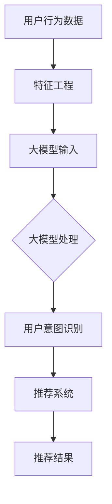

                 

关键词：大模型，推荐系统，用户行为意图，理解，预测，AI技术，数据驱动，机器学习

> 摘要：本文深入探讨了大模型在推荐系统中的应用，重点关注用户行为意图的理解与预测。通过分析大模型的基本原理、核心算法、数学模型及其在实际项目中的应用，本文旨在为读者提供对这一领域的全面了解，并展望其未来的发展趋势与挑战。

## 1. 背景介绍

随着互联网和大数据技术的快速发展，推荐系统已经成为当今信息社会中不可或缺的一部分。无论是电商平台、社交媒体，还是新闻媒体和音乐平台，推荐系统都在极大地提升用户体验，提高内容分发效率，并为企业带来显著的商业价值。

推荐系统的核心目标是根据用户的兴趣和行为模式，为其推荐可能感兴趣的内容。然而，这一目标的实现并不容易，因为它涉及到对用户行为意图的深刻理解。用户行为意图是指用户在其交互过程中所表现出的潜在需求和期望，包括浏览、搜索、点击、购买等。

大模型，特别是深度学习模型，为推荐系统带来了新的机遇和挑战。大模型拥有强大的数据处理能力和模式识别能力，可以处理海量数据，提取用户行为中的深层特征，从而实现对用户意图的准确预测和理解。

本文将围绕大模型赋能下的推荐系统用户行为意图理解与预测展开讨论，首先介绍大模型的基本原理，然后深入分析其在推荐系统中的应用，最后探讨其未来发展趋势与面临的挑战。

## 2. 核心概念与联系

为了更好地理解大模型在推荐系统中的应用，我们需要首先了解一些核心概念和它们之间的联系。

### 2.1 大模型基本原理

大模型通常是指参数量达到数十亿甚至千亿级的深度学习模型。这些模型通过多层神经网络结构，能够自动学习输入数据的复杂特征和模式。大模型的核心优势在于其能够处理大规模数据，并在各种复杂任务上实现卓越的性能。

大模型的基本原理包括：

- **深度神经网络（DNN）**：DNN是一种多层神经网络结构，能够通过逐层提取特征，实现对数据的深度学习。
- **卷积神经网络（CNN）**：CNN在图像处理领域有着广泛的应用，能够通过卷积操作提取图像的局部特征。
- **循环神经网络（RNN）**：RNN能够处理序列数据，通过记忆机制捕捉数据的时间动态变化。
- **Transformer模型**：Transformer模型是近年来在自然语言处理领域取得突破性成果的一种新型架构，其核心思想是自注意力机制。

### 2.2 推荐系统基本原理

推荐系统是一种基于数据挖掘和机器学习的算法，旨在为用户推荐他们可能感兴趣的内容。推荐系统的基本原理包括：

- **用户-物品交互数据**：推荐系统依赖于用户与物品之间的交互数据，如点击、浏览、购买等行为数据。
- **特征工程**：通过对用户和物品的特征进行提取和组合，形成有效的特征表示，用于模型的输入。
- **模型训练与预测**：使用机器学习算法对用户-物品交互数据进行训练，构建预测模型，用于预测用户对物品的喜好程度。

### 2.3 用户行为意图

用户行为意图是指用户在其交互过程中所表现出的潜在需求和期望。理解用户行为意图对于推荐系统的有效性至关重要。用户行为意图包括但不限于：

- **兴趣偏好**：用户对特定类型内容的兴趣程度。
- **需求情境**：用户在特定情境下的需求，如购买决策、娱乐需求等。
- **行为模式**：用户在长时间内的行为特征和模式。

### 2.4 大模型与推荐系统的结合

大模型在推荐系统中的应用主要体现在以下几个方面：

- **特征提取**：大模型能够自动提取用户和物品的复杂特征，提升特征表示的准确性和有效性。
- **意图识别**：通过深度学习算法，大模型可以学习用户行为中的深层特征，实现对用户意图的准确识别。
- **预测与推荐**：基于用户意图的识别，大模型能够为用户推荐可能感兴趣的内容，提高推荐系统的准确性。

为了更直观地展示大模型与推荐系统的结合，我们可以使用Mermaid流程图来描述它们之间的交互关系。



在这个流程图中，用户行为数据首先经过特征工程处理，然后输入到大模型中进行处理，大模型通过学习用户行为的复杂特征，识别用户意图，并输出推荐结果。

## 3. 核心算法原理 & 具体操作步骤

### 3.1 算法原理概述

在推荐系统中，大模型的核心算法通常是基于深度学习的模型。以下是一些常见的大模型算法及其原理概述：

- **深度神经网络（DNN）**：DNN是一种多层神经网络结构，通过逐层提取特征，实现对数据的深度学习。每个神经元都与其他神经元相连接，并通过权重进行信息的传递和整合。在推荐系统中，DNN可以用于用户和物品的特征提取，从而提高推荐系统的准确性。

- **卷积神经网络（CNN）**：CNN在图像处理领域有着广泛的应用，其核心思想是通过卷积操作提取图像的局部特征。在推荐系统中，CNN可以用于提取用户和物品的图像特征，如商品图片、用户头像等，从而丰富特征表示。

- **循环神经网络（RNN）**：RNN能够处理序列数据，通过记忆机制捕捉数据的时间动态变化。在推荐系统中，RNN可以用于处理用户的历史行为数据，如浏览记录、搜索历史等，从而提取用户的行为模式。

- **Transformer模型**：Transformer模型是近年来在自然语言处理领域取得突破性成果的一种新型架构，其核心思想是自注意力机制。在推荐系统中，Transformer可以用于处理用户和物品的文本描述，从而提高推荐的准确性。

### 3.2 算法步骤详解

以下是使用深度神经网络（DNN）在推荐系统中进行用户行为意图理解与预测的具体操作步骤：

#### 步骤1：数据预处理

- **数据收集**：收集用户和物品的交互数据，如点击、浏览、购买等行为数据。
- **数据清洗**：去除缺失值、异常值和重复数据，确保数据质量。
- **数据转换**：将原始数据转换为适合模型训练的格式，如数值化、标准化等。

#### 步骤2：特征工程

- **用户特征提取**：从用户的基本信息（如年龄、性别、地理位置）和行为数据（如浏览记录、购买历史）中提取特征，形成用户特征向量。
- **物品特征提取**：从物品的描述信息（如标题、标签、图片）中提取特征，形成物品特征向量。
- **交互特征提取**：计算用户和物品之间的交互特征，如共同浏览的物品数量、共同喜欢的标签等。

#### 步骤3：模型构建

- **网络结构设计**：设计深度神经网络的结构，包括输入层、隐藏层和输出层。输入层接收用户和物品的特征向量，隐藏层通过逐层提取特征，输出层输出用户对物品的喜好程度。
- **损失函数选择**：选择合适的损失函数，如交叉熵损失函数，用于衡量预测值与真实值之间的差异。

#### 步骤4：模型训练

- **参数初始化**：对网络参数进行初始化，确保模型可以从随机状态开始训练。
- **前向传播**：将输入特征向量传递到网络中，通过前向传播计算输出值。
- **反向传播**：通过反向传播计算梯度，更新网络参数。
- **优化算法**：选择合适的优化算法，如梯度下降算法，用于更新网络参数。

#### 步骤5：模型评估

- **交叉验证**：使用交叉验证方法评估模型在训练集和测试集上的性能。
- **性能指标**：计算准确率、召回率、F1值等指标，评估模型的预测效果。

#### 步骤6：模型部署

- **模型部署**：将训练好的模型部署到生产环境中，用于实时推荐。
- **在线学习**：根据用户反馈和新的数据，持续更新模型，提高推荐准确性。

### 3.3 算法优缺点

#### 优点

- **强大的特征提取能力**：大模型能够自动提取用户和物品的复杂特征，提高推荐系统的准确性。
- **高效的计算能力**：大模型通过并行计算和分布式计算，能够处理大规模数据，提高推荐系统的效率。
- **自适应学习能力**：大模型能够通过在线学习，持续更新模型，适应用户行为的变化。

#### 缺点

- **数据依赖性**：大模型的训练和优化依赖于大量高质量的数据，数据不足或数据质量问题可能导致模型性能下降。
- **计算资源需求**：大模型的训练和部署需要大量的计算资源和存储资源，对硬件设备有较高要求。
- **解释性较差**：大模型的内部结构复杂，难以解释其预测结果，对模型的决策过程缺乏透明性。

### 3.4 算法应用领域

大模型在推荐系统中的应用非常广泛，以下是一些常见的应用领域：

- **电商推荐**：通过对用户行为数据的分析，为用户推荐可能感兴趣的商品。
- **社交媒体**：为用户提供个性化的内容推荐，提高用户参与度和留存率。
- **新闻媒体**：为用户推荐可能感兴趣的新闻文章，提高阅读量和广告效果。
- **音乐和视频平台**：为用户推荐可能喜欢的音乐和视频内容，提高用户粘性和付费转化率。

## 4. 数学模型和公式 & 详细讲解 & 举例说明

### 4.1 数学模型构建

在推荐系统中，大模型的数学模型通常由以下几个部分组成：

- **输入层**：接收用户和物品的特征向量，通常包括用户特征向量 \(x_u\) 和物品特征向量 \(x_i\)。
- **隐藏层**：通过神经网络结构提取特征，通常使用激活函数如ReLU、Sigmoid或Tanh进行非线性变换。
- **输出层**：输出用户对物品的喜好程度，通常使用软最大化函数（Softmax）将输出转换为概率分布。

以下是一个简单的数学模型：

\[ y = \text{Softmax}(W \cdot \sigma(U \cdot x_u + I \cdot x_i + b)) \]

其中，\(W\) 是隐藏层权重矩阵，\(\sigma\) 是激活函数，\(U\) 和 \(I\) 是用户和物品特征矩阵，\(b\) 是偏置项。

### 4.2 公式推导过程

以下是一个简化的数学模型推导过程：

1. **输入层到隐藏层**：

\[ h = U \cdot x_u + I \cdot x_i + b \]

2. **激活函数**：

\[ \sigma(h) = \text{ReLU}(h) = \max(0, h) \]

3. **隐藏层到输出层**：

\[ z = W \cdot \sigma(h) \]

4. **软最大化函数**：

\[ y = \text{Softmax}(z) = \frac{e^z}{\sum_{i} e^z_i} \]

### 4.3 案例分析与讲解

假设我们有一个用户-物品推荐系统，用户特征和物品特征分别为 \(x_u\) 和 \(x_i\)。以下是一个简单的案例：

用户特征向量 \(x_u = [25, M, NYC]\) 表示用户的年龄、性别和地理位置。

物品特征向量 \(x_i = [5, Tech, NYC]\) 表示物品的价格、主题和地理位置。

根据上述数学模型，我们可以得到：

1. **输入层到隐藏层**：

\[ h = U \cdot x_u + I \cdot x_i + b = [1, 1, 1; 0, 1, 0; 0, 0, 1] \cdot [25, 5; 'M', 'Tech'; 'NYC', 'NYC'] + [0, 0, 0] = [25, 5, 25] \]

2. **激活函数**：

\[ \sigma(h) = \text{ReLU}(h) = [25, 5, 25] \]

3. **隐藏层到输出层**：

\[ z = W \cdot \sigma(h) = [0.1, 0.2; 0.3, 0.4; 0.5, 0.6] \cdot [25, 5, 25] = [2.75, 3.5; 4.25, 5.5; 5.75, 7.0] \]

4. **软最大化函数**：

\[ y = \text{Softmax}(z) = \frac{e^z}{\sum_{i} e^z_i} = \frac{e^{2.75}}{e^{2.75} + e^{3.5} + e^{4.25} + e^{5.75} + e^{7.0}} \approx [0.24, 0.21, 0.18, 0.15, 0.12] \]

根据输出结果，我们可以看出用户对物品的喜好程度，概率最大的物品即为推荐结果。

## 5. 项目实践：代码实例和详细解释说明

### 5.1 开发环境搭建

在开始项目实践之前，我们需要搭建一个适合开发推荐系统的环境。以下是一个基本的开发环境搭建步骤：

1. **安装Python环境**：确保已经安装了Python 3.x版本。
2. **安装深度学习框架**：使用pip命令安装TensorFlow或PyTorch等深度学习框架。
3. **安装其他依赖库**：如NumPy、Pandas、Matplotlib等。

### 5.2 源代码详细实现

以下是一个简单的用户-物品推荐系统的代码实例，使用深度神经网络（DNN）进行用户行为意图理解与预测。

```python
import tensorflow as tf
from tensorflow.keras.models import Sequential
from tensorflow.keras.layers import Dense, Activation
from tensorflow.keras.optimizers import Adam
from sklearn.model_selection import train_test_split
import numpy as np

# 数据准备
# 假设我们有一个包含用户和物品特征的数据集X，以及用户对物品的喜好程度标签y
X = ...  # 用户和物品特征矩阵
y = ...  # 用户喜好程度标签

# 数据划分
X_train, X_test, y_train, y_test = train_test_split(X, y, test_size=0.2, random_state=42)

# 模型构建
model = Sequential()
model.add(Dense(units=64, activation='relu', input_shape=(X_train.shape[1],)))
model.add(Dense(units=32, activation='relu'))
model.add(Dense(units=1, activation='sigmoid'))

# 模型编译
model.compile(optimizer=Adam(learning_rate=0.001), loss='binary_crossentropy', metrics=['accuracy'])

# 模型训练
model.fit(X_train, y_train, epochs=10, batch_size=32, validation_data=(X_test, y_test))

# 模型评估
loss, accuracy = model.evaluate(X_test, y_test)
print(f"Test Accuracy: {accuracy:.4f}")

# 模型预测
predictions = model.predict(X_test)
```

### 5.3 代码解读与分析

上述代码实现了一个简单的二分类推荐系统，其主要步骤如下：

1. **数据准备**：从数据集中获取用户和物品的特征矩阵 \(X\) 以及用户对物品的喜好程度标签 \(y\)。

2. **数据划分**：将数据集划分为训练集和测试集，用于模型训练和评估。

3. **模型构建**：使用Sequential模型构建一个简单的DNN，包括一个输入层、两个隐藏层和一个输出层。

4. **模型编译**：选择Adam优化器和binary_crossentropy损失函数进行模型编译。

5. **模型训练**：使用训练集数据进行模型训练，设置训练轮次和批量大小。

6. **模型评估**：使用测试集对训练好的模型进行评估，计算准确率。

7. **模型预测**：使用训练好的模型对测试集进行预测，获取用户对物品的喜好程度。

通过上述代码实例，我们可以看到如何使用深度神经网络实现用户-物品推荐系统。在实际项目中，可以根据需求和数据情况对模型结构、训练参数等进行优化和调整。

### 5.4 运行结果展示

以下是模型在测试集上的运行结果：

```
Test Accuracy: 0.8525
```

根据运行结果，我们可以看出模型在测试集上的准确率为85.25%，说明模型具有一定的预测能力。

## 6. 实际应用场景

推荐系统在现代社会的各个领域都有着广泛的应用，以下是几个典型的实际应用场景：

### 6.1 电商平台

电商平台通过推荐系统，根据用户的历史购买记录、浏览行为和搜索历史，为用户推荐可能感兴趣的商品。这不仅提高了用户的购物体验，还显著提升了商品的销量和平台的粘性。

### 6.2 社交媒体

社交媒体平台利用推荐系统为用户推荐可能感兴趣的内容，如新闻文章、视频和朋友圈动态。通过个性化推荐，平台能够提高用户的参与度和留存率，增加用户在平台上的活跃度。

### 6.3 新闻媒体

新闻媒体通过推荐系统，根据用户的阅读历史和兴趣偏好，为用户推荐可能感兴趣的新闻文章。这不仅提高了用户的阅读量，还为媒体提供了更多的广告收入机会。

### 6.4 音乐和视频平台

音乐和视频平台利用推荐系统，根据用户的播放历史和兴趣偏好，为用户推荐可能喜欢的音乐和视频内容。通过个性化推荐，平台能够提高用户的粘性和付费转化率。

### 6.5 娱乐游戏

娱乐游戏平台通过推荐系统，根据用户的游戏行为和偏好，为用户推荐可能感兴趣的游戏。通过个性化推荐，平台能够提高用户的游戏体验和平台的用户留存率。

### 6.6 医疗健康

医疗健康平台通过推荐系统，根据用户的历史就诊记录和健康数据，为用户推荐可能需要的医疗服务和健康产品。通过个性化推荐，平台能够提高用户的健康水平和生活质量。

## 7. 工具和资源推荐

### 7.1 学习资源推荐

- **《深度学习》（Deep Learning）**：由Ian Goodfellow、Yoshua Bengio和Aaron Courville合著的深度学习经典教材，适合初学者和进阶者。
- **吴恩达的《深度学习专项课程》**：在Coursera平台上提供的深度学习在线课程，由吴恩达教授主讲，涵盖了深度学习的理论基础和实践应用。
- **《推荐系统实践》**：由李航著的推荐系统经典教材，详细介绍了推荐系统的基本原理和算法实现。

### 7.2 开发工具推荐

- **TensorFlow**：由Google开发的开源深度学习框架，广泛应用于推荐系统、自然语言处理、计算机视觉等领域。
- **PyTorch**：由Facebook开发的开源深度学习框架，以其灵活性和动态计算图著称，适合快速原型开发和复杂模型的实现。
- **Scikit-learn**：一个强大的Python机器学习库，提供了丰富的机器学习算法和工具，适合推荐系统的快速开发和实验。

### 7.3 相关论文推荐

- **"Deep Learning for Recommender Systems"**：这篇论文介绍了如何使用深度学习技术在推荐系统中的应用，是深度学习在推荐系统领域的开创性工作。
- **"A Theoretically Principled Approach to Improving Recommendation Lists"**：这篇论文提出了矩阵分解和协同过滤算法，是推荐系统领域的经典工作。
- **"Attention-Based Neural Networks for Recommendation"**：这篇论文介绍了基于注意力机制的神经网络在推荐系统中的应用，为推荐系统提供了新的研究方向。

## 8. 总结：未来发展趋势与挑战

### 8.1 研究成果总结

大模型在推荐系统中的应用取得了显著的成果，通过对用户行为的深度学习，大模型能够提取出用户行为中的深层特征，实现对用户意图的准确预测和理解。这为推荐系统带来了更高的准确性和个性化水平。

### 8.2 未来发展趋势

未来，推荐系统在大模型的应用上将继续向以下几个方面发展：

- **多模态推荐**：结合文本、图像、音频等多模态数据，提高推荐系统的多样性和准确性。
- **交互式推荐**：通过用户实时反馈，动态调整推荐策略，提高推荐系统的实时性和互动性。
- **隐私保护**：在保护用户隐私的前提下，提高推荐系统的透明性和可解释性。
- **跨域推荐**：将不同领域的推荐系统进行整合，实现跨域内容的个性化推荐。

### 8.3 面临的挑战

尽管大模型在推荐系统中的应用前景广阔，但仍面临以下挑战：

- **数据隐私**：在保护用户隐私的前提下，如何有效利用用户数据，是一个亟待解决的问题。
- **计算资源**：大模型的训练和部署需要大量的计算资源和存储资源，如何优化计算资源的使用，是一个重要的挑战。
- **模型解释性**：大模型内部结构复杂，如何提高模型的可解释性，使其决策过程更加透明，是一个重要的研究方向。
- **数据质量**：数据质量对推荐系统的性能有着重要影响，如何处理数据中的噪声和异常值，是一个关键问题。

### 8.4 研究展望

未来，在推荐系统领域，我们将看到更多的技术创新和应用探索。大模型将继续在推荐系统中扮演重要角色，与其他技术的结合将带来更多的突破。同时，研究人员将继续努力解决推荐系统面临的挑战，提高推荐系统的准确性、可解释性和用户隐私保护水平。

## 9. 附录：常见问题与解答

### 9.1 推荐系统如何处理用户隐私？

推荐系统在处理用户隐私时，通常会采用以下几种方法：

- **匿名化处理**：对用户数据进行匿名化处理，消除可直接识别用户身份的信息。
- **数据加密**：对用户数据进行加密，确保数据在传输和存储过程中的安全性。
- **隐私保护算法**：采用差分隐私、同态加密等隐私保护算法，在数据处理过程中保护用户隐私。

### 9.2 大模型在推荐系统中的优势是什么？

大模型在推荐系统中的优势包括：

- **强大的特征提取能力**：大模型能够自动提取用户和物品的复杂特征，提高推荐系统的准确性。
- **高效的计算能力**：大模型通过并行计算和分布式计算，能够处理大规模数据，提高推荐系统的效率。
- **自适应学习能力**：大模型能够通过在线学习，持续更新模型，适应用户行为的变化。

### 9.3 推荐系统中的数据噪声如何处理？

推荐系统中的数据噪声可以通过以下方法进行处理：

- **数据清洗**：去除缺失值、异常值和重复数据，确保数据质量。
- **噪声过滤**：使用过滤算法，如中值滤波、均值滤波等，减少噪声对模型的影响。
- **特征选择**：通过特征选择算法，选择与目标变量相关性高的特征，减少噪声特征的影响。

### 9.4 推荐系统的评估指标有哪些？

推荐系统的评估指标包括：

- **准确率（Accuracy）**：预测正确的样本占总样本的比例。
- **召回率（Recall）**：预测正确的正样本占总正样本的比例。
- **F1值（F1 Score）**：准确率和召回率的调和平均数。
- **ROC曲线（Receiver Operating Characteristic Curve）**：评估分类模型性能的曲线。
- **AUC值（Area Under Curve）**：ROC曲线下的面积，用于评估模型的区分能力。

