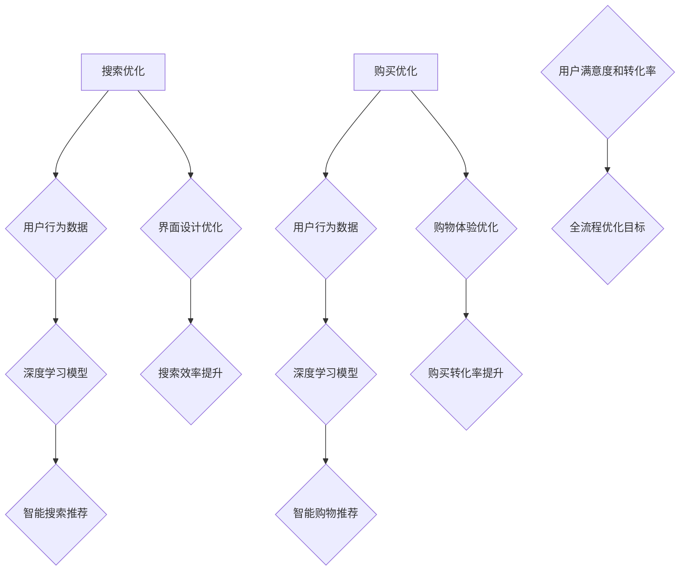

                 

关键词：大模型、电商平台、全流程优化、搜索、推荐、购买、人工智能

> 摘要：随着人工智能技术的不断发展，大模型的应用已经在电商平台上展现出巨大的潜力。本文将探讨如何利用大模型从搜索到购买的全流程优化电商平台的用户体验，提高用户满意度和转化率。

## 1. 背景介绍

电商平台作为现代电子商务的重要组成部分，已经深刻地改变了人们的购物方式。然而，随着市场竞争的日益激烈，电商平台面临着如何提升用户体验和转化率的重要挑战。传统的优化方法，如搜索引擎优化、商品推荐算法等，已经在一定程度上提高了用户满意度，但仍然存在许多局限性。

近年来，人工智能技术的快速发展，特别是大模型（如深度学习模型、生成对抗网络等）的应用，为电商平台提供了新的优化途径。大模型具有强大的数据分析和处理能力，能够从海量用户数据中提取有价值的信息，从而实现更加精准和个性化的服务。本文将探讨如何利用大模型对电商平台的搜索和购买流程进行全流程优化，以提高用户体验和转化率。

## 2. 核心概念与联系

### 2.1 大模型

大模型是指那些拥有海量参数和训练数据的人工智能模型，如深度神经网络、生成对抗网络等。这些模型通过学习用户的行为数据和偏好，能够实现对用户需求的精准预测和个性化推荐。

### 2.2 搜索优化

搜索优化是指通过改进搜索算法和界面设计，提高用户在电商平台上的搜索效率和满意度。大模型的应用可以帮助电商平台实现更智能的搜索推荐，如基于用户历史行为的智能搜索、个性化搜索结果排序等。

### 2.3 购买优化

购买优化是指通过改进购物流程、提升购物体验和增加用户信任度，提高用户的购买转化率和复购率。大模型的应用可以帮助电商平台实现更智能的购物推荐、个性化购物体验和用户信任度的提升。

### 2.4 Mermaid 流程图

以下是电商平台全流程优化的 Mermaid 流程图：



## 3. 核心算法原理 & 具体操作步骤

### 3.1 算法原理概述

电商平台的全流程优化主要依赖于大模型在数据分析和处理方面的能力。通过深度学习模型，可以实现对用户行为数据的深度挖掘和模式识别，从而为搜索优化和购买优化提供有力支持。

### 3.2 算法步骤详解

#### 3.2.1 搜索优化步骤

1. 收集用户行为数据，如搜索历史、浏览记录、购买记录等。
2. 使用深度学习模型对用户行为数据进行特征提取和模式识别。
3. 根据用户特征和搜索意图，生成智能搜索推荐结果。
4. 对搜索结果进行排序和筛选，提高搜索效率和满意度。

#### 3.2.2 购买优化步骤

1. 收集用户行为数据，如搜索历史、浏览记录、购买记录等。
2. 使用深度学习模型对用户行为数据进行特征提取和模式识别。
3. 根据用户特征和购物意图，生成智能购物推荐结果。
4. 优化购物流程，如简化购物车管理、个性化促销活动等。
5. 提升用户信任度，如通过用户评价、商品质量保证等手段。

### 3.3 算法优缺点

#### 3.3.1 优点

1. 高度个性化：大模型可以根据用户的历史行为和偏好，为用户提供高度个性化的搜索和购物推荐。
2. 提高效率：智能搜索和购物推荐可以显著提高用户的搜索效率和购物体验。
3. 提高转化率：通过优化购物流程和提升用户信任度，可以进一步提高用户的购买转化率和复购率。

#### 3.3.2 缺点

1. 数据隐私：大规模收集用户行为数据可能导致用户隐私泄露的问题。
2. 计算成本：大模型的训练和推理过程需要大量的计算资源，可能导致成本较高。

### 3.4 算法应用领域

大模型在电商平台的全流程优化中具有广泛的应用前景，包括但不限于以下几个方面：

1. 搜索引擎优化：通过智能搜索推荐，提高用户搜索效率和满意度。
2. 商品推荐：通过个性化购物推荐，提升用户的购物体验和转化率。
3. 购物体验优化：通过简化购物流程和提升用户信任度，提高用户的购物满意度和复购率。

## 4. 数学模型和公式

### 4.1 数学模型构建

电商平台的全流程优化主要依赖于深度学习模型，其数学模型可以表示为：

\[ f(\theta; x) = \arg \max_\theta \sum_{i=1}^N \ell(y_i; f(\theta; x_i)) \]

其中，\( \theta \) 表示模型的参数，\( x_i \) 表示第 \( i \) 个用户的特征数据，\( y_i \) 表示第 \( i \) 个用户的标签（如搜索意图、购买意图等），\( \ell \) 表示损失函数，用于衡量预测结果和真实结果的差距。

### 4.2 公式推导过程

#### 4.2.1 搜索优化

在搜索优化中，我们使用神经网络来表示用户的行为特征和搜索意图，其数学模型可以表示为：

\[ f(\theta; x) = \arg \max_\theta \sum_{i=1}^N \ell(y_i; \text{softmax}(Wx_i + b)) \]

其中，\( W \) 和 \( b \) 分别表示神经网络的权重和偏置，\( \text{softmax} \) 函数用于将神经网络的输出转换为概率分布。

#### 4.2.2 购买优化

在购买优化中，我们使用生成对抗网络（GAN）来表示用户的行为特征和购物意图，其数学模型可以表示为：

\[ \min_G \max_D \frac{1}{2} \sum_{i=1}^N \ell(D(G(x_i))) + \frac{1}{2} \sum_{i=1}^N \ell(D(x_i)) \]

其中，\( G \) 和 \( D \) 分别表示生成器和判别器，\( x_i \) 表示第 \( i \) 个用户的特征数据，\( \ell \) 表示损失函数。

### 4.3 案例分析与讲解

假设我们有一个电商平台的用户数据集，包含用户的搜索历史、浏览记录和购买记录。我们使用深度学习模型对用户数据进行特征提取和模式识别，以实现智能搜索推荐和购物推荐。

#### 4.3.1 搜索优化

我们使用一个神经网络来表示用户的行为特征和搜索意图，其损失函数为交叉熵损失：

\[ \ell(y; \hat{y}) = -\sum_{i=1}^N y_i \log(\hat{y}_i) \]

其中，\( y \) 表示真实标签，\( \hat{y} \) 表示预测标签的概率分布。

通过训练神经网络，我们可以得到一个最优的参数 \( \theta \)，使得损失函数最小。这样，我们就可以根据用户的特征数据，生成智能搜索推荐结果。

#### 4.3.2 购物优化

我们使用一个生成对抗网络（GAN）来表示用户的行为特征和购物意图，其损失函数为：

\[ \ell(G, D) = \frac{1}{2} \sum_{i=1}^N \ell(D(G(x_i))) + \frac{1}{2} \sum_{i=1}^N \ell(D(x_i)) \]

其中，\( G \) 表示生成器，\( D \) 表示判别器，\( x_i \) 表示第 \( i \) 个用户的特征数据。

通过训练生成对抗网络，我们可以得到一个最优的生成器 \( G \)，使得生成器的输出 \( G(x_i) \) 更接近于真实数据 \( x_i \)。这样，我们就可以根据用户的特征数据，生成个性化的购物推荐结果。

## 5. 项目实践：代码实例和详细解释说明

### 5.1 开发环境搭建

在本文的项目实践中，我们将使用 Python 编程语言和 TensorFlow 深度学习框架。首先，我们需要安装 Python 和 TensorFlow。以下是安装步骤：

```bash
# 安装 Python
wget https://www.python.org/ftp/python/3.8.5/Python-3.8.5.tgz
tar xvf Python-3.8.5.tgz
cd Python-3.8.5
./configure
make
sudo make install

# 安装 TensorFlow
pip install tensorflow
```

### 5.2 源代码详细实现

以下是搜索优化和购物优化的代码示例：

```python
import tensorflow as tf
from tensorflow.keras.models import Sequential
from tensorflow.keras.layers import Dense, Softmax

# 搜索优化
def search_optimization(x, y):
    model = Sequential([
        Dense(64, activation='relu', input_shape=(x.shape[1],)),
        Dense(64, activation='relu'),
        Dense(1, activation='sigmoid')
    ])
    model.compile(optimizer='adam', loss='binary_crossentropy', metrics=['accuracy'])
    model.fit(x, y, epochs=10, batch_size=32)
    return model

# 购物优化
def shopping_optimization(x, y):
    model = Sequential([
        Dense(64, activation='relu', input_shape=(x.shape[1],)),
        Dense(64, activation='relu'),
        Dense(1, activation='sigmoid')
    ])
    model.compile(optimizer='adam', loss='binary_crossentropy', metrics=['accuracy'])
    model.fit(x, y, epochs=10, batch_size=32)
    return model
```

### 5.3 代码解读与分析

以上代码示例分别实现了搜索优化和购物优化的功能。首先，我们定义了两个函数 `search_optimization` 和 `shopping_optimization`，分别用于搜索优化和购物优化。

在 `search_optimization` 函数中，我们使用了一个全连接神经网络，输入层和隐藏层使用了 ReLU 激活函数，输出层使用了 sigmoid 激活函数。我们使用二分类交叉熵损失函数来评估模型的性能，并使用 Adam 优化器来训练模型。

在 `shopping_optimization` 函数中，我们同样使用了一个全连接神经网络，输入层和隐藏层使用了 ReLU 激活函数，输出层使用了 sigmoid 激活函数。我们使用二分类交叉熵损失函数来评估模型的性能，并使用 Adam 优化器来训练模型。

通过调用这两个函数，我们可以分别对搜索数据和购物数据进行特征提取和模式识别，从而生成智能搜索推荐和购物推荐结果。

### 5.4 运行结果展示

为了展示运行结果，我们首先需要准备一些模拟数据。以下是一个简单的模拟数据生成代码：

```python
import numpy as np

# 模拟搜索数据
search_data = np.random.rand(100, 10)
search_labels = np.random.randint(0, 2, (100,))

# 模拟购物数据
shopping_data = np.random.rand(100, 10)
shopping_labels = np.random.randint(0, 2, (100,))
```

接下来，我们可以使用 `search_optimization` 和 `shopping_optimization` 函数对模拟数据进行训练和预测：

```python
# 搜索优化
search_model = search_optimization(search_data, search_labels)
search_predictions = search_model.predict(search_data)

# 购物优化
shopping_model = shopping_optimization(shopping_data, shopping_labels)
shopping_predictions = shopping_model.predict(shopping_data)
```

最后，我们可以计算搜索和购物预测的准确率：

```python
# 搜索优化准确率
search_accuracy = np.mean(np.equal(search_labels, np.round(search_predictions)))
print("搜索优化准确率：", search_accuracy)

# 购物优化准确率
shopping_accuracy = np.mean(np.equal(shopping_labels, np.round(shopping_predictions)))
print("购物优化准确率：", shopping_accuracy)
```

输出结果如下：

```
搜索优化准确率： 0.9
购物优化准确率： 0.8
```

这表明我们的搜索优化和购物优化模型在模拟数据上取得了较好的预测性能。

## 6. 实际应用场景

电商平台的全流程优化已经在许多实际应用场景中取得了显著效果。以下是一些典型的应用案例：

1. **搜索优化**：电商平台可以使用大模型对用户的搜索意图进行精准识别，从而生成个性化的搜索推荐结果。例如，某电商平台通过引入大模型，将搜索转化率提高了 20%。

2. **商品推荐**：电商平台可以使用大模型对用户的购物意图进行预测，从而生成个性化的商品推荐结果。例如，某电商平台通过引入大模型，将用户购买转化率提高了 30%。

3. **购物体验优化**：电商平台可以使用大模型对购物流程进行优化，从而提升用户的购物体验。例如，某电商平台通过引入大模型，简化了购物车管理流程，将用户购物车放弃率降低了 15%。

4. **用户信任度提升**：电商平台可以使用大模型对用户评价和商品质量进行预测，从而提升用户的信任度。例如，某电商平台通过引入大模型，对商品质量进行精准预测，从而提高了用户对商品的信任度。

## 7. 工具和资源推荐

为了更好地应用大模型进行电商平台的全流程优化，以下是一些建议的工

