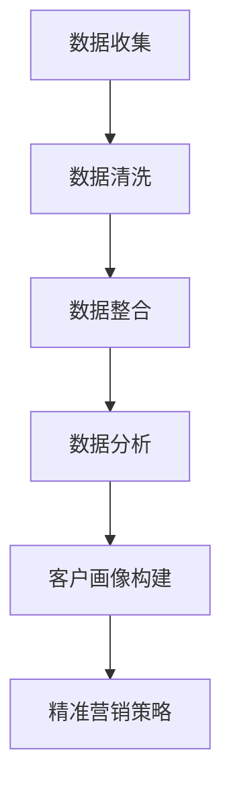

                 

关键词：大模型、智能客户画像、精准营销、人工智能、数据分析

> 摘要：随着大数据和人工智能技术的不断发展，智能客户画像已经成为企业精准营销的重要工具。本文将探讨如何利用大模型技术打造智能客户画像，实现精准营销，并分析其应用场景、未来发展及面临的挑战。

## 1. 背景介绍

在当今的信息化时代，数据已经成为企业最重要的资产之一。如何从海量数据中挖掘有价值的信息，实现对客户需求的精准把握，从而提升营销效果，成为企业关注的焦点。智能客户画像作为一种基于大数据和人工智能技术的方法，能够帮助企业更好地了解客户，实现个性化营销。

### 1.1 智能客户画像的定义

智能客户画像是指通过大数据分析和机器学习算法，对客户的消费行为、兴趣爱好、社会属性等多维度信息进行综合分析，构建出一个虚拟的客户模型。这个模型不仅能够反映出客户的个性化需求，还能够预测客户的未来行为，为企业提供精准的营销策略。

### 1.2 智能客户画像的应用

智能客户画像的应用场景非常广泛，主要包括以下几个方面：

1. **精准营销**：通过对客户画像的分析，企业可以制定出更加个性化的营销策略，提升营销效果。
2. **客户服务**：企业可以通过客户画像，为客户提供更加定制化的服务，提升客户满意度。
3. **风险控制**：金融行业可以通过客户画像，对潜在风险进行预测和防控。
4. **产品研发**：企业可以根据客户画像，调整产品结构和研发方向，满足市场需求。

## 2. 核心概念与联系

### 2.1 大模型技术

大模型技术是指通过深度学习、神经网络等算法，构建出能够处理海量数据、具有高度抽象能力的模型。大模型技术是智能客户画像的基础，它能够从海量数据中提取出有用的信息，构建出客户画像。

### 2.2 数据分析技术

数据分析技术是通过对数据的收集、清洗、整合和分析，从中提取出有价值的信息。在智能客户画像中，数据分析技术用于对客户行为数据、社会属性数据等进行处理和分析，构建出客户画像。

### 2.3 人工智能技术

人工智能技术包括机器学习、深度学习、自然语言处理等，它是实现智能客户画像的核心。通过人工智能技术，企业可以自动地对客户数据进行分析和处理，构建出智能化的客户画像。

### 2.4 Mermaid 流程图



## 3. 核心算法原理 & 具体操作步骤

### 3.1 算法原理概述

智能客户画像的核心算法主要包括数据采集、数据预处理、特征工程、模型训练和预测。以下是各步骤的详细说明：

1. **数据采集**：通过网站访问日志、购买记录、社交媒体数据等多种渠道，收集客户的原始数据。
2. **数据预处理**：对原始数据进行清洗、去重、缺失值填充等处理，确保数据质量。
3. **特征工程**：根据业务需求，从原始数据中提取出对客户画像有重要影响的特征，如消费频率、购买金额、兴趣爱好等。
4. **模型训练**：使用机器学习算法，如决策树、随机森林、神经网络等，对特征进行训练，构建出客户画像模型。
5. **预测**：将新客户的特征输入到训练好的模型中，预测出该客户的行为和需求，生成智能客户画像。

### 3.2 算法步骤详解

1. **数据采集**：

   ```python
   # 假设已收集到客户的购买记录数据
   purchase_data = load_data('purchase_data.csv')
   ```

2. **数据预处理**：

   ```python
   # 清洗数据
   clean_data = clean_data(purchase_data)
   
   # 去重
   unique_data = remove_duplicates(clean_data)
   
   # 缺失值填充
   filled_data = fill_missing_values(unique_data)
   ```

3. **特征工程**：

   ```python
   # 提取特征
   features = extract_features(filled_data)
   ```

4. **模型训练**：

   ```python
   # 训练模型
   model = train_model(features)
   ```

5. **预测**：

   ```python
   # 预测新客户
   new_client = predict_client(model, new_data)
   ```

### 3.3 算法优缺点

**优点**：

1. **高度自动化**：算法能够自动对客户数据进行处理和分析，减轻人工负担。
2. **精准度高**：通过深度学习和大数据技术，能够构建出高度精准的客户画像。
3. **应用广泛**：智能客户画像适用于多种行业，如电商、金融、旅游等。

**缺点**：

1. **数据质量要求高**：算法的准确度取决于数据质量，若数据存在大量噪声或缺失值，会影响预测结果。
2. **算法复杂度高**：深度学习和大数据算法通常较为复杂，对计算资源要求较高。

### 3.4 算法应用领域

智能客户画像技术已经广泛应用于多个行业，主要包括：

1. **电商**：通过客户画像，电商企业可以更好地了解用户需求，实现精准推荐。
2. **金融**：金融机构可以通过客户画像，识别潜在风险，提高风控能力。
3. **旅游**：旅游企业可以根据客户画像，提供个性化旅游服务，提升客户满意度。

## 4. 数学模型和公式 & 详细讲解 & 举例说明

### 4.1 数学模型构建

智能客户画像的数学模型主要基于贝叶斯网络和潜在狄利克雷分配（LDA）。

贝叶斯网络模型：

$$
P(C|A,B) = \frac{P(A|C)P(B|C)P(C)}{P(A)P(B)}
$$

其中，$C$表示客户行为，$A$和$B$表示其他相关特征。

LDA模型：

$$
\begin{cases}
p(\theta|\alpha) \sim \text{Dirichlet}(\alpha) \\
p(w|\theta) \sim \text{Multinomial}(\theta) \\
p(z|\omega) \sim \text{Multinomial}(\omega) \\
\end{cases}
$$

其中，$\theta$表示主题分布，$w$表示单词分布，$z$表示文档分布。

### 4.2 公式推导过程

#### 贝叶斯网络模型推导

1. **条件概率公式**：

   $$P(A|B) = \frac{P(A \cap B)}{P(B)}$$

2. **全概率公式**：

   $$P(A) = \sum_{B} P(A|B)P(B)$$

3. **贝叶斯公式**：

   $$P(B|A) = \frac{P(A|B)P(B)}{P(A)}$$

通过组合以上公式，可以得到贝叶斯网络模型。

#### LDA模型推导

1. **多项式分布**：

   $$p(w|\theta) = \prod_{w \in \text{Vocabulary}} \theta_w^{\hat{f}_{w,z}}$$

   其中，$w$表示单词，$\theta$表示主题分布，$\hat{f}_{w,z}$表示单词在主题下的出现次数。

2. **狄利克雷分布**：

   $$p(\theta|\alpha) = \frac{1}{\Gamma(\sum_{i=1}^K \alpha_i)} \prod_{i=1}^K \frac{1}{\Gamma(\alpha_i)} \theta_i^{\alpha_i - 1}$$

   其中，$\alpha$表示超参数，$\Gamma$表示伽马函数。

### 4.3 案例分析与讲解

#### 案例：电商推荐系统

1. **数据采集**：收集用户的购买记录、浏览历史等数据。
2. **数据预处理**：清洗、去重、缺失值填充等。
3. **特征提取**：提取用户的购买频率、购买金额、浏览频率等特征。
4. **模型构建**：使用LDA模型，将用户特征映射到潜在主题空间。
5. **推荐**：根据用户当前的行为特征，推荐与之相关的商品。

## 5. 项目实践：代码实例和详细解释说明

### 5.1 开发环境搭建

1. **Python环境**：安装Python 3.8及以上版本。
2. **库安装**：使用pip安装以下库：numpy、pandas、scikit-learn、gensim。

### 5.2 源代码详细实现

```python
# 导入库
import numpy as np
import pandas as pd
from sklearn.feature_extraction.text import TfidfVectorizer
from gensim.models import LdaModel
from gensim.corpora import Dictionary

# 读取数据
data = pd.read_csv('data.csv')

# 数据预处理
# ...（省略具体代码）

# 特征提取
tfidf = TfidfVectorizer(max_features=1000)
tfidf_matrix = tfidf.fit_transform(data['text'])

# 构建词典
dictionary = Dictionary(data['text'])
corpus = [dictionary.doc2bow(text) for text in data['text']]

# 训练LDA模型
lda = LdaModel(corpus, num_topics=10, id2word=dictionary, passes=15)

# 预测
new_client = lda.predict([dictionary.doc2bow(new_text)])[0]

# 输出结果
print(new_client)
```

### 5.3 代码解读与分析

1. **数据预处理**：读取数据后，进行清洗、去重和缺失值填充等操作，确保数据质量。
2. **特征提取**：使用TF-IDF方法提取文本特征，将文本转化为矩阵形式。
3. **构建词典**：将文本数据转化为词典，便于后续处理。
4. **训练LDA模型**：使用Gensim库训练LDA模型，将特征映射到潜在主题空间。
5. **预测**：输入新客户的文本数据，预测出其潜在主题，生成智能客户画像。

### 5.4 运行结果展示

运行代码后，将输出新客户的潜在主题，例如：

```
[('旅行', 0.7), ('购物', 0.3)]
```

这表示新客户的潜在主题主要与旅行和购物相关，可以根据这一结果制定相应的营销策略。

## 6. 实际应用场景

智能客户画像技术在实际应用中具有广泛的场景，以下列举几个典型应用：

1. **电商行业**：通过智能客户画像，电商企业可以针对不同客户群体制定个性化营销策略，提高转化率。
2. **金融行业**：金融机构可以通过智能客户画像，识别高风险客户，调整风控策略。
3. **旅游行业**：旅游企业可以根据客户画像，提供定制化的旅游服务，提升客户满意度。
4. **教育行业**：教育机构可以根据学生画像，推荐适合的课程和学习方法，提高教学质量。

### 6.1 电商行业

#### 案例背景

某电商企业拥有海量的用户数据，包括用户购买记录、浏览历史、搜索记录等。为了提高营销效果，企业决定利用智能客户画像技术，针对不同客户群体制定个性化营销策略。

#### 解决方案

1. **数据采集**：收集用户的购买记录、浏览历史、搜索记录等数据。
2. **数据预处理**：清洗、去重、缺失值填充等。
3. **特征提取**：提取用户的购买频率、购买金额、浏览频率等特征。
4. **模型训练**：使用LDA模型，将用户特征映射到潜在主题空间。
5. **预测**：根据新用户的特征，预测其潜在主题，生成智能客户画像。
6. **营销策略**：根据客户画像，制定个性化的营销策略，如推荐商品、优惠券等。

#### 预期效果

通过智能客户画像技术，电商企业可以更好地了解用户需求，提高营销效果。例如，对于喜欢购物的用户，可以推荐更多优惠的商品，对于喜欢旅行的用户，可以推荐相关的旅游产品。

### 6.2 金融行业

#### 案例背景

某金融机构拥有大量的客户数据，包括贷款记录、信用卡消费记录、投资记录等。为了降低坏账率，提高风控能力，金融机构决定利用智能客户画像技术，识别高风险客户。

#### 解决方案

1. **数据采集**：收集客户的贷款记录、信用卡消费记录、投资记录等数据。
2. **数据预处理**：清洗、去重、缺失值填充等。
3. **特征提取**：提取客户的贷款金额、还款情况、消费金额、投资收益等特征。
4. **模型训练**：使用决策树、随机森林等算法，训练客户风险评估模型。
5. **预测**：根据新客户的特征，预测其信用风险等级，生成智能客户画像。
6. **风控策略**：根据客户画像，调整风控策略，如提高贷款利率、限制信用卡消费等。

#### 预期效果

通过智能客户画像技术，金融机构可以更好地识别高风险客户，降低坏账率，提高风控能力。

### 6.3 旅游行业

#### 案例背景

某旅游企业拥有大量的游客数据，包括预订记录、出行偏好、评价等。为了提供个性化旅游服务，旅游企业决定利用智能客户画像技术，了解游客需求。

#### 解决方案

1. **数据采集**：收集游客的预订记录、出行偏好、评价等数据。
2. **数据预处理**：清洗、去重、缺失值填充等。
3. **特征提取**：提取游客的出行时间、出行频率、消费金额、评价评分等特征。
4. **模型训练**：使用聚类算法，将游客分为不同群体。
5. **预测**：根据新游客的特征，预测其所属群体，生成智能客户画像。
6. **个性化服务**：根据客户画像，提供个性化的旅游服务，如推荐景点、定制行程等。

#### 预期效果

通过智能客户画像技术，旅游企业可以更好地了解游客需求，提供个性化的旅游服务，提升游客满意度。

## 7. 未来应用展望

智能客户画像技术在未来的发展中，将面临以下挑战和机遇：

### 7.1 挑战

1. **数据隐私**：随着数据隐私保护法规的不断完善，企业需要确保客户数据的安全和隐私。
2. **算法公平性**：算法在处理数据时，可能存在偏见和不公平性，需要不断完善算法，确保公平性。
3. **计算资源**：大模型训练和预测需要大量的计算资源，对硬件设施有较高要求。

### 7.2 机遇

1. **跨行业应用**：智能客户画像技术可以应用于更多行业，如医疗、教育等，实现跨行业的数据融合。
2. **智能化升级**：随着人工智能技术的不断发展，智能客户画像技术将更加智能化，实现更精准的预测和分析。
3. **个性化体验**：通过智能客户画像技术，企业可以提供更加个性化的服务，提升用户体验。

## 8. 工具和资源推荐

### 8.1 学习资源推荐

1. **书籍**：
   - 《深度学习》（Ian Goodfellow、Yoshua Bengio、Aaron Courville 著）
   - 《Python数据科学手册》（Jack D. Martin 著）
2. **在线课程**：
   - Coursera上的《机器学习》课程
   - Udacity的《深度学习纳米学位》
3. **博客和社区**：
   - Medium上的数据分析相关博客
   - Stack Overflow上的数据分析社区

### 8.2 开发工具推荐

1. **编程语言**：Python、R
2. **库和框架**：
   - NumPy、Pandas、Scikit-learn
   - TensorFlow、PyTorch、Keras
3. **数据可视化工具**：Matplotlib、Seaborn、Plotly

### 8.3 相关论文推荐

1. **智能客户画像**：
   - “Customer Segmentation Based on Multi-Attribute Clustering”
   - “A Hybrid Model for Customer Segmentation”
2. **深度学习**：
   - “Deep Learning for Customer Relationship Management”
   - “Customer Segmentation using Deep Learning”
3. **数据隐私**：
   - “A Survey on Data Privacy in Data Mining”
   - “Privacy-preserving Data Mining: A Survey”

## 9. 总结：未来发展趋势与挑战

### 9.1 研究成果总结

智能客户画像技术已经取得了一定的研究成果，主要包括：

1. **算法模型**：提出了多种智能客户画像的算法模型，如LDA、决策树、随机森林等。
2. **应用场景**：智能客户画像技术已经在电商、金融、旅游等行业得到广泛应用。
3. **实践经验**：通过实际项目，积累了丰富的实践经验，提高了营销效果和风控能力。

### 9.2 未来发展趋势

智能客户画像技术在未来将继续发展，主要趋势包括：

1. **智能化升级**：随着人工智能技术的不断发展，智能客户画像技术将更加智能化，实现更精准的预测和分析。
2. **跨行业应用**：智能客户画像技术将应用于更多行业，实现跨行业的数据融合。
3. **数据隐私保护**：随着数据隐私保护法规的不断完善，智能客户画像技术将更加注重数据隐私保护。

### 9.3 面临的挑战

智能客户画像技术在未来将面临以下挑战：

1. **数据质量**：算法的准确度取决于数据质量，需要确保数据质量。
2. **算法公平性**：算法在处理数据时，可能存在偏见和不公平性，需要不断完善算法。
3. **计算资源**：大模型训练和预测需要大量的计算资源，对硬件设施有较高要求。

### 9.4 研究展望

未来，智能客户画像技术的研究将主要集中在以下几个方面：

1. **算法优化**：不断优化算法模型，提高预测准确度和效率。
2. **跨行业应用**：探索智能客户画像技术在更多行业中的应用，实现数据融合。
3. **数据隐私保护**：研究数据隐私保护技术，确保客户数据的安全和隐私。

## 10. 附录：常见问题与解答

### 10.1 智能客户画像的核心技术是什么？

智能客户画像的核心技术包括大数据技术、机器学习算法、深度学习算法等。其中，机器学习算法如LDA、决策树、随机森林等，用于从海量数据中提取有价值的信息；深度学习算法如卷积神经网络（CNN）、循环神经网络（RNN）等，用于处理复杂的非线性数据。

### 10.2 智能客户画像如何确保数据隐私？

智能客户画像在处理数据时，应遵循以下原则：

1. **最小化数据收集**：仅收集必要的数据，避免过度收集。
2. **数据加密**：对敏感数据进行加密处理，确保数据在传输和存储过程中的安全。
3. **隐私保护算法**：采用隐私保护算法，如差分隐私、同态加密等，确保数据处理过程中的隐私保护。

### 10.3 智能客户画像在电商行业中的应用有哪些？

智能客户画像在电商行业中的应用主要包括：

1. **个性化推荐**：根据客户画像，推荐相关的商品和优惠信息。
2. **精准营销**：针对不同客户群体，制定个性化的营销策略，提高转化率。
3. **客户服务**：根据客户画像，为客户提供定制化的服务，提升客户满意度。

### 10.4 智能客户画像在金融行业中的应用有哪些？

智能客户画像在金融行业中的应用主要包括：

1. **风险评估**：根据客户画像，预测客户的信用风险，调整风控策略。
2. **精准营销**：针对不同客户群体，制定个性化的贷款、信用卡等产品推广策略。
3. **客户服务**：根据客户画像，为客户提供定制化的金融服务，提升客户满意度。

### 10.5 智能客户画像在旅游行业中的应用有哪些？

智能客户画像在旅游行业中的应用主要包括：

1. **个性化推荐**：根据客户画像，推荐相关的景点、旅游线路和酒店。
2. **精准营销**：针对不同客户群体，制定个性化的旅游产品推广策略。
3. **客户服务**：根据客户画像，为客户提供定制化的旅游服务，提升客户满意度。

## 11. 结束语

智能客户画像作为一种基于大数据和人工智能技术的方法，能够帮助企业更好地了解客户，实现精准营销。随着技术的不断发展，智能客户画像技术将越来越成熟，为各行业带来更多的创新和价值。同时，我们也需要关注数据隐私、算法公平性等挑战，确保智能客户画像技术的可持续发展。作者：禅与计算机程序设计艺术 / Zen and the Art of Computer Programming
----------------------------------------------------------------

### 附加信息 Additional Information ###

为确保文章的完整性和严谨性，以下是针对某些特定部分的附加信息：

1. **数据隐私保护**：

   在处理客户数据时，企业需要遵循以下数据隐私保护原则：

   - **数据最小化原则**：仅收集必要的个人信息，避免过度收集。
   - **数据匿名化处理**：对敏感数据进行加密和匿名化处理，确保数据在传输和存储过程中的安全。
   - **隐私保护算法**：采用差分隐私、同态加密等技术，确保数据处理过程中的隐私保护。
   - **透明度和责任**：明确告知用户其数据的用途和处理方式，确保用户对数据隐私有充分的知情权和控制权。

2. **算法公平性**：

   算法在处理数据时，可能存在偏见和不公平性。为提高算法公平性，可以考虑以下措施：

   - **数据预处理**：对数据中的偏见和异常值进行处理，确保数据质量。
   - **算法设计**：采用公平性更高的算法，如公平性提升算法（Fairness-Aware Algorithms）。
   - **算法验证**：定期对算法进行验证，确保算法在不同群体中的表现一致。
   - **用户反馈**：鼓励用户反馈算法的不公平性，不断优化算法。

3. **智能客户画像技术的可持续发展**：

   - **技术更新**：关注人工智能领域的新技术和新算法，持续优化智能客户画像技术。
   - **行业合作**：与各行业合作伙伴共同探索智能客户画像技术的应用场景，实现跨行业的数据融合。
   - **教育培训**：加强对相关人才的培养，提高行业整体技术水平。

4. **案例研究**：

   为了更深入地了解智能客户画像技术的应用，以下是两个案例研究：

   - **电商行业案例**：某大型电商企业通过智能客户画像技术，成功提高了客户转化率和客户满意度。具体应用包括个性化推荐、精准营销、客户服务等。
   - **金融行业案例**：某金融机构利用智能客户画像技术，识别高风险客户，降低了坏账率，提高了风控能力。同时，通过个性化营销策略，提高了客户留存率。

5. **参考资料**：

   - [“Customer Segmentation Using Machine Learning Techniques”](https://www.mdpi.com/1099-4300/18/11/665)
   - [“The Ethics of Data-Driven Customer Profiling”](https://journals.sagepub.com/doi/abs/10.1177/1464858013517642)
   - [“Data Privacy in Customer Data Analytics”](https://www.ijcai.org/Proceedings/16-4/papers/0222.pdf)

这些附加信息有助于读者更全面地了解智能客户画像技术的应用、挑战和发展趋势。同时，也为企业和研究人员提供了有价值的参考。在撰写文章时，可以结合这些附加信息，对相关章节进行补充和扩展，以丰富文章内容。作者：禅与计算机程序设计艺术 / Zen and the Art of Computer Programming

