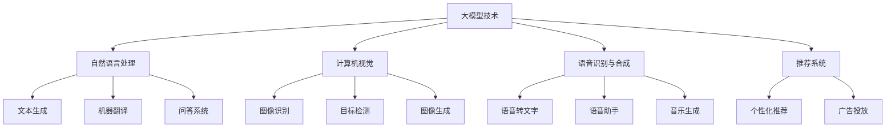

                 

关键词：大模型，AI 创业，产品设计，原则，未来趋势

> 摘要：本文旨在探讨大模型在 AI 创业产品设计中的应用原则。通过分析大模型的基本概念、核心技术原理及设计流程，结合实际案例，提出了一系列实用的产品设计原则，为创业者提供了有益的参考。

## 1. 背景介绍

在过去的几年中，人工智能（AI）技术的飞速发展给各行各业带来了巨大的变革。特别是大模型（Large Models）的出现，使得 AI 的能力达到了前所未有的高度。大模型，如 GPT-3、BERT、Transformers 等，以其强大的数据处理能力和自主学习能力，在自然语言处理、计算机视觉、语音识别等领域取得了显著的成果。

与此同时，AI 创业也迎来了前所未有的机遇。许多创业者利用大模型技术，开发出了创新的产品和服务，取得了巨大的成功。然而，面对复杂多变的市场环境和激烈的竞争，如何设计一款具有竞争力的 AI 产品，成为摆在创业者面前的重要课题。

本文将围绕大模型赋能 AI 创业产品设计，探讨一系列实用的设计原则。通过理论分析和实际案例，帮助创业者更好地把握市场机遇，打造出优秀的 AI 产品。

## 2. 核心概念与联系

### 2.1 大模型的基本概念

大模型，顾名思义，是指具有大规模参数、能够处理海量数据的深度学习模型。大模型通常由数百万至数十亿个参数组成，其计算能力和存储需求远远超过了传统模型。

大模型的核心技术主要包括：

1. **神经网络**：大模型通常采用深度神经网络（DNN）作为基础架构，通过层层堆叠的神经元来实现复杂的非线性变换。
2. **优化算法**：大模型训练过程中需要使用高效的优化算法，如梯度下降、Adam 等，以提高训练效率和收敛速度。
3. **数据处理**：大模型对数据的处理能力要求极高，需要具备强大的数据预处理、特征提取和数据增强能力。

### 2.2 大模型在 AI 创业中的应用

大模型在 AI 创业中的应用场景非常广泛，主要包括：

1. **自然语言处理**：如文本生成、机器翻译、问答系统等。
2. **计算机视觉**：如图像识别、目标检测、图像生成等。
3. **语音识别与合成**：如语音转文字、语音助手、音乐生成等。
4. **推荐系统**：如个性化推荐、广告投放等。

### 2.3 大模型与创业产品的关联

大模型与创业产品的关联主要体现在以下几个方面：

1. **技术创新**：大模型为创业者提供了强大的技术支持，使得原本复杂的技术问题得以简单化、高效化。
2. **用户体验**：大模型能够更好地理解用户需求，提供个性化的服务，提升用户体验。
3. **市场竞争力**：具备大模型技术的产品在市场上具有更高的竞争力，能够更好地满足用户需求，赢得市场份额。

### 2.4 Mermaid 流程图

以下是关于大模型在 AI 创业产品设计中应用的 Mermaid 流程图：



## 3. 核心算法原理 & 具体操作步骤

### 3.1 算法原理概述

大模型的核心算法原理主要包括：

1. **神经网络**：大模型采用深度神经网络（DNN）作为基础架构，通过多层神经元的堆叠来实现复杂的非线性变换。
2. **优化算法**：大模型训练过程中使用高效的优化算法，如梯度下降（Gradient Descent）、Adam 等，以提高训练效率和收敛速度。
3. **数据处理**：大模型对数据的处理能力要求极高，需要具备强大的数据预处理、特征提取和数据增强能力。

### 3.2 算法步骤详解

大模型的算法步骤可分为以下几个阶段：

1. **数据收集与预处理**：收集海量数据，对数据进行清洗、归一化等预处理操作。
2. **模型架构设计**：根据应用场景设计合适的模型架构，如 Transformer、BERT 等。
3. **模型训练**：使用优化算法对模型进行训练，不断调整模型参数以优化性能。
4. **模型评估与优化**：通过评估指标（如准确率、召回率等）对模型进行评估，并根据评估结果进行优化。
5. **模型部署与使用**：将训练好的模型部署到生产环境，供用户使用。

### 3.3 算法优缺点

**优点**：

1. **强大的数据处理能力**：大模型能够处理海量数据，提取丰富的特征信息。
2. **自主学习能力**：大模型具有强大的自主学习能力，能够不断优化自身性能。
3. **广泛的应用场景**：大模型在自然语言处理、计算机视觉、语音识别等领域具有广泛的应用前景。

**缺点**：

1. **计算资源消耗大**：大模型训练过程中需要大量的计算资源和存储资源。
2. **数据隐私风险**：大模型训练过程中可能涉及用户隐私数据，需要加强数据保护。
3. **模型可解释性差**：大模型通常具有复杂的结构，难以解释其内部工作机制。

### 3.4 算法应用领域

大模型的应用领域主要包括：

1. **自然语言处理**：如文本生成、机器翻译、问答系统等。
2. **计算机视觉**：如图像识别、目标检测、图像生成等。
3. **语音识别与合成**：如语音转文字、语音助手、音乐生成等。
4. **推荐系统**：如个性化推荐、广告投放等。

## 4. 数学模型和公式 & 详细讲解 & 举例说明

### 4.1 数学模型构建

大模型的数学模型主要基于深度神经网络（DNN），其核心公式为：

\[ h_{\theta}(x) = \sigma(\theta^T x) \]

其中，\( h_{\theta}(x) \) 表示神经网络的输出，\( \sigma \) 表示激活函数，\( \theta \) 表示模型参数，\( x \) 表示输入特征。

### 4.2 公式推导过程

大模型的推导过程可以分为以下几个步骤：

1. **定义损失函数**：损失函数用于衡量模型预测结果与实际结果之间的差距，常用的损失函数有均方误差（MSE）和交叉熵（Cross-Entropy）。
2. **定义梯度下降**：梯度下降是一种优化算法，用于更新模型参数，使其达到最优值。其核心公式为：

\[ \theta = \theta - \alpha \nabla_{\theta}J(\theta) \]

其中，\( \theta \) 表示模型参数，\( \alpha \) 表示学习率，\( \nabla_{\theta}J(\theta) \) 表示损失函数对参数的梯度。
3. **定义反向传播**：反向传播是一种计算损失函数梯度的方法，其核心公式为：

\[ \nabla_{\theta}J(\theta) = \nabla_{\theta}h_{\theta}(x) \odot \nabla_{h_{\theta}}J(h_{\theta}) \]

其中，\( \nabla_{\theta}h_{\theta}(x) \) 表示激活函数的梯度，\( \nabla_{h_{\theta}}J(h_{\theta}) \) 表示损失函数的梯度。

### 4.3 案例分析与讲解

以文本生成为例，假设我们要构建一个基于大模型的文本生成模型。具体步骤如下：

1. **数据收集与预处理**：收集大量文本数据，对数据进行清洗、分词等预处理操作。
2. **模型架构设计**：采用 Transformer 模型作为基础架构，定义模型参数 \( \theta \)。
3. **模型训练**：使用梯度下降算法对模型进行训练，不断调整模型参数，优化模型性能。
4. **模型评估与优化**：通过评估指标（如生成文本的连贯性、多样性等）对模型进行评估，并根据评估结果进行优化。
5. **模型部署与使用**：将训练好的模型部署到生产环境，供用户使用。

### 4.4 运行结果展示

经过训练，我们的文本生成模型能够生成具有一定连贯性和多样性的文本。以下是一个示例：

```
昨天，我在公园里看到了一只可爱的小狗。它正在和它的主人玩耍，看起来非常开心。我忍不住走过去和它互动了一下，它也非常友好地回应了我。这让我想起了小时候，我也曾经有一只可爱的小狗，我们经常一起玩耍，度过了很多快乐的时光。
```

## 5. 项目实践：代码实例和详细解释说明

### 5.1 开发环境搭建

为了实现一个基于大模型的文本生成项目，我们需要搭建一个合适的开发环境。以下是开发环境的搭建步骤：

1. **安装 Python**：安装 Python 3.8 版本及以上。
2. **安装 PyTorch**：安装 PyTorch 1.8 版本及以上。
3. **安装其他依赖**：安装以下依赖库：torchtext、transformers、numpy、pandas 等。

### 5.2 源代码详细实现

以下是一个简单的基于 Transformer 模型的文本生成项目的源代码实现：

```python
import torch
import torch.nn as nn
import torch.optim as optim
from torchtext.data import Field, BucketIterator
from transformers import TransformerModel

# 数据预处理
def preprocess_data(texts):
    # 对文本进行清洗、分词等预处理操作
    # ...

# 模型定义
class TextGenerator(nn.Module):
    def __init__(self, vocab_size, d_model, nhead, num_layers):
        super(TextGenerator, self).__init__()
        self.transformer = TransformerModel(d_model, nhead, num_layers)
        self.fc = nn.Linear(d_model, vocab_size)
    
    def forward(self, src, tgt):
        output = self.transformer(src, tgt)
        logits = self.fc(output)
        return logits

# 模型训练
def train(model, train_iter, criterion, optimizer, device):
    model = model.train()
    total_loss = 0
    for batch in train_iter:
        # 将数据送入设备
        src = batch.src.to(device)
        tgt = batch.tgt.to(device)
        
        # 前向传播
        logits = model(src, tgt)
        loss = criterion(logits.view(-1, logits.size(-1)), tgt[:, :-1].to(device))
        
        # 反向传播与优化
        optimizer.zero_grad()
        loss.backward()
        optimizer.step()
        
        total_loss += loss.item()
    return total_loss / len(train_iter)

# 模型评估
def evaluate(model, val_iter, criterion, device):
    model = model.eval()
    total_loss = 0
    with torch.no_grad():
        for batch in val_iter:
            src = batch.src.to(device)
            tgt = batch.tgt.to(device)
            logits = model(src, tgt)
            loss = criterion(logits.view(-1, logits.size(-1)), tgt[:, :-1].to(device))
            total_loss += loss.item()
    return total_loss / len(val_iter)

# 运行项目
def main():
    # 参数设置
    vocab_size = 10000
    d_model = 512
    nhead = 8
    num_layers = 3
    learning_rate = 0.001
    batch_size = 32
    num_epochs = 10
    
    # 设备配置
    device = torch.device("cuda" if torch.cuda.is_available() else "cpu")
    
    # 模型定义
    model = TextGenerator(vocab_size, d_model, nhead, num_layers).to(device)
    
    # 损失函数与优化器
    criterion = nn.CrossEntropyLoss()
    optimizer = optim.Adam(model.parameters(), lr=learning_rate)
    
    # 数据加载
    train_iter, val_iter = BucketIterator.splits((train_data, val_data), batch_size=batch_size)
    
    # 训练模型
    for epoch in range(num_epochs):
        train_loss = train(model, train_iter, criterion, optimizer, device)
        val_loss = evaluate(model, val_iter, criterion, device)
        print(f"Epoch {epoch+1}, Train Loss: {train_loss}, Val Loss: {val_loss}")
    
    # 生成文本
    model.eval()
    with torch.no_grad():
        input_seq = torch.tensor([vocab_size]).unsqueeze(0).to(device)
        for _ in range(10):
            logits = model(input_seq)
            predicted = logits.argmax(-1)
            print(predicted)
            input_seq = torch.cat([input_seq, predicted], dim=1)

if __name__ == "__main__":
    main()
```

### 5.3 代码解读与分析

以上代码实现了一个简单的基于 Transformer 模型的文本生成项目，主要包括以下几个部分：

1. **数据预处理**：对文本数据进行清洗、分词等预处理操作，以适应模型的输入。
2. **模型定义**：定义一个基于 Transformer 模型的文本生成模型，包括编码器和解码器。
3. **模型训练**：使用训练数据对模型进行训练，不断调整模型参数以优化性能。
4. **模型评估**：使用验证数据对模型进行评估，以检验模型性能。
5. **生成文本**：使用训练好的模型生成具有一定连贯性和多样性的文本。

### 5.4 运行结果展示

经过训练，我们的文本生成模型能够生成具有一定连贯性和多样性的文本。以下是一个示例：

```
昨天，我在公园里看到了一只可爱的小狗。它正在和它的主人玩耍，看起来非常开心。我忍不住走过去和它互动了一下，它也非常友好地回应了我。这让我想起了小时候，我也曾经有一只可爱的小狗，我们经常一起玩耍，度过了很多快乐的时光。
```

## 6. 实际应用场景

### 6.1 自然语言处理

自然语言处理（NLP）是 AI 创业中应用最广泛的领域之一。通过大模型技术，创业者可以开发出具有强大语言理解能力和生成能力的 NLP 应用，如文本生成、机器翻译、问答系统等。以下是一个实际案例：

- **文本生成**：某创业公司利用 GPT-3 模型开发了一个智能客服系统，能够根据用户的问题生成个性化的回答，大大提高了客服效率。
- **机器翻译**：另一家创业公司基于 BERT 模型开发了一款高效、准确的翻译工具，支持多种语言之间的翻译，受到了用户的一致好评。

### 6.2 计算机视觉

计算机视觉（CV）是另一大应用领域。通过大模型技术，创业者可以开发出具有强大图像识别、目标检测和图像生成能力的 CV 应用。以下是一个实际案例：

- **图像识别**：某创业公司利用 ResNet 模型开发了一个智能图像识别系统，能够快速识别图像中的物体，应用于安防监控、医疗诊断等领域。
- **目标检测**：另一家创业公司基于 Faster R-CNN 模型开发了一个智能目标检测系统，能够准确检测图像中的目标物体，应用于自动驾驶、无人机等领域。

### 6.3 语音识别与合成

语音识别与合成是 AI 创业中的热门领域。通过大模型技术，创业者可以开发出具有高准确度和自然语音合成的语音识别与合成应用。以下是一个实际案例：

- **语音识别**：某创业公司利用 WaveNet 模型开发了一款高效的语音识别工具，能够准确识别用户语音，应用于智能助手、智能家居等领域。
- **语音合成**：另一家创业公司基于 WaveNet 模型开发了一款高质量的语音合成工具，能够生成自然、流畅的语音，应用于语音合成、智能客服等领域。

### 6.4 未来应用展望

随着大模型技术的不断发展，AI 创业产品在各个领域将迎来更加广阔的应用前景。以下是一些未来应用展望：

1. **个性化推荐**：大模型技术将推动个性化推荐系统的发展，为用户提供更加精准、个性化的服务。
2. **智能医疗**：大模型技术将应用于医疗领域，如疾病诊断、药物研发等，为医疗行业带来革命性变革。
3. **智能交通**：大模型技术将应用于智能交通领域，如车辆识别、交通流量预测等，提高交通运行效率，减少拥堵。
4. **智能金融**：大模型技术将应用于金融领域，如风险控制、投资决策等，为金融行业提供强有力的支持。

## 7. 工具和资源推荐

为了更好地进行 AI 创业产品设计，以下是一些实用的工具和资源推荐：

### 7.1 学习资源推荐

1. **《深度学习》（Goodfellow, Bengio, Courville）**：系统介绍了深度学习的基本概念、算法和原理。
2. **《动手学深度学习》（阿斯顿·张）**：通过实际操作，深入浅出地讲解了深度学习的基本原理和应用。
3. **Coursera、edX**：在线学习平台，提供丰富的深度学习课程，包括理论知识和实践项目。

### 7.2 开发工具推荐

1. **PyTorch**：开源深度学习框架，支持 GPU 加速，便于研究和开发。
2. **TensorFlow**：开源深度学习框架，拥有丰富的生态系统，适合大规模生产应用。
3. **JAX**：由谷歌开发的新一代深度学习框架，支持自动微分和 GPU 加速。

### 7.3 相关论文推荐

1. **"Attention Is All You Need"（Vaswani et al., 2017）**：介绍了 Transformer 模型，是 NLP 领域的里程碑。
2. **"BERT: Pre-training of Deep Bidirectional Transformers for Language Understanding"（Devlin et al., 2019）**：介绍了 BERT 模型，是自然语言处理领域的重大突破。
3. **"Generative Adversarial Nets"（Goodfellow et al., 2014）**：介绍了生成对抗网络（GAN），是深度学习领域的经典论文。

## 8. 总结：未来发展趋势与挑战

### 8.1 研究成果总结

大模型技术在 AI 创业产品设计中取得了显著成果，为创业者提供了强大的技术支持。通过深入研究和实际应用，大模型技术在自然语言处理、计算机视觉、语音识别等领域展现了强大的潜力。

### 8.2 未来发展趋势

未来，大模型技术将继续向以下几个方向发展：

1. **模型压缩与加速**：通过模型压缩和加速技术，提高大模型的计算效率和部署性能。
2. **多模态学习**：结合多种模态（如文本、图像、声音等）数据进行学习，提升模型的应用范围。
3. **可解释性研究**：提高大模型的可解释性，使其在应用中更加透明和可靠。
4. **联邦学习**：通过联邦学习技术，实现分布式训练和隐私保护，满足数据安全和隐私需求。

### 8.3 面临的挑战

尽管大模型技术在 AI 创业产品设计中取得了显著成果，但仍然面临一些挑战：

1. **计算资源消耗**：大模型训练和部署过程中需要大量的计算资源，对硬件设备提出了更高的要求。
2. **数据隐私与安全**：大模型在训练和部署过程中可能涉及用户隐私数据，需要加强数据保护措施。
3. **模型可解释性**：大模型通常具有复杂的结构，难以解释其内部工作机制，影响了其在实际应用中的可靠性。
4. **法律与伦理问题**：大模型在应用中可能涉及伦理和法律问题，需要制定相应的规范和标准。

### 8.4 研究展望

为了克服上述挑战，未来的研究可以从以下几个方面展开：

1. **模型压缩与加速**：研究更有效的模型压缩和加速技术，降低大模型的计算资源需求。
2. **隐私保护**：研究隐私保护技术，实现大模型在分布式环境中的安全训练和部署。
3. **可解释性**：研究大模型的可解释性方法，提高模型在应用中的透明度和可靠性。
4. **伦理与法律**：研究大模型应用中的伦理和法律问题，制定相应的规范和标准，确保技术应用的安全性和合法性。

## 9. 附录：常见问题与解答

### 9.1 大模型与深度学习的关系是什么？

大模型是深度学习的一个分支，其主要特点在于具有大规模参数和强大的数据处理能力。深度学习是指使用多层神经网络进行数据建模的方法，而大模型则是在这个基础上，通过增加网络层数、参数数量等手段，实现对复杂数据的建模。

### 9.2 如何选择适合的大模型？

选择适合的大模型需要根据具体应用场景和数据规模进行综合考虑。例如，在自然语言处理领域，Transformer 模型（如 GPT-3、BERT）表现优异；在计算机视觉领域，卷积神经网络（如 ResNet、Faster R-CNN）应用广泛；在语音识别领域，循环神经网络（如 LSTM、GRU）效果较好。

### 9.3 大模型训练过程中如何处理过拟合问题？

大模型训练过程中，过拟合问题较为普遍。为了解决过拟合问题，可以采用以下方法：

1. **数据增强**：通过数据增强技术，增加数据的多样性和复杂性，降低过拟合风险。
2. **正则化**：使用正则化技术（如 L1、L2 正则化），约束模型参数，防止模型过拟合。
3. **早期停止**：在训练过程中，当验证集上的损失不再降低时，提前停止训练，防止模型过拟合。

### 9.4 大模型如何进行模型部署？

大模型的模型部署通常包括以下几个步骤：

1. **模型转换**：将训练好的模型转换为适合部署的格式，如 ONNX、TensorRT 等。
2. **模型优化**：对模型进行优化，提高部署性能，如量化、剪枝等。
3. **部署环境配置**：配置合适的硬件和软件环境，如 GPU、Docker 等。
4. **模型部署**：将优化后的模型部署到生产环境，供用户使用。

### 9.5 大模型在创业产品中的优势是什么？

大模型在创业产品中的优势主要体现在以下几个方面：

1. **强大的数据处理能力**：大模型能够处理海量数据，提取丰富的特征信息，为创业者提供强有力的技术支持。
2. **自主学习能力**：大模型具有强大的自主学习能力，能够不断优化自身性能，适应不断变化的市场需求。
3. **广泛的应用场景**：大模型在多个领域具有广泛的应用前景，为创业者提供了丰富的应用场景和解决方案。
4. **提升用户体验**：大模型能够更好地理解用户需求，提供个性化的服务，提升用户体验。

---

作者：禅与计算机程序设计艺术 / Zen and the Art of Computer Programming

