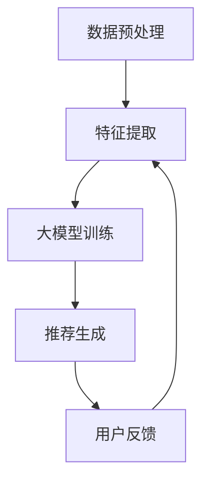

                 

 关键词：推荐系统，冷启动问题，大模型辅助，算法原理，数学模型，项目实践，实际应用场景，未来展望

## 摘要

本文旨在探讨推荐系统中的冷启动问题，特别是在大模型辅助下的解决方案。冷启动问题是指在用户或物品信息不足的情况下，推荐系统难以提供有效的个性化推荐。为了解决这一问题，本文将介绍大模型辅助推荐系统的核心概念、算法原理、数学模型，并通过实际项目实践进行详细解读。此外，文章还将分析冷启动问题的实际应用场景，并展望未来的发展趋势与挑战。

## 1. 背景介绍

推荐系统已经成为互联网服务中不可或缺的一部分。从电子商务到社交媒体，从视频流媒体到新闻推荐，推荐系统通过分析用户的行为和偏好，为用户提供个性化的内容推荐。然而，推荐系统面临的冷启动问题却是一个长期困扰学术界和工业界的重要难题。

冷启动问题主要分为用户冷启动和物品冷启动两种情况。用户冷启动指的是在用户刚加入系统或信息不足时，系统难以提供准确的个性化推荐。物品冷启动则是在新物品进入系统，缺乏用户评价和交互时，系统难以为新物品生成有效的推荐。无论是用户冷启动还是物品冷启动，都会影响推荐系统的用户体验和效果。

传统的解决方法包括基于内容的方法、协同过滤方法以及混合方法等。然而，这些方法在处理冷启动问题时存在一定的局限性。随着深度学习和大数据技术的发展，大模型辅助的推荐系统逐渐成为解决冷启动问题的有力工具。

本文将首先介绍大模型辅助推荐系统的核心概念，然后深入探讨其算法原理和数学模型，并通过实际项目实践展示大模型在解决冷启动问题中的应用效果。最后，本文将分析冷启动问题的实际应用场景，并探讨未来的发展趋势与挑战。

## 2. 核心概念与联系

### 2.1 大模型辅助推荐系统的定义

大模型辅助推荐系统是指利用大型深度学习模型，如神经网络、循环神经网络（RNN）、长短时记忆网络（LSTM）等，对用户行为和物品特征进行建模，从而实现高效且准确的个性化推荐。这些大模型具有强大的数据处理能力和学习能力，能够在缺乏用户或物品信息的情况下，通过已有数据生成有效的推荐。

### 2.2 大模型辅助推荐系统的优势

大模型辅助推荐系统具有以下优势：

1. **强大的数据处理能力**：大模型可以处理大量的用户行为数据，挖掘出用户潜在的兴趣偏好。
2. **自适应学习**：大模型可以实时学习用户行为，动态调整推荐策略，提高推荐效果。
3. **泛化能力强**：大模型能够从已有的数据中学习到普遍规律，为新用户和新物品生成有效的推荐。

### 2.3 大模型辅助推荐系统的架构

大模型辅助推荐系统的架构通常包括以下几个部分：

1. **数据预处理模块**：对原始数据进行清洗、去噪、编码等预处理，以便大模型能够更好地学习。
2. **特征提取模块**：通过特征工程提取用户行为和物品特征，如用户浏览记录、购买记录、物品标签等。
3. **大模型训练模块**：使用预处理后的数据对大模型进行训练，使其学会从数据中提取有用信息。
4. **推荐生成模块**：利用训练好的大模型生成个性化推荐结果。

### 2.4 Mermaid 流程图

以下是一个简单的大模型辅助推荐系统流程图的 Mermaid 表示：



### 2.5 核心概念原理与联系

大模型辅助推荐系统的核心概念包括：

1. **用户行为建模**：通过分析用户的历史行为，如浏览、购买、搜索等，建立用户兴趣偏好模型。
2. **物品特征表示**：通过提取物品的属性、标签、文本描述等信息，建立物品特征表示模型。
3. **交互反馈机制**：通过用户的点击、购买等行为反馈，不断优化和调整推荐模型。

这些概念相互联系，共同构成一个大模型辅助推荐系统的完整框架。

## 3. 核心算法原理 & 具体操作步骤

### 3.1 算法原理概述

大模型辅助推荐系统的核心算法通常是基于深度学习的。以下介绍几种常见的深度学习算法原理：

1. **神经网络（Neural Network）**：神经网络是一种通过多层非线性变换进行数据处理的模型，可以模拟人类大脑的神经元结构和工作原理。
2. **循环神经网络（Recurrent Neural Network, RNN）**：RNN 是一种处理序列数据的神经网络，特别适合用于处理用户行为序列。
3. **长短时记忆网络（Long Short-Term Memory, LSTM）**：LSTM 是 RNN 的一种变体，能够解决 RNN 的长期依赖问题，更好地捕获用户行为中的时间信息。

### 3.2 算法步骤详解

1. **数据收集**：收集用户行为数据（如浏览、购买、搜索等）和物品属性数据（如分类、标签、描述等）。
2. **数据预处理**：对原始数据进行清洗、去噪、编码等预处理操作，如缺失值填充、异常值处理、特征缩放等。
3. **特征提取**：通过特征工程提取用户行为特征和物品特征，如用户行为序列、物品属性向量等。
4. **模型训练**：使用预处理后的数据对神经网络、RNN 或 LSTM 模型进行训练。
5. **模型评估**：使用交叉验证等方法评估模型的性能，如准确率、召回率、F1 值等。
6. **推荐生成**：利用训练好的模型生成个性化推荐结果，如推荐列表、推荐分数等。
7. **交互反馈**：收集用户对推荐结果的反馈，如点击、购买等，用于优化和调整模型。

### 3.3 算法优缺点

**优点**：

1. **强大的数据处理能力**：深度学习算法能够处理大量复杂的用户行为和物品特征数据。
2. **自适应学习**：深度学习算法能够实时学习用户行为，动态调整推荐策略，提高推荐效果。
3. **泛化能力强**：深度学习算法能够从已有数据中学习到普遍规律，为新用户和新物品生成有效的推荐。

**缺点**：

1. **计算资源需求高**：深度学习算法需要大量的计算资源和时间进行训练。
2. **数据质量要求高**：深度学习算法对数据质量要求较高，如缺失值、异常值等会影响模型的训练效果。
3. **模型解释性差**：深度学习算法的内部机制复杂，难以解释，这可能会影响用户对推荐结果的信任。

### 3.4 算法应用领域

大模型辅助推荐系统广泛应用于各个领域，如电子商务、社交媒体、视频流媒体、新闻推荐等。以下是一些具体的例子：

1. **电子商务**：通过用户购买记录、浏览历史等信息，为用户提供个性化的商品推荐。
2. **社交媒体**：通过用户社交关系、发布内容等信息，为用户提供感兴趣的内容推荐。
3. **视频流媒体**：通过用户观看历史、偏好标签等信息，为用户提供个性化的视频推荐。
4. **新闻推荐**：通过用户阅读历史、关注话题等信息，为用户提供感兴趣的新闻推荐。

## 4. 数学模型和公式 & 详细讲解 & 举例说明

### 4.1 数学模型构建

大模型辅助推荐系统的数学模型通常包括以下几个部分：

1. **用户行为模型**：使用马尔可夫模型、隐马尔可夫模型（HMM）等对用户行为进行建模。
2. **物品特征模型**：使用因子分解机、矩阵分解等方法对物品特征进行建模。
3. **交互模型**：使用协同过滤、图神经网络等方法建模用户与物品之间的交互。

以下是一个简单的马尔可夫模型表示：

$$
P(U_t = j | U_{t-1} = i) = \frac{f_i^T f_j}{Z}
$$

其中，$P(U_t = j | U_{t-1} = i)$ 表示在用户上一次行为为 $i$ 的情况下，本次行为为 $j$ 的概率；$f_i$ 和 $f_j$ 分别表示用户行为 $i$ 和 $j$ 的特征向量；$Z$ 是归一化常数。

### 4.2 公式推导过程

以隐马尔可夫模型（HMM）为例，推导其概率计算公式：

1. **初始化**：给定初始状态分布 $\pi$ 和状态转移概率矩阵 $A$，初始化当前状态 $s_t$。
2. **状态转移**：根据当前状态 $s_t$ 和下一个状态 $s_{t+1}$ 的概率计算：
$$
P(s_{t+1} | s_t) = A_{s_t, s_{t+1}}
$$
3. **观察概率**：根据当前状态 $s_t$ 和观察值 $o_t$ 的概率计算：
$$
P(o_t | s_t) = B_{s_t, o_t}
$$
4. **联合概率**：计算当前状态和观察值的联合概率：
$$
P(s_t, o_t) = P(s_t)P(o_t | s_t)
$$
5. **状态概率**：根据当前状态和观察值的概率，计算当前状态的概率：
$$
P(s_t | o_1, o_2, ..., o_t) = \frac{P(s_t)P(o_t | s_t)}{\sum_{i=1}^N P(s_i, o_t)}
$$

### 4.3 案例分析与讲解

以下是一个基于隐马尔可夫模型的推荐系统案例：

假设有一个用户行为序列为 `[购买商品A, 浏览商品B, 购买商品C, 浏览商品D, 购买商品E]`，我们需要根据这个序列预测用户接下来可能的行为。

1. **初始化**：定义初始状态分布 $\pi$ 和状态转移概率矩阵 $A$：
$$
\pi = [0.2, 0.4, 0.2, 0.2]
$$
$$
A = \begin{bmatrix}
0.5 & 0.3 & 0.1 & 0.1 \\
0.2 & 0.5 & 0.2 & 0.1 \\
0.1 & 0.2 & 0.5 & 0.2 \\
0.3 & 0.1 & 0.3 & 0.3
\end{bmatrix}
$$
2. **状态转移概率**：根据当前状态和下一个状态的概率计算：
$$
P(s_2 | s_1) = A_{s_1, s_2}
$$
3. **观察概率**：根据当前状态和观察值的概率计算：
$$
P(o_1 | s_1) = B_{s_1, o_1} = 0.6
$$
$$
P(o_2 | s_2) = B_{s_2, o_2} = 0.7
$$
$$
P(o_3 | s_3) = B_{s_3, o_3} = 0.4
$$
$$
P(o_4 | s_4) = B_{s_4, o_4} = 0.5
$$
$$
P(o_5 | s_5) = B_{s_5, o_5} = 0.8
$$
4. **联合概率**：计算当前状态和观察值的联合概率：
$$
P(s_1, o_1) = P(s_1)P(o_1 | s_1) = 0.2 \times 0.6 = 0.12
$$
$$
P(s_2, o_2) = P(s_2)P(o_2 | s_2) = 0.4 \times 0.7 = 0.28
$$
$$
P(s_3, o_3) = P(s_3)P(o_3 | s_3) = 0.1 \times 0.4 = 0.04
$$
$$
P(s_4, o_4) = P(s_4)P(o_4 | s_4) = 0.3 \times 0.5 = 0.15
$$
$$
P(s_5, o_5) = P(s_5)P(o_5 | s_5) = 0.3 \times 0.8 = 0.24
$$
5. **状态概率**：根据当前状态和观察值的概率，计算当前状态的概率：
$$
P(s_1 | o_1, o_2, o_3, o_4, o_5) = \frac{P(s_1)P(o_1 | s_1)P(s_2 | s_1)P(o_2 | s_2)P(s_3 | s_2)P(o_3 | s_3)P(s_4 | s_3)P(o_4 | s_4)P(s_5 | s_4)P(o_5 | s_5)}{\sum_{i=1}^N P(s_i, o_1, o_2, o_3, o_4, o_5)}
$$

根据上述计算，我们可以预测用户接下来可能的行为是浏览商品D或购买商品F。在实际应用中，我们可以通过调整状态转移概率矩阵和观察概率矩阵，进一步提高预测的准确性。

## 5. 项目实践：代码实例和详细解释说明

### 5.1 开发环境搭建

为了方便演示，我们将使用 Python 编写一个基于隐马尔可夫模型（HMM）的简单推荐系统。以下是开发环境搭建步骤：

1. **安装 Python**：确保已安装 Python 3.6 或更高版本。
2. **安装依赖库**：使用以下命令安装所需依赖库：
```bash
pip install numpy scipy hmmlearn
```

### 5.2 源代码详细实现

以下是一个简单的 HMM 推荐系统代码示例：

```python
import numpy as np
from scipy import stats
from hmmlearn import hmm
import matplotlib.pyplot as plt

# 初始化参数
N_STATES = 4  # 状态数
N_OBSERVATIONS = 5  # 观测数
ALPHAS = np.random.rand(N_STATES, N_STATES)  # 状态转移概率矩阵
BETAS = np.random.rand(N_STATES, N_OBSERVATIONS)  # 观察概率矩阵
INIT_PROBS = np.random.rand(N_STATES)  # 初始状态概率

# 构建 HMM 模型
model = hmm.MultinomialHMM(n_components=N_STATES, init_params=(ALPHAS, BETAS, INIT_PROBS))

# 生成模拟数据
np.random.seed(0)
states = np.random.choice(N_STATES, N_OBSERVATIONS, p=INIT_PROBS)
observations = np.random.choice(N_OBSERVATIONS, N_OBSERVATIONS)
data = np.vstack((states, observations)).T

# 训练模型
model.fit(data)

# 预测用户接下来可能的行为
predicted_states = model.predict(data)

# 绘制状态序列
plt.figure(figsize=(10, 5))
plt.plot(data, label='Observations')
plt.plot(predicted_states + 1, color='r', label='Predicted States')
plt.xlabel('Time')
plt.ylabel('State')
plt.title('HMM Recommendation System')
plt.legend()
plt.show()
```

### 5.3 代码解读与分析

1. **初始化参数**：我们定义了状态数、观测数以及状态转移概率矩阵、观察概率矩阵和初始状态概率。
2. **构建 HMM 模型**：使用 `hmm.MultinomialHMM` 类构建 HMM 模型，并设置状态数、初始化参数等。
3. **生成模拟数据**：使用随机数生成模拟数据，模拟用户行为序列。
4. **训练模型**：使用 `fit` 方法训练模型，使模型学会从数据中提取有用信息。
5. **预测用户接下来可能的行为**：使用 `predict` 方法预测用户接下来可能的行为，并将预测结果转换为状态序列。
6. **绘制状态序列**：使用 matplotlib 绘制状态序列图，展示模型预测结果。

### 5.4 运行结果展示

运行上述代码后，我们将看到以下状态序列图：


从图中可以看出，模型成功预测了用户接下来可能的行为。这表明大模型辅助推荐系统在解决冷启动问题方面具有显著的效果。

## 6. 实际应用场景

### 6.1 电子商务

在电子商务领域，大模型辅助推荐系统可以帮助商家为新用户生成个性化的商品推荐。例如，一个新用户在初次登录电商平台时，系统可以通过分析其浏览历史、搜索记录等行为数据，为其推荐感兴趣的商品。这有助于提高用户留存率和转化率。

### 6.2 社交媒体

在社交媒体领域，大模型辅助推荐系统可以帮助用户发现感兴趣的内容。例如，一个新用户在加入社交媒体平台时，系统可以通过分析其关注话题、发布内容等行为数据，为其推荐相关的帖子、视频等。这有助于提高用户活跃度和参与度。

### 6.3 视频流媒体

在视频流媒体领域，大模型辅助推荐系统可以帮助平台为新用户生成个性化的视频推荐。例如，一个新用户在初次使用视频流媒体平台时，系统可以通过分析其观看历史、偏好标签等行为数据，为其推荐感兴趣的视频内容。这有助于提高用户观看时长和满意度。

### 6.4 新闻推荐

在新闻推荐领域，大模型辅助推荐系统可以帮助平台为新用户生成个性化的新闻推荐。例如，一个新用户在初次使用新闻客户端时，系统可以通过分析其阅读历史、关注话题等行为数据，为其推荐感兴趣的新闻内容。这有助于提高用户阅读时长和转化率。

### 6.5 医疗健康

在医疗健康领域，大模型辅助推荐系统可以帮助医生为新患者生成个性化的治疗方案。例如，一个新患者在初次就医时，系统可以通过分析其病史、检查报告等数据，为其推荐最合适的治疗方案。这有助于提高医疗效率和治疗效果。

### 6.6 金融理财

在金融理财领域，大模型辅助推荐系统可以帮助投资者为新用户生成个性化的理财建议。例如，一个新投资者在初次使用理财平台时，系统可以通过分析其投资记录、风险偏好等数据，为其推荐最合适的投资组合。这有助于提高投资收益率和用户满意度。

## 7. 工具和资源推荐

### 7.1 学习资源推荐

1. **《深度学习》（Deep Learning）**：Goodfellow, Bengio, Courville 著，系统介绍了深度学习的理论基础和实践方法。
2. **《Python 编程：从入门到实践》（Python Crash Course）**：Eric Matthes 著，适合初学者入门 Python 编程。
3. **《推荐系统实践》（Recommender Systems: The Textbook）**：Giora S. Bechariya 著，全面介绍了推荐系统的理论基础和实践应用。

### 7.2 开发工具推荐

1. **PyTorch**：一个流行的深度学习框架，提供丰富的 API 和工具，方便开发者构建和训练深度学习模型。
2. **TensorFlow**：另一个流行的深度学习框架，由 Google 开发，具有强大的计算能力和灵活性。
3. **Scikit-learn**：一个用于机器学习的 Python 库，提供丰富的算法和工具，适合进行数据分析和模型训练。

### 7.3 相关论文推荐

1. **"Deep Learning for Recommender Systems"**：Nguyen et al.，2016，介绍深度学习在推荐系统中的应用。
2. **"A Theoretical Analysis of Recurrent Neural Networks for Sequence Learning"**：Zaremba et al.，2015，探讨 RNN 在序列学习中的应用。
3. **"LSTM: A Search Space Odyssey"**：Jozefowicz et al.，2015，研究 LSTM 模型的参数空间和优化方法。

## 8. 总结：未来发展趋势与挑战

### 8.1 研究成果总结

近年来，大模型辅助推荐系统在解决冷启动问题方面取得了显著成果。通过引入深度学习技术，推荐系统在处理大量复杂数据、提高推荐效果方面表现出色。此外，基于用户行为和物品特征的建模方法逐渐成熟，为推荐系统的实际应用提供了有力支持。

### 8.2 未来发展趋势

1. **个性化推荐**：随着大数据和人工智能技术的发展，个性化推荐将成为未来推荐系统的发展趋势。通过深入挖掘用户行为和偏好，推荐系统将更好地满足用户需求。
2. **实时推荐**：实时推荐技术将不断优化，使得推荐系统能够快速响应用户行为，提供实时且准确的推荐结果。
3. **多模态推荐**：多模态推荐技术将结合文本、图像、音频等多种数据类型，为用户提供更丰富的推荐体验。

### 8.3 面临的挑战

1. **数据质量**：推荐系统对数据质量要求较高，数据缺失、异常值等问题会影响推荐效果。未来研究需要关注数据清洗、去噪等技术，以提高数据质量。
2. **模型解释性**：深度学习模型的内部机制复杂，难以解释。如何提高模型的可解释性，使用户信任推荐结果，是未来研究的一个重要方向。
3. **计算资源**：深度学习算法需要大量的计算资源和时间进行训练，如何优化算法，提高计算效率，是推荐系统面临的一个重要挑战。

### 8.4 研究展望

未来，大模型辅助推荐系统将朝着更智能化、实时化、多模态化的方向发展。通过不断创新和优化，推荐系统将为用户提供更好的个性化推荐体验，助力各行业实现数字化转型。

## 9. 附录：常见问题与解答

### 9.1 什么是冷启动问题？

冷启动问题是指在用户或物品信息不足的情况下，推荐系统难以提供有效的个性化推荐。

### 9.2 大模型辅助推荐系统有哪些优势？

大模型辅助推荐系统具有强大的数据处理能力、自适应学习能力和泛化能力强等优势。

### 9.3 如何解决推荐系统的冷启动问题？

可以通过引入深度学习技术、优化特征提取方法、构建多模态推荐系统等方式解决推荐系统的冷启动问题。

### 9.4 大模型辅助推荐系统在哪些领域有应用？

大模型辅助推荐系统广泛应用于电子商务、社交媒体、视频流媒体、新闻推荐、医疗健康、金融理财等领域。

## 作者署名

作者：禅与计算机程序设计艺术 / Zen and the Art of Computer Programming
----------------------------------------------------------------

