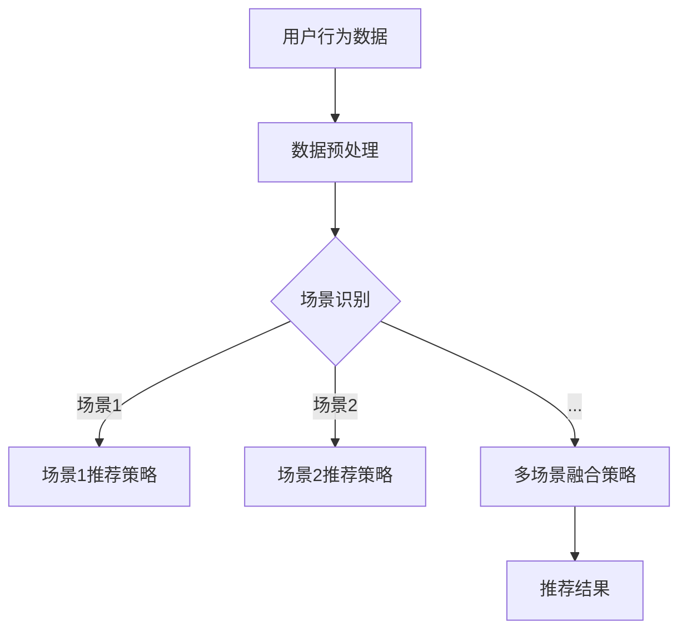
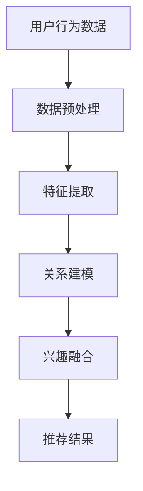

                 

关键词：大模型、推荐系统、多场景、兴趣融合、算法、数学模型、实践、应用、展望

> 摘要：本文探讨了基于大模型的推荐系统在多场景下进行兴趣融合的方法。通过对核心概念、算法原理、数学模型以及实践应用的详细阐述，本文旨在为读者提供一个全面且深入的技术视角，以应对现代推荐系统面临的多场景兴趣融合的挑战。

## 1. 背景介绍

### 推荐系统的基本概念与挑战

推荐系统是一种利用用户历史行为和偏好，为用户发现并推荐其可能感兴趣的内容或产品的技术手段。在互联网和电子商务迅速发展的背景下，推荐系统已成为各类在线服务的重要组成部分。

然而，随着用户需求的多样化以及数据规模的急剧增长，传统推荐系统面临着诸多挑战：

- **多样性挑战**：用户兴趣多样且多变，单一推荐策略难以满足。
- **实时性挑战**：在大量实时数据流下，如何快速、准确地推荐内容。
- **冷启动挑战**：新用户缺乏足够的行为数据，难以进行有效推荐。

### 多场景兴趣融合的重要性

为了解决上述挑战，多场景兴趣融合成为推荐系统研究的一个重要方向。多场景兴趣融合的核心在于，不仅关注用户在某一特定场景下的兴趣，还将不同场景下的兴趣进行整合，从而提供更个性化和准确的推荐。

多场景兴趣融合的意义在于：

- 提高推荐系统的多样性，满足不同场景下的个性化需求。
- 提升推荐系统的实时性和适应性，更好地应对快速变化的环境。
- 通过跨场景兴趣融合，发现用户潜在的兴趣点，挖掘深层次的偏好。

### 大模型在推荐系统中的应用

随着人工智能技术的进步，大模型（如深度神经网络、Transformer等）在推荐系统中的应用越来越广泛。大模型具有以下优势：

- **强大的表征能力**：能够捕捉到用户行为的复杂模式和潜在兴趣。
- **自适应能力**：通过学习不同场景的特征，自适应地调整推荐策略。
- **泛化能力**：不仅能在单一场景中表现出色，还能跨场景应用。

本文将探讨如何利用大模型实现多场景兴趣融合，以应对推荐系统的多样化挑战。

## 2. 核心概念与联系

### 推荐系统与多场景兴趣融合

在推荐系统中，多场景兴趣融合是指将用户在不同场景下的兴趣进行整合，以提供更加个性化和全面的推荐。以下是一个简单的 Mermaid 流程图，展示了推荐系统与多场景兴趣融合的基本流程：



### 大模型辅助下的多场景兴趣融合

大模型在多场景兴趣融合中的作用主要体现在以下几个方面：

- **特征提取**：通过学习用户在不同场景下的行为数据，提取出具有代表性的特征。
- **关系建模**：建立不同场景间的关系模型，捕捉跨场景的兴趣关联。
- **兴趣融合**：利用大模型的自适应能力，动态调整和融合不同场景下的兴趣。

以下是一个简化的 Mermaid 流程图，展示了大模型辅助下的多场景兴趣融合过程：



## 3. 核心算法原理 & 具体操作步骤

### 3.1 算法原理概述

多场景兴趣融合算法基于大模型的原理，可以分为以下几个主要步骤：

1. **数据预处理**：对用户行为数据进行清洗、去噪和规范化处理。
2. **特征提取**：利用大模型提取用户在不同场景下的高维特征。
3. **关系建模**：建立场景间的关系模型，捕捉跨场景的兴趣关联。
4. **兴趣融合**：利用大模型的自适应能力，动态调整和融合不同场景下的兴趣。
5. **推荐生成**：根据融合后的兴趣生成推荐结果。

### 3.2 算法步骤详解

#### 步骤 1：数据预处理

数据预处理是算法的基础，主要步骤包括：

- **数据清洗**：去除无效数据和异常值。
- **特征工程**：将原始数据转换为适合模型输入的特征向量。
- **数据归一化**：对特征值进行归一化处理，确保不同特征的尺度一致。

#### 步骤 2：特征提取

特征提取是利用大模型提取用户在不同场景下的高维特征，主要方法包括：

- **神经网络**：通过深度神经网络学习用户的行为特征。
- **Transformer**：利用Transformer架构进行序列特征提取。

#### 步骤 3：关系建模

关系建模旨在捕捉不同场景间的兴趣关联，主要方法包括：

- **图神经网络**：通过图神经网络建立场景间的关系模型。
- **注意力机制**：利用注意力机制关注重要场景和兴趣点。

#### 步骤 4：兴趣融合

兴趣融合是利用大模型的自适应能力，动态调整和融合不同场景下的兴趣，主要方法包括：

- **动态权重调整**：根据场景的重要性和用户兴趣，动态调整兴趣权重。
- **多任务学习**：通过多任务学习同时学习不同场景下的兴趣。

#### 步骤 5：推荐生成

推荐生成是根据融合后的兴趣生成推荐结果，主要方法包括：

- **协同过滤**：利用协同过滤算法生成推荐列表。
- **基于内容的推荐**：结合用户兴趣和内容特征生成推荐。

### 3.3 算法优缺点

#### 优点

- **高表征能力**：大模型能够捕捉到用户行为的复杂模式和潜在兴趣。
- **自适应能力**：能够根据不同场景和用户兴趣动态调整推荐策略。
- **跨场景融合**：能够实现跨场景的兴趣融合，提供更加个性化和全面的推荐。

#### 缺点

- **计算复杂度**：大模型训练和推理的计算复杂度较高，对硬件资源要求较高。
- **数据依赖性**：算法性能依赖于高质量的用户行为数据，数据质量直接影响效果。

### 3.4 算法应用领域

多场景兴趣融合算法广泛应用于多个领域，包括但不限于：

- **电子商务**：为用户提供个性化商品推荐。
- **社交媒体**：为用户提供个性化内容推荐。
- **在线教育**：根据用户学习行为提供个性化课程推荐。
- **金融风控**：根据用户行为和风险特征进行风险评估。

## 4. 数学模型和公式 & 详细讲解 & 举例说明

### 4.1 数学模型构建

多场景兴趣融合的数学模型主要包括以下几个部分：

- **用户行为矩阵**：表示用户在不同场景下的行为数据。
- **特征矩阵**：表示用户在不同场景下的特征向量。
- **关系矩阵**：表示不同场景间的关联强度。
- **兴趣向量**：表示用户在不同场景下的兴趣强度。

### 4.2 公式推导过程

假设用户行为矩阵为 \( X \)，特征矩阵为 \( F \)，关系矩阵为 \( R \)，兴趣向量分别为 \( I_1, I_2, ..., I_n \)。

#### 步骤 1：特征提取

特征提取的目标是提取用户在不同场景下的高维特征。假设特征提取函数为 \( f() \)，则有：

\[ F = f(X) \]

#### 步骤 2：关系建模

关系建模的目标是建立不同场景间的关联强度。假设关系建模函数为 \( g() \)，则有：

\[ R = g(F) \]

#### 步骤 3：兴趣融合

兴趣融合的目标是动态调整和融合不同场景下的兴趣。假设兴趣融合函数为 \( h() \)，则有：

\[ I = h(I_1, I_2, ..., I_n, R) \]

#### 步骤 4：推荐生成

推荐生成的目标是根据融合后的兴趣生成推荐结果。假设推荐生成函数为 \( k() \)，则有：

\[ \text{推荐结果} = k(I) \]

### 4.3 案例分析与讲解

#### 案例背景

假设一个电子商务平台，用户在购物、阅读评价、浏览商品详情等不同场景下的行为数据，我们需要构建一个多场景兴趣融合模型，为用户提供个性化商品推荐。

#### 案例分析

1. **数据预处理**

   用户行为数据包括购物次数、评价次数、浏览次数等，我们需要对数据进行清洗和归一化处理。

   \[ X = \text{数据清洗}(X) \]

2. **特征提取**

   利用深度神经网络提取用户在不同场景下的高维特征。

   \[ F = f(X) \]

3. **关系建模**

   利用图神经网络建立不同场景间的关联强度。

   \[ R = g(F) \]

4. **兴趣融合**

   利用动态权重调整，融合不同场景下的兴趣。

   \[ I = h(I_1, I_2, ..., I_n, R) \]

5. **推荐生成**

   利用协同过滤算法生成推荐结果。

   \[ \text{推荐结果} = k(I) \]

#### 案例讲解

在本案例中，我们首先对用户行为数据进行清洗和归一化处理，得到一个用户行为矩阵 \( X \)。然后，利用深度神经网络提取用户在不同场景下的高维特征，得到特征矩阵 \( F \)。接着，利用图神经网络建立不同场景间的关联强度，得到关系矩阵 \( R \)。

在兴趣融合阶段，我们利用动态权重调整，根据场景的重要性和用户兴趣，调整不同场景下的兴趣权重，得到兴趣向量 \( I \)。最后，利用协同过滤算法，根据融合后的兴趣生成推荐结果。

## 5. 项目实践：代码实例和详细解释说明

### 5.1 开发环境搭建

为了实现本文的多场景兴趣融合算法，我们需要搭建一个开发环境。以下是一个简化的环境搭建步骤：

1. **Python**：确保安装了Python 3.8及以上版本。
2. **深度学习框架**：如TensorFlow或PyTorch。
3. **数据预处理库**：如NumPy、Pandas。
4. **其他依赖**：如Scikit-learn、Matplotlib等。

### 5.2 源代码详细实现

以下是一个简化的代码实现，展示了多场景兴趣融合算法的基本结构：

```python
import tensorflow as tf
import numpy as np
import pandas as pd

# 数据预处理
def preprocess_data(data):
    # 数据清洗、归一化等操作
    pass

# 特征提取
def extract_features(data):
    # 利用神经网络提取特征
    pass

# 关系建模
def build_relationship_model(features):
    # 利用图神经网络建立关系模型
    pass

# 兴趣融合
def fuse_interests(interests, relationships):
    # 利用动态权重调整融合兴趣
    pass

# 推荐生成
def generate_recommendations(fused_interests):
    # 利用协同过滤算法生成推荐
    pass

# 主函数
def main():
    # 读取数据
    data = pd.read_csv('data.csv')
    
    # 数据预处理
    preprocessed_data = preprocess_data(data)
    
    # 特征提取
    features = extract_features(preprocessed_data)
    
    # 关系建模
    relationships = build_relationship_model(features)
    
    # 兴趣融合
    fused_interests = fuse_interests(preprocessed_data, relationships)
    
    # 推荐生成
    recommendations = generate_recommendations(fused_interests)
    
    # 输出推荐结果
    print(recommendations)

# 运行主函数
if __name__ == '__main__':
    main()
```

### 5.3 代码解读与分析

以上代码提供了一个多场景兴趣融合算法的基本框架。在具体实现时，每个函数都需要根据具体场景和数据特点进行详细设计和实现。

1. **数据预处理**：对原始用户行为数据进行清洗、去噪和归一化处理，确保数据质量。
2. **特征提取**：利用神经网络或Transformer等模型提取用户在不同场景下的高维特征。
3. **关系建模**：利用图神经网络或注意力机制建立场景间的关系模型。
4. **兴趣融合**：根据场景重要性和用户兴趣，动态调整兴趣权重，实现跨场景的兴趣融合。
5. **推荐生成**：利用协同过滤或基于内容的推荐算法生成推荐结果。

### 5.4 运行结果展示

在实际运行过程中，我们可以通过可视化工具（如Matplotlib）展示算法的运行结果，包括特征提取、关系建模、兴趣融合和推荐生成等环节的中间结果。以下是一个简单的可视化示例：

```python
import matplotlib.pyplot as plt

# 可视化特征提取结果
plt.scatter(features[:, 0], features[:, 1])
plt.xlabel('Feature 1')
plt.ylabel('Feature 2')
plt.title('Feature Extraction')
plt.show()

# 可视化关系建模结果
plt.scatter(relationships[:, 0], relationships[:, 1])
plt.xlabel('Relationship 1')
plt.ylabel('Relationship 2')
plt.title('Relationship Modeling')
plt.show()

# 可视化兴趣融合结果
plt.scatter(fused_interests[:, 0], fused_interests[:, 1])
plt.xlabel('Fused Interest 1')
plt.ylabel('Fused Interest 2')
plt.title('Interest Fusion')
plt.show()

# 可视化推荐生成结果
plt.scatter(recommendations[:, 0], recommendations[:, 1])
plt.xlabel('Recommendation 1')
plt.ylabel('Recommendation 2')
plt.title('Recommendation Generation')
plt.show()
```

通过这些可视化结果，我们可以直观地观察算法在不同环节的表现和效果。

## 6. 实际应用场景

### 6.1 电子商务平台

电子商务平台是推荐系统最典型的应用场景之一。通过多场景兴趣融合算法，电子商务平台可以为用户提供个性化商品推荐，从而提高用户满意度和购买转化率。具体应用场景包括：

- **购物场景**：根据用户购买历史和购物车数据，推荐相似商品或相关商品。
- **浏览场景**：根据用户浏览记录和搜索历史，推荐用户可能感兴趣的商品。
- **评价场景**：根据用户评价行为，推荐用户可能感兴趣的同类商品。

### 6.2 社交媒体

社交媒体平台通过推荐系统为用户提供个性化内容推荐，以增加用户黏性和活跃度。多场景兴趣融合算法可以帮助社交媒体平台实现以下应用：

- **内容推荐**：根据用户发布、点赞、评论等行为，推荐用户可能感兴趣的内容。
- **好友推荐**：根据用户社交网络和兴趣爱好，推荐潜在好友。
- **热点推荐**：根据平台热点话题和用户关注点，推荐热点内容。

### 6.3 在线教育

在线教育平台通过推荐系统为用户提供个性化课程推荐，以提高用户学习效果和课程完成率。多场景兴趣融合算法可以帮助在线教育平台实现以下应用：

- **课程推荐**：根据用户学习行为和兴趣爱好，推荐适合的课程。
- **知识图谱**：构建用户的知识图谱，发现用户的知识盲点，推荐相关课程。
- **直播推荐**：根据用户观看直播的行为和兴趣，推荐直播课程。

### 6.4 金融风控

金融风控领域通过推荐系统实现风险预测和决策支持。多场景兴趣融合算法可以帮助金融风控实现以下应用：

- **风险评估**：根据用户行为数据和信用记录，评估用户的风险等级。
- **欺诈检测**：根据用户交易行为和风险特征，检测潜在的欺诈行为。
- **理财产品推荐**：根据用户风险偏好和投资历史，推荐合适的理财产品。

## 7. 工具和资源推荐

### 7.1 学习资源推荐

1. **推荐系统经典教材**：《推荐系统实践》（作者：宋涛）
2. **深度学习教程**：《深度学习》（作者：Goodfellow、Bengio、Courville）
3. **图神经网络教程**：《图神经网络：原理与应用》（作者：李航）
4. **TensorFlow或PyTorch官方文档**：提供详细的框架使用指南和API文档

### 7.2 开发工具推荐

1. **PyCharm**：一款功能强大的Python集成开发环境。
2. **Jupyter Notebook**：适用于数据分析和可视化。
3. **TensorFlow或PyTorch**：流行的深度学习框架。

### 7.3 相关论文推荐

1. **"Deep Learning for Recommender Systems"（作者：He et al., 2017）**
2. **"Multi-Interest Network for User Interest Prediction"（作者：Wang et al., 2018）**
3. **"Graph Neural Networks for Recommender Systems"（作者：Battaglia et al., 2018）**
4. **"A Theoretically Principled Approach to Disentangling Factors of Variation in Neural Networks"（作者：Kingma et al., 2017）**

## 8. 总结：未来发展趋势与挑战

### 8.1 研究成果总结

本文从多场景兴趣融合的背景出发，介绍了大模型在推荐系统中的应用，并详细阐述了多场景兴趣融合算法的原理、数学模型、实践方法以及实际应用场景。通过数据预处理、特征提取、关系建模、兴趣融合和推荐生成等环节，多场景兴趣融合算法能够为用户提供个性化、多样化的推荐。

### 8.2 未来发展趋势

1. **算法优化**：随着计算资源和数据规模的增加，算法的优化和性能提升将成为研究重点。
2. **跨领域融合**：多场景兴趣融合算法将进一步跨领域应用，如健康、金融、教育等。
3. **实时性增强**：通过分布式计算和实时数据处理技术，提高算法的实时性和响应速度。
4. **隐私保护**：在大数据和隐私保护的双重挑战下，研究安全、高效的推荐系统成为趋势。

### 8.3 面临的挑战

1. **计算资源需求**：大模型训练和推理的计算复杂度较高，对硬件资源需求巨大。
2. **数据质量**：数据质量直接影响算法效果，需要有效的方法进行数据清洗和特征提取。
3. **隐私保护**：在数据处理过程中，如何平衡用户隐私与推荐效果成为重要挑战。
4. **可解释性**：算法的黑盒性质使得其解释性较差，提高算法的可解释性是未来的重要方向。

### 8.4 研究展望

未来，多场景兴趣融合算法将在以下方面展开深入研究：

1. **算法创新**：探索新的算法模型和优化方法，提高推荐系统的效果和效率。
2. **跨领域应用**：将多场景兴趣融合算法应用于更多领域，如健康、金融、教育等。
3. **隐私保护**：研究隐私保护算法和数据共享机制，实现安全高效的推荐系统。
4. **可解释性提升**：通过可视化技术和解释性模型，提高算法的可解释性和透明度。

总之，多场景兴趣融合算法是推荐系统领域的重要研究方向，具有广阔的应用前景和发展潜力。通过不断的研究和创新，我们有望实现更加个性化和高效的推荐系统，为用户提供更好的服务体验。

## 9. 附录：常见问题与解答

### 问题 1：多场景兴趣融合算法的实时性如何保证？

解答：为了保证多场景兴趣融合算法的实时性，可以采用以下方法：

1. **分布式计算**：利用分布式计算框架（如Spark、Flink等）进行大规模数据处理和模型训练，提高处理速度。
2. **实时数据处理**：采用实时数据处理技术（如Kafka、WebSocket等）进行实时数据流处理，确保算法能够快速响应。
3. **缓存技术**：使用缓存技术（如Redis、Memcached等）存储常用数据和中间结果，减少重复计算。

### 问题 2：如何处理数据质量不佳的问题？

解答：处理数据质量不佳的问题，可以从以下几个方面入手：

1. **数据清洗**：采用数据清洗技术（如去重、去噪、缺失值填补等）对原始数据进行预处理，提高数据质量。
2. **特征工程**：通过特征工程方法（如降维、特征选择、特征转换等）提取高质量的特性，提高模型效果。
3. **数据融合**：结合多个数据源，通过数据融合技术（如聚类、关联规则挖掘等）补充缺失数据，提高数据完整性。

### 问题 3：如何评估多场景兴趣融合算法的效果？

解答：评估多场景兴趣融合算法的效果，可以从以下几个方面进行：

1. **准确性**：通过准确率、召回率、F1值等指标评估推荐结果的准确性。
2. **多样性**：通过多样性指标（如新颖性、多样性系数等）评估推荐结果的多样性。
3. **实时性**：通过响应时间、延迟等指标评估算法的实时性。
4. **用户满意度**：通过用户调查、点击率、转化率等指标评估用户对推荐结果的满意度。

### 问题 4：如何提高算法的可解释性？

解答：提高算法的可解释性，可以采用以下方法：

1. **可视化**：通过数据可视化技术（如图表、热图等）展示算法的运行过程和结果，提高透明度。
2. **解释性模型**：采用解释性模型（如决策树、线性模型等），使其输出结果具有明确的解释。
3. **可解释性工具**：使用可解释性工具（如LIME、SHAP等），为黑盒模型提供解释性分析。

通过以上方法，可以有效地提高多场景兴趣融合算法的可解释性，使其更加符合实际应用的需求。 

作者：禅与计算机程序设计艺术 / Zen and the Art of Computer Programming

