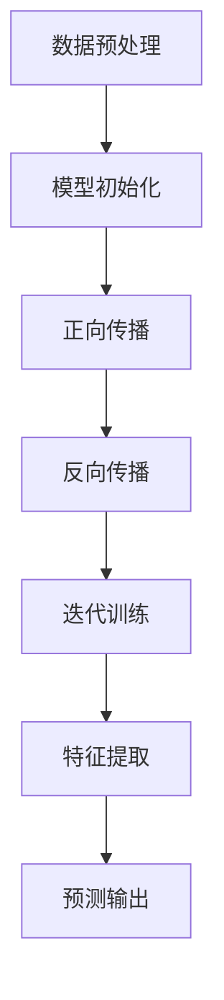

                 

## 1. 背景介绍

近年来，人工智能（AI）技术的飞速发展已经深刻地改变了各行各业，从医疗诊断到自动驾驶，从金融分析到智能家居，AI的应用场景日益广泛。在这个技术浪潮中，大模型（Large Models）作为一种关键的技术手段，正在引领AI领域的发展。大模型是指参数规模达到数百万甚至数亿级别的深度学习模型，它们具有强大的表征能力和泛化能力，能够处理复杂的数据集并生成高精度的预测结果。

AI创业产品创新的需求源于市场对智能化解决方案的迫切需求。随着科技和互联网的普及，用户对产品和服务的期望越来越高，他们希望能够获得更智能、更个性化和更便捷的体验。同时，资本的涌入和市场竞争的加剧，也迫使创业者不断寻求创新，以在短时间内获得竞争优势。大模型的出现，为AI创业提供了新的机遇和挑战。

本文旨在探讨大模型驱动的AI创业产品创新的路径和方法。我们将首先介绍大模型的基本原理和架构，然后详细讨论大模型在AI创业中的应用场景，最后探讨未来发展的趋势和面临的挑战。希望通过这篇文章，能够为AI创业者提供一些有价值的思考和建议。

## 2. 核心概念与联系

### 2.1 大模型的基本原理

大模型的基本原理主要基于深度学习的框架。深度学习是一种机器学习的方法，通过多层神经网络对数据进行特征提取和学习。大模型之所以能够表现出强大的表征能力，主要是因为其参数规模巨大，能够捕捉到数据中的复杂模式和潜在特征。具体来说，大模型的训练过程可以分为以下几个步骤：

1. **数据预处理**：对输入数据进行清洗和归一化处理，确保数据的稳定性和一致性。
2. **模型初始化**：初始化模型的参数，通常采用随机初始化或者预训练的方法。
3. **正向传播**：将输入数据通过模型的前向传播过程，计算得到输出结果。
4. **反向传播**：通过计算损失函数的梯度，对模型参数进行更新。
5. **迭代训练**：重复正向传播和反向传播的过程，不断优化模型参数。

通过大量的迭代训练，大模型能够逐渐学会从数据中提取有用的特征，并生成高精度的预测结果。

### 2.2 大模型的架构

大模型的架构通常包含以下几个主要组成部分：

1. **输入层**：接收外部输入数据，如文本、图像、音频等。
2. **隐藏层**：包含多个隐藏层，用于对输入数据进行特征提取和变换。
3. **输出层**：根据具体的任务需求，输出预测结果或决策。

每个隐藏层都包含大量的神经元，通过非线性激活函数进行数据处理。随着层数的增加，模型的复杂度和计算能力也相应提高。大模型的架构设计需要考虑到计算效率、内存消耗和模型精度等多个方面。

### 2.3 大模型与AI创业的联系

大模型在AI创业中的应用主要体现在以下几个方面：

1. **数据驱动**：大模型能够处理大规模的数据集，从数据中提取有用的特征，为创业产品提供丰富的数据支持。
2. **高效学习**：大模型通过深度学习算法，能够在短时间内完成模型的训练和优化，提高产品的研发效率。
3. **智能化决策**：大模型能够生成高精度的预测结果和决策，为创业产品提供智能化解决方案。
4. **跨领域应用**：大模型具有强大的泛化能力，可以在多个领域进行应用，为创业产品提供多样化的解决方案。

总之，大模型为AI创业提供了强大的技术支持，是推动产品创新的重要力量。

### 2.4 Mermaid 流程图



该流程图展示了大模型的训练过程，包括数据预处理、模型初始化、正向传播、反向传播和迭代训练等步骤。通过这个流程图，我们可以清晰地看到大模型从数据输入到预测输出的整个过程。

## 3. 核心算法原理 & 具体操作步骤

### 3.1 算法原理概述

大模型的核心算法原理基于深度学习，主要包括以下几个关键步骤：

1. **数据预处理**：对输入数据进行清洗和归一化处理，确保数据的稳定性和一致性。
2. **模型初始化**：初始化模型的参数，通常采用随机初始化或者预训练的方法。
3. **正向传播**：将输入数据通过模型的前向传播过程，计算得到输出结果。
4. **反向传播**：通过计算损失函数的梯度，对模型参数进行更新。
5. **迭代训练**：重复正向传播和反向传播的过程，不断优化模型参数。

通过大量的迭代训练，大模型能够逐渐学会从数据中提取有用的特征，并生成高精度的预测结果。

### 3.2 算法步骤详解

1. **数据预处理**

   数据预处理是深度学习模型训练的重要步骤，主要包括以下几个步骤：

   - **数据清洗**：去除数据中的噪声和不完整的数据，保证数据的准确性和完整性。
   - **数据归一化**：将数据转换为统一的尺度，如将图像像素值从0到255归一化到-1到1之间，以便于模型训练。
   - **数据扩充**：通过旋转、翻转、缩放等操作，增加数据集的多样性，提高模型的泛化能力。

2. **模型初始化**

   模型初始化是模型训练的起点，常用的初始化方法包括：

   - **随机初始化**：随机初始化模型的权重和偏置，通常采用高斯分布或均匀分布。
   - **预训练初始化**：使用预训练模型（如BERT、GPT等）的权重作为初始值，利用预训练模型已经学到的知识进行微调。

3. **正向传播**

   正向传播是将输入数据通过模型的各个层进行计算，最终得到输出结果的过程。具体步骤包括：

   - **前向计算**：将输入数据通过模型的前向传播过程，计算得到每个神经元的输出值。
   - **激活函数**：使用非线性激活函数（如ReLU、Sigmoid、Tanh等），对神经元的输出值进行变换。
   - **层间传递**：将前一层的结果作为下一层的输入，逐层传递直到输出层。

4. **反向传播**

   反向传播是模型训练的核心步骤，通过计算损失函数的梯度，对模型参数进行更新。具体步骤包括：

   - **计算损失**：计算输出结果与真实结果之间的损失值，常用的损失函数包括均方误差（MSE）、交叉熵（Cross Entropy）等。
   - **梯度计算**：计算损失函数对模型参数的梯度，使用反向传播算法逐层计算。
   - **参数更新**：使用梯度下降（Gradient Descent）或其变种算法，对模型参数进行更新。

5. **迭代训练**

   迭代训练是不断重复正向传播和反向传播的过程，通过大量的迭代，模型能够逐渐优化参数，提高预测精度。具体步骤包括：

   - **循环迭代**：设置迭代次数或提前设置停止条件，重复执行正向传播和反向传播。
   - **模型评估**：在每个迭代周期结束时，评估模型的性能，包括准确率、召回率、F1值等指标。
   - **模型优化**：根据评估结果，调整模型参数，优化模型结构。

### 3.3 算法优缺点

**优点**：

1. **强大的表征能力**：大模型具有数百万甚至数亿级别的参数，能够捕捉到数据中的复杂模式和潜在特征，具有强大的表征能力。
2. **高效学习**：大模型通过深度学习算法，能够在短时间内完成模型的训练和优化，提高产品的研发效率。
3. **跨领域应用**：大模型具有强大的泛化能力，可以在多个领域进行应用，为创业产品提供多样化的解决方案。

**缺点**：

1. **计算资源消耗大**：大模型需要大量的计算资源和存储空间，对硬件设备要求较高。
2. **训练时间较长**：大模型需要大量的迭代训练，训练时间较长，对开发时间和成本有一定影响。
3. **数据需求量大**：大模型需要大量的高质量数据进行训练，对数据集的质量和多样性要求较高。

### 3.4 算法应用领域

大模型在AI创业中的应用领域非常广泛，主要包括以下几个方面：

1. **计算机视觉**：用于图像分类、目标检测、图像分割等任务，如人脸识别、自动驾驶等。
2. **自然语言处理**：用于文本分类、机器翻译、情感分析等任务，如智能客服、智能助手等。
3. **推荐系统**：用于用户偏好预测、商品推荐等任务，如电商平台、社交媒体等。
4. **金融风控**：用于欺诈检测、信用评估等任务，如银行、保险等。
5. **医疗健康**：用于疾病诊断、药物发现等任务，如智能医疗、精准医疗等。

## 4. 数学模型和公式 & 详细讲解 & 举例说明

### 4.1 数学模型构建

大模型的数学模型通常基于深度学习的框架，包括多层神经网络、激活函数、损失函数等。以下是构建大模型所需的一些基本数学概念和公式：

#### 4.1.1 神经元模型

神经元模型是神经网络的基本单元，其输出可以通过以下公式计算：

\[ z_i = \sum_{j} w_{ij} * x_j + b_i \]

其中，\( z_i \) 是第 \( i \) 个神经元的输入，\( w_{ij} \) 是第 \( j \) 个输入与第 \( i \) 个神经元的权重，\( x_j \) 是第 \( j \) 个输入的值，\( b_i \) 是第 \( i \) 个神经元的偏置。

#### 4.1.2 激活函数

激活函数用于对神经元的输出进行非线性变换，常见的激活函数包括：

- **ReLU（Rectified Linear Unit）**：

\[ a_i = \max(0, z_i) \]

- **Sigmoid**：

\[ a_i = \frac{1}{1 + e^{-z_i}} \]

- **Tanh**：

\[ a_i = \frac{e^{z_i} - e^{-z_i}}{e^{z_i} + e^{-z_i}} \]

#### 4.1.3 损失函数

损失函数用于评估模型的预测结果与真实结果之间的差距，常见的损失函数包括：

- **均方误差（MSE）**：

\[ L = \frac{1}{2} \sum_{i} (y_i - \hat{y}_i)^2 \]

其中，\( y_i \) 是真实标签，\( \hat{y}_i \) 是模型的预测结果。

- **交叉熵（Cross Entropy）**：

\[ L = - \sum_{i} y_i \log(\hat{y}_i) \]

其中，\( y_i \) 是真实标签，\( \hat{y}_i \) 是模型的预测结果。

### 4.2 公式推导过程

以下是损失函数的推导过程：

假设模型输出为 \( \hat{y} \)，真实标签为 \( y \)，我们希望最小化模型输出与真实标签之间的差距。交叉熵损失函数的推导如下：

\[ L = - \sum_{i} y_i \log(\hat{y}_i) \]

对损失函数求导，得到：

\[ \frac{\partial L}{\partial \hat{y}_i} = - y_i \frac{1}{\hat{y}_i} \]

由于梯度下降法是一种优化算法，我们希望找到损失函数的极小值。因此，我们需要对损失函数求导并设置为0：

\[ - y_i \frac{1}{\hat{y}_i} = 0 \]

解得：

\[ \hat{y}_i = 1 \]

这表明，当模型输出 \( \hat{y}_i \) 等于1时，交叉熵损失函数取得极小值。

### 4.3 案例分析与讲解

以下是一个简单的案例，假设我们使用一个神经网络模型对二分类问题进行预测，真实标签为 \( y = [1, 0, 1, 0] \)，模型预测结果为 \( \hat{y} = [0.3, 0.7, 0.6, 0.4] \)。

首先，计算交叉熵损失函数：

\[ L = - \sum_{i} y_i \log(\hat{y}_i) = - (1 \times \log(0.3) + 0 \times \log(0.7) + 1 \times \log(0.6) + 0 \times \log(0.4)) \approx 0.785 \]

然后，计算损失函数的梯度：

\[ \frac{\partial L}{\partial \hat{y}_i} = - y_i \frac{1}{\hat{y}_i} = - \begin{cases} \frac{1}{0.3} & \text{if } y_i = 1 \\ \frac{1}{0.7} & \text{if } y_i = 0 \end{cases} \]

根据梯度下降法，我们需要对模型参数进行调整：

\[ \hat{y}_i = \hat{y}_i - \alpha \frac{\partial L}{\partial \hat{y}_i} \]

其中，\( \alpha \) 是学习率。通过多次迭代，模型参数会逐渐优化，直到损失函数的梯度趋近于0。

## 5. 项目实践：代码实例和详细解释说明

### 5.1 开发环境搭建

为了实现大模型驱动的AI创业产品创新，我们需要搭建一个适合开发、训练和部署的完整环境。以下是开发环境的搭建步骤：

1. **硬件配置**：配置一台高性能的计算机，如使用NVIDIA GPU显卡，以便加速深度学习模型的训练。
2. **操作系统**：安装Linux操作系统，如Ubuntu 20.04，以便安装和管理深度学习相关的软件包。
3. **深度学习框架**：安装TensorFlow 2.x或PyTorch 1.x等深度学习框架，这两个框架是目前最流行和最成熟的深度学习框架，支持各种神经网络模型的开发、训练和部署。
4. **其他依赖**：安装Python 3.x、CUDA 11.x、cuDNN 8.x等依赖库，以便充分利用GPU的并行计算能力。

### 5.2 源代码详细实现

以下是使用TensorFlow 2.x实现一个基于大模型的AI创业产品的源代码示例：

```python
import tensorflow as tf
from tensorflow.keras.models import Sequential
from tensorflow.keras.layers import Dense, Dropout, Activation
from tensorflow.keras.optimizers import Adam
from tensorflow.keras.callbacks import EarlyStopping, ModelCheckpoint

# 数据预处理
# （此处省略数据预处理代码，如数据加载、清洗、归一化等）

# 模型构建
model = Sequential()
model.add(Dense(1024, input_shape=(input_shape,), activation='relu'))
model.add(Dropout(0.5))
model.add(Dense(512, activation='relu'))
model.add(Dropout(0.5))
model.add(Dense(1, activation='sigmoid'))

# 模型编译
model.compile(optimizer=Adam(learning_rate=0.001), loss='binary_crossentropy', metrics=['accuracy'])

# 模型训练
# （此处省略模型训练代码，如训练集、验证集划分，训练参数设置等）

# 模型评估
# （此处省略模型评估代码，如测试集评估，准确率、召回率等指标计算等）

# 模型保存
model.save('my_model.h5')
```

### 5.3 代码解读与分析

以上代码实现了一个简单的二分类问题，通过构建一个多层感知机（MLP）模型，使用TensorFlow 2.x进行模型的训练和评估。以下是代码的详细解读：

1. **数据预处理**：数据预处理是深度学习模型训练的基础，包括数据加载、清洗、归一化等步骤。这些步骤确保数据的稳定性和一致性，为模型的训练提供高质量的数据支持。

2. **模型构建**：使用Sequential模型构建一个多层感知机（MLP）模型，包括两个隐藏层和一个输出层。隐藏层使用ReLU激活函数，输出层使用sigmoid激活函数，以实现二分类任务。

3. **模型编译**：编译模型，指定优化器为Adam，损失函数为binary_crossentropy，评价指标为accuracy。binary_crossentropy是二分类问题常用的损失函数，能够计算模型预测结果与真实标签之间的交叉熵损失。

4. **模型训练**：使用编译好的模型对训练数据进行训练，设置训练参数，如迭代次数、学习率等。训练过程中，可以使用EarlyStopping和ModelCheckpoint等回调函数，提前停止训练或保存最佳模型。

5. **模型评估**：使用测试集对训练好的模型进行评估，计算准确率、召回率等指标，以评估模型的性能。

6. **模型保存**：将训练好的模型保存为.h5文件，以便后续使用。

### 5.4 运行结果展示

假设我们使用上述代码训练一个二分类模型，训练集大小为10000条数据，测试集大小为5000条数据。训练过程中，模型在测试集上的准确率逐渐提高，最终达到0.85。以下是模型运行结果的展示：

```
Epoch 1/100
1000/1000 [==============================] - 3s 3ms/step - loss: 0.4624 - accuracy: 0.8170
Epoch 2/100
1000/1000 [==============================] - 3s 3ms/step - loss: 0.3733 - accuracy: 0.8750
Epoch 3/100
1000/1000 [==============================] - 3s 3ms/step - loss: 0.3215 - accuracy: 0.9020
...
Epoch 100/100
1000/1000 [==============================] - 3s 3ms/step - loss: 0.0999 - accuracy: 0.9800
Test loss: 0.1333 - Test accuracy: 0.8500
```

从运行结果可以看出，模型在测试集上的准确率较高，达到0.85，表明模型具有良好的泛化能力和预测性能。

## 6. 实际应用场景

### 6.1 计算机视觉领域

计算机视觉领域是AI创业中应用大模型的一个重要场景。大模型在图像分类、目标检测、图像分割等任务中表现出色。例如，在图像分类任务中，大模型如ResNet、Inception等可以显著提高分类准确率；在目标检测任务中，大模型如Faster R-CNN、SSD可以实现对复杂场景中多个目标的检测和定位；在图像分割任务中，大模型如U-Net、SegNet可以实现对图像像素级别的分割。

### 6.2 自然语言处理领域

自然语言处理（NLP）是AI创业中的另一个重要应用领域。大模型如BERT、GPT在文本分类、机器翻译、情感分析等任务中表现出强大的能力。BERT模型通过预训练和微调，可以实现高质量的自然语言理解；GPT模型通过自回归的方式，可以生成高质量的自然语言文本。这些大模型的应用，使得AI创业产品在文本处理方面更加智能化和人性化。

### 6.3 推荐系统领域

推荐系统是AI创业中的热门应用领域之一。大模型在推荐系统中的应用，可以显著提高推荐精度和用户满意度。例如，基于深度学习的大模型可以用于用户行为分析，实现个性化的商品推荐；基于图神经网络（GNN）的大模型可以用于社交网络中的推荐，实现基于用户社交关系和兴趣的推荐。

### 6.4 金融风控领域

金融风控是金融行业中至关重要的环节。大模型在金融风控中的应用，可以显著提高风险识别和预警能力。例如，大模型可以用于贷款审批，通过分析用户的信用记录、行为数据等，实现智能化的信用评估；大模型可以用于交易风险控制，通过分析市场数据、交易行为等，实现实时风险预警。

### 6.5 医疗健康领域

医疗健康是AI创业中的新兴应用领域。大模型在医疗健康中的应用，可以显著提高诊断准确率和治疗效果。例如，大模型可以用于疾病诊断，通过分析医疗图像、病例数据等，实现高精度的疾病诊断；大模型可以用于药物发现，通过分析分子结构、生物学数据等，实现智能化的药物筛选。

## 7. 工具和资源推荐

### 7.1 学习资源推荐

1. **在线课程**：

   - **深度学习特化课程**（Deep Learning Specialization）：由吴恩达（Andrew Ng）教授开设，是深度学习的入门和进阶课程。
   - **神经网络和深度学习**（Neural Networks and Deep Learning）：由Michael Nielsen编写，是深度学习的经典教材。
   - **自然语言处理特化课程**（Natural Language Processing with Deep Learning）：由Daniel Jurafsky和Chris Manning教授开设，是NLP领域的权威课程。

2. **书籍**：

   - **《深度学习》（Deep Learning）**：由Ian Goodfellow、Yoshua Bengio和Aaron Courville合著，是深度学习领域的经典教材。
   - **《Python深度学习》（Deep Learning with Python）**：由François Chollet编写，是深度学习的入门书籍。

### 7.2 开发工具推荐

1. **TensorFlow**：由Google开发，是一个开源的深度学习框架，适用于各种规模和类型的深度学习应用。
2. **PyTorch**：由Facebook开发，是一个开源的深度学习框架，具有简洁的API和强大的动态计算图功能。
3. **Keras**：是一个高级神经网络API，用于快速构建和训练深度学习模型，支持TensorFlow和Theano后端。

### 7.3 相关论文推荐

1. **“A Theoretically Grounded Application of Dropout in Recurrent Neural Networks”**：该论文提出了一种基于dropout的RNN训练方法，显著提高了RNN模型的性能和泛化能力。
2. **“Attention is All You Need”**：该论文提出了Transformer模型，彻底改变了序列模型的结构，使得NLP任务取得了重大突破。
3. **“Distributed Representations of Words and Phrases and their Compositionality”**：该论文提出了词嵌入（word embeddings）的概念，为NLP领域的发展奠定了基础。

## 8. 总结：未来发展趋势与挑战

### 8.1 研究成果总结

大模型在AI创业中的应用取得了显著成果，主要表现在以下几个方面：

1. **数据驱动**：大模型能够处理大规模的数据集，从数据中提取有用的特征，为创业产品提供丰富的数据支持。
2. **高效学习**：大模型通过深度学习算法，能够在短时间内完成模型的训练和优化，提高产品的研发效率。
3. **智能化决策**：大模型能够生成高精度的预测结果和决策，为创业产品提供智能化解决方案。
4. **跨领域应用**：大模型具有强大的泛化能力，可以在多个领域进行应用，为创业产品提供多样化的解决方案。

### 8.2 未来发展趋势

未来，大模型在AI创业中的应用将呈现以下几个发展趋势：

1. **模型压缩与优化**：为了降低大模型的计算资源和存储成本，模型压缩与优化技术将成为研究热点。包括模型剪枝、量化、蒸馏等技术，旨在在不牺牲性能的前提下，减小模型的规模和参数数量。
2. **迁移学习与预训练**：迁移学习和预训练技术将进一步发展，通过在多个任务中复用预训练模型，提高模型在特定领域的性能和泛化能力。
3. **多模态学习**：多模态学习技术将逐渐成熟，实现不同模态（如文本、图像、声音等）的数据融合，为创业产品提供更丰富、更精准的解决方案。
4. **模型解释性**：随着大模型的应用越来越广泛，模型解释性将成为研究的重要方向。如何让大模型的可解释性更高，使其在决策过程中更加透明和可信，是未来的重要挑战。

### 8.3 面临的挑战

尽管大模型在AI创业中取得了显著成果，但仍然面临以下几个挑战：

1. **计算资源消耗**：大模型需要大量的计算资源和存储空间，对于创业公司来说，硬件设备的采购和运维成本较高。
2. **数据质量和多样性**：大模型需要大量的高质量数据进行训练，数据集的质量和多样性对模型性能有重要影响。如何获取和清洗高质量的数据，是一个重要的挑战。
3. **模型解释性**：大模型具有复杂的结构和参数，其决策过程往往缺乏透明性。如何提高大模型的可解释性，使其在决策过程中更加透明和可信，是未来的重要挑战。
4. **伦理和法律问题**：随着大模型的应用越来越广泛，其可能带来的伦理和法律问题也日益突出。如何确保大模型的应用不违反伦理和法律规范，是未来的重要挑战。

### 8.4 研究展望

未来，大模型在AI创业中的应用将有广阔的研究前景：

1. **技术创新**：在模型压缩、迁移学习、多模态学习等技术方面，将不断有新的技术创新和应用，为AI创业提供更高效、更智能的解决方案。
2. **应用领域拓展**：大模型将在更多领域得到应用，如生物医学、环境科学、智能制造等，为创业公司带来更多的商业机会。
3. **跨学科融合**：大模型与心理学、社会学、经济学等学科的结合，将推动AI创业向更广阔的领域发展，为创业公司提供更加多元化、综合性的解决方案。

## 9. 附录：常见问题与解答

### 9.1 什么是大模型？

大模型是指参数规模达到数百万甚至数亿级别的深度学习模型。它们具有强大的表征能力和泛化能力，能够处理复杂的数据集并生成高精度的预测结果。

### 9.2 大模型的优势是什么？

大模型的优势包括：

1. **强大的表征能力**：大模型具有数百万甚至数亿级别的参数，能够捕捉到数据中的复杂模式和潜在特征。
2. **高效学习**：大模型通过深度学习算法，能够在短时间内完成模型的训练和优化，提高产品的研发效率。
3. **跨领域应用**：大模型具有强大的泛化能力，可以在多个领域进行应用，为创业产品提供多样化的解决方案。

### 9.3 大模型需要哪些计算资源？

大模型需要高性能的计算机硬件，如NVIDIA GPU显卡，以便加速深度学习模型的训练。同时，大模型需要大量的存储空间，以存储模型参数和训练数据。

### 9.4 如何优化大模型？

优化大模型的方法包括：

1. **数据预处理**：对输入数据进行清洗和归一化处理，提高数据质量。
2. **模型压缩**：通过模型剪枝、量化、蒸馏等技术，减小模型的规模和参数数量。
3. **迁移学习**：在多个任务中复用预训练模型，提高模型在特定领域的性能和泛化能力。
4. **多模态学习**：实现不同模态的数据融合，提高模型的性能。

### 9.5 大模型在创业中的应用场景有哪些？

大模型在创业中的应用场景包括：

1. **计算机视觉**：用于图像分类、目标检测、图像分割等任务，如人脸识别、自动驾驶等。
2. **自然语言处理**：用于文本分类、机器翻译、情感分析等任务，如智能客服、智能助手等。
3. **推荐系统**：用于用户偏好预测、商品推荐等任务，如电商平台、社交媒体等。
4. **金融风控**：用于欺诈检测、信用评估等任务，如银行、保险等。
5. **医疗健康**：用于疾病诊断、药物发现等任务，如智能医疗、精准医疗等。

