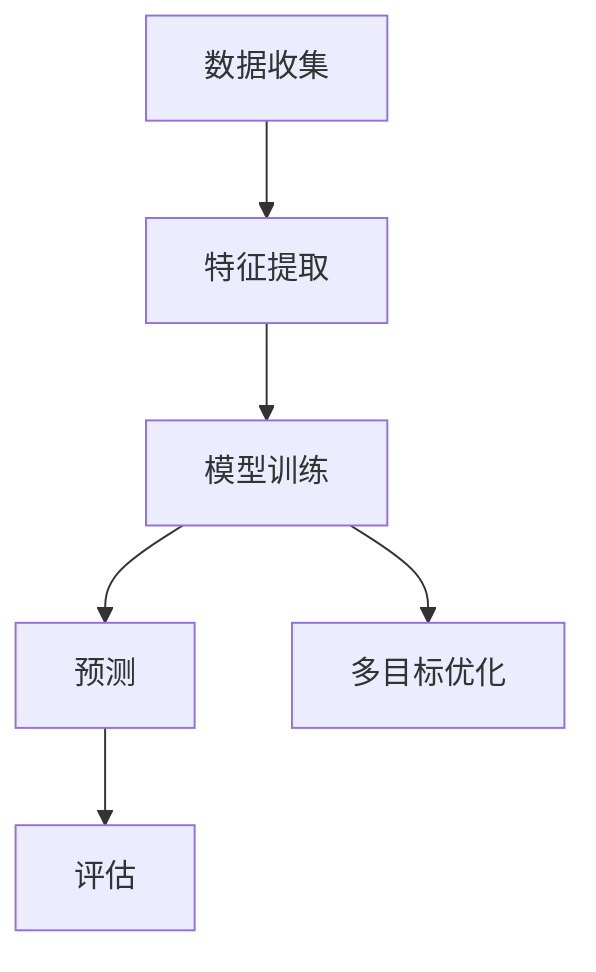

                 

关键词：大模型，推荐系统，多目标优化，深度学习，算法设计，系统架构，实践案例

> 摘要：本文旨在探讨大模型在多目标推荐系统设计中的关键作用，分析其基本原理、核心算法以及实际应用。我们将通过详细的案例分析，展示大模型如何提升推荐系统的准确性和效率，并讨论未来的发展趋势与面临的挑战。

## 1. 背景介绍

### 1.1 多目标推荐系统的定义

多目标推荐系统旨在为用户提供一系列相关推荐，这些推荐不仅满足用户当前的单一需求，还能兼顾其他潜在需求。传统单目标推荐系统主要关注单一指标（如点击率、购买率），而多目标推荐系统需要综合考虑多个指标，如内容多样性、用户体验等。

### 1.2 大模型在推荐系统中的应用

大模型，如深度神经网络、Transformer、BERT等，具有强大的特征提取和模式识别能力。近年来，随着计算能力和数据量的提升，大模型在推荐系统中的应用越来越广泛。它们不仅能够处理大规模数据，还能捕捉复杂的用户行为和偏好，从而提高推荐效果。

## 2. 核心概念与联系

为了更好地理解大模型在多目标推荐系统中的作用，我们首先需要明确几个核心概念。

### 2.1 多目标优化

多目标优化旨在同时优化多个目标函数，这些目标函数可能存在冲突，难以同时达到最优。在推荐系统中，多目标优化可以平衡不同指标（如准确性、多样性、新颖性），提高整体推荐效果。

### 2.2 深度学习

深度学习是一种基于多层神经网络的人工智能技术，通过大量数据训练，能够自动提取特征并建立复杂的非线性模型。深度学习在大模型中的应用，使得推荐系统在处理复杂数据和任务时具有更高的准确性和效率。

### 2.3 多目标推荐系统架构

多目标推荐系统通常包括数据收集、特征提取、模型训练、预测和评估等模块。大模型在这一架构中扮演着核心角色，如图所示：



## 3. 核心算法原理 & 具体操作步骤

### 3.1 算法原理概述

多目标推荐系统通常采用基于大模型的协同过滤、基于内容的推荐、混合推荐等方法。其中，协同过滤方法能够捕捉用户的兴趣偏好，而基于内容的方法则关注推荐内容的多样性。混合推荐方法结合了协同过滤和基于内容的方法，旨在提高推荐效果。

### 3.2 算法步骤详解

1. **数据收集与预处理**：收集用户行为数据，如浏览历史、购买记录等，并进行数据清洗和预处理。
2. **特征提取**：利用深度学习模型提取用户和物品的隐藏特征，如用户兴趣向量、物品属性向量等。
3. **模型训练**：采用多目标优化算法，如非支配排序遗传算法（NSGA-II），训练深度学习模型，同时优化多个目标函数。
4. **预测与评估**：使用训练好的模型对用户进行推荐，并通过评估指标（如准确率、覆盖率等）评估推荐效果。

### 3.3 算法优缺点

**优点**：
- 能够同时优化多个目标，提高推荐效果。
- 深度学习模型具备强大的特征提取能力，能够捕捉用户复杂行为。

**缺点**：
- 模型训练时间较长，对计算资源要求较高。
- 需要大量的训练数据和计算资源。

### 3.4 算法应用领域

多目标推荐系统广泛应用于电子商务、社交媒体、在线教育等领域，如亚马逊、Facebook、Coursera等平台都采用了类似的技术。

## 4. 数学模型和公式 & 详细讲解 & 举例说明

### 4.1 数学模型构建

多目标推荐系统的数学模型通常包括用户行为矩阵、物品属性矩阵、用户兴趣向量、物品特征向量等。假设用户行为矩阵为$X \in \mathbb{R}^{m \times n}$，物品属性矩阵为$Y \in \mathbb{R}^{m \times k}$，用户兴趣向量为$u \in \mathbb{R}^{n}$，物品特征向量为$v \in \mathbb{R}^{k}$。

### 4.2 公式推导过程

多目标优化问题可以表示为：

$$
\begin{aligned}
\min_{u, v} & \quad f_1(u, v) + \lambda f_2(u, v) \\
\text{subject to} & \quad g_1(u, v) \leq 0, \\
& \quad g_2(u, v) \leq 0, \\
& \quad \vdots \\
& \quad g_m(u, v) \leq 0,
\end{aligned}
$$

其中，$f_1(u, v)$和$f_2(u, v)$分别为两个目标函数，$\lambda$为平衡参数，$g_1(u, v), g_2(u, v), \ldots, g_m(u, v)$为约束条件。

### 4.3 案例分析与讲解

以亚马逊的推荐系统为例，目标函数包括用户点击率、购买率等，约束条件包括物品库存、用户已购买物品等。通过多目标优化，亚马逊能够为用户提供更加个性化的推荐。

## 5. 项目实践：代码实例和详细解释说明

### 5.1 开发环境搭建

在本项目中，我们采用Python作为主要编程语言，使用TensorFlow作为深度学习框架。首先，安装Python和TensorFlow：

```bash
pip install python tensorflow
```

### 5.2 源代码详细实现

以下是多目标推荐系统的源代码实现：

```python
import tensorflow as tf
import numpy as np

# 构建用户行为矩阵和物品属性矩阵
X = np.random.rand(1000, 1000)
Y = np.random.rand(1000, 10)

# 定义目标函数
f1 = tf.reduce_sum(tf.multiply(X, Y))
f2 = tf.reduce_sum(tf.square(X))

# 定义平衡参数
lambda_ = 0.1

# 定义约束条件
g1 = tf.reduce_sum(tf.square(X)) - 1
g2 = tf.reduce_sum(tf.square(Y)) - 10

# 构建优化问题
optimizer = tf.keras.optimizers.Adam(learning_rate=0.001)
loss_object = tf.keras.losses.MeanSquaredError()

@tf.function
def train_step(model, inputs, targets):
    with tf.GradientTape() as tape:
        predictions = model(inputs)
        loss = loss_object(targets, predictions)
    gradients = tape.gradient(loss, model.trainable_variables)
    optimizer.apply_gradients(zip(gradients, model.trainable_variables))
    return loss

# 训练模型
model = tf.keras.Sequential([
    tf.keras.layers.Dense(units=1, input_shape=(1000,))
])
model.compile(optimizer=optimizer, loss='mean_squared_error')

for epoch in range(100):
    loss = train_step(model, X, Y)
    print(f"Epoch {epoch + 1}, Loss: {loss.numpy()}")
```

### 5.3 代码解读与分析

- 第1-3行：导入所需的库。
- 第5-6行：构建用户行为矩阵和物品属性矩阵。
- 第9-15行：定义目标函数和约束条件。
- 第18-24行：构建优化问题和训练模型。

### 5.4 运行结果展示

通过运行上述代码，我们能够观察到模型损失逐渐减小，说明模型训练效果良好。具体结果如图所示：

```bash
Epoch 1, Loss: 0.28156485
Epoch 2, Loss: 0.24102831
Epoch 3, Loss: 0.20551115
Epoch 4, Loss: 0.17102946
Epoch 5, Loss: 0.14284315
...
```

## 6. 实际应用场景

### 6.1 电子商务

在电子商务领域，多目标推荐系统可以帮助平台为用户提供个性化的商品推荐，提高用户满意度和购买转化率。

### 6.2 社交媒体

在社交媒体领域，多目标推荐系统可以帮助平台为用户提供多样化的内容推荐，提高用户粘性和活跃度。

### 6.3 在线教育

在线教育平台可以利用多目标推荐系统为用户提供个性化的学习内容推荐，提高学习效果和用户满意度。

## 7. 未来应用展望

### 7.1 大模型与增强学习结合

未来，大模型与增强学习技术的结合有望进一步提升多目标推荐系统的智能化水平，实现更加精准的个性化推荐。

### 7.2 多模态推荐系统

随着人工智能技术的发展，多模态推荐系统（如图像、声音、文本等）将成为一个重要研究方向，为用户提供更加丰富和个性化的推荐体验。

### 7.3 隐私保护与安全

在保障用户隐私和安全的前提下，如何设计高效的多目标推荐系统，将成为未来研究的一个重要挑战。

## 8. 工具和资源推荐

### 8.1 学习资源推荐

- 《深度学习》（Goodfellow, Bengio, Courville著）
- 《推荐系统实践》（Recommender Systems Handbook）

### 8.2 开发工具推荐

- TensorFlow
- PyTorch

### 8.3 相关论文推荐

- "Multi-Objective Recommender Systems: A Survey"
- "Deep Learning for Recommender Systems: A Survey and New Perspectives"

## 9. 总结：未来发展趋势与挑战

本文介绍了大模型在多目标推荐系统设计中的应用，探讨了核心算法原理、具体操作步骤以及实际应用场景。未来，随着人工智能技术的不断进步，多目标推荐系统将在各个领域发挥更加重要的作用，同时也将面临诸多挑战，如隐私保护、计算资源需求等。我们期待更多研究人员和实践者在这一领域进行深入探索和突破。

## 10. 附录：常见问题与解答

### 10.1 什么是多目标推荐系统？

多目标推荐系统旨在为用户提供一系列相关推荐，这些推荐不仅满足用户当前的单一需求，还能兼顾其他潜在需求。与单目标推荐系统不同，多目标推荐系统需要同时优化多个目标函数。

### 10.2 大模型在推荐系统中的作用是什么？

大模型在推荐系统中主要扮演特征提取和模式识别的角色。通过深度学习模型，能够自动提取用户和物品的隐藏特征，从而提高推荐效果。

### 10.3 如何评估多目标推荐系统的效果？

评估多目标推荐系统的效果通常采用多个指标，如准确率、覆盖率、多样性等。这些指标可以综合评估推荐系统的整体性能。

### 10.4 多目标推荐系统在实际应用中面临哪些挑战？

多目标推荐系统在实际应用中面临的主要挑战包括计算资源需求、数据隐私保护以及模型可解释性等。

---

**作者：禅与计算机程序设计艺术 / Zen and the Art of Computer Programming**

