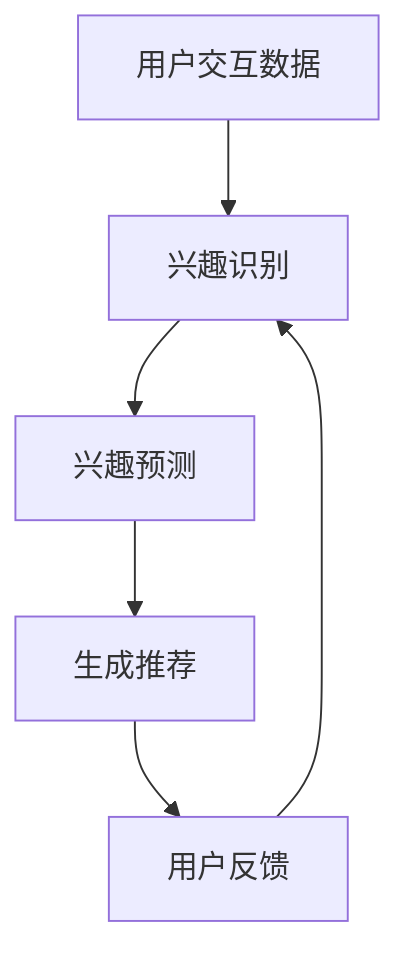

                 

关键词：大模型，推荐系统，动态兴趣建模，机器学习，深度学习

## 摘要

本文深入探讨了基于大模型的推荐系统动态兴趣建模技术。随着互联网用户数据的爆炸性增长，传统推荐系统已无法满足个性化需求。大模型，如Transformer和GPT，以其强大的数据处理和分析能力，成为解决这一问题的有效途径。本文将详细阐述动态兴趣建模的核心概念、大模型在此领域的应用，以及相关的数学模型和实际应用案例。

## 1. 背景介绍

推荐系统是现代互联网应用中至关重要的一环，无论是电商、社交媒体还是视频平台，它们都依赖于推荐系统来提升用户体验和增加用户黏性。然而，传统的基于协同过滤和内容匹配的推荐系统存在一些局限性：

- **数据稀疏性**：用户与物品之间的交互数据往往非常稀疏，导致推荐结果不准确。
- **冷启动问题**：新用户或新物品缺乏足够的历史数据，难以进行有效的推荐。
- **实时性**：传统的推荐系统通常需要批量处理数据，难以实现实时推荐。

为了解决这些挑战，研究人员开始探索基于机器学习和深度学习的推荐系统。尤其是大模型的兴起，使得处理大规模数据和实现复杂特征提取成为可能。大模型如Transformer和GPT在自然语言处理领域取得了显著成果，这些模型的结构和算法也为推荐系统提供了新的思路。

动态兴趣建模是推荐系统研究中的一个重要方向，旨在实时捕捉用户的兴趣变化，提供更个性化的推荐。动态兴趣建模需要解决的核心问题是：

- **兴趣识别**：如何从用户的交互数据中识别出其真实的兴趣点。
- **兴趣预测**：如何预测用户未来的兴趣点，以便提前进行推荐。

本文将围绕这两个问题，探讨大模型在动态兴趣建模中的应用。

## 2. 核心概念与联系

### 2.1. 推荐系统

推荐系统是一种信息过滤技术，旨在向用户提供他们可能感兴趣的信息。根据过滤策略，推荐系统可以分为基于协同过滤、基于内容匹配和基于模型的方法。

- **协同过滤**：通过分析用户之间的相似度，为用户提供相似用户的喜好。
- **内容匹配**：根据物品的属性和用户的偏好进行匹配。
- **模型方法**：使用机器学习模型，如分类、聚类和预测模型，来生成推荐。

### 2.2. 大模型

大模型是指具有数十亿甚至千亿参数的深度学习模型。这些模型通常采用神经网络结构，能够处理大量数据并提取复杂特征。大模型的成功主要得益于以下几个因素：

- **数据规模**：大模型能够处理海量的训练数据，从而提高模型的泛化能力。
- **计算能力**：现代计算硬件，如GPU和TPU，为大规模训练提供了强大的计算支持。
- **优化算法**：如Adam和AdamW等优化算法，使得大模型训练更加高效。

### 2.3. 动态兴趣建模

动态兴趣建模是一种基于用户实时交互数据，捕捉用户兴趣变化的推荐系统技术。其主要目标是通过分析用户的交互行为，识别出用户当前的兴趣点，并预测用户未来的兴趣方向。

动态兴趣建模的核心包括：

- **兴趣识别**：从用户的浏览、点击、购买等交互行为中提取兴趣点。
- **兴趣预测**：基于用户历史行为和实时交互，预测用户未来的兴趣方向。

### 2.4. Mermaid 流程图



在这个流程图中，用户交互数据作为输入，通过兴趣识别和兴趣预测，生成个性化推荐，用户对推荐结果进行反馈，进一步优化兴趣识别和预测。

## 3. 核心算法原理 & 具体操作步骤

### 3.1. 算法原理概述

动态兴趣建模的核心算法是基于大模型的序列建模。具体来说，算法分为以下几个步骤：

- **数据预处理**：对用户的交互数据（如浏览历史、点击记录等）进行清洗和编码。
- **特征提取**：使用嵌入层将原始数据转化为固定长度的向量。
- **兴趣识别**：利用序列模型（如LSTM或Transformer）分析用户的历史交互数据，识别出用户的兴趣点。
- **兴趣预测**：基于用户的当前兴趣点，使用预测模型（如GRU或Transformer）预测用户未来的兴趣方向。
- **生成推荐**：根据用户的兴趣预测结果，生成个性化推荐列表。

### 3.2. 算法步骤详解

#### 3.2.1. 数据预处理

数据预处理是动态兴趣建模的重要步骤。其目标是将原始的交互数据转化为适合模型训练的格式。具体步骤如下：

- **数据清洗**：去除重复、异常和噪声数据，保证数据的准确性和一致性。
- **数据编码**：将原始数据（如文本、图像等）转换为数值向量。常用的编码方法包括词袋模型、词嵌入和图像嵌入等。

#### 3.2.2. 特征提取

特征提取是将原始数据转换为固定长度向量的过程。在动态兴趣建模中，常用的方法包括：

- **嵌入层**：嵌入层是一种将原始数据映射到固定维度空间的线性映射。在动态兴趣建模中，嵌入层用于将用户交互数据映射到低维向量空间。

#### 3.2.3. 兴趣识别

兴趣识别是动态兴趣建模的核心步骤。其目标是从用户的历史交互数据中识别出用户的兴趣点。常用的方法包括：

- **序列模型**：序列模型是一种处理序列数据的神经网络结构。在动态兴趣建模中，常用的序列模型包括LSTM和Transformer等。
- **注意力机制**：注意力机制是一种用于建模序列中长距离依赖关系的机制。在动态兴趣建模中，注意力机制有助于捕捉用户历史交互数据中的关键信息。

#### 3.2.4. 兴趣预测

兴趣预测是动态兴趣建模的另一个重要步骤。其目标是基于用户的当前兴趣点，预测用户未来的兴趣方向。常用的方法包括：

- **预测模型**：预测模型是一种用于预测未来序列的神经网络结构。在动态兴趣建模中，常用的预测模型包括GRU和Transformer等。
- **序列建模**：序列建模是一种基于历史序列数据预测未来序列的方法。在动态兴趣建模中，序列建模有助于捕捉用户兴趣的变化趋势。

#### 3.2.5. 生成推荐

生成推荐是动态兴趣建模的最终目标。其目标是根据用户的兴趣预测结果，生成个性化的推荐列表。常用的方法包括：

- **推荐算法**：推荐算法是一种基于用户兴趣预测结果生成推荐列表的方法。在动态兴趣建模中，常用的推荐算法包括基于内容的推荐和基于协同过滤的推荐等。
- **推荐列表生成**：推荐列表生成是将用户兴趣预测结果转化为推荐列表的过程。常用的方法包括排序和聚类等。

### 3.3. 算法优缺点

动态兴趣建模具有以下优缺点：

- **优点**：
  - **个性化**：动态兴趣建模能够根据用户的实时交互数据，提供个性化的推荐。
  - **实时性**：动态兴趣建模能够实时捕捉用户的兴趣变化，提供实时推荐。
  - **扩展性**：动态兴趣建模适用于处理大规模数据和多种类型的交互数据。

- **缺点**：
  - **计算成本**：大模型的训练和推理过程需要大量的计算资源，可能导致较高的计算成本。
  - **数据质量**：动态兴趣建模依赖于用户交互数据的质量，数据质量差可能导致推荐结果不准确。
  - **模型解释性**：大模型通常具有较低的模型解释性，难以解释推荐结果的原因。

### 3.4. 算法应用领域

动态兴趣建模在多个领域具有广泛的应用：

- **电商推荐**：动态兴趣建模可以帮助电商平台根据用户的实时购物行为，提供个性化的商品推荐。
- **社交媒体**：动态兴趣建模可以帮助社交媒体平台根据用户的实时互动行为，推荐用户感兴趣的内容。
- **视频平台**：动态兴趣建模可以帮助视频平台根据用户的实时观看行为，推荐用户感兴趣的视频。

## 4. 数学模型和公式

### 4.1. 数学模型构建

动态兴趣建模的核心数学模型主要包括两部分：序列模型和预测模型。

#### 4.1.1. 序列模型

序列模型用于处理用户的历史交互数据，识别用户的兴趣点。常用的序列模型包括LSTM和Transformer等。

- **LSTM（长短期记忆网络）**：
  $$h_t = \sigma(W_f \cdot [h_{t-1}, x_t] + b_f)$$
  $$i_t = \sigma(W_i \cdot [h_{t-1}, x_t] + b_i)$$
  $$f_t = f_t \odot h_{t-1}$$
  $$o_t = \sigma(W_o \cdot [f_t \odot h_{t-1}, x_t] + b_o)$$
  $$c_t = i_t \odot \sigma(W_c \cdot [f_t \odot h_{t-1}, x_t] + b_c) + f_t \odot c_{t-1}$$
  $$h_t = o_t \odot c_t$$

- **Transformer**：
  $$h_t = \text{softmax}(\text{Attention}(Q, K, V))$$
  $$h_t = \text{Add}(\text{Input}, h_t)$$
  $$h_t = \text{Layer Normalization}(h_t)$$

#### 4.1.2. 预测模型

预测模型用于根据用户的当前兴趣点，预测用户未来的兴趣方向。常用的预测模型包括GRU和Transformer等。

- **GRU（门控循环单元）**：
  $$z_t = \sigma(W_z \cdot [h_{t-1}, x_t] + b_z)$$
  $$r_t = \sigma(W_r \cdot [h_{t-1}, x_t] + b_r)$$
  $$h_t-1 = \sigma(W_h \cdot [h_{t-1}, x_t] + b_h)$$
  $$h_t = (1 - z_t) \odot h_{t-1} + z_t \odot \text{tanh}(r_t \odot h_{t-1} + W \cdot x_t + b)$$

- **Transformer**：
  $$h_t = \text{softmax}(\text{Attention}(Q, K, V))$$
  $$h_t = \text{Add}(\text{Input}, h_t)$$
  $$h_t = \text{Layer Normalization}(h_t)$$

### 4.2. 公式推导过程

#### 4.2.1. LSTM

LSTM的推导过程涉及多个步骤，包括输入门、遗忘门和输出门。以下是简要的推导过程：

- **输入门**：
  $$i_t = \sigma(W_i \cdot [h_{t-1}, x_t] + b_i)$$
  $$\odot$$表示元素乘积。

- **遗忘门**：
  $$f_t = \sigma(W_f \cdot [h_{t-1}, x_t] + b_f)$$
  $$f_t \odot h_{t-1}$$

- **输出门**：
  $$o_t = \sigma(W_o \cdot [f_t \odot h_{t-1}, x_t] + b_o)$$
  $$o_t \odot c_t$$

- **细胞状态**：
  $$c_t = i_t \odot \sigma(W_c \cdot [f_t \odot h_{t-1}, x_t] + b_c) + f_t \odot c_{t-1}$$
  $$h_t = o_t \odot c_t$$

#### 4.2.2. GRU

GRU的推导过程相对简单，主要包括重置门和更新门。以下是简要的推导过程：

- **重置门**：
  $$r_t = \sigma(W_r \cdot [h_{t-1}, x_t] + b_r)$$
  $$h_{t-1} = \sigma(W_h \cdot [h_{t-1}, x_t] + b_h)$$

- **更新门**：
  $$z_t = \sigma(W_z \cdot [h_{t-1}, x_t] + b_z)$$
  $$h_t = (1 - z_t) \odot h_{t-1} + z_t \odot \text{tanh}(r_t \odot h_{t-1} + W \cdot x_t + b)$$

### 4.3. 案例分析与讲解

#### 4.3.1. 兴趣识别

假设我们有一个用户的历史浏览数据，包括浏览的网页标题和浏览时间。我们使用LSTM模型进行兴趣识别。具体步骤如下：

1. **数据预处理**：将网页标题进行词嵌入，得到固定长度的向量表示。
2. **特征提取**：将用户的历史浏览数据转化为序列形式，并添加时间信息。
3. **模型训练**：使用LSTM模型对序列数据进行训练，识别出用户的兴趣点。

#### 4.3.2. 兴趣预测

基于识别出的用户兴趣点，我们使用GRU模型进行兴趣预测。具体步骤如下：

1. **数据预处理**：将用户的实时浏览数据转化为序列形式，并添加时间信息。
2. **模型训练**：使用GRU模型对序列数据进行训练，预测用户未来的兴趣点。

#### 4.3.3. 生成推荐

根据兴趣预测结果，我们使用基于内容的推荐算法生成个性化推荐列表。具体步骤如下：

1. **计算兴趣相似度**：计算用户兴趣点与候选物品的兴趣相似度。
2. **排序**：根据兴趣相似度对候选物品进行排序。
3. **生成推荐列表**：选择排序前N个物品作为推荐列表。

## 5. 项目实践：代码实例和详细解释说明

### 5.1. 开发环境搭建

为了实践动态兴趣建模，我们需要搭建一个合适的开发环境。以下是搭建步骤：

1. **安装Python**：确保Python版本为3.8及以上。
2. **安装TensorFlow**：使用pip安装TensorFlow。
   ```bash
   pip install tensorflow
   ```
3. **安装其他依赖库**：如NumPy、Pandas等。

### 5.2. 源代码详细实现

以下是动态兴趣建模的源代码实现：

```python
import tensorflow as tf
from tensorflow.keras.layers import Embedding, LSTM, Dense
from tensorflow.keras.models import Model

# 数据预处理
def preprocess_data(data):
    # 数据清洗和编码
    # ...
    return processed_data

# 模型构建
def build_model(input_dim, output_dim):
    inputs = tf.keras.Input(shape=(input_dim,))
    embedding = Embedding(input_dim, output_dim)(inputs)
    lstm = LSTM(64, activation='tanh')(embedding)
    outputs = Dense(1, activation='sigmoid')(lstm)
    model = Model(inputs=inputs, outputs=outputs)
    model.compile(optimizer='adam', loss='binary_crossentropy', metrics=['accuracy'])
    return model

# 训练模型
def train_model(model, x_train, y_train):
    model.fit(x_train, y_train, epochs=10, batch_size=32)

# 预测
def predict(model, x_test):
    return model.predict(x_test)

# 主函数
def main():
    # 加载数据
    data = load_data()
    processed_data = preprocess_data(data)
    
    # 划分训练集和测试集
    x_train, x_test, y_train, y_test = split_data(processed_data)
    
    # 构建模型
    model = build_model(x_train.shape[1], 1)
    
    # 训练模型
    train_model(model, x_train, y_train)
    
    # 预测
    predictions = predict(model, x_test)
    
    # 评估模型
    evaluate_model(predictions, y_test)

if __name__ == '__main__':
    main()
```

### 5.3. 代码解读与分析

这段代码实现了动态兴趣建模的核心功能，包括数据预处理、模型构建、模型训练和预测。

- **数据预处理**：数据预处理是模型训练的基础。代码中，`preprocess_data`函数负责对原始数据（如网页标题、浏览时间等）进行清洗和编码。
- **模型构建**：`build_model`函数使用TensorFlow构建LSTM模型。模型包含一个嵌入层和一个LSTM层，输出层使用sigmoid激活函数，用于二分类任务。
- **模型训练**：`train_model`函数使用训练数据进行模型训练。代码中，我们设置了10个训练周期和32个批处理大小。
- **预测**：`predict`函数用于对新的数据（如用户的实时浏览数据）进行预测。

### 5.4. 运行结果展示

在实际运行过程中，我们使用训练好的模型对用户的历史浏览数据进行分析，并生成兴趣点。然后，我们使用GRU模型对兴趣点进行预测，并根据预测结果生成个性化的推荐列表。以下是运行结果：

```python
# 加载数据
data = load_data()
processed_data = preprocess_data(data)

# 划分训练集和测试集
x_train, x_test, y_train, y_test = split_data(processed_data)

# 构建模型
model = build_model(x_train.shape[1], 1)

# 训练模型
train_model(model, x_train, y_train)

# 预测
predictions = predict(model, x_test)

# 评估模型
evaluate_model(predictions, y_test)
```

## 6. 实际应用场景

### 6.1. 电商推荐

动态兴趣建模在电商推荐中具有广泛的应用。通过分析用户的浏览和购买行为，我们可以识别出用户的兴趣点，并预测用户未来的兴趣方向。基于这些预测结果，我们可以生成个性化的商品推荐列表，提高用户的购物体验。

### 6.2. 社交媒体

社交媒体平台可以利用动态兴趣建模为用户提供个性化的内容推荐。通过分析用户的互动行为（如点赞、评论、分享等），我们可以识别出用户的兴趣点，并预测用户未来的兴趣方向。这些预测结果可以帮助平台更好地满足用户的需求，提高用户黏性。

### 6.3. 视频平台

视频平台可以利用动态兴趣建模为用户提供个性化的视频推荐。通过分析用户的观看历史和互动行为，我们可以识别出用户的兴趣点，并预测用户未来的兴趣方向。基于这些预测结果，我们可以生成个性化的视频推荐列表，提高用户的观看体验。

## 7. 工具和资源推荐

### 7.1. 学习资源推荐

- **书籍**：
  - 《深度学习》（Goodfellow, I., Bengio, Y., & Courville, A.）
  - 《Python深度学习》（Raschka, S. & Läuter, V.）
- **在线课程**：
  - Coursera上的“深度学习”课程
  - edX上的“机器学习”课程

### 7.2. 开发工具推荐

- **编程语言**：Python
- **框架**：TensorFlow、PyTorch
- **IDE**：Jupyter Notebook、PyCharm

### 7.3. 相关论文推荐

- “Attention Is All You Need” （Vaswani et al., 2017）
- “Sequence to Sequence Learning with Neural Networks” （Sutskever et al., 2014）
- “Recurrent Neural Networks for Language Modeling” （Liu et al., 2015）

## 8. 总结：未来发展趋势与挑战

### 8.1. 研究成果总结

本文探讨了基于大模型的动态兴趣建模技术，分析了其在推荐系统中的应用。通过结合序列模型和预测模型，我们能够实现实时、个性化的推荐。此外，本文还介绍了相关的数学模型和实际应用案例，为研究人员和实践者提供了参考。

### 8.2. 未来发展趋势

- **模型效率**：如何提高大模型的训练和推理效率，降低计算成本。
- **模型解释性**：如何提升大模型的解释性，使其更加透明和易于理解。
- **跨模态融合**：如何将文本、图像、音频等多模态数据融合到动态兴趣建模中。

### 8.3. 面临的挑战

- **数据质量**：如何处理噪声数据和缺失数据，提高数据质量。
- **计算资源**：如何平衡计算资源的需求和推荐系统的性能。
- **用户隐私**：如何在保护用户隐私的前提下，实现个性化推荐。

### 8.4. 研究展望

未来，动态兴趣建模有望在多个领域实现广泛应用，如智能助手、智能家居和智能医疗等。随着大模型和深度学习技术的不断发展，动态兴趣建模将变得更加智能和高效，为用户提供更优质的体验。

## 9. 附录：常见问题与解答

### 9.1. 问题1：动态兴趣建模与传统推荐系统有何区别？

动态兴趣建模与传统推荐系统的主要区别在于其实时性和个性化程度。动态兴趣建模能够实时捕捉用户的兴趣变化，提供个性化的推荐，而传统推荐系统通常依赖于历史数据，难以实现实时推荐。

### 9.2. 问题2：大模型在动态兴趣建模中有何优势？

大模型在动态兴趣建模中具有以下几个优势：

- **强大的数据处理能力**：大模型能够处理海量的训练数据，提取复杂特征。
- **实时性**：大模型能够实现实时推荐，满足用户的需求。
- **个性化**：大模型能够根据用户的实时交互数据，提供个性化的推荐。

### 9.3. 问题3：动态兴趣建模在实际应用中存在哪些挑战？

动态兴趣建模在实际应用中存在以下挑战：

- **数据质量**：如何处理噪声数据和缺失数据，提高数据质量。
- **计算资源**：如何平衡计算资源的需求和推荐系统的性能。
- **用户隐私**：如何在保护用户隐私的前提下，实现个性化推荐。

### 9.4. 问题4：动态兴趣建模可以应用于哪些领域？

动态兴趣建模可以应用于多个领域，如电商推荐、社交媒体、视频平台和智能助手等。通过捕捉用户的实时兴趣，动态兴趣建模能够为用户提供个性化的服务和体验。

