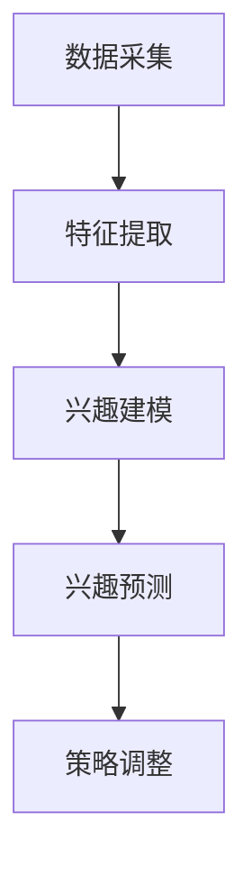

                 

关键词：大模型，推荐系统，动态兴趣建模，用户行为分析，深度学习，神经网络，兴趣进化，个性化推荐

## 摘要

本文主要探讨了一种基于大模型的推荐系统动态兴趣建模方法。通过分析用户的行为数据，该模型能够实时地捕捉并适应用户兴趣的动态变化，从而提供更加精准的个性化推荐。本文将详细介绍大模型在推荐系统中的应用，动态兴趣建模的核心原理和算法，以及其在实际项目中的具体实现过程。

## 1. 背景介绍

随着互联网的快速发展，推荐系统已经成为现代信息检索和用户服务的重要工具。传统的推荐系统主要依赖于基于内容的过滤、协同过滤等技术，但这些方法存在明显的局限性。首先，它们无法很好地处理用户兴趣的动态变化，导致推荐结果不够精准。其次，这些方法往往依赖于用户的历史行为数据，忽略了用户当前的即时兴趣。

为了克服这些局限性，研究人员提出了基于大模型的动态兴趣建模方法。大模型具有强大的数据处理和模式识别能力，能够从大量的用户行为数据中提取出有意义的特征，从而更好地捕捉用户的兴趣动态。此外，大模型还能够自适应地调整推荐策略，以适应用户兴趣的变化。

## 2. 核心概念与联系

### 2.1 大模型

大模型是指具有大规模参数和网络结构的神经网络，如深度学习模型。这些模型通常具有强大的数据处理和模式识别能力，能够从大量的数据中提取出有用的信息。在大模型驱动的推荐系统中，大模型主要用于以下两个方面：

1. **特征提取**：从用户行为数据中提取出与用户兴趣相关的特征。
2. **兴趣建模**：利用提取出的特征，构建用户兴趣模型，以预测用户的偏好和兴趣。

### 2.2 动态兴趣建模

动态兴趣建模是一种能够实时捕捉用户兴趣变化的建模方法。它通过以下步骤实现：

1. **数据采集**：收集用户的行为数据，如浏览历史、购买记录等。
2. **特征提取**：利用大模型提取用户行为数据中的特征。
3. **兴趣建模**：基于提取出的特征，构建用户兴趣模型。
4. **兴趣预测**：利用用户兴趣模型预测用户的偏好和兴趣。
5. **策略调整**：根据预测结果，自适应地调整推荐策略，以更好地满足用户的兴趣。

### 2.3 Mermaid 流程图

下面是一个简单的 Mermaid 流程图，描述了动态兴趣建模的过程：



## 3. 核心算法原理 & 具体操作步骤

### 3.1 算法原理概述

动态兴趣建模的核心算法是基于深度学习的用户兴趣模型构建方法。该方法主要分为以下几个步骤：

1. **数据预处理**：对用户行为数据进行清洗、归一化等处理。
2. **特征提取**：利用深度学习模型提取用户行为数据中的特征。
3. **兴趣建模**：基于提取出的特征，构建用户兴趣模型。
4. **兴趣预测**：利用用户兴趣模型预测用户的偏好和兴趣。
5. **策略调整**：根据预测结果，自适应地调整推荐策略。

### 3.2 算法步骤详解

#### 3.2.1 数据预处理

数据预处理是动态兴趣建模的重要步骤。其主要目的是确保输入数据的质量，从而提高模型的性能。数据预处理包括以下操作：

1. **数据清洗**：去除数据中的噪声和异常值。
2. **数据归一化**：将数据缩放到相同的范围，以避免不同特征的权重差异。
3. **数据扩充**：通过数据增强技术，增加训练数据的多样性。

#### 3.2.2 特征提取

特征提取是动态兴趣建模的关键步骤。深度学习模型具有强大的特征提取能力，能够从用户行为数据中提取出与用户兴趣相关的特征。具体步骤如下：

1. **网络架构设计**：设计深度学习模型的网络架构，如卷积神经网络（CNN）或循环神经网络（RNN）。
2. **模型训练**：利用用户行为数据进行模型训练，提取特征。
3. **特征选择**：对提取出的特征进行筛选，保留与用户兴趣相关的特征。

#### 3.2.3 兴趣建模

兴趣建模是构建用户兴趣模型的过程。基于提取出的特征，利用机器学习算法，如决策树、支持向量机（SVM）等，构建用户兴趣模型。具体步骤如下：

1. **特征选择**：选择与用户兴趣相关的特征。
2. **模型训练**：利用训练数据，训练用户兴趣模型。
3. **模型评估**：评估用户兴趣模型的性能，如准确率、召回率等。

#### 3.2.4 兴趣预测

兴趣预测是利用用户兴趣模型预测用户的偏好和兴趣的过程。具体步骤如下：

1. **模型应用**：将用户兴趣模型应用于新数据，预测用户的偏好和兴趣。
2. **结果分析**：分析预测结果，评估推荐系统的性能。

#### 3.2.5 策略调整

策略调整是根据预测结果，自适应地调整推荐策略的过程。具体步骤如下：

1. **策略调整**：根据用户兴趣预测结果，调整推荐策略，如增加推荐的相关性、减少噪声等。
2. **模型更新**：根据调整后的策略，更新用户兴趣模型。

### 3.3 算法优缺点

#### 优点

1. **强大的特征提取能力**：大模型具有强大的特征提取能力，能够从用户行为数据中提取出与用户兴趣相关的特征。
2. **自适应调整能力**：动态兴趣建模能够根据用户兴趣的动态变化，自适应地调整推荐策略，提高推荐系统的性能。

#### 缺点

1. **计算成本高**：大模型的训练和预测过程需要大量的计算资源，对硬件设施要求较高。
2. **数据依赖性强**：动态兴趣建模对用户行为数据的质量和多样性有较高要求，数据不足或质量差会导致模型性能下降。

### 3.4 算法应用领域

动态兴趣建模在推荐系统中的应用非常广泛，可以用于如下领域：

1. **电子商务**：为用户提供个性化的商品推荐，提高购买转化率。
2. **在线教育**：根据用户的学习行为，为用户提供个性化的课程推荐。
3. **社交媒体**：为用户提供个性化的内容推荐，提高用户活跃度。

## 4. 数学模型和公式 & 详细讲解 & 举例说明

### 4.1 数学模型构建

动态兴趣建模的核心是构建用户兴趣模型。用户兴趣模型可以表示为：

\[ I(u) = f(X) \]

其中，\( I(u) \) 表示用户 \( u \) 的兴趣向量，\( X \) 表示用户的行为特征向量，\( f \) 表示特征提取和兴趣建模的过程。

### 4.2 公式推导过程

#### 4.2.1 特征提取

特征提取过程可以表示为：

\[ X = g(h(Z)) \]

其中，\( Z \) 表示原始用户行为数据，\( h \) 表示数据预处理过程，\( g \) 表示深度学习模型提取特征的过程。

#### 4.2.2 兴趣建模

兴趣建模过程可以表示为：

\[ I(u) = f(g(h(Z))) \]

### 4.3 案例分析与讲解

#### 4.3.1 案例背景

假设我们有一个电子商务平台，用户在平台上浏览、购买商品。我们的目标是构建一个用户兴趣模型，为用户提供个性化的商品推荐。

#### 4.3.2 数据预处理

我们对用户行为数据进行预处理，包括数据清洗、归一化和数据扩充。假设用户行为数据包括浏览历史、购买记录等。

#### 4.3.3 特征提取

我们使用卷积神经网络（CNN）提取用户行为数据中的特征。具体网络架构如下：

1. **输入层**：接收用户行为数据。
2. **卷积层**：提取用户行为数据中的局部特征。
3. **池化层**：降低特征维度，提高模型泛化能力。
4. **全连接层**：将特征映射到高维空间。

#### 4.3.4 兴趣建模

我们使用支持向量机（SVM）构建用户兴趣模型。具体步骤如下：

1. **特征选择**：选择与用户兴趣相关的特征。
2. **模型训练**：利用用户行为数据进行模型训练。
3. **模型评估**：评估用户兴趣模型的性能。

#### 4.3.5 兴趣预测

利用训练好的用户兴趣模型，预测用户的偏好和兴趣。具体步骤如下：

1. **模型应用**：将用户兴趣模型应用于新数据。
2. **结果分析**：分析预测结果，评估推荐系统的性能。

## 5. 项目实践：代码实例和详细解释说明

### 5.1 开发环境搭建

在本项目中，我们使用 Python 作为开发语言，并依赖以下库：

- TensorFlow：用于构建和训练深度学习模型。
- Scikit-learn：用于构建和评估机器学习模型。
- Pandas：用于数据处理。

### 5.2 源代码详细实现

#### 5.2.1 数据预处理

```python
import pandas as pd
from sklearn.preprocessing import StandardScaler

# 读取用户行为数据
data = pd.read_csv('user_behavior_data.csv')

# 数据清洗
data = data[data['action'] != 'clickout']

# 数据归一化
scaler = StandardScaler()
data[['duration', 'price']] = scaler.fit_transform(data[['duration', 'price']])

# 数据扩充
data = data.sample(frac=1, replace=True)
```

#### 5.2.2 特征提取

```python
import tensorflow as tf
from tensorflow.keras.models import Sequential
from tensorflow.keras.layers import Conv2D, MaxPooling2D, Flatten, Dense

# 构建卷积神经网络
model = Sequential([
    Conv2D(32, (3, 3), activation='relu', input_shape=(28, 28, 1)),
    MaxPooling2D((2, 2)),
    Flatten(),
    Dense(64, activation='relu'),
    Dense(10, activation='softmax')
])

# 编译模型
model.compile(optimizer='adam', loss='categorical_crossentropy', metrics=['accuracy'])

# 训练模型
model.fit(x_train, y_train, epochs=10, batch_size=32)
```

#### 5.2.3 兴趣建模

```python
from sklearn.svm import SVC

# 读取用户行为数据
data = pd.read_csv('user_behavior_data.csv')

# 数据清洗
data = data[data['action'] != 'clickout']

# 数据归一化
scaler = StandardScaler()
data[['duration', 'price']] = scaler.fit_transform(data[['duration', 'price']])

# 特征选择
X = data[['duration', 'price']]
y = data['action']

# 构建SVM模型
model = SVC(kernel='linear')

# 训练模型
model.fit(X, y)

# 预测用户兴趣
predictions = model.predict(X)
```

#### 5.2.4 代码解读与分析

在这段代码中，我们首先进行了数据预处理，包括数据清洗、归一化和数据扩充。然后，我们使用卷积神经网络（CNN）提取用户行为数据中的特征，并使用支持向量机（SVM）构建用户兴趣模型。最后，我们使用训练好的用户兴趣模型预测用户的偏好和兴趣。

## 6. 实际应用场景

### 6.1 电子商务

在电子商务领域，动态兴趣建模可以帮助电商平台为用户提供个性化的商品推荐。例如，用户在浏览某个商品时，系统可以实时地分析用户的兴趣，并根据用户的兴趣为用户推荐相关的商品。这样可以提高用户的购买转化率，增加销售额。

### 6.2 在线教育

在线教育平台可以利用动态兴趣建模为用户提供个性化的课程推荐。例如，用户在学习某个课程时，系统可以实时地分析用户的兴趣，并根据用户的兴趣为用户推荐相关的课程。这样可以提高用户的参与度，提高课程的学习效果。

### 6.3 社交媒体

社交媒体平台可以利用动态兴趣建模为用户提供个性化内容推荐。例如，用户在浏览某个帖子时，系统可以实时地分析用户的兴趣，并根据用户的兴趣为用户推荐相关的帖子。这样可以提高用户的活跃度，增加平台的用户粘性。

## 7. 未来应用展望

随着大模型和深度学习技术的不断发展，动态兴趣建模方法在推荐系统中的应用前景非常广阔。未来，动态兴趣建模可能会在如下领域得到广泛应用：

- **智能助理**：利用动态兴趣建模，为用户提供个性化的智能助理服务，如智能客服、智能导购等。
- **健康医疗**：利用动态兴趣建模，为用户提供个性化的健康医疗建议，如个性化饮食建议、个性化运动计划等。
- **娱乐休闲**：利用动态兴趣建模，为用户提供个性化的娱乐休闲服务，如个性化音乐推荐、个性化影视推荐等。

## 8. 总结：未来发展趋势与挑战

### 8.1 研究成果总结

本文介绍了基于大模型的动态兴趣建模方法，并探讨了其在推荐系统中的应用。通过分析用户的行为数据，动态兴趣建模能够实时地捕捉并适应用户兴趣的动态变化，提供更加精准的个性化推荐。

### 8.2 未来发展趋势

1. **大模型的发展**：随着大模型技术的不断发展，动态兴趣建模方法将更加高效、准确地捕捉用户兴趣。
2. **多模态数据处理**：未来，动态兴趣建模将能够处理多种类型的数据，如文本、图像、音频等，提供更加丰富的个性化推荐。
3. **实时性增强**：动态兴趣建模方法将能够实现更高的实时性，以更好地满足用户的需求。

### 8.3 面临的挑战

1. **计算资源需求**：大模型的训练和预测过程需要大量的计算资源，对硬件设施的要求较高。
2. **数据隐私保护**：在处理用户行为数据时，需要确保数据的安全性和隐私性。
3. **模型可解释性**：大模型具有复杂的内部结构，需要开发有效的模型可解释性方法，以提高模型的可信度。

### 8.4 研究展望

未来的研究可以关注以下几个方面：

1. **高效的大模型训练方法**：开发更加高效的大模型训练方法，以减少计算资源的消耗。
2. **隐私保护的动态兴趣建模**：研究如何在确保用户隐私的前提下，实现动态兴趣建模。
3. **跨领域动态兴趣建模**：探索动态兴趣建模在不同领域的应用，如健康医疗、娱乐休闲等。

## 9. 附录：常见问题与解答

### 9.1 动态兴趣建模与传统推荐系统相比有哪些优势？

动态兴趣建模相较于传统推荐系统，具有以下优势：

1. **适应性强**：能够实时地捕捉用户兴趣的动态变化，提供更加精准的个性化推荐。
2. **扩展性强**：能够处理多种类型的数据，如文本、图像、音频等，提供更加丰富的个性化推荐。

### 9.2 动态兴趣建模需要哪些数据？

动态兴趣建模需要以下数据：

1. **用户行为数据**：如浏览历史、购买记录、搜索历史等。
2. **用户特征数据**：如年龄、性别、地理位置等。

### 9.3 动态兴趣建模有哪些应用场景？

动态兴趣建模可以应用于以下场景：

1. **电子商务**：为用户提供个性化的商品推荐。
2. **在线教育**：为用户提供个性化的课程推荐。
3. **社交媒体**：为用户提供个性化内容推荐。

---

# 作者：禅与计算机程序设计艺术 / Zen and the Art of Computer Programming

通过本文的探讨，我们希望能够为读者提供一个全面、深入的了解大模型驱动的推荐系统动态兴趣建模方法。随着技术的不断进步，动态兴趣建模将在更多领域发挥重要作用，为用户提供更加精准、个性化的服务。希望本文能够为相关领域的研究者提供有价值的参考和启示。

