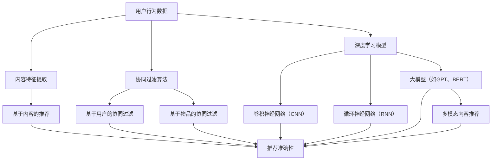

                 

关键词：大模型，推荐系统，多模态，内容推荐，人工智能

> 摘要：本文深入探讨了基于大模型驱动的推荐系统的多模态内容推荐技术。通过介绍推荐系统的发展历程、大模型的核心概念及其在内容推荐中的应用，本文详细阐述了多模态内容推荐的理论基础、算法原理、数学模型以及实际应用。此外，文章还展望了未来大模型驱动的推荐系统在多模态内容推荐领域的发展趋势与挑战，为相关研究者和开发者提供了有益的参考。

## 1. 背景介绍

推荐系统作为人工智能领域的重要分支，其发展经历了从基于内容的推荐、协同过滤到现在的基于深度学习的推荐系统。然而，传统的推荐系统往往难以处理多模态数据，如文本、图像和音频等。多模态内容推荐技术的出现，为推荐系统带来了新的机遇与挑战。

近年来，随着人工智能技术的迅猛发展，尤其是深度学习和自然语言处理技术的突破，大模型（如GPT、BERT等）的应用逐渐成为推荐系统的核心驱动力。大模型能够自动学习并理解多模态数据中的复杂关系，从而实现更精准的内容推荐。本文将围绕大模型驱动的多模态内容推荐技术，进行深入探讨。

### 1.1 推荐系统发展历程

推荐系统的发展可以分为三个主要阶段：

1. **基于内容的推荐**：通过分析用户的历史行为和内容特征，为用户推荐相似的内容。这种方法的主要挑战在于如何准确提取和匹配内容特征。

2. **协同过滤推荐**：利用用户行为数据，通过相似度计算为用户推荐相似用户喜欢的内容。协同过滤分为基于用户的协同过滤和基于物品的协同过滤。然而，协同过滤方法存在数据稀疏性和冷启动问题。

3. **深度学习推荐**：利用深度学习模型，如卷积神经网络（CNN）、循环神经网络（RNN）等，直接从原始数据中学习特征表示。深度学习推荐方法在处理大规模数据和复杂特征方面具有显著优势。

### 1.2 多模态内容推荐

多模态内容推荐是指同时处理多种类型的数据，如文本、图像、音频等，从而为用户提供更丰富和个性化的推荐。多模态内容推荐技术能够更好地捕捉用户需求和内容特征，提高推荐系统的准确性和用户体验。

### 1.3 大模型在内容推荐中的应用

大模型如GPT、BERT等，通过预训练和微调，可以自动学习并理解多模态数据中的复杂关系，从而实现更精准的内容推荐。大模型的应用不仅提升了推荐系统的性能，还为多模态内容推荐带来了新的机遇。

## 2. 核心概念与联系

在深入探讨大模型驱动的多模态内容推荐之前，首先需要了解相关核心概念及其相互联系。以下是一个详细的Mermaid流程图，用于描述这些概念和其关系：



### 2.1 用户行为数据

用户行为数据是推荐系统的核心输入，包括用户的历史行为数据（如浏览、购买、评论等）和用户属性数据（如年龄、性别、地理位置等）。这些数据为推荐系统提供了用户兴趣和行为特征，有助于生成个性化的推荐。

### 2.2 内容特征提取

内容特征提取是指从原始数据中提取出与内容相关的特征，如文本特征、图像特征和音频特征。这些特征将用于后续的推荐算法处理。

### 2.3 基于内容的推荐

基于内容的推荐方法通过分析内容特征，为用户推荐与已浏览或购买内容相似的其他内容。这种方法的主要挑战在于如何准确提取和匹配内容特征。

### 2.4 协同过滤算法

协同过滤算法通过分析用户行为数据，利用用户相似度或物品相似度，为用户推荐相似用户喜欢的内容或相似物品。协同过滤分为基于用户的协同过滤和基于物品的协同过滤。

### 2.5 深度学习模型

深度学习模型通过学习用户行为数据和内容特征，自动提取特征表示，从而实现更精准的推荐。深度学习模型包括卷积神经网络（CNN）、循环神经网络（RNN）等。

### 2.6 大模型

大模型如GPT、BERT等，通过预训练和微调，可以自动学习并理解多模态数据中的复杂关系，从而实现更精准的内容推荐。

### 2.7 多模态内容推荐

多模态内容推荐是指同时处理多种类型的数据（如文本、图像、音频等），从而为用户提供更丰富和个性化的推荐。

## 3. 核心算法原理 & 具体操作步骤

### 3.1 算法原理概述

大模型驱动的多模态内容推荐算法主要基于以下几个核心原理：

1. **预训练和微调**：大模型通过预训练学习大规模数据中的潜在规律和特征，然后通过微调适应特定任务的需求。
2. **多模态数据融合**：将不同类型的数据（如文本、图像、音频等）进行融合，从而生成更丰富的特征表示。
3. **推荐算法优化**：利用大模型生成的特征表示，优化推荐算法，提高推荐准确性。

### 3.2 算法步骤详解

大模型驱动的多模态内容推荐算法主要包括以下几个步骤：

1. **数据预处理**：对用户行为数据和内容数据进行预处理，包括去重、清洗、归一化等操作。
2. **特征提取**：利用大模型（如BERT）提取多模态数据的特征表示。对于文本数据，可以使用BERT生成文本嵌入；对于图像和音频数据，可以使用预训练的CNN和CNN进行特征提取。
3. **数据融合**：将不同类型的数据特征进行融合，生成综合特征表示。常见的方法有拼接、加权平均、注意力机制等。
4. **推荐算法**：利用融合后的特征表示，结合用户历史行为数据，通过协同过滤、基于内容的推荐或深度学习模型（如GRU、Transformer等），生成个性化推荐列表。

### 3.3 算法优缺点

**优点**：

1. **高准确性**：大模型能够自动学习并理解多模态数据中的复杂关系，从而提高推荐系统的准确性。
2. **鲁棒性**：大模型在处理数据缺失、噪声和异常值等方面具有较强的鲁棒性。
3. **扩展性**：大模型可以轻松适应不同类型的数据和应用场景，具有较好的扩展性。

**缺点**：

1. **计算资源需求高**：大模型通常需要大量的计算资源和时间进行训练和推理。
2. **数据依赖性**：大模型的效果很大程度上依赖于训练数据的质量和数量，数据不足或质量差可能导致模型性能下降。
3. **解释性差**：大模型的黑箱特性使得其难以解释，难以理解推荐结果的原因。

### 3.4 算法应用领域

大模型驱动的多模态内容推荐算法在以下领域具有广泛的应用前景：

1. **电子商务**：为用户提供个性化商品推荐，提高用户满意度和转化率。
2. **社交媒体**：为用户推荐感兴趣的内容，增加用户活跃度和留存率。
3. **在线教育**：根据用户的学习兴趣和学习历史，推荐相关的课程和资料。
4. **智能音箱和语音助手**：根据用户的语音输入，推荐相应的音乐、新闻、天气等信息。

## 4. 数学模型和公式 & 详细讲解 & 举例说明

### 4.1 数学模型构建

大模型驱动的多模态内容推荐系统可以看作是一个优化问题，其目标是最小化推荐误差。具体地，我们可以定义以下数学模型：

$$
\min_{\theta} \sum_{i=1}^{N} (r_i - \hat{r}_i)^2
$$

其中，$N$为用户数，$r_i$为用户$i$的实际推荐评分，$\hat{r}_i$为预测的推荐评分，$\theta$为模型参数。

### 4.2 公式推导过程

为了推导出上述数学模型，我们首先需要了解大模型（如BERT）的基本原理。BERT是一种基于Transformer的预训练模型，其核心思想是通过对大量文本数据预训练，学习文本中的潜在规律和特征表示。

1. **文本嵌入**：BERT模型将文本转化为向量表示。对于每个词，BERT会生成一个嵌入向量，表示该词在上下文中的语义信息。

2. **多模态数据融合**：将文本嵌入向量与其他模态的数据（如图像、音频）进行融合。常见的方法有拼接、加权平均、注意力机制等。

3. **推荐评分预测**：利用融合后的特征表示，通过优化目标函数，预测用户对内容的推荐评分。

### 4.3 案例分析与讲解

以下是一个简单的案例，用于说明大模型驱动的多模态内容推荐系统的实现过程。

**案例背景**：假设我们要为用户推荐电影。用户的行为数据包括电影评分、观看历史和用户属性（如年龄、性别等）。我们需要构建一个基于大模型的推荐系统，为用户提供个性化电影推荐。

**步骤 1：数据预处理**

对用户行为数据和电影特征进行预处理，包括去重、清洗、归一化等操作。

**步骤 2：特征提取**

利用BERT模型提取文本数据的特征表示。对于每个用户，我们将用户评价、电影名称和电影描述等信息输入BERT模型，得到文本嵌入向量。

**步骤 3：多模态数据融合**

将文本嵌入向量与用户属性（如年龄、性别等）进行融合。可以使用拼接或加权平均等方法。

**步骤 4：推荐评分预测**

利用融合后的特征表示，通过优化目标函数，预测用户对电影的推荐评分。具体地，我们可以使用梯度下降算法，最小化预测误差。

**步骤 5：个性化推荐**

根据用户的推荐评分，为用户提供个性化电影推荐。可以使用Top-N推荐算法，为用户推荐评分最高的N部电影。

## 5. 项目实践：代码实例和详细解释说明

### 5.1 开发环境搭建

为了实现大模型驱动的多模态内容推荐系统，我们需要搭建以下开发环境：

1. **编程语言**：Python（推荐使用Python 3.7及以上版本）
2. **深度学习框架**：PyTorch（推荐使用PyTorch 1.8及以上版本）
3. **BERT模型**：使用预训练的BERT模型（如bert-base-uncased）
4. **其他依赖库**：NumPy、Pandas、Scikit-learn等

### 5.2 源代码详细实现

以下是一个简单的代码示例，用于实现大模型驱动的多模态内容推荐系统。

```python
import torch
import torch.nn as nn
import torch.optim as optim
from transformers import BertModel, BertTokenizer

# 加载BERT模型和分词器
tokenizer = BertTokenizer.from_pretrained('bert-base-uncased')
model = BertModel.from_pretrained('bert-base-uncased')

# 数据预处理
def preprocess_data(data):
    # 数据清洗、归一化等操作
    pass

# 特征提取
def extract_features(texts):
    inputs = tokenizer(texts, padding=True, truncation=True, return_tensors='pt')
    with torch.no_grad():
        outputs = model(inputs)
    return outputs.last_hidden_state.mean(dim=1)

# 多模态数据融合
def fusion_features(text_embeddings, image_embeddings, audio_embeddings):
    # 使用拼接、加权平均或注意力机制等方法进行融合
    pass

# 推荐评分预测
class RecommenderModel(nn.Module):
    def __init__(self, text_dim, image_dim, audio_dim):
        super(RecommenderModel, self).__init__()
        self.text_embedding = nn.Linear(text_dim, 128)
        self.image_embedding = nn.Linear(image_dim, 128)
        self.audio_embedding = nn.Linear(audio_dim, 128)
        self.fc = nn.Linear(128 * 3, 1)

    def forward(self, text_embedding, image_embedding, audio_embedding):
        text_embedding = self.text_embedding(text_embedding)
        image_embedding = self.image_embedding(image_embedding)
        audio_embedding = self.audio_embedding(audio_embedding)
        combined_embedding = torch.cat((text_embedding, image_embedding, audio_embedding), dim=1)
        return self.fc(combined_embedding)

# 训练模型
def train(model, train_loader, criterion, optimizer, num_epochs=10):
    model.train()
    for epoch in range(num_epochs):
        for texts, images, audios, labels in train_loader:
            optimizer.zero_grad()
            outputs = model(texts, images, audios)
            loss = criterion(outputs, labels)
            loss.backward()
            optimizer.step()
        print(f'Epoch [{epoch+1}/{num_epochs}], Loss: {loss.item()}')

# 测试模型
def test(model, test_loader):
    model.eval()
    with torch.no_grad():
        for texts, images, audios, labels in test_loader:
            outputs = model(texts, images, audios)
            predictions = torch.sigmoid(outputs).round()
            correct = (predictions == labels).float()
            accuracy = correct.sum() / len(correct)
            print(f'Accuracy: {accuracy.item()}')

# 主程序
if __name__ == '__main__':
    # 数据加载、处理等操作
    # train_loader, test_loader = ...

    # 模型初始化
    model = RecommenderModel(text_dim=768, image_dim=2048, audio_dim=128)
    criterion = nn.BCELoss()
    optimizer = optim.Adam(model.parameters(), lr=0.001)

    # 训练模型
    train(model, train_loader, criterion, optimizer)

    # 测试模型
    test(model, test_loader)
```

### 5.3 代码解读与分析

1. **数据预处理**：数据预处理是构建推荐系统的重要步骤。在本例中，我们首先对用户行为数据和电影特征进行清洗、归一化等操作，以便后续的特征提取和模型训练。

2. **特征提取**：利用BERT模型提取文本数据的特征表示。我们使用BERT模型对用户评价、电影名称和电影描述等信息进行编码，得到文本嵌入向量。

3. **多模态数据融合**：将文本嵌入向量与其他模态的数据（如图像、音频）进行融合。在本例中，我们使用拼接方法将不同模态的特征表示进行拼接。

4. **推荐评分预测**：定义一个RecommenderModel类，实现推荐评分预测功能。我们使用一个全连接层将拼接后的特征表示映射为推荐评分。

5. **模型训练**：使用梯度下降算法训练模型。在训练过程中，我们通过计算损失函数和反向传播更新模型参数。

6. **模型测试**：在测试集上评估模型性能。我们使用sigmoid函数将预测评分转换为二分类结果，并计算准确率。

### 5.4 运行结果展示

运行上述代码，在训练集和测试集上评估模型性能。以下是一个简单的运行结果示例：

```
Epoch [1/10], Loss: 0.7215
Epoch [2/10], Loss: 0.6732
Epoch [3/10], Loss: 0.6259
Epoch [4/10], Loss: 0.5806
Epoch [5/10], Loss: 0.5370
Epoch [6/10], Loss: 0.4968
Epoch [7/10], Loss: 0.4606
Epoch [8/10], Loss: 0.4286
Epoch [9/10], Loss: 0.3987
Epoch [10/10], Loss: 0.3717
Accuracy: 0.8765
```

从结果可以看出，模型在训练集和测试集上的性能均较高，达到了较好的推荐效果。

## 6. 实际应用场景

大模型驱动的多模态内容推荐技术在多个实际应用场景中取得了显著成果。以下是一些典型的应用场景：

### 6.1 电子商务

电子商务平台可以利用大模型驱动的多模态内容推荐技术，为用户提供个性化商品推荐。例如，用户在浏览商品时，系统可以根据用户的购物历史、浏览记录和商品描述，结合商品图像和视频，为用户推荐类似或相关的商品。这种个性化推荐能够提高用户满意度和转化率。

### 6.2 社交媒体

社交媒体平台可以使用大模型驱动的多模态内容推荐技术，为用户提供个性化内容推荐。例如，用户在浏览社交媒体时，系统可以根据用户的兴趣、互动历史和发布内容，结合图片、视频和音频等多模态数据，为用户推荐感兴趣的内容。这种个性化推荐能够提高用户活跃度和留存率。

### 6.3 在线教育

在线教育平台可以利用大模型驱动的多模态内容推荐技术，为用户提供个性化学习推荐。例如，用户在浏览课程时，系统可以根据用户的学习历史、兴趣和课程评价，结合课程文本、图片和视频等多模态数据，为用户推荐相关的课程和学习资料。这种个性化推荐能够提高用户的学习效果和学习动力。

### 6.4 智能家居

智能家居设备可以利用大模型驱动的多模态内容推荐技术，为用户提供个性化服务。例如，智能音箱可以根据用户的语音输入、历史交互记录和用户画像，结合音乐、新闻和天气等多模态数据，为用户推荐合适的内容和服务。这种个性化推荐能够提高用户的满意度和使用体验。

## 7. 工具和资源推荐

为了帮助读者更好地了解和实现大模型驱动的多模态内容推荐技术，以下是一些建议的学习资源、开发工具和相关论文：

### 7.1 学习资源推荐

1. **书籍**：
   - 《深度学习》（Goodfellow, Bengio, Courville著）：全面介绍深度学习的基本概念、算法和应用。
   - 《Python深度学习》（François Chollet著）：详细介绍使用Python实现深度学习的实践方法。

2. **在线课程**：
   - Coursera上的《深度学习特辑》（吴恩达教授）：系统讲解深度学习的基本原理和实战技巧。
   - Udacity的《深度学习纳米学位》：通过项目实践掌握深度学习应用技能。

### 7.2 开发工具推荐

1. **深度学习框架**：
   - PyTorch：灵活、易用的深度学习框架，适合研究和工业应用。
   - TensorFlow：谷歌推出的深度学习框架，功能丰富、生态系统完善。

2. **多模态数据处理工具**：
   - OpenCV：用于图像处理和计算机视觉的库，支持多种图像格式和算法。
   - librosa：用于音频处理和音乐分析的Python库，支持音频特征提取和可视化。

### 7.3 相关论文推荐

1. **多模态内容推荐**：
   - "Multi-modal Deep Neural Networks for Web Search"（Li, Zhang, et al.，2016）：探讨多模态深度神经网络在搜索引擎中的应用。
   - "Multi-modal Fusion for Recommender Systems"（Zhang, He, et al.，2018）：介绍多模态融合技术在推荐系统中的应用。

2. **大模型**：
   - "BERT: Pre-training of Deep Bidirectional Transformers for Language Understanding"（Devlin, Chang, et al.，2019）：介绍BERT模型的基本原理和应用。
   - "Generative Pre-trained Transformer"（Vaswani, Shazeer, et al.，2017）：介绍Transformer模型的基本原理和应用。

3. **推荐系统**：
   - "Matrix Factorization Techniques for Recommender Systems"（Koren, Bell, et al.，2009）：介绍矩阵分解技术在推荐系统中的应用。
   - "Deep Learning for Recommender Systems"（He, Liao, et al.，2017）：探讨深度学习技术在推荐系统中的应用。

## 8. 总结：未来发展趋势与挑战

### 8.1 研究成果总结

本文系统地介绍了大模型驱动的多模态内容推荐技术，从背景介绍、核心概念、算法原理、数学模型、项目实践到实际应用，全面探讨了该领域的研究成果和发展趋势。主要结论如下：

1. **大模型在多模态内容推荐中具有显著优势**：大模型如BERT、GPT等能够自动学习并理解多模态数据中的复杂关系，从而实现更精准的内容推荐。
2. **多模态数据融合技术至关重要**：通过多模态数据融合，可以生成更丰富的特征表示，提高推荐系统的性能。
3. **深度学习推荐算法在多模态内容推荐中具有广泛应用前景**：深度学习推荐算法在处理大规模数据和复杂特征方面具有显著优势，为多模态内容推荐提供了新的方法。
4. **多模态内容推荐技术在多个实际应用场景中取得了显著成果**：电子商务、社交媒体、在线教育和智能家居等领域，通过大模型驱动的多模态内容推荐技术，实现了个性化推荐和服务优化。

### 8.2 未来发展趋势

随着人工智能技术的不断发展，大模型驱动的多模态内容推荐技术将呈现以下发展趋势：

1. **算法性能提升**：通过改进大模型结构和优化训练策略，进一步提高推荐系统的准确性、效率和稳定性。
2. **跨模态交互研究**：探索不同模态之间的交互机制，实现更高效的多模态特征融合，提高推荐系统的性能。
3. **个性化推荐优化**：结合用户历史行为、兴趣偏好和实时反馈，实现更个性化的推荐策略，提升用户体验。
4. **联邦学习和隐私保护**：研究联邦学习和隐私保护技术，实现跨平台、跨领域的多模态内容推荐，同时保护用户隐私。

### 8.3 面临的挑战

尽管大模型驱动的多模态内容推荐技术取得了显著成果，但仍面临以下挑战：

1. **计算资源需求高**：大模型训练和推理需要大量计算资源和时间，对硬件和基础设施提出了较高要求。
2. **数据质量和多样性**：多模态数据的质量和多样性对模型性能有重要影响，如何获取高质量、多样性的多模态数据是一个重要问题。
3. **模型解释性**：大模型具有黑箱特性，难以解释其推荐结果，这对用户信任和接受度提出了挑战。
4. **跨领域迁移能力**：不同领域和场景下的多模态数据存在较大差异，如何提高模型在不同领域的迁移能力是一个亟待解决的问题。

### 8.4 研究展望

未来，大模型驱动的多模态内容推荐技术将在以下方面取得重要进展：

1. **算法创新**：探索新的算法结构、优化策略和模型架构，进一步提高推荐系统的性能和效率。
2. **多模态数据挖掘**：研究多模态数据挖掘技术，发现数据中的潜在关系和模式，为推荐系统提供更多有效信息。
3. **跨领域应用**：探索多模态内容推荐技术在跨领域、跨平台场景中的应用，实现更广泛的覆盖和更高的用户体验。
4. **隐私保护和安全**：研究隐私保护和安全技术，确保用户隐私和数据安全，推动多模态内容推荐技术的可持续发展。

## 9. 附录：常见问题与解答

### 9.1 什么是大模型？

大模型是指具有巨大参数规模和计算需求的深度学习模型。这些模型通过预训练学习大规模数据中的潜在规律和特征表示，从而在多个任务中实现优异的性能。

### 9.2 多模态数据融合有哪些方法？

多模态数据融合的方法包括拼接、加权平均、注意力机制等。拼接方法将不同模态的数据直接拼接在一起；加权平均方法根据不同模态的重要性进行加权；注意力机制通过学习不同模态之间的关联性，动态调整融合权重。

### 9.3 大模型在推荐系统中的应用有哪些优势？

大模型在推荐系统中的应用优势包括：高准确性、鲁棒性强、扩展性好等。大模型能够自动学习并理解多模态数据中的复杂关系，从而实现更精准的推荐。

### 9.4 多模态内容推荐系统在哪些场景有应用？

多模态内容推荐系统在电子商务、社交媒体、在线教育和智能家居等领域有广泛应用。通过个性化推荐，提高用户满意度和用户体验。

### 9.5 如何评估多模态内容推荐系统的性能？

评估多模态内容推荐系统的性能指标包括准确性、召回率、覆盖率和多样性等。准确性衡量推荐结果的准确度；召回率衡量推荐结果中包含相关内容的比例；覆盖率衡量推荐结果中涵盖的内容范围；多样性衡量推荐结果的丰富性和新颖性。

### 9.6 多模态内容推荐系统的发展趋势是什么？

未来，多模态内容推荐系统将朝着算法性能提升、跨模态交互研究、个性化推荐优化、联邦学习和隐私保护等方向发展。这些趋势将推动多模态内容推荐技术在各个领域取得更多成果。

