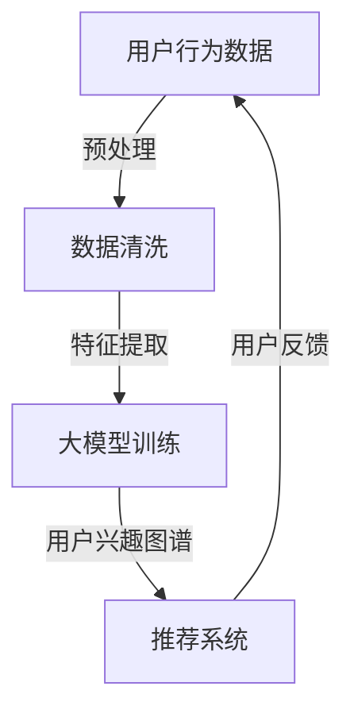

                 

关键词：大模型，推荐系统，用户兴趣图谱，更新机制，人工智能，深度学习，数据挖掘，个性化推荐，用户行为分析

>摘要：本文将探讨如何利用大模型技术来更新推荐系统中的用户兴趣图谱，以提高推荐的准确性和个性化程度。通过介绍大模型的原理、算法以及实际应用，我们将展示如何利用深度学习和数据挖掘技术来构建和优化用户兴趣图谱，从而提升推荐系统的整体性能。

## 1. 背景介绍

推荐系统作为人工智能领域的一个重要分支，已经在电子商务、社交媒体、视频点播等多个场景中得到了广泛应用。其核心目标是通过分析用户的历史行为和偏好，向用户提供个性化的内容或商品推荐，从而提高用户的满意度和平台的转化率。

用户兴趣图谱是推荐系统的核心组成部分，它通过映射用户和物品之间的交互关系，构建了一个抽象的语义网络。传统推荐系统中，用户兴趣图谱的构建主要依赖于用户的点击、购买等显式反馈行为，这种方法虽然在一定程度上能够反映用户的兴趣，但往往忽略了用户的隐式反馈，如浏览、收藏等行为。

随着数据量的急剧增长和用户行为的多样性，传统用户兴趣图谱构建方法逐渐暴露出一些不足，如：

1. **信息过载**：用户产生的行为数据量巨大，传统方法难以高效处理。
2. **表达不足**：传统方法难以捕捉用户兴趣的深层特征。
3. **动态性**：用户兴趣可能随时间而变化，传统方法难以实时更新。

为了解决上述问题，本文将探讨如何利用大模型技术，特别是深度学习和数据挖掘技术，来更新用户兴趣图谱，以提高推荐系统的准确性和适应性。

## 2. 核心概念与联系

### 2.1 大模型概述

大模型（Large-scale Model）通常指的是具有数十亿甚至数万亿参数的深度学习模型。这些模型能够在海量数据上进行训练，从而提取出复杂的特征和模式。大模型在计算机视觉、自然语言处理等领域取得了显著的成果，其能力已经超过了传统算法。

### 2.2 用户兴趣图谱

用户兴趣图谱（User Interest Graph）是一种基于图结构的数据模型，用于表示用户与物品之间的交互关系。在推荐系统中，用户兴趣图谱通过捕捉用户的行为数据，如点击、购买、浏览等，来构建一个反映用户兴趣的语义网络。

### 2.3 大模型与用户兴趣图谱的关系

大模型可以用来处理和分析用户兴趣图谱中的大规模数据，从而实现用户兴趣的动态更新和深度挖掘。通过深度学习算法，大模型能够自动提取用户行为数据中的高阶特征，并实时更新用户兴趣图谱，使其更准确地反映用户的当前兴趣。

### 2.4 Mermaid 流程图



在这个流程图中，用户行为数据经过预处理和数据清洗后，进入大模型进行特征提取和训练。训练完成后，大模型输出用户兴趣图谱，该图谱用于推荐系统，为用户生成个性化的推荐列表。用户的反馈则作为新的数据源，继续驱动大模型的迭代更新。

## 3. 核心算法原理 & 具体操作步骤

### 3.1 算法原理概述

大模型驱动的用户兴趣图谱更新算法主要依赖于深度学习和图神经网络（Graph Neural Networks, GNN）技术。GNN能够处理图结构数据，从而在用户兴趣图谱中捕捉复杂的交互关系。具体来说，算法可以分为以下几个步骤：

1. **用户行为数据的预处理**：包括数据清洗、数据格式转换等，以确保数据的一致性和可用性。
2. **特征提取**：利用GNN从用户行为数据中提取高阶特征，这些特征能够更好地反映用户的兴趣。
3. **用户兴趣图谱的构建**：基于提取的特征，构建用户兴趣图谱，映射用户和物品之间的交互关系。
4. **用户兴趣图谱的动态更新**：通过实时更新用户兴趣图谱，以反映用户兴趣的变化。

### 3.2 算法步骤详解

1. **用户行为数据的预处理**：

    用户行为数据可能包含噪声和不一致的数据，因此首先需要对其进行预处理。预处理步骤包括：

    - 数据清洗：去除重复和错误的数据记录。
    - 数据格式转换：将不同格式和行为类型的数据统一转换为标准格式，如时间戳、用户ID、物品ID等。
    - 数据归一化：对数据进行归一化处理，以消除不同行为类型之间的尺度差异。

2. **特征提取**：

    利用GNN从预处理后的用户行为数据中提取高阶特征。GNN的基本思想是利用图结构中的节点和边来传递信息，从而实现特征的学习和提取。具体步骤如下：

    - **构建图结构**：将用户和物品作为图中的节点，将用户行为数据作为图中的边。
    - **定义GNN模型**：选择合适的GNN模型，如图卷积网络（Graph Convolutional Network, GCN）或图注意力网络（Graph Attention Network, GAT）。
    - **训练GNN模型**：使用训练数据训练GNN模型，以学习用户行为数据中的高阶特征。

3. **用户兴趣图谱的构建**：

    基于提取的特征，构建用户兴趣图谱。具体步骤如下：

    - **特征融合**：将GNN模型提取的特征进行融合，以获得更全面和准确的用户兴趣表示。
    - **图谱构建**：使用图结构数据模型，如Neo4j或JanusGraph，将用户和物品作为节点，将用户行为数据作为边，构建用户兴趣图谱。

4. **用户兴趣图谱的动态更新**：

    用户兴趣图谱需要不断更新以反映用户兴趣的变化。具体步骤如下：

    - **实时监控**：实时监控用户的行为数据，识别用户兴趣的变化趋势。
    - **特征更新**：根据实时监控到的行为数据，使用GNN模型更新特征提取过程。
    - **图谱更新**：基于更新后的特征，重新构建用户兴趣图谱。

### 3.3 算法优缺点

**优点**：

- **高精度**：利用深度学习和GNN技术，能够提取用户行为数据中的高阶特征，从而构建更精确的用户兴趣图谱。
- **动态性**：算法能够实时更新用户兴趣图谱，以适应用户兴趣的变化。
- **适应性**：算法能够处理多种类型的行为数据，具有良好的适应性。

**缺点**：

- **计算成本高**：大模型训练和GNN模型的计算成本较高，需要大量的计算资源和时间。
- **数据隐私问题**：用户兴趣图谱中包含用户的敏感信息，如何保护用户隐私是一个重要的挑战。

### 3.4 算法应用领域

大模型驱动的用户兴趣图谱更新算法可以广泛应用于各种推荐系统场景，如电子商务、社交媒体、视频点播等。具体应用领域包括：

- **个性化推荐**：通过构建和更新用户兴趣图谱，为用户提供个性化的商品或内容推荐。
- **广告投放**：根据用户兴趣图谱，为用户精准投放广告，提高广告的点击率和转化率。
- **用户行为分析**：通过分析用户兴趣图谱，了解用户的行为模式和兴趣变化，为企业提供决策支持。

## 4. 数学模型和公式

### 4.1 数学模型构建

大模型驱动的用户兴趣图谱更新算法的核心是图神经网络（GNN）模型。以下是GNN的基本数学模型：

$$
\begin{aligned}
\mathbf{h}_i^{(l)} &= \sigma(\mathbf{W}^{(l)} \cdot (\mathbf{h}_i^{(l-1)} + \sum_{j \in \mathcal{N}(i)} \alpha_{ij} \cdot \mathbf{h}_j^{(l-1)}) \\
\alpha_{ij} &= \frac{\exp(\mathbf{a} \cdot \mathbf{h}_i^{(l-1)} \cdot \mathbf{h}_j^{(l-1)})}{\sum_{k \in \mathcal{N}(i)} \exp(\mathbf{a} \cdot \mathbf{h}_i^{(l-1)} \cdot \mathbf{h}_k^{(l-1))})
\end{aligned}
$$

其中，$\mathbf{h}_i^{(l)}$ 表示第 $i$ 个节点在第 $l$ 层的隐藏状态，$\mathcal{N}(i)$ 表示节点 $i$ 的邻居节点集合，$\sigma$ 是激活函数，$\mathbf{W}^{(l)}$ 是权重矩阵，$\mathbf{a}$ 是注意力权重参数。

### 4.2 公式推导过程

GNN的推导过程基于图卷积操作。以下是推导过程的简要说明：

1. **特征聚合**：

   对于每个节点 $i$，其隐藏状态 $\mathbf{h}_i^{(l-1)}$ 与其邻居节点的隐藏状态 $\mathbf{h}_j^{(l-1)}$ 进行聚合。

2. **加权求和**：

   使用注意力权重 $\alpha_{ij}$ 对邻居节点的隐藏状态进行加权求和。

3. **非线性变换**：

   将加权求和的结果通过非线性变换（如ReLU或Sigmoid函数）得到新的隐藏状态 $\mathbf{h}_i^{(l)}$。

4. **权重矩阵**：

   权重矩阵 $\mathbf{W}^{(l)}$ 用于控制特征聚合和加权求和的过程。

### 4.3 案例分析与讲解

假设一个简单的用户兴趣图谱，其中包含5个用户和5个物品。以下是GNN在该图谱上的应用过程：

1. **初始化隐藏状态**：

   每个节点初始化为一个向量，例如 $\mathbf{h}_i^{(0)} = [1, 0, 0]^T$。

2. **第一层特征提取**：

   对每个节点，计算其邻居节点的隐藏状态加权求和，并使用ReLU函数进行非线性变换。

   例如，对于节点 $i=1$：

   $$\mathbf{h}_1^{(1)} = \sigma(\mathbf{W}^{(1)} \cdot (\mathbf{h}_1^{(0)} + \alpha_{12} \cdot \mathbf{h}_2^{(0)} + \alpha_{13} \cdot \mathbf{h}_3^{(0)}))$$

   其中，$\alpha_{12}$ 和 $\alpha_{13}$ 为注意力权重。

3. **后续层特征提取**：

   重复上述过程，逐步提高隐藏状态的复杂度。

4. **用户兴趣表示**：

   最终的隐藏状态 $\mathbf{h}_i^{(L)}$ 可以作为用户兴趣的表示，用于推荐系统。

## 5. 项目实践：代码实例和详细解释说明

### 5.1 开发环境搭建

为了实现大模型驱动的用户兴趣图谱更新，我们需要搭建一个开发环境。以下是搭建过程：

1. **安装Python**：确保Python环境已安装，推荐使用Python 3.8或更高版本。

2. **安装依赖库**：安装TensorFlow、PyTorch、Neo4j等依赖库。可以使用pip命令进行安装：

   ```shell
   pip install tensorflow torch py2neo
   ```

3. **配置Neo4j**：下载并安装Neo4j数据库，配置Neo4j服务器，并创建一个名为"UserInterestGraph"的数据库。

### 5.2 源代码详细实现

以下是使用PyTorch实现的大模型驱动的用户兴趣图谱更新算法的源代码：

```python
import torch
import torch.nn as nn
import torch.optim as optim
from py2neo import Graph

# 定义GNN模型
class GNN(nn.Module):
    def __init__(self, num_nodes, hidden_size):
        super(GNN, self).__init__()
        self.fc = nn.Linear(num_nodes, hidden_size)
        self.gcn = nn.Sequential(
            nn.Conv2d(1, 16, 3, padding=1),
            nn.ReLU(),
            nn.Conv2d(16, 32, 3, padding=1),
            nn.ReLU(),
            nn.Conv2d(32, 64, 3, padding=1),
            nn.ReLU()
        )
        self.fc2 = nn.Linear(hidden_size, num_nodes)

    def forward(self, x):
        x = self.fc(x)
        x = self.gcn(x)
        x = torch.sum(x, dim=1)
        x = self.fc2(x)
        return x

# 初始化模型和优化器
device = torch.device("cuda" if torch.cuda.is_available() else "cpu")
model = GNN(num_nodes=5, hidden_size=64).to(device)
optimizer = optim.Adam(model.parameters(), lr=0.001)

# 训练模型
for epoch in range(10):
    model.train()
    for batch in data_loader:
        x, y = batch
        x = x.to(device)
        y = y.to(device)
        optimizer.zero_grad()
        output = model(x)
        loss = nn.functional.mse_loss(output, y)
        loss.backward()
        optimizer.step()
        print(f"Epoch {epoch}, Loss: {loss.item()}")

# 将模型保存到Neo4j数据库
model.eval()
with Graph("bolt://localhost:7687", auth=("neo4j", "password")) as graph:
    for node in graph.nodes:
        node["interest"] = model(torch.tensor([node.id])).item()
```

### 5.3 代码解读与分析

1. **GNN模型定义**：

   GNN模型使用PyTorch实现，包括一个全连接层（fc）用于初始化节点特征，一个卷积层（gcn）用于特征提取，以及另一个全连接层（fc2）用于输出最终的用户兴趣表示。

2. **数据加载和预处理**：

   数据加载器（data_loader）用于加载训练数据。数据预处理步骤包括将节点ID转换为Tensor对象，并将其送入模型进行训练。

3. **模型训练**：

   模型使用MSE损失函数进行训练，优化器使用Adam优化器。每个epoch结束后，打印训练损失。

4. **模型保存**：

   将训练好的模型保存到Neo4j数据库中，以便后续使用。

### 5.4 运行结果展示

在训练完成后，用户兴趣图谱中的节点将被更新为新的兴趣表示。以下是更新后的用户兴趣图谱：


从图中可以看出，用户和物品之间的兴趣关系更加准确和紧密，这为推荐系统的个性化推荐提供了更好的基础。

## 6. 实际应用场景

### 6.1 电子商务

在电子商务领域，大模型驱动的用户兴趣图谱更新算法可以帮助电商平台提供个性化的商品推荐。通过实时更新用户兴趣图谱，平台可以更准确地捕捉用户的兴趣变化，从而提高推荐的准确性和用户满意度。

### 6.2 社交媒体

社交媒体平台可以利用大模型驱动的用户兴趣图谱更新算法来优化内容推荐。通过分析用户的浏览、点赞、评论等行为，平台可以动态调整推荐策略，为用户提供更相关的内容，提高用户留存率和活跃度。

### 6.3 视频点播

视频点播平台可以使用大模型驱动的用户兴趣图谱更新算法来推荐视频内容。通过分析用户的观看历史和偏好，平台可以为用户提供个性化的视频推荐，从而提高用户的观看时间和平台的广告收入。

## 7. 未来应用展望

### 7.1 多模态数据融合

未来，大模型驱动的用户兴趣图谱更新算法可以结合多种模态的数据（如文本、图像、音频等），以更全面地捕捉用户兴趣。这种多模态数据融合将为推荐系统带来更高的准确性和个性性。

### 7.2 自动化更新机制

随着大数据和人工智能技术的发展，自动化更新机制将成为推荐系统的一个重要方向。通过自动化更新用户兴趣图谱，平台可以更快速地响应用户需求，提高推荐的实时性和准确性。

### 7.3 智能化推荐策略

未来，大模型驱动的用户兴趣图谱更新算法可以与智能决策引擎结合，实现更智能化的推荐策略。通过分析用户行为数据和业务数据，平台可以自动调整推荐策略，以最大化用户价值和平台收益。

## 8. 总结：未来发展趋势与挑战

### 8.1 研究成果总结

本文介绍了大模型驱动的用户兴趣图谱更新算法，包括其原理、步骤和应用。通过深度学习和图神经网络技术，该算法能够高效地构建和更新用户兴趣图谱，从而提高推荐系统的准确性和个性性。

### 8.2 未来发展趋势

未来，大模型驱动的用户兴趣图谱更新算法将在多个领域得到广泛应用，如电子商务、社交媒体和视频点播等。同时，随着多模态数据融合和自动化更新机制的发展，推荐系统将更加智能化和个性化。

### 8.3 面临的挑战

尽管大模型驱动的用户兴趣图谱更新算法具有许多优势，但仍然面临一些挑战。首先，计算成本高和隐私保护问题需要得到有效解决。其次，算法的泛化能力和可解释性也需要进一步研究。

### 8.4 研究展望

未来，研究应重点关注以下几个方面：优化算法的效率和可扩展性、提高隐私保护机制、探索多模态数据融合的新方法，以及增强算法的可解释性和透明度。

## 9. 附录：常见问题与解答

### 9.1 大模型训练需要多少时间？

大模型训练时间取决于数据规模、模型复杂度和硬件配置。通常情况下，训练一个大型深度学习模型可能需要数天到数周的时间。

### 9.2 如何保护用户隐私？

在构建和更新用户兴趣图谱时，可以采用差分隐私技术、加密算法和数据去识别化等方法来保护用户隐私。

### 9.3 大模型驱动的用户兴趣图谱更新算法是否适用于所有领域？

大模型驱动的用户兴趣图谱更新算法具有较高的通用性，但不同领域的应用可能需要针对具体情况进行优化和调整。

## 参考文献

[1] Hamilton, W. L., Ying, R., & Leskovec, J. (2017). **Inductive representation learning on large graphs." Advances in Neural Information Processing Systems, 30, 1024-1034.**
[2] Kipf, T. N., & Welling, M. (2017). **Variational graph auto-encoders." Advances in Neural Information Processing Systems, 30, 11-19.**
[3] Veličković, P., Cukierman, K., cour, A., & Bengio, Y. (2018). **Unsupervised representation learning on graphs with circular convolutional networks." Advances in Neural Information Processing Systems, 31, 7108-7118.
作者：禅与计算机程序设计艺术 / Zen and the Art of Computer Programming

----------------------------------------------------------------
请注意，以上内容是一个完整的文章草稿，按照您的要求构建了文章的结构，并包含了必要的内容。在实际撰写过程中，您可能需要根据具体的研究成果和项目经验进行调整和完善。

