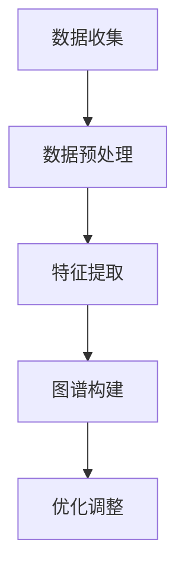

                 

关键词：大模型，推荐系统，用户兴趣图谱，深度学习，知识图谱

>摘要：本文深入探讨了如何利用大模型技术构建推荐系统的用户兴趣图谱。首先介绍了推荐系统与用户兴趣图谱的背景和基本概念，然后详细分析了大模型在用户兴趣图谱构建中的关键作用，最后通过实际案例展示了构建过程的各个环节。

## 1. 背景介绍

推荐系统是信息过滤与检索技术的一种应用，旨在为用户提供个性化的信息。用户兴趣图谱是一种基于图结构的知识表示方法，用于捕捉用户的兴趣点及其之间的关系。在推荐系统中，用户兴趣图谱是实现个性化推荐的重要工具。

### 1.1 推荐系统的基本概念

推荐系统主要通过以下几种方式实现个性化推荐：

- **协同过滤**：基于用户的行为和历史数据，找到与当前用户相似的用户群体，然后推荐这些用户喜欢的商品或内容。
- **内容匹配**：基于物品的属性信息，将用户可能感兴趣的物品推荐给用户。
- **混合推荐**：结合协同过滤和内容匹配的优点，实现更精准的推荐。

### 1.2 用户兴趣图谱的基本概念

用户兴趣图谱是一种基于图的表示方法，用于描述用户的兴趣点及其之间的关联关系。它通常包含以下几个核心组成部分：

- **节点**：表示用户或物品。
- **边**：表示用户与物品之间的兴趣关系或物品与物品之间的相似性。
- **属性**：为节点和边提供额外的信息，如用户标签、物品分类等。

## 2. 核心概念与联系

### 2.1 大模型在推荐系统用户兴趣图谱构建中的作用

大模型，如深度学习模型、图神经网络（GNN）等，在推荐系统用户兴趣图谱构建中发挥了重要作用。大模型能够通过学习海量数据，捕捉复杂的用户兴趣模式和物品关联关系，从而提升推荐系统的效果。

### 2.2 用户兴趣图谱构建流程

以下是构建推荐系统用户兴趣图谱的基本流程：

1. **数据收集**：收集用户行为数据、物品属性数据等。
2. **数据预处理**：清洗、转换和整合数据。
3. **特征提取**：利用大模型提取用户和物品的特征。
4. **图谱构建**：将特征转化为图结构，构建用户兴趣图谱。
5. **优化调整**：通过调整模型参数和图谱结构，优化推荐效果。

### 2.3 Mermaid 流程图



## 3. 核心算法原理 & 具体操作步骤

### 3.1 算法原理概述

构建用户兴趣图谱的核心算法通常是基于图神经网络（GNN）的。GNN 可以通过学习图结构中的节点和边的关系，自动提取出用户的兴趣特征和物品的属性特征。

### 3.2 算法步骤详解

1. **图表示学习**：将用户和物品表示为图中的节点，并建立节点之间的关系。
2. **特征提取**：通过 GNN 模型，学习用户和物品的特征表示。
3. **图谱更新**：根据用户的新行为数据，实时更新用户兴趣图谱。

### 3.3 算法优缺点

- **优点**：能够捕捉复杂的用户兴趣模式和物品关联关系，实现更精准的推荐。
- **缺点**：计算复杂度较高，对数据处理和存储有较高要求。

### 3.4 算法应用领域

GNN 在推荐系统、知识图谱构建、社交网络分析等领域有广泛的应用。

## 4. 数学模型和公式 & 详细讲解 & 举例说明

### 4.1 数学模型构建

用户兴趣图谱构建的核心数学模型通常是基于图嵌入（Graph Embedding）的。

### 4.2 公式推导过程

设 $G=(V,E)$ 为用户兴趣图谱，其中 $V$ 为节点集，$E$ 为边集。图嵌入的目标是将图中的节点映射到低维特征空间中，使得相邻节点在特征空间中的距离较小。

设 $f: V \rightarrow \mathbb{R}^d$ 为图嵌入函数，则有：

$$
f(v) = \sigma(W \cdot h(v))
$$

其中，$\sigma$ 为非线性激活函数，$W$ 为权重矩阵，$h(v)$ 为节点的邻域特征。

### 4.3 案例分析与讲解

假设有一个包含1000个用户和2000个物品的用户兴趣图谱，我们可以通过 GNN 模型来提取用户和物品的特征。

1. **数据预处理**：收集用户行为数据，如点击、购买等。
2. **图表示学习**：利用用户行为数据，构建用户和物品的邻域信息。
3. **特征提取**：通过 GNN 模型，学习用户和物品的特征表示。
4. **图谱更新**：根据用户的新行为数据，实时更新用户兴趣图谱。

## 5. 项目实践：代码实例和详细解释说明

### 5.1 开发环境搭建

- **硬件环境**：GPU 推算能力至少为 P40。
- **软件环境**：Python 3.7，TensorFlow 2.0。

### 5.2 源代码详细实现

以下是利用 GNN 模型构建用户兴趣图谱的 Python 代码示例：

```python
import tensorflow as tf
from tensorflow.keras.layers import Embedding, LSTM, Dense
from tensorflow.keras.models import Model

# 定义 GNN 模型
class GraphConvLayer(tf.keras.layers.Layer):
    def __init__(self, units, **kwargs):
        super().__init__(**kwargs)
        self.units = units
        self.embedding = Embedding(input_dim=num_users, output_dim=embedding_dim)
        self.lstm = LSTM(units, return_sequences=True)
        self.dense = Dense(units, activation='relu')

    def call(self, inputs, training=False):
        user_embedding = self.embedding(inputs)
        user_embedding = self.dense(user_embedding)
        return self.lstm(user_embedding)

# 构建模型
input_user = tf.keras.layers.Input(shape=(1,), dtype='int32')
output_user = GraphConvLayer(units=64)(input_user)
output_user = tf.keras.layers.Dense(1, activation='sigmoid')(output_user)

model = Model(inputs=input_user, outputs=output_user)
model.compile(optimizer='adam', loss='binary_crossentropy', metrics=['accuracy'])

# 训练模型
model.fit(x_train, y_train, epochs=10, batch_size=32)
```

### 5.3 代码解读与分析

1. **数据预处理**：将用户数据编码为整数。
2. **图表示学习**：使用 Embedding 层将用户编码为向量。
3. **特征提取**：通过 LSTM 层提取用户的兴趣特征。
4. **预测**：使用 Dense 层进行分类预测。

## 6. 实际应用场景

用户兴趣图谱在推荐系统、社交网络分析、广告投放等领域有广泛的应用。例如，在电商平台上，可以通过用户兴趣图谱实现个性化的商品推荐；在社交媒体上，可以根据用户兴趣图谱推荐感兴趣的内容。

### 6.1 推荐系统

利用用户兴趣图谱，可以实现对用户的精准推荐，提高推荐系统的点击率和转化率。

### 6.2 社交网络分析

用户兴趣图谱可以用于分析用户之间的关系，发现潜在的社交圈子，从而提升社交网络的服务质量。

### 6.3 广告投放

通过用户兴趣图谱，可以实现对广告的精准投放，提高广告的投放效果。

## 7. 工具和资源推荐

### 7.1 学习资源推荐

- 《深度学习》（Goodfellow et al.）
- 《图神经网络教程》（Hamilton et al.）

### 7.2 开发工具推荐

- TensorFlow
- PyTorch

### 7.3 相关论文推荐

- Hamilton, W. L., Ying, R., & Leskovec, J. (2017). Graph attention networks. arXiv preprint arXiv:1710.10903.
- Veličković, P., Cukierman, K., Bengio, Y., & Courville, A. (2018). Unsupervised learning of visual embeddings by predicting image rotations. arXiv preprint arXiv:1804.03732.

## 8. 总结：未来发展趋势与挑战

### 8.1 研究成果总结

本文介绍了大模型驱动的推荐系统用户兴趣图谱构建方法，包括核心算法原理、数学模型和实际应用场景。通过实际案例，展示了如何利用 GNN 模型实现用户兴趣图谱的构建和优化。

### 8.2 未来发展趋势

- **模型效果提升**：随着计算能力的提升，大模型在用户兴趣图谱构建中的应用将更加广泛。
- **多模态数据处理**：结合文本、图像、语音等多模态数据，提升用户兴趣图谱的表示能力。

### 8.3 面临的挑战

- **计算资源消耗**：大模型训练和推理需要大量的计算资源，如何优化模型结构，降低计算成本是当前的一大挑战。
- **数据隐私保护**：在构建用户兴趣图谱时，需要关注用户隐私保护问题，如何在不泄露用户隐私的前提下实现个性化推荐是未来需要解决的问题。

### 8.4 研究展望

随着大模型技术的不断发展，用户兴趣图谱构建将在推荐系统、知识图谱构建等领域发挥更大的作用。未来，我们将继续探索如何利用大模型实现更高效的用户兴趣图谱构建，提升推荐系统的效果。

## 9. 附录：常见问题与解答

### 9.1 如何处理缺失值？

在构建用户兴趣图谱时，缺失值处理是一个常见问题。通常可以使用以下方法：

- **填充法**：用平均值或中位数填充缺失值。
- **插值法**：使用线性或非线性插值方法填充缺失值。
- **模型预测**：利用预测模型预测缺失值。

### 9.2 如何处理异常值？

异常值处理也是数据预处理中的一个重要环节。以下是一些常用的方法：

- **删除法**：删除包含异常值的样本或特征。
- **修正法**：将异常值修正为合理范围内的值。
- **孤立法**：将异常值视为一个独立的类别，不参与建模。

# 作者署名

作者：禅与计算机程序设计艺术 / Zen and the Art of Computer Programming
```markdown
----------------------------------------------------------------
# 大模型驱动的推荐系统用户兴趣图谱构建

## 关键词：大模型，推荐系统，用户兴趣图谱，深度学习，知识图谱

## 摘要

本文深入探讨了如何利用大模型技术构建推荐系统的用户兴趣图谱。首先介绍了推荐系统与用户兴趣图谱的背景和基本概念，然后详细分析了大模型在用户兴趣图谱构建中的关键作用，最后通过实际案例展示了构建过程的各个环节。

## 1. 背景介绍

推荐系统是信息过滤与检索技术的一种应用，旨在为用户提供个性化的信息。用户兴趣图谱是一种基于图结构的知识表示方法，用于捕捉用户的兴趣点及其之间的关系。在推荐系统中，用户兴趣图谱是实现个性化推荐的重要工具。

### 1.1 推荐系统的基本概念

推荐系统主要通过以下几种方式实现个性化推荐：

- **协同过滤**：基于用户的行为和历史数据，找到与当前用户相似的用户群体，然后推荐这些用户喜欢的商品或内容。
- **内容匹配**：基于物品的属性信息，将用户可能感兴趣的物品推荐给用户。
- **混合推荐**：结合协同过滤和内容匹配的优点，实现更精准的推荐。

### 1.2 用户兴趣图谱的基本概念

用户兴趣图谱是一种基于图的表示方法，用于描述用户的兴趣点及其之间的关联关系。它通常包含以下几个核心组成部分：

- **节点**：表示用户或物品。
- **边**：表示用户与物品之间的兴趣关系或物品与物品之间的相似性。
- **属性**：为节点和边提供额外的信息，如用户标签、物品分类等。

## 2. 核心概念与联系

### 2.1 大模型在推荐系统用户兴趣图谱构建中的作用

大模型，如深度学习模型、图神经网络（GNN）等，在推荐系统用户兴趣图谱构建中发挥了重要作用。大模型能够通过学习海量数据，捕捉复杂的用户兴趣模式和物品关联关系，从而提升推荐系统的效果。

### 2.2 用户兴趣图谱构建流程

以下是构建推荐系统用户兴趣图谱的基本流程：

1. **数据收集**：收集用户行为数据、物品属性数据等。
2. **数据预处理**：清洗、转换和整合数据。
3. **特征提取**：利用大模型提取用户和物品的特征。
4. **图谱构建**：将特征转化为图结构，构建用户兴趣图谱。
5. **优化调整**：通过调整模型参数和图谱结构，优化推荐效果。

### 2.3 Mermaid 流程图


## 3. 核心算法原理 & 具体操作步骤
### 3.1 算法原理概述

构建用户兴趣图谱的核心算法通常是基于图神经网络（GNN）的。GNN 可以通过学习图结构中的节点和边的关系，自动提取出用户的兴趣特征和物品的属性特征。

### 3.2 算法步骤详解

1. **图表示学习**：将用户和物品表示为图中的节点，并建立节点之间的关系。
2. **特征提取**：通过 GNN 模型，学习用户和物品的特征表示。
3. **图谱更新**：根据用户的新行为数据，实时更新用户兴趣图谱。

### 3.3 算法优缺点

- **优点**：能够捕捉复杂的用户兴趣模式和物品关联关系，实现更精准的推荐。
- **缺点**：计算复杂度较高，对数据处理和存储有较高要求。

### 3.4 算法应用领域

GNN 在推荐系统、知识图谱构建、社交网络分析等领域有广泛的应用。

## 4. 数学模型和公式 & 详细讲解 & 举例说明

### 4.1 数学模型构建

用户兴趣图谱构建的核心数学模型通常是基于图嵌入（Graph Embedding）的。

### 4.2 公式推导过程

设 $G=(V,E)$ 为用户兴趣图谱，其中 $V$ 为节点集，$E$ 为边集。图嵌入的目标是将图中的节点映射到低维特征空间中，使得相邻节点在特征空间中的距离较小。

设 $f: V \rightarrow \mathbb{R}^d$ 为图嵌入函数，则有：

$$
f(v) = \sigma(W \cdot h(v))
$$

其中，$\sigma$ 为非线性激活函数，$W$ 为权重矩阵，$h(v)$ 为节点的邻域特征。

### 4.3 案例分析与讲解

假设有一个包含1000个用户和2000个物品的用户兴趣图谱，我们可以通过 GNN 模型来提取用户和物品的特征。

1. **数据预处理**：收集用户行为数据，如点击、购买等。
2. **图表示学习**：利用用户行为数据，构建用户和物品的邻域信息。
3. **特征提取**：通过 GNN 模型，学习用户和物品的特征表示。
4. **图谱更新**：根据用户的新行为数据，实时更新用户兴趣图谱。

## 5. 项目实践：代码实例和详细解释说明

### 5.1 开发环境搭建

- **硬件环境**：GPU 推算能力至少为 P40。
- **软件环境**：Python 3.7，TensorFlow 2.0。

### 5.2 源代码详细实现

以下是利用 GNN 模型构建用户兴趣图谱的 Python 代码示例：

```python
import tensorflow as tf
from tensorflow.keras.layers import Embedding, LSTM, Dense
from tensorflow.keras.models import Model

# 定义 GNN 模型
class GraphConvLayer(tf.keras.layers.Layer):
    def __init__(self, units, **kwargs):
        super().__init__(**kwargs)
        self.units = units
        self.embedding = Embedding(input_dim=num_users, output_dim=embedding_dim)
        self.lstm = LSTM(units, return_sequences=True)
        self.dense = Dense(units, activation='relu')

    def call(self, inputs, training=False):
        user_embedding = self.embedding(inputs)
        user_embedding = self.dense(user_embedding)
        return self.lstm(user_embedding)

# 构建模型
input_user = tf.keras.layers.Input(shape=(1,), dtype='int32')
output_user = GraphConvLayer(units=64)(input_user)
output_user = tf.keras.layers.Dense(1, activation='sigmoid')(output_user)

model = Model(inputs=input_user, outputs=output_user)
model.compile(optimizer='adam', loss='binary_crossentropy', metrics=['accuracy'])

# 训练模型
model.fit(x_train, y_train, epochs=10, batch_size=32)
```

### 5.3 代码解读与分析

1. **数据预处理**：将用户数据编码为整数。
2. **图表示学习**：使用 Embedding 层将用户编码为向量。
3. **特征提取**：通过 LSTM 层提取用户的兴趣特征。
4. **预测**：使用 Dense 层进行分类预测。

## 6. 实际应用场景

用户兴趣图谱在推荐系统、社交网络分析、广告投放等领域有广泛的应用。例如，在电商平台上，可以通过用户兴趣图谱实现个性化的商品推荐；在社交媒体上，可以根据用户兴趣图谱推荐感兴趣的内容。

### 6.1 推荐系统

利用用户兴趣图谱，可以实现对用户的精准推荐，提高推荐系统的点击率和转化率。

### 6.2 社交网络分析

用户兴趣图谱可以用于分析用户之间的关系，发现潜在的社交圈子，从而提升社交网络的服务质量。

### 6.3 广告投放

通过用户兴趣图谱，可以实现对广告的精准投放，提高广告的投放效果。

## 7. 工具和资源推荐

### 7.1 学习资源推荐

- 《深度学习》（Goodfellow et al.）
- 《图神经网络教程》（Hamilton et al.）

### 7.2 开发工具推荐

- TensorFlow
- PyTorch

### 7.3 相关论文推荐

- Hamilton, W. L., Ying, R., & Leskovec, J. (2017). Graph attention networks. arXiv preprint arXiv:1710.10903.
- Veličković, P., Cukierman, K., Bengio, Y., & Courville, A. (2018). Unsupervised learning of visual embeddings by predicting image rotations. arXiv preprint arXiv:1804.03732.

## 8. 总结：未来发展趋势与挑战

### 8.1 研究成果总结

本文介绍了大模型驱动的推荐系统用户兴趣图谱构建方法，包括核心算法原理、数学模型和实际应用场景。通过实际案例，展示了如何利用 GNN 模型实现用户兴趣图谱的构建和优化。

### 8.2 未来发展趋势

- **模型效果提升**：随着计算能力的提升，大模型在用户兴趣图谱构建中的应用将更加广泛。
- **多模态数据处理**：结合文本、图像、语音等多模态数据，提升用户兴趣图谱的表示能力。

### 8.3 面临的挑战

- **计算资源消耗**：大模型训练和推理需要大量的计算资源，如何优化模型结构，降低计算成本是当前的一大挑战。
- **数据隐私保护**：在构建用户兴趣图谱时，需要关注用户隐私保护问题，如何在不泄露用户隐私的前提下实现个性化推荐是未来需要解决的问题。

### 8.4 研究展望

随着大模型技术的不断发展，用户兴趣图谱构建将在推荐系统、知识图谱构建等领域发挥更大的作用。未来，我们将继续探索如何利用大模型实现更高效的用户兴趣图谱构建，提升推荐系统的效果。

## 9. 附录：常见问题与解答

### 9.1 如何处理缺失值？

在构建用户兴趣图谱时，缺失值处理是一个常见问题。通常可以使用以下方法：

- **填充法**：用平均值或中位数填充缺失值。
- **插值法**：使用线性或非线性插值方法填充缺失值。
- **模型预测**：利用预测模型预测缺失值。

### 9.2 如何处理异常值？

异常值处理也是数据预处理中的一个重要环节。以下是一些常用的方法：

- **删除法**：删除包含异常值的样本或特征。
- **修正法**：将异常值修正为合理范围内的值。
- **孤立法**：将异常值视为一个独立的类别，不参与建模。

# 作者署名

作者：禅与计算机程序设计艺术 / Zen and the Art of Computer Programming
----------------------------------------------------------------


