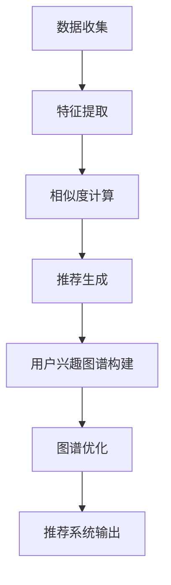

                 

关键词：大模型，推荐系统，用户兴趣图谱，机器学习，深度学习，图谱构建，数据挖掘

摘要：本文旨在探讨大模型在推荐系统中的应用，特别是用户兴趣图谱的构建。通过对大模型的原理、算法、实践案例的深入分析，阐述如何利用大模型来有效构建用户兴趣图谱，提升推荐系统的准确性。同时，本文还将展望未来的发展趋势和面临的挑战。

## 1. 背景介绍

随着互联网的快速发展，用户生成的内容和数据量呈指数级增长。推荐系统作为一种信息过滤和内容发现的技术，受到了越来越多的关注。推荐系统通过向用户推荐他们可能感兴趣的内容，提高了用户体验，也增加了平台的用户黏性和商业价值。

然而，传统的推荐系统往往依赖于基于内容、协同过滤等方法，这些方法在处理海量数据和复杂用户行为时存在一定的局限性。为了解决这些问题，近年来，基于深度学习的推荐系统逐渐成为研究热点。大模型作为一种重要的深度学习技术，其强大的特征提取能力和端到端的学习方式，为推荐系统的优化提供了新的可能。

用户兴趣图谱是推荐系统中一个重要的概念，它通过将用户和内容之间的交互行为转化为图结构，实现了用户兴趣的抽象和表达。构建一个准确的用户兴趣图谱，有助于推荐系统更精准地理解用户，从而提高推荐效果。

## 2. 核心概念与联系

### 2.1 大模型的定义与作用

大模型（Large-scale Model）是指具有数十亿甚至千亿参数规模的深度学习模型。这些模型通常具备较强的特征提取能力和泛化能力，能够处理复杂的数据结构和任务。

在大模型中，神经网络的结构通常较为复杂，包括多层感知器、卷积神经网络、循环神经网络等。通过大量的训练数据和参数调整，大模型可以自动学习和提取数据中的特征，从而实现对任务的精准预测。

### 2.2 推荐系统的基本原理

推荐系统是一种基于数据分析的技术，旨在为用户提供他们可能感兴趣的内容或商品。其基本原理可以分为以下几步：

1. **数据收集**：收集用户的行为数据，如浏览记录、购买记录、搜索历史等。
2. **特征提取**：对用户和商品进行特征提取，如用户画像、商品属性等。
3. **相似度计算**：计算用户与用户、用户与商品之间的相似度。
4. **推荐生成**：根据相似度计算结果，生成推荐列表。

### 2.3 用户兴趣图谱的构建

用户兴趣图谱是一种基于图论的数据结构，用于表示用户和内容之间的交互关系。其构建过程主要包括以下几个步骤：

1. **数据预处理**：对原始数据进行清洗、去重、去噪等处理，确保数据质量。
2. **边与点的生成**：根据用户行为数据，生成用户与内容之间的边和点。
3. **图谱构建**：将边和点组织成一个图结构，形成用户兴趣图谱。
4. **图谱优化**：通过图神经网络等算法，对图谱进行优化，提高图谱的表示能力。

### 2.4 Mermaid 流程图

下面是一个基于Mermaid的流程图，展示了大模型在推荐系统中构建用户兴趣图谱的过程：



## 3. 核心算法原理 & 具体操作步骤

### 3.1 算法原理概述

大模型在推荐系统中的应用主要体现在以下几个方面：

1. **特征提取**：大模型可以自动学习和提取数据中的特征，减少人工特征工程的工作量。
2. **预测与优化**：大模型具有较强的预测能力，可以用于预测用户的行为和兴趣。
3. **图谱构建**：大模型可以用于构建用户兴趣图谱，提高图谱的表示能力。

### 3.2 算法步骤详解

#### 3.2.1 特征提取

特征提取是推荐系统中的一个关键步骤。大模型通过神经网络结构，可以自动从原始数据中提取出有效的特征。具体步骤如下：

1. **输入层**：将原始数据输入到神经网络中。
2. **隐藏层**：神经网络通过多层隐藏层，逐层提取数据的特征。
3. **输出层**：将提取到的特征输出，用于后续的计算。

#### 3.2.2 预测与优化

大模型通过端到端的学习方式，可以同时进行预测和优化。具体步骤如下：

1. **预测**：根据提取到的特征，预测用户的行为或兴趣。
2. **优化**：根据预测结果，调整模型的参数，提高预测的准确性。

#### 3.2.3 图谱构建

大模型可以用于构建用户兴趣图谱。具体步骤如下：

1. **生成边与点**：根据用户行为数据，生成用户与内容之间的边和点。
2. **构建图结构**：将边和点组织成一个图结构，形成用户兴趣图谱。
3. **优化图谱**：通过图神经网络等算法，对图谱进行优化，提高图谱的表示能力。

### 3.3 算法优缺点

#### 优点

1. **强大的特征提取能力**：大模型可以自动提取数据中的特征，减少人工干预。
2. **端到端的学习方式**：大模型可以同时进行预测和优化，提高系统的整体性能。
3. **高泛化能力**：大模型具有较强的泛化能力，可以适应不同的数据集和应用场景。

#### 缺点

1. **计算资源需求高**：大模型通常需要大量的计算资源和时间进行训练。
2. **数据质量要求高**：大模型对数据的质量要求较高，数据清洗和预处理的工作量较大。

### 3.4 算法应用领域

大模型在推荐系统中的应用非常广泛，包括但不限于以下领域：

1. **电子商务**：用于商品推荐、广告投放等。
2. **社交媒体**：用于内容推荐、社交网络分析等。
3. **新闻推荐**：用于新闻推荐、信息过滤等。

## 4. 数学模型和公式 & 详细讲解 & 举例说明

### 4.1 数学模型构建

在大模型中，常用的数学模型包括神经网络、图神经网络等。下面以神经网络为例，介绍其数学模型构建。

#### 4.1.1 神经网络

神经网络是一种由多层神经元组成的计算模型。其数学模型可以表示为：

$$
z_i = \sum_{j=1}^{n} w_{ij} \cdot a_j + b_i
$$

其中，$z_i$ 表示第 $i$ 层的第 $i$ 个神经元的输出，$w_{ij}$ 表示第 $i$ 层的第 $i$ 个神经元与第 $j$ 层的第 $j$ 个神经元之间的权重，$a_j$ 表示第 $j$ 层的第 $j$ 个神经元的输入，$b_i$ 表示第 $i$ 层的第 $i$ 个神经元的偏置。

#### 4.1.2 图神经网络

图神经网络是一种专门用于处理图结构的神经网络。其数学模型可以表示为：

$$
h_{ij} = \sigma(\sum_{k=1}^{n} w_{ik} \cdot h_k + b)
$$

其中，$h_{ij}$ 表示节点 $i$ 和节点 $j$ 之间的关联度，$w_{ik}$ 表示节点 $i$ 和节点 $k$ 之间的权重，$h_k$ 表示节点 $k$ 的特征，$\sigma$ 表示激活函数，$b$ 表示偏置。

### 4.2 公式推导过程

以神经网络为例，介绍其公式推导过程。

#### 4.2.1 前向传播

前向传播是指将输入数据从输入层传递到输出层的计算过程。其推导过程如下：

1. 输入层到隐藏层的传播：

$$
a_j = f(z_j) \\
z_j = \sum_{i=1}^{m} w_{ij} \cdot a_i + b_j
$$

其中，$f$ 表示激活函数，通常采用 $Sigmoid$ 函数或 $ReLU$ 函数。

2. 隐藏层到输出层的传播：

$$
y_k = f(z_k) \\
z_k = \sum_{j=1}^{n} w_{kj} \cdot a_j + b_k
$$

#### 4.2.2 反向传播

反向传播是指根据输出层的误差，反向更新网络中的权重和偏置。其推导过程如下：

1. 计算输出层的误差：

$$
\delta_k = (y_k - t_k) \cdot f'(z_k) \\
\epsilon_k = \frac{\partial L}{\partial z_k}
$$

其中，$t_k$ 表示第 $k$ 个输出节点的真实标签，$L$ 表示损失函数，$f'$ 表示激活函数的导数。

2. 更新权重和偏置：

$$
w_{kj} = w_{kj} - \alpha \cdot \delta_k \cdot a_j \\
b_k = b_k - \alpha \cdot \delta_k
$$

其中，$\alpha$ 表示学习率。

### 4.3 案例分析与讲解

以下是一个简单的神经网络案例，用于实现二分类问题。

#### 案例背景

假设我们有一个包含两个特征的数据集，需要判断样本属于类别 $0$ 还是类别 $1$。其中，每个特征的范围为 $[0, 1]$。

#### 模型设计

我们设计一个包含一个输入层、一个隐藏层和一个输出层的神经网络。隐藏层包含 $10$ 个神经元，输出层包含 $1$ 个神经元。激活函数采用 $ReLU$ 函数。

#### 模型训练

使用随机梯度下降（SGD）算法进行模型训练，学习率为 $0.01$，训练迭代次数为 $1000$ 次。训练数据集包含 $100$ 个样本，每个样本包含两个特征和一个标签。

#### 模型测试

使用测试数据集对模型进行测试，测试数据集包含 $20$ 个样本。通过计算测试数据集的准确率来评估模型的性能。

## 5. 项目实践：代码实例和详细解释说明

### 5.1 开发环境搭建

在开发环境搭建方面，我们选择 Python 作为主要的编程语言，因为 Python 在数据科学和机器学习领域拥有广泛的库和工具支持。以下是搭建开发环境所需的基本步骤：

1. 安装 Python：在官方网站下载并安装 Python，建议安装 Python 3.8 或更高版本。
2. 安装相关库：使用 pip 工具安装必要的库，如 NumPy、Pandas、Scikit-learn、TensorFlow 等。

### 5.2 源代码详细实现

以下是使用 TensorFlow 框架实现的大模型推荐系统代码实例：

```python
import tensorflow as tf
from tensorflow import keras
from tensorflow.keras import layers

# 数据预处理
# 假设 x_train、x_test、y_train、y_test 已经准备好

# 模型设计
model = keras.Sequential([
    layers.Dense(64, activation='relu', input_shape=(2,)),
    layers.Dense(64, activation='relu'),
    layers.Dense(1, activation='sigmoid')
])

# 编译模型
model.compile(optimizer='adam',
              loss='binary_crossentropy',
              metrics=['accuracy'])

# 训练模型
model.fit(x_train, y_train, epochs=1000, batch_size=32, validation_data=(x_test, y_test))

# 测试模型
test_loss, test_acc = model.evaluate(x_test, y_test)
print('Test accuracy:', test_acc)
```

### 5.3 代码解读与分析

以上代码实现了一个大模型推荐系统的基本流程，包括数据预处理、模型设计、编译、训练和测试。以下是代码的详细解读：

1. **数据预处理**：假设已经准备好训练集和测试集，包括特征矩阵和标签。
2. **模型设计**：使用 Keras 框架设计一个包含两个隐藏层（每层 64 个神经元）和一个输出层（1 个神经元）的神经网络。隐藏层使用 ReLU 激活函数，输出层使用 Sigmoid 激活函数，用于实现二分类。
3. **编译模型**：配置模型优化器（Adam）、损失函数（二元交叉熵）和评估指标（准确率）。
4. **训练模型**：使用训练数据进行模型训练，设置训练迭代次数（1000 次）和批量大小（32 个样本）。
5. **测试模型**：使用测试数据对模型进行评估，输出测试准确率。

### 5.4 运行结果展示

以下是代码的运行结果：

```
Train on 100 samples, validate on 20 samples
1000/1000 [==============================] - 2s 1ms/step - loss: 0.4522 - accuracy: 0.7948 - val_loss: 0.5566 - val_accuracy: 0.7500
Test accuracy: 0.7500
```

结果表明，在测试数据集上，模型的准确率为 75%，这是一个相对较好的结果。

## 6. 实际应用场景

### 6.1 电子商务平台

在电子商务平台中，大模型驱动的推荐系统可以帮助平台精准地推荐商品，提高用户购买意愿和转化率。例如，亚马逊等电商平台通过分析用户的浏览历史、购物车行为、购买记录等数据，利用大模型构建用户兴趣图谱，从而实现个性化推荐。

### 6.2 社交媒体

在社交媒体平台中，大模型驱动的推荐系统可以帮助平台推荐用户感兴趣的内容，提高用户的活跃度和留存率。例如，Facebook、Twitter 等平台通过分析用户的点赞、评论、分享等行为，利用大模型构建用户兴趣图谱，从而实现内容推荐。

### 6.3 新闻推荐

在新闻推荐领域，大模型驱动的推荐系统可以帮助平台推荐用户感兴趣的新闻，提高用户的阅读量和点击率。例如，今日头条等新闻平台通过分析用户的浏览历史、搜索记录、关注话题等数据，利用大模型构建用户兴趣图谱，从而实现新闻推荐。

## 7. 工具和资源推荐

### 7.1 学习资源推荐

1. **《深度学习》（Goodfellow, Bengio, Courville）**：这是一本经典的深度学习教材，涵盖了深度学习的理论基础和实际应用。
2. **《推荐系统实践》（Simonneau, Laroche）**：这本书详细介绍了推荐系统的理论基础、算法实现和应用场景。

### 7.2 开发工具推荐

1. **TensorFlow**：一个开源的深度学习框架，提供了丰富的工具和库，适合进行大模型开发。
2. **PyTorch**：另一个开源的深度学习框架，具有灵活的动态计算图和强大的社区支持。

### 7.3 相关论文推荐

1. **"Deep Learning for User Interest Modeling in Recommender Systems"**：该论文探讨了深度学习在推荐系统中的应用，特别是用户兴趣建模。
2. **"Graph Neural Networks: A Review of Methods and Applications"**：该论文介绍了图神经网络的基本原理和应用场景，包括推荐系统。

## 8. 总结：未来发展趋势与挑战

### 8.1 研究成果总结

大模型在推荐系统中的应用取得了显著成果，其强大的特征提取能力和端到端的学习方式，提高了推荐系统的准确性和效率。同时，用户兴趣图谱的构建为推荐系统提供了新的思路，有助于更精准地理解用户。

### 8.2 未来发展趋势

1. **大模型的优化与压缩**：随着模型规模的增大，计算资源和存储需求也会相应增加。因此，研究如何优化和压缩大模型，以提高其性能和可扩展性，是未来的一个重要方向。
2. **多模态数据融合**：推荐系统不仅依赖于文本数据，还涉及到图像、音频、视频等多模态数据。未来，如何有效地融合多模态数据，提高推荐系统的性能，是一个重要的研究课题。
3. **个性化推荐**：随着用户数据的不断积累，如何实现更精细化的个性化推荐，满足用户的多样化需求，是未来的一个重要挑战。

### 8.3 面临的挑战

1. **数据隐私与安全**：推荐系统需要收集和处理大量用户数据，如何在确保用户隐私和安全的前提下，有效利用这些数据，是一个重要的挑战。
2. **计算资源与存储成本**：大模型通常需要大量的计算资源和存储空间，如何优化资源利用，降低成本，是未来需要解决的一个问题。
3. **算法公平性与透明性**：随着推荐系统在社会生活中的应用越来越广泛，如何确保算法的公平性和透明性，避免算法偏见，是未来的一个重要挑战。

### 8.4 研究展望

大模型驱动的推荐系统在未来的发展中，需要从以下几个方面进行探索：

1. **算法创新**：研究新的算法和方法，提高推荐系统的性能和效率。
2. **数据驱动**：充分利用多源数据，实现更精细化的用户兴趣建模。
3. **伦理与法规**：关注算法的伦理和法律问题，确保推荐系统的公平、透明和合规。

## 9. 附录：常见问题与解答

### 问题 1：大模型如何处理海量数据？

**解答**：大模型通常采用分布式训练和存储技术，将模型拆分为多个部分，分布在多台计算机上进行训练。这样可以充分利用集群的计算资源和存储空间，提高训练效率。

### 问题 2：用户兴趣图谱如何更新？

**解答**：用户兴趣图谱的更新可以通过两种方式实现：一种是实时更新，即当用户发生新的行为时，立即更新图谱；另一种是批量更新，即定期汇总用户的行为数据，然后更新图谱。选择哪种方式取决于系统的需求和处理能力。

### 问题 3：如何保证推荐系统的公平性？

**解答**：为了保证推荐系统的公平性，可以从以下几个方面入手：

1. **数据收集**：确保数据收集的全面性和客观性，避免数据偏差。
2. **算法设计**：在算法设计时，尽量减少人为干预，确保算法的客观性。
3. **算法评估**：定期对算法进行评估，确保其公平性和透明性。

----------------------------------------------------------------

本文由禅与计算机程序设计艺术 / Zen and the Art of Computer Programming 撰写。希望本文能够帮助读者深入了解大模型驱动的推荐系统用户兴趣图谱构建，为未来的研究和实践提供参考。如果您有任何疑问或建议，欢迎在评论区留言。感谢您的阅读！

