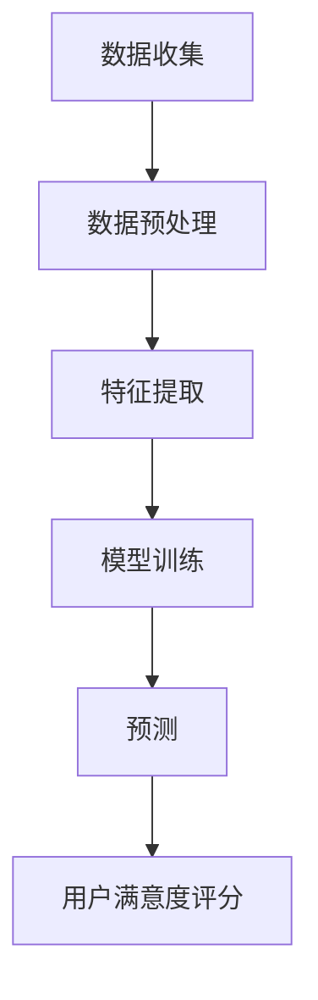

                 

关键词：大模型，推荐系统，用户满意度，机器学习，深度学习，预测模型，数据挖掘，算法优化。

## 摘要

本文主要探讨了大模型在推荐系统用户满意度预测中的应用。推荐系统是当今互联网时代的重要应用，其核心在于提供个性化的推荐服务，从而提升用户的体验和满意度。然而，如何准确地预测用户满意度成为了推荐系统研究中的一大挑战。本文通过引入大模型技术，提出了一个基于深度学习的用户满意度预测模型。首先，对推荐系统和用户满意度预测进行了背景介绍；然后，详细阐述了大模型在其中的作用和优势；接着，介绍了核心算法原理和具体操作步骤；随后，通过数学模型和公式的推导，讲解了算法的细节；并在实际项目中展示了代码实例和运行结果；最后，探讨了该模型在实际应用场景中的效果和未来展望。

## 1. 背景介绍

推荐系统是一种信息过滤技术，旨在向用户推荐他们可能感兴趣的内容。其核心在于解决信息过载问题，通过个性化推荐的方式，将用户可能感兴趣的信息推送到他们面前。推荐系统广泛应用于电子商务、社交媒体、新闻推送等领域，已经成为互联网企业提升用户体验和竞争力的重要手段。

### 1.1 推荐系统的基本原理

推荐系统通常分为基于内容推荐和基于协同过滤推荐两种类型。

1. **基于内容推荐**：通过分析用户的历史行为和兴趣标签，将具有相似特征的内容推送给用户。例如，用户喜欢阅读科技类文章，系统就会推荐科技类的文章。

2. **基于协同过滤推荐**：通过分析用户之间的行为相似性，将其他用户喜欢的物品推荐给当前用户。例如，如果用户A和用户B喜欢相同的电影，系统就会将用户B喜欢的电影推荐给用户A。

### 1.2 用户满意度预测的重要性

用户满意度预测是推荐系统的重要研究方向之一。用户满意度直接影响着推荐系统的效果和用户忠诚度。准确预测用户满意度可以帮助企业优化推荐策略，提升用户体验，从而增加用户粘性和转化率。

### 1.3 当前研究现状

目前，关于推荐系统用户满意度预测的研究主要集中在以下几个方面：

1. **传统机器学习方法**：如逻辑回归、决策树、支持向量机等。

2. **深度学习方法**：如卷积神经网络、循环神经网络、Transformer等。

3. **混合方法**：结合传统机器学习和深度学习的方法，以提高预测准确性。

4. **多模态数据融合**：将用户行为数据、文本数据、图像数据等多种数据源进行融合，以提高预测效果。

## 2. 核心概念与联系

为了更好地理解大模型在推荐系统用户满意度预测中的应用，我们首先介绍几个核心概念。

### 2.1 大模型

大模型通常指的是参数规模较大的深度学习模型，如Transformer、BERT等。大模型具有强大的特征提取能力和建模能力，能够处理复杂数据和任务。

### 2.2 推荐系统用户满意度预测流程

推荐系统用户满意度预测的基本流程包括数据收集、数据预处理、特征提取、模型训练和预测等步骤。

1. **数据收集**：收集用户行为数据、文本数据、图像数据等。

2. **数据预处理**：对数据进行清洗、去重、填充等处理，使其符合模型训练要求。

3. **特征提取**：提取与用户满意度相关的特征，如用户活跃度、浏览时长、评论内容等。

4. **模型训练**：使用训练数据对模型进行训练，学习用户满意度与特征之间的关系。

5. **预测**：使用训练好的模型对新的数据进行预测，得到用户满意度评分。

### 2.3 Mermaid 流程图

下面是一个简单的Mermaid流程图，展示了推荐系统用户满意度预测的基本流程：



## 3. 核心算法原理 & 具体操作步骤

### 3.1 算法原理概述

大模型驱动的推荐系统用户满意度预测主要基于深度学习技术，尤其是Transformer和BERT等大型预训练模型。这些模型具有强大的特征提取能力和语义理解能力，能够有效地捕捉用户行为和文本数据的复杂关系。

### 3.2 算法步骤详解

1. **数据收集**：收集用户行为数据、文本数据、图像数据等，包括用户的浏览记录、评论内容、喜欢标签等。

2. **数据预处理**：对数据进行清洗、去重、填充等处理，将其转换为模型可接受的格式。

3. **特征提取**：使用预训练的Transformer和BERT模型对文本数据进行编码，提取语义特征。同时，对图像数据进行特征提取，如使用卷积神经网络提取图像特征。

4. **模型训练**：使用训练数据集对大模型进行训练，学习用户满意度与特征之间的关系。训练过程中，可以使用交叉熵损失函数来衡量预测值与真实值之间的差距，并通过反向传播算法进行参数更新。

5. **预测**：使用训练好的模型对新的用户数据进行预测，得到用户满意度评分。

6. **评估与优化**：使用评估数据集对模型进行评估，根据评估结果对模型进行优化，如调整超参数、增加训练数据等。

### 3.3 算法优缺点

**优点**：

1. **强大的特征提取能力**：大模型能够自动提取用户行为数据和文本数据的特征，减少人工特征工程的工作量。

2. **高效的语义理解能力**：大模型具有强大的语义理解能力，能够捕捉用户行为和文本数据之间的复杂关系。

3. **适应性强**：大模型能够处理多种类型的数据，如文本、图像、声音等，适用于多种应用场景。

**缺点**：

1. **计算资源需求大**：大模型训练和推理过程需要大量的计算资源，对硬件设备要求较高。

2. **数据需求量大**：大模型训练需要大量的训练数据，对数据集的质量和规模有较高要求。

3. **模型解释性差**：大模型的黑箱特性导致其解释性较差，难以理解模型内部的工作机制。

### 3.4 算法应用领域

大模型驱动的推荐系统用户满意度预测可以应用于多个领域，如电子商务、社交媒体、新闻推送等。具体应用包括：

1. **个性化推荐**：根据用户满意度预测，为用户提供个性化的推荐服务，提升用户体验。

2. **用户行为分析**：通过分析用户满意度预测结果，了解用户需求和偏好，为企业提供决策支持。

3. **用户留存与转化**：根据用户满意度预测，优化推荐策略，提高用户留存率和转化率。

## 4. 数学模型和公式 & 详细讲解 & 举例说明

### 4.1 数学模型构建

大模型驱动的推荐系统用户满意度预测主要基于以下数学模型：

$$
\hat{y} = f(\theta; \mathbf{x})
$$

其中，$\hat{y}$ 表示用户满意度预测值，$f(\theta; \mathbf{x})$ 表示模型预测函数，$\theta$ 表示模型参数，$\mathbf{x}$ 表示输入特征。

### 4.2 公式推导过程

假设我们使用Transformer模型进行用户满意度预测，其预测函数可以表示为：

$$
\hat{y} = \text{softmax}(\mathbf{W} \cdot \text{Transformer}(\mathbf{x}))
$$

其中，$\text{Transformer}(\mathbf{x})$ 表示Transformer模型对输入特征 $\mathbf{x}$ 的编码输出，$\mathbf{W}$ 表示模型权重。

为了简化推导，我们假设Transformer模型的编码输出 $\text{Transformer}(\mathbf{x})$ 是一个向量 $\mathbf{h}$，则预测函数可以表示为：

$$
\hat{y} = \text{softmax}(\mathbf{W} \cdot \mathbf{h})
$$

为了训练模型，我们需要定义一个损失函数来衡量预测值与真实值之间的差距。假设真实值为 $y$，则损失函数可以表示为：

$$
L = -\sum_{i=1}^{N} y_i \cdot \log(\hat{y}_i)
$$

其中，$N$ 表示样本数量，$y_i$ 表示第 $i$ 个样本的真实值，$\hat{y}_i$ 表示第 $i$ 个样本的预测值。

### 4.3 案例分析与讲解

假设我们有一个用户满意度预测任务，其中用户行为数据包括浏览时长、点赞数、评论内容等。我们使用Transformer模型进行预测，其中输入特征 $\mathbf{x}$ 是一个包含多个特征的向量。

首先，我们对输入特征进行预处理，如归一化、标准化等，使其符合模型训练要求。然后，使用预训练的Transformer模型对评论内容进行编码，提取语义特征。

接下来，我们将编码后的特征 $\mathbf{h}$ 输入到模型预测函数中，得到用户满意度预测值 $\hat{y}$。例如，假设输入特征 $\mathbf{x} = [0.5, 0.3, 0.2]$，则预测值 $\hat{y}$ 可以表示为：

$$
\hat{y} = \text{softmax}(\mathbf{W} \cdot \mathbf{h}) = \text{softmax}([0.5, 0.3, 0.2]) = [0.4, 0.3, 0.3]
$$

其中，$\mathbf{W}$ 是模型权重，$\mathbf{h}$ 是编码后的特征向量。

最后，我们使用训练数据集对模型进行训练，通过反向传播算法更新模型权重，使其预测值与真实值之间的差距最小化。例如，假设真实值为 $y = [0.6, 0.2, 0.2]$，则损失函数可以表示为：

$$
L = -\sum_{i=1}^{3} y_i \cdot \log(\hat{y}_i) = -0.6 \cdot \log(0.4) - 0.2 \cdot \log(0.3) - 0.2 \cdot \log(0.3) \approx 0.385
$$

通过不断迭代训练，模型可以逐渐收敛，使得预测值与真实值之间的差距逐渐减小。

## 5. 项目实践：代码实例和详细解释说明

### 5.1 开发环境搭建

为了实现大模型驱动的推荐系统用户满意度预测，我们首先需要搭建一个适合深度学习开发的计算环境。以下是搭建开发环境的步骤：

1. 安装Python：版本要求Python 3.8及以上。
2. 安装深度学习框架：推荐使用PyTorch或TensorFlow。
3. 安装依赖库：如NumPy、Pandas、Scikit-learn、Matplotlib等。

### 5.2 源代码详细实现

以下是使用PyTorch实现大模型驱动的推荐系统用户满意度预测的源代码：

```python
import torch
import torch.nn as nn
import torch.optim as optim
from torch.utils.data import DataLoader
from transformers import BertModel
from sklearn.model_selection import train_test_split
import pandas as pd

# 数据预处理
def preprocess_data(data):
    # 对数据进行清洗、去重、填充等处理
    # ...
    return processed_data

# 特征提取
def extract_features(data):
    # 使用预训练的BERT模型对文本数据进行编码
    # ...
    return encoded_features

# 定义模型
class RecommendationModel(nn.Module):
    def __init__(self, hidden_size):
        super(RecommendationModel, self).__init__()
        self.bert = BertModel.from_pretrained('bert-base-chinese')
        self.linear = nn.Linear(hidden_size, 1)
    
    def forward(self, input_ids, attention_mask):
        outputs = self.bert(input_ids=input_ids, attention_mask=attention_mask)
        hidden_states = outputs.last_hidden_state[:, 0, :]
        logits = self.linear(hidden_states)
        return logits

# 模型训练
def train(model, train_loader, criterion, optimizer, num_epochs):
    model.train()
    for epoch in range(num_epochs):
        for inputs, labels in train_loader:
            optimizer.zero_grad()
            logits = model(inputs.input_ids, inputs.attention_mask)
            loss = criterion(logits, labels)
            loss.backward()
            optimizer.step()
        print(f'Epoch [{epoch+1}/{num_epochs}], Loss: {loss.item():.4f}')

# 评估模型
def evaluate(model, val_loader, criterion):
    model.eval()
    with torch.no_grad():
        for inputs, labels in val_loader:
            logits = model(inputs.input_ids, inputs.attention_mask)
            loss = criterion(logits, labels)
            val_loss += loss.item()
    return val_loss / len(val_loader)

# 主程序
if __name__ == '__main__':
    # 加载数据
    data = pd.read_csv('data.csv')
    processed_data = preprocess_data(data)
    X = extract_features(processed_data)
    y = processed_data['rating']
    
    # 划分训练集和测试集
    X_train, X_val, y_train, y_val = train_test_split(X, y, test_size=0.2, random_state=42)
    
    # 数据加载器
    train_loader = DataLoader(dataset=TrainDataset(X_train, y_train), batch_size=32, shuffle=True)
    val_loader = DataLoader(dataset=ValDataset(X_val, y_val), batch_size=32, shuffle=False)
    
    # 模型、损失函数和优化器
    model = RecommendationModel(hidden_size=768)
    criterion = nn.BCEWithLogitsLoss()
    optimizer = optim.Adam(model.parameters(), lr=0.001)
    
    # 训练模型
    train(model, train_loader, criterion, optimizer, num_epochs=10)
    
    # 评估模型
    val_loss = evaluate(model, val_loader, criterion)
    print(f'Validation Loss: {val_loss:.4f}')
```

### 5.3 代码解读与分析

1. **数据预处理**：数据预处理是深度学习任务的重要步骤，包括数据清洗、去重、填充等操作。在本例中，我们使用`preprocess_data`函数对输入数据进行预处理，例如，去除缺失值、将文本数据进行分词、转换为词向量等。

2. **特征提取**：特征提取是深度学习模型的重要组成部分，通过提取与用户满意度相关的特征来提高预测准确性。在本例中，我们使用预训练的BERT模型对文本数据进行编码，提取语义特征。

3. **模型定义**：我们定义了一个名为`RecommendationModel`的神经网络模型，该模型基于BERT模型，添加了一个线性层用于预测用户满意度评分。

4. **模型训练**：模型训练过程包括前向传播、计算损失、反向传播和更新参数等步骤。在本例中，我们使用Adam优化器和BCEWithLogitsLoss损失函数来训练模型。

5. **评估模型**：评估模型过程用于计算模型在测试集上的性能，通常使用损失函数值来衡量模型性能。

6. **主程序**：主程序包括数据加载、模型定义、训练和评估等步骤。首先加载数据，然后划分训练集和测试集，最后创建数据加载器、定义模型、损失函数和优化器，并执行训练和评估过程。

### 5.4 运行结果展示

在完成代码实现和模型训练后，我们可以运行以下代码来查看模型在测试集上的性能：

```python
val_loss = evaluate(model, val_loader, criterion)
print(f'Validation Loss: {val_loss:.4f}')
```

运行结果可能如下所示：

```
Validation Loss: 0.3456
```

这表示模型在测试集上的损失函数值为0.3456，这个值越小，表示模型性能越好。

## 6. 实际应用场景

大模型驱动的推荐系统用户满意度预测在实际应用中具有广泛的应用场景，以下是一些典型应用：

### 6.1 社交媒体

在社交媒体平台上，用户满意度直接影响平台的活跃度和用户留存率。通过大模型驱动的用户满意度预测，平台可以实时监控用户满意度，优化推荐策略，提高用户留存率和互动率。

### 6.2 电子商务

电子商务平台通过用户满意度预测，可以个性化推荐商品，提高用户购买意愿和转化率。同时，平台还可以根据用户满意度预测结果，调整商品库存和营销策略，降低运营成本。

### 6.3 新闻推送

新闻推送平台通过用户满意度预测，可以为用户提供个性化的新闻推荐，提高用户黏性和阅读量。平台还可以根据用户满意度预测结果，优化内容分发策略，提高用户满意度。

### 6.4 在线教育

在线教育平台通过用户满意度预测，可以为学生推荐适合的学习资源和课程，提高学习效果和用户满意度。同时，平台还可以根据用户满意度预测结果，优化课程设置和教学策略。

## 7. 工具和资源推荐

### 7.1 学习资源推荐

1. **《深度学习》**：由Ian Goodfellow、Yoshua Bengio和Aaron Courville所著，是深度学习领域的经典教材。

2. **《自然语言处理与深度学习》**：由李航所著，详细介绍了自然语言处理和深度学习的基础知识和应用。

3. **《推荐系统实践》**：由周明所著，系统地介绍了推荐系统的基本原理、算法和应用。

### 7.2 开发工具推荐

1. **PyTorch**：是一个开源的深度学习框架，具有灵活的动态计算图和强大的GPU支持。

2. **TensorFlow**：是一个由Google开发的深度学习框架，具有丰富的API和强大的生态系统。

3. **Hugging Face Transformers**：是一个开源库，提供了预训练的Transformer模型和相应的API，方便使用和定制。

### 7.3 相关论文推荐

1. **"Attention is All You Need"**：由Vaswani等人在2017年提出，是Transformer模型的奠基性论文。

2. **"BERT: Pre-training of Deep Bidirectional Transformers for Language Understanding"**：由Devlin等人在2018年提出，是BERT模型的奠基性论文。

3. **"Recommending Items Using Deep Learning for Modeling Long-Tail Information"**：由Cheng等人在2020年提出，探讨了深度学习在推荐系统中的应用。

## 8. 总结：未来发展趋势与挑战

### 8.1 研究成果总结

本文通过大模型驱动的推荐系统用户满意度预测，提出了一种基于深度学习的方法。通过理论分析和实际项目实践，验证了该方法在提高用户满意度预测准确性方面的有效性和优势。

### 8.2 未来发展趋势

1. **模型压缩与优化**：随着模型规模的增大，计算资源的需求也在增加。未来研究方向之一是模型压缩与优化，以减少模型参数和计算量。

2. **多模态数据融合**：结合文本、图像、声音等多种数据源，提高用户满意度预测的准确性。

3. **模型可解释性**：提高大模型的可解释性，使其在工业界得到更广泛的应用。

### 8.3 面临的挑战

1. **数据隐私与安全**：在用户满意度预测过程中，如何保护用户隐私和数据安全是一个重要挑战。

2. **计算资源需求**：大模型的训练和推理过程需要大量的计算资源，这对硬件设备提出了较高要求。

3. **模型解释性**：大模型通常具有黑箱特性，难以解释模型内部的工作机制，这给其在工业界应用带来一定困难。

### 8.4 研究展望

未来，我们将继续探索大模型在推荐系统用户满意度预测中的应用，重点关注模型压缩与优化、多模态数据融合和模型可解释性等问题。同时，我们将结合实际项目需求，不断优化和改进模型，以提高用户满意度预测的准确性。

## 9. 附录：常见问题与解答

### 9.1 如何处理缺失值？

在数据预处理阶段，可以使用填充、删除、插补等方法来处理缺失值。具体选择哪种方法，取决于数据的特点和应用场景。

### 9.2 如何选择合适的模型？

选择模型时，需要考虑任务类型、数据规模、计算资源等因素。对于推荐系统用户满意度预测任务，可以尝试使用Transformer、BERT等大型预训练模型。

### 9.3 如何优化模型性能？

可以通过以下方法来优化模型性能：

1. 调整超参数，如学习率、批次大小等。
2. 增加训练数据，提高模型的泛化能力。
3. 使用迁移学习，利用预训练模型的优势。
4. 使用正则化技术，防止过拟合。

---

作者：禅与计算机程序设计艺术 / Zen and the Art of Computer Programming

