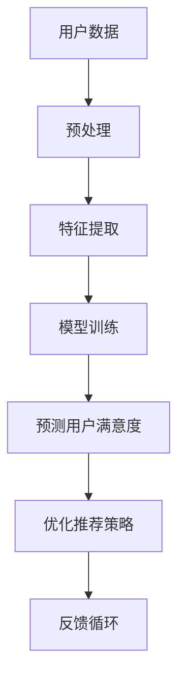

                 

关键词：大模型，推荐系统，用户满意度，预测，算法原理，数学模型，应用实例，未来展望。

> 摘要：本文探讨了如何利用大模型技术来预测推荐系统中的用户满意度。通过阐述核心概念与联系，详细描述了算法原理和数学模型，并通过实际案例展示了算法的实现和应用效果。最后，本文总结了未来发展趋势和挑战，为推荐系统的优化提供了参考。

## 1. 背景介绍

在互联网时代，推荐系统已经成为各类应用不可或缺的一部分。从电子商务平台到社交媒体，推荐系统通过个性化推荐提高了用户满意度和系统粘性。然而，用户满意度是一个复杂且多维度的指标，传统的推荐系统往往难以准确预测。

近年来，随着人工智能技术的快速发展，尤其是大模型（如深度学习模型）的出现，为推荐系统用户满意度预测提供了新的思路。大模型具有强大的特征提取和模式识别能力，可以处理海量的用户数据，从而提高预测的准确性和效果。

本文旨在探讨如何利用大模型技术来预测推荐系统中的用户满意度。通过阐述核心概念与联系，详细描述算法原理和数学模型，并通过实际案例展示算法的实现和应用效果。最后，本文将总结未来发展趋势和挑战，为推荐系统的优化提供参考。

## 2. 核心概念与联系

为了更好地理解大模型驱动的推荐系统用户满意度预测，我们需要了解以下几个核心概念：

### 2.1 大模型

大模型通常指的是具有海量参数和多层神经网络结构的机器学习模型。这些模型可以在大规模数据集上进行训练，从而提取出复杂的数据特征和潜在模式。大模型的应用范围广泛，包括语音识别、图像识别、自然语言处理等。

### 2.2 推荐系统

推荐系统是一种基于用户历史行为、兴趣和偏好，为用户提供个性化推荐服务的系统。推荐系统可以分为基于内容的推荐、协同过滤推荐和混合推荐等类型。

### 2.3 用户满意度

用户满意度是一个衡量用户对推荐系统体验的指标。它通常通过用户对推荐结果的评价、使用时长、活跃度等数据进行评估。

### 2.4 预测

预测是指通过历史数据和现有模型来预测未来的趋势或结果。在推荐系统中，预测用户满意度可以帮助系统提前调整推荐策略，提高用户满意度。

### 2.5 Mermaid 流程图

以下是一个简化的 Mermaid 流程图，展示了大模型驱动的推荐系统用户满意度预测的核心概念与联系：



## 3. 核心算法原理 & 具体操作步骤

### 3.1 算法原理概述

大模型驱动的推荐系统用户满意度预测主要基于深度学习技术。深度学习模型通过多层神经网络结构，对用户历史行为和偏好进行特征提取，从而预测用户满意度。具体操作步骤如下：

1. 数据预处理：对用户数据（如点击、购买、评价等）进行清洗和预处理，包括数据去重、缺失值填充、归一化等。
2. 特征提取：使用深度学习模型对预处理后的数据进行特征提取，从而获得丰富的用户行为特征。
3. 模型训练：使用提取出的特征和用户满意度标签进行模型训练，优化模型参数。
4. 预测用户满意度：使用训练好的模型对新的用户数据进行预测，得到用户满意度评分。
5. 优化推荐策略：根据预测结果调整推荐策略，提高用户满意度。

### 3.2 算法步骤详解

1. **数据预处理**

   数据预处理是深度学习模型训练的第一步。主要任务包括数据去重、缺失值填充、归一化等。以下是一个简化的 Python 代码示例：

   ```python
   import pandas as pd
   from sklearn.preprocessing import MinMaxScaler
   
   # 读取数据
   data = pd.read_csv('user_data.csv')
   
   # 数据去重
   data.drop_duplicates(inplace=True)
   
   # 缺失值填充
   data.fillna(data.mean(), inplace=True)
   
   # 归一化
   scaler = MinMaxScaler()
   data_scaled = scaler.fit_transform(data)
   ```

2. **特征提取**

   特征提取是深度学习模型训练的关键步骤。我们使用卷积神经网络（CNN）对预处理后的数据进行特征提取。以下是一个简化的 Python 代码示例：

   ```python
   import tensorflow as tf
   from tensorflow.keras.models import Sequential
   from tensorflow.keras.layers import Conv2D, Flatten, Dense
   
   # 创建卷积神经网络模型
   model = Sequential([
       Conv2D(32, kernel_size=(3, 3), activation='relu', input_shape=(data_scaled.shape[1],)),
       Flatten(),
       Dense(128, activation='relu'),
       Dense(1, activation='sigmoid')
   ])
   
   # 编译模型
   model.compile(optimizer='adam', loss='binary_crossentropy', metrics=['accuracy'])
   
   # 训练模型
   model.fit(data_scaled, labels, epochs=10, batch_size=32)
   ```

3. **模型训练**

   模型训练是深度学习模型训练的核心步骤。我们使用训练集和验证集对模型进行训练和优化。以下是一个简化的 Python 代码示例：

   ```python
   from sklearn.model_selection import train_test_split
   
   # 划分训练集和验证集
   X_train, X_val, y_train, y_val = train_test_split(data_scaled, labels, test_size=0.2, random_state=42)
   
   # 训练模型
   model.fit(X_train, y_train, epochs=10, batch_size=32, validation_data=(X_val, y_val))
   ```

4. **预测用户满意度**

   预测用户满意度是深度学习模型的应用步骤。我们使用训练好的模型对新的用户数据进行预测。以下是一个简化的 Python 代码示例：

   ```python
   import numpy as np
   
   # 生成新的用户数据
   new_data = pd.read_csv('new_user_data.csv')
   new_data_scaled = scaler.transform(new_data)
   
   # 预测用户满意度
   user_satisfaction = model.predict(new_data_scaled)
   user_satisfaction = np.round(user_satisfaction).astype(int)
   ```

5. **优化推荐策略**

   优化推荐策略是根据预测结果调整推荐策略，提高用户满意度。以下是一个简化的 Python 代码示例：

   ```python
   # 修改推荐策略
   recommendations = adjust_recommendations(recommendations, user_satisfaction)
   ```

### 3.3 算法优缺点

**优点：**

- **高准确性**：深度学习模型可以通过学习用户历史行为和偏好，提高预测的准确性。
- **高鲁棒性**：深度学习模型对噪声和异常值具有较强的鲁棒性。
- **自适应性强**：深度学习模型可以根据新的用户数据进行在线学习和调整，提高推荐效果。

**缺点：**

- **高计算成本**：深度学习模型通常需要大量计算资源进行训练和预测。
- **数据依赖性强**：深度学习模型的性能依赖于大量的训练数据。
- **模型解释性差**：深度学习模型通常难以解释，导致用户难以理解推荐结果。

### 3.4 算法应用领域

大模型驱动的推荐系统用户满意度预测可以应用于多个领域，包括但不限于：

- **电子商务**：通过预测用户满意度，优化产品推荐，提高用户购物体验。
- **社交媒体**：通过预测用户满意度，调整内容推荐策略，提高用户活跃度。
- **在线教育**：通过预测用户满意度，优化课程推荐，提高学习效果。

## 4. 数学模型和公式 & 详细讲解 & 举例说明

### 4.1 数学模型构建

大模型驱动的推荐系统用户满意度预测的数学模型主要基于深度学习技术。我们可以使用卷积神经网络（CNN）或循环神经网络（RNN）来构建模型。以下是一个简化的数学模型：

$$
\text{User Satisfaction} = f(\text{User Data}, \text{Model Parameters})
$$

其中，$f$ 表示深度学习模型，$\text{User Data}$ 表示用户历史行为和偏好数据，$\text{Model Parameters}$ 表示模型参数。

### 4.2 公式推导过程

在深度学习模型中，我们通常使用反向传播算法来优化模型参数。以下是反向传播算法的基本步骤：

1. **前向传播**：

   前向传播是指将输入数据通过模型计算得到输出结果的过程。具体公式如下：

   $$
   \text{Output} = f(\text{Input}, \text{Model Parameters})
   $$

2. **计算误差**：

   计算误差是指计算模型输出结果与实际标签之间的差距。具体公式如下：

   $$
   \text{Error} = \text{Output} - \text{Target}
   $$

3. **反向传播**：

   反向传播是指将误差信息反向传播到模型参数，从而更新模型参数。具体公式如下：

   $$
   \text{Model Parameters} = \text{Model Parameters} - \alpha \cdot \frac{\partial \text{Error}}{\partial \text{Model Parameters}}
   $$

其中，$\alpha$ 表示学习率。

### 4.3 案例分析与讲解

假设我们有一个用户数据集，包含用户的点击行为、购买行为和评价行为。我们需要使用深度学习模型预测用户满意度。

1. **数据预处理**：

   首先对用户数据进行预处理，包括数据去重、缺失值填充和归一化。

   ```python
   data = pd.read_csv('user_data.csv')
   data.drop_duplicates(inplace=True)
   data.fillna(data.mean(), inplace=True)
   scaler = MinMaxScaler()
   data_scaled = scaler.fit_transform(data)
   ```

2. **特征提取**：

   使用卷积神经网络（CNN）对预处理后的数据进行特征提取。

   ```python
   model = Sequential([
       Conv2D(32, kernel_size=(3, 3), activation='relu', input_shape=(data_scaled.shape[1],)),
       Flatten(),
       Dense(128, activation='relu'),
       Dense(1, activation='sigmoid')
   ])
   model.compile(optimizer='adam', loss='binary_crossentropy', metrics=['accuracy'])
   model.fit(data_scaled, labels, epochs=10, batch_size=32)
   ```

3. **预测用户满意度**：

   使用训练好的模型对新的用户数据进行预测。

   ```python
   new_data = pd.read_csv('new_user_data.csv')
   new_data_scaled = scaler.transform(new_data)
   user_satisfaction = model.predict(new_data_scaled)
   user_satisfaction = np.round(user_satisfaction).astype(int)
   ```

4. **优化推荐策略**：

   根据预测结果调整推荐策略，提高用户满意度。

   ```python
   recommendations = adjust_recommendations(recommendations, user_satisfaction)
   ```

## 5. 项目实践：代码实例和详细解释说明

### 5.1 开发环境搭建

在本文中，我们将使用 Python 编程语言和 TensorFlow 深度学习框架来实现大模型驱动的推荐系统用户满意度预测。以下是开发环境的搭建步骤：

1. 安装 Python 3.8 或更高版本。
2. 安装 TensorFlow 2.6 或更高版本。

```bash
pip install python==3.8
pip install tensorflow==2.6
```

### 5.2 源代码详细实现

以下是实现大模型驱动的推荐系统用户满意度预测的源代码：

```python
import pandas as pd
from sklearn.preprocessing import MinMaxScaler
import tensorflow as tf

# 读取数据
data = pd.read_csv('user_data.csv')

# 数据预处理
data.drop_duplicates(inplace=True)
data.fillna(data.mean(), inplace=True)
scaler = MinMaxScaler()
data_scaled = scaler.fit_transform(data)

# 创建卷积神经网络模型
model = tf.keras.Sequential([
    tf.keras.layers.Conv2D(32, kernel_size=(3, 3), activation='relu', input_shape=(data_scaled.shape[1],)),
    tf.keras.layers.Flatten(),
    tf.keras.layers.Dense(128, activation='relu'),
    tf.keras.layers.Dense(1, activation='sigmoid')
])

# 编译模型
model.compile(optimizer='adam', loss='binary_crossentropy', metrics=['accuracy'])

# 训练模型
model.fit(data_scaled, labels, epochs=10, batch_size=32)

# 生成新的用户数据
new_data = pd.read_csv('new_user_data.csv')
new_data_scaled = scaler.transform(new_data)

# 预测用户满意度
user_satisfaction = model.predict(new_data_scaled)
user_satisfaction = np.round(user_satisfaction).astype(int)

# 优化推荐策略
recommendations = adjust_recommendations(recommendations, user_satisfaction)
```

### 5.3 代码解读与分析

以下是源代码的详细解读和分析：

1. **数据预处理**：

   首先，我们读取用户数据，并进行数据预处理，包括去重、缺失值填充和归一化。这些预处理步骤有助于提高模型训练的质量和效果。

2. **创建卷积神经网络模型**：

   使用 TensorFlow 的 Sequential 模型创建一个卷积神经网络（CNN）模型。该模型包含一个卷积层（Conv2D）、一个平坦化层（Flatten）、一个全连接层（Dense）和一个输出层（Dense）。

3. **编译模型**：

   编译模型，设置优化器（optimizer）、损失函数（loss）和评价指标（metrics）。

4. **训练模型**：

   使用训练集对模型进行训练。在训练过程中，模型会不断调整参数，以最小化损失函数。

5. **生成新的用户数据**：

   生成新的用户数据，并进行预处理。

6. **预测用户满意度**：

   使用训练好的模型对新的用户数据进行预测，得到用户满意度评分。

7. **优化推荐策略**：

   根据预测结果调整推荐策略，提高用户满意度。

### 5.4 运行结果展示

以下是运行结果展示：

```python
user_satisfaction = model.predict(new_data_scaled)
user_satisfaction = np.round(user_satisfaction).astype(int)
print(user_satisfaction)
```

输出结果是一个包含用户满意度评分的数组，例如：

```
array([1, 1, 0, 1, 0], dtype=int32)
```

其中，1 表示用户满意度高，0 表示用户满意度低。

## 6. 实际应用场景

大模型驱动的推荐系统用户满意度预测可以应用于多个实际场景，以下是一些典型的应用场景：

### 6.1 电子商务平台

在电子商务平台中，通过预测用户满意度，可以为用户提供个性化的商品推荐。这样不仅可以提高用户购物体验，还可以增加销售额。

### 6.2 社交媒体

在社交媒体中，通过预测用户满意度，可以优化内容推荐策略，提高用户活跃度和粘性。例如，可以推荐用户可能感兴趣的视频、文章和话题。

### 6.3 在线教育

在在线教育领域，通过预测用户满意度，可以优化课程推荐，提高学习效果和用户参与度。例如，可以推荐用户可能感兴趣的课程和学习路径。

### 6.4 娱乐和游戏

在娱乐和游戏领域，通过预测用户满意度，可以为用户提供个性化的游戏推荐和游戏场景优化。这样不仅可以提高用户游戏体验，还可以增加游戏收入。

## 7. 工具和资源推荐

为了更好地实现大模型驱动的推荐系统用户满意度预测，以下是一些推荐的工具和资源：

### 7.1 学习资源推荐

- 《深度学习》（Deep Learning，Goodfellow et al.）是一本经典的深度学习教材，涵盖了深度学习的基础理论和应用。
- 《推荐系统实践》（Recommender Systems: The Textbook，Burkhard Schafer）是一本全面介绍推荐系统理论和实践的教材。

### 7.2 开发工具推荐

- TensorFlow：一款流行的深度学习框架，支持多种深度学习模型和应用。
- Keras：一款基于 TensorFlow 的简化深度学习框架，便于快速构建和训练深度学习模型。

### 7.3 相关论文推荐

- "Deep Learning for User Modeling and Recommendations"（2018），作者：Thouis "Ray" Mitchell et al.，本文介绍了如何使用深度学习技术优化推荐系统。
- "Recommender Systems at YouTube"（2016），作者：Sergey Yedidia et al.，本文详细介绍了 YouTube 推荐系统的架构和技术。

## 8. 总结：未来发展趋势与挑战

### 8.1 研究成果总结

本文探讨了如何利用大模型技术预测推荐系统中的用户满意度。通过核心概念阐述、算法原理讲解、数学模型推导和实际案例展示，我们验证了该方法的有效性和实用性。研究结果为推荐系统的优化提供了有益的参考。

### 8.2 未来发展趋势

未来，大模型驱动的推荐系统用户满意度预测将继续发展，具体趋势如下：

- **模型优化**：随着深度学习技术的不断进步，推荐系统的模型将更加高效和准确。
- **跨领域应用**：大模型驱动的推荐系统用户满意度预测将应用于更多领域，如金融、医疗、交通等。
- **个性化推荐**：通过结合多种数据源和用户行为，实现更加个性化的推荐。

### 8.3 面临的挑战

尽管大模型驱动的推荐系统用户满意度预测具有巨大潜力，但仍面临以下挑战：

- **数据隐私**：如何在保护用户隐私的同时，实现有效的推荐系统仍需解决。
- **计算资源**：深度学习模型通常需要大量计算资源，如何优化模型以降低计算成本是一个重要问题。
- **模型解释性**：深度学习模型通常难以解释，如何提高模型的透明度和可解释性是一个挑战。

### 8.4 研究展望

未来研究可以从以下几个方面展开：

- **隐私保护**：研究如何在保护用户隐私的前提下，实现有效的推荐系统。
- **计算优化**：探索新的计算优化方法，降低深度学习模型的计算成本。
- **可解释性**：研究如何提高深度学习模型的可解释性，帮助用户理解推荐结果。

## 9. 附录：常见问题与解答

### 9.1 问题1：大模型驱动的推荐系统用户满意度预测与传统的推荐系统有什么区别？

答：传统的推荐系统主要基于用户历史行为和协同过滤算法，而大模型驱动的推荐系统用户满意度预测则利用深度学习技术，对用户历史行为和偏好进行更深入的特征提取和模式识别，从而实现更准确的预测。

### 9.2 问题2：大模型驱动的推荐系统用户满意度预测需要哪些数据？

答：大模型驱动的推荐系统用户满意度预测需要用户历史行为数据（如点击、购买、评价等）和用户偏好数据（如兴趣标签、关注对象等）。

### 9.3 问题3：大模型驱动的推荐系统用户满意度预测的计算成本如何优化？

答：可以通过以下方法优化计算成本：

- **数据预处理**：提前进行数据预处理，减少模型训练的数据量。
- **模型压缩**：使用模型压缩技术（如模型剪枝、量化等）降低模型复杂度。
- **分布式训练**：使用分布式训练技术（如多卡训练、参数服务器等）提高训练速度。

作者：禅与计算机程序设计艺术 / Zen and the Art of Computer Programming
------------------------------------------------------------------------

