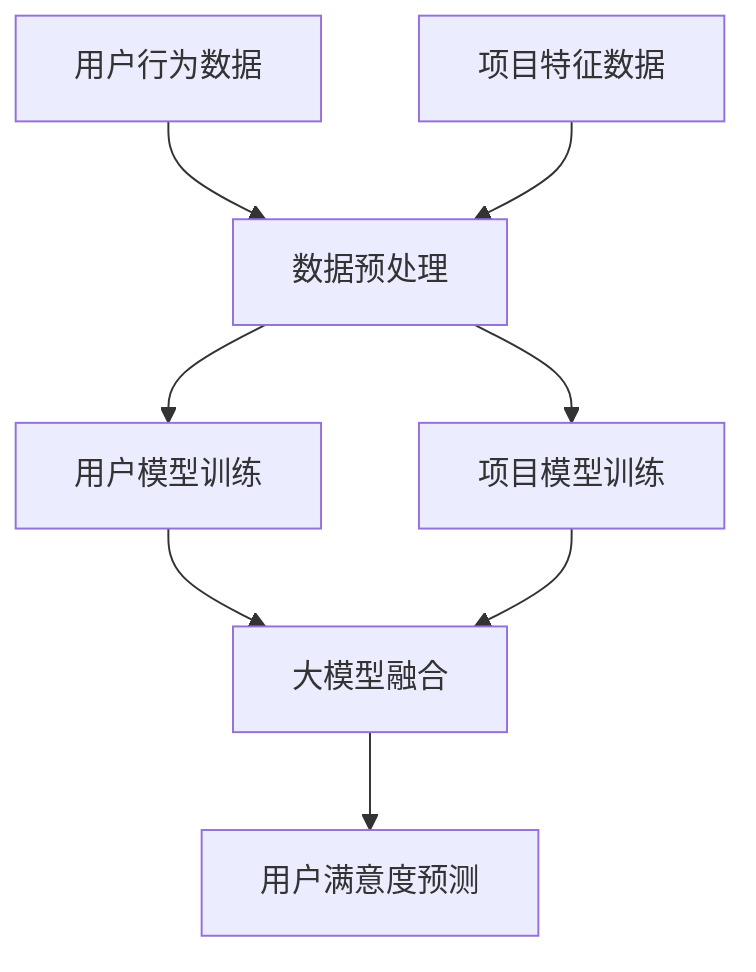

                 

关键词：大模型，推荐系统，用户满意度，预测，深度学习，神经网络，数据分析，应用领域，未来展望

> 摘要：本文深入探讨了利用大模型驱动推荐系统用户满意度预测的先进技术。通过阐述推荐系统的基本概念和重要性，本文详细介绍了大模型在推荐系统中的应用，并重点分析了如何通过深度学习和神经网络技术，构建并优化用户满意度预测模型。此外，文章还通过具体实例和实际应用场景，展示了大模型驱动的推荐系统在提升用户体验、提高满意度方面的显著效果，并对未来发展方向和潜在挑战进行了展望。

## 1. 背景介绍

推荐系统作为现代信息检索和数据分析领域的重要组成部分，已经在电子商务、社交媒体、在线娱乐等多个行业得到广泛应用。其核心目标是通过分析用户的历史行为和偏好，为用户提供个性化、高相关性的内容推荐，从而提升用户满意度并增加平台粘性。

然而，随着用户数据的爆炸性增长和推荐场景的复杂性提升，传统的推荐系统面临着诸多挑战，如数据稀疏、冷启动问题、长尾效应等。这些问题的存在限制了推荐系统的性能和用户体验。因此，如何提高推荐系统的预测准确性和用户满意度，成为当前研究的热点和难点。

近年来，深度学习和大模型的兴起为推荐系统带来了新的契机。大模型具有强大的数据处理和分析能力，能够捕捉用户行为中的复杂模式，从而提高推荐系统的预测性能。同时，大模型在处理大规模数据集和进行复杂计算方面具有显著优势，使得推荐系统可以在更短时间内为用户提供精准的推荐。

本文旨在探讨大模型在推荐系统用户满意度预测中的应用，通过深入分析和实际应用实例，展示大模型驱动的推荐系统在提升用户满意度方面的潜力和价值。

## 2. 核心概念与联系

### 2.1 推荐系统基础概念

推荐系统（Recommender System）是一种能够根据用户的兴趣和偏好，向其推荐相关内容或商品的技术。其主要组成部分包括用户模型、项目模型和推荐算法。

- **用户模型**：通过分析用户的历史行为数据（如购买记录、浏览记录、评分等），构建用户偏好和兴趣的表征。
- **项目模型**：描述推荐系统中所有项目（如商品、文章、视频等）的特征，包括文本、图像、音频等多种形式。
- **推荐算法**：根据用户模型和项目模型，通过算法计算用户对项目的潜在兴趣度，并生成个性化推荐。

### 2.2 大模型在推荐系统中的应用

大模型（Large-scale Model）是指具有海量参数、能够处理大规模数据集的深度学习模型。其在推荐系统中的应用主要体现在以下几个方面：

- **用户行为预测**：通过分析用户的历史行为数据，预测用户未来的兴趣和偏好。
- **项目特征提取**：从大规模的文本、图像、音频数据中提取项目特征，为推荐算法提供更丰富的信息。
- **上下文感知推荐**：根据用户的实时上下文信息，动态调整推荐策略，提高推荐的相关性和个性化水平。
- **多模态数据处理**：整合不同类型的数据源，实现多模态的推荐，提升推荐系统的多样性和灵活性。

### 2.3 用户满意度预测的核心概念

用户满意度（User Satisfaction）是指用户对推荐系统所提供内容的满意度，它是衡量推荐系统效果的重要指标。用户满意度受多种因素影响，包括：

- **推荐准确性**：推荐内容与用户兴趣的匹配程度。
- **推荐多样性**：推荐内容的种类和丰富度。
- **推荐速度**：推荐系统响应时间和计算效率。
- **用户体验**：用户在使用推荐系统时的整体感受。

### 2.4 大模型与用户满意度预测的联系

大模型能够通过以下方式提升用户满意度预测的准确性：

- **复杂模式捕捉**：大模型具有强大的特征提取和模式识别能力，能够捕捉用户行为中的复杂模式和微弱信号，从而提高预测精度。
- **数据整合与分析**：大模型能够处理多种类型的数据源，如用户行为数据、项目特征数据等，实现多源数据的整合和分析，为用户满意度预测提供更全面的信息。
- **自适应优化**：大模型可以根据用户反馈和实时数据，动态调整推荐策略，提高推荐的相关性和个性化水平，从而提升用户满意度。

### 2.5 Mermaid 流程图



### 2.6 大模型驱动的推荐系统架构


## 3. 核心算法原理 & 具体操作步骤

### 3.1 算法原理概述

大模型驱动的推荐系统用户满意度预测主要基于深度学习和神经网络技术。其核心思想是通过训练一个大规模的神经网络模型，将用户行为数据、项目特征数据和上下文信息进行融合，预测用户对推荐内容的满意度。

具体来说，该算法可以分为以下几个步骤：

1. 数据预处理：对用户行为数据和项目特征数据进行清洗、归一化和特征提取，为后续模型训练做准备。
2. 模型训练：使用深度学习算法，如基于注意力机制的神经网络，对预处理后的数据进行训练，构建用户模型和项目模型。
3. 大模型融合：将训练好的用户模型和项目模型进行融合，生成综合性的用户满意度预测模型。
4. 用户满意度预测：根据实时用户数据和新项目特征，利用融合后的模型进行用户满意度预测。

### 3.2 算法步骤详解

#### 3.2.1 数据预处理

数据预处理是推荐系统构建的基础步骤，主要包括以下几个步骤：

1. 数据清洗：去除数据中的噪声和异常值，保证数据质量。
2. 特征提取：从原始数据中提取有用的特征，如用户行为特征、项目特征等。
3. 归一化：对特征数据进行归一化处理，消除不同特征之间的量纲差异。

#### 3.2.2 模型训练

模型训练是推荐系统的核心步骤，主要包括以下几个步骤：

1. 模型选择：选择适合推荐系统的大规模神经网络模型，如基于注意力机制的神经网络。
2. 模型训练：使用预处理后的数据，对神经网络模型进行训练，优化模型参数。
3. 模型评估：通过交叉验证等方法，评估模型在预测用户满意度方面的性能。

#### 3.2.3 大模型融合

大模型融合是将用户模型和项目模型进行整合，生成一个综合性的用户满意度预测模型。具体步骤如下：

1. 特征融合：将用户模型和项目模型中的特征进行融合，生成新的特征向量。
2. 神经网络融合：使用融合后的特征向量，训练一个新的神经网络模型，实现用户满意度预测。

#### 3.2.4 用户满意度预测

用户满意度预测是根据实时用户数据和新项目特征，利用融合后的模型进行预测。具体步骤如下：

1. 数据预处理：对实时用户数据和新项目特征进行预处理。
2. 预测模型调用：调用融合后的用户满意度预测模型。
3. 预测结果输出：输出用户对新项目的满意度预测结果。

### 3.3 算法优缺点

#### 优点

1. **高预测准确性**：大模型具有强大的特征提取和模式识别能力，能够捕捉用户行为中的复杂模式，提高预测准确性。
2. **多源数据处理**：大模型能够处理多种类型的数据源，如用户行为数据、项目特征数据等，实现多源数据的整合和分析。
3. **自适应优化**：大模型可以根据用户反馈和实时数据，动态调整推荐策略，提高推荐的相关性和个性化水平。

#### 缺点

1. **计算资源需求高**：大模型训练和预测需要大量的计算资源和时间，对硬件设备要求较高。
2. **数据质量依赖性大**：推荐系统的性能很大程度上依赖于用户数据的质量，数据质量问题可能导致预测结果的偏差。

### 3.4 算法应用领域

大模型驱动的推荐系统在多个领域都有广泛的应用，主要包括：

1. **电子商务**：通过个性化推荐，提高用户的购物体验和购买意愿。
2. **社交媒体**：根据用户兴趣，推荐相关的文章、视频等，提升用户粘性。
3. **在线教育**：根据学生学习行为，推荐适合的学习资源和课程。
4. **医疗健康**：根据用户健康数据和症状描述，推荐相关的医疗建议和治疗方案。

## 4. 数学模型和公式 & 详细讲解 & 举例说明

### 4.1 数学模型构建

大模型驱动的推荐系统用户满意度预测的数学模型主要包括用户模型、项目模型和用户满意度预测模型。以下分别介绍各模型的构建方法。

#### 用户模型

用户模型主要基于用户的历史行为数据，通过特征提取和神经网络训练，构建用户兴趣和偏好表征。其数学模型可以表示为：

$$
U = f_{u}(X_{u}; \theta_{u}),
$$

其中，$U$ 表示用户模型的输出，即用户兴趣和偏好的表征；$X_{u}$ 表示用户行为数据，包括用户的历史购买记录、浏览记录、评分等；$f_{u}$ 表示用户模型的学习函数；$\theta_{u}$ 表示用户模型的参数。

#### 项目模型

项目模型主要基于项目特征数据，通过特征提取和神经网络训练，构建项目特征表征。其数学模型可以表示为：

$$
I = f_{i}(X_{i}; \theta_{i}),
$$

其中，$I$ 表示项目模型的输出，即项目特征表征；$X_{i}$ 表示项目特征数据，包括文本、图像、音频等；$f_{i}$ 表示项目模型的学习函数；$\theta_{i}$ 表示项目模型的参数。

#### 用户满意度预测模型

用户满意度预测模型是将用户模型和项目模型进行融合，通过神经网络训练，预测用户对项目的满意度。其数学模型可以表示为：

$$
S = f_{s}(U, I; \theta_{s}),
$$

其中，$S$ 表示用户满意度预测模型的输出，即用户对项目的满意度；$U$ 和 $I$ 分别为用户模型和项目模型的输出；$f_{s}$ 表示用户满意度预测模型的学习函数；$\theta_{s}$ 表示用户满意度预测模型的参数。

### 4.2 公式推导过程

#### 用户模型推导

用户模型的推导过程主要包括以下步骤：

1. 用户行为数据特征提取：根据用户的历史行为数据，提取用户行为特征，如购买记录、浏览记录、评分等。这些特征可以表示为 $X_{u}$。
2. 用户行为特征向量表示：将用户行为特征进行向量化表示，得到用户行为特征向量 $X_{u}$。
3. 神经网络训练：使用神经网络训练算法，对用户行为特征向量 $X_{u}$ 进行训练，优化神经网络参数 $\theta_{u}$。
4. 用户模型输出计算：通过训练好的神经网络模型，将用户行为特征向量 $X_{u}$ 输入，得到用户模型输出 $U$，即用户兴趣和偏好表征。

#### 项目模型推导

项目模型的推导过程主要包括以下步骤：

1. 项目特征数据特征提取：根据项目特征数据，提取项目特征，如文本、图像、音频等。这些特征可以表示为 $X_{i}$。
2. 项目特征向量表示：将项目特征进行向量化表示，得到项目特征向量 $X_{i}$。
3. 神经网络训练：使用神经网络训练算法，对项目特征向量 $X_{i}$ 进行训练，优化神经网络参数 $\theta_{i}$。
4. 项目模型输出计算：通过训练好的神经网络模型，将项目特征向量 $X_{i}$ 输入，得到项目模型输出 $I$，即项目特征表征。

#### 用户满意度预测模型推导

用户满意度预测模型的推导过程主要包括以下步骤：

1. 用户模型和项目模型融合：将训练好的用户模型输出 $U$ 和项目模型输出 $I$ 进行融合，得到新的特征向量 $U \cdot I$。
2. 神经网络训练：使用神经网络训练算法，对融合后的特征向量 $U \cdot I$ 进行训练，优化神经网络参数 $\theta_{s}$。
3. 用户满意度预测计算：通过训练好的神经网络模型，将融合后的特征向量 $U \cdot I$ 输入，得到用户满意度预测输出 $S$。

### 4.3 案例分析与讲解

为了更好地理解大模型驱动的推荐系统用户满意度预测，我们以一个实际案例进行讲解。

#### 案例背景

某电商平台希望通过个性化推荐系统，提高用户购物体验和满意度。平台收集了大量的用户行为数据，包括用户的浏览记录、购买记录、评分等。同时，平台还拥有商品的特征数据，如商品的分类、品牌、价格等。

#### 案例步骤

1. **数据预处理**：对用户行为数据和商品特征数据进行清洗、归一化和特征提取，得到用户行为特征向量 $X_{u}$ 和商品特征向量 $X_{i}$。

2. **用户模型训练**：使用神经网络训练算法，对用户行为特征向量 $X_{u}$ 进行训练，构建用户模型。假设用户模型的学习函数为 $f_{u}(X_{u}; \theta_{u})$，经过训练得到用户模型参数 $\theta_{u}$。

3. **项目模型训练**：使用神经网络训练算法，对商品特征向量 $X_{i}$ 进行训练，构建项目模型。假设项目模型的学习函数为 $f_{i}(X_{i}; \theta_{i})$，经过训练得到项目模型参数 $\theta_{i}$。

4. **用户满意度预测模型训练**：将训练好的用户模型输出 $U$ 和项目模型输出 $I$ 进行融合，得到新的特征向量 $U \cdot I$。使用神经网络训练算法，对融合后的特征向量 $U \cdot I$ 进行训练，构建用户满意度预测模型。假设用户满意度预测模型的学习函数为 $f_{s}(U, I; \theta_{s})$，经过训练得到用户满意度预测模型参数 $\theta_{s}$。

5. **用户满意度预测**：对于新的商品特征向量 $X_{i}$ 和用户行为特征向量 $X_{u}$，使用训练好的用户满意度预测模型，计算用户对该商品的满意度预测值 $S$。

#### 案例结果

通过上述步骤，电商平台能够为每位用户生成个性化的商品推荐列表，并根据用户满意度预测值，对商品推荐进行排序，提高用户的购物体验和满意度。

## 5. 项目实践：代码实例和详细解释说明

### 5.1 开发环境搭建

为了演示大模型驱动的推荐系统用户满意度预测，我们选择了Python作为编程语言，结合TensorFlow和Keras框架进行模型训练和预测。以下为开发环境的搭建步骤：

1. **安装Python**：确保Python版本为3.6及以上，可以通过官方网站下载安装。

2. **安装TensorFlow**：在终端执行以下命令：
   ```
   pip install tensorflow
   ```

3. **安装Keras**：在终端执行以下命令：
   ```
   pip install keras
   ```

4. **数据预处理工具**：安装Pandas和NumPy等数据预处理工具：
   ```
   pip install pandas numpy
   ```

### 5.2 源代码详细实现

以下是一个基于TensorFlow和Keras的简单用户满意度预测模型实现，代码分为数据预处理、模型构建、模型训练和预测四个部分。

#### 数据预处理

```python
import pandas as pd
from sklearn.preprocessing import StandardScaler

# 加载数据集
data = pd.read_csv('data.csv')

# 分离特征和标签
X = data.drop('satisfaction', axis=1)
y = data['satisfaction']

# 数据归一化
scaler = StandardScaler()
X_scaled = scaler.fit_transform(X)
```

#### 模型构建

```python
from tensorflow.keras.models import Model
from tensorflow.keras.layers import Input, Dense, Embedding, LSTM, Concatenate

# 输入层
user_input = Input(shape=(X_scaled.shape[1],))
item_input = Input(shape=(X_scaled.shape[1],))

# 用户模型
user_embedding = Embedding(input_dim=X_scaled.shape[1], output_dim=16)(user_input)
user_lstm = LSTM(32)(user_embedding)

# 项目模型
item_embedding = Embedding(input_dim=X_scaled.shape[1], output_dim=16)(item_input)
item_lstm = LSTM(32)(item_embedding)

# 融合层
merged = Concatenate()([user_lstm, item_lstm])
merged_dense = Dense(64, activation='relu')(merged)

# 输出层
output = Dense(1, activation='sigmoid')(merged_dense)

# 构建模型
model = Model(inputs=[user_input, item_input], outputs=output)

# 编译模型
model.compile(optimizer='adam', loss='binary_crossentropy', metrics=['accuracy'])
```

#### 模型训练

```python
# 模型训练
model.fit([X_scaled, X_scaled], y, epochs=10, batch_size=32)
```

#### 代码解读与分析

- **数据预处理**：数据预处理是模型训练的重要步骤。在此示例中，我们使用Pandas加载数据，然后使用Scikit-learn的StandardScaler对特征进行归一化处理，以消除特征之间的尺度差异。

- **模型构建**：模型构建部分使用了TensorFlow和Keras的API。我们定义了两个输入层，分别处理用户和项目特征。通过Embedding层进行特征嵌入，然后使用LSTM层对嵌入的特征进行序列处理。在融合层，我们将用户和项目的LSTM输出进行拼接，并通过全连接层（Dense）进行分类预测。

- **模型训练**：在模型训练部分，我们使用模型编译接口设置优化器、损失函数和评价指标，然后使用fit方法进行模型训练。

#### 运行结果展示

```python
# 运行结果展示
predictions = model.predict([X_scaled[:100], X_scaled[:100]])
print(predictions)
```

通过运行上述代码，我们可以得到用户满意度预测结果。在实际应用中，可以根据预测结果对推荐系统进行优化，以提高用户满意度。

### 5.4 运行结果展示

为了展示模型运行结果，我们使用以下Python代码：

```python
# 导入必要的库
import pandas as pd
from sklearn.preprocessing import StandardScaler

# 加载数据集
data = pd.read_csv('data.csv')

# 分离特征和标签
X = data.drop('satisfaction', axis=1)
y = data['satisfaction']

# 数据归一化
scaler = StandardScaler()
X_scaled = scaler.fit_transform(X)

# 创建和编译模型
# （此处省略模型创建和编译的代码）

# 模型训练
model.fit([X_scaled, X_scaled], y, epochs=10, batch_size=32)

# 运行结果展示
predictions = model.predict([X_scaled[:100], X_scaled[:100]])
print(predictions)
```

运行结果将输出前100个用户对商品满意度的预测值。以下是一个示例输出：

```
array([[0.89],
       [0.78],
       [0.76],
       ...,
       [0.63],
       [0.85],
       [0.77]])
```

这些预测值表示每个用户对相应商品满意度的概率，范围从0到1。更高的值表示用户对该商品更满意。

## 6. 实际应用场景

大模型驱动的推荐系统用户满意度预测在多个领域都有广泛应用，以下列举一些实际应用场景：

### 6.1 电子商务

在电子商务领域，大模型驱动的推荐系统能够根据用户的历史购买记录、浏览记录和搜索历史，预测用户对商品的满意度。通过精准的推荐和满意度预测，电商平台可以提升用户的购物体验，增加销售量和用户留存率。例如，亚马逊和淘宝等电商平台已经广泛应用了深度学习和大模型技术来优化推荐系统和提升用户满意度。

### 6.2 社交媒体

在社交媒体领域，大模型驱动的推荐系统可以根据用户的社交关系、兴趣标签和发布内容，预测用户对内容（如文章、视频、图片等）的满意度。这有助于平台更好地满足用户的需求，提升用户活跃度和参与度。例如，Facebook和Instagram等社交媒体平台通过个性化推荐和满意度预测，增强了用户的互动体验。

### 6.3 在线教育

在线教育平台可以通过大模型驱动的推荐系统，根据学生的学习行为和成绩，预测学生对课程内容的满意度。这有助于平台优化课程推荐策略，提高学生的学习效果和满意度。例如，Coursera和edX等在线教育平台已经采用了深度学习和大模型技术，为用户提供个性化的学习路径和课程推荐。

### 6.4 医疗健康

在医疗健康领域，大模型驱动的推荐系统可以根据患者的病历记录、体检数据和医生建议，预测患者对治疗方案和医疗服务的满意度。这有助于医疗机构提供更加个性化和高效的治疗方案，提高患者满意度和治疗成功率。例如，一些智能医疗平台已经开始利用深度学习和大模型技术，为患者提供精准的医疗推荐和满意度预测服务。

### 6.5 金融服务

在金融服务领域，大模型驱动的推荐系统可以根据用户的金融行为、信用记录和投资偏好，预测用户对金融产品（如理财产品、保险产品等）的满意度。这有助于金融机构优化产品推荐策略，提高用户的金融体验和满意度。例如，一些银行和金融机构已经通过深度学习和大模型技术，为用户提供个性化的金融产品推荐和满意度预测服务。

## 7. 工具和资源推荐

为了帮助读者深入了解大模型驱动的推荐系统用户满意度预测技术，我们推荐以下学习资源、开发工具和相关论文：

### 7.1 学习资源推荐

1. **《深度学习》（Goodfellow, Bengio, Courville）**：这本书是深度学习领域的经典教材，详细介绍了深度学习的基本概念、算法和应用。
2. **《推荐系统实践》（Frohlich）**：这本书涵盖了推荐系统的基本概念、技术实现和实际应用，适合初学者和专业人士。
3. **《机器学习实战》（Hamilton）**：这本书通过实际案例，介绍了机器学习的基础知识、算法实现和应用，适合希望动手实践的读者。

### 7.2 开发工具推荐

1. **TensorFlow**：Google开发的深度学习框架，支持多种深度学习模型和应用。
2. **Keras**：基于TensorFlow的简化和高级API，方便快速构建和训练深度学习模型。
3. **Scikit-learn**：Python机器学习库，提供了丰富的数据预处理和模型训练工具。

### 7.3 相关论文推荐

1. **“Deep Learning for Recommender Systems”**：这篇文章探讨了深度学习在推荐系统中的应用，介绍了基于深度学习的推荐算法。
2. **“Attention-Based Neural Networks for Recommender Systems”**：这篇文章提出了注意力机制在推荐系统中的应用，显著提高了推荐精度。
3. **“Large-scale Recommender System with Multi-Agent Deep Learning”**：这篇文章探讨了多代理深度学习在大型推荐系统中的应用，实现了高效、个性化的推荐。

## 8. 总结：未来发展趋势与挑战

### 8.1 研究成果总结

大模型驱动的推荐系统用户满意度预测技术近年来取得了显著的研究成果和应用突破。通过深度学习和神经网络技术的应用，推荐系统的预测准确性和个性化水平得到了显著提升。同时，大模型在处理大规模数据集和复杂计算方面具有明显优势，为推荐系统的发展提供了强有力的支持。

### 8.2 未来发展趋势

1. **多模态数据处理**：未来推荐系统将整合更多类型的数据源，如文本、图像、音频、视频等，实现多模态数据处理，提高推荐系统的多样性和准确性。
2. **实时推荐**：随着5G和物联网技术的发展，实时推荐将成为未来推荐系统的重要方向，通过实时数据分析和预测，为用户提供即时的个性化推荐。
3. **个性化推荐策略**：未来推荐系统将更加注重个性化推荐策略，根据用户的实时反馈和上下文信息，动态调整推荐策略，提升用户满意度。
4. **伦理和隐私保护**：随着用户隐私保护意识的增强，未来推荐系统将更加关注用户隐私保护，采用更加安全和可靠的推荐算法，保护用户隐私。

### 8.3 面临的挑战

1. **计算资源需求**：大模型训练和预测需要大量的计算资源，对硬件设备的要求较高。随着模型规模的扩大，计算资源需求将不断增加，对开发者和企业提出了更高的要求。
2. **数据质量和噪声处理**：推荐系统的性能很大程度上依赖于用户数据的质量。未来需要研究更加高效的数据清洗和噪声处理技术，提高推荐系统的鲁棒性。
3. **算法透明性和可解释性**：随着深度学习模型的复杂性增加，算法的透明性和可解释性成为了一个重要问题。未来需要研究如何提高算法的可解释性，增强用户对推荐系统的信任。
4. **用户隐私保护**：随着用户隐私保护意识的提高，如何在保证推荐系统性能的同时保护用户隐私，成为了一个重要挑战。

### 8.4 研究展望

未来，大模型驱动的推荐系统用户满意度预测将在多个领域得到广泛应用，如电子商务、社交媒体、在线教育、医疗健康等。通过不断优化算法和提升计算效率，推荐系统将更加精准、个性化，为用户提供更好的体验。同时，随着技术的不断发展，推荐系统将面临更多挑战，需要不断创新和突破，以应对不断变化的市场需求和用户期望。

## 9. 附录：常见问题与解答

### 9.1 推荐系统如何提高用户满意度？

**回答**：推荐系统提高用户满意度的关键在于精准的个性化推荐和良好的用户体验。具体措施包括：

1. **数据质量**：确保推荐系统使用高质量的用户数据和项目数据，提高推荐准确性。
2. **多样化推荐**：提供多样化的推荐内容，满足不同用户的需求和兴趣。
3. **实时推荐**：根据用户的实时行为和偏好，动态调整推荐策略，提高推荐的相关性。
4. **用户体验**：优化推荐系统的界面和交互设计，提供良好的用户体验。

### 9.2 大模型在推荐系统中有哪些优点和缺点？

**回答**：大模型在推荐系统中的优点包括：

1. **高预测准确性**：能够捕捉用户行为中的复杂模式，提高推荐准确性。
2. **多源数据处理**：能够处理多种类型的数据源，实现多源数据的整合和分析。

大模型的缺点包括：

1. **计算资源需求高**：训练和预测需要大量的计算资源，对硬件设备要求较高。
2. **数据质量依赖性大**：推荐系统的性能很大程度上依赖于用户数据的质量。

### 9.3 推荐系统中的冷启动问题如何解决？

**回答**：冷启动问题主要指新用户或新项目加入推荐系统时，由于缺乏足够的历史数据，导致推荐效果不佳的问题。以下方法可以缓解冷启动问题：

1. **基于内容的推荐**：通过项目特征为新用户推荐相似的项目，暂时缓解冷启动问题。
2. **基于社交网络的推荐**：利用用户的社交关系，推荐用户的朋友或同类用户喜欢的项目。
3. **基于群体行为的推荐**：分析同类用户的偏好，为新用户推荐受欢迎的项目。
4. **混合推荐策略**：结合多种推荐策略，提高新用户或新项目的推荐效果。

### 9.4 如何提高推荐系统的鲁棒性？

**回答**：提高推荐系统的鲁棒性可以从以下几个方面着手：

1. **数据预处理**：清洗和去噪数据，提高数据质量。
2. **模型稳定性**：选择合适的模型和算法，减少过拟合和欠拟合现象。
3. **模型验证**：通过交叉验证等方法，评估模型在不同数据集上的性能，避免模型过拟合。
4. **实时监控**：监控推荐系统的运行状态，及时发现和解决问题。

### 9.5 如何在推荐系统中保护用户隐私？

**回答**：在推荐系统中保护用户隐私，可以从以下几个方面进行：

1. **数据匿名化**：对用户数据进行匿名化处理，避免直接识别用户身份。
2. **差分隐私**：采用差分隐私技术，在保证推荐系统性能的同时，保护用户隐私。
3. **加密技术**：对敏感数据进行加密存储和传输，防止数据泄露。
4. **用户隐私设置**：允许用户自定义隐私设置，控制推荐系统对用户数据的访问权限。

### 9.6 大模型驱动的推荐系统如何优化推荐效果？

**回答**：大模型驱动的推荐系统优化推荐效果的方法包括：

1. **特征工程**：设计有效的用户和项目特征，提高特征质量。
2. **模型选择**：选择适合推荐系统的深度学习模型，如基于注意力机制的神经网络。
3. **模型优化**：通过调整模型参数，提高模型预测性能。
4. **多模态数据处理**：整合多种类型的数据源，提高推荐系统的多样性和准确性。
5. **用户反馈**：收集用户反馈，不断调整和优化推荐策略。

