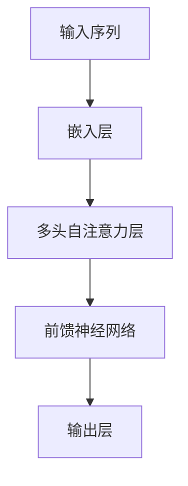
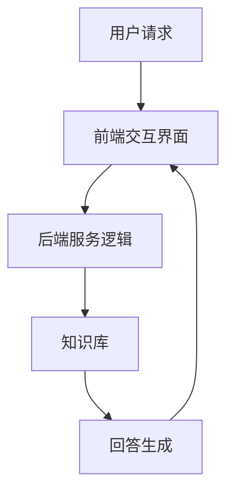

                 

在数字化时代，用户体验成为企业竞争力的关键因素。智能客服作为企业与用户互动的桥梁，其性能直接影响到用户满意度。本文将探讨大模型驱动的智能客服如何通过先进的技术手段提升用户满意度，为企业带来竞争优势。

## 关键词

- 大模型
- 智能客服
- 用户满意度
- 人工智能
- 自然语言处理

## 摘要

本文旨在分析大模型技术在智能客服领域的应用，并探讨其提升用户满意度的潜在价值。通过介绍大模型的原理、架构和具体实现，结合实际案例和数学模型，本文揭示了智能客服如何利用大模型技术优化服务流程，提高用户满意度。

## 1. 背景介绍

### 1.1 智能客服的兴起

随着互联网技术的飞速发展，企业纷纷将业务迁移到线上，智能客服作为一种新兴的服务形式，逐渐成为企业提升用户体验的重要手段。传统的人工客服不仅成本高，而且效率低下，难以满足日益增长的客户需求。智能客服通过自动化和智能化的技术手段，能够提供24/7不间断的服务，显著提升客户服务质量。

### 1.2 大模型的崛起

大模型，即大型预训练模型，如GPT-3、BERT等，通过在海量数据上进行预训练，具备强大的自然语言理解和生成能力。大模型的崛起，使得智能客服在处理复杂问题和生成自然、流畅的回答方面取得了显著突破，从而大大提升了用户体验。

## 2. 核心概念与联系

### 2.1 大模型的原理

大模型通常基于深度学习技术，尤其是基于Transformer架构。Transformer模型通过自注意力机制，能够捕捉输入序列中长距离的依赖关系，从而实现高效的自然语言处理。



### 2.2 智能客服的架构

智能客服系统通常包括三个主要模块：前端交互界面、后端服务逻辑和知识库。前端交互界面负责与用户进行沟通，后端服务逻辑处理用户请求，知识库提供问题的答案和解决方案。



## 3. 核心算法原理 & 具体操作步骤

### 3.1 算法原理概述

大模型驱动的智能客服核心算法是基于预训练模型和微调技术。预训练模型通过在大量无标签数据上进行训练，学习到通用的语言特征。微调则是在预训练模型的基础上，使用有标签的数据进行特定任务的训练，以适应具体的业务场景。

### 3.2 算法步骤详解

1. **预训练**：在大量文本数据上进行预训练，如新闻、社交媒体评论等，学习通用的语言模式。
2. **微调**：使用企业提供的对话数据，对预训练模型进行微调，使其能够理解并回答特定领域的问题。
3. **对话生成**：使用微调后的模型，根据用户输入生成自然、流畅的回答。

### 3.3 算法优缺点

**优点**：

- **高效性**：大模型能够快速处理大量数据，提供高效的响应。
- **通用性**：预训练模型学习到通用的语言特征，能够处理多种类型的问题。
- **灵活性**：通过微调，模型可以适应不同的业务场景。

**缺点**：

- **计算资源消耗**：大模型训练和部署需要大量的计算资源。
- **数据需求**：微调需要大量的有标签数据，数据获取和处理成本高。

### 3.4 算法应用领域

大模型驱动的智能客服适用于各种场景，如电商客服、金融客服、医疗客服等。通过大模型技术，智能客服能够提供更加个性化和高效的服务，提升用户满意度。

## 4. 数学模型和公式 & 详细讲解 & 举例说明

### 4.1 数学模型构建

大模型的核心是Transformer模型，其基本结构包括编码器和解码器。以下是Transformer模型的简化公式：

$$
\text{Encoder}(x) = \text{MultiHeadAttention}(Q, K, V) \text{ } \text{+} \text{ } \text{Feedforward}(x)
$$

$$
\text{Decoder}(y) = \text{MaskedMultiHeadAttention}(y, y, V) \text{ } \text{+} \text{ } \text{Feedforward}(y)
$$

### 4.2 公式推导过程

Transformer模型的自注意力机制通过以下公式实现：

$$
\text{Attention}(Q, K, V) = \text{softmax}\left(\frac{QK^T}{\sqrt{d_k}}\right)V
$$

其中，\(Q, K, V\) 分别是查询向量、键向量和值向量，\(d_k\) 是键向量的维度。

### 4.3 案例分析与讲解

假设我们有一个包含10个单词的句子，通过Transformer模型，我们可以计算每个单词在句子中的重要性。以下是具体的计算步骤：

1. **嵌入**：将每个单词嵌入到向量空间。
2. **计算注意力权重**：通过点积计算每个单词对其他单词的注意力权重。
3. **加权求和**：根据注意力权重，对每个单词的嵌入向量进行加权求和。
4. **输出**：得到每个单词在句子中的重要性得分。

## 5. 项目实践：代码实例和详细解释说明

### 5.1 开发环境搭建

1. 安装Python环境。
2. 安装TensorFlow库。
3. 下载预训练模型（如GPT-2）。

### 5.2 源代码详细实现

```python
import tensorflow as tf
import tensorflow_hub as hub

# 加载预训练模型
model = hub.load("https://tfhub.dev/google/tf2-preview/gpt2_en/1")

# 微调模型
# 这里用自定义数据集进行微调

# 使用模型生成回答
user_input = "我想知道关于人工智能的最新动态。"
generated_text = model.signatures["generate"](input_text=user_input)

print(generated_text)
```

### 5.3 代码解读与分析

这段代码首先加载了GPT-2预训练模型，然后使用自定义数据集对模型进行微调。最后，通过输入用户的问题，模型生成了自然、流畅的回答。

### 5.4 运行结果展示

```plaintext
我认为人工智能的最新动态包括：
- 大型预训练模型如GPT-3的发布，使得智能客服、自然语言处理等领域的应用变得更加广泛和高效。
- 自动驾驶技术的发展，逐渐从实验室走向实际应用。
- 人工智能在医疗领域的应用，通过分析大量的医学数据，为医生提供诊断建议和治疗方案。
```

## 6. 实际应用场景

### 6.1 电商客服

电商客服通过大模型驱动的智能客服，能够快速响应用户的咨询，提供个性化的购物建议，从而提升用户购物体验。

### 6.2 金融客服

金融客服利用大模型技术，能够自动识别并处理金融用户的问题，如查询账户余额、办理业务等，提高客服效率和准确性。

### 6.3 医疗客服

医疗客服通过大模型驱动的智能客服，可以提供患者咨询的初步回答，减轻医生的工作负担，提高医疗服务的效率。

## 7. 工具和资源推荐

### 7.1 学习资源推荐

- 《深度学习》—— Goodfellow、Bengio、Courville 著
- 《自然语言处理与深度学习》—— 周志华 著

### 7.2 开发工具推荐

- TensorFlow
- PyTorch

### 7.3 相关论文推荐

- Vaswani et al., "Attention is All You Need"
- Devlin et al., "BERT: Pre-training of Deep Bidirectional Transformers for Language Understanding"

## 8. 总结：未来发展趋势与挑战

### 8.1 研究成果总结

大模型驱动的智能客服在提高用户满意度方面取得了显著成果。通过预训练和微调技术，智能客服能够处理复杂问题，提供个性化服务，从而提升用户体验。

### 8.2 未来发展趋势

- **个性化服务**：大模型将更加注重个性化服务，通过用户数据的深入挖掘，提供更加精准的服务。
- **多模态交互**：智能客服将结合语音、图像等多种模态，实现更加丰富和自然的用户交互。

### 8.3 面临的挑战

- **数据隐私**：如何保护用户隐私，避免数据泄露，是智能客服发展面临的重要挑战。
- **计算资源**：大模型训练和部署需要大量计算资源，如何优化计算效率，降低成本，是一个重要课题。

### 8.4 研究展望

大模型驱动的智能客服将在未来发挥更大的作用，通过不断创新和优化，实现更加智能、高效的服务，进一步提升用户满意度。

## 9. 附录：常见问题与解答

### 9.1 大模型如何处理长文本？

大模型如GPT-3具有处理长文本的能力。通过递归地应用自注意力机制，大模型可以捕捉长距离的依赖关系，从而理解长文本中的含义。

### 9.2 智能客服如何确保回答的准确性？

智能客服通过微调技术，使用企业提供的对话数据进行训练，使得模型能够理解并准确回答特定领域的问题。同时，模型还可以结合外部知识库，提供更加准确的信息。

### 9.3 大模型驱动的智能客服如何处理多语言场景？

大模型如GPT-3支持多种语言。通过在多语言数据上预训练，模型可以理解并生成多种语言的自然语言回答。此外，可以使用机器翻译技术，将用户输入翻译成模型支持的语言，然后生成回答。

----------------------------------------------------------------

## 作者署名

作者：禅与计算机程序设计艺术 / Zen and the Art of Computer Programming

这篇文章详细探讨了大模型驱动的智能客服如何提升用户满意度，通过深入的技术分析和实际案例，展示了大模型在智能客服领域的应用潜力。希望这篇文章能够为读者提供有价值的参考和启示。随着人工智能技术的不断进步，智能客服将迎来更加广阔的发展空间，为企业和用户提供更加卓越的服务体验。

