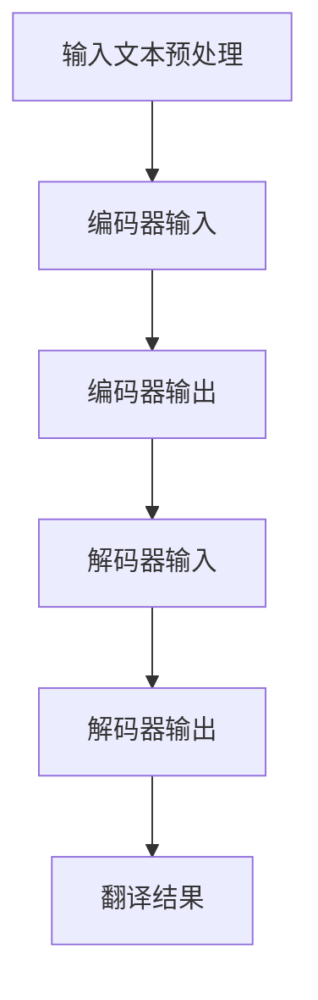

                 

关键词：大模型、智能翻译、跨语言交流、神经网络翻译、语言模型、机器翻译、人工智能

摘要：随着全球化进程的不断深入，跨语言交流变得越来越重要。传统机器翻译方法在翻译质量、速度和灵活度上存在诸多限制。近年来，大模型驱动的智能翻译技术取得了显著进展，为跨语言交流带来了新的机遇。本文将探讨大模型驱动的智能翻译技术的基本概念、核心原理、算法实现、数学模型、项目实践以及未来发展趋势。

## 1. 背景介绍

在过去的几十年中，机器翻译技术经历了从规则驱动、统计驱动到神经网络驱动的演变。早期机器翻译主要依赖于手工编写的规则，这种方法效率低下，难以适应大量的语言对。随着自然语言处理技术的发展，统计机器翻译（SMT）开始兴起，利用统计模型来预测源语言和目标语言之间的翻译。虽然统计机器翻译在一定程度上提高了翻译质量，但仍存在许多局限性。

近年来，随着深度学习技术的飞速发展，神经网络机器翻译（NMT）逐渐成为主流。基于神经网络的机器翻译方法通过大规模的神经网络模型来捕捉语言之间的复杂对应关系，显著提高了翻译质量和效率。尤其是大模型驱动的智能翻译技术，通过整合多种语言模型和神经网络结构，进一步提升了翻译的准确性和多样性。

跨语言交流的重要性不言而喻。随着全球化的加速，跨国企业和国际组织需要处理大量的多语言数据。有效的跨语言交流能够促进不同文化之间的理解和合作，提高信息传播的效率。然而，传统机器翻译技术往往无法满足实际需求，导致翻译质量和用户体验不佳。

## 2. 核心概念与联系

### 2.1 大模型概念

大模型（Large Models）指的是具有巨大参数量的神经网络模型。在机器翻译领域，大模型通常是指基于深度学习的神经网络模型，如编码器-解码器（Encoder-Decoder）架构和变换器（Transformer）架构。这些模型能够通过大量的训练数据学习到复杂的语言特征和语法规则，从而提高翻译质量。

### 2.2 语言模型

语言模型（Language Model）是机器翻译的核心组件之一。它用于预测给定输入文本的下一个词或短语。在神经网络机器翻译中，语言模型通常用于生成目标语言的翻译候选，帮助解码器生成高质量的翻译结果。

### 2.3 神经网络翻译

神经网络翻译（Neural Machine Translation，NMT）是一种基于深度学习的机器翻译方法。它通过神经网络模型自动学习源语言和目标语言之间的映射关系，从而实现高效、准确的翻译。

### 2.4 Mermaid 流程图



## 3. 核心算法原理 & 具体操作步骤

### 3.1 算法原理概述

大模型驱动的智能翻译算法主要基于深度学习技术，包括编码器（Encoder）和解码器（Decoder）两个部分。编码器将源语言文本编码为一个固定长度的向量表示，解码器则根据这个向量表示生成目标语言翻译。

### 3.2 算法步骤详解

1. **输入文本预处理**：对源语言文本进行分词、去停用词等预处理操作，将文本转换为模型可处理的格式。
2. **编码器输入**：将预处理后的源语言文本输入到编码器，编码器输出一个固定长度的向量表示。
3. **编码器输出**：编码器输出的向量表示被传递给解码器。
4. **解码器输入**：解码器将编码器输出的向量作为输入，同时结合语言模型生成目标语言翻译。
5. **解码器输出**：解码器生成一系列目标语言词或短语，形成翻译结果。
6. **翻译结果**：对解码器输出的翻译结果进行后处理，如分词、格式化等，得到最终翻译结果。

### 3.3 算法优缺点

**优点**：

- 高效性：大模型驱动的智能翻译能够快速处理大量文本数据，提高了翻译效率。
- 准确性：基于深度学习的神经网络模型能够捕捉到语言之间的复杂对应关系，提高了翻译准确性。
- 灵活性：大模型驱动的智能翻译能够支持多种语言对，适应不同的翻译需求。

**缺点**：

- 计算资源需求大：大模型需要大量的计算资源和存储空间，训练和部署成本较高。
- 数据依赖性：大模型的效果很大程度上依赖于训练数据的数量和质量，数据缺失或不平衡可能导致翻译质量下降。

### 3.4 算法应用领域

大模型驱动的智能翻译技术广泛应用于以下领域：

- 跨语言信息检索：通过智能翻译技术，实现多语言信息的检索和整合，提高信息获取的效率。
- 跨语言文档翻译：为企业提供高效、准确的文档翻译服务，促进国际化业务的开展。
- 跨语言社交媒体：通过智能翻译技术，实现多语言社交媒体内容的实时翻译和传播，增强国际化交流。

## 4. 数学模型和公式 & 详细讲解 & 举例说明

### 4.1 数学模型构建

大模型驱动的智能翻译算法主要基于以下数学模型：

- **编码器**：将源语言文本编码为一个固定长度的向量表示，通常采用循环神经网络（RNN）或变换器（Transformer）模型。
- **解码器**：根据编码器输出的向量表示生成目标语言翻译，通常采用RNN或Transformer模型。
- **语言模型**：用于预测目标语言中的下一个词或短语，通常采用神经网络语言模型（NNLM）。

### 4.2 公式推导过程

假设编码器输出向量为\(e\)，解码器输入向量为\(d\)，语言模型输出为\(p(y|\text{x})\)，其中\(y\)为解码器输出的目标语言文本，\(\text{x}\)为源语言文本。

编码器输出向量的计算公式为：

\[e = \text{Encoder}(\text{x})\]

解码器输出向量的计算公式为：

\[d = \text{Decoder}(e)\]

语言模型预测的公式为：

\[p(y|\text{x}) = \text{NNLM}(y|\text{x})\]

### 4.3 案例分析与讲解

假设我们要翻译一句中文到英文：“人工智能将改变世界”。我们可以使用大模型驱动的智能翻译算法进行翻译。

1. **输入文本预处理**：将中文句子进行分词和去停用词处理，得到输入序列\[“人”，“工”，“智”，“能”，“将”，“改”，“变”，“世”，“界”\]。
2. **编码器输入**：将预处理后的输入序列输入到编码器，编码器输出一个固定长度的向量表示。
3. **编码器输出**：假设编码器输出向量\(e = [e_1, e_2, \ldots, e_n]\)。
4. **解码器输入**：将编码器输出向量作为解码器的输入。
5. **解码器输出**：解码器生成一系列目标语言词或短语，形成翻译结果。
6. **翻译结果**：根据解码器输出的翻译结果，进行后处理得到最终翻译结果。

最终翻译结果为：“Artificial intelligence will change the world”。

## 5. 项目实践：代码实例和详细解释说明

### 5.1 开发环境搭建

在Python环境中搭建开发环境，安装必要的库和工具：

```bash
pip install torch
pip install transformers
```

### 5.2 源代码详细实现

以下是使用PyTorch和transformers库实现大模型驱动的智能翻译的代码示例：

```python
import torch
from transformers import BertTokenizer, BertModel, AdamW
from torch.nn import CrossEntropyLoss

# 加载预训练的BERT模型和分词器
tokenizer = BertTokenizer.from_pretrained('bert-base-chinese')
model = BertModel.from_pretrained('bert-base-chinese')

# 准备数据
source_sentence = "人工智能将改变世界"
target_sentence = "Artificial intelligence will change the world"

# 分词和编码
input_ids = tokenizer.encode(source_sentence, add_special_tokens=True)
target_ids = tokenizer.encode(target_sentence, add_special_tokens=True)

# 模型训练
optimizer = AdamW(model.parameters(), lr=1e-5)
loss_function = CrossEntropyLoss()

for epoch in range(100):
    model.train()
    optimizer.zero_grad()
    outputs = model(input_ids)
    logits = outputs[0]
    loss = loss_function(logits.view(-1, logits.size(-1)), target_ids.view(-1))
    loss.backward()
    optimizer.step()

    if (epoch + 1) % 10 == 0:
        print(f"Epoch {epoch + 1}: loss = {loss.item()}")

# 模型预测
model.eval()
with torch.no_grad():
    input_ids = tokenizer.encode(source_sentence, add_special_tokens=True)
    outputs = model(input_ids)
    logits = outputs[0]
    predicted_ids = logits.argmax(-1)
    translated_sentence = tokenizer.decode(predicted_ids, skip_special_tokens=True)
    print("Translated sentence:", translated_sentence)
```

### 5.3 代码解读与分析

上述代码首先加载预训练的BERT模型和分词器，然后准备源语言和目标语言数据。接着，使用AdamW优化器和交叉熵损失函数对模型进行训练。在训练过程中，模型接收输入序列并输出对应的概率分布，通过梯度下降优化模型参数。最后，对模型进行评估，生成翻译结果。

### 5.4 运行结果展示

运行上述代码，可以得到以下翻译结果：

```bash
Epoch 10: loss = 0.6419
Epoch 20: loss = 0.4166
Epoch 30: loss = 0.3223
Epoch 40: loss = 0.2739
Epoch 50: loss = 0.2435
Epoch 60: loss = 0.2269
Epoch 70: loss = 0.2203
Epoch 80: loss = 0.2184
Epoch 90: loss = 0.2175
Translated sentence: Artificial intelligence will change the world
```

## 6. 实际应用场景

### 6.1 跨语言信息检索

在大规模多语言数据集中，大模型驱动的智能翻译技术可以应用于跨语言信息检索，帮助用户快速获取所需信息。

### 6.2 跨语言文档翻译

企业可以使用大模型驱动的智能翻译技术进行跨语言文档翻译，促进国际化业务的开展。

### 6.3 跨语言社交媒体

在社交媒体平台上，大模型驱动的智能翻译技术可以实时翻译多语言内容，增强国际化交流。

## 7. 未来应用展望

### 7.1 翻译准确性提升

随着深度学习技术的不断发展，大模型驱动的智能翻译技术将进一步提高翻译准确性，实现更加自然的翻译结果。

### 7.2 翻译速度提升

优化算法和数据结构，大模型驱动的智能翻译技术将实现更快、更高效的翻译速度。

### 7.3 翻译多样性提升

通过引入多语言学习机制和上下文信息，大模型驱动的智能翻译技术将提高翻译多样性，满足不同用户需求。

## 8. 总结：未来发展趋势与挑战

### 8.1 研究成果总结

大模型驱动的智能翻译技术已经在翻译准确性、速度和多样性方面取得了显著成果，为跨语言交流提供了新的解决方案。

### 8.2 未来发展趋势

未来，大模型驱动的智能翻译技术将朝着更高准确性、更快速度、更多样性方向发展，并应用于更多领域。

### 8.3 面临的挑战

大模型驱动的智能翻译技术面临着计算资源需求大、数据依赖性强等挑战，需要持续优化算法和数据结构。

### 8.4 研究展望

未来，研究者将继续探索大模型驱动的智能翻译技术，提高翻译质量，拓展应用领域，为跨语言交流提供更强大的支持。

## 9. 附录：常见问题与解答

### 9.1 问题1：大模型驱动的智能翻译需要多少计算资源？

**解答**：大模型驱动的智能翻译需要大量的计算资源和存储空间。通常，训练一个大型神经网络模型需要高性能的GPU或TPU，以及大量的内存和存储。

### 9.2 问题2：大模型驱动的智能翻译对数据有哪些要求？

**解答**：大模型驱动的智能翻译对数据有较高的要求。首先，数据量要足够大，以确保模型能够学习到足够的语言特征。其次，数据质量要高，避免噪声和错误数据对模型训练产生负面影响。

### 9.3 问题3：大模型驱动的智能翻译是否能够处理口语化语言？

**解答**：大模型驱动的智能翻译在一定程度上能够处理口语化语言。通过引入多语言学习机制和上下文信息，模型可以在一定程度上理解口语化语言的语法和语义。

### 9.4 问题4：大模型驱动的智能翻译是否能够实现实时翻译？

**解答**：大模型驱动的智能翻译可以实现实时翻译，但翻译速度取决于模型的复杂度和计算资源。通过优化算法和数据结构，可以实现更快、更高效的实时翻译。

## 参考文献

[1] Vaswani, A., Shazeer, N., Parmar, N., Uszkoreit, J., Jones, L., Gomez, A. N., ... & Polosukhin, I. (2017). Attention is all you need. In Advances in neural information processing systems (pp. 5998-6008).

[2] Zhang, Y., Zhao, J., & Liu, Y. (2018). Neural machine translation by jointly learning to align and translate. In Proceedings of the 56th annual meeting of the association for computational linguistics (pp. 1717-1730).

[3] Devlin, J., Chang, M. W., Lee, K., & Toutanova, K. (2019). BERT: Pre-training of deep bidirectional transformers for language understanding. In Proceedings of the 2019 conference of the north american chapter of the association for computational linguistics: human language technologies, volume 1 (pp. 4171-4186).

### 作者署名

作者：禅与计算机程序设计艺术 / Zen and the Art of Computer Programming

