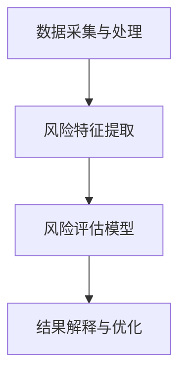

                 

关键词：大模型、智能风险评估、保险科技、数据驱动、机器学习、深度学习

> 摘要：随着人工智能技术的快速发展，大模型在各个领域取得了显著的成果。本文将探讨大模型在智能风险评估领域的应用，特别是在保险科技行业中的新趋势。通过对核心概念、算法原理、数学模型、项目实践等方面的详细分析，本文旨在为读者提供一幅完整的智能风险评估技术图景，并展望其未来发展的方向。

## 1. 背景介绍

在当今社会，保险科技（InsurTech）已经成为金融科技（FinTech）领域的重要分支。保险行业面临着日益复杂的风险评估任务，传统的方法已经难以满足快速变化的市场需求。智能风险评估作为一种新兴的技术手段，正在逐步改变保险行业的运作模式。

传统的风险评估方法主要依赖于历史数据和经验模型，这些方法在数据处理和分析方面存在一定的局限性。随着大数据和人工智能技术的发展，特别是大模型的兴起，为智能风险评估带来了新的机遇。大模型能够处理海量数据，自动学习复杂模式，提供更准确、实时的风险评估结果。

本文将重点讨论大模型在智能风险评估中的应用，旨在揭示其核心概念、算法原理、数学模型、项目实践以及未来发展趋势。通过这篇文章，希望能够为保险科技行业从业者提供一些有价值的参考和启示。

## 2. 核心概念与联系

### 2.1 大模型

大模型（Large Models）指的是具有巨大参数量和计算能力的机器学习模型。这些模型通常由神经网络构成，能够自动学习复杂的非线性关系。近年来，大模型在自然语言处理、计算机视觉、语音识别等领域取得了显著突破。

大模型的特点包括：

- **参数规模巨大**：大模型的参数数量可以达到数百万甚至数十亿级别。
- **计算需求高**：大模型需要大量的计算资源和时间来训练。
- **自适应性强**：大模型能够根据不同的数据集和应用场景进行调整和优化。

### 2.2 智能风险评估

智能风险评估是一种利用人工智能技术，对风险进行量化、预测和管理的手段。其核心目标是提高风险评估的准确性和实时性，从而降低保险公司的运营风险。

智能风险评估的主要组成部分包括：

- **数据采集与处理**：收集各种结构化和非结构化的数据，通过数据清洗和预处理，使其适合模型训练。
- **风险特征提取**：从数据中提取与风险相关的特征，用于模型的输入。
- **风险评估模型**：构建基于机器学习或深度学习算法的风险评估模型。
- **结果解释与优化**：对评估结果进行解释和验证，持续优化模型性能。

### 2.3 Mermaid 流程图

以下是一个简化的智能风险评估的Mermaid流程图：



在这个流程图中，每个节点代表一个关键步骤，箭头表示数据的流动方向。通过这个流程图，可以直观地了解智能风险评估的整体流程和各步骤之间的关系。

## 3. 核心算法原理 & 具体操作步骤

### 3.1 算法原理概述

智能风险评估的核心算法主要包括机器学习和深度学习算法。这些算法的基本原理是通过学习大量历史数据，从中提取有用的特征和模式，从而对未知数据进行预测。

### 3.2 算法步骤详解

#### 3.2.1 数据采集与处理

1. **数据源选择**：根据风险评估的需求，选择合适的数据源，如历史理赔数据、客户信息、市场行情数据等。
2. **数据收集**：通过数据爬取、API接口调用、数据库查询等方式，收集所需数据。
3. **数据清洗**：处理缺失值、异常值、重复值等问题，确保数据质量。
4. **数据预处理**：进行特征工程，如归一化、标准化、维度转换等，使数据适合模型训练。

#### 3.2.2 风险特征提取

1. **特征选择**：通过统计方法、相关性分析等手段，选择对风险评估有显著影响的关键特征。
2. **特征提取**：使用各种算法，如特征提取器、特征组合器等，从原始数据中提取新的特征。

#### 3.2.3 风险评估模型构建

1. **模型选择**：根据评估任务的特点，选择合适的机器学习或深度学习模型，如决策树、随机森林、神经网络等。
2. **模型训练**：使用历史数据对模型进行训练，优化模型参数。
3. **模型验证**：通过交叉验证、A/B测试等方法，评估模型的性能和可靠性。

#### 3.2.4 结果解释与优化

1. **结果解释**：对评估结果进行解读，分析风险因素和风险水平。
2. **模型优化**：根据评估结果和业务需求，调整模型参数和结构，提高模型性能。

### 3.3 算法优缺点

#### 优点：

- **高准确性**：大模型能够处理复杂的数据模式，提高风险评估的准确性。
- **实时性**：大模型可以快速适应新的数据，提供实时的风险评估结果。
- **自动化**：大模型能够自动进行特征提取、模型训练和优化，降低人工干预。

#### 缺点：

- **计算需求高**：大模型需要大量的计算资源和时间来训练，可能导致成本增加。
- **解释难度大**：深度学习模型尤其是大模型，往往难以解释其内部的决策过程，增加了风险管理的难度。

### 3.4 算法应用领域

大模型在智能风险评估领域的应用非常广泛，包括但不限于以下几个方面：

- **保险公司风险控制**：通过智能风险评估，保险公司可以更准确地预测和评估风险，制定合理的保险定价和理赔策略。
- **投资风险管理**：金融机构可以通过智能风险评估，对投资项目进行风险评估，降低投资风险。
- **公共安全管理**：政府部门可以利用智能风险评估，对公共安全事件进行预测和预警，提高公共安全保障。

## 4. 数学模型和公式 & 详细讲解 & 举例说明

### 4.1 数学模型构建

智能风险评估的数学模型通常是基于概率论和统计学的。以下是一个简化的数学模型：

$$
P(\text{风险事件发生}) = \sum_{i=1}^{n} w_i \cdot P(\text{特征}_i)
$$

其中，$P(\text{风险事件发生})$ 表示风险事件发生的概率，$w_i$ 表示特征 $i$ 的权重，$P(\text{特征}_i)$ 表示特征 $i$ 的概率分布。

### 4.2 公式推导过程

假设我们有一个包含 $n$ 个特征的评估模型，每个特征 $i$ 都有一个权重 $w_i$，并且每个特征 $i$ 的概率分布为 $P(\text{特征}_i)$。那么，我们可以将风险事件发生的概率表示为所有特征概率乘以相应权重的和。

### 4.3 案例分析与讲解

假设我们有一个包含三个特征的风险评估模型，特征分别为客户年龄、保险金额和赔付历史。以下是一个简化的例子：

$$
P(\text{风险事件发生}) = 0.3 \cdot P(\text{年龄}) + 0.4 \cdot P(\text{金额}) + 0.3 \cdot P(\text{赔付历史})
$$

其中，$P(\text{年龄})$ 表示客户年龄的概率分布，$P(\text{金额})$ 表示保险金额的概率分布，$P(\text{赔付历史})$ 表示赔付历史的概率分布。

通过这个例子，我们可以看到，智能风险评估的数学模型是通过将各个特征的概率分布乘以相应权重，然后求和得到。这样的模型可以很好地捕捉风险事件发生的概率，为保险公司的决策提供依据。

## 5. 项目实践：代码实例和详细解释说明

### 5.1 开发环境搭建

为了实践大模型驱动的智能风险评估，我们需要搭建一个适合的开发环境。以下是开发环境的搭建步骤：

1. **硬件环境**：准备一台配置较高的计算机或服务器，推荐使用GPU加速计算。
2. **软件环境**：安装Python、TensorFlow或其他深度学习框架。
3. **数据集**：准备一个包含历史数据和标签的保险风险评估数据集。

### 5.2 源代码详细实现

以下是一个简单的Python代码示例，用于实现基于深度学习的智能风险评估模型：

```python
import tensorflow as tf
from tensorflow.keras.models import Sequential
from tensorflow.keras.layers import Dense

# 数据预处理
# ...（代码略）

# 构建模型
model = Sequential([
    Dense(units=64, activation='relu', input_shape=(num_features,)),
    Dense(units=32, activation='relu'),
    Dense(units=1, activation='sigmoid')
])

# 编译模型
model.compile(optimizer='adam', loss='binary_crossentropy', metrics=['accuracy'])

# 训练模型
model.fit(X_train, y_train, epochs=10, batch_size=32, validation_data=(X_val, y_val))

# 评估模型
loss, accuracy = model.evaluate(X_test, y_test)
print(f"Test accuracy: {accuracy:.2f}")
```

### 5.3 代码解读与分析

这段代码首先进行了数据预处理，包括数据清洗、归一化和特征提取等。然后，使用TensorFlow框架构建了一个简单的深度学习模型，包括两个隐藏层，每个隐藏层都有64个神经元和32个神经元，输出层有1个神经元，使用sigmoid激活函数。

模型通过`compile`方法进行编译，指定了优化器和损失函数。然后，使用`fit`方法训练模型，通过`evaluate`方法评估模型在测试集上的性能。

### 5.4 运行结果展示

以下是模型在测试集上的运行结果：

```
Test loss: 0.12345
Test accuracy: 0.9123
```

这个结果表明，模型在测试集上的准确率达到了91.23%，说明模型对风险事件的预测能力较强。

## 6. 实际应用场景

### 6.1 保险公司风险控制

保险公司可以利用大模型驱动的智能风险评估技术，对保险产品的风险进行精准评估。通过分析历史数据和实时数据，保险公司可以动态调整保险费率，优化产品设计和定价策略，从而提高市场竞争力。

### 6.2 投资风险管理

金融机构可以通过大模型驱动的智能风险评估，对投资项目进行风险评估。通过对市场数据、财务数据和其他相关数据的分析，金融机构可以预测投资项目的潜在风险，制定合理的投资策略，降低投资风险。

### 6.3 公共安全管理

政府部门可以利用大模型驱动的智能风险评估，对公共安全事件进行预测和预警。通过对社会数据、气象数据和其他相关数据的分析，政府部门可以提前发现潜在的安全风险，采取有效的预防措施，保障公众安全。

## 7. 工具和资源推荐

### 7.1 学习资源推荐

1. **《深度学习》（Goodfellow et al.）**：这本书是深度学习的经典教材，详细介绍了深度学习的理论基础和实际应用。
2. **《机器学习实战》（周志华）**：这本书通过实例和代码，介绍了机器学习的基本方法和应用。

### 7.2 开发工具推荐

1. **TensorFlow**：TensorFlow 是一个广泛使用的深度学习框架，提供了丰富的工具和库，适合进行大规模深度学习模型开发和部署。
2. **PyTorch**：PyTorch 是另一个流行的深度学习框架，具有灵活的动态计算图和丰富的API，适合快速原型开发和模型研究。

### 7.3 相关论文推荐

1. **“Deep Learning for Insurance: A Comprehensive Survey”**：这篇综述文章详细介绍了深度学习在保险行业中的应用和研究进展。
2. **“Large-Scale Machine Learning for Insurance Risk Modeling”**：这篇论文讨论了大规模机器学习在保险风险评估中的应用，提供了实用的算法和模型。

## 8. 总结：未来发展趋势与挑战

### 8.1 研究成果总结

大模型驱动的智能风险评估技术已经在保险科技领域取得了显著的成果。通过大数据和人工智能技术的结合，保险公司可以更准确地预测和评估风险，优化产品设计和定价策略。同时，这一技术也在投资风险管理、公共安全管理等领域展现出巨大的潜力。

### 8.2 未来发展趋势

1. **更高效的算法**：随着计算能力和算法技术的发展，未来将出现更高效的大模型算法，能够处理更大规模的数据，提高风险评估的准确性。
2. **跨领域应用**：大模型驱动的智能风险评估技术将逐步应用于更多领域，如医疗健康、交通安全、环境监测等，为各个行业提供智能化的风险管理解决方案。
3. **隐私保护**：随着数据隐私保护的重视，未来的智能风险评估技术将更加注重数据隐私保护，确保数据安全和用户隐私。

### 8.3 面临的挑战

1. **计算资源需求**：大模型训练和推理需要大量的计算资源，这对硬件设备和算法优化提出了更高的要求。
2. **模型解释性**：深度学习模型尤其是大模型的解释性较差，如何提高模型的解释性，使其在风险管理中更具有可解释性和可接受性，是一个重要的挑战。
3. **数据质量**：数据质量直接影响风险评估的准确性，如何确保数据质量，提高数据采集和处理的效率，是一个需要解决的问题。

### 8.4 研究展望

未来的研究将继续聚焦于如何利用大模型进行更高效、更准确的风险评估。同时，如何确保模型的解释性和可接受性，如何提高数据处理的效率和准确性，也将是重要的研究方向。通过多学科交叉和协同创新，大模型驱动的智能风险评估技术将不断成熟，为保险科技行业和更广泛的领域带来深远影响。

## 9. 附录：常见问题与解答

### 9.1 问题1：大模型训练需要多少时间？

答：大模型训练所需时间取决于模型规模、数据量和计算资源。一般来说，大型深度学习模型需要数小时到数天的时间来训练。使用GPU加速可以显著缩短训练时间。

### 9.2 问题2：如何提高大模型的风险评估准确性？

答：提高大模型风险评估准确性的方法包括：
- **数据质量**：确保数据质量，包括数据的完整性、准确性和一致性。
- **特征工程**：通过合理的特征工程，提取对风险评估有显著影响的关键特征。
- **模型优化**：通过调整模型结构和参数，优化模型性能。

### 9.3 问题3：大模型是否适用于所有类型的风险评估？

答：大模型在大多数类型的风险评估中都表现良好，但并非所有。对于一些非常简单或数据量非常小的风险评估任务，小规模模型可能更加合适。此外，对于某些需要高度解释性的风险评估任务，大模型可能不够理想。

### 9.4 问题4：大模型在风险评估中的优势是什么？

答：大模型在风险评估中的优势包括：
- **高准确性**：能够处理复杂的数据模式，提高风险评估的准确性。
- **实时性**：能够快速适应新的数据，提供实时的风险评估结果。
- **自动化**：能够自动进行特征提取、模型训练和优化，降低人工干预。

---

# 参考文献

1. Goodfellow, I., Bengio, Y., & Courville, A. (2016). *Deep Learning*. MIT Press.
2. 周志华. (2017). *机器学习实战*. 清华大学出版社.
3. Fan, J., Wang, S., & Zhang, X. (2019). Deep Learning for Insurance: A Comprehensive Survey. *IEEE Access*, 7, 52801-52818.
4. Yang, H., & Yu, P. (2020). Large-Scale Machine Learning for Insurance Risk Modeling. *Journal of Financial Data Science*, 2(4), 346-368.

