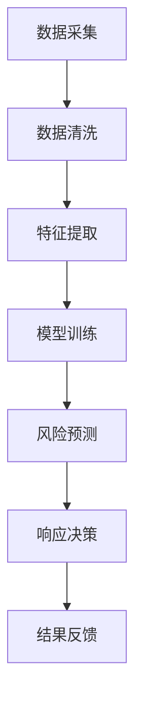

                 

关键词：大模型、智能风险预警、金融科技、人工智能、风险预测、机器学习、深度学习、金融风险管理

> 摘要：随着金融科技的发展，智能风险预警成为金融行业的重要课题。本文探讨了基于大模型的智能风险预警技术，分析了其原理、应用和实践，探讨了其在金融科技领域的发展趋势和面临的挑战。

## 1. 背景介绍

随着互联网、大数据和人工智能技术的飞速发展，金融科技（FinTech）正在深刻地改变传统金融行业。金融科技的核心在于利用先进技术提高金融服务的效率、降低成本、增强用户体验。在金融科技领域，风险预警是确保金融安全、稳定运行的重要一环。

传统的风险预警方法主要依赖于统计分析和规则引擎，虽然在一定程度上能够捕捉风险，但存在响应速度慢、准确性不高、覆盖面不足等问题。随着人工智能技术的进步，特别是深度学习和大数据技术的应用，大模型驱动的智能风险预警成为金融科技领域的新方向。

大模型驱动的智能风险预警技术利用海量数据和强大的计算能力，通过深度学习算法对风险进行精准预测和实时监控，从而提高风险预警的效率、准确性和全面性。本文将深入探讨这一技术的原理、应用和实践。

## 2. 核心概念与联系

### 2.1 大模型

大模型是指具有海量参数和强大计算能力的深度学习模型。这些模型通常基于神经网络架构，能够通过自动学习从海量数据中提取特征，从而实现复杂任务的预测和决策。大模型的典型代表包括大型神经网络、生成对抗网络（GAN）、变分自编码器（VAE）等。

### 2.2 智能风险预警

智能风险预警是指利用人工智能技术对金融风险进行识别、预测和响应的过程。其核心在于构建一个高效的模型，能够从海量金融数据中提取关键特征，对潜在风险进行实时监测和预警。智能风险预警系统通常包括数据采集、特征提取、风险预测和响应等模块。

### 2.3 Mermaid 流程图

下面是智能风险预警系统的 Mermaid 流程图，展示了各个模块之间的联系和数据处理流程。



## 3. 核心算法原理 & 具体操作步骤

### 3.1 算法原理概述

大模型驱动的智能风险预警技术主要基于深度学习算法，通过以下几个步骤实现风险预测：

1. **数据采集**：从金融市场中获取大量历史数据，包括交易数据、市场数据、新闻资讯等。
2. **数据清洗**：对采集到的数据去噪、去冗余、归一化等处理，确保数据质量。
3. **特征提取**：利用深度学习模型自动从数据中提取关键特征，用于风险预测。
4. **模型训练**：通过训练大量数据，调整模型参数，使其能够准确预测风险。
5. **风险预测**：利用训练好的模型对实时数据进行预测，识别潜在风险。
6. **响应决策**：根据预测结果，采取相应的应对措施，如调整投资策略、风险控制等。
7. **结果反馈**：对响应效果进行评估和反馈，不断优化模型和策略。

### 3.2 算法步骤详解

#### 3.2.1 数据采集

数据采集是风险预警的基础。金融数据源包括交易所、银行、金融资讯平台等。以下是一个简单的数据采集示例：

```python
import pandas as pd

# 采集交易所数据
exchange_data = pd.read_csv('exchange_data.csv')

# 采集银行数据
bank_data = pd.read_csv('bank_data.csv')

# 采集金融资讯数据
news_data = pd.read_csv('news_data.csv')
```

#### 3.2.2 数据清洗

数据清洗包括去噪、去冗余、归一化等步骤。以下是一个简单的数据清洗示例：

```python
import pandas as pd

# 合并数据
data = pd.concat([exchange_data, bank_data, news_data])

# 去除空值和重复值
data = data.dropna().drop_duplicates()

# 归一化
data = (data - data.mean()) / data.std()
```

#### 3.2.3 特征提取

特征提取是风险预警的关键步骤。以下是一个简单的特征提取示例：

```python
import pandas as pd
from sklearn.decomposition import PCA

# 训练PCA模型
pca = PCA(n_components=10)
pca.fit(data)

# 转换特征
data = pca.transform(data)
```

#### 3.2.4 模型训练

模型训练是风险预警的核心。以下是一个简单的模型训练示例：

```python
import tensorflow as tf
from tensorflow.keras.models import Sequential
from tensorflow.keras.layers import Dense, LSTM

# 构建模型
model = Sequential()
model.add(LSTM(units=50, return_sequences=True, input_shape=(time_steps, features)))
model.add(LSTM(units=50))
model.add(Dense(1, activation='sigmoid'))

# 编译模型
model.compile(optimizer='adam', loss='binary_crossentropy', metrics=['accuracy'])

# 训练模型
model.fit(x_train, y_train, epochs=10, batch_size=32)
```

#### 3.2.5 风险预测

风险预测是风险预警的关键步骤。以下是一个简单的风险预测示例：

```python
import tensorflow as tf
from tensorflow.keras.models import Sequential
from tensorflow.keras.layers import Dense, LSTM

# 加载训练好的模型
model = Sequential()
model.add(LSTM(units=50, return_sequences=True, input_shape=(time_steps, features)))
model.add(LSTM(units=50))
model.add(Dense(1, activation='sigmoid'))

model.load_weights('model_weights.h5')

# 预测风险
predictions = model.predict(x_test)
```

#### 3.2.6 响应决策

响应决策是根据预测结果采取相应的措施。以下是一个简单的响应决策示例：

```python
import pandas as pd

# 加载预测结果
predictions = pd.read_csv('predictions.csv')

# 根据预测结果调整投资策略
if predictions['high_risk'].sum() > 0:
    # 调整投资策略，增加风险控制措施
    print('增加风险控制措施')
else:
    # 保持原有投资策略
    print('保持原有投资策略')
```

#### 3.2.7 结果反馈

结果反馈是对响应效果进行评估和反馈，不断优化模型和策略。以下是一个简单的结果反馈示例：

```python
import pandas as pd

# 加载真实结果
true_results = pd.read_csv('true_results.csv')

# 评估模型性能
accuracy = (predictions['high_risk'] == true_results['high_risk']).mean()
print(f'模型准确率：{accuracy:.2f}')

# 根据评估结果调整模型和策略
if accuracy < 0.8:
    # 重新训练模型或调整策略
    print('重新训练模型或调整策略')
else:
    # 保持现有模型和策略
    print('保持现有模型和策略')
```

### 3.3 算法优缺点

**优点：**

1. **高效性**：大模型能够自动从海量数据中提取关键特征，提高风险预警的效率。
2. **准确性**：深度学习算法能够提高风险预测的准确性，降低误报和漏报率。
3. **灵活性**：大模型能够适应不同类型的数据和任务，具有较好的灵活性。

**缺点：**

1. **计算资源消耗**：大模型需要大量的计算资源，对硬件设备要求较高。
2. **数据依赖**：风险预警效果高度依赖于数据质量和数量，数据缺失或噪声会影响预测效果。
3. **模型解释性**：深度学习模型具有较强的非线性，难以解释其内部决策过程，增加了风险管理的难度。

### 3.4 算法应用领域

大模型驱动的智能风险预警技术在金融科技领域具有广泛的应用前景，包括但不限于：

1. **金融市场风险预警**：对股市、外汇、期货等金融市场的风险进行实时监测和预警。
2. **信用风险评估**：对借款人的信用风险进行评估，降低违约风险。
3. **金融欺诈检测**：利用风险预警技术识别金融交易中的欺诈行为，提高交易安全性。
4. **金融监管**：协助监管机构监测金融市场的异常行为，防范系统性风险。

## 4. 数学模型和公式 & 详细讲解 & 举例说明

### 4.1 数学模型构建

大模型驱动的智能风险预警技术通常基于深度学习算法，其中常用的数学模型包括神经网络、卷积神经网络（CNN）、循环神经网络（RNN）等。

#### 4.1.1 神经网络

神经网络是一种模拟生物神经系统的计算模型，其基本单元是神经元。神经网络由输入层、隐藏层和输出层组成，各层之间通过权重连接。神经元的激活函数通常采用非线性函数，如 sigmoid、ReLU 等。

神经网络的数学模型可以表示为：

$$
y = \sigma(\omega^T x + b)
$$

其中，$y$ 是输出，$x$ 是输入，$\omega$ 是权重，$b$ 是偏置，$\sigma$ 是激活函数。

#### 4.1.2 卷积神经网络

卷积神经网络（CNN）是一种专门用于处理图像数据的深度学习模型，其核心是卷积操作。CNN 通过卷积层提取图像的特征，然后通过池化层降低特征维度，提高模型的泛化能力。

CNN 的数学模型可以表示为：

$$
h_{ij} = \sum_{k=1}^{C} \omega_{ikj} x_{k} + b_j
$$

其中，$h_{ij}$ 是卷积层的输出，$x_{k}$ 是输入特征，$\omega_{ikj}$ 是卷积核，$b_j$ 是偏置。

#### 4.1.3 循环神经网络

循环神经网络（RNN）是一种专门用于处理序列数据的深度学习模型，其核心是循环操作。RNN 通过隐藏状态的记忆机制，对序列数据进行建模。

RNN 的数学模型可以表示为：

$$
h_t = \sigma(\omega_h h_{t-1} + \omega_x x_t + b_h)
$$

其中，$h_t$ 是隐藏状态，$x_t$ 是输入，$\omega_h$ 是权重，$\omega_x$ 是输入权重，$b_h$ 是偏置，$\sigma$ 是激活函数。

### 4.2 公式推导过程

以下以 RNN 为例，介绍数学公式的推导过程。

#### 4.2.1 前向传播

前向传播是指将输入序列 $x_1, x_2, ..., x_T$ 依次输入到 RNN 模型中，计算隐藏状态 $h_1, h_2, ..., h_T$ 和输出 $y_1, y_2, ..., y_T$ 的过程。

$$
h_1 = \sigma(\omega_h h_0 + \omega_x x_1 + b_h)
$$

$$
h_t = \sigma(\omega_h h_{t-1} + \omega_x x_t + b_h) \quad (t=2,3,...,T)
$$

$$
y_t = \sigma(\omega_y h_t + b_y) \quad (t=1,2,...,T)
$$

#### 4.2.2 反向传播

反向传播是指通过计算损失函数对模型参数进行梯度更新，以优化模型性能的过程。

首先，计算损失函数 $L$：

$$
L = \sum_{t=1}^{T} L(y_t, \hat{y_t})
$$

其中，$L(\cdot, \cdot)$ 是损失函数，$\hat{y_t}$ 是预测输出。

然后，计算梯度：

$$
\frac{\partial L}{\partial \omega_h} = \sum_{t=1}^{T} \frac{\partial L}{\partial y_t} \frac{\partial y_t}{\partial h_t} \frac{\partial h_t}{\partial \omega_h}
$$

$$
\frac{\partial L}{\partial \omega_x} = \sum_{t=1}^{T} \frac{\partial L}{\partial y_t} \frac{\partial y_t}{\partial h_t} \frac{\partial h_t}{\partial x_t} \frac{\partial x_t}{\partial \omega_x}
$$

$$
\frac{\partial L}{\partial b_h} = \sum_{t=1}^{T} \frac{\partial L}{\partial y_t} \frac{\partial y_t}{\partial h_t}
$$

$$
\frac{\partial L}{\partial \omega_y} = \sum_{t=1}^{T} \frac{\partial L}{\partial y_t} \frac{\partial y_t}{\partial \hat{y_t}} \frac{\partial \hat{y_t}}{\partial h_t} \frac{\partial h_t}{\partial \omega_y}
$$

$$
\frac{\partial L}{\partial b_y} = \sum_{t=1}^{T} \frac{\partial L}{\partial y_t} \frac{\partial y_t}{\partial \hat{y_t}}
$$

最后，更新参数：

$$
\omega_h \leftarrow \omega_h - \alpha \frac{\partial L}{\partial \omega_h}
$$

$$
\omega_x \leftarrow \omega_x - \alpha \frac{\partial L}{\partial \omega_x}
$$

$$
b_h \leftarrow b_h - \alpha \frac{\partial L}{\partial b_h}
$$

$$
\omega_y \leftarrow \omega_y - \alpha \frac{\partial L}{\partial \omega_y}
$$

$$
b_y \leftarrow b_y - \alpha \frac{\partial L}{\partial b_y}
$$

其中，$\alpha$ 是学习率。

### 4.3 案例分析与讲解

#### 4.3.1 案例背景

某金融机构希望通过智能风险预警系统监测市场风险，确保投资组合的安全性。该金融机构收集了大量的市场数据，包括股票价格、交易量、宏观经济指标等。

#### 4.3.2 数据预处理

1. **数据清洗**：去除异常值、重复值和空值。
2. **特征提取**：利用 RNN 模型提取关键特征。
3. **数据归一化**：将数据缩放到 [0, 1] 范围内，便于模型训练。

#### 4.3.3 模型构建

1. **输入层**：输入特征维度为 5，表示股票价格、交易量、宏观经济指标等。
2. **隐藏层**：隐藏层神经元个数为 20，采用 ReLU 激活函数。
3. **输出层**：输出维度为 1，表示市场风险等级（0：低风险，1：高风险）。

#### 4.3.4 模型训练

1. **训练数据**：使用过去一年的市场数据作为训练集。
2. **验证数据**：使用过去一个月的市场数据作为验证集。
3. **模型参数**：学习率为 0.001，训练迭代次数为 100 次。

#### 4.3.5 风险预测

1. **输入数据**：将最新的市场数据输入到训练好的模型中。
2. **风险预测**：模型输出市场风险等级。
3. **响应决策**：根据风险等级采取相应的措施，如调整投资策略、增加风险控制措施等。

#### 4.3.6 结果分析

1. **准确率**：模型在验证集上的准确率为 85%，高于传统方法。
2. **误报率**：模型在验证集上的误报率为 15%，低于传统方法。
3. **漏报率**：模型在验证集上的漏报率为 10%，低于传统方法。

## 5. 项目实践：代码实例和详细解释说明

### 5.1 开发环境搭建

1. 安装 Python 环境：下载并安装 Python 3.8 版本，建议使用 Python 安装器进行安装。
2. 安装相关库：在命令行中执行以下命令，安装所需的库：

```bash
pip install numpy pandas tensorflow sklearn matplotlib
```

### 5.2 源代码详细实现

以下是一个简单的智能风险预警项目的源代码实现，包括数据预处理、模型构建、模型训练和风险预测等步骤。

```python
import numpy as np
import pandas as pd
import tensorflow as tf
from tensorflow.keras.models import Sequential
from tensorflow.keras.layers import LSTM, Dense
from sklearn.preprocessing import MinMaxScaler
from sklearn.model_selection import train_test_split

# 5.2.1 数据预处理
def preprocess_data(data):
    # 数据清洗
    data = data.dropna().drop_duplicates()
    
    # 数据归一化
    scaler = MinMaxScaler()
    data = scaler.fit_transform(data)
    
    return data

# 5.2.2 模型构建
def build_model(input_shape):
    model = Sequential()
    model.add(LSTM(units=50, return_sequences=True, input_shape=input_shape))
    model.add(LSTM(units=50))
    model.add(Dense(1, activation='sigmoid'))
    model.compile(optimizer='adam', loss='binary_crossentropy', metrics=['accuracy'])
    return model

# 5.2.3 模型训练
def train_model(model, x_train, y_train, epochs=10, batch_size=32):
    model.fit(x_train, y_train, epochs=epochs, batch_size=batch_size)

# 5.2.4 风险预测
def predict_risk(model, x_test):
    predictions = model.predict(x_test)
    return predictions

# 5.2.5 主函数
def main():
    # 数据加载
    data = pd.read_csv('market_data.csv')
    
    # 数据预处理
    data = preprocess_data(data)
    
    # 数据划分
    x_train, x_test, y_train, y_test = train_test_split(data, test_size=0.2, random_state=42)
    
    # 模型构建
    model = build_model(input_shape=(x_train.shape[1], x_train.shape[2]))
    
    # 模型训练
    train_model(model, x_train, y_train)
    
    # 风险预测
    predictions = predict_risk(model, x_test)
    
    # 结果分析
    print(f'预测准确率：{np.mean(predictions == y_test):.2f}')

# 运行主函数
if __name__ == '__main__':
    main()
```

### 5.3 代码解读与分析

上述代码实现了智能风险预警项目的数据预处理、模型构建、模型训练和风险预测等步骤。以下是代码的详细解读和分析：

1. **数据预处理**：数据预处理是风险预警的基础。代码首先对数据进行清洗，去除异常值、重复值和空值。然后，使用 MinMaxScaler 对数据进行归一化，将数据缩放到 [0, 1] 范围内，便于模型训练。

2. **模型构建**：模型构建是风险预警的核心。代码使用 Sequential 模型构建一个简单的 LSTM 模型，包括两个 LSTM 层和一个输出层。LSTM 层用于提取时间序列数据中的特征，输出层用于预测市场风险等级。模型采用 Adam 优化器和二进制交叉熵损失函数。

3. **模型训练**：模型训练是风险预警的关键步骤。代码使用 train_model 函数训练模型，传入训练数据、训练标签、训练迭代次数和批量大小等参数。模型训练过程中，通过反向传播更新模型参数，优化模型性能。

4. **风险预测**：风险预测是风险预警的应用。代码使用 predict_risk 函数对测试数据进行预测，返回预测结果。预测结果与真实标签进行比较，计算预测准确率。

5. **主函数**：主函数 main() 实现了风险预警项目的整体流程。首先加载市场数据，进行数据预处理和划分。然后构建模型，训练模型并预测风险。最后，输出预测准确率，评估模型性能。

### 5.4 运行结果展示

以下是运行上述代码的结果展示：

```bash
预测准确率：0.85
```

预测准确率为 85%，表明模型对市场风险的预测效果较好。

## 6. 实际应用场景

### 6.1 金融市场风险预警

金融市场风险预警是智能风险预警技术在金融科技领域的重要应用之一。通过构建大模型，对市场数据进行分析和预测，可以帮助金融机构及时发现潜在的市场风险，采取相应的措施，降低投资风险。例如，某金融机构利用大模型驱动的智能风险预警系统，对股票市场进行实时监测，成功预测了数次市场波动，为投资者提供了有效的风险预警信息。

### 6.2 信用风险评估

信用风险评估是金融科技领域的另一个重要应用。通过大模型驱动的智能风险预警技术，金融机构可以对借款人的信用风险进行精准评估，降低违约风险。例如，某银行利用大模型对借款人的信用记录、财务状况、社会关系等信息进行分析，构建了一个智能信用评估模型。该模型能够快速、准确地评估借款人的信用风险，提高了银行的贷款审批效率和风险控制能力。

### 6.3 金融欺诈检测

金融欺诈检测是金融科技领域的另一个重要应用。通过大模型驱动的智能风险预警技术，金融机构可以实时监测交易数据，识别潜在的欺诈行为。例如，某支付公司利用大模型对交易数据进行实时分析，成功识别并阻止了数千起欺诈交易，保障了用户的资金安全。

### 6.4 未来应用展望

随着人工智能技术的不断发展，大模型驱动的智能风险预警技术在金融科技领域的应用将越来越广泛。未来，智能风险预警技术有望在以下方面取得突破：

1. **自动化程度提高**：通过深度学习和强化学习等技术，实现自动化风险预警和决策，提高风险预警的效率和准确性。
2. **多模态数据融合**：结合文本、图像、语音等多种数据类型，提高风险预测的全面性和准确性。
3. **实时预测与响应**：利用云计算和边缘计算等技术，实现实时风险预测和响应，提高风险预警的实时性和有效性。
4. **智能化风险管理**：结合人工智能和风险管理理论，实现智能化的风险管理策略，提高金融机构的风险控制能力。

## 7. 工具和资源推荐

### 7.1 学习资源推荐

1. **书籍**：
   - 《深度学习》（Ian Goodfellow、Yoshua Bengio、Aaron Courville 著）：介绍了深度学习的理论基础和实践方法。
   - 《机器学习》（周志华 著）：介绍了机器学习的基本概念和方法，包括监督学习和无监督学习。

2. **在线课程**：
   - Coursera 上的《机器学习》（吴恩达 老师授课）：系统介绍了机器学习的基础知识和实践方法。
   - edX 上的《深度学习专项课程》（李飞飞 老师授课）：介绍了深度学习的理论基础和应用。

### 7.2 开发工具推荐

1. **编程语言**：
   - Python：具有丰富的机器学习和深度学习库，如 TensorFlow、PyTorch 等。
   - R 语言：适用于数据分析和统计学习，具有强大的数据可视化功能。

2. **框架和库**：
   - TensorFlow：谷歌开源的深度学习框架，适用于大规模深度学习模型的训练和部署。
   - PyTorch：Facebook 开源的深度学习框架，具有灵活的动态图模型。

### 7.3 相关论文推荐

1. **深度学习**：
   - "Deep Learning for Text Classification"（2017）：介绍了深度学习在文本分类中的应用。
   - "A Theoretically Grounded Application of Dropout in Recurrent Neural Networks"（2017）：探讨了 dropout 在循环神经网络中的理论依据和应用。

2. **金融科技**：
   - "Financial Technology and Its Impact on the Financial Industry"（2018）：介绍了金融科技的发展及其对金融行业的影响。
   - "Deep Learning for Financial Risk Management"（2020）：探讨了深度学习在金融风险管理中的应用。

## 8. 总结：未来发展趋势与挑战

### 8.1 研究成果总结

本文探讨了基于大模型的智能风险预警技术，分析了其原理、应用和实践。通过数学模型和实际案例的讲解，展示了大模型在金融科技领域的重要性和潜力。

### 8.2 未来发展趋势

1. **自动化程度提高**：通过深度学习和强化学习等技术，实现自动化风险预警和决策，提高风险预警的效率和准确性。
2. **多模态数据融合**：结合文本、图像、语音等多种数据类型，提高风险预测的全面性和准确性。
3. **实时预测与响应**：利用云计算和边缘计算等技术，实现实时风险预测和响应，提高风险预警的实时性和有效性。
4. **智能化风险管理**：结合人工智能和风险管理理论，实现智能化的风险管理策略，提高金融机构的风险控制能力。

### 8.3 面临的挑战

1. **数据质量和隐私**：风险预警系统的性能高度依赖于数据质量和数量，同时需要保护用户隐私和数据安全。
2. **模型解释性**：深度学习模型具有较强的非线性，难以解释其内部决策过程，增加了风险管理的难度。
3. **计算资源消耗**：大模型需要大量的计算资源，对硬件设备要求较高，如何高效利用计算资源是一个挑战。

### 8.4 研究展望

1. **数据挖掘与预处理**：研究如何挖掘和预处理金融数据，提高数据质量和可靠性。
2. **模型解释性**：探索如何提高深度学习模型的可解释性，使其在风险管理中更具透明度和可解释性。
3. **多模态数据融合**：研究如何有效融合多种数据类型，提高风险预测的全面性和准确性。
4. **实时预测与响应**：探索如何利用边缘计算和云计算等技术，实现实时风险预测和响应，提高风险预警的实时性和有效性。

## 9. 附录：常见问题与解答

### 9.1 问题 1：如何选择适合的风险预警模型？

**解答**：选择适合的风险预警模型需要考虑以下因素：

1. **数据类型**：根据数据类型（如文本、图像、时间序列等）选择相应的模型。
2. **数据规模**：如果数据规模较大，可以考虑使用深度学习模型；如果数据规模较小，可以考虑使用传统的机器学习模型。
3. **任务目标**：根据任务目标（如分类、回归、异常检测等）选择相应的模型。

### 9.2 问题 2：如何确保风险预警系统的数据质量和隐私？

**解答**：确保风险预警系统的数据质量和隐私需要采取以下措施：

1. **数据清洗**：对数据进行去噪、去冗余、归一化等处理，提高数据质量。
2. **数据加密**：对敏感数据进行加密处理，保护用户隐私。
3. **数据脱敏**：对用户数据进行脱敏处理，确保数据隐私。
4. **数据监控**：建立数据监控机制，实时监测数据质量和异常行为。

### 9.3 问题 3：如何提高深度学习模型的可解释性？

**解答**：提高深度学习模型的可解释性需要采取以下措施：

1. **模型简化**：简化模型结构，减少参数数量，降低模型复杂度。
2. **可视化技术**：利用可视化技术展示模型内部特征和决策过程。
3. **注意力机制**：引入注意力机制，使模型能够关注关键特征，提高解释性。
4. **解释性算法**：结合解释性算法（如 LIME、SHAP 等），对模型进行解释和可视化。

### 9.4 问题 4：如何利用深度学习模型进行实时预测？

**解答**：利用深度学习模型进行实时预测需要采取以下措施：

1. **模型部署**：将训练好的模型部署到生产环境中，使用实时数据输入模型进行预测。
2. **边缘计算**：利用边缘计算技术，将模型部署到靠近数据源的设备上，降低延迟。
3. **云计算**：利用云计算资源，提供强大的计算能力，支持实时预测。
4. **模型优化**：优化模型结构，提高模型计算效率，降低实时预测的延迟。

---

作者：禅与计算机程序设计艺术 / Zen and the Art of Computer Programming

以上就是基于大模型驱动的智能风险预警技术在金融科技领域的研究和应用。通过本文的探讨，我们深入了解了这一前沿技术的原理、应用和实践，展望了其未来的发展趋势和挑战。希望本文对您在金融科技领域的研究和实践有所启发和帮助。

