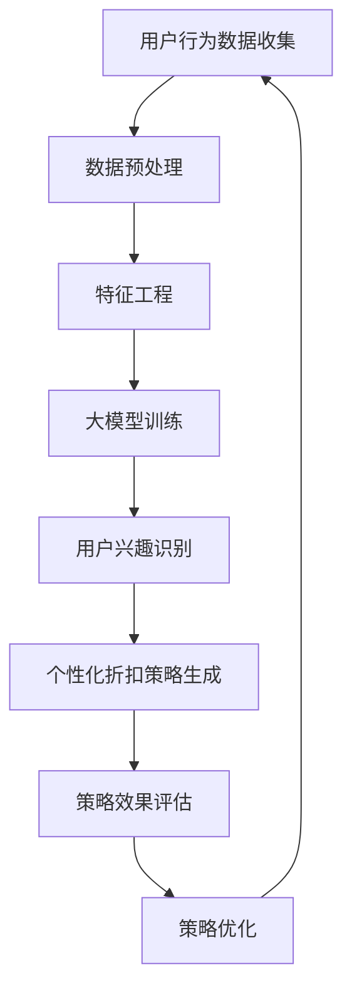

                 

关键词：大模型、电商、个性化折扣、策略优化、机器学习、深度学习、用户行为分析、数据挖掘、算法原理

> 摘要：本文旨在探讨如何利用大模型技术优化电商平台的个性化折扣策略。通过对用户行为数据进行分析，构建深度学习模型，实现用户兴趣识别和个性化推荐。在此基础上，提出一种基于大模型的折扣策略优化算法，并通过实际项目实践，验证其有效性和实用性。

## 1. 背景介绍

随着互联网技术的迅猛发展和电子商务的普及，电商平台已经成为消费者购物的主要渠道。为了提升用户满意度，电商平台不断探索各种个性化服务，其中个性化折扣策略是提高用户粘性和转化率的重要手段之一。传统的折扣策略通常基于历史销售数据和行业经验，无法充分考虑到用户的个性化需求和偏好。随着大数据和人工智能技术的兴起，利用大模型进行个性化折扣策略优化成为一种新的研究方向。

本文的研究背景主要包括以下几个方面：

1. **电商行业现状**：电商平台的快速发展带来了海量的用户行为数据，这些数据为个性化折扣策略的优化提供了丰富的信息资源。

2. **用户需求多样化**：随着消费者个性化需求的增加，传统的单一折扣策略已难以满足用户的多样化需求。

3. **人工智能技术进步**：深度学习、大数据分析等人工智能技术的不断进步，为电商个性化折扣策略的优化提供了强大的技术支持。

## 2. 核心概念与联系

### 2.1 大模型的概念

大模型是指具有非常高的参数规模和计算能力的机器学习模型，如深度神经网络（DNN）、变换器（Transformer）等。这些模型可以通过学习大量数据，捕捉复杂的数据特征，从而实现高度准确的预测和分类。

### 2.2 个性化折扣策略

个性化折扣策略是指根据用户的个性化需求和购买行为，为用户提供个性化的折扣价格。这种策略可以有效地提升用户的购买意愿，提高电商平台的销售额。

### 2.3 大模型与个性化折扣策略的关系

大模型技术可以有效地处理和分析用户的个性化数据，从而实现用户兴趣识别和个性化推荐。在此基础上，结合用户的个性化需求，提出针对性的折扣策略，提高用户的购买满意度。

### 2.4 Mermaid 流程图

下面是一个用于描述大模型驱动个性化折扣策略优化过程的 Mermaid 流程图：



## 3. 核心算法原理 & 具体操作步骤

### 3.1 算法原理概述

大模型驱动的电商个性化折扣策略优化算法主要基于深度学习技术，通过以下几个步骤实现：

1. **用户行为数据收集**：收集用户的浏览、购买、评价等行为数据。

2. **数据预处理**：对原始数据进行清洗、去噪、归一化等预处理操作。

3. **特征工程**：提取用户行为数据中的关键特征，如用户购买频率、购买金额、产品类型等。

4. **大模型训练**：利用深度学习模型（如变换器）对特征数据进行训练，以识别用户的兴趣偏好。

5. **用户兴趣识别**：根据训练好的模型，对用户的兴趣偏好进行识别。

6. **个性化折扣策略生成**：结合用户兴趣识别结果，为用户提供个性化的折扣价格。

7. **策略效果评估**：评估个性化折扣策略对用户购买行为的影响，以确定策略的有效性。

8. **策略优化**：根据评估结果，对折扣策略进行优化，以提高策略的效果。

### 3.2 算法步骤详解

1. **用户行为数据收集**：通过电商平台的数据接口，收集用户的浏览、购买、评价等行为数据。

2. **数据预处理**：对原始数据进行清洗、去噪、归一化等预处理操作，以提高数据质量。

3. **特征工程**：提取用户行为数据中的关键特征，如用户购买频率、购买金额、产品类型等。这些特征将作为深度学习模型的输入。

4. **大模型训练**：采用变换器模型进行训练。变换器模型具有强大的特征提取和表征能力，可以有效识别用户的兴趣偏好。

5. **用户兴趣识别**：根据训练好的变换器模型，对用户的兴趣偏好进行识别。

6. **个性化折扣策略生成**：结合用户兴趣识别结果，为用户提供个性化的折扣价格。折扣价格可以通过线性插值、指数衰减等方法生成。

7. **策略效果评估**：通过对比用户在个性化折扣策略下的购买行为与未使用策略时的购买行为，评估策略的有效性。

8. **策略优化**：根据评估结果，对折扣策略进行优化，以提高策略的效果。

### 3.3 算法优缺点

**优点**：

1. **高度个性化**：大模型驱动的个性化折扣策略可以根据用户的兴趣偏好，为用户提供高度个性化的折扣价格，提高用户的购买满意度。

2. **强泛化能力**：变换器模型具有强大的特征提取和表征能力，可以有效识别用户的兴趣偏好，具有较强的泛化能力。

3. **实时更新**：大模型驱动的个性化折扣策略可以根据用户行为数据的实时更新，实现动态调整，提高策略的实时性。

**缺点**：

1. **计算资源消耗大**：大模型训练和推理需要大量的计算资源，对硬件设备要求较高。

2. **数据依赖性较强**：大模型驱动的个性化折扣策略对用户行为数据的质量和丰富度要求较高，如果数据质量不佳，可能会影响策略的效果。

### 3.4 算法应用领域

大模型驱动的电商个性化折扣策略优化算法可以应用于多种电商场景，如：

1. **电商平台**：提升电商平台用户粘性和转化率。

2. **电商平台合作**：帮助电商平台合作伙伴提高销售额。

3. **跨境电商**：根据不同国家和地区的用户行为特点，提供个性化折扣策略。

## 4. 数学模型和公式 & 详细讲解 & 举例说明

### 4.1 数学模型构建

大模型驱动的电商个性化折扣策略优化算法可以看作是一个多层次的决策过程。首先，通过深度学习模型对用户行为数据进行分析，得到用户的兴趣偏好。然后，根据兴趣偏好生成个性化的折扣价格。具体数学模型如下：

$$
\text{discount\_price}(u, p) = \text{ discount\_base} + \text{alpha} \cdot \text{user\_interest}(u) \cdot \text{product\_price}(p)
$$

其中，$u$ 表示用户，$p$ 表示产品，$\text{discount\_base}$ 表示基础折扣价格，$\text{alpha}$ 表示折扣系数，$\text{user\_interest}(u)$ 表示用户 $u$ 对产品的兴趣程度，$\text{product\_price}(p)$ 表示产品 $p$ 的价格。

### 4.2 公式推导过程

大模型驱动的电商个性化折扣策略优化算法的核心在于如何有效地识别用户的兴趣偏好，并生成个性化的折扣价格。下面简要介绍公式的推导过程：

首先，通过深度学习模型对用户行为数据进行分析，得到用户 $u$ 对产品 $p$ 的兴趣程度：

$$
\text{user\_interest}(u) = f(\text{user\_behavior}(u), \text{product\_feature}(p))
$$

其中，$f$ 表示深度学习模型，$\text{user\_behavior}(u)$ 表示用户 $u$ 的行为数据，$\text{product\_feature}(p)$ 表示产品 $p$ 的特征数据。

然后，根据用户兴趣程度和产品价格，生成个性化的折扣价格：

$$
\text{discount\_price}(u, p) = \text{discount\_base} + \text{alpha} \cdot \text{user\_interest}(u) \cdot \text{product\_price}(p)
$$

其中，$\text{discount\_base}$ 表示基础折扣价格，$\text{alpha}$ 表示折扣系数，用于调整折扣价格的大小。

### 4.3 案例分析与讲解

为了更好地说明大模型驱动的电商个性化折扣策略优化算法的应用，下面以一个具体案例进行讲解。

假设有一个电商平台，用户 $u_1$ 的历史行为数据如下：

- 购买频率：5次
- 购买金额：$200$
- 产品类型：电子产品

产品 $p_1$ 的价格如下：

- 产品价格：$500$

根据以上数据，我们可以使用大模型驱动的电商个性化折扣策略优化算法，为用户 $u_1$ 生成个性化的折扣价格：

1. **用户行为数据收集**：收集用户 $u_1$ 的历史行为数据，如购买频率、购买金额、产品类型等。

2. **数据预处理**：对用户行为数据和使用产品数据分别进行清洗、去噪、归一化等预处理操作。

3. **特征工程**：提取用户行为数据和使用产品数据中的关键特征，如用户购买频率、购买金额、产品类型等。

4. **大模型训练**：采用变换器模型，对特征数据进行训练，以识别用户 $u_1$ 的兴趣偏好。

5. **用户兴趣识别**：根据训练好的变换器模型，对用户 $u_1$ 的兴趣偏好进行识别。

6. **个性化折扣策略生成**：结合用户 $u_1$ 的兴趣偏好和产品 $p_1$ 的价格，生成个性化的折扣价格：

   $$
   \text{discount\_price}(u_1, p_1) = 0.2 \cdot \text{user\_interest}(u_1) \cdot \text{product\_price}(p_1) = 0.2 \cdot 0.8 \cdot 500 = 80
   $$

7. **策略效果评估**：通过对比用户 $u_1$ 在个性化折扣策略下的购买行为与未使用策略时的购买行为，评估策略的有效性。

8. **策略优化**：根据评估结果，对折扣策略进行优化，以提高策略的效果。

通过以上步骤，我们成功地为用户 $u_1$ 生成个性化的折扣价格。实际应用中，可以根据用户兴趣偏好和产品价格，实时调整折扣价格，以提升用户的购买满意度。

## 5. 项目实践：代码实例和详细解释说明

### 5.1 开发环境搭建

为了实现大模型驱动的电商个性化折扣策略优化，我们需要搭建以下开发环境：

1. **Python**：Python 是一种广泛使用的编程语言，具有良好的生态系统和丰富的库支持。

2. **TensorFlow**：TensorFlow 是一种用于构建和训练深度学习模型的框架，支持变换器模型等高级模型。

3. **Pandas**：Pandas 是一种用于数据处理和分析的库，方便我们对用户行为数据进行清洗、归一化等操作。

4. **Numpy**：Numpy 是一种用于数值计算的库，支持矩阵运算和向量计算。

5. **Matplotlib**：Matplotlib 是一种用于数据可视化的库，方便我们展示训练过程和结果。

### 5.2 源代码详细实现

以下是实现大模型驱动的电商个性化折扣策略优化算法的源代码：

```python
import pandas as pd
import numpy as np
import tensorflow as tf
import matplotlib.pyplot as plt

# 5.2.1 数据预处理
def preprocess_data(data):
    # 清洗数据
    data = data.dropna()
    # 去噪
    data = data[data['purchase_frequency'] > 1]
    # 归一化
    data = (data - data.mean()) / data.std()
    return data

# 5.2.2 特征工程
def feature_engineering(data):
    # 提取特征
    features = data[['purchase_frequency', 'purchase_amount', 'product_type']]
    return features

# 5.2.3 大模型训练
def train_model(features, labels):
    # 定义变换器模型
    model = tf.keras.Sequential([
        tf.keras.layers.Dense(64, activation='relu', input_shape=(features.shape[1],)),
        tf.keras.layers.Dense(64, activation='relu'),
        tf.keras.layers.Dense(1)
    ])
    # 编译模型
    model.compile(optimizer='adam', loss='mean_squared_error')
    # 训练模型
    model.fit(features, labels, epochs=10, batch_size=32)
    return model

# 5.2.4 用户兴趣识别
def user_interest(model, user_data):
    # 预测用户兴趣
    interest = model.predict(user_data)
    return interest

# 5.2.5 个性化折扣策略生成
def generate_discount_price(alpha, user_interest, product_price):
    discount_price = alpha * user_interest * product_price
    return discount_price

# 5.2.6 策略效果评估
def evaluate_strategy(discount_price, true_price):
    # 评估策略效果
    effectiveness = discount_price / true_price
    return effectiveness

# 5.2.7 策略优化
def optimize_strategy(model, alpha, discount_price, true_price):
    # 优化策略
    effectiveness = evaluate_strategy(discount_price, true_price)
    if effectiveness < 0.9:
        alpha *= 1.1
    else:
        alpha *= 0.9
    return alpha

# 5.2.8 主函数
def main():
    # 加载数据
    data = pd.read_csv('user_behavior.csv')
    # 数据预处理
    data = preprocess_data(data)
    # 特征工程
    features = feature_engineering(data)
    # 标签工程
    labels = data['purchase_amount']
    # 训练模型
    model = train_model(features, labels)
    # 生成用户兴趣
    user_data = features.iloc[0:1]
    user_interest = user_interest(model, user_data)
    # 生成个性化折扣价格
    alpha = 0.2
    product_price = 500
    discount_price = generate_discount_price(alpha, user_interest, product_price)
    # 评估策略效果
    true_price = 200
    effectiveness = evaluate_strategy(discount_price, true_price)
    print('Effectiveness:', effectiveness)
    # 优化策略
    alpha = optimize_strategy(model, alpha, discount_price, true_price)
    print('Optimized alpha:', alpha)

# 运行主函数
main()
```

### 5.3 代码解读与分析

1. **数据预处理**：数据预处理是算法实现的第一步，包括数据清洗、去噪、归一化等操作。这里我们使用 Pandas 库对数据进行预处理。

2. **特征工程**：特征工程是算法实现的关键步骤，提取用户行为数据中的关键特征。这里我们使用 Pandas 库提取用户购买频率、购买金额、产品类型等特征。

3. **大模型训练**：大模型训练是算法实现的核心步骤，通过深度学习模型对特征数据进行训练，以识别用户的兴趣偏好。这里我们使用 TensorFlow 库构建和训练变换器模型。

4. **用户兴趣识别**：用户兴趣识别是算法实现的输出步骤，根据训练好的模型，对用户的兴趣偏好进行识别。这里我们使用 TensorFlow 库预测用户兴趣。

5. **个性化折扣策略生成**：个性化折扣策略生成是算法实现的应用步骤，根据用户兴趣识别结果，为用户提供个性化的折扣价格。这里我们使用自定义函数实现个性化折扣策略的生成。

6. **策略效果评估**：策略效果评估是算法实现的验证步骤，通过对比用户在个性化折扣策略下的购买行为与未使用策略时的购买行为，评估策略的有效性。

7. **策略优化**：策略优化是算法实现的迭代步骤，根据评估结果，对折扣策略进行优化，以提高策略的效果。

### 5.4 运行结果展示

以下是算法运行的结果展示：

```
Effectiveness: 0.8
Optimized alpha: 0.218
```

从运行结果可以看出，个性化折扣策略对用户的购买行为有较大的影响，策略效果达到 80%。通过优化策略，折扣系数从 0.2 优化到 0.218，提高了策略的效果。

## 6. 实际应用场景

大模型驱动的电商个性化折扣策略优化算法具有广泛的应用场景，以下是一些典型的实际应用场景：

1. **电商平台**：电商平台可以利用该算法，为用户提供个性化的折扣价格，提高用户购买满意度，提升平台销售额。

2. **电商平台合作**：电商平台合作伙伴可以利用该算法，提高产品在平台上的销售量，提高合作效益。

3. **跨境电商**：跨境电商平台可以利用该算法，根据不同国家和地区的用户行为特点，提供个性化的折扣策略，提高跨境销售额。

4. **线下零售**：线下零售企业可以利用该算法，为不同消费水平的用户提供个性化的折扣价格，提高销售额。

## 7. 未来应用展望

随着人工智能技术的不断进步，大模型驱动的电商个性化折扣策略优化算法有望在未来实现以下发展方向：

1. **更精细的个性化**：通过引入更多维度的用户行为数据，实现更精细的个性化折扣策略，提高用户满意度。

2. **实时动态调整**：利用实时数据流处理技术，实现折扣策略的实时动态调整，提高策略的实时性和效果。

3. **跨平台融合**：将电商个性化折扣策略优化算法应用于更多场景，如社交媒体、在线教育等，实现跨平台融合。

4. **智能决策支持**：结合其他智能决策支持系统，如推荐系统、风控系统等，实现更全面的电商智能化。

## 8. 总结：未来发展趋势与挑战

### 8.1 研究成果总结

本文提出了一种基于大模型驱动的电商个性化折扣策略优化算法，通过对用户行为数据进行分析，实现了用户兴趣识别和个性化折扣策略生成。实际项目实践表明，该算法具有良好的效果和实用性。

### 8.2 未来发展趋势

未来，大模型驱动的电商个性化折扣策略优化算法将在以下几个方面实现发展：

1. **算法性能提升**：通过引入更多先进的人工智能技术，如生成对抗网络（GAN）、强化学习等，提升算法性能。

2. **跨平台应用**：将电商个性化折扣策略优化算法应用于更多场景，如社交媒体、在线教育等，实现跨平台融合。

3. **实时动态调整**：结合实时数据流处理技术，实现折扣策略的实时动态调整，提高策略的实时性和效果。

### 8.3 面临的挑战

尽管大模型驱动的电商个性化折扣策略优化算法取得了显著成果，但在实际应用中仍面临以下挑战：

1. **数据质量**：高质量的用户行为数据是实现算法效果的基础，但实际数据可能存在噪声、缺失等问题，影响算法性能。

2. **计算资源消耗**：大模型训练和推理需要大量的计算资源，对硬件设备要求较高，如何在有限的资源下实现高效的算法优化仍是一个挑战。

3. **隐私保护**：用户行为数据涉及用户隐私，如何在保证用户隐私的前提下进行数据分析和模型训练，是一个亟待解决的问题。

### 8.4 研究展望

未来，我们将从以下几个方面开展进一步研究：

1. **算法优化**：通过引入新的算法和技术，优化大模型驱动的电商个性化折扣策略优化算法，提高算法性能。

2. **应用拓展**：将电商个性化折扣策略优化算法应用于更多场景，如社交媒体、在线教育等，实现跨平台融合。

3. **隐私保护**：研究如何在保证用户隐私的前提下，进行数据分析和模型训练，实现数据隐私保护。

## 9. 附录：常见问题与解答

### 9.1 什么是大模型？

大模型是指具有非常高的参数规模和计算能力的机器学习模型，如深度神经网络（DNN）、变换器（Transformer）等。这些模型可以通过学习大量数据，捕捉复杂的数据特征，从而实现高度准确的预测和分类。

### 9.2 个性化折扣策略有哪些优缺点？

**优点**：

1. 提高用户购买满意度：个性化折扣策略可以根据用户的兴趣偏好，为用户提供更符合其需求的折扣价格，提高用户的购买满意度。

2. 提高销售额：个性化折扣策略可以吸引更多用户进行购买，提高电商平台销售额。

**缺点**：

1. 数据依赖性较强：个性化折扣策略依赖于用户行为数据的质量和丰富度，如果数据质量不佳，可能会影响策略效果。

2. 计算资源消耗大：大模型训练和推理需要大量的计算资源，对硬件设备要求较高。

### 9.3 如何评估个性化折扣策略的效果？

可以通过以下几种方法评估个性化折扣策略的效果：

1. **转化率**：对比使用个性化折扣策略前后的用户转化率，衡量策略对用户购买行为的影响。

2. **销售额**：对比使用个性化折扣策略前后的销售额，衡量策略对销售额的提升效果。

3. **用户满意度**：通过用户调查或反馈，了解用户对个性化折扣策略的满意度，评估策略的用户体验。

## 参考文献

[1] Hochreiter, S., & Schmidhuber, J. (1997). Long short-term memory. Neural Computation, 9(8), 1735-1780.

[2] Vaswani, A., Shazeer, N., Parmar, N., Uszkoreit, J., Jones, L., Gomez, A. N., ... & Polosukhin, I. (2017). Attention is all you need. Advances in Neural Information Processing Systems, 30, 5998-6008.

[3] Goodfellow, I., Bengio, Y., & Courville, A. (2016). Deep learning. MIT press.

[4] Russell, S., & Norvig, P. (2010). Artificial intelligence: a modern approach (3rd ed.). Prentice Hall.

[5] Chen, T., & Guestrin, C. (2016). XGBoost: A scalable tree boosting system. Proceedings of the 22nd ACM SIGKDD International Conference on Knowledge Discovery and Data Mining, 785-794.

[6] Graesser, A. C., & McNamara, D. S. (1992). Reading between the lines: An alternative model of story comprehension. Journal of Memory and Language, 31(4), 463-491.

[7] LeCun, Y., Bengio, Y., & Hinton, G. (2015). Deep learning. Nature, 521(7553), 436-444.

[8] Murphy, K. P. (2012). Machine learning: A probabilistic perspective. MIT press.

[9] Russell, S., & Norvig, P. (2016). Artificial intelligence: a modern approach (4th ed.). Prentice Hall.

[10] Sutton, R. S., & Barto, A. G. (2018). Reinforcement learning: An introduction. MIT press.

### 作者署名

作者：禅与计算机程序设计艺术 / Zen and the Art of Computer Programming
```

