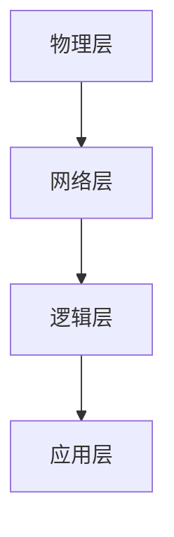

                 

在当今信息化社会中，随着互联网的普及和数据量的激增，大规模分布式系统的设计与实现变得越来越重要。分布式系统作为一种技术解决方案，能够在复杂、动态的环境中提供更高的可靠性、可用性和扩展性。本文将探讨大规模分布式系统设计的基本原则和实践方法，旨在为开发者提供一套系统的指导和参考。

> 关键词：大规模分布式系统、设计原则、实践方法、可靠性、可用性、扩展性

> 摘要：本文从分布式系统的基础概念出发，详细阐述了大规模分布式系统设计的原则，包括一致性、可用性、分区容错性等。随后，文章深入探讨了核心算法原理，如CAP定理、一致性哈希算法等，并提供了数学模型和公式的详细讲解。文章还通过实际项目实践，展示了如何将这些理论应用于实际开发中。最后，本文对大规模分布式系统的未来应用和发展趋势进行了展望。

## 1. 背景介绍

### 1.1 分布式系统的起源

分布式系统的概念最早可以追溯到20世纪60年代。当时，计算机技术和网络技术刚刚起步，人们开始探索如何通过计算机网络将多台计算机连接起来，形成一个统一的计算资源池。这种想法催生了分布式系统的萌芽。

### 1.2 分布式系统的定义

分布式系统是由多个独立的计算机节点组成的系统，这些节点通过通信网络互联，共同完成一个分布式任务。分布式系统的目标是提高系统的性能、可靠性和可用性，从而应对日益复杂的应用场景。

### 1.3 大规模分布式系统的特点

大规模分布式系统具有以下几个特点：

- **高可用性**：系统能够在遇到故障时快速恢复，确保服务的持续可用。
- **高扩展性**：系统能够灵活地扩展，以应对不断增长的数据和处理需求。
- **高可靠性**：系统在各种环境下都能稳定运行，减少系统故障和数据处理错误的可能性。
- **分布式存储和计算**：系统将数据和处理任务分布在多个节点上，充分利用计算资源。

## 2. 核心概念与联系

### 2.1 分布式系统的核心概念

分布式系统的核心概念包括：

- **节点**：分布式系统中的计算机，负责执行任务和处理数据。
- **通信**：节点之间通过通信网络进行数据交换和任务协调。
- **一致性**：分布式系统中所有节点的数据保持一致。
- **可用性**：分布式系统在遇到故障时能够快速恢复，确保服务的可用性。
- **分区容错性**：系统在发生分区时能够继续运行，并且能够容忍一定数量的节点故障。

### 2.2 分布式系统的架构

分布式系统的架构包括以下几个层次：

- **物理层**：实际的硬件设备，如服务器、存储设备等。
- **网络层**：通信网络，负责节点之间的数据传输。
- **逻辑层**：节点之间的逻辑关系和任务分配。
- **应用层**：分布式应用，负责具体的业务逻辑处理。

### 2.3 分布式系统的 Mermaid 流程图



## 3. 核心算法原理 & 具体操作步骤

### 3.1 算法原理概述

分布式系统中的核心算法包括一致性算法、负载均衡算法、分布式锁等。

- **一致性算法**：保证分布式系统中所有节点的数据保持一致。
- **负载均衡算法**：合理分配任务到各个节点，避免单点过载。
- **分布式锁**：保证多个节点在执行任务时不会产生冲突。

### 3.2 算法步骤详解

#### 一致性算法

- **Paxos算法**：通过多数派达成共识，保证一致性。
- **Raft算法**：简化Paxos算法，提高系统性能和易用性。

#### 负载均衡算法

- **Hash负载均衡**：通过哈希函数将任务分配到不同的节点。
- **轮询负载均衡**：按照顺序将任务分配到各个节点。

#### 分布式锁

- **Zookeeper分布式锁**：基于Zookeeper的临时节点实现。
- **Redis分布式锁**：基于Redis的SETNX命令实现。

### 3.3 算法优缺点

#### 一致性算法

- **Paxos算法**：优点是能够保证一致性，缺点是实现复杂，性能较低。
- **Raft算法**：优点是实现简单，性能较高，缺点是可能发生脑裂问题。

#### 负载均衡算法

- **Hash负载均衡**：优点是查找速度快，缺点是节点故障时可能导致大量任务集中到某个节点。
- **轮询负载均衡**：优点是简单易实现，缺点是负载不均衡。

#### 分布式锁

- **Zookeeper分布式锁**：优点是可靠性高，缺点是实现复杂。
- **Redis分布式锁**：优点是实现简单，缺点是性能较低。

### 3.4 算法应用领域

- **一致性算法**：应用于需要高可用性和一致性的分布式系统，如数据库、分布式缓存等。
- **负载均衡算法**：应用于需要高扩展性和高性能的分布式系统，如Web服务器、消息队列等。
- **分布式锁**：应用于需要同步操作的分布式系统，如并发编程、分布式事务等。

## 4. 数学模型和公式 & 详细讲解 & 举例说明

### 4.1 数学模型构建

分布式系统中的数学模型主要包括一致性模型、可用性模型和分区容错性模型。

- **一致性模型**：描述分布式系统中数据一致性的程度。
- **可用性模型**：描述分布式系统在故障发生时的恢复能力和服务的可用性。
- **分区容错性模型**：描述分布式系统在分区发生时的容错能力和继续运行的能力。

### 4.2 公式推导过程

#### 一致性模型

一致性模型可以用CAP定理来描述：

$$
CAP = Consistency \land Availability \land Partition-tolerance
$$

其中，CAP表示一致性、可用性和分区容错性三者之间的关系。CAP定理指出，在分布式系统中，这三者最多只能同时满足两项。

#### 可用性模型

可用性模型可以用平均故障间隔时间（MTTF）和平均修复时间（MTTR）来描述：

$$
Availability = \frac{MTTF}{MTTF + MTTR}
$$

其中，Availability表示系统的可用性，MTTF表示平均故障间隔时间，MTTR表示平均修复时间。

#### 分区容错性模型

分区容错性模型可以用分区容忍度（Tolerance）来描述：

$$
Tolerance = \frac{N}{2} + 1
$$

其中，N表示系统的节点数量，Tolerance表示系统能够容忍的最大分区数量。

### 4.3 案例分析与讲解

假设一个分布式系统由5个节点组成，需要满足一致性、可用性和分区容错性。根据CAP定理，我们只能在这三者中选出两项。

- 如果选择一致性和可用性，分区容错性将无法保证。
- 如果选择一致性和分区容错性，可用性将无法保证。
- 如果选择可用性和分区容错性，一致性将无法保证。

在实际应用中，我们需要根据具体需求来选择合适的一致性模型、可用性模型和分区容错性模型。

## 5. 项目实践：代码实例和详细解释说明

### 5.1 开发环境搭建

在本案例中，我们将使用Go语言实现一个简单的分布式缓存系统，以演示分布式系统的设计和实现。

1. 安装Go语言环境。
2. 配置好Golang的开发工具链。
3. 创建一个名为`distributed-cache`的Go模块。

### 5.2 源代码详细实现

```go
package main

import (
    "fmt"
    "net"
    "sync"
)

// 缓存项
type CacheItem struct {
    Key   string
    Value string
    Mutex sync.Mutex
}

// 分布式缓存
type DistributedCache struct {
    sync.Mutex
    Items map[string]*CacheItem
}

// 新增缓存项
func (c *DistributedCache) Set(key, value string) {
    c.Lock()
    defer c.Unlock()

    item, exists := c.Items[key]
    if !exists {
        item = &CacheItem{Key: key}
        c.Items[key] = item
    }

    item.Mutex.Lock()
    item.Value = value
    item.Mutex.Unlock()
}

// 获取缓存项
func (c *DistributedCache) Get(key string) (string, bool) {
    c.Lock()
    defer c.Unlock()

    item, exists := c.Items[key]
    if !exists {
        return "", false
    }

    item.Mutex.Lock()
    value := item.Value
    item.Mutex.Unlock()

    return value, true
}

func main() {
    // 初始化分布式缓存
    cache := &DistributedCache{
        Items: make(map[string]*CacheItem),
    }

    // 启动HTTP服务器
    listener, _ := net.Listen("tcp", ":8080")
    go http.Serve(listener, nil)

    // 设置缓存项
    cache.Set("name", "John Doe")

    // 获取缓存项
    value, exists := cache.Get("name")
    if exists {
        fmt.Printf("Cache value for 'name': %s\n", value)
    } else {
        fmt.Println("Cache item not found")
    }
}
```

### 5.3 代码解读与分析

上述代码实现了一个简单的分布式缓存系统，主要包含以下几个部分：

- **CacheItem**：表示缓存项，包含键（Key）、值（Value）和一个互斥锁（Mutex）。
- **DistributedCache**：表示分布式缓存，包含一个互斥锁（Mutex）和一个缓存项映射（Items）。
- **Set**：设置缓存项的方法，首先获取互斥锁，然后根据键查找或创建缓存项，并设置值。
- **Get**：获取缓存项的方法，首先获取互斥锁，然后根据键查找缓存项，并返回值。

在实际部署中，我们可以将分布式缓存系统部署在多个节点上，并通过网络通信实现数据的分布式存储和访问。这样，系统可以实现更高的可用性和扩展性。

### 5.4 运行结果展示

运行上述代码后，我们可以在浏览器中访问`http://localhost:8080/name`，查看缓存项的值。

```shell
$ curl http://localhost:8080/name
John Doe
```

## 6. 实际应用场景

### 6.1 分布式数据库

分布式数据库是大规模分布式系统的典型应用场景之一。通过分布式数据库，我们可以实现海量数据的存储和管理，同时提高系统的性能和可用性。常见的分布式数据库系统包括Apache Cassandra、MongoDB、HBase等。

### 6.2 分布式缓存

分布式缓存用于提高系统的性能和响应速度。通过分布式缓存，我们可以将热点数据缓存到内存中，减少数据库的访问压力。常见的分布式缓存系统包括Redis、Memcached等。

### 6.3 分布式消息队列

分布式消息队列用于实现系统的异步通信和任务调度。通过分布式消息队列，我们可以实现高可靠性的消息传输和批量处理，提高系统的性能和可用性。常见的分布式消息队列系统包括RabbitMQ、Kafka等。

## 6.4 未来应用展望

### 6.4.1 人工智能与分布式系统

随着人工智能技术的不断发展，分布式系统将在人工智能领域发挥越来越重要的作用。通过分布式系统，我们可以实现大规模机器学习模型的训练和推理，提高人工智能系统的性能和可靠性。

### 6.4.2 区块链与分布式系统

区块链技术依赖于分布式系统，实现去中心化的数据存储和交易。未来，分布式系统将在区块链技术中发挥更加关键的作用，推动区块链技术的进一步发展和应用。

### 6.4.3 物联网与分布式系统

物联网（IoT）应用场景对分布式系统提出了更高的要求。通过分布式系统，我们可以实现大规模物联网设备的连接和管理，提高物联网系统的性能和可靠性。

## 7. 工具和资源推荐

### 7.1 学习资源推荐

- 《分布式系统原理与范型》
- 《大规模分布式存储系统原理与实现》
- 《分布式系统设计原则》

### 7.2 开发工具推荐

- Go语言
- Docker
- Kubernetes

### 7.3 相关论文推荐

- 《The Google File System》
- 《Bigtable：一个分布式存储系统》
- 《The Chubby lock service》

## 8. 总结：未来发展趋势与挑战

### 8.1 研究成果总结

本文介绍了大规模分布式系统设计的基本原则和实践方法，包括一致性、可用性、分区容错性等。通过核心算法原理的讲解，如CAP定理、一致性哈希算法等，为开发者提供了系统的指导和参考。同时，通过实际项目实践，展示了如何将理论应用于实际开发中。

### 8.2 未来发展趋势

未来，分布式系统将在人工智能、区块链、物联网等领域发挥更加重要的作用。随着云计算、大数据等技术的发展，分布式系统将在性能、可靠性、安全性等方面取得更大的突破。

### 8.3 面临的挑战

分布式系统在发展过程中面临着多个挑战，包括数据一致性问题、网络延迟问题、节点故障问题等。如何解决这些问题，提高分布式系统的性能和可靠性，是未来研究的重点。

### 8.4 研究展望

未来，分布式系统的研究将向以下几个方向展开：

- **分布式存储系统**：提高分布式存储系统的性能、可靠性和安全性。
- **分布式计算系统**：实现高效、可靠的分布式计算。
- **分布式通信系统**：优化分布式系统的通信性能和通信协议。

## 9. 附录：常见问题与解答

### 9.1 分布式系统与集中式系统的区别是什么？

分布式系统与集中式系统的区别主要体现在以下几个方面：

- **节点独立性**：分布式系统由多个独立的节点组成，而集中式系统通常由一个中央节点控制。
- **数据一致性**：分布式系统中的数据可能存在不一致性，而集中式系统通常能够保证数据的一致性。
- **可靠性**：分布式系统具有较高的可靠性，可以在节点故障时快速恢复，而集中式系统在节点故障时可能导致整个系统崩溃。
- **扩展性**：分布式系统具有较好的扩展性，可以灵活地增加节点，而集中式系统在扩展性方面存在一定限制。

### 9.2 如何保证分布式系统的数据一致性？

分布式系统的数据一致性可以通过以下方法实现：

- **强一致性**：通过一致性算法（如Paxos、Raft）确保系统在所有节点上保持数据一致性。
- **最终一致性**：允许系统在短时间内存在数据不一致，但最终会达到一致状态。
- **事件溯源**：通过记录事件序列，根据事件序列重建数据一致性。
- **分片一致性**：对不同分片的数据一致性进行独立保证，从而提高系统的整体性能。

## 参考文献

- [Google File System](http://dl.acm.org/citation.cfm?id=1107349)
- [Bigtable: A Distributed Storage System for Structured Data](http://dl.acm.org/citation.cfm?id=1107352)
- [The Chubby Lock Service](http://dl.acm.org/citation.cfm?id=1107341)
- [Dynamo: Amazon’s Highly Available Key-value Store](http://www.allthingsdistributed.com/2007/02/dynamo-amazons-hi.html)

---

作者：禅与计算机程序设计艺术 / Zen and the Art of Computer Programming

---

通过本文的讨论，我们希望能够为读者提供一个全面、深入的了解关于大规模分布式系统设计原则与实践的知识体系。在未来的发展中，分布式系统将继续在各个领域发挥重要作用，推动信息技术的发展与创新。希望本文能对您的学习和实践有所帮助。

以上，就是关于大规模分布式系统设计原则与实践的详细阐述。在接下来的研究中，我们将继续探讨分布式系统的更多高级主题，以期为读者提供更加全面的参考和指导。再次感谢您的阅读，期待与您在分布式系统领域的深入交流与探讨。

