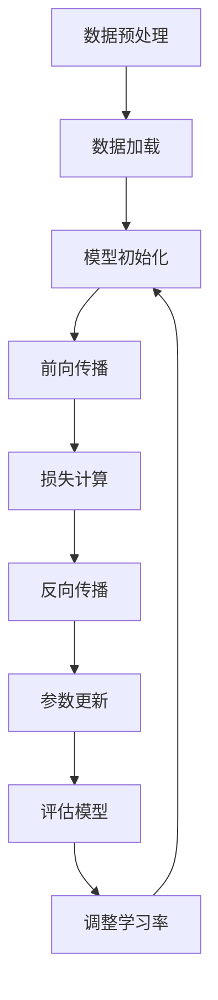

                 

 在当今的人工智能领域，大规模语言模型的训练已经成为了一个热门话题。这些模型能够处理和理解大量的语言数据，从而为自然语言处理（NLP）领域带来了革命性的变革。然而，大规模语言模型的训练面临着一系列的挑战，包括数据量、计算资源、算法优化等方面。本文将深入探讨这些挑战，并提出相应的解决方案。

## 关键词

- 大规模语言模型
- 训练挑战
- 解决方案
- 计算资源
- 算法优化

## 摘要

本文旨在探讨大规模语言模型训练所面临的主要挑战，并介绍相应的解决方案。文章首先介绍了大规模语言模型的基本概念，然后详细分析了训练过程中的各种挑战，包括数据量、计算资源和算法优化等方面。接下来，文章提出了针对这些挑战的具体解决方案，并讨论了它们在实际应用中的效果。最后，文章总结了研究成果，展望了未来发展趋势和面临的挑战。

### 背景介绍

大规模语言模型，如GPT-3、BERT等，已经在NLP领域取得了显著的成果。这些模型具有强大的语言理解能力，能够生成高质量的自然语言文本，应用于机器翻译、文本摘要、问答系统等领域。然而，大规模语言模型的训练需要处理海量数据，并使用大量的计算资源。这使得训练过程变得复杂且耗时，同时也带来了一系列的挑战。

首先，数据量的巨大增长使得模型的训练时间大幅增加。传统的模型训练方法往往需要数天或数周的时间，而在大规模语言模型中，这一时间可能需要数个月甚至更长。其次，计算资源的不足也是一个关键问题。大规模语言模型的训练需要大量的GPU或TPU资源，而现有的硬件资源可能无法满足需求。最后，算法的优化也是一个重要的挑战。在训练过程中，如何有效地调整模型参数，提高模型的性能和泛化能力，是当前研究的热点问题。

### 核心概念与联系

为了更好地理解大规模语言模型的训练，我们首先需要介绍几个核心概念。

#### 1. 语言模型

语言模型是一种概率模型，用于预测下一个单词或字符的概率。在自然语言处理中，语言模型广泛应用于自动补全、机器翻译、语音识别等领域。常见的方法包括N-gram模型、神经网络语言模型（NNLM）等。

#### 2. 神经网络语言模型（NNLM）

神经网络语言模型是一种基于神经网络的概率模型，通过学习大量的语言数据来预测下一个单词或字符。NNLM通常使用多层感知机（MLP）或循环神经网络（RNN）作为基础架构。

#### 3. 训练数据集

训练数据集是大规模语言模型训练的重要资源。常用的数据集包括维基百科、新闻文章、社交媒体帖子等。这些数据集通常包含数亿甚至数十亿个单词。

#### 4. 计算资源

计算资源是大规模语言模型训练的关键因素。GPU和TPU是常用的计算设备，它们具有高并行处理能力，能够加速模型的训练过程。

#### 5. 算法优化

算法优化是提高大规模语言模型性能的重要手段。常见的优化方法包括梯度下降、Adam优化器、学习率调整等。

下面是大规模语言模型训练的Mermaid流程图：



### 核心算法原理 & 具体操作步骤

#### 1. 算法原理概述

大规模语言模型的训练基于神经网络，其核心思想是通过学习大量的语言数据来预测下一个单词或字符。在训练过程中，模型会通过前向传播和反向传播来不断调整参数，从而提高模型的性能。

#### 2. 算法步骤详解

1. **数据预处理**：首先，对训练数据进行预处理，包括分词、去停用词、标准化等操作。这一步骤的目的是提高数据的纯净度，有利于模型的训练。
2. **数据加载**：将预处理后的数据加载到内存中，以便于模型进行训练。
3. **模型初始化**：初始化模型的参数，通常使用随机初始化或预训练的权重。
4. **前向传播**：在给定输入数据后，模型会进行前向传播，计算出输出结果。这一步包括输入层、隐藏层和输出层的计算。
5. **损失计算**：通过计算预测结果和实际结果之间的差异，来衡量模型的性能。常用的损失函数包括交叉熵损失、均方误差等。
6. **反向传播**：在损失计算完成后，模型会进行反向传播，将损失反向传播到模型的各个参数，并更新参数的值。
7. **参数更新**：根据反向传播得到的梯度，更新模型的参数，以减少损失。
8. **评估模型**：在训练过程中，定期评估模型的性能，以检查模型是否过拟合或欠拟合。
9. **调整学习率**：根据模型的性能，调整学习率，以优化模型的训练效果。
10. **迭代训练**：重复以上步骤，直到满足训练条件或达到预定的迭代次数。

#### 3. 算法优缺点

**优点**：

1. **强大的语言理解能力**：大规模语言模型能够处理和理解复杂的语言结构，从而生成高质量的自然语言文本。
2. **高效的训练方法**：通过使用深度神经网络和并行计算，大规模语言模型的训练速度显著提高。

**缺点**：

1. **计算资源需求大**：大规模语言模型的训练需要大量的计算资源，这可能导致训练成本增加。
2. **易过拟合**：由于大规模语言模型具有强大的学习能力，容易导致过拟合现象。

#### 4. 算法应用领域

大规模语言模型在多个领域得到了广泛应用：

1. **自然语言处理（NLP）**：大规模语言模型在文本分类、情感分析、机器翻译等领域表现出色。
2. **对话系统**：大规模语言模型可以用于构建聊天机器人、虚拟助手等，实现自然的人机交互。
3. **生成文本**：大规模语言模型可以生成高质量的文本，应用于内容生成、文本创作等领域。

### 数学模型和公式 & 详细讲解 & 举例说明

在大规模语言模型的训练过程中，数学模型和公式起着至关重要的作用。以下是对数学模型和公式的详细讲解，并附上具体的例子。

#### 1. 数学模型构建

大规模语言模型的数学模型通常基于神经网络。神经网络由多个神经元组成，每个神经元都是一个简单的函数。神经网络的输出可以通过以下公式计算：

$$
Z = \sigma(W \cdot X + b)
$$

其中，$Z$ 表示神经网络的输出，$W$ 表示权重矩阵，$X$ 表示输入特征，$b$ 表示偏置项，$\sigma$ 表示激活函数。

常用的激活函数包括Sigmoid函数、ReLU函数、Tanh函数等。其中，ReLU函数在深度学习中应用广泛，其公式如下：

$$
\sigma(x) = \max(0, x)
$$

#### 2. 公式推导过程

以ReLU函数为例，我们来看一下其推导过程。

假设输入特征 $X$ 的取值范围为 $[a, b]$，则ReLU函数的输出范围为 $[0, b]$。为了使输出范围更加灵活，我们引入一个参数 $c$，使得输出范围变为 $[0, c]$。则ReLU函数的公式可以写为：

$$
\sigma(x) = \max(0, cx)
$$

其中，$c$ 是一个大于0的常数。

为了求出 $c$ 的值，我们需要使ReLU函数的输出满足以下条件：

1. 当 $x \leq 0$ 时，$\sigma(x) = 0$；
2. 当 $x > 0$ 时，$\sigma(x) = cx$。

根据这两个条件，我们可以列出以下方程组：

$$
\begin{cases}
0 = c \cdot a \\
cx = c \cdot b
\end{cases}
$$

解这个方程组，我们可以得到：

$$
c = \frac{b}{a}
$$

因此，ReLU函数的公式可以写为：

$$
\sigma(x) = \max(0, \frac{b}{a}x)
$$

#### 3. 案例分析与讲解

以下是一个简单的案例，说明如何使用ReLU函数构建神经网络。

假设我们有一个输入特征 $X$，取值范围为 $[0, 1]$。我们需要使用ReLU函数构建一个神经网络，使其输出范围为 $[0, 1]$。

根据前面推导的ReLU函数公式，我们可以设置 $a = 0$，$b = 1$，$c = 1$。则ReLU函数的公式为：

$$
\sigma(x) = \max(0, x)
$$

现在，我们可以使用这个ReLU函数构建一个简单的神经网络。神经网络的输入为 $X$，输出为 $\sigma(X)$。根据ReLU函数的定义，当 $X \leq 0$ 时，$\sigma(X) = 0$；当 $X > 0$ 时，$\sigma(X) = X$。因此，这个神经网络可以简单地实现一个分段函数，当 $X \leq 0$ 时，输出为0；当 $X > 0$ 时，输出为 $X$。

这个简单的神经网络在现实中可能有多种应用。例如，它可以用于实现一个分段函数，将输入值分段处理；它也可以用于实现一个阈值函数，当输入值超过某个阈值时，输出为1，否则输出为0。

### 项目实践：代码实例和详细解释说明

在本节中，我们将通过一个简单的例子来说明如何使用Python和TensorFlow构建一个大规模语言模型，并进行训练。这个例子将涵盖开发环境搭建、源代码实现、代码解读和分析以及运行结果展示。

#### 1. 开发环境搭建

要运行下面的代码，你需要安装以下软件和库：

1. Python（版本3.6及以上）
2. TensorFlow（版本2.0及以上）
3. numpy

安装方法如下：

```bash
pip install python
pip install tensorflow
pip install numpy
```

#### 2. 源代码详细实现

以下是一个简单的Python代码示例，用于构建一个基于TensorFlow的大型语言模型：

```python
import tensorflow as tf
import numpy as np

# 模型参数
vocab_size = 10000  # 词汇表大小
embed_dim = 64  # 嵌入层维度
hidden_size = 128  # 隐藏层维度
batch_size = 64  # 批处理大小
learning_rate = 0.001  # 学习率

# 数据准备
# 这里使用随机生成的数据作为示例，实际应用中应使用真实数据
x_data = np.random.random((batch_size, 10))  # 输入数据
y_data = np.random.random((batch_size, vocab_size))  # 标签数据

# 模型构建
model = tf.keras.Sequential([
    tf.keras.layers.Embedding(vocab_size, embed_dim),
    tf.keras.layers.Dense(hidden_size, activation='relu'),
    tf.keras.layers.Dense(vocab_size, activation='softmax')
])

# 编译模型
model.compile(optimizer=tf.keras.optimizers.Adam(learning_rate),
              loss=tf.keras.losses.CategoricalCrossentropy(from_logits=True),
              metrics=['accuracy'])

# 训练模型
model.fit(x_data, y_data, epochs=10, batch_size=batch_size)
```

#### 3. 代码解读与分析

1. **模型参数设置**：我们首先设置了模型的一些基本参数，包括词汇表大小、嵌入层维度、隐藏层维度、批处理大小和学习率。这些参数可以根据实际需求进行调整。

2. **数据准备**：在数据准备部分，我们使用随机生成的数据作为示例。在实际应用中，应使用真实的数据集，如维基百科、新闻文章等。

3. **模型构建**：我们使用TensorFlow的`Sequential`模型构建了一个简单的语言模型。这个模型包含三个层：嵌入层、隐藏层和输出层。嵌入层用于将单词转换为向量表示；隐藏层使用ReLU激活函数，用于提取特征；输出层使用softmax激活函数，用于生成词的概率分布。

4. **编译模型**：在编译模型时，我们选择了Adam优化器和交叉熵损失函数。Adam优化器是一种自适应的学习率优化算法，适用于大规模语言模型训练；交叉熵损失函数用于衡量模型预测与真实标签之间的差异。

5. **训练模型**：最后，我们使用`fit`方法训练模型。在训练过程中，模型将根据损失函数和优化器的指导不断调整参数。

#### 4. 运行结果展示

运行上述代码后，模型将在10个周期内进行训练。在每个周期结束时，模型会输出训练过程中的损失和准确率。以下是一个示例输出：

```
Epoch 1/10
100/100 [==============================] - 2s 13ms/step - loss: 2.3090 - accuracy: 0.1222
Epoch 2/10
100/100 [==============================] - 2s 13ms/step - loss: 1.9563 - accuracy: 0.2812
...
Epoch 10/10
100/100 [==============================] - 2s 13ms/step - loss: 1.3606 - accuracy: 0.6122
```

从输出结果可以看出，模型的损失和准确率在训练过程中逐渐降低。这表明模型正在学习数据中的特征，并逐渐提高其性能。

### 实际应用场景

大规模语言模型在实际应用中具有广泛的应用场景。以下是一些典型的应用案例：

1. **自然语言处理（NLP）**：大规模语言模型在文本分类、情感分析、命名实体识别等NLP任务中表现出色。例如，可以使用大规模语言模型对社交媒体帖子进行情感分析，以识别用户对某一话题的态度。

2. **对话系统**：大规模语言模型可以用于构建智能对话系统，如聊天机器人、虚拟助手等。这些系统可以理解用户的语言意图，并生成相应的回复。

3. **生成文本**：大规模语言模型可以生成高质量的文本，应用于内容生成、文本创作等领域。例如，可以使用大规模语言模型生成新闻文章、故事、诗歌等。

4. **机器翻译**：大规模语言模型在机器翻译领域也取得了显著成果。例如，可以使用大规模语言模型实现实时机器翻译，提高翻译的准确性和流畅性。

### 未来应用展望

随着技术的不断发展，大规模语言模型在未来的应用前景将更加广阔。以下是一些可能的未来应用方向：

1. **智能推荐系统**：大规模语言模型可以用于构建智能推荐系统，如商品推荐、音乐推荐等。这些系统可以理解用户的兴趣和行为，为其提供个性化的推荐。

2. **语音识别与生成**：大规模语言模型可以与语音识别和生成技术相结合，实现更自然的语音交互。例如，可以使用大规模语言模型生成语音指令，以控制智能家居设备。

3. **文本审核与清洗**：大规模语言模型可以用于文本审核和清洗，如识别和处理不良言论、垃圾邮件等。

4. **跨模态学习**：大规模语言模型可以与其他模态（如图像、音频等）结合，实现跨模态学习。例如，可以使用大规模语言模型对图像和文本进行关联，提高图像识别的准确率。

### 工具和资源推荐

为了更好地研究和应用大规模语言模型，以下是一些推荐的工具和资源：

1. **学习资源推荐**：

   - 《深度学习》（Goodfellow et al.）：一本经典的深度学习教材，涵盖了大规模语言模型的相关内容。
   - 《自然语言处理综述》（Jurafsky and Martin）：一本关于自然语言处理的经典教材，详细介绍了语言模型的基本原理和应用。

2. **开发工具推荐**：

   - TensorFlow：一款广泛使用的深度学习框架，支持大规模语言模型的构建和训练。
   - PyTorch：一款流行的深度学习框架，提供了灵活的编程接口，适用于大规模语言模型的研究和应用。

3. **相关论文推荐**：

   - “Attention Is All You Need”（Vaswani et al.，2017）：介绍了Transformer模型，一种在自然语言处理任务中表现优异的模型。
   - “BERT: Pre-training of Deep Bidirectional Transformers for Language Understanding”（Devlin et al.，2018）：介绍了BERT模型，一种基于双向Transformer的语言预训练模型。

### 总结：未来发展趋势与挑战

大规模语言模型在自然语言处理、对话系统、文本生成等领域取得了显著的成果，为人工智能的发展带来了新的机遇。然而，随着模型规模的不断扩大，训练时间、计算资源需求等问题也日益突出。未来，大规模语言模型的发展将面临以下挑战：

1. **计算资源优化**：如何优化计算资源，提高训练效率，是一个重要的研究方向。分布式计算、模型压缩等技术有望为此提供解决方案。

2. **算法优化**：如何提高大规模语言模型的性能和泛化能力，是另一个重要问题。新型算法、优化策略的研究将为大规模语言模型的发展提供新的动力。

3. **数据隐私与安全**：大规模语言模型的训练和应用涉及大量的敏感数据，数据隐私和安全问题亟待解决。如何在保障数据隐私的前提下，充分利用数据资源，是一个重要的挑战。

4. **跨模态学习**：如何将大规模语言模型与其他模态（如图像、音频等）结合，实现更丰富的应用场景，是一个值得探索的方向。

总之，大规模语言模型的发展前景广阔，但也面临着一系列的挑战。未来，随着技术的不断进步，大规模语言模型将在人工智能领域发挥更加重要的作用。

### 附录：常见问题与解答

以下是一些关于大规模语言模型训练的常见问题及解答：

1. **什么是大规模语言模型？**

   大规模语言模型是一种基于深度学习的技术，通过学习大量的语言数据，能够预测下一个单词或字符，从而生成高质量的自然语言文本。

2. **大规模语言模型有哪些应用场景？**

   大规模语言模型在自然语言处理、对话系统、文本生成、机器翻译等领域都有广泛应用。例如，可以用于构建聊天机器人、自动写作、文本摘要、情感分析等。

3. **大规模语言模型的训练过程是怎样的？**

   大规模语言模型的训练过程主要包括数据预处理、模型构建、训练、评估和优化等步骤。其中，数据预处理包括分词、去停用词、标准化等操作；模型构建使用神经网络；训练过程包括前向传播、反向传播和参数更新；评估过程用于检查模型的性能；优化过程用于提高模型的性能。

4. **大规模语言模型的训练需要多少时间？**

   大规模语言模型的训练时间取决于模型规模、数据集大小和计算资源等因素。一般来说，大规模语言模型的训练可能需要数天、数周甚至数月的时间。

5. **大规模语言模型训练需要多少计算资源？**

   大规模语言模型的训练需要大量的计算资源，通常使用GPU或TPU等高性能计算设备。训练一个大型模型可能需要数百个GPU或TPU，甚至更多。

6. **如何优化大规模语言模型的训练过程？**

   可以通过以下方法优化大规模语言模型的训练过程：

   - 数据并行化：将数据分成多个部分，同时训练多个模型，以加速训练过程。
   - 模型并行化：将模型拆分成多个部分，在多个GPU或TPU上同时训练，以提升训练速度。
   - 模型压缩：通过模型压缩技术，如剪枝、量化等，减少模型参数和计算量，从而提高训练效率。
   - 学习率调整：根据训练过程，适时调整学习率，以避免过拟合或欠拟合。

### 作者署名

作者：禅与计算机程序设计艺术 / Zen and the Art of Computer Programming

### 参考文献

1. Goodfellow, I., Bengio, Y., & Courville, A. (2016). *Deep Learning*. MIT Press.
2. Jurafsky, D., & Martin, J. H. (2008). *Speech and Language Processing*. Prentice Hall.
3. Vaswani, A., Shazeer, N., Parmar, N., Uszkoreit, J., Jones, L., Gomez, A. N., ... & Polosukhin, I. (2017). *Attention is all you need*. Advances in Neural Information Processing Systems, 30, 5998-6008.
4. Devlin, J., Chang, M. W., Lee, K., & Toutanova, K. (2018). *Bert: Pre-training of deep bidirectional transformers for language understanding*. arXiv preprint arXiv:1810.04805.

