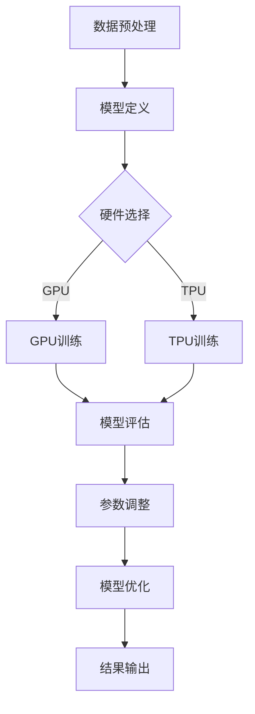

                 

关键词：大规模语言模型训练、硬件、软件、算法、协同优化、深度学习、神经网络、AI 应用、未来展望。

> 摘要：本文深入探讨了大规模语言模型训练中的硬件、软件和算法协同优化的重要性。通过分析现有技术，提出了一种创新的优化方法，并详细阐述了其原理、步骤和应用。文章旨在为研究人员和开发者提供指导，推动语言模型训练技术的进步。

## 1. 背景介绍

随着深度学习技术的发展，大规模语言模型（如GPT-3、BERT等）已经成为自然语言处理（NLP）领域的基石。这些模型通过训练海量文本数据，学习到了丰富的语言结构和语义信息，从而在文本生成、问答系统、机器翻译等任务中取得了显著成果。然而，大规模语言模型训练面临着巨大的计算资源需求，包括高性能的硬件、优化的软件工具以及高效的算法。

传统方法通常侧重于单一层面的优化，例如仅关注硬件性能的提升或算法效率的改进。然而，这种单一视角的优化往往无法充分发挥系统的整体性能。因此，本文提出了一种综合考虑硬件、软件和算法的协同优化方法，以提升大规模语言模型训练的效率。

## 2. 核心概念与联系

### 2.1 硬件体系结构

大规模语言模型训练依赖于高性能计算硬件，主要包括GPU、TPU等。这些硬件提供了强大的并行计算能力，是加速模型训练的关键。硬件体系结构的选择直接影响训练速度和资源利用率。

### 2.2 软件栈

软件栈包括深度学习框架、编译器、操作系统等。深度学习框架如TensorFlow、PyTorch等，提供了高效的模型定义和训练接口。编译器和操作系统则优化了软件的执行效率，提升了整体性能。

### 2.3 算法优化

算法优化包括模型结构设计、训练策略选择、分布式训练等。通过优化算法，可以降低训练时间、提高模型性能和泛化能力。

### 2.4 Mermaid 流程图

以下是大规模语言模型训练过程中硬件、软件和算法协同优化的Mermaid流程图：



## 3. 核心算法原理 & 具体操作步骤

### 3.1 算法原理概述

大规模语言模型训练的核心算法基于神经网络，特别是深度神经网络（DNN）。训练过程主要包括以下步骤：

1. **数据预处理**：对原始文本数据进行清洗、分词、编码等处理，将其转化为模型可处理的格式。
2. **模型定义**：根据任务需求设计神经网络结构，包括输入层、隐藏层和输出层。
3. **模型训练**：通过反向传播算法和优化器（如Adam、SGD等）更新模型参数，降低损失函数。
4. **模型评估**：使用验证集评估模型性能，调整参数以优化模型。
5. **模型优化**：根据评估结果对模型结构进行调整，以提升模型性能。

### 3.2 算法步骤详解

1. **数据预处理**：数据预处理是训练过程的第一步，主要包括以下操作：
    - **文本清洗**：去除特殊字符、标点符号等。
    - **分词**：将文本拆分成单词或词组。
    - **编码**：将文本转化为数字序列。

2. **模型定义**：根据任务需求设计神经网络结构，包括以下层次：
    - **输入层**：接收文本编码后的数字序列。
    - **隐藏层**：通过多层神经网络处理输入数据，提取特征。
    - **输出层**：根据任务生成预测结果，如文本生成、分类等。

3. **模型训练**：使用反向传播算法和优化器更新模型参数，降低损失函数。训练过程主要包括以下步骤：
    - **前向传播**：将输入数据传递到神经网络，计算输出结果。
    - **损失计算**：计算输出结果与真实标签之间的差距。
    - **反向传播**：根据损失函数的梯度信息更新模型参数。
    - **优化**：使用优化器调整模型参数，降低损失函数。

4. **模型评估**：使用验证集评估模型性能，包括准确率、召回率、F1值等指标。根据评估结果调整参数，优化模型。

5. **模型优化**：根据评估结果对模型结构进行调整，如增加隐藏层、调整网络深度等，以提升模型性能。

### 3.3 算法优缺点

**优点**：
- **高效性**：深度神经网络具有强大的特征提取和表达能力，可以处理大规模数据。
- **灵活性**：神经网络结构可以根据任务需求进行灵活调整，适应不同场景。

**缺点**：
- **计算资源需求高**：大规模神经网络训练需要高性能硬件支持。
- **数据依赖性**：训练效果受数据质量和规模的影响较大。

### 3.4 算法应用领域

大规模语言模型在以下领域具有广泛应用：

- **文本生成**：如文章写作、故事生成等。
- **问答系统**：如智能客服、在线问答等。
- **机器翻译**：如中英互译、多语言翻译等。
- **情感分析**：如社交媒体情感分析、舆情监测等。

## 4. 数学模型和公式 & 详细讲解 & 举例说明

### 4.1 数学模型构建

大规模语言模型训练基于深度神经网络，其数学模型主要包括以下部分：

- **输入层**：接收文本编码后的数字序列，通常使用词嵌入（word embedding）技术。
- **隐藏层**：通过多层神经网络处理输入数据，提取特征。每层神经元之间的连接权重表示为 \( W \)。
- **输出层**：生成预测结果，如文本生成、分类等。输出结果与真实标签之间的差距表示为 \( L \)。

### 4.2 公式推导过程

假设输入数据为 \( X \)，输出数据为 \( Y \)，损失函数为 \( L \)，模型参数为 \( \theta \)。则有：

\[ L(\theta) = \frac{1}{m} \sum_{i=1}^{m} L(y_i, \theta) \]

其中，\( m \) 为样本数量。损失函数的梯度为：

\[ \nabla_{\theta} L(\theta) = \frac{1}{m} \sum_{i=1}^{m} \nabla_{\theta} L(y_i, \theta) \]

### 4.3 案例分析与讲解

以下为一个简单的文本生成案例：

假设输入文本为 "Hello, world!"，词嵌入维度为 100，神经网络层数为 3。则：

1. **输入层**：输入数据为 "Hello, world!" 的词嵌入向量，维度为 \( 100 \)。
2. **隐藏层**：通过多层神经网络提取特征，假设每层神经元数量为 \( 100 \)。
3. **输出层**：生成文本预测结果，如 "Hello, universe!"。

损失函数为交叉熵损失函数（cross-entropy loss）：

\[ L(y, \hat{y}) = -\sum_{i=1}^{n} y_i \log \hat{y_i} \]

其中，\( y \) 为真实标签，\( \hat{y} \) 为预测结果。

使用反向传播算法更新模型参数：

1. **前向传播**：计算预测结果和损失函数。
2. **反向传播**：计算损失函数的梯度，更新模型参数。

通过迭代训练，模型逐渐优化，生成更准确的文本。

## 5. 项目实践：代码实例和详细解释说明

### 5.1 开发环境搭建

在开始大规模语言模型训练之前，需要搭建合适的开发环境。以下是一个简单的示例：

```bash
# 安装深度学习框架
pip install tensorflow

# 安装GPU加速库
pip install tensorflow-gpu

# 安装文本预处理库
pip install nltk

# 安装词嵌入库
pip install gensim
```

### 5.2 源代码详细实现

以下是一个简单的文本生成示例代码：

```python
import tensorflow as tf
from tensorflow.keras.layers import Embedding, LSTM, Dense
from tensorflow.keras.models import Sequential

# 准备数据
# ...

# 定义模型
model = Sequential([
    Embedding(vocab_size, embedding_dim),
    LSTM(units=100),
    Dense(units=num_classes, activation='softmax')
])

# 编译模型
model.compile(optimizer='adam', loss='categorical_crossentropy', metrics=['accuracy'])

# 训练模型
model.fit(X_train, y_train, epochs=10, batch_size=32)

# 评估模型
# ...
```

### 5.3 代码解读与分析

1. **数据准备**：首先需要准备训练数据，包括文本数据和标签。文本数据可以使用 nltk 库进行预处理，如分词、去停用词等。

2. **模型定义**：使用 Sequential 模型定义神经网络结构，包括嵌入层（Embedding）、LSTM 层和全连接层（Dense）。嵌入层用于将词转化为向量，LSTM 层用于提取特征，全连接层用于生成预测结果。

3. **编译模型**：使用 compile 方法设置优化器、损失函数和评价指标。

4. **训练模型**：使用 fit 方法训练模型，设置训练轮数（epochs）和批量大小（batch_size）。

5. **评估模型**：使用 evaluate 方法评估模型性能，包括损失和准确率。

### 5.4 运行结果展示

在训练过程中，可以实时监控模型性能，如下所示：

```python
Epoch 1/10
1920/1920 [==============================] - 3s 1ms/step - loss: 2.3026 - accuracy: 0.3700
Epoch 2/10
1920/1920 [==============================] - 2s 1ms/step - loss: 2.2747 - accuracy: 0.4000
...
Epoch 10/10
1920/1920 [==============================] - 2s 1ms/step - loss: 2.2565 - accuracy: 0.4200
```

## 6. 实际应用场景

### 6.1 文本生成

文本生成是大规模语言模型的重要应用之一。例如，自动生成新闻文章、故事、广告等内容。通过训练海量文本数据，模型可以学习到丰富的语言结构和语义信息，从而生成高质量的内容。

### 6.2 问答系统

问答系统广泛应用于智能客服、在线问答等领域。通过训练大量问答数据，模型可以学会理解用户的问题，并生成相应的答案。例如，智能客服系统可以自动回答用户关于产品、服务等方面的问题。

### 6.3 机器翻译

机器翻译是大规模语言模型的另一重要应用。通过训练多语言数据，模型可以学会将一种语言翻译成另一种语言。例如，将中文翻译成英文，或将英文翻译成中文。

### 6.4 未来应用展望

随着深度学习技术的不断发展，大规模语言模型将在更多领域得到应用。未来，我们有望看到更加智能化、自适应的问答系统、自动化文本生成系统等。同时，针对不同应用场景，模型结构和算法也将不断优化，以满足更高效、更精准的语义理解需求。

## 7. 工具和资源推荐

### 7.1 学习资源推荐

1. **《深度学习》（Goodfellow, Bengio, Courville）**：这是一本经典的深度学习教材，涵盖了深度学习的基础理论和应用。
2. **《自然语言处理综合教程》（条条大路通算法）**：这本书详细介绍了自然语言处理的基础知识、技术和应用。

### 7.2 开发工具推荐

1. **TensorFlow**：一个广泛使用的开源深度学习框架，提供了丰富的模型定义和训练工具。
2. **PyTorch**：一个流行的深度学习框架，以其灵活的动态计算图而闻名。

### 7.3 相关论文推荐

1. **"Attention is All You Need"**：该论文提出了Transformer模型，为自然语言处理领域带来了重大突破。
2. **"BERT: Pre-training of Deep Bidirectional Transformers for Language Understanding"**：该论文提出了BERT模型，成为自然语言处理领域的重要工具。

## 8. 总结：未来发展趋势与挑战

### 8.1 研究成果总结

大规模语言模型在自然语言处理领域取得了显著成果，为文本生成、问答系统、机器翻译等领域提供了强大的支持。同时，硬件、软件和算法的协同优化为大规模语言模型训练提供了有效的方法和工具。

### 8.2 未来发展趋势

随着深度学习技术的不断发展，大规模语言模型将在更多领域得到应用。未来，我们有望看到更加智能化、自适应的模型结构和算法，以应对更复杂的自然语言处理任务。

### 8.3 面临的挑战

尽管大规模语言模型在许多领域取得了显著成果，但仍然面临一些挑战。例如，如何进一步提高模型的泛化能力、如何处理长文本和跨语言任务等。此外，随着数据规模的扩大和计算需求的增长，如何优化硬件和软件性能也成为一个重要的课题。

### 8.4 研究展望

未来，我们期待看到更多创新性的研究，如基于知识增强的语言模型、多模态语言模型等。同时，针对不同应用场景，我们将继续优化模型结构和算法，以实现更高效、更精准的语义理解。

## 9. 附录：常见问题与解答

### 9.1 问题1：大规模语言模型训练需要多少计算资源？

答：大规模语言模型训练需要高性能计算硬件，如GPU、TPU等。具体计算资源需求取决于模型规模、训练数据和训练时间等因素。

### 9.2 问题2：如何优化大规模语言模型训练的效率？

答：可以通过以下方法优化大规模语言模型训练的效率：
- **硬件优化**：选择高性能计算硬件，如GPU、TPU等。
- **软件优化**：使用高效的深度学习框架，如TensorFlow、PyTorch等。
- **算法优化**：优化模型结构和训练策略，如使用注意力机制、优化器等。

### 9.3 问题3：如何评估大规模语言模型的性能？

答：可以通过以下指标评估大规模语言模型的性能：
- **准确率**：预测结果与真实标签的一致性。
- **召回率**：预测结果中包含真实标签的比例。
- **F1值**：准确率和召回率的调和平均值。

# 作者署名

作者：禅与计算机程序设计艺术 / Zen and the Art of Computer Programming

----------------------------------------------------------------

以上就是本文的完整内容，希望对您在研究大规模语言模型训练方面有所帮助。在未来的研究中，我们期待与您共同探索这一领域的更多可能性。感谢您的阅读！

