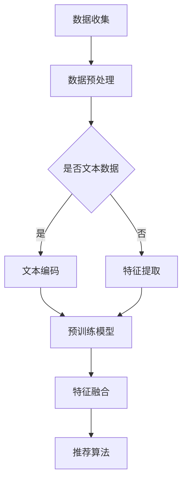

                 

关键词：大规模预训练语言模型，推荐系统，应用价值，算法原理，实践案例，未来展望

> 摘要：本文深入探讨了大规模预训练语言模型在推荐系统中的应用价值，从核心概念、算法原理、数学模型、项目实践等多个角度进行了全面的分析。通过实际案例展示，本文揭示了预训练语言模型在提升推荐系统准确性和用户体验方面的巨大潜力，并对未来应用前景和面临的挑战进行了展望。

## 1. 背景介绍

随着互联网的快速发展，推荐系统已经成为了各类在线服务中不可或缺的组成部分。从电商平台的商品推荐，到社交媒体的个性化内容推送，推荐系统极大地提升了用户的满意度，并且为平台带来了可观的商业价值。然而，传统的推荐算法在处理海量数据和复杂用户行为时，仍面临着诸多挑战，如数据稀疏性、冷启动问题等。

近年来，预训练语言模型（如BERT、GPT等）在自然语言处理领域取得了显著的突破。这些模型通过大规模无监督数据预训练，可以捕获丰富的语言特征，从而在诸如文本分类、问答系统等任务中表现出色。那么，如何将预训练语言模型应用于推荐系统，发挥其潜力，成为当前研究的热点。

本文旨在探讨大规模预训练语言模型在推荐系统中的应用价值，通过深入分析其算法原理、数学模型和实践案例，为推荐系统的发展提供新的思路和方法。

## 2. 核心概念与联系

### 2.1 预训练语言模型

预训练语言模型是一种利用大规模语料库进行预训练，以获得语言特征的深度神经网络模型。典型的预训练语言模型包括BERT（Bidirectional Encoder Representations from Transformers）、GPT（Generative Pre-trained Transformer）等。这些模型通过预训练任务（如Masked Language Model，MLM）学习到语言的上下文关系，从而在下游任务中表现出强大的泛化能力。

### 2.2 推荐系统

推荐系统是一种基于用户兴趣、历史行为等信息的系统，旨在向用户推荐感兴趣的内容或商品。推荐系统通常分为基于内容的推荐和基于协同过滤的推荐。基于内容的推荐通过分析用户的历史行为和内容特征，为用户推荐相似的内容；而基于协同过滤的推荐则通过分析用户之间的相似性，为用户推荐其他用户的喜好。

### 2.3 预训练语言模型与推荐系统的联系

预训练语言模型在推荐系统中的应用主要体现在两个方面：

1. **用户特征提取**：预训练语言模型可以捕捉到用户的语言表达习惯和兴趣点，从而为用户生成高维、丰富的特征向量，这些特征向量可以用于构建用户画像，提高推荐系统的准确性。

2. **文本内容理解**：在基于内容的推荐场景中，预训练语言模型可以用于对文本内容进行深入理解，提取出关键信息和语义特征，从而提高推荐的准确性和多样性。

下面是一个简化的Mermaid流程图，展示了预训练语言模型在推荐系统中的应用流程：

## 3. 核心算法原理 & 具体操作步骤

### 3.1 算法原理概述

大规模预训练语言模型在推荐系统中的应用主要基于以下原理：

1. **语言特征提取**：预训练语言模型通过预训练任务学习到语言的上下文关系，可以提取出文本的深层语义特征。

2. **用户特征建模**：通过预训练语言模型，可以将用户的语言行为转化为高维的、连续的向量表示，从而构建用户画像。

3. **文本内容理解**：预训练语言模型可以对文本内容进行深入理解，提取出关键信息和语义特征，提高推荐的准确性。

### 3.2 算法步骤详解

1. **数据收集与预处理**：收集用户行为数据（如浏览历史、购买记录等）和文本数据（如商品描述、用户评论等）。对数据进行清洗和预处理，包括去重、填充缺失值等。

2. **文本编码**：使用预训练语言模型（如BERT）对文本数据进行编码，生成文本的向量表示。

3. **用户特征提取**：将用户的行为数据转化为向量表示，并结合文本编码结果，通过神经网络模型进行融合，生成用户特征向量。

4. **推荐算法**：利用用户特征向量，结合推荐算法（如基于内容的推荐、协同过滤等），为用户生成推荐结果。

5. **评估与优化**：通过评估指标（如准确率、召回率、覆盖率等）对推荐系统进行评估，并根据评估结果进行优化。

### 3.3 算法优缺点

**优点**：

1. **高准确性**：预训练语言模型可以提取出文本的深层语义特征，提高推荐系统的准确性。

2. **强泛化能力**：预训练语言模型在预训练阶段已经学习到丰富的语言特征，具有很好的泛化能力。

3. **多样化推荐**：通过深入理解文本内容，可以生成多样化的推荐结果。

**缺点**：

1. **计算资源消耗大**：预训练语言模型需要大量的计算资源和时间。

2. **数据依赖性强**：预训练语言模型的效果很大程度上依赖于数据质量和数量。

### 3.4 算法应用领域

大规模预训练语言模型在推荐系统中的应用领域非常广泛，包括但不限于：

1. **电商平台**：通过预训练语言模型，为用户推荐感兴趣的商品。

2. **社交媒体**：根据用户的语言行为和兴趣，为用户推荐个性化内容。

3. **资讯平台**：通过预训练语言模型，为用户推荐感兴趣的新闻资讯。

## 4. 数学模型和公式 & 详细讲解 & 举例说明

### 4.1 数学模型构建

在推荐系统中，预训练语言模型的核心作用是提取用户和文本的特征向量。下面是构建数学模型的步骤：

1. **用户特征提取**：

   用户特征向量 \( \textbf{u} \) 可以通过以下公式计算：

   $$ \textbf{u} = \text{ embed }(\text{user\_behavior}) + \text{pool}(\text{tex

