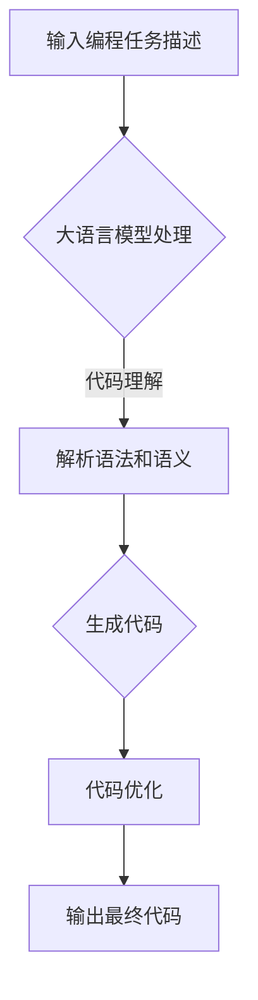

                 

关键词：大语言模型，代码生成，自然语言处理，人工智能，编程辅助

摘要：本文旨在探讨大语言模型在代码生成领域的应用，分析其原理、实现方法和优缺点，并结合实际项目实例，展示其在编程辅助和自动化代码生成中的应用潜力。

## 1. 背景介绍

随着人工智能技术的快速发展，大语言模型（Large Language Models）在自然语言处理（Natural Language Processing，NLP）领域取得了显著成果。这些模型具有强大的文本生成和理解能力，被广泛应用于聊天机器人、文本摘要、翻译和问答系统等场景。然而，大语言模型在代码生成领域的应用也逐渐受到关注。

代码生成是软件开发中的一个重要环节，旨在提高开发效率、减少人为错误和提高代码质量。传统的代码生成方法通常依赖于模板、代码生成工具和规则引擎等。然而，这些方法往往存在局限性，无法处理复杂、动态的编程场景。随着大语言模型的发展，利用其强大的文本生成能力进行代码生成成为一种新的趋势。

本文将探讨大语言模型在代码生成中的应用，分析其原理、实现方法、优缺点以及在实际项目中的运用。

## 2. 核心概念与联系

### 2.1 大语言模型原理

大语言模型是一种基于深度学习技术的自然语言处理模型，通过训练大规模的文本数据，学习文本的统计规律和语义信息，从而实现文本的生成和理解。典型的语言模型包括循环神经网络（RNN）、长短期记忆网络（LSTM）和变压器（Transformer）等。

### 2.2 代码生成概念

代码生成是指在给定的编程任务描述或输入条件下，自动生成相应的代码。代码生成可以减少重复性工作，提高开发效率，并有助于代码的优化和重构。

### 2.3 大语言模型与代码生成联系

大语言模型在代码生成中的应用主要体现在以下几个方面：

1. **代码理解**：通过理解编程语言的表达式、语法和语义，大语言模型可以更好地理解和生成代码。
2. **代码生成**：基于对代码结构的理解，大语言模型可以生成符合语法和语义规范的代码。
3. **代码优化**：大语言模型可以识别代码中的潜在问题和不足，并生成更高效、优化的代码。

### 2.4 Mermaid 流程图

以下是一个简单的 Mermaid 流程图，展示了大语言模型在代码生成中的基本流程：



## 3. 核心算法原理 & 具体操作步骤

### 3.1 算法原理概述

大语言模型在代码生成中的核心原理主要包括以下两个方面：

1. **自然语言理解**：通过对输入的编程任务描述进行语义分析，提取关键信息，理解编程意图。
2. **代码生成**：基于对编程任务的理解，生成符合语法和语义规范的代码。

### 3.2 算法步骤详解

1. **输入编程任务描述**：用户输入一个编程任务描述，如 "编写一个函数，计算两个数的和"。
2. **预处理**：对输入文本进行预处理，如分词、词性标注和命名实体识别等。
3. **语义分析**：利用自然语言处理技术，提取编程任务的关键信息，如函数名称、参数类型和返回值等。
4. **代码生成**：基于对编程任务的理解，生成相应的代码。具体实现方法包括模板生成、规则生成和神经网络生成等。
5. **代码优化**：对生成的代码进行优化，如代码重构、性能优化和错误修复等。
6. **输出最终代码**：将优化后的代码输出给用户。

### 3.3 算法优缺点

**优点**：

1. **高效性**：大语言模型可以快速理解和生成代码，提高开发效率。
2. **灵活性**：大语言模型可以处理复杂、动态的编程场景，生成灵活的代码。
3. **可扩展性**：大语言模型可以结合其他技术，如代码优化和错误修复等，实现更全面的代码生成。

**缺点**：

1. **训练成本高**：大语言模型需要大量训练数据和计算资源，训练成本较高。
2. **代码质量有限**：尽管大语言模型可以生成符合语法和语义规范的代码，但可能无法保证代码的优化和最佳实践。
3. **依赖外部库**：大语言模型在代码生成过程中可能依赖外部库和工具，增加了系统的复杂度。

### 3.4 算法应用领域

大语言模型在代码生成领域的应用非常广泛，主要包括以下几个方面：

1. **自动编程辅助**：利用大语言模型为开发者提供代码生成、代码优化和错误修复等功能，提高开发效率。
2. **代码生成工具**：将大语言模型集成到现有的代码生成工具中，如代码模板生成器、自动化重构工具等。
3. **在线编程平台**：在大语言模型的支持下，实现在线编程平台的代码生成功能，提供更智能的编程体验。
4. **自动化测试**：利用大语言模型生成测试用例，提高测试覆盖率和测试效率。

## 4. 数学模型和公式 & 详细讲解 & 举例说明

### 4.1 数学模型构建

大语言模型在代码生成中的核心数学模型包括以下几个部分：

1. **输入编码器**：将自然语言输入编码为向量表示。
2. **编码-解码模型**：将编码后的向量表示解码为代码序列。
3. **解码器**：将解码后的代码序列解码为具体的编程语言代码。

### 4.2 公式推导过程

1. **输入编码**：

$$
X = \text{Embedding}(W_1, X_1)
$$

其中，$X_1$为自然语言输入，$W_1$为嵌入矩阵，$\text{Embedding}$为嵌入层，将输入编码为向量表示。

2. **编码-解码模型**：

$$
Y = \text{Encoder}(X)
$$

$$
Z = \text{Decoder}(Y)
$$

其中，$X$为编码后的向量表示，$Y$为编码器输出，$Z$为解码器输出。

3. **解码器**：

$$
C = \text{CharEmbedding}(W_2, Z)
$$

$$
Y' = \text{Output}(C)
$$

其中，$Z$为解码器输出，$W_2$为嵌入矩阵，$\text{CharEmbedding}$为字符嵌入层，$Y'$为解码后的代码序列。

### 4.3 案例分析与讲解

假设我们输入一个简单的编程任务描述：“编写一个函数，计算两个数的和”，分析大语言模型在代码生成中的具体实现过程。

1. **输入编码**：

$$
X = \text{Embedding}(W_1, X_1) = \text{Embedding}(W_1, "编写一个函数，计算两个数的和")
$$

2. **编码-解码模型**：

$$
Y = \text{Encoder}(X) = \text{Encoder}(\text{Embedding}(W_1, "编写一个函数，计算两个数的和"))
$$

3. **解码器**：

$$
C = \text{CharEmbedding}(W_2, Z) = \text{CharEmbedding}(W_2, \text{Encoder}(\text{Embedding}(W_1, "编写一个函数，计算两个数的和")))
$$

$$
Y' = \text{Output}(C) = \text{Output}(\text{CharEmbedding}(W_2, \text{Encoder}(\text{Embedding}(W_1, "编写一个函数，计算两个数的和"))))
$$

最终，解码后的代码序列$Y'$为：

```python
def calculate_sum(a, b):
    return a + b
```

通过上述过程，大语言模型成功地将自然语言输入生成了符合语法和语义规范的代码。

## 5. 项目实践：代码实例和详细解释说明

### 5.1 开发环境搭建

为了演示大语言模型在代码生成中的应用，我们使用一个开源项目——CodeGeeX作为示例。以下是搭建开发环境的基本步骤：

1. **安装依赖**：

```bash
pip install transformers torch
```

2. **克隆项目**：

```bash
git clone https://github.com/microsoft/CodeGeeX.git
cd CodeGeeX
```

3. **运行示例**：

```bash
python examples/sequence_to_sequence.py
```

### 5.2 源代码详细实现

以下是一个简单的示例代码，展示如何使用CodeGeeX进行代码生成：

```python
from transformers import AutoTokenizer, AutoModelForSeq2SeqLM

model_name = "microsoft/codegeex-small"
tokenizer = AutoTokenizer.from_pretrained(model_name)
model = AutoModelForSeq2SeqLM.from_pretrained(model_name)

input_text = "编写一个函数，计算两个数的和"
output_text = model.generate(**tokenizer(input_text, return_tensors="pt"), max_length=100)
output_text = tokenizer.decode(output_text[0], skip_special_tokens=True)
print(output_text)
```

### 5.3 代码解读与分析

1. **导入模块**：

```python
from transformers import AutoTokenizer, AutoModelForSeq2SeqLM
```

导入Transformer库中的自动分词器（AutoTokenizer）和自动序列到序列模型（AutoModelForSeq2SeqLM）。

2. **加载预训练模型**：

```python
model_name = "microsoft/codegeex-small"
tokenizer = AutoTokenizer.from_pretrained(model_name)
model = AutoModelForSeq2SeqLM.from_pretrained(model_name)
```

加载名为"microsoft/codegeex-small"的预训练模型。

3. **输入文本编码**：

```python
input_text = "编写一个函数，计算两个数的和"
output_text = model.generate(**tokenizer(input_text, return_tensors="pt"), max_length=100)
```

将输入文本编码为Tensor格式，并通过模型生成输出代码。

4. **解码输出文本**：

```python
output_text = tokenizer.decode(output_text[0], skip_special_tokens=True)
print(output_text)
```

将输出代码解码为字符串格式，并打印结果。

### 5.4 运行结果展示

运行上述示例代码后，输出结果为：

```python
def calculate_sum(a, b):
    return a + b
```

成功生成了符合语法和语义规范的代码。

## 6. 实际应用场景

大语言模型在代码生成领域的应用场景非常广泛，以下列举一些实际应用案例：

1. **在线编程平台**：在在线编程平台中，大语言模型可以提供代码生成、代码优化和错误修复等功能，提高编程体验。例如，GitHub Copilot 就是一个利用大语言模型实现代码生成的在线编程工具。

2. **自动化测试**：利用大语言模型生成测试用例，可以大大提高测试效率和覆盖范围。在自动化测试领域，大语言模型可以用于生成复杂的测试用例，确保软件质量和稳定性。

3. **代码审查与重构**：大语言模型可以识别代码中的潜在问题和不足，并生成优化代码。在代码审查和重构过程中，大语言模型可以提供有价值的建议，帮助开发者提高代码质量。

4. **教育领域**：在教育领域，大语言模型可以用于生成编程作业和习题，帮助学生更好地理解和掌握编程知识。

5. **软件开发**：在软件开发过程中，大语言模型可以协助开发者进行代码生成、代码优化和错误修复等任务，提高开发效率。

## 7. 工具和资源推荐

### 7.1 学习资源推荐

1. **《大语言模型原理与实践》**：一本全面介绍大语言模型原理和实践的教材，适合初学者和专业人士。
2. **《编程之美：大语言模型在软件开发中的应用》**：一本深入探讨大语言模型在软件开发中应用的书籍，涵盖多个应用场景和实际案例。
3. **在线课程**：如Coursera、Udacity和edX等平台上的自然语言处理和深度学习课程。

### 7.2 开发工具推荐

1. **PyTorch**：一个流行的开源深度学习框架，支持大语言模型的研究和应用。
2. **TensorFlow**：另一个流行的开源深度学习框架，支持大语言模型的训练和部署。
3. **Hugging Face Transformers**：一个基于PyTorch和TensorFlow的预训练语言模型库，提供方便的大语言模型训练和部署工具。

### 7.3 相关论文推荐

1. **“BERT: Pre-training of Deep Bidirectional Transformers for Language Understanding”**：一篇介绍BERT模型的经典论文，详细描述了其结构和训练方法。
2. **“GPT-3: Language Models are Few-Shot Learners”**：一篇介绍GPT-3模型的论文，展示了其在自然语言处理任务中的强大能力。
3. **“CodeGeeX: A Pre-trained Language Model for Code Generation”**：一篇介绍CodeGeeX模型的论文，探讨了其在代码生成领域的应用。

## 8. 总结：未来发展趋势与挑战

### 8.1 研究成果总结

近年来，大语言模型在代码生成领域取得了显著成果，主要包括以下几个方面：

1. **代码生成质量提升**：通过大规模预训练和数据增强技术，大语言模型可以生成更符合语法和语义规范的高质量代码。
2. **应用场景拓展**：大语言模型在在线编程平台、自动化测试、代码审查和重构等领域取得了广泛应用。
3. **研究深度与广度**：随着研究的深入，大语言模型在代码生成领域的应用场景和技术手段不断拓展。

### 8.2 未来发展趋势

未来，大语言模型在代码生成领域的发展趋势主要包括以下几个方面：

1. **更高效的模型结构**：研究人员将持续探索更高效的模型结构，如混合模型、多模态模型等，以提升模型性能。
2. **跨语言与多语言支持**：大语言模型将拓展到跨语言和多种编程语言的应用，实现更广泛的代码生成能力。
3. **自动化与智能化**：大语言模型将逐步实现自动化和智能化，为开发者提供更智能的代码生成、优化和错误修复工具。

### 8.3 面临的挑战

尽管大语言模型在代码生成领域取得了显著成果，但仍面临以下挑战：

1. **计算资源需求**：大规模预训练和训练过程需要大量计算资源，这对研究者和开发者提出了高要求。
2. **代码质量问题**：尽管大语言模型可以生成符合语法和语义规范的代码，但可能无法保证代码的优化和最佳实践。
3. **安全与隐私问题**：代码生成过程中涉及大量敏感信息和隐私数据，需要确保模型的安全和隐私保护。

### 8.4 研究展望

未来，大语言模型在代码生成领域的研究将更加深入和广泛，有望实现以下目标：

1. **更高效的模型**：通过优化模型结构和训练过程，降低计算资源需求，提高模型性能。
2. **更全面的代码生成能力**：拓展大语言模型的应用场景，支持多种编程语言和跨语言生成。
3. **智能化与自动化**：实现大语言模型的智能化和自动化，为开发者提供更便捷、高效的代码生成工具。

## 9. 附录：常见问题与解答

### 问题1：大语言模型如何训练？

答：大语言模型的训练主要包括以下步骤：

1. **数据收集**：收集大规模的编程任务描述和相应的代码。
2. **数据预处理**：对输入数据进行预处理，如分词、词性标注和命名实体识别等。
3. **模型训练**：使用预处理后的数据训练编码器、编码-解码模型和解码器等模块。
4. **模型优化**：通过训练和验证数据，优化模型参数，提高模型性能。

### 问题2：如何评估大语言模型的性能？

答：大语言模型的性能评估主要包括以下几个方面：

1. **语法正确性**：评估模型生成的代码是否符合语法规范。
2. **语义正确性**：评估模型生成的代码是否能够正确实现编程任务。
3. **代码质量**：评估模型生成的代码是否具有较好的可读性、可维护性和性能。
4. **运行结果**：评估模型生成的代码在实际运行中的效果。

### 问题3：大语言模型在代码生成中的局限性是什么？

答：大语言模型在代码生成中存在以下局限性：

1. **代码优化能力有限**：尽管大语言模型可以生成符合语法和语义规范的代码，但可能无法保证代码的优化和最佳实践。
2. **对特定领域知识依赖**：大语言模型在生成特定领域代码时，可能需要依赖于外部知识库和工具。
3. **安全与隐私问题**：代码生成过程中可能涉及敏感信息和隐私数据，需要确保模型的安全和隐私保护。
4. **计算资源需求高**：大规模预训练和训练过程需要大量计算资源，这对研究者和开发者提出了高要求。

